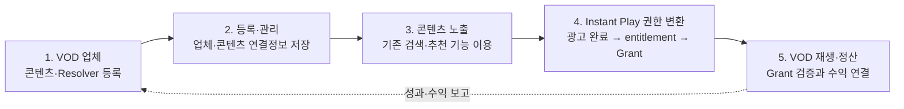

# Instant Play Platform

HLS/DASH, DRM, ABR와 TV Player의 일반적인 미디어 처리 과정은 [TV 플랫폼 기반 VOD 스트리밍 구조와 처리 흐름](./vod_app_platform_streaming.md) 문서에서 설명한다. 이 문서는 그 스트리밍 기반 위에서 광고 시청 완료를 VOD 콘텐츠의 entitlement로 변환하는 비로그인 Instant Play 서비스에 집중한다.

## 1. 정의

**Instant Play**는 사용자가 VOD 서비스 앱을 설치하거나 VOD 서비스 계정으로 로그인하지 않고, 플랫폼이 제공하는 광고를 의무적으로 시청한 후 VOD 콘텐츠를 즉시 재생하는 서비스다.

```text
플랫폼에서 콘텐츠 발견
→ 로그인 없이 Instant Play 선택
→ 필수 광고 재생
→ 광고 시청 완료 검증
→ 콘텐츠 한 건에 대한 단기 재생 권한 발급
→ Platform Player가 VOD 콘텐츠 직접 재생
```

Instant Play의 핵심 명제는 다음과 같다.

> 사용자의 VOD 계정 entitlement를 광고 시청으로 대체하고, 검증된 광고 시청 완료를 특정 콘텐츠의 일회성·단기 재생 권한으로 변환한다.

> **주석 — Instant Play에서의 entitlement**  
> `entitlement`는 법률상 콘텐츠 권리 자체가 아니라, 사용자가 특정 콘텐츠를 정해진 조건에서 이용할 수 있다는 **시스템상의 이용 자격**을 뜻한다. 일반 VOD에서는 로그인 사용자의 구독·구매 여부로 entitlement를 확인하지만, Instant Play에서는 필수 광고의 검증된 시청 완료가 해당 콘텐츠 한 건에 대한 **광고 시청 기반 일회성 재생 자격(ad-funded entitlement)**을 생성한다. 이 자격을 확인한 Content Access Gate가 실제 API 호출에 사용할 단기 `Content Access Grant`를 발급하고, 이후 DRM 시스템이 콘텐츠 복호화를 위한 License를 발급한다. 따라서 `entitlement`는 이용 자격, `Content Access Grant`는 그 자격을 증명하는 기술 토큰, `DRM License`는 보호 콘텐츠의 복호화·재생 권한으로 구분한다.

따라서 사용자는 광고를 건너뛰고 콘텐츠를 재생할 수 없다. 광고가 완료되지 않았거나 완료 사실을 검증할 수 없으면 콘텐츠 재생 권한을 발급하지 않는다.

### 로그인 없음의 의미

“로그인 없음”은 VOD 벤더 계정 인증이 필요 없다는 뜻이다. 서비스 보안까지 없다는 뜻은 아니다.

- VOD 서비스 로그인: 불필요
- VOD 앱 설치·실행: 불필요
- 플랫폼 장치·서비스 인증: 필요
- 광고 측정용 세션: 필요
- 개인정보 동의: 법률과 광고 방식에 따라 필요
- 콘텐츠별 단기 Access Grant: 필요
- DRM 라이선스: 보호 콘텐츠라면 필요

플랫폼은 사용자를 VOD 계정으로 식별하지 않고, 짧은 수명의 가명 또는 익명 플랫폼 세션으로 광고와 재생을 연결한다.

---

## 2. 일반 VOD와 Instant Play의 차이

| 구분 | 일반 VOD 앱 재생 | Instant Play |
|---|---|---|
| 앱 | 벤더 앱 설치·실행 | 앱 없음 |
| 사용자 권리 | 로그인, 구독, 구매 | 필수 광고 시청 완료 |
| 재생 UI | VOD 앱 | 플랫폼 검색·추천 UI |
| 재생 제어 | 앱과 벤더 Player 연동 | Platform Player |
| 콘텐츠 연결 | 앱 내부 콘텐츠 ID | 사전 등록된 Content Descriptor |
| 재생 세션 | 로그인 토큰으로 발급 | Ad Completion Proof에서 유래한 Content Access Grant로 발급 |
| 수익원 | 구독·구매·광고 | 광고 중심 |
| 수익 배분 | 벤더 내부 | 플랫폼과 VOD 벤더 간 정산 |

---

## 3. 전체 플랫폼 구조

### 3.1 한눈에 보는 구조

플랫폼은 크게 다섯 영역으로 이해할 수 있다.



사용자 관점에서는 다음처럼 동작한다.

1. VOD 업체가 Instant Play 대상 콘텐츠와 Resolver 연결정보를 플랫폼에 등록한다.
2. 플랫폼이 콘텐츠 권리, 재생 연동정보 및 광고 시청 기반 entitlement 지원 여부를 검사한다.
3. 검사에 통과한 콘텐츠를 기존 검색·추천 기능을 통해 사용자에게 표시한다.
4. 사용자가 선택하면 플랫폼이 광고 시청 완료 여부를 검증한다.
5. 검증된 광고 시청 완료를 해당 콘텐츠의 entitlement로 판단하고 Content Access Grant를 발급한다.
6. VOD 업체 Resolver가 Grant를 검증한 후 콘텐츠 재생정보를 제공한다.
7. 동일한 완료·Grant·재생 기록을 광고수익의 VOD 업체 배분 근거로 사용한다.

### 3.2 구성요소 상세 구조

이하에서는 주요 구성요소에 도면부호를 부여하여 설명한다. 각 구성부는 하나 이상의 프로세서가 실행하는 소프트웨어 모듈, 서버, 데이터베이스 또는 이들의 조합으로 구현될 수 있다.

#### 3.2.1 특허의 중심 구성

기존 스트리밍 플랫폼의 콘텐츠 추천 기능과 광고 제공 기능 자체는 본 구조의 중심이 아니다. 본 구조의 핵심은 **검증된 광고 시청 완료를 선택된 VOD 콘텐츠의 이용 자격으로 인정하고, 이를 VOD 업체 시스템이 검증할 수 있는 단기 콘텐츠 재생권한으로 변환하는 것**이다.

여기서 **콘텐츠 이용 자격**은 사용자가 선택된 콘텐츠를 이용할 수 있다는 플랫폼의 논리적 판단이고, **단기 콘텐츠 재생권한**은 그 이용 자격을 VOD 업체 시스템에 증명하는 전자적 권한정보이다.

> **핵심 원리:** VOD 업체의 로그인·구독·구매에 따른 이용 자격을 요구하는 대신, 플랫폼이 확인한 광고 시청 완료를 해당 콘텐츠의 Instant Play 이용 자격으로 사용한다.

**용어 설명**

- Instant Play: 본 문서에서 정의한 서비스의 고유명칭이며, 광고 시청으로 성립한 이용 자격을 이용해 콘텐츠를 즉시 재생하는 방식을 뜻한다.
- VOD: 주문형 비디오 서비스를 뜻하며, 본 문서에서는 콘텐츠와 실제 재생정보를 제공하는 업체 또는 시스템을 가리킨다.
- 콘텐츠 이용 자격: 영문 기술용어 `entitlement`에 해당하며, 특정 콘텐츠를 이용할 수 있다는 시스템상의 판단을 뜻한다.
- 단기 콘텐츠 재생권한: 문서의 영문 규격명 `Content Access Grant`에 해당하며, 콘텐츠 이용 자격을 VOD 업체 시스템에 증명하는 서명된 전자적 권한정보를 뜻한다.
- 재생정보 제공 서버: 영문 기술용어 `Vendor Resolver`에 해당하며, 단기 콘텐츠 재생권한을 확인한 후 실제 재생에 필요한 주소와 허가정보를 제공하는 서버를 뜻한다.

#### 3.2.2 전체 시스템 구성(도 1)

Instant Play 시스템은 **Instant Play 플랫폼(100), VOD 업체 시스템(200), 사용자 단말(300) 및 광고 시청 처리 시스템(400)**을 포함할 수 있다. 도 1에서는 플랫폼(100)을 하나의 블랙박스로 표시하고 외부 시스템과의 관계만 나타낸다. 플랫폼의 내부 구성은 도 2에서 설명한다.

~~~mermaid
flowchart LR
    VOD["VOD 업체 시스템(200)<br/>관리·재생정보·영상전송·재생허가 시스템"]
    PLATFORM["Instant Play 플랫폼(100)<br/>광고 시청 완료 → 콘텐츠 이용 자격 → 단기 콘텐츠 재생권한"]
    USER["사용자 단말(300)"]
    AD["기존 광고 시청 처리 시스템(400)"]

    VOD <-->|"등록정보 및 단기 콘텐츠 재생권한 기반 연동"| PLATFORM
    USER <-->|"Instant Play 요청 / 콘텐츠 제공"| PLATFORM
    AD -->|"광고 시청 완료 결과"| PLATFORM
~~~

VOD 업체 시스템(200)은 등록 단계에서 플랫폼의 업체·콘텐츠 등록 인터페이스(110)에 의존한다. 재생 단계에서는 플랫폼(100)이 광고 시청 완료로 생성된 단기 콘텐츠 재생권한을 VOD 업체 시스템(200)에 제공하고, 그에 대응하는 콘텐츠 재생정보를 획득한다.

#### 3.2.3 Instant Play 플랫폼 내부 구성(도 2)

~~~mermaid
flowchart TB
    VI["업체·콘텐츠 등록 인터페이스(110)"]
    UI["사용자 서비스 인터페이스(115)"]

    REG["등록 관리부(120)"]
    CTRL["Instant Play 제어부(125)"]
    DISC["콘텐츠 제공부(130)<br/>기존 검색·추천 기능 이용"]
    VERIFY["광고 시청 완료 검증부(140)"]
    ENT["콘텐츠 이용 자격 결정부(150)"]
    GRANT["단기 콘텐츠 재생권한 발급부(160)"]
    PLAY["VOD 재생 연동부(170)"]
    SHARE["이벤트·수익 연결부(180)"]
    STORE["저장부(190)<br/>업체·콘텐츠 등록정보<br/>세션·광고완료증명·재생권한·정산기록"]

    VOD["VOD 업체 시스템(200)<br/>재생정보 제공 서버"]
    USER["사용자 단말(300)"]
    AD["광고 시청 처리 시스템(400)"]

    VOD --> VI
    VI --> REG
    REG --> STORE

    USER --> UI
    UI --> CTRL
    CTRL --> DISC
    DISC <--> STORE
    CTRL --> VERIFY
    VERIFY <--> AD
    VERIFY -->|"광고 시청 완료 증명"| ENT
    ENT -->|"콘텐츠 이용 자격"| GRANT
    GRANT -->|"콘텐츠별 단기 콘텐츠 재생권한"| PLAY
    PLAY <--> VOD
    PLAY --> USER

    VERIFY --> STORE
    GRANT --> STORE
    SHARE <--> STORE
    SHARE --> VOD
~~~

#### 3.2.4 플랫폼 구성부의 기능

| 도면부호 | 구성부 | Instant Play와 관련된 기능 |
|---|---|---|
| 110 | 업체·콘텐츠 등록 인터페이스 | VOD 업체가 업체 식별정보, Instant Play 대상 콘텐츠, 권리·제공기간 및 재생정보 제공 서버의 연동정보를 등록하도록 한다. |
| 115 | 사용자 서비스 인터페이스 | 콘텐츠의 검색·추천 결과를 표시하고 사용자의 Instant Play 재생 요청을 수신한다. 검색·추천 방식 자체는 기존 방식을 사용할 수 있다. |
| 120 | 등록 관리부 | 업체별 등록정보를 검증·정규화하고 콘텐츠와 VOD 업체의 재생 연동정보를 연결하여 저장한다. |
| 125 | Instant Play 제어부 | 콘텐츠 선택부터 광고 시청 확인, 콘텐츠 이용 자격 결정, 단기 콘텐츠 재생권한 발급 및 VOD 재생까지의 결합 순서를 제어한다. |
| 130 | 콘텐츠 제공부 | 등록된 Instant Play 가능 콘텐츠를 기존 검색·추천 기능을 통해 사용자에게 노출한다. |
| 140 | 광고 시청 완료 검증부 | 광고의 종류나 제공 방식과 무관하게, 사용자가 Instant Play에 요구된 광고 시청을 완료했는지 검증하고 완료 증명을 생성하거나 수신한다. |
| 150 | 콘텐츠 이용 자격 결정부 | 광고 시청 완료 증명이 선택 콘텐츠, 사용자 세션 및 재생 요청과 일치하는 경우 해당 콘텐츠의 이용 자격을 성립시킨다. |
| 160 | 단기 콘텐츠 재생권한 발급부 | 성립된 콘텐츠 이용 자격을 특정 VOD 업체와 특정 콘텐츠에 한정된 단기·일회성 전자적 재생권한으로 변환한다. |
| 170 | VOD 재생 연동부 | 단기 콘텐츠 재생권한을 VOD 업체의 재생정보 제공 서버에 전달하고, 사용자 로그인 권한정보 없이 재생정보를 획득하여 콘텐츠 재생을 연결한다. |
| 180 | 이벤트·수익 연결부 | 광고 시청 완료, 단기 콘텐츠 재생권한 발급 및 콘텐츠 재생을 동일 세션으로 연결하고, 광고수익 중 VOD 업체 배분액의 근거로 사용한다. |
| 190 | 저장부 | 업체·콘텐츠 등록정보, 세션정보, 광고 시청 완료 증명, 단기 콘텐츠 재생권한 및 수익배분 기록을 저장한다. |

#### 3.2.5 특허상 핵심 결합관계

1. VOD 업체 시스템(200)이 플랫폼의 등록 인터페이스(110)를 이용하여 Instant Play 대상 콘텐츠와 그 재생 연동정보를 등록한다.
2. 사용자가 등록 콘텐츠의 Instant Play 재생을 요청하면 플랫폼은 광고 시청이 해당 콘텐츠의 이용 조건임을 적용한다.
3. 광고 시청 완료 검증부(140)는 광고의 구체적 형태와 무관하게 광고 시청 완료 사실을 검증한다.
4. 콘텐츠 이용 자격 결정부(150)는 검증된 광고 시청 완료를 선택된 콘텐츠에 대한 이용 자격으로 판단한다.
5. 단기 콘텐츠 재생권한 발급부(160)는 그 이용 자격을 콘텐츠·VOD 업체·세션에 결합된 단기 콘텐츠 재생권한으로 변환한다.
6. VOD 재생 연동부(170)는 VOD 업체의 사용자 계정 또는 구독 권한정보 대신 단기 콘텐츠 재생권한을 이용하여 콘텐츠 재생정보를 획득한다.
7. 동일한 광고 시청 완료 기록과 단기 콘텐츠 재생권한 발급 기록은 콘텐츠 재생 및 VOD 업체 수익배분의 공통 근거가 된다.

> **특허의 중심 구조:** 검증된 광고 시청 완료 → 콘텐츠별 이용 자격 성립 → 단기 콘텐츠 재생권한 발급 → VOD 계정의 이용 자격 없이 콘텐츠 재생정보 획득.

### 3.3 내부 항목을 쉽게 설명하면

| 쉬운 한글 이름 | 기술 용어 | Instant Play에서 하는 일 |
|---|---|---|
| 업체·콘텐츠 등록 창구 | Vendor Portal/API | VOD 업체가 Instant Play 대상 콘텐츠와 재생 연결방법을 플랫폼에 등록한다. |
| 등록정보 저장소 | Provider/Content/Resolver Registry | 어느 업체의 어떤 콘텐츠를 어떤 Resolver를 통해 재생할지 저장한다. |
| 콘텐츠 제공부 | Discovery/Recommendation | 기존 검색·추천 기능을 이용하여 Instant Play 가능 콘텐츠를 사용자에게 보여준다. |
| Instant Play 흐름 제어기 | Instant Play Broker | 콘텐츠 선택, 광고 완료 확인, entitlement 생성 및 VOD 재생을 연결한다. |
| 광고 시청완료 확인기 | Ad Completion Verifier | 사용자가 Instant Play에 요구된 광고 시청을 완료했는지 검증한다. |
| Entitlement 결정부 | Ad-funded Entitlement Engine | 검증된 광고 시청 완료를 선택 콘텐츠의 이용 자격으로 판단한다. |
| 재생권한 발급기 | Content Access Grant Issuer | 이용 자격을 특정 콘텐츠에만 사용할 수 있는 단기 전자적 권한으로 발급한다. |
| 재생정보 교환부 | Vendor Resolver API | Content Access Grant를 실제 스트림·DRM 재생정보로 교환한다. |
| 이벤트·수익 연결부 | Event/Revenue Ledger | 광고 완료, Grant, 콘텐츠 재생 및 VOD 업체 배분 근거를 같은 세션으로 연결한다. |

### 3.4 영역별 입력과 결과

| 영역 | 입력 | 핵심 처리 | 결과 |
|---|---|---|---|
| VOD 업체 등록 | 업체·콘텐츠·권리·Resolver 정보 | 플랫폼 공통 형식으로 검증·저장 | Instant Play 가능한 등록 콘텐츠 |
| 콘텐츠 노출 | 등록 콘텐츠와 이용 가능 상태 | 기존 검색·추천 기능을 이용한 노출 | 사용자가 선택할 콘텐츠 |
| Entitlement 생성 | 콘텐츠 재생 요청과 광고 시청 완료 증명 | 광고 완료를 선택 콘텐츠의 이용 자격으로 변환 | 콘텐츠별 entitlement |
| 재생권한 발급 | 콘텐츠별 entitlement | 콘텐츠·업체·세션에 한정된 권한 생성 | Content Access Grant |
| VOD 재생 연동 | Content Access Grant | 업체 Resolver에서 재생정보 획득 | VOD 계정 로그인 없는 콘텐츠 재생 |
| 수익 연결 | 광고 완료·Grant·재생 기록 | 동일 세션과 VOD 업체에 귀속 | 광고수익 배분 근거 |

핵심 연결 관계는 다음과 같다.

~~~text
VOD 업체의 콘텐츠·Resolver 등록
→ 사용자의 Instant Play 요청
→ 광고 시청 완료 검증
→ 선택 콘텐츠의 entitlement 성립
→ Content Access Grant 발급
→ VOD 업체 Resolver를 통한 콘텐츠 재생
→ 동일 기록에 기초한 VOD 업체 수익배분
~~~

---

## 4. 플랫폼과 VOD 업체가 미리 약속할 정보

Instant Play를 위해 플랫폼과 VOD 업체는 업체, 콘텐츠, 재생 연동 및 entitlement 처리에 필요한 정보를 기계가 읽을 수 있는 등록 명세로 교환한다.

~~~mermaid
flowchart LR
    P["업체 공통 등록정보<br/>(Provider Descriptor)"] --> R["재생 API 설명서<br/>(Resolver API Spec)"]
    P --> C["개별 콘텐츠 등록정보<br/>(Content Descriptor)"]
    R --> B["콘텐츠와 Resolver 연결정보"]
    C --> B
    C --> E["Entitlement 정책<br/>verified-ad-viewing"]
    PROOF["검증된 광고 시청 완료"] --> E
    E --> GRANT["콘텐츠별 Content Access Grant"]
    B --> PC["Playback Contract"]
    GRANT --> PC
~~~

### 4.1 업체 공통 등록정보(Provider Integration Descriptor)

VOD 업체는 다음 정보를 제공한다.

- providerId, 서비스 지역과 연락처
- 등록 API와 Resolver API 주소
- 서버 인증정보와 응답 서명 공개키
- 지원 스트리밍·DRM 방식
- 광고 시청 기반 Instant Play 지원 여부
- 수익배분 계약 참조
- API 명세 버전과 운영 상태

### 4.2 업체 재생 API 설명서(Vendor Resolver API Specification)

플랫폼이 VOD 업체별 Resolver를 호출할 수 있도록 다음을 선언한다.

- resolverId, specVersion, operationId
- HTTPS endpoint와 method
- 플랫폼 표준 요청을 VOD 업체 요청으로 변환하는 binding
- 플랫폼 서비스 인증 방식
- Content Access Grant 전달 위치와 검증 방식
- 공통 Playback Contract 응답 형식
- 오류, timeout, retry 및 idempotency 정책
- 명세 digest와 VOD 업체 서명

Instant Play 사용자는 VOD 업체 계정으로 로그인하지 않을 수 있다. 따라서 Resolver는 사용자 구독 토큰 대신 플랫폼의 서비스 인증정보와 Content Access Grant를 검증하여 재생정보를 제공한다.

---

## 5. 개별 콘텐츠 등록

VOD 업체는 Instant Play로 제공할 콘텐츠를 **Instant Play Content Descriptor**로 등록한다. 이 등록정보는 콘텐츠 노출뿐 아니라 광고 시청 기반 entitlement와 VOD 재생 연동의 기준이 된다.

### 5.1 필수 등록 정보

| 그룹 | 필드 예시 | 목적 |
|---|---|---|
| 식별 | providerId, providerContentId, platformContentId | 플랫폼 콘텐츠와 VOD 업체 자산 연결 |
| 가용성 | 지역, 제공 시작·종료 시각, 등급 | 권리와 이용 가능 여부 판단 |
| 미디어 | 스트리밍 방식, 코덱, DRM profile | 단말 재생 가능성 판단 |
| Resolver | resolverId, version, operation, resource ID | Content Access Grant를 재생정보로 교환 |
| Access | accessModel=ad-funded-anonymous | VOD 계정 entitlement 대신 광고 시청 기반 entitlement 사용 |
| Entitlement | entitlementSource=verified-ad-viewing, Grant scope와 만료정책 | 광고 완료와 콘텐츠별 재생권한 연결 |
| 정산 | revenueSharePolicyId | 검증된 광고 시청의 VOD 업체 수익배분 근거 |
| 수명주기 | version, status, validUntil, signature | 등록·갱신·폐기 관리 |

### 5.2 Content Descriptor 예시

~~~json
{
  "schemaVersion": "instantplay.content/3.0",
  "descriptorId": "ipcd_example_movie-12345_11",
  "version": 11,
  "providerId": "com.example.vod",
  "providerContentId": "movie-12345",
  "platformContentId": "platform-title-7788",
  "availability": {
    "regions": ["KR"],
    "validFrom": "2026-07-01T00:00:00Z",
    "validUntil": "2026-12-31T14:59:59Z"
  },
  "resolverBinding": {
    "resolverId": "example-vod-instant-play-resolver",
    "specVersion": "3.0.0",
    "operationId": "resolveWithContentAccessGrant",
    "playbackResourceId": "asset-5f91a2"
  },
  "instantPlayAccess": {
    "accessModel": "ad-funded-anonymous",
    "vendorLoginRequired": false,
    "entitlementSource": "verified-ad-viewing",
    "grantScope": "single-content-single-play",
    "grantTtlSec": 120
  },
  "revenueSharePolicyId": "contract-2026-a",
  "lifecycle": {
    "status": "active",
    "refreshAfter": "2026-07-18T00:00:00Z"
  },
  "signature": "JWS_VALUE"
}
~~~

### 5.3 광고 시청 기반 Entitlement 정책

콘텐츠 등록정보는 어떤 광고를 어떤 방식으로 제공할지를 규정할 필요가 없다. 광고 제공은 플랫폼의 기존 기능으로 처리할 수 있다. Instant Play 등록정보에는 다음의 연결 조건만 포함하면 된다.

- 해당 콘텐츠의 entitlement 근거가 검증된 광고 시청 완료라는 사실
- 광고 시청 완료를 확인할 검증 주체 또는 검증 규격
- entitlement가 적용될 VOD 업체와 콘텐츠의 식별자
- Content Access Grant의 사용 범위, 만료 및 재사용 제한
- 검증된 광고 시청을 VOD 업체 수익으로 연결할 정책 참조값

즉, 콘텐츠별 정책은 광고 편성표가 아니라 **광고 시청 완료를 해당 콘텐츠의 접근자격으로 인정하기 위한 entitlement 명세**이다.

---

## 6. 광고 시청을 Entitlement와 재생권한으로 변환

### 6.1 핵심 보안 객체

광고 시청과 VOD 재생을 안전하게 연결하기 위해 다음 객체를 사용할 수 있다.

1. **Anonymous Play Session:** 콘텐츠 선택 시 생성되는 단기 플랫폼 세션
2. **Ad Completion Proof:** Instant Play에 요구된 광고 시청이 완료되었음을 나타내는 검증 가능한 증명
3. **Entitlement Decision:** Ad Completion Proof를 특정 콘텐츠의 이용 자격으로 인정한 플랫폼의 판단
4. **Content Access Grant:** 성립된 entitlement를 VOD 업체에 증명하는 콘텐츠별 단기 재생권한
5. **Playback Contract:** Content Access Grant 검증 후 Resolver가 제공하는 실제 스트림·DRM 재생정보

Ad Completion Proof는 광고 시청 사실의 증거이고, entitlement는 그 증거에 기초한 콘텐츠 이용 자격이며, Content Access Grant는 그 자격을 시스템 간에 전달하는 기술적 권한정보이다.

### 6.2 Ad Completion Proof 예시

~~~json
{
  "proofType": "instantplay.ad-completion/2.0",
  "issuer": "platform-ad-verifier",
  "anonymousSessionId": "as_01J...",
  "providerId": "com.example.vod",
  "providerContentId": "movie-12345",
  "result": "verified-complete",
  "completedAt": "2026-07-18T10:01:25Z",
  "nonce": "ONE_TIME_NONCE",
  "expiresAt": "2026-07-18T10:03:25Z",
  "signature": "JWS_VALUE"
}
~~~

Ad Completion Proof는 광고 종류나 삽입 위치를 권리요소로 요구하지 않는다. 다만 다른 콘텐츠나 다른 세션에 재사용되지 않도록 선택된 콘텐츠, 플랫폼 세션, 완료 결과, 만료시각 및 nonce에 결합될 수 있다.

### 6.3 Content Access Grant 예시

~~~json
{
  "grantType": "instantplay.ad-funded-content-access/2.0",
  "issuer": "instant-play-platform",
  "audience": "com.example.vod",
  "anonymousSessionId": "as_01J...",
  "providerContentId": "movie-12345",
  "playbackResourceId": "asset-5f91a2",
  "entitlementSource": "verified-ad-viewing",
  "adCompletionProofHash": "sha256-...",
  "scope": ["resolve", "play-once"],
  "issuedAt": "2026-07-18T10:01:26Z",
  "expiresAt": "2026-07-18T10:03:26Z",
  "nonce": "ONE_TIME_NONCE",
  "signature": "JWS_VALUE"
}
~~~

Content Access Grant는 다음 항목에 결합될 수 있다.

- 특정 VOD 업체
- 특정 콘텐츠와 재생 자산
- 특정 익명 재생 세션
- 검증된 Ad Completion Proof
- 한 번의 Resolver 호출 또는 재생
- 짧은 만료 시간
- 재사용 방지 nonce

VOD 업체의 Resolver는 Content Access Grant의 서명, 대상 업체, 대상 콘텐츠, 만료 및 재사용 여부를 검증한 후 Playback Contract를 발급한다. 이에 따라 사용자 계정의 구독·구매 entitlement 없이도 광고 시청에서 유래한 일회성 entitlement로 콘텐츠를 재생할 수 있다.

---

## 7. 전체 Instant Play 흐름

~~~mermaid
sequenceDiagram
    autonumber
    actor User as 사용자
    participant UI as 플랫폼 서비스 인터페이스
    participant Broker as Instant Play 제어부
    participant Registry as 콘텐츠 등록 저장소
    participant Ad as 기존 광고 처리 시스템
    participant Verify as 광고 시청 완료 검증부
    participant Entitlement as Entitlement 결정부
    participant Grant as Grant 발급부
    participant Resolver as VOD 업체 Resolver
    participant Player as 플랫폼 Player
    participant Ledger as 이벤트·수익 연결부

    User->>UI: Instant Play 콘텐츠 선택
    UI->>Broker: providerId + contentId
    Broker->>Registry: Instant Play 등록정보 조회
    Registry-->>Broker: 콘텐츠·Resolver·entitlement 정책
    Broker->>Broker: Anonymous Play Session 생성

    Broker-->>User: 광고 시청이 이용 조건임을 적용
    Broker->>Ad: 광고 시청 요청
    Ad-->>User: 기존 광고 기능으로 광고 제공
    Ad-->>Verify: 광고 시청 결과
    Verify->>Verify: 광고 시청 완료 검증
    Verify-->>Entitlement: Ad Completion Proof

    Entitlement->>Entitlement: 콘텐츠·업체·세션 결합 확인
    Entitlement-->>Grant: 콘텐츠별 entitlement 성립
    Grant-->>Broker: Content Access Grant

    Broker->>Resolver: 콘텐츠 ID + Content Access Grant
    Resolver->>Resolver: 서명·대상·만료·재사용 여부 검증
    Resolver-->>Broker: Playback Contract
    Broker->>Player: 재생정보 설정
    Player-->>User: VOD 콘텐츠 재생

    Verify-->>Ledger: 광고 시청 완료 기록
    Grant-->>Ledger: Grant 발급 기록
    Player-->>Ledger: 콘텐츠 재생 기록
    Ledger-->>Ledger: 동일 세션과 VOD 업체에 연결
~~~

이 흐름에서 추천과 광고 제공은 기존 플랫폼 기능을 사용할 수 있다. Instant Play에 특유한 부분은 광고 시청 완료가 확인된 이후에만 콘텐츠별 entitlement와 Content Access Grant가 생성되고, VOD 업체 Resolver가 이를 기존 사용자 entitlement 대신 검증한다는 점이다.

---

## 8. Entitlement Gate 상태 모델

~~~mermaid
stateDiagram-v2
    state "콘텐츠 선택" as Selected
    state "Instant Play 세션 생성" as SessionCreated
    state "광고 시청 완료 대기" as AwaitingAdCompletion
    state "완료 증명 검증" as VerifyingProof
    state "Entitlement 성립" as Entitled
    state "Content Access Grant 발급" as GrantIssued
    state "VOD 재생정보 요청" as Resolving
    state "콘텐츠 재생" as Playing
    state "접근 거절" as Denied
    state "재생 완료" as Completed

    [*] --> Selected
    Selected --> SessionCreated
    SessionCreated --> AwaitingAdCompletion
    AwaitingAdCompletion --> VerifyingProof: Ad Completion Proof 수신
    AwaitingAdCompletion --> Denied: 광고 시청 미완료
    VerifyingProof --> Entitled: 콘텐츠·세션·완료 검증 성공
    VerifyingProof --> Denied: 증명 위조·만료·불일치
    Entitled --> GrantIssued
    GrantIssued --> Resolving
    Resolving --> Playing: Resolver의 Grant 검증 성공
    Resolving --> Denied: Grant 만료·재사용·대상 불일치
    Playing --> Completed
    Completed --> [*]
    Denied --> [*]
~~~

Ad Completion Proof의 검증은 광고의 종류나 삽입 방식이 아니라 다음과 같은 entitlement 연결정보에 초점을 둔다.

- 신뢰된 검증 주체가 발급했는지 여부
- Instant Play 세션과 선택 콘텐츠에 결합되었는지 여부
- 광고 시청 완료 결과인지 여부
- 유효기간이 지나지 않았는지 여부
- 동일한 증명이 이미 entitlement로 교환되지 않았는지 여부

검증이 실패하면 entitlement와 Content Access Grant를 생성하지 않는다.

---

## 9. 광고 처리 방식의 비한정성

Instant Play 플랫폼은 기존 광고 시스템의 광고 선택, 전달, 재생 및 측정 기능을 그대로 이용할 수 있다. 광고의 형식, 개수, 위치, 선택 알고리즘 또는 삽입 방식은 본 특허의 중심 구성요소가 아니며 특정 방식으로 한정될 필요가 없다.

본 구조에서 필요한 것은 광고 시스템이 **검증 가능한 광고 시청 완료 결과**를 제공하고, Instant Play 플랫폼이 그 결과를 특정 콘텐츠의 entitlement로 변환한다는 기능적 연결관계이다.

---

## 10. 권한 발급과 콘텐츠 준비의 분리

광고 시청 중 콘텐츠 재생 준비를 일부 수행할 수 있으나, 재생 가능한 스트림 권한이나 DRM 권한은 Content Access Grant 발급 전까지 보류한다.

~~~mermaid
sequenceDiagram
    participant Verify as 광고 시청 완료 검증부
    participant Broker as Instant Play 제어부
    participant Resolver as VOD 업체 Resolver
    participant Player as 플랫폼 Player
    participant Gate as Grant 발급부

    Broker->>Resolver: 권한 없는 준비 요청
    Resolver-->>Broker: 비민감 재생정보
    Broker->>Player: Player·decoder 준비
    Note over Player: 실제 콘텐츠 재생권한은 아직 없음
    Verify-->>Gate: Ad Completion Proof
    Gate-->>Broker: Content Access Grant
    Broker->>Resolver: Grant를 포함한 재생정보 요청
    Resolver-->>Broker: Playback Contract
    Broker->>Player: 콘텐츠 재생 허용
~~~

이 구성은 광고 시청 완료 전에 콘텐츠 접근권한이 노출되는 것을 방지하면서도, 완료 후 재생 지연을 줄이는 선택적 실시예이다.

---

## 11. Vendor Resolver API

Resolver는 VOD 업체의 로그인 사용자 토큰 대신 플랫폼 신뢰와 Content Access Grant를 받는다.

### 요청 예시

~~~json
{
  "requestId": "01J...",
  "providerContentId": "movie-12345",
  "playbackResourceId": "asset-5f91a2",
  "accessGrant": "SIGNED_CONTENT_ACCESS_GRANT",
  "deviceCapabilities": {
    "streamingProtocols": ["dash", "hls"],
    "videoCodecs": ["hevc-main10", "h264-high"],
    "drmSystems": [
      {"name": "playready", "securityLevel": "hardware"}
    ],
    "maxResolution": "3840x2160"
  },
  "nonce": "ONE_TIME_NONCE"
}
~~~

### Playback Contract 응답 예시

~~~json
{
  "schemaVersion": "instantplay.playback-contract/2.0",
  "requestId": "01J...",
  "playbackSessionId": "ps_abc123",
  "accessModel": "ad-funded-anonymous",
  "expiresAt": "2026-07-18T10:10:00Z",
  "stream": {
    "protocol": "dash",
    "manifestUrl": "https://cdn.example.com/movie-12345/manifest.mpd?token=SHORT_LIVED"
  },
  "drm": {
    "system": "playready",
    "licenseUrl": "https://license.example.com/v1/licenses",
    "licenseToken": "SHORT_LIVED_LICENSE_TOKEN"
  },
  "policy": {
    "playCount": 1
  },
  "signature": "JWS_VALUE"
}
~~~

VOD 업체는 어떤 광고가 어떻게 제공되었는지 확인할 필요가 없다. Resolver는 Content Access Grant가 플랫폼에 의해 유효하게 발급되었는지만 검증하고, 정산 시에는 Grant와 연결된 Ad Completion Proof 및 재생 기록을 플랫폼 원장과 대사할 수 있다.

---

## 12. 콘텐츠 셀프서비스 관리

VOD 업체는 플랫폼이 제공하는 Vendor Portal, API 또는 feed를 이용하여 Instant Play 대상 콘텐츠를 등록·수정·중지·제거할 수 있다.

~~~mermaid
stateDiagram-v2
    [*] --> Draft: VOD 업체 등록
    Draft --> Validating: 게시 요청
    Validating --> Rejected: 등록정보·Resolver 검증 실패
    Rejected --> Draft: 수정
    Validating --> Active: 검증 성공
    Active --> Updating: 새 버전 등록
    Updating --> Active: 버전 전환
    Active --> Retired: 게시 중지
    Active --> Suspended: 권리·보안·연동 문제
    Suspended --> Active: 재검증 성공
    Retired --> [*]
~~~

~~~http
PUT    /v1/providers/{providerId}/contents/{contentId}
POST   /v1/providers/{providerId}/contents/{contentId}:validate
POST   /v1/providers/{providerId}/contents/{contentId}:publish
POST   /v1/providers/{providerId}/contents/{contentId}:unpublish
POST   /v1/providers/{providerId}/contents/{contentId}:revoke
~~~

플랫폼은 다음 항목을 검증한다.

- VOD 업체와 콘텐츠 식별정보의 유효성
- 지역·기간 등 콘텐츠 제공 권리
- Resolver 명세와 실제 호출 가능성
- entitlementSource가 verified-ad-viewing으로 등록되었는지 여부
- Content Access Grant의 대상, 범위 및 만료정책
- 수익배분 정책 참조값의 유효성
- 콘텐츠 상태와 Resolver 변경의 버전 및 감사기록

콘텐츠가 비활성화되면 신규 Instant Play 세션과 Grant 발급을 중지하되, 이미 생성된 정산·감사 기록은 보존한다.

---

## 13. 콘텐츠 노출과 발견

검색·추천 알고리즘 자체는 기존 스트리밍 플랫폼의 기능을 사용할 수 있으며 본 특허의 중심이 아니다. 콘텐츠 제공부는 기존 추천 결과 중 다음 조건을 만족하는 콘텐츠를 Instant Play 가능 콘텐츠로 표시할 수 있다.

- 등록 상태가 Active인지 여부
- 지역·기간 등 이용 권리가 유효한지 여부
- VOD 업체 Resolver와 재생정보가 사용 가능한지 여부
- 사용자 단말이 해당 콘텐츠를 재생할 수 있는지 여부
- accessModel이 ad-funded-anonymous인지 여부

추천의 역할은 사용자를 Instant Play 대상 콘텐츠로 연결하는 것이며, 추천 이후의 광고 시청 완료를 entitlement로 변환하는 과정과 구분된다.

---

## 14. 광고 시청 기록과 수익 배분

수익배분은 특허의 주된 권한 변환 구조에 부가될 수 있다. 핵심은 광고 시청 완료, entitlement, Content Access Grant 및 콘텐츠 재생이 동일한 세션과 VOD 업체에 연결된다는 점이다.

### 14.1 연결 기록

| 필드 | 목적 |
|---|---|
| eventId | 중복 기록 방지 |
| anonymousSessionId | 광고 시청과 콘텐츠 재생 연결 |
| providerId, providerContentId | VOD 업체와 콘텐츠 귀속 |
| adCompletionProofId 또는 proofHash | entitlement의 근거 식별 |
| contentAccessGrantId | 발급된 재생권한 식별 |
| playbackSessionId | 실제 VOD 재생과 연결 |
| completionResult | 광고 시청 완료 검증 결과 |
| grossRevenue, netRevenue | 배분 기준액 |
| revenueSharePolicyId, contractVersion | 적용 계약 식별 |
| platformShare, vendorShare | 배분 결과 |
| signature, timestamps | 위조·지연·순서 검증 |

### 14.2 수익 배분

~~~text
Net Revenue = Gross Revenue - 계약상 허용 비용 - 무효 트래픽 - 세금
Vendor Share = Net Revenue × 계약상 VOD 업체 배분율
Platform Share = Net Revenue - Vendor Share
~~~

### 14.3 정산 통제

- 하나의 Ad Completion Proof는 한 번만 entitlement 및 정산 근거로 사용한다.
- Ad Completion Proof, Content Access Grant 및 Playback Session의 연결 여부를 대사한다.
- 실제 콘텐츠 재생에 연결되지 않은 이벤트의 처리 기준을 계약으로 관리한다.
- 무효 또는 중복 기록을 제외한다.
- 정정 내역은 삭제하지 않고 조정 기록으로 남긴다.
- VOD 업체가 콘텐츠·기간별 배분 근거를 확인할 수 있도록 한다.

---

## 15. 실패 정책

| 실패 | 기본 처리 |
|---|---|
| 광고 시청 완료 증명 미수신 | entitlement 및 Content Access Grant를 생성하지 않음 |
| 완료 증명 위조·만료·콘텐츠 불일치 | entitlement 결정 거절 |
| 동일 완료 증명 재사용 | 중복 entitlement 및 중복 정산 거절 |
| Content Access Grant 만료·재사용·대상 불일치 | Resolver가 재생정보 발급 거절 |
| Resolver 일시 실패 | Grant 유효시간 안에서 동일 요청을 재시도 |
| 콘텐츠 재생 또는 DRM 실패 | 실패 상태를 Grant 및 세션에 기록하고 정책에 따라 복구 처리 |
| 광고 완료 후 플랫폼 장애 | 기존 완료 증명과 실패 세션에 한정된 Recovery Grant를 선택적으로 발급 |

Recovery Grant는 새로운 일반 재생권한이 아니라, 이미 검증된 광고 시청 완료와 이후의 시스템 실패를 보상하기 위한 동일 콘텐츠 한정 권한이다.

---

## 16. 보안과 개인정보

- Ad Completion Proof를 콘텐츠, VOD 업체, 익명 세션, 만료시각 및 nonce에 결합한다.
- Content Access Grant를 특정 VOD 업체·콘텐츠·재생 자산에 한정하고 플랫폼이 서명한다.
- Proof와 Grant의 사용 여부를 저장하여 재사용을 방지한다.
- Resolver는 Grant의 issuer, audience, scope, 만료 및 서명을 검증한다.
- Grant 검증 전에는 재생 가능한 Manifest token 또는 DRM 권한을 제공하지 않는다.
- Resolver와 Playback Contract의 endpoint를 사전 등록정보와 대조한다.
- VOD 업체의 사용자 계정 토큰을 사용자 단말에서 요구하거나 전달하지 않는다.
- 익명 세션은 단기로 유지하며 장기간 추적용 영구 식별자로 사용하지 않는다.
- 등록, 권한, 재생 및 정산 데이터는 목적별로 분리하고 필요한 기간만 보존한다.

---

## 17. 플랫폼 확장과 운영

플랫폼과 복수의 VOD 업체가 기존 연동을 깨뜨리지 않고 Instant Play를 제공하려면 다음 원칙을 적용할 수 있다.

- Provider Descriptor, Content Descriptor, Content Access Grant 및 Playback Contract의 버전을 관리한다.
- Resolver 명세의 새 버전을 기존 버전과 병행 등록한다.
- 지원하지 않는 필수 capability는 콘텐츠 게시 전에 검출한다.
- sandbox와 contract test를 이용하여 Grant 검증 및 시험 재생을 확인한다.
- VOD 업체별 인증, 권한, rate limit 및 장애 격리를 적용한다.
- Vendor Portal에서 등록 상태, Proof 검증 성공률, Grant 발급률, 재생 성공률 및 수익배분 결과를 제공한다.
- 업체·콘텐츠·Resolver 변경 이력을 감사 가능한 형태로 유지한다.

---

## 18. 기술적 차별화 및 권리화 중심

광고 제공, 콘텐츠 추천 및 일반 스트리밍 자체보다 다음의 결합관계를 중심으로 권리화한다.

1. **VOD 업체 의존 등록 구조:** VOD 업체 시스템이 플랫폼의 등록 인터페이스를 이용하여 Instant Play 대상 콘텐츠와 Resolver 연결정보를 사전 등록하는 구성
2. **Entitlement 원천의 대체:** VOD 업체의 로그인·구독·구매 권한 대신 플랫폼이 검증한 광고 시청 완료를 콘텐츠 이용 자격으로 판단하는 구성
3. **Proof와 entitlement의 결합:** Ad Completion Proof를 특정 VOD 업체, 콘텐츠 및 익명 재생 세션에 결합하여 entitlement를 성립시키는 구성
4. **Entitlement의 기술적 변환:** 성립된 entitlement를 서명된 단기·일회성 Content Access Grant로 변환하는 구성
5. **VOD 업체 시스템과의 권한 교환:** VOD 업체 Resolver가 사용자 계정 토큰 대신 Content Access Grant를 검증하고 Playback Contract를 발급하는 구성
6. **접근권한 보류 상태:** Grant 검증 전에는 실제 콘텐츠 재생권한을 제공하지 않고, 검증 후 재생 가능한 상태로 전환하는 구성
7. **재사용 방지:** Proof와 Grant를 콘텐츠, 업체, 세션, 만료시각 및 nonce에 결합하여 다른 콘텐츠나 세션에서의 재사용을 차단하는 구성
8. **공통 근거 기록:** 동일한 Proof, Grant 및 재생 세션의 연결기록을 VOD 업체 수익배분 근거로 사용하는 구성
9. **복수 VOD 업체의 공통 처리:** 업체별로 다른 Resolver를 등록 명세와 공통 Grant 규격으로 연결하는 플랫폼 구조

추천 알고리즘, 광고의 형식·개수·위치·선택 방식, HLS/DASH 또는 특정 DRM 방식은 단독 차별화 요소로 보지 않고 실시예에 따라 변경 가능한 통상 구성으로 취급한다.

독립항의 중심 흐름은 다음과 같이 정리할 수 있다.

~~~text
VOD 업체와 콘텐츠 및 Resolver 연결정보를 등록하고,
사용자의 Instant Play 요청에 대응하여 광고 시청 완료 증명을 획득하고,
상기 완료 증명에 기초하여 선택 콘텐츠의 entitlement를 성립시키고,
상기 entitlement에 대응하는 Content Access Grant를 생성하며,
상기 Grant를 VOD 업체 Resolver에 제공하여
VOD 사용자 계정 권한 없이 콘텐츠 재생정보를 획득하는 플랫폼 및 그 방법
~~~

---

## 19. 요약

Instant Play의 가장 강한 차별점은 광고를 제공하거나 콘텐츠를 추천하는 기능이 아니다. 핵심은 **플랫폼에서 검증된 광고 시청 완료를 VOD 콘텐츠의 entitlement로 사용하고, 이를 VOD 업체 시스템이 검증 가능한 콘텐츠별 Content Access Grant로 변환하는 것**이다.

~~~text
VOD 업체가 콘텐츠와 Resolver 연결정보를 플랫폼에 등록
→ 사용자가 Instant Play 콘텐츠 선택
→ 플랫폼이 광고 시청 완료를 검증
→ 선택 콘텐츠의 entitlement 성립
→ 콘텐츠별 Content Access Grant 발급
→ VOD 업체 Resolver가 사용자 계정 토큰 대신 Grant 검증
→ Playback Contract 발급과 콘텐츠 재생
→ 동일 Proof·Grant·재생기록을 VOD 업체 수익배분 근거로 사용
~~~

서비스의 불변 원칙은 다음과 같다.

> 검증된 광고 시청 완료 없이는 Instant Play entitlement가 성립하지 않고, 그 entitlement에 대응하는 Content Access Grant 없이는 VOD 콘텐츠 재생정보를 획득할 수 없다.
