<!-- page-break:page-1 -->

<table>
  <tr>
    <td colspan="10" style="text-align:center; font-weight:bold;">직무발명(고안) 명세서<br>(Invention Disclosure)</td>
  </tr>
  <tr><td colspan="10">● 발명의 명칭 (Title of Invention)</td></tr>
  <tr><td colspan="2">한글</td><td colspan="8">외부 VOD 콘텐츠의 조건부 권한 획득 및 앱 설치 없는 즉시 재생을 위한 시스템 및 방법</td></tr>
  <tr><td colspan="2">영어</td><td colspan="8">System and Method for Conditional Entitlement Acquisition and App-less Instant Playback of External VOD Content</td></tr>
  <tr><td colspan="10">● 관련 선행기술 및 선출원</td></tr>
  <tr><td rowspan="6">기술출처</td><td colspan="2" rowspan="2">유사특허/논문 등</td><td>명칭</td><td colspan="6">Advertisements as Keys for Streaming Protected Content, Service Provider Registration by a Content Broker, Content Metadata Directory Services 외 예비 선행특허</td></tr>
  <tr><td>특허/출원번호</td><td colspan="6">US8918902B1, US8065417B1, US9892206B2, US20150242597A1 — 정식 선행기술 조사 필요</td></tr>
  <tr><td colspan="2" rowspan="2">배경논문/제품 등</td><td>명칭</td><td colspan="6">광고 기반 주문형 비디오(AVOD), 단기 결제형 VOD(PPV/TVOD), 프로모션 시청권, VOD 앱 기반 재생, 콘텐츠 추천 플랫폼</td></tr>
  <tr><td>발행처/제품명</td><td colspan="6">일반적인 상용 스트리밍, 추천, 광고, 결제, 프로모션 플랫폼 구조</td></tr>
  <tr><td colspan="2" rowspan="2">본 발명자 선출원</td><td>명칭</td><td colspan="6">확인 필요</td></tr>
  <tr><td>특허/출원번호</td><td colspan="6">확인 필요</td></tr>
  <tr><td colspan="10">● 발명자 연락처</td></tr>
  <tr><td colspan="2">성명</td><td colspan="2">소속</td><td colspan="3">연락처</td><td colspan="3">E-mail</td></tr>
  <tr><td colspan="2">확인 필요</td><td colspan="2">확인 필요</td><td colspan="3">확인 필요</td><td colspan="3">확인 필요</td></tr>
</table>

<!-- page-break:page-2 -->

#### 1. 발명의 배경

#### 가. 본 발명의 기술 분야

본 발명은 복수 외부 VOD 업체의 콘텐츠를 하나의 플랫폼에서 추천하고, 사용자가 업체 앱 설치나 업체 계정 로그인 없이 즉시 재생하도록 하는 플랫폼 기술에 관한 것이다. 핵심은 콘텐츠 자체, 광고 방식, 결제 방식 또는 DRM 알고리즘이 아니라, 등록 정보와 실제 재생 정보의 취득 시점을 분리하고 이를 조건 충족 증빙 정보로 연결하는 제어 구조이다.

아래 도식에서 왼쪽은 플랫폼이 미리 저장하는 등록 정보이고, 오른쪽은 사용자가 콘텐츠를 선택한 뒤에만 발생하는 재생 처리이다.

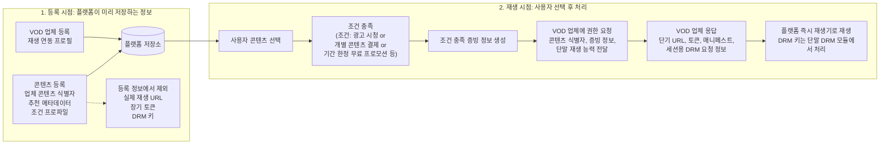

핵심은 플랫폼이 추천과 권한 요청에 필요한 등록 정보만 보관하고, 실제 재생 정보는 조건 충족 후 VOD 업체 응답으로 처음 취득한다는 점이다.

본 발명의 주요 데이터는 다음과 같이 정리된다.

| 항목 | 역할 |
|---|---|
| 업체 재생 연동 프로필 | VOD 업체가 지원하는 스트리밍 방식, DRM 체계, 코덱, 권한 요청 규격을 정의하는 업체 단위 정적 정보 |
| 콘텐츠 등록 정보 | 업체 콘텐츠 식별자, 추천용 메타데이터, 프로필 참조 값, 시청 권한 획득 조건 프로파일을 포함하는 콘텐츠 단위 정보 |
| 시청 권한 획득 조건 프로파일 | 광고 시청, 단기 결제, 플랫폼 부담 프로모션, 업체 부담 무료 공개 등 콘텐츠 시청 전에 충족할 조건을 정의하는 정보 |
| 조건 충족 증빙 정보 | 특정 세션, 콘텐츠, 조건 프로파일에서 조건이 유효하게 충족되었음을 나타내는 일회성 증빙 정보 |
| 실제 재생 정보 | 사용자 재생 시점에 업체 시스템에서 지연 취득하는 단기 URL, 접근 토큰, 매니페스트, 세션용 DRM 라이선스 요청 정보 |
| 조건별 정산 이벤트 | 조건 충족, 업체 권한 응답, 재생 결과를 연결하여 광고 수익 배분, 결제 수수료, 프로모션 비용 정산에 사용하는 기록 |

#### 나. 종래기술의 설명

종래기술은 대체로 다음 네 유형에 속한다.

1. VOD 업체 앱에서 로그인, 구독 또는 구매 권한을 확인하고 업체 재생기로 콘텐츠를 재생하는 구조
2. 광고 시청, 단기 결제 또는 프로모션을 동일 서비스 내부의 콘텐츠 권한과 결합하는 구조
3. 콘텐츠 제공자 등록, 메타데이터 디렉터리 또는 콘텐츠 브로커를 통해 콘텐츠 정보를 중개하는 구조
4. 임시 토큰, 단말 DRM 모듈 또는 브라우저 CDM으로 보호 콘텐츠 재생 권한을 처리하는 구조

이들 요소는 각각 알려져 있을 수 있다. 그러나 종래 구조는 보통 콘텐츠 노출, 조건 처리, 권한 확인, 실제 재생 정보 제공이 동일 서비스 내부에서 결합된다. 본 발명은 이 결합 구조를 분리하여, 플랫폼이 조건 충족을 검증한 뒤 외부 VOD 업체로부터 한시적 권한과 실제 재생 정보를 지연 취득한다.

아래 도식은 종래기술과 본 발명의 차이를 권한 발급 주체와 실제 재생 정보의 위치를 중심으로 비교한 것이다.

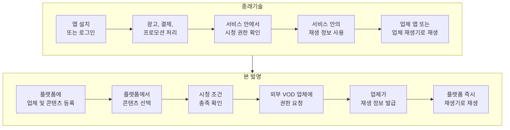

종래기술은 조건 처리, 권한 확인 및 실제 재생 정보가 하나의 서비스 안에 묶여 있다. 반면 본 발명은 플랫폼이 시청 조건을 확인하고, 외부 VOD 업체가 한시적 권한과 실제 재생 정보를 발급한다. 또한 플랫폼은 실제 재생 URL, 장기 토큰 또는 DRM 키를 미리 저장하지 않는다.

핵심 비교는 다음과 같다.

| 비교 항목 | 종래기술 | 본 발명 |
|---|---|---|
| 사용자 진입 | 업체 앱 설치 또는 업체 계정 로그인 | 플랫폼 즉시 재생 화면에서 콘텐츠 선택 |
| 등록 정보 | 실제 재생 주소와 권한 정보가 서비스 내부에 결합 | 업체 프로필, 콘텐츠 식별자, 메타데이터, 조건 프로파일을 분리 등록 |
| 조건 처리 | 광고, 결제, 프로모션이 동일 서비스의 재생 권한과 결합 | 조건 프로파일을 선택하고 조건 충족 증빙 정보를 생성 |
| 권한 발급 | 동일 서비스 내부 권한 확인 | 외부 VOD 업체가 한시적 권한을 발급 |
| 실제 재생 정보 | 사전 저장 또는 업체 앱 내부 사용 | 조건 충족 후 단기 URL, 토큰, 매니페스트, 세션용 DRM 요청 정보를 지연 취득 |
| DRM 처리 | 일반적인 단말 DRM 라이선스 취득 | 단말 DRM 구조를 이용하되 플랫폼은 DRM 키를 저장하거나 평문 취득하지 않음 |

예비 선행 특허 조사 관점에서 광고 조건, 콘텐츠 등록, 메타데이터 디렉터리, 임시 토큰 및 DRM 라이선스 취득은 각각 알려진 요소로 볼 수 있다. 따라서 본 발명은 단일 요소가 아니라 “조건 프로파일 기반 권한 획득”과 “외부 VOD 업체 발급 재생 정보의 지연 취득”의 결합으로 차별화해야 한다. 아래 표는 실제 공개 또는 등록된 특허 문헌을 1건씩 분리하여 정리한 예비 조사 결과이며, 출원 전 한국, 미국, 유럽, PCT 문헌을 포함하는 정식 선행기술 조사가 필요하다.

| 구분 | 선행 특허 | 주요 내용 | 회피 및 차별 포인트 |
|---|---|---|---|
| 1 | [US8918902B1, Advertisements as keys for streaming protected content](https://patents.google.com/patent/US8918902B1/en) | 광고를 보호 콘텐츠 접근 또는 복호화와 결합하는 구조 | 광고 시청 자체를 차별점으로 삼지 않고, 광고를 복수 조건 프로파일 중 하나로 낮추어 외부 VOD 업체 권한 요청과 결합한다. |
| 2 | [US7975310B2, Offline playback of advertising supported media](https://patents.google.com/patent/US7975310B2/en) | 광고 재생 후 토큰 또는 DRM 라이선스를 이용하여 선택 미디어 재생을 허용하는 구조 | 광고 후 토큰 획득 자체와 구별되도록, 플랫폼의 조건 충족 증빙 정보와 외부 VOD 업체 발급 실제 재생 정보의 지연 취득을 강조한다. |
| 3 | [US6505169B1, Method for adaptive ad insertion in streaming multimedia content](https://patents.google.com/patent/US6505169B1/en) | 스트리밍 콘텐츠에 광고를 동적으로 삽입하기 위한 메타데이터 및 조건 처리 구조 | 광고 삽입 또는 광고 선택 방식이 아니라, 콘텐츠별 시청 권한 획득 조건 프로파일과 외부 업체 권한 발급 절차를 청구 중심에 둔다. |
| 4 | [US8065417B1, Service provider registration by a content broker](https://patents.google.com/patent/US8065417B1/en) | 서비스 제공자를 콘텐츠 브로커에 등록하고 리소스 식별자와 연결하는 구조 | 단순 브로커 등록과 구별되도록, 업체 등록과 콘텐츠 등록을 분리하고 콘텐츠 등록에는 실제 재생 URL, 장기 토큰, DRM 키를 저장하지 않는 점을 강조한다. |
| 5 | [US9892206B2, Content metadata directory services](https://patents.google.com/patent/US9892206B2/en) | 콘텐츠 또는 제공자 메타데이터를 등록, 조회하는 디렉터리 서비스 | 메타데이터 등록 자체와 구별되도록, 추천용 메타데이터는 저장하되 실제 재생 정보는 조건 충족 후 업체 권한 응답으로 취득하는 구조를 강조한다. |
| 6 | [US20150242597A1, Transferring authorization from an authenticated device to an unauthenticated device](https://patents.google.com/patent/US20150242597A1/en) | 인증된 단말의 권한을 다른 단말의 콘텐츠 재생에 이전하는 구조 | 사용자 권한 이전이나 단말 간 인증 위임이 아니라, 플랫폼이 검증한 조건 충족 증빙 정보와 업체 콘텐츠 식별자를 이용해 VOD 업체로부터 한시적 권한을 취득하는 점을 강조한다. |
| 7 | [US9129092B1, Detecting supported digital rights management configurations on a client device](https://patents.google.com/patent/US9129092B1/en) | 클라이언트 단말이 지원하는 DRM 구성을 탐지하는 구조 | 단말 DRM 탐지 자체와 구별되도록, 업체 재생 연동 프로필과 단말 재생 능력을 실행 시점에 대조하여 업체가 실제 재생 방식을 선택하는 절차를 결합한다. |
| 8 | [EP2647215A2, Content provision](https://patents.google.com/patent/EP2647215A2/en) | VOD 등 콘텐츠 제공과 사용자 데이터, 콘텐츠 관리, 결제 또는 접근 제어를 다루는 구조 | 콘텐츠 제공 또는 결제형 접근 자체와 구별되도록, 조건 프로파일 충족 후 외부 VOD 업체가 한시적 권한과 실제 재생 정보를 발급하는 역할 분리를 강조한다. |

##### 선행 특허별 본 발명 반영 구성

위 회피 및 차별 포인트는 단순한 설명상 주장에 그치지 않고, 다음과 같이 본 발명의 구성요소와 처리 순서에 반영된다.

| 선행 특허 | 본 발명에 반영된 구성 |
|---|---|
| US8918902B1 | 광고 시청은 독립적인 권한 또는 복호화 키가 아니라, 시청 권한 획득 조건 프로파일의 한 조건 유형으로 정의한다. 조건 충족 후에도 플랫폼이 직접 콘텐츠 권한을 발급하지 않고 VOD 업체 권한 요청으로 연결한다. |
| US7975310B2 | 광고 완료 후 생성되는 값은 재생 토큰이나 DRM 라이선스 자체가 아니라 조건 충족 증빙 정보이다. 실제 재생 URL, 접근 토큰 및 DRM 라이선스 요청 정보는 VOD 업체의 권한 응답으로 지연 취득한다. |
| US6505169B1 | 광고 선택 또는 스트림 내 광고 삽입 알고리즘을 본 발명의 핵심으로 두지 않는다. 광고, 결제, 프로모션 등 조건 유형을 공통 조건 프로파일로 추상화하고, 콘텐츠별 조건 선택 및 증빙 생성 절차를 구성으로 둔다. |
| US8065417B1 | 업체 등록과 콘텐츠 등록을 분리한다. 업체 등록은 권한 서비스와 재생 연동 프로필을 포함하고, 콘텐츠 등록은 업체 콘텐츠 식별자, 추천 메타데이터, 조건 프로파일 및 프로필 참조 값만 포함한다. |
| US9892206B2 | 플랫폼 콘텐츠 식별자를 매개로 추천용 메타데이터와 업체 콘텐츠 식별자를 연결하되, 등록 저장소에는 실제 재생 URL, 장기 토큰, DRM 키를 포함하지 않는다. |
| US20150242597A1 | 다른 인증 단말의 사용자 권한을 이전하지 않는다. 플랫폼은 조건 충족 증빙 정보, 업체 콘텐츠 식별자 및 단말 재생 능력을 포함한 권한 요청을 VOD 업체 시스템에 전송한다. |
| US9129092B1 | 단말 DRM 능력 탐지만으로 끝나지 않고, 업체 재생 연동 프로필과 단말 재생 능력의 공통 지원 범위에서 VOD 업체가 선택 재생 방식을 결정하여 권한 응답에 포함한다. |
| EP2647215A2 | 콘텐츠 제공, 결제 또는 접근 제어를 하나의 서비스 내부 기능으로 처리하지 않고, 플랫폼의 조건 검증과 외부 VOD 업체의 권한, 실제 재생 정보 발급을 역할상 분리한다. |

##### 선행기술 대비 본 발명 반영 방향

1. “광고를 보면 콘텐츠를 본다” 또는 “결제하면 콘텐츠를 본다”는 넓은 개념이 아니라, 조건 프로파일, 조건 충족 증빙 정보, 업체 권한 요청 및 실제 재생 정보 지연 취득의 결합을 본 발명의 구성으로 둔다.
2. 업체 식별자, 추천 메타데이터, 업체 재생 연동 프로필, 조건 프로파일을 분리 등록하고 플랫폼 콘텐츠 식별자로 연결하는 구조를 포함한다.
3. 조건 충족 증빙 정보가 생성된 후에만 외부 VOD 업체에 한시적 권한을 요청하는 순차 관계를 포함한다.
4. 실제 재생 정보는 등록 시 저장하지 않고 사용자 재생 시점에 지연 취득한다.
5. VOD 업체가 권한 및 실제 재생 정보의 발급 주체이고, 플랫폼은 조건 검증과 즉시 재생을 중개하는 경계를 명확히 한다.
6. 조건 충족 증빙 정보, 업체 권한 응답, 실제 재생 결과를 동일 세션과 콘텐츠에 연결하여 재사용을 제한하고 정산 근거로 사용하는 구성을 포함한다.

#### 다. 종래기술 문제점 및 본 발명의 목적

기존 방식의 문제와 본 발명의 대응 목적은 다음과 같다.

| 종래 문제 | 본 발명의 대응 목적 |
|---|---|
| 플랫폼이 복수 업체 콘텐츠를 추천하려면 콘텐츠 정보를 알아야 하지만, 실제 재생 URL, 장기 토큰, DRM 키까지 저장하면 보안 및 동기화 위험이 커진다. | 추천용 메타데이터와 실제 재생 정보를 분리하고, 실제 재생 정보는 사용자 재생 시점에 지연 취득한다. |
| 업체 콘텐츠 식별자만으로는 추천, 검색, 표시가 어렵다. | 업체 콘텐츠 식별자와 추천용 메타데이터를 같은 플랫폼 콘텐츠에 연결한다. |
| 광고, 결제, 프로모션 조건은 통상 동일 서비스 내부 권한 처리와 결합된다. | 다양한 시청 조건을 조건 프로파일로 통일하고, 조건 충족 증빙 정보를 외부 VOD 업체 권한 요청과 연결한다. |
| 플랫폼이 자체 권한을 만들면 VOD 업체의 기존 권한 발급 및 DRM 체계와 충돌할 수 있다. | 권한과 실제 재생 정보는 VOD 업체가 발급하고, 플랫폼은 조건 검증과 즉시 재생을 중개한다. |
| 등록 정보가 실제로 재생 가능한지 검증되지 않으면 추천 콘텐츠가 재생 실패로 이어진다. | 업체 등록 및 콘텐츠 등록 후 시험 권한 획득과 시험 재생에 성공한 콘텐츠만 추천 대상으로 활성화한다. |
| 등록 시점에 재생 방식을 고정하면 단말 DRM, 코덱, 스트리밍 호환성 문제가 생길 수 있다. | 업체 재생 연동 프로필과 단말 재생 능력을 실행 시점에 대조하여 실제 재생 방식을 선택한다. |

##### 본 발명의 해결수단 요약

본 발명은 다음 순서로 위 문제를 해결한다.

1. VOD 업체가 업체 단위 재생 연동 프로필을 등록한다.
2. 콘텐츠는 업체 콘텐츠 식별자, 추천용 메타데이터, 프로필 참조 값, 조건 프로파일로 등록하고 실제 재생 정보는 저장하지 않는다.
3. 플랫폼은 등록 정보로 시험 권한 획득 및 시험 재생을 수행하고, 성공한 콘텐츠만 추천 대상으로 활성화한다.
4. 사용자가 콘텐츠를 선택하면 플랫폼은 조건 프로파일을 선택하고 조건 충족 여부를 검증한다.
5. 조건이 충족된 경우에만 조건 충족 증빙 정보와 단말 재생 능력 정보를 포함하여 VOD 업체에 한시적 권한을 요청한다.
6. VOD 업체가 반환한 단기 URL, 접근 토큰, 매니페스트, 세션용 DRM 라이선스 요청 정보를 즉시 재생기에 제공한다.
7. DRM 콘텐츠 키는 플랫폼에 평문으로 저장되거나 전달되지 않고, 단말 DRM 모듈의 보호 범위에서 처리된다.
8. 조건 충족, 업체 권한 응답, 실제 재생 결과는 동일 세션과 콘텐츠에 연결되어 재사용 제한 및 정산 근거로 사용될 수 있다.
9. 광고 시청, 결제, 프로모션의 완료 결과는 그 자체로 재생 토큰이나 DRM 라이선스가 되지 않고, VOD 업체 권한 요청에 첨부되는 조건 충족 증빙 정보로 사용된다.
10. 플랫폼 콘텐츠 식별자는 업체 콘텐츠 식별자, 추천용 메타데이터, 조건 프로파일, 권한 서비스 및 재생 연동 프로필 참조 값을 연결하되, 실제 재생 위치를 노출하지 않는다.
11. VOD 업체 시스템은 단말 재생 능력과 등록된 재생 연동 프로필의 공통 지원 범위에서 실제 재생 방식을 선택하고, 플랫폼은 그 선택 결과가 등록 범위에 맞는지 확인한다.
12. 플랫폼은 외부 VOD 업체의 사용자 계정 권한을 이전하거나 대체하지 않고, 조건 검증과 권한 요청 중개를 수행한다.

<!-- page-break:page-4 -->

#### 2. 발명(고안)의 구체적 설명

#### 가. 발명의 구성

##### 1) 전체 시스템 구조

본 발명의 시스템은 즉시 재생 플랫폼(100), VOD 업체 시스템(200), 사용자 단말(300) 및 추천 시스템(400)을 포함한다.

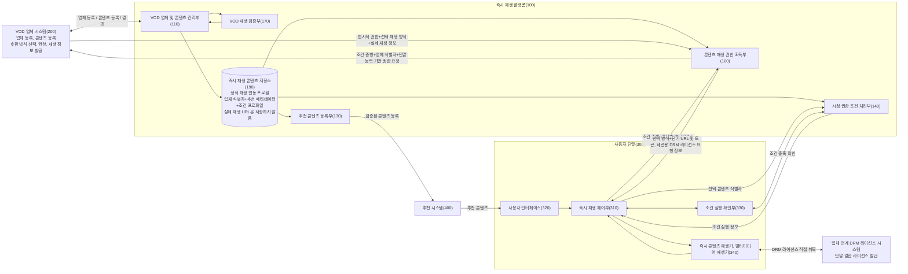

즉시 재생 콘텐츠 저장소는 업체 단위의 정적 재생 연동 프로필과 이를 참조하는 업체 콘텐츠 식별자, 추천용 메타데이터, 시청 권한 획득 조건 프로파일을 저장하지만, 실제 콘텐츠 URL이나 장기 접근 토큰은 저장하지 않는다. 콘텐츠 재생 권한 획득부는 조건 충족 후 저장된 업체 식별자와 단말 재생 능력 및 조건 충족 증빙 정보를 사용하여 VOD 업체 시스템에 권한을 요청하고, 업체가 선택한 호환 재생 방식과 실제 재생 정보를 취득한다. DRM이 적용되면 사용자 단말의 즉시 콘텐츠 재생기는 조건 충족 후 취득된 세션용 DRM 라이선스 요청 정보를 사용하여 업체 연계 DRM 라이선스 시스템과 직접 통신하고 기존 단말 DRM 모듈로 라이선스를 처리할 수 있다.

선행 특허와의 차별점은 다음 구성에 반영된다.

| 선행 위험 | 본 발명에 반영된 구성 | 담당 구성부 |
|---|---|---|
| 광고 조건 자체 또는 광고 후 토큰 발급으로 좁혀 해석될 위험 | 광고, 결제, 프로모션을 모두 시청 권한 획득 조건 프로파일의 조건 유형으로 처리하고, 조건 실행 결과는 재생 토큰이 아니라 조건 충족 증빙 정보로 생성한다. | 시청 권한 조건 처리부(140), 조건 실행 확인부(330) |
| 콘텐츠 브로커 또는 메타데이터 디렉터리로 해석될 위험 | 업체 콘텐츠 식별자와 추천용 메타데이터를 저장하되, 실제 재생 URL, 장기 토큰, DRM 키 및 세션용 DRM 라이선스 요청 정보는 등록 정보로 저장하지 않는다. | VOD 업체 및 콘텐츠 관리부(110), 즉시 재생 콘텐츠 저장소(190) |
| 단순 임시 토큰 또는 단말 간 권한 이전으로 해석될 위험 | 조건 충족 증빙 정보는 특정 세션과 콘텐츠에 결합된 권한 요청 입력값이며, 다른 단말의 사용자 권한을 이전하지 않는다. | 콘텐츠 재생 권한 획득부(160), 즉시 재생 제어부(310) |
| 일반 DRM 능력 탐지 또는 DRM 라이선스 취득으로 해석될 위험 | 업체 재생 연동 프로필과 단말 재생 능력을 대조하고, VOD 업체가 공통 지원 범위에서 선택 재생 방식을 결정한다. 세션용 DRM 라이선스 요청 정보는 조건 충족 후 업체 응답으로 취득한다. | 콘텐츠 재생 권한 획득부(160), VOD 업체 시스템(200), 즉시 콘텐츠 재생기(340) |
| 일반 콘텐츠 제공 또는 결제형 접근 제어로 해석될 위험 | 플랫폼은 조건 검증과 권한 요청 중개를 수행하고, 외부 VOD 업체가 한시적 권한과 실제 재생 정보를 발급한다. | 시청 권한 조건 처리부(140), 콘텐츠 재생 권한 획득부(160), VOD 업체 시스템(200) |

##### 2) 주요 모듈 정의

1. **VOD 업체 및 콘텐츠 관리부(110)**: 플랫폼이 VOD 업체에 업체, 재생 연동 프로필, 콘텐츠 등록 방법을 제공한다. 업체가 지원하는 스트리밍, DRM 및 코덱, 권한 요청 규격을 정적 재생 연동 프로필로 등록하고, 개별 콘텐츠의 업체 식별자, 메타데이터, 시청 권한 획득 조건 프로파일, 재생 연동 프로필 참조 값을 별도로 등록하고 버전 관리한다.
2. **추천 콘텐츠 등록부(130)**: 검증된 콘텐츠의 메타데이터와 플랫폼 콘텐츠 식별자를 추천 시스템에 등록하고 비활성화, 검증 만료 시 등록을 해제한다.
3. **시청 권한 조건 처리부(140)**: 선택 콘텐츠 식별자와 시청 권한 획득 조건 프로파일을 이용하여 적용 조건을 선택하고, 광고 재생 정보, 결제 승인 요청 정보, 플랫폼 프로모션 예산 예약 정보 또는 업체 캠페인 승인 정보 등 조건 실행 정보를 제공하며, 조건 실행 확인부와 조건 충족을 검증하고 조건 충족 증빙 정보를 생성한다.
4. **콘텐츠 재생 권한 획득부(160)**: 조건 충족 확인 후 저장소에서 VOD 업체 및 콘텐츠 식별자, 권한 요청 정보, 정적 재생 연동 프로필 및 선택된 조건 프로파일을 조회한다. 사용자 단말의 재생 능력 정보와 조건 충족 증빙 정보를 포함하여 업체 서버에 한시적 권한을 요청하고, 업체가 선택한 스트리밍, DRM 및 코덱 조합과 실제 재생 정보를 취득하고 검증한다.
5. **VOD 재생 검증부(170)**: 등록된 업체 식별자, 권한 서비스 및 정적 재생 연동 프로필을 이용하여 지원 조합별 시험 권한 획득과 실제 콘텐츠 재생을 검증한다.
6. **즉시 재생 콘텐츠 저장소(190)**: 업체별 정적 재생 연동 프로필과, 이를 참조하는 업체 및 콘텐츠 식별자, 추천용 메타데이터, 권한 서비스 매핑, 조건 프로파일 및 검증 상태를 구분하여 저장한다. 실제 콘텐츠 URL, DRM 키 및 장기 토큰은 등록 정보로 저장하지 않는다.
7. **VOD 업체 시스템(200)**: 업체, 재생 연동 프로필, 콘텐츠 등록 정보를 제공한다. 플랫폼이 전송한 업체 콘텐츠 식별자, 조건 충족 증빙 정보와 단말 재생 능력을 확인하여 호환되는 실제 재생 방식을 선택하고, 한시적 권한과 실제 재생 정보를 발급하며 콘텐츠와 업체 연계 DRM 라이선스 시스템을 제공한다.
8. **즉시 재생 제어부(310)**: 콘텐츠 선택, 조건 실행 정보 요청, 조건 실행, 조건 충족 확인, 권한 획득 및 콘텐츠 재생의 순서를 제어한다.
9. **사용자 인터페이스(320)**: 추천 콘텐츠의 메타데이터를 표시하고 사용자의 즉시 재생 선택을 즉시 재생 제어부에 전달한다.
10. **조건 실행 확인부(330)**: 광고 재생 결과, 결제 승인 결과, 프로모션 예산 예약 결과 또는 업체 캠페인 승인 결과를 시청 권한 조건 처리부의 요청 정보와 대조하여 선택 조건의 충족을 확인한다.
11. **즉시 콘텐츠 재생기 또는 멀티미디어 재생기(340)**: 단말이 지원하는 스트리밍, DRM 및 코덱 능력 정보를 즉시 재생 제어부에 제공한다. 조건 유형이 광고 시청인 경우 광고를 재생하고, VOD 콘텐츠를 재생하며, DRM이 적용된 경우 업체가 반환한 세션용 DRM 라이선스 요청 정보를 이용하여 기존 단말 DRM 모듈을 통해 라이선스를 취득하며 재생 결과를 반환한다.
12. **추천 시스템(400)**: 플랫폼이 등록한 검증된 콘텐츠의 메타데이터를 이용하여 사용자 단말에 추천 콘텐츠를 제공한다.

##### 3) 구성부별 입력, 출력, 처리책임

| 구성부 | 주요 입력 | 주요 출력 | 처리책임 |
|---|---|---|---|
| VOD 업체 및 콘텐츠 관리부(110) | 업체 등록 정보, 권한 서비스 정보, 정적 재생 연동 프로필, 콘텐츠 등록 정보, 조건 프로파일 | 업체 등록 레코드, 콘텐츠 등록 레코드, 등록 버전, 활성화 요청 | 업체 등록과 콘텐츠 등록을 분리하고, 콘텐츠 등록 정보가 기존 업체, 권한 서비스, 재생 연동 프로필을 참조하는지 확인한다. |
| 추천 콘텐츠 등록부(130) | 콘텐츠 메타데이터, 검증 상태, 제공 지역, 기간, 비활성화 상태 | 추천 시스템 등록 및 해제 요청, 추천용 플랫폼 콘텐츠 식별자 | 실제 재생 URL 없이 추천 가능한 메타데이터만 추천 시스템에 제공하고, 검증 만료 또는 등록 변경 시 추천 등록을 해제한다. |
| 시청 권한 조건 처리부(140) | 플랫폼 콘텐츠 식별자, 즉시 재생 세션, 조건 프로파일, 조건 실행 결과 | 조건 실행 정보, 조건 충족 증빙 정보, 조건별 정산 이벤트 초안 | 조건 프로파일을 선택하고 조건 실행 결과를 검증하며, 세션, 콘텐츠, 조건 프로파일 및 일회성 검증 값을 결합한 증빙 정보를 생성한다. |
| 콘텐츠 재생 권한 획득부(160) | 조건 충족 증빙 정보, 업체 콘텐츠 식별자, 권한 서비스 식별자, 정적 재생 연동 프로필 참조 값, 단말 재생 능력 정보 | 업체 권한 요청, 선택 재생 방식 검증 결과, 한시적 권한, 지연 취득 재생 정보 | 조건 충족 전에는 업체 권한 요청을 생성하지 않고, 업체 응답의 발급 주체, 콘텐츠, 세션, 권한 범위, 만료 및 서명을 검증한다. |
| VOD 재생 검증부(170) | 업체 콘텐츠 식별자, 권한 서비스 식별자, 정적 재생 연동 프로필, 검증용 단말 능력 | 검증 결과, 검증된 재생 연동 프로필 식별자, 검증 유효 기간 | 등록 또는 변경된 콘텐츠에 대해 시험 권한 획득과 시험 재생을 수행하고, 성공한 프로필만 추천 활성화 대상으로 반환한다. |
| 즉시 재생 콘텐츠 저장소(190) | 업체 등록 레코드, 콘텐츠 등록 레코드, 조건 프로파일, 검증 결과, 세션 상태 | 조회 결과, 버전 정보, 세션 패키지, 상태 변경 이력 | 정적 등록 정보와 세션용 실행 정보를 구분하여 저장하고, 실제 재생 URL, DRM 키와 세션용 DRM 라이선스 요청 정보를 상시 보관용 카탈로그에 저장하지 않는다. |
| 즉시 재생 제어부(310) | 사용자 선택 정보, 조건 실행 정보, 조건 충족 결과, 단말 재생 능력, 실제 재생 정보 | 조건 실행 요청, 권한 취득 요청, 재생 명령, 재생 결과 | 콘텐츠 선택부터 조건 실행, 권한 취득, 재생 시작, 추가 조건 및 실패 차단까지의 상태 전이를 제어한다. |
| 조건 실행 확인부(330) | 조건 실행 대상, 광고 재생 결과, 결제 승인 결과, 프로모션 확인 결과 | 조건 실행 결과, 조건 충족 확인 결과 | 단말 또는 플랫폼에서 수행된 조건 실행 결과를 조건 프로파일의 요구 사항과 대조한다. |
| 즉시 콘텐츠 재생기(340) | 선택 재생 방식, 매니페스트 위치, 콘텐츠 접근 토큰, 세션용 DRM 라이선스 요청 정보 | 콘텐츠 재생 결과, DRM 라이선스 취득 결과, 오류 상태 | 실제 콘텐츠를 재생하고, DRM 적용 시 업체 연계 라이선스 시스템과 직접 통신하여 단말 DRM 모듈에서 콘텐츠 키를 처리한다. |
| VOD 업체 시스템(200) | 업체 콘텐츠 식별자, 조건 충족 증빙 정보, 단말 재생 능력 정보, 프로필 후보, 요청 서명 | 한시적 재생 권한, 선택 재생 방식, 실제 재생 정보, 업체 응답 서명 | 원 콘텐츠 권한 발급 주체로서 조건 증빙 정보와 요청 범위를 확인하고, 단말과 호환되는 재생 방식을 선택하여 단기 재생 정보를 발급한다. |

##### 4) 용어 정의

1. **불투명 업체 콘텐츠 식별자**: 플랫폼이 내부 구조나 실제 재생 위치를 해석하지 않고 VOD 업체 권한 요청에 그대로 또는 변환하여 사용하는 식별자이다.
2. **플랫폼 콘텐츠 식별자**: 추천, 선택, 조건 프로파일, 권한, 재생 로그를 하나의 콘텐츠로 연결하기 위해 플랫폼이 사용하는 식별자이다.
3. **추천용 실제 메타데이터**: 사용자에게 콘텐츠를 설명, 추천하기 위해 플랫폼이 실제 값으로 저장하는 제목, 장르, 출연진, 등급, 줄거리, 대표 이미지 등의 정보이다.
4. **실제 재생 정보**: VOD 콘텐츠의 재생을 시작하기 위해 필요한 단기 URL, 매니페스트 위치, 접근 토큰, 세션용 DRM 라이선스 요청 정보 또는 이들의 조합이다.
5. **지연 취득 재생 정보**: 등록 단계에 플랫폼이 저장하지 않고 개별 사용자 재생 권한 발급 시점에 VOD 업체로부터 취득하는 실제 재생 정보이다.
6. **시청 권한 획득 조건 프로파일**: 콘텐츠를 재생하기 전에 충족되어야 하는 조건의 유형, 실행 정보, 증빙 정보 형식, 권한 범위, 유효 시간 및 정산 참조 값을 정의하는 정보이다.
7. **조건 충족 증빙 정보**: 특정 즉시 재생 세션, 콘텐츠, 조건 프로파일, 조건 실행 결과를 결합하여 조건이 충족되었음을 증명하거나 조회할 수 있는 일회성 정보이다. 이는 실제 재생 URL, 콘텐츠 접근 토큰, DRM 라이선스 또는 콘텐츠 키 자체가 아니며, VOD 업체 시스템에 한시적 재생 권한을 요청하기 위한 입력 정보로 사용된다.
8. **한시적 콘텐츠 재생 권한**: VOD 업체가 특정 콘텐츠, 세션, 단말, 재생구간, 유효 시간 중 하나 이상에 한정하여 발급하는 권한이다.
9. **즉시 재생 세션**: 콘텐츠 선택부터 조건 실행과 검증, 권한 획득 및 재생 종료까지의 실행 정보를 연결하는 짧은 수명의 세션이다.
10. **정적 재생 연동 프로필**: 업체 단위로 등록되는 지원 스트리밍 방식, DRM 체계, 비디오 및 오디오 코덱, 권한 요청 규격, 인증 방식 및 정적 DRM 연동 정보의 집합이다. 복수 프로필을 등록하고 개별 콘텐츠가 하나 이상을 참조할 수 있다.
11. **단말 재생 능력 정보**: 특정 사용자 단말의 즉시 콘텐츠 재생기가 지원하는 스트리밍 방식, DRM 체계, 코덱 및 선택적인 해상도 및 보안 수준의 집합이다.
12. **선택 재생 방식**: VOD 업체 시스템이 정적 재생 연동 프로필과 단말 재생 능력 정보의 공통 지원 범위에서 선택하여 권한 응답에 포함한 스트리밍, DRM 및 코덱 조합이다.
13. **정적 DRM 연동 정보**: 정적 재생 연동 프로필에 포함되는 지원 DRM 체계, 라이선스 취득 방식, 정적 라이선스 엔드포인트 후보 또는 응답 검증 정보이다. 이는 업체 등록 단계에서 저장될 수 있으나 콘텐츠별 세션 토큰이나 DRM 키와 구별된다.
14. **세션용 DRM 라이선스 요청 정보**: 즉시 콘텐츠 재생기가 업체 연계 DRM 라이선스 시스템에 라이선스를 요청하는 데 사용하는 라이선스 주소, 단기 라이선스 요청 토큰, DRM 체계 식별자 또는 이들의 조합이다. 이는 콘텐츠별 재생 라이선스 자체나 콘텐츠 키와 구별되며, 특정 VOD 업체별 콘텐츠 재생 라이선스가 단말에 사전 설치되어 있음을 의미하지 않는다. 즉시 콘텐츠 재생기는 단말, OS 또는 브라우저가 기존에 지원하는 DRM 모듈 또는 CDM을 이용하고, VOD 업체 시스템은 단말 재생 능력 정보와 공통되는 DRM 체계를 선택한다.

##### 5) 업체 등록 JSON 및 콘텐츠 등록 JSON

업체 등록은 VOD 업체가 플랫폼에 한 번 또는 버전별로 제공하는 정적 연동 정보를 등록하는 절차이고, 콘텐츠 등록은 이미 등록된 업체, 권한 서비스, 재생 연동 프로필을 참조하여 개별 콘텐츠를 등록하는 절차이다. 두 절차는 서로 다른 요청 또는 서로 다른 시점의 API 호출로 수행될 수 있으며, 콘텐츠 등록 JSON은 정적 재생 연동 프로필의 정의를 다시 포함하지 않고 식별자로만 참조한다.

`grantEndpoint`는 업체 권한 서비스를 호출하기 위한 업체 연동 주소로서 실제 VOD 콘텐츠 주소와 다르다. 업체 등록 JSON은 개별 콘텐츠 식별자나 추천용 메타데이터를 포함하지 않고, 콘텐츠 등록 JSON은 실제 콘텐츠 URL, 실제 매니페스트 URL, 장기 접근 토큰, DRM 키 또는 특정 세션용 DRM 라이선스 요청 정보를 포함하지 않는다. 콘텐츠 등록 JSON의 조건 프로파일은 권한 획득 전에 어떤 조건을 충족해야 하는지와 그 증빙 정보 형식을 정의할 뿐, 실제 재생 권한 자체를 발급하지 않는다.

###### 업체 등록 JSON

```json
{
  "providerRegistration": {
    "schemaVersion": "instantplay.provider-registration/1.0",
    "providerId": "com.example.vod",
    "providerDisplayName": "Example VOD",
    "providerStatus": "active",
    "grantServices": [
      {
        "grantServiceId": "example-vod-grant-service",
        "grantEndpoint": "https://api.example-vod.com/instantplay/grants",
        "authenticationProfileId": "platform-mutual-auth-01",
        "requestSchemaVersion": "instantplay.grant-request/1.0",
        "responseVerificationKeyId": "example-vod-response-key-01"
      }
    ],
    "playbackProfiles": [
      {
        "playbackProfileId": "example-vod-profile-01",
        "supportedStreamingMethods": ["dash", "hls"],
        "supportedVideoCodecs": ["h264", "hevc"],
        "supportedAudioCodecs": ["aac"],
        "supportedDrmSystems": [
          {
            "drmSystemId": "playready",
            "licenseAcquisitionMode": "player-direct",
            "licenseRequestInformationSource": "grant-response",
            "staticLicenseEndpointPolicy": "not-fixed-in-content-registration"
          }
        ],
        "profileVersion": 4
      }
    ],
    "providerRegistrationVersion": 4,
    "updatedAt": "2026-07-01T00:00:00Z"
  }
}
```

###### 콘텐츠 등록 JSON

```json
{
  "contentRegistration": {
    "schemaVersion": "instantplay.content-registration/1.0",
    "providerId": "com.example.vod",
    "providerContentId": "movie-12345",
    "platformContentId": "platform-title-7788",
    "recommendationMetadata": {
      "title": "예시 영화",
      "synopsis": "추천 화면에 표시되는 줄거리",
      "genres": ["drama"],
      "cast": ["actor-a", "actor-b"],
      "contentRating": "15",
      "posterImageUrl": "https://metadata.example.com/posters/7788.jpg",
      "runningTimeSec": 7200
    },
    "availability": {
      "regions": ["KR"],
      "validFrom": "2026-07-01T00:00:00Z",
      "validUntil": "2026-12-31T14:59:59Z"
    },
    "grantBinding": {
      "grantServiceId": "example-vod-grant-service",
      "playbackResourceId": "asset-5f91a2"
    },
    "playbackProfileRefs": [
      {
        "playbackProfileId": "example-vod-profile-01",
        "minimumProfileVersion": 4
      }
    ],
    "instantPlayPolicy": {
      "enabled": true,
      "vendorLoginRequired": false,
      "defaultConditionProfileId": "condition-ad-view-01"
    },
    "entitlementConditionProfiles": [
      {
        "conditionProfileId": "condition-ad-view-01",
        "conditionType": "AD_VIEW",
        "conditionTemplateId": "platform-ad-view-v1",
        "conditionParameters": {
          "adPolicyId": "required-ad-policy-v1",
          "checkpointId": "checkpoint-initial"
        },
        "grantScope": {
          "scope": "playback-segment",
          "segmentDurationSec": 900,
          "maximumGrantTtlSec": 120
        },
        "proofBinding": {
          "requiredProofType": "adCompletionProof",
          "sessionBindingRequired": true,
          "deviceBindingRequired": true,
          "nonceRequired": true
        },
        "settlement": {
          "payerType": "advertiser",
          "settlementRuleRef": "ad-revshare-provider-platform-v1"
        },
        "providerGrantServiceId": "example-vod-grant-service"
      },
      {
        "conditionProfileId": "condition-platform-promo-01",
        "conditionType": "PLATFORM_SPONSORED_PROMO",
        "conditionTemplateId": "platform-sponsored-promo-v1",
        "conditionParameters": {
          "promoCampaignId": "instantplay-launch-promo",
          "promoBudgetPolicyId": "platform-budget-2026q3"
        },
        "grantScope": {
          "scope": "short-playback",
          "maximumGrantTtlSec": 120
        },
        "proofBinding": {
          "requiredProofType": "promoBudgetReservationProof",
          "sessionBindingRequired": true,
          "deviceBindingRequired": false,
          "nonceRequired": true
        },
        "settlement": {
          "payerType": "platform",
          "settlementRuleRef": "platform-pays-provider-short-grant-v1"
        },
        "providerGrantServiceId": "example-vod-grant-service"
      },
      {
        "conditionProfileId": "condition-user-payment-01",
        "conditionType": "USER_MICROPAYMENT",
        "conditionTemplateId": "platform-short-access-payment-v1",
        "conditionParameters": {
          "priceAmount": 700,
          "currency": "KRW",
          "paymentPolicyId": "short-access-price-v1"
        },
        "grantScope": {
          "scope": "short-playback",
          "maximumGrantTtlSec": 120
        },
        "proofBinding": {
          "requiredProofType": "paymentAuthorizationProof",
          "sessionBindingRequired": true,
          "deviceBindingRequired": true,
          "nonceRequired": true
        },
        "settlement": {
          "payerType": "user",
          "settlementRuleRef": "platform-payment-fee-v1"
        },
        "providerGrantServiceId": "example-vod-grant-service"
      },
      {
        "conditionProfileId": "condition-provider-free-promo-01",
        "conditionType": "PROVIDER_FREE_PROMO",
        "conditionTemplateId": "provider-free-promo-v1",
        "conditionParameters": {
          "providerCampaignId": "provider-trial-campaign-01",
          "exposurePolicyRef": "recommended-placement-guarantee-v1"
        },
        "grantScope": {
          "scope": "short-playback",
          "maximumGrantTtlSec": 120
        },
        "proofBinding": {
          "requiredProofType": "providerCampaignProof",
          "sessionBindingRequired": true,
          "deviceBindingRequired": false,
          "nonceRequired": true
        },
        "settlement": {
          "payerType": "provider",
          "settlementRuleRef": "provider-pays-platform-exposure-v1"
        },
        "providerGrantServiceId": "example-vod-grant-service"
      }
    ],
    "verification": {
      "status": "passed",
      "verifiedPlaybackProfileIds": ["example-vod-profile-01"],
      "verificationId": "verification-01J...",
      "validUntil": "2026-08-19T00:00:00Z"
    },
    "contentRegistrationVersion": 12
  }
}
```

###### 업체 등록 필드 설명

| 필드 | 필수 여부 | 설명 |
|---|---|---|
| `providerRegistration` | 필수 | 업체 단위 정적 연동 정보를 담는 등록 레코드 |
| `providerId` | 필수 | VOD 업체를 식별하고 권한 서비스와 콘텐츠 등록을 연결하는 값 |
| `grantServices` | 필수 | 업체 콘텐츠 재생 권한 발급 서비스를 호출하기 위한 정적 연동 정보의 집합 |
| `grantServiceId` | 필수 | 콘텐츠 등록 레코드가 참조할 권한 서비스 식별자 |
| `grantEndpoint` | 필수 | 업체 권한 서비스를 호출할 주소이며 실제 VOD 콘텐츠 주소와 다름 |
| `authenticationProfileId` | 필수 | 플랫폼과 업체 권한 서비스 사이의 인증 방식 참조 값 |
| `requestSchemaVersion` | 필수 | 업체별 권한 요청 형식 버전 |
| `responseVerificationKeyId` | 선택 | 업체 권한 응답의 진위, 무결성 검증에 사용할 키 식별자 |
| `playbackProfiles` | 필수 | 업체가 제공할 수 있는 정적 재생 연동 프로필의 집합 |
| `playbackProfileId` | 필수 | 개별 콘텐츠가 참조할 정적 재생 연동 프로필 식별자 |
| `supportedStreamingMethods` | 필수 | 업체가 즉시 재생에 제공할 수 있는 스트리밍 방식의 집합 |
| `supportedDrmSystems` | 선택 | 업체가 제공할 수 있는 DRM 체계와 정적 DRM 연동 정보의 집합 |
| `licenseAcquisitionMode` | 선택 | 재생기가 라이선스 시스템에 직접 요청하는지 등을 나타내는 값 |
| `licenseRequestInformationSource` | 선택 | 세션용 라이선스 주소, 토큰이 권한 응답 등에서 취득됨을 나타내는 값 |
| `staticLicenseEndpointPolicy` | 선택 | 정적 프로필에 고정 라이선스 주소를 둘지, 권한 응답에서 받을지를 나타내는 정책 |
| `profileVersion` | 필수 | 정적 재생 연동 프로필의 변경 버전 |
| `providerRegistrationVersion` | 필수 | 업체 등록 정보의 변경 버전 |

###### 콘텐츠 등록 필드 설명

| 필드 | 필수 여부 | 설명 |
|---|---|---|
| `contentRegistration` | 필수 | 콘텐츠 단위 등록 레코드 |
| `providerId` | 필수 | 이미 등록된 VOD 업체를 참조하는 값 |
| `providerContentId` | 필수 | VOD 업체가 제공하는 불투명 콘텐츠 식별자 |
| `platformContentId` | 필수 | 플랫폼 추천, 조건 프로파일, 세션, 권한 처리를 연결하는 콘텐츠 식별자 |
| `recommendationMetadata` | 필수 | 추천, 검색, 표시를 위해 플랫폼이 실제 값으로 저장하는 메타데이터 |
| `posterImageUrl` | 선택 | 추천 화면용 대표 이미지의 위치이며 실제 VOD 영상 주소와 다름 |
| `availability` | 필수 | 제공 지역과 제공 기간 |
| `grantBinding` | 필수 | 업체 콘텐츠 식별자를 이미 등록된 권한 발급 서비스와 연결하는 정보 |
| `playbackResourceId` | 필수 | 업체 권한 발급 대상을 특정하는 재생 자산 식별자 |
| `playbackProfileRefs` | 필수 | 이미 등록된 정적 재생 연동 프로필 참조 값의 집합 |
| `minimumProfileVersion` | 선택 | 콘텐츠 검증 당시 요구된 프로필의 최소 버전 |
| `instantPlayPolicy` | 필수 | 즉시 재생 사용 가능 여부, 업체 로그인 요구 여부 및 기본 조건 프로파일 참조 값 |
| `defaultConditionProfileId` | 선택 | 사용자가 콘텐츠를 선택했을 때 우선 적용할 조건 프로파일 |
| `entitlementConditionProfiles` | 필수 | 콘텐츠 시청 권한 획득을 위해 플랫폼이 실행, 검증할 수 있는 조건 프로파일의 집합 |
| `conditionProfileId` | 필수 | 권한 요청과 조건 충족 증빙 정보에 포함되는 조건 프로파일 식별자 |
| `conditionType` | 필수 | `AD_VIEW`, `PLATFORM_SPONSORED_PROMO`, `USER_MICROPAYMENT`, `PROVIDER_FREE_PROMO` 등 조건 유형 |
| `conditionTemplateId` | 필수 | 플랫폼이 제공하는 조건 실행, 검증 템플릿의 식별자 |
| `conditionParameters` | 필수 | 광고 정책, 결제 정책, 프로모션 캠페인, 노출 정책 등 조건 유형별 실행 파라미터 |
| `grantScope` | 필수 | 조건 충족 후 요청할 수 있는 재생 범위, 구간 또는 최대 유효 시간 |
| `proofBinding` | 필수 | 조건 충족 증빙 정보의 유형과 세션, 단말, 일회성 검증 값 결합 여부 |
| `requiredProofType` | 필수 | 업체 권한 요청에 첨부할 증빙 정보 유형 |
| `settlement` | 선택 | 조건 충족 및 실제 재생 확인 결과에 따른 비용 부담자와 정산 규칙 참조 값 |
| `providerGrantServiceId` | 필수 | 해당 조건으로 권한을 요청할 업체 권한 서비스 식별자 |
| `vendorLoginRequired` | 필수 | 즉시 재생에서는 거짓이어야 하는 업체 로그인 요구 여부 |
| `verification` | 필수 | 콘텐츠의 시험 권한 획득과 실제 재생 검증 상태 |
| `verifiedPlaybackProfileIds` | 필수 | 실제 시험 재생을 통과한 재생 연동 프로필 식별자의 집합 |
| `contentRegistrationVersion` | 필수 | 권한 요청과 추천 등록에 적용되는 콘텐츠 등록 정보 버전 |

업체 등록 레코드는 호환성 판단에 필요한 정적 지원 범위만 나타내며, 특정 콘텐츠나 특정 사용자 세션에 사용할 실제 재생 방식을 미리 확정하지 않는다. 콘텐츠 등록 레코드는 업체 등록 레코드의 `providerId`, `grantServiceId` 및 `playbackProfileId`를 참조하여 다수 콘텐츠가 동일 업체 프로필을 공유할 수 있게 한다. 또한 콘텐츠 등록 레코드의 `entitlementConditionProfiles`는 광고, 결제, 플랫폼 부담 프로모션, 업체 부담 무료 프로모션 등 권한 획득 조건의 실행, 검증, 증빙, 정산 참조 값을 정의하지만, 조건 충족 전의 실제 재생 권한이나 재생 정보를 포함하지 않는다. 대표 이미지 URL은 추천용 메타데이터이며 VOD 콘텐츠의 실제 재생 주소와 구별된다.

##### 6) 권한 요청 및 지연 취득 재생 정보 JSON

권한 요청은 선택된 시청 권한 획득 조건 프로파일의 충족이 확인된 후 콘텐츠 재생 권한 획득부(160)가 생성한다. 응답은 VOD 업체 시스템(200)이 생성하며, 등록 단계에 저장하지 않았던 실제 재생 정보를 포함할 수 있다.

```json
{
  "grantRequest": {
    "requestType": "instantplay.grant-request/1.0",
    "requestId": "grant-request-01J...",
    "providerId": "com.example.vod",
    "providerContentId": "movie-12345",
    "playbackResourceId": "asset-5f91a2",
    "platformContentId": "platform-title-7788",
    "anonymousSessionId": "session-01J...",
    "conditionFulfillmentProof": {
      "conditionProofId": "condition-proof-01J...",
      "conditionProfileId": "condition-ad-view-01",
      "conditionType": "AD_VIEW",
      "proofType": "adCompletionProof",
      "conditionCheckpointId": "checkpoint-initial",
      "proofPayload": "SIGNED_CONDITION_PROOF",
      "settlementEventId": "settlement-event-01J..."
    },
    "requestedAccess": {
      "scope": "playback-segment",
      "segmentIndex": 1,
      "maximumTtlSec": 120
    },
    "requestedPlaybackProfileIds": ["example-vod-profile-01"],
    "deviceCapabilities": {
      "streamingMethods": ["dash", "hls"],
      "drmSystems": ["playready"],
      "videoCodecs": ["h264", "hevc"],
      "audioCodecs": ["aac"]
    },
    "providerRegistrationVersion": 4,
    "contentRegistrationVersion": 12,
    "nonce": "ONE_TIME_REQUEST_NONCE",
    "platformSignature": "SIGNED_PLATFORM_REQUEST"
  },
  "grantResponse": {
    "responseType": "instantplay.grant-response/1.0",
    "requestId": "grant-request-01J...",
    "grantId": "vendor-grant-01J...",
    "issuer": "com.example.vod",
    "providerContentId": "movie-12345",
    "anonymousSessionId": "session-01J...",
    "permittedPlayback": {
      "scope": "playback-segment",
      "segmentIndex": 1
    },
    "selectedPlaybackConfiguration": {
      "playbackProfileId": "example-vod-profile-01",
      "streamingMethod": "dash",
      "drmSystemId": "playready",
      "videoCodec": "hevc",
      "audioCodec": "aac"
    },
    "playbackInformation": {
      "manifestUrl": "https://stream.example.com/session-01J/manifest.mpd",
      "playbackAccessToken": "SHORT_LIVED_VENDOR_TOKEN",
      "drmLicenseRequestInformation": {
        "acquisitionMode": "player-direct",
        "drmSystemId": "playready",
        "licenseEndpoint": "https://license.example.com/playready",
        "licenseRequestToken": "SHORT_LIVED_LICENSE_TOKEN"
      }
    },
    "issuedAt": "2026-07-19T01:01:25Z",
    "expiresAt": "2026-07-19T01:03:25Z",
    "vendorSignature": "SIGNED_VENDOR_GRANT"
  }
}
```

###### 권한 요청 및 재생 정보 필드 설명

| 필드 | 필수 여부 | 설명 |
|---|---|---|
| `requestId` | 필수 | 권한 요청과 업체 응답을 연결하는 식별자 |
| `providerId` | 필수 | 권한을 발급할 VOD 업체 |
| `providerContentId` | 필수 | 등록 시 저장한 업체 제공 콘텐츠 식별자 |
| `playbackResourceId` | 필수 | 업체 내부의 실제 재생 자산 참조 값 |
| `platformContentId` | 필수 | 추천, 조건 프로파일, 세션과 업체 콘텐츠를 연결하는 플랫폼 식별자 |
| `anonymousSessionId` | 필수 | 조건 충족, 권한 발급 및 재생을 연결하는 세션 |
| `conditionFulfillmentProof` | 필수 | 권한 요청의 선행 조건이 된 조건 충족 증빙 정보 |
| `conditionProofId` | 필수 | 조건 충족 증빙 정보의 식별자 |
| `conditionProfileId` | 필수 | 콘텐츠 등록 레코드의 조건 프로파일 식별자 |
| `conditionType` | 필수 | 충족된 조건 유형 |
| `proofType` | 필수 | 광고 완료, 결제 승인, 프로모션 예산 예약, 업체 캠페인 승인 등 증빙 유형 |
| `conditionCheckpointId` | 선택 | 재생 시작 또는 구간 갱신 등 조건 요구 시점 |
| `settlementEventId` | 선택 | 조건 충족과 실제 재생 확인 결과를 정산 시스템에 연결하는 식별자 |
| `requestedAccess` | 필수 | 요청 재생 범위, 구간, 유효 시간 |
| `requestedPlaybackProfileIds` | 필수 | 콘텐츠가 참조하고 시험 재생을 통과한 정적 재생 연동 프로필의 후보 |
| `deviceCapabilities` | 필수 | 실제 사용자 단말이 지원하는 스트리밍, DRM, 비디오 및 오디오 코덱의 집합 |
| `providerRegistrationVersion` | 필수 | 권한 요청에 적용한 업체 등록 정보 버전 |
| `contentRegistrationVersion` | 필수 | 권한 요청에 적용한 콘텐츠 등록 정보 버전 |
| `nonce` | 필수 | 권한 요청의 재사용 방지값 |
| `platformSignature` | 선택 | 업체가 플랫폼 요청의 진위를 확인하는 값 |
| `grantId` | 필수 | VOD 업체가 발급한 권한 식별자 |
| `issuer` | 필수 | 권한 발급 VOD 업체 |
| `permittedPlayback` | 필수 | 업체가 실제 허용한 재생 범위 |
| `selectedPlaybackConfiguration` | 필수 | 업체가 재생 연동 프로필과 단말 능력의 공통 지원 범위에서 선택한 실제 스트리밍, DRM 및 코덱 조합 |
| `playbackProfileId` | 필수 | 선택된 정적 재생 연동 프로필 식별자 |
| `streamingMethod` | 필수 | 선택된 실제 스트리밍 방식 |
| `drmSystemId` | DRM 적용 시 필수 | 선택된 DRM 체계 식별자 |
| `videoCodec`, `audioCodec` | 선택 | 선택된 비디오 및 오디오 코덱 |
| `playbackInformation` | 필수 | 조건 충족 후 지연 취득된 실제 콘텐츠 재생 정보 |
| `manifestUrl` | 실시예별 필수 | 단기 매니페스트 또는 재생 목록 위치 |
| `playbackAccessToken` | 실시예별 필수 | 실제 콘텐츠 요청에 사용하는 짧은 수명의 토큰 |
| `drmLicenseRequestInformation` | DRM 적용 시 필수 | 단말 재생기가 기존 DRM 모듈을 이용하여 라이선스를 취득하는 데 필요한 세션용 주소, 토큰 등 요청 정보 |
| `acquisitionMode` | DRM 적용 시 필수 | 단말 재생기의 라이선스 직접 취득 등 라이선스 처리 방식 |
| `licenseEndpoint` | DRM 적용 시 필수 | 단말 재생기가 라이선스를 요청할 업체 연계 주소 |
| `licenseRequestToken` | 선택 | 특정 콘텐츠, 세션, 단말에 한정된 단기 라이선스 요청 토큰 |
| `issuedAt`, `expiresAt` | 필수 | 권한과 실제 재생 정보의 발급, 만료 시각 |
| `vendorSignature` | 선택 | 업체 응답의 진위, 무결성을 검증하는 값 |

콘텐츠 재생 권한 획득부(160)는 `selectedPlaybackConfiguration`이 등록된 재생 연동 프로필, 콘텐츠의 검증 결과 및 `deviceCapabilities`의 공통 지원 범위에 포함되는지 확인한 후 단말에 전달한다. 호환되는 공통 지원 범위가 없거나 업체가 등록되지 않은 방식을 선택한 경우 권한 응답을 거절한다.

###### 업체 권한 요청, 응답 최소 규격 및 거절 기준

업체 권한 요청은 최소한 요청 식별자, 업체 식별자, 업체 콘텐츠 식별자 또는 재생 자산 식별자, 플랫폼 콘텐츠 식별자, 즉시 재생 세션 식별자, 조건 충족 증빙 정보, 요청 재생 범위, 후보 재생 연동 프로필 식별자, 단말 재생 능력 정보, 업체 등록 버전, 콘텐츠 등록 버전 및 재사용 방지값을 포함한다. 플랫폼과 업체는 상호 인증 또는 요청 서명을 통해 요청 주체를 확인할 수 있다.

업체 권한 응답은 최소한 요청 식별자, 권한 식별자, 발급 업체, 업체 콘텐츠 식별자, 세션 식별자, 허용 재생 범위, 선택 재생 방식, 실제 재생 정보, 발급 시각, 만료 시각 및 응답 검증 값을 포함한다. 실제 재생 정보는 단기 매니페스트 위치, 단기 콘텐츠 URL, 접근 토큰, 세션용 DRM 라이선스 요청 정보 또는 이들의 조합일 수 있다.

콘텐츠 재생 권한 획득부는 다음 중 하나가 발생하면 권한 응답을 단말에 전달하지 않는다.

1. 요청 식별자, 업체 식별자, 업체 콘텐츠 식별자, 플랫폼 콘텐츠 식별자 또는 세션 식별자가 원 요청과 일치하지 않는 경우
2. 조건 충족 증빙 정보가 만료되었거나 이미 사용되었거나 선택된 조건 프로파일과 일치하지 않는 경우
3. 업체 응답의 허용 재생 범위가 조건 프로파일 또는 요청 재생 범위를 초과하는 경우
4. 업체가 선택한 스트리밍 방식, DRM 체계 또는 코덱이 등록 프로필, 검증 결과, 단말 재생 능력의 공통 지원 범위에 포함되지 않는 경우
5. 업체 등록 버전 또는 콘텐츠 등록 버전이 권한 요청 생성 시점과 불일치하는 경우
6. 업체 응답 서명, 만료 시각, nonce 또는 응답 검증 키 확인에 실패하는 경우
7. 실제 재생 정보에 장기 접근 토큰, 평문 DRM 키 또는 허용되지 않은 네트워크 위치 정보가 포함된 경우

`drmLicenseRequestInformation`은 DRM 콘텐츠 키 자체가 아니다. 즉시 콘텐츠 재생기(340)는 이 정보를 이용하여 업체 연계 DRM 라이선스 시스템에 직접 라이선스를 요청할 수 있다. 라이선스 응답과 콘텐츠 키의 복호화, 사용은 기존 단말 DRM 모듈에서 수행되며, 플랫폼 서버 또는 즉시 재생 제어부가 콘텐츠 키를 평문으로 취득하거나 영구 저장하는 것을 요구하지 않는다.

종래 스트리밍에서도 단말의 DRM 모듈 또는 CDM이 라이선스 서버로부터 콘텐츠별 라이선스를 받아 보호 콘텐츠를 복호화하는 구조는 존재한다. 본 실시예는 그 구조 자체를 신규한 DRM 기술로 주장하지 않고, 라이선스 요청에 필요한 세션용 주소, 토큰 등 세션용 DRM 라이선스 요청 정보가 콘텐츠 등록 단계에 플랫폼에 저장되지 않으며 조건 충족 이후 VOD 업체 권한 응답으로 지연 취득된다는 점과, 단말이 라이선스를 직접 취득하고 플랫폼이 콘텐츠 키를 보지 않는 점을 시스템 경계로 한정한다.

##### 7) 조건 충족 증빙 정보 및 정산 이벤트 JSON

조건 충족 증빙 정보는 업체 권한 요청의 선행 조건이 충족되었음을 나타내는 세션용 레코드이다. 조건별 정산 이벤트는 조건 충족, 업체 권한 발급 및 실제 재생 결과를 연결하는 기록으로서, 광고 수익 배분, 결제 수수료, 프로모션 비용 또는 추천 노출비 산정에 사용할 수 있다. 두 레코드는 실제 콘텐츠 URL, DRM 키 또는 세션용 DRM 라이선스 요청 정보를 포함하지 않는다.

```json
{
  "conditionFulfillmentRecord": {
    "recordType": "instantplay.condition-proof/1.0",
    "conditionProofId": "condition-proof-01J...",
    "platformContentId": "platform-title-7788",
    "providerId": "com.example.vod",
    "providerContentId": "movie-12345",
    "anonymousSessionId": "session-01J...",
    "conditionProfileId": "condition-user-payment-01",
    "conditionType": "USER_MICROPAYMENT",
    "proofType": "paymentAuthorizationProof",
    "conditionExecution": {
      "executionId": "condition-exec-01J...",
      "startedAt": "2026-07-19T01:00:30Z",
      "completedAt": "2026-07-19T01:00:43Z",
      "result": "satisfied"
    },
    "proofBinding": {
      "nonce": "ONE_TIME_CONDITION_NONCE",
      "deviceBindingHash": "HASHED_DEVICE_CAPABILITY_BINDING",
      "expiresAt": "2026-07-19T01:02:43Z",
      "singleUse": true
    },
    "proofSignature": "SIGNED_CONDITION_PROOF"
  },
  "settlementEvent": {
    "eventType": "instantplay.settlement-event/1.0",
    "settlementEventId": "settlement-event-01J...",
    "linkedConditionProofId": "condition-proof-01J...",
    "linkedGrantRequestId": "grant-request-01J...",
    "providerId": "com.example.vod",
    "platformContentId": "platform-title-7788",
    "conditionType": "USER_MICROPAYMENT",
    "payerType": "user",
    "settlementRuleRef": "platform-payment-fee-v1",
    "validPlaybackRequired": true,
    "playbackEventId": "playback-event-01J...",
    "status": "pending"
  }
}
```

###### 조건 충족 증빙 정보 및 정산 이벤트 필드 설명

| 필드 | 필수 여부 | 설명 |
|---|---|---|
| `conditionFulfillmentRecord` | 필수 | 선택된 조건 프로파일이 특정 세션에서 충족되었음을 나타내는 레코드 |
| `conditionProofId` | 필수 | 업체 권한 요청에 첨부되거나 참조되는 증빙 정보 식별자 |
| `conditionProfileId` | 필수 | 콘텐츠 등록 레코드에 포함된 조건 프로파일 식별자 |
| `conditionType` | 필수 | 실제 충족된 조건 유형 |
| `proofType` | 필수 | 광고 완료, 결제 승인, 프로모션 예산 예약, 업체 캠페인 승인 등 증빙 유형 |
| `conditionExecution` | 필수 | 조건 실행의 시작, 완료, 결과를 나타내는 정보 |
| `proofBinding` | 필수 | 세션, 콘텐츠, 단말, 일회성 검증 값, 만료 시각 및 단회 사용 여부를 결합하는 정보 |
| `proofSignature` | 선택 | 증빙 정보의 진위, 무결성 확인값 |
| `settlementEvent` | 선택 | 조건 충족과 실제 재생 확인 결과를 정산 처리에 연결하는 이벤트 |
| `linkedConditionProofId` | 필수 | 정산 이벤트가 참조하는 조건 충족 증빙 정보 |
| `linkedGrantRequestId` | 선택 | 실제 업체 권한 요청과 정산 이벤트를 연결하는 식별자 |
| `payerType` | 필수 | 광고주, 사용자, 플랫폼 또는 업체 등 조건별 비용 부담자 |
| `settlementRuleRef` | 필수 | 조건별 수익 배분, 수수료, 프로모션 과금 규칙 참조 값 |
| `validPlaybackRequired` | 선택 | 실제 재생 성공이 정산 확정의 요건인지 여부 |
| `playbackEventId` | 선택 | 재생 시작, 유효 시청, 완료 등 실제 재생 결과 이벤트 식별자 |
| `status` | 필수 | 대기, 확정, 보류 또는 취소 등 정산 상태 |

조건 충족 증빙 정보는 조건 유형별 실행 결과를 그대로 권한으로 바꾸는 정보가 아니라, VOD 업체 시스템이 한시적 재생 권한을 발급할지 판단할 수 있도록 플랫폼이 생성한 검증 가능한 증빙이다. 동일 `conditionProofId`는 원칙적으로 하나의 `anonymousSessionId`, `platformContentId`, `conditionProfileId` 및 `nonce`에만 결합되며, 만료되거나 사용 처리된 증빙 정보는 다른 권한 요청에 재사용하지 않는다.

##### 8) 즉시 재생 세션 패키지

즉시 재생 세션 패키지는 사용자 선택부터 조건 실행, 조건 충족 확인, 업체 권한 획득 및 콘텐츠 재생까지의 실행상태를 연결한다. 영구 사용자 계정 대신 짧은 수명의 익명 세션으로 구현할 수 있다.

세션 패키지는 다음을 포함할 수 있다.

- 익명 재생 세션 식별자
- 플랫폼 콘텐츠 식별자와 업체 콘텐츠 식별자
- 적용된 등록 버전
- 적용 후보 및 선택된 재생 연동 프로필 식별자
- 단말 재생 능력 정보와 업체가 선택한 스트리밍, DRM 및 코덱 조합
- 적용된 조건 프로파일 식별자, 조건 유형, 조건 요구 시점 식별자
- 조건 실행 결과, 조건 충족 증빙 정보와 일회성 검증 값
- 업체 권한 요청, 응답 식별자
- 실제 재생 정보, 세션용 DRM 라이선스 요청 정보 및 만료 시각
- 현재 재생구간, 위치, 상태
- 조건 충족, 권한 및 재생 로그의 무결성 참조 값

세션 패키지는 특정 콘텐츠, 단말, 조건 프로파일, 조건 요구 시점, 권한 유효 시간에 결합될 수 있다. 만료되거나 이미 사용된 조건 충족 증빙 정보, 권한 또는 실제 재생 정보는 다른 세션에 재사용하지 못하도록 제한할 수 있다.

###### 재생 정보, 토큰 수명 및 재사용 제한

실제 재생 정보와 세션용 DRM 라이선스 요청 정보는 상시 보관용 카탈로그에 저장하지 않고, 즉시 재생 세션의 메모리 또는 짧은 수명의 세션 저장 영역에만 유지한다. 저장소에 운영 로그를 남기는 경우에도 실제 URL, 접근 토큰, 라이선스 요청 토큰은 마스킹하거나 암호화하고, 콘텐츠 식별자, 세션 식별자, 만료 시각, 검증 결과처럼 감사에 필요한 최소 정보만 보존할 수 있다.

| 대상 정보 | 생성 시점 | 수명, 범위 | 재사용 제한 |
|---|---|---|---|
| 조건 충족 증빙 정보 | 조건 실행 결과가 조건 프로파일을 충족한 때 | 동일 세션, 콘텐츠, 조건 프로파일, 조건 요구 시점에 한정 | 동일 `nonce`와 `conditionProofId`는 하나의 권한 요청에만 사용 |
| 한시적 콘텐츠 재생 권한 | VOD 업체 권한 응답 생성 시점 | 업체가 허용한 재생 범위, 구간, 단말 또는 만료 시각에 한정 | 만료 또는 사용 처리 후 재사용 금지 |
| 단기 콘텐츠 URL, 매니페스트 위치 | 권한 응답 생성 시점 | `expiresAt` 또는 `maximumGrantTtlSec` 이내 | 다른 세션, 다른 콘텐츠 또는 다른 단말로의 재사용 제한 |
| 콘텐츠 접근 토큰 | 권한 응답 생성 시점 | 콘텐츠, 세션, 단말, 재생구간 중 하나 이상에 결합 | 권한 범위 초과 요청 또는 반복 요청 시 거절 |
| 세션용 DRM 라이선스 요청 정보 | 권한 응답 생성 시점 | DRM 체계, 단말, 콘텐츠, 세션 및 유효 시간에 한정 | 단말 DRM 모듈의 라이선스 요청 외 사용 금지 |

권한 서비스 장애나 네트워크 오류로 재시도가 필요한 경우, 플랫폼은 동일 세션과 동일 조건 충족 증빙 정보에 연결된 동일 요청 식별자 또는 재시도 식별자를 사용하여 제한적으로 재시도할 수 있다. 재시도 과정에서 조건 증빙 정보가 만료되었거나 콘텐츠 등록 버전, 조건 프로파일 버전, 업체 등록 버전이 변경된 경우에는 새 조건 실행부터 다시 수행한다.

#### 나. 발명의 동작 설명

##### 1) 업체 및 콘텐츠 사전 등록 흐름

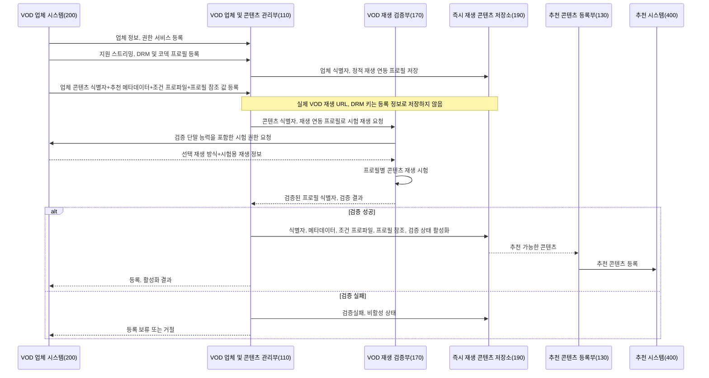

플랫폼은 먼저 업체 단위의 권한 서비스와 정적 재생 연동 프로필을 저장하고, 이후 별도의 콘텐츠 등록 절차에서 업체 콘텐츠 식별자와 추천용 콘텐츠 메타데이터, 시청 권한 획득 조건 프로파일 및 검증된 프로필 참조 값을 동일 플랫폼 콘텐츠 식별자에 연결한다. 콘텐츠 등록은 이미 등록된 업체 식별자, 권한 서비스 식별자 및 재생 연동 프로필 식별자를 참조하므로, 업체 등록 JSON과 콘텐츠 등록 JSON이 하나의 요청으로 함께 제출될 필요는 없다. 시험 요청에서 업체가 반환한 방식이 등록 프로필과 검증 단말 능력의 공통 지원 범위인지 확인하고 실제 재생까지 성공한 프로필만 활성화한다. 실제 콘텐츠 URL은 저장하지 않으므로 주소 변경, 만료, 유출 위험을 줄이고, 사용자 재생 시점에 업체의 최신 제공 조건, 선택된 조건 프로파일 및 실제 단말 능력을 적용할 수 있다.

###### 콘텐츠 검증 및 추천 활성화 기준

| 검증 대상 | 활성화 기준 | 실패 또는 무효화 기준 |
|---|---|---|
| 업체 등록 | 업체 식별자 중복 없음, 권한 서비스 접속 가능, 요청 규격 버전 확인, 응답 검증 키 확인, 하나 이상의 정적 재생 연동 프로필 존재 | 권한 서비스 인증 실패, 응답 서명 검증 불가, 프로필 식별자 중복, 지원 스트리밍, 코덱 정보 누락 |
| 콘텐츠 등록 | 업체 콘텐츠 식별자와 플랫폼 콘텐츠 식별자의 매핑 존재, 추천용 메타데이터 존재, 제공 지역, 기간 유효, 하나 이상의 조건 프로파일 및 프로필 참조 값 존재 | 실제 콘텐츠 URL 또는 DRM 키가 등록 레코드에 포함됨, 존재하지 않는 업체, 권한 서비스, 프로필 참조, 제공 기간 만료 |
| 조건 프로파일 | 조건 유형, 증빙 정보 유형, 권한 범위, 유효 시간 및 업체 권한 서비스 식별자 존재 | 조건 유형 미지원, 증빙 정보 유형 누락, 권한 범위가 업체 허용 범위 초과, 정산 참조 값 오류 |
| 시험 권한 획득 | 검증용 조건 증빙 정보 또는 업체가 허용한 검증 모드로 한시적 권한 발급 성공 | 업체 권한 발급 거절, 콘텐츠, 세션, 권한 범위 불일치, 응답 만료 또는 서명 오류 |
| 시험 재생 | 선택 재생 방식이 등록 프로필과 검증 단말 능력의 공통 지원 범위에 있고, 매니페스트 접근 및 재생 시작 성공 | 호환 방식 없음, 매니페스트 접근 실패, DRM 라이선스 요청 정보 누락, 재생 시작 실패 |
| 추천 활성화 | 하나 이상의 재생 연동 프로필에서 시험 재생 성공, 검증 유효 기간 내 상태 유지 | 업체 등록 버전 변경, 콘텐츠 등록 버전 변경, 조건 프로파일 변경, 검증 유효 기간 만료, 반복 재생 실패 |

추천 콘텐츠 등록부는 상기 활성화 기준을 만족한 콘텐츠만 추천 시스템에 등록한다. 활성화 이후 업체 권한 서비스, 정적 재생 연동 프로필, 조건 프로파일 또는 콘텐츠 제공 기간이 변경되면 기존 검증 결과를 무효화하고, 재검증 전까지 추천 등록을 해제하거나 비활성 상태로 전환할 수 있다.

##### 2) 추천 후보 생성, 처리 흐름

1. 추천 콘텐츠 등록부는 저장소에서 활성 업체에 속하고 재생 검증이 유효한 콘텐츠를 조회한다.
2. 플랫폼 콘텐츠 식별자와 추천용 메타데이터를 추천 시스템에 등록한다.
3. 추천 시스템은 제목, 장르, 등급, 대표 이미지, 제공 지역, 기간 등의 메타데이터로 후보를 생성한다.
4. 사용자 단말의 사용자 인터페이스에 추천 콘텐츠를 제공한다.
5. 사용자가 콘텐츠를 선택하면 사용자 인터페이스는 플랫폼 콘텐츠 식별자와 콘텐츠 정보버전을 즉시 재생 제어부에 전달한다.
6. 실제 재생 URL은 추천 시스템이나 사용자 인터페이스에 제공되지 않는다.

##### 3) 조건 유형별 실행, 검증 기준

시청 권한 조건 처리부는 콘텐츠 등록 레코드의 `entitlementConditionProfiles` 중 제공 지역, 제공 기간, 캠페인 상태, 프로모션 예산, 사용자 선택, 단말 능력, 업체 허용조건을 만족하는 조건 프로파일을 선택한다. `defaultConditionProfileId`가 존재하면 우선 적용할 수 있으나, 해당 조건이 만료되었거나 예산, 캠페인, 결제 정책상 적용 불가능하면 다른 조건 프로파일을 선택하거나 재생을 차단한다.

| 조건 유형 | 조건 실행 정보 | 조건 실행 결과 | 조건 충족 증빙 정보 | 실패 또는 차단 기준 |
|---|---|---|---|---|
| 광고 시청 | 광고 정책 식별자, 광고 요청 식별자, 광고 요구 시점, 광고 목록 버전 | 광고 재생 완료, 재생 시간, 광고 요청과 재생 결과의 일치 여부 | 광고 완료 증빙, 세션, 콘텐츠, 광고 요구 시점, 일회성 검증 값 결합 정보 | 광고 미완료, 광고 요청 불일치, 재생 결과 위변조 의심, 증빙 만료 |
| 사용자 단기 결제 | 가격, 통화, 결제 정책 식별자, 결제 승인 요청 식별자 | 결제 승인, 승인 금액, 승인 시각, 취소 또는 실패 여부 | 결제 승인 증빙, 결제 승인 식별자 또는 결제 승인 토큰 | 결제 실패, 금액, 통화 불일치, 승인 취소, 결제 증빙 만료 |
| 플랫폼 부담 프로모션 | 플랫폼 프로모션 캠페인 식별자, 예산정책, 허용 콘텐츠, 기간 | 프로모션 예산 예약, 예약 금액 또는 소진 단위, 예약 만료 시각 | 프로모션 예산 예약 증빙 | 예산 부족, 캠페인 만료, 허용 콘텐츠, 지역 불일치 |
| 업체 부담 무료 프로모션 | 업체 캠페인 식별자, 추천 노출 정책, 허용 콘텐츠, 기간 | 업체 캠페인 승인, 노출 정책 적용 결과 | 업체 캠페인 승인 증빙 | 캠페인 만료, 업체 승인 실패, 노출 정책 불일치 |
| 쿠폰 또는 멤버십 확인 | 쿠폰 식별자, 멤버십 정책 식별자, 적용 대상 | 쿠폰 사용 예약, 멤버십 유효성 확인 | 쿠폰 사용 증빙 또는 멤버십 확인 증빙 | 쿠폰 만료, 중복 사용, 멤버십 무효, 적용 대상 불일치 |

각 조건 유형의 과금액, 수익 배분율, 추천 노출량 또는 프로모션 예산 배정 방식은 사업 정책으로 변경될 수 있으므로 독립적인 발명의 핵심으로 한정하지 않는다. 본 발명의 기술적 핵심은 조건 유형별 실행 결과를 세션, 콘텐츠, 조건 프로파일 및 일회성 검증 값에 결합한 조건 충족 증빙 정보로 만들고, 그 증빙 정보가 생성된 경우에만 외부 VOD 업체 권한 요청을 허용하는 처리 구조에 있다.

##### 4) 조건 프로파일, 권한, 세션 생성 및 재생 흐름

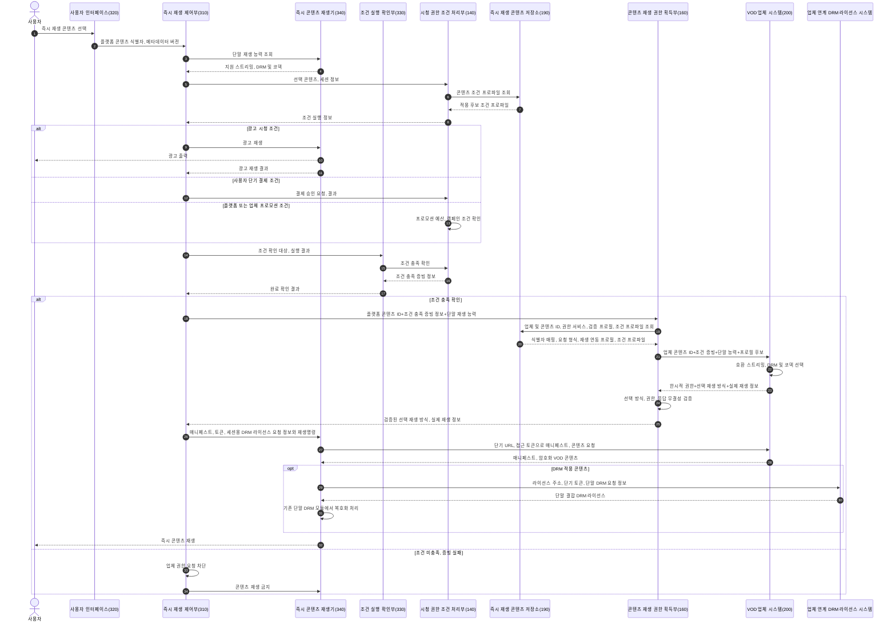

조건 충족 전에는 실제 재생 정보가 존재하지 않거나 단말에 제공되지 않는다. 조건 충족 확인 후 콘텐츠 재생 권한 획득부가 조건 충족 증빙 정보, 업체 콘텐츠 식별자와 단말 재생 능력을 업체 시스템에 전달하고, 업체 시스템은 등록, 검증된 재생 연동 프로필과 단말 재생 능력의 공통 지원 범위에서 실제 재생 방식을 선택한다. 콘텐츠 재생 권한 획득부는 선택 결과를 검증한 후 실제 재생 정보를 단말에 전달한다.

###### 정상 및 실패 실시예

| 실시예 | 처리 순서 | 결과 |
|---|---|---|
| 광고 시청 조건의 정상 재생 | 콘텐츠 선택, 광고 조건 프로파일 선택, 광고 재생 완료, 광고 완료 증빙 생성, 업체 권한 요청, 단기 재생 정보 취득, 즉시 재생 | 광고 시청이 외부 VOD 권한 획득 조건의 한 유형으로 처리되고, 업체 앱 진입 없이 콘텐츠가 재생된다. |
| 사용자 단기 결제 조건의 정상 재생 | 콘텐츠 선택, 단기 결제 조건 프로파일 선택, 결제 승인, 결제 승인 증빙 생성, 업체 권한 요청, 단기 재생 정보 취득, 즉시 재생 | 결제 자체가 아니라 결제 승인 증빙과 외부 VOD 업체 권한 발급의 결합이 보호된다. |
| 플랫폼 부담 프로모션의 정상 재생 | 콘텐츠 선택, 프로모션 조건 프로파일 선택, 플랫폼 예산 예약, 프로모션 증빙 생성, 업체 권한 요청, 단기 재생 정보 취득 | 플랫폼의 프로모션 비용 부담이 조건 증빙 정보와 정산 이벤트로 기록된다. |
| 조건 증빙 실패 | 조건 실행 결과가 누락되거나 조건 프로파일과 불일치 | 업체 권한 요청을 생성하지 않고 실제 재생 정보를 단말에 제공하지 않는다. |
| 업체 응답 불일치 | 업체 응답의 콘텐츠, 세션, 권한 범위, 선택 재생 방식 또는 서명이 원 요청과 불일치 | 권한 응답을 폐기하고 즉시 재생을 차단한다. |
| 재생 정보 만료 | 단기 URL, 접근 토큰 또는 DRM 라이선스 요청 정보가 만료 | 기존 재생 정보를 재사용하지 않고, 정책상 허용되는 경우 동일 세션의 유효 조건 증빙 정보 또는 새 조건 실행에 따라 다시 권한을 요청한다. |

DRM이 적용된 실시예에서 즉시 콘텐츠 재생기는 업체가 조건 충족 후 권한 응답으로 반환한 세션용 DRM 라이선스 요청 정보를 이용하여 업체 연계 라이선스 시스템과 직접 통신할 수 있다. 이 과정은 기존 DRM 규격을 사용할 수 있으며, DRM 알고리즘, 보안 하드웨어 또는 콘텐츠 키 생성방식 자체는 본 발명의 필수 차별점이 아니다. 차별점은 DRM 라이선스를 받기 위한 세션용 요청 정보가 등록 시 저장되는 것이 아니라 조건 충족 후 지연 취득되고, 실제 라이선스 취득과 키 사용은 단말 DRM 모듈에서 수행되며, 콘텐츠 키가 플랫폼 서버나 즉시 재생 제어부에 평문으로 전달되지 않는 처리 범위와 역할 분리에 있다.

##### 5) 부가 처리 및 정산 흐름

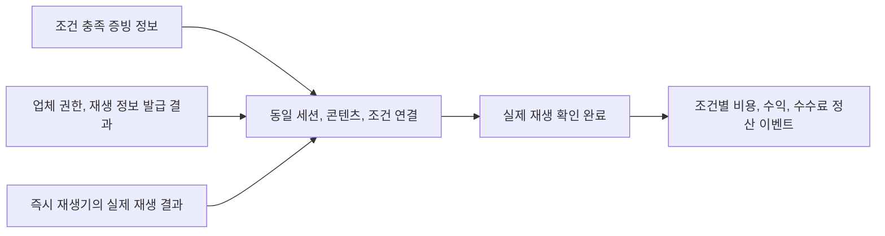

조건 충족 증빙 정보만 존재하고 업체 권한 발급 또는 실제 재생이 실패한 경우에는 조건별 정산을 보류하거나 별도 정책을 적용할 수 있다. 광고 선정, 결제 대행, 프로모션 과금 공식 자체는 본 발명의 필수 구성이 아니며, 조건 충족 증빙 정보, 권한 발급, 재생 결과가 같은 업체 콘텐츠 식별자와 세션 및 조건 프로파일로 연결되는 구조가 중요하다.

##### 6) 예외 처리 흐름

1. **업체 등록 정보 오류**: 업체 식별자, 권한 서비스 또는 응답 검증 정보가 유효하지 않으면 업체 등록을 보류하거나 거절한다.
2. **콘텐츠 검증 실패**: 시험 권한 획득 또는 시험 재생에 실패하면 콘텐츠를 비활성화하고 추천 시스템에 등록하지 않는다.
3. **조건 실행 정보 획득 실패**: 선택 콘텐츠에 요구되는 광고, 결제, 프로모션 또는 캠페인 조건 실행 정보를 얻지 못하면 즉시 재생을 시작하지 않는다.
4. **조건 미충족 또는 증빙 실패**: 콘텐츠 재생 권한 획득부를 호출하지 않고 재생을 차단한다.
5. **업체 권한 발급 거절**: 사용자에게 재생 불가 결과를 표시하고 실제 재생 정보를 제공하지 않는다.
6. **실제 재생 정보 만료**: 만료된 URL 및 토큰으로 재생하지 않고, 정책에 따라 새 조건 실행 또는 기존 유효 조건 충족 증빙 정보에 기반한 권한 재취득을 수행한다.
7. **업체 응답과 콘텐츠 불일치**: 업체, 콘텐츠, 세션, 권한 범위가 일치하지 않으면 응답을 폐기하고 보안 기록을 생성한다.
8. **호환 재생 방식 없음**: 등록, 검증된 재생 연동 프로필과 단말 재생 능력 사이에 공통 스트리밍, DRM 및 코덱 조합이 없으면 업체 권한을 요청하지 않거나 업체 응답을 거절하고 재생 불가를 표시한다.
9. **선택 재생 방식 불일치**: 업체가 반환한 선택 재생 방식이 등록 프로필, 콘텐츠 검증 결과 또는 단말 재생 능력에 포함되지 않으면 실제 재생 정보를 단말에 전달하지 않는다.
10. **DRM 라이선스 취득 실패**: 라이선스 주소, 토큰의 만료, DRM 체계 불일치 또는 라이선스 발급 거절 시 암호화 콘텐츠를 재생하지 않고 정책에 따라 동일 권한 범위에서 제한적으로 재시도한다.
11. **콘텐츠 재생 실패**: 동일 권한의 허용 범위에서 제한적으로 재시도하고, 실패가 지속되면 세션을 종료한다.
12. **추가 조건 실패**: 진행 중인 VOD 콘텐츠를 일시정지하고 다음 구간 권한을 요청하지 않는다.

##### 7) 개발 세부 사항

| 구분 | 내용 |
|---|---|
| 식별자 분리 | `platformContentId`, `providerId`, `providerContentId`, `playbackResourceId`의 의미와 매핑방향을 정의한다. 업체 식별자는 실제 URL을 포함하지 않는 불투명 값으로 구현할 수 있다. |
| 메타데이터 범위 | 추천에 필요한 제목, 장르, 등급, 줄거리, 이미지, 제공 지역, 기간을 정의하고, 실제 VOD 재생 주소와 명확히 구분한다. |
| 등록 API | 업체, 재생 연동 프로필, 콘텐츠 등록을 구분하고 버전, 인증, 중복 요청 방지, 변경 이력 및 비활성화 절차를 정의한다. |
| 정적 프로필 분리 | 업체가 지원하는 스트리밍, DRM 및 코덱, 권한 요청 규격을 업체 단위 프로필로 저장하고, 개별 콘텐츠는 프로필 식별자를 참조한다. 프로필에는 실제 콘텐츠 URL, 세션 토큰, DRM 키를 포함하지 않는다. |
| 실제 재생 정보 제외 | 등록 데이터 모델과 로그에서 실제 매니페스트 URL, 장기 토큰, DRM 키를 제외한다. 단기 URL이 운영 로그에 남는 경우 마스킹, 암호화, 짧은 보존 기간을 적용한다. |
| 등록 검증 | 업체 권한 서비스에 시험용 요청을 보내고 매니페스트 접근, 재생 시작까지 확인하는 검증 상태와 유효 기간을 정의한다. |
| 조건 프로파일 | 콘텐츠 식별자와 조건 유형, 조건 템플릿, 조건 파라미터, 증빙 유형, 권한 범위, 유효 시간 및 정산 참조 값의 매핑을 정의한다. |
| 조건 실행 | 광고 재생, 사용자 단기 결제 승인, 플랫폼 프로모션 예산 예약, 업체 무료 캠페인 승인 등 조건 유형별 실행 정보와 실패 조건을 정의한다. |
| 조건 충족 확인 | 실행 결과를 세션, 콘텐츠, 조건 프로파일에 결합하고, 일회성 검증 값, 서명, 서버 상태 조회 중 하나 이상으로 임의 완료를 제한한다. |
| 권한 요청 API | 업체별 엔드포인트, 인증 방식, 요청, 응답 규격, 오류코드, 재시도 및 응답검증방법을 정의한다. |
| 단말 재생 능력 | 즉시 재생기가 지원하는 스트리밍, DRM 및 코덱 집합을 권한 요청에 포함하되, 단말을 직접 식별할 필요가 없는 최소 능력 정보만 사용할 수 있다. |
| 호환 방식 선택 | VOD 업체가 등록 프로필과 단말 재생 능력의 공통 지원 범위에서 실제 스트리밍, DRM 및 코덱 조합을 선택하여 응답하고, 플랫폼은 등록, 검증 범위와 일치하는지 확인한다. |
| 지연 취득 응답 | 선택 재생 방식, 단기 URL, 접근 토큰, 매니페스트 위치, DRM 라이선스 주소, 단기 토큰, 허용 범위 및 만료 시각 중 실제 재생에 필요한 항목을 정의한다. |
| DRM 처리 범위와 역할 분리 | 플랫폼 서버는 세션용 DRM 라이선스 요청 정보를 전달할 수 있으나 콘텐츠 키를 평문으로 취득, 저장하지 않는다. 실제 라이선스 취득과 키 사용은 즉시 재생기와 기존 단말 DRM 모듈이 담당한다. |
| 권한 결합 | 조건 충족 증빙 정보, 업체 콘텐츠 식별자, 익명 세션, 단말 또는 재생구간을 업체 권한 요청에 결합한다. |
| 즉시 재생기 상태 | 콘텐츠 선택, 조건 대기, 조건 실행, 조건 확인, 권한 대기, 콘텐츠 재생, 일시정지, 완료, 실패 상태와 전이 조건을 정의한다. |
| 추가 조건 | 조건 요구 시점 도달 시 재생을 일시정지하고, 조건 충족 확인 후 다음 구간 권한과 실제 재생 정보를 재취득한다. |
| 보안 | 플랫폼과 업체의 상호 인증, 요청 서명, 응답 서명, 일회성 검증 값, URL 및 토큰 TTL 및 재사용 방지를 적용할 수 있다. |
| 개인정보 | VOD 업체 사용자 계정 대신 익명 즉시 재생 세션을 사용하고 정산, 감사에 필요한 최소 정보만 저장한다. |
| 정산 로그 | 조건 충족, 권한 발급, 실제 재생 시작, 완료를 같은 업체, 콘텐츠, 세션, 조건 프로파일로 연결한다. |

상기 개발 세부 사항은 특정 프로그래밍 언어, 데이터베이스 제품, 클라우드 사업자 또는 암호 알고리즘으로 한정할 필요가 없다. 다만 통상의 기술자가 구현할 수 있도록 입력 정보, 출력 정보, 구성부의 책임, 실행 순서, 실패 조건 및 하나 이상의 구체적 데이터 예를 명세서에 포함하는 것이 바람직하다.

#### 다. 발명의 효과

1. 플랫폼은 실제 VOD 콘텐츠 파일이나 장기 재생 URL을 보유하지 않고도 복수 업체 콘텐츠를 추천, 즉시 재생할 수 있다.
2. 실제 재생 정보를 조건 충족 후 지연 취득하므로 등록 시점의 URL 만료, 변경, 유출과 동기화 문제를 줄일 수 있다.
3. 업체 제공 식별자와 추천용 실제 메타데이터를 분리 저장하여 업체 내부 콘텐츠 구조를 노출하지 않으면서 추천 품질을 유지할 수 있다.
4. 선택된 조건 프로파일의 충족이 확인된 경우에만 업체 권한 요청을 수행하므로 광고, 단기 결제, 프로모션 등 다양한 이용 자격을 공통 구조로 기술적으로 강제할 수 있다.
5. 콘텐츠 권한의 발급 주체를 VOD 업체로 유지하여 업체의 기존 계약, DRM, 지역, 기간 정책을 적용할 수 있다.
6. 사용자에게 VOD 업체 앱 설치와 업체 계정 로그인을 요구하지 않고 플랫폼의 즉시 재생기로 콘텐츠를 제공할 수 있다.
7. 등록 단계의 실제 재생 검증으로 추천되었지만 재생되지 않는 콘텐츠를 줄일 수 있다.
8. 복수 업체의 서로 다른 권한 API를 플랫폼 저장소의 식별자, 서비스 매핑으로 통합할 수 있다.
9. 조건 충족, 업체 권한, 실제 재생을 동일 세션에 연결하여 조건별 수익 배분, 결제 수수료, 프로모션 비용 또는 노출비 정산 근거를 생성할 수 있다.
10. 추가 조건마다 다음 구간의 한시적 권한을 취득하여 콘텐츠의 계속 재생을 구간 단위로 제어할 수 있다.
11. 업체 단위의 정적 재생 연동 프로필을 개별 콘텐츠 등록 정보와 분리함으로써 동일 연동 규격의 중복 저장을 줄이고 업체의 지원 방식 변경을 일관되게 반영할 수 있다.
12. 실제 단말 재생 능력과 업체 지원 범위의 공통 조합을 재생 시점에 선택하므로 단말과 호환되지 않는 스트리밍, DRM 및 코덱으로 인한 재생 실패를 줄일 수 있다.
13. DRM 콘텐츠 키를 플랫폼 서버에 노출하지 않고 기존 단말 DRM 모듈에서 처리함으로써 VOD 업체의 기존 콘텐츠 보호 체계를 유지할 수 있다.

<!-- page-break:page-5 -->

## 3. 권리청구의 범위

이하 청구항은 직무발명서 단계의 초안이며, 정식 출원 시 선행기술 조사결과와 관할국 실무에 따라 용어, 범위, 인용관계를 조정한다.

### 청구항 1

VOD 업체 시스템이 제공하는 콘텐츠를 사용자 단말에서 즉시 재생하도록 즉시 재생 플랫폼이 수행하는 방법에 있어서,

상기 즉시 재생 플랫폼이 상기 VOD 업체 시스템으로부터 업체 식별자, 권한 서비스 식별자, 권한 요청 규격, 지원 스트리밍 방식 및 지원 코덱을 포함하고 DRM 적용 콘텐츠의 경우 지원 DRM 체계 및 정적 DRM 연동 정보를 더 포함하는 정적 재생 연동 프로필을 업체 단위로 등록받아 저장하는 단계;

상기 즉시 재생 플랫폼이 상기 정적 재생 연동 프로필의 등록 이후 또는 별도의 콘텐츠 등록 요청에 따라, 상기 VOD 업체 시스템이 부여한 업체 콘텐츠 식별자, 플랫폼 콘텐츠 식별자, 상기 콘텐츠의 추천을 위한 콘텐츠 메타데이터, 권한 서비스 식별자, 하나 이상의 정적 재생 연동 프로필 참조 값 및 하나 이상의 시청 권한 획득 조건 프로파일을 콘텐츠 단위로 등록받아 서로 연결하여 저장하는 단계;

상기 시청 권한 획득 조건 프로파일은 조건 유형, 조건 충족 증빙 정보의 유형 및 조건 충족 후 요청 가능한 재생 권한 범위를 포함하고, 조건 실행 정보 또는 조건 실행 정보 참조 값과 조건별 정산 참조 값 중 하나 이상을 더 포함하는 단계;

상기 즉시 재생 플랫폼이 상기 콘텐츠 단위의 등록 정보 또는 상시 보관용 카탈로그 저장소에 상기 콘텐츠의 실제 재생을 위한 네트워크 위치 정보, DRM 키 또는 특정 콘텐츠, 세션, 단말, 재생구간에 결합되는 세션용 DRM 라이선스 요청 정보를 저장하지 않는 단계;

상기 즉시 재생 플랫폼이 상기 콘텐츠 메타데이터와 상기 플랫폼 콘텐츠 식별자를 추천 시스템에 제공하고, 상기 사용자 단말로부터 상기 플랫폼 콘텐츠 식별자에 대응하는 콘텐츠의 즉시 재생 선택 정보를 수신하는 단계;

상기 즉시 재생 플랫폼이 상기 선택된 콘텐츠에 연결된 하나 이상의 시청 권한 획득 조건 프로파일 중 적용할 조건 프로파일을 선택하고, 상기 선택된 조건 프로파일에 대응하는 조건 실행 정보를 생성 또는 제공하는 단계;

상기 즉시 재생 플랫폼이 상기 조건 실행 정보에 대한 조건 실행 결과를 확인하고, 상기 조건 실행 결과가 상기 선택된 조건 프로파일을 충족하는 경우 상기 플랫폼 콘텐츠 식별자, 즉시 재생 세션, 상기 선택된 조건 프로파일 및 일회성 검증 값을 결합한 조건 충족 증빙 정보를 생성하는 단계;

상기 조건 충족 증빙 정보가 생성된 경우에만, 상기 즉시 재생 플랫폼이 상기 플랫폼 콘텐츠 식별자를 이용하여 상기 저장된 업체 콘텐츠 식별자, 권한 서비스 식별자 및 정적 재생 연동 프로필 참조 값을 조회하고, 상기 조건 충족 증빙 정보, 상기 업체 콘텐츠 식별자, 상기 정적 재생 연동 프로필 참조 값 및 상기 사용자 단말의 단말 재생 능력 정보를 포함하는 재생 권한 요청을 상기 VOD 업체 시스템에 전송하는 단계;

상기 즉시 재생 플랫폼이 상기 VOD 업체 시스템으로부터 상기 정적 재생 연동 프로필과 상기 단말 재생 능력 정보의 공통 지원 범위에서 선택된 선택 재생 방식, 상기 콘텐츠의 한시적 재생 권한 및 상기 콘텐츠의 실제 재생을 위한 재생 정보를 포함하는 권한 응답을 취득하는 단계;

상기 즉시 재생 플랫폼이 상기 선택 재생 방식이 상기 정적 재생 연동 프로필 및 상기 단말 재생 능력 정보의 범위에 포함되는지 확인하는 단계; 및

상기 즉시 재생 플랫폼이 확인된 상기 선택 재생 방식, 상기 한시적 재생 권한 및 상기 재생 정보를 상기 사용자 단말의 즉시 콘텐츠 재생기에 제공하는 단계를 포함하는 시청 권한 획득 조건 프로파일 기반 외부 VOD 콘텐츠 즉시 재생 방법.

### 청구항 2

청구항 1에 있어서, 상기 콘텐츠 메타데이터는 제목, 장르, 출연진, 이용등급, 줄거리, 대표 이미지, 재생 시간, 제공 지역 및 제공 기간 중 하나 이상을 포함하고, 상기 네트워크 위치 정보는 실제 콘텐츠 URL 및 실제 매니페스트 URL 중 하나 이상을 포함하며, 상기 세션용 DRM 라이선스 요청 정보는 라이선스 서버 주소, 단기 DRM 라이선스 요청 토큰 및 DRM 체계 식별자 중 하나 이상을 포함하는 방법.

### 청구항 3

청구항 1에 있어서, 상기 시청 권한 획득 조건 프로파일은 조건 프로파일 식별자, 조건 유형, 플랫폼이 제공하는 조건 템플릿 식별자, 조건 유형별 실행 파라미터, 조건 충족 증빙 정보의 세션 결합 여부, 단말 결합 여부, 일회성 검증 값 요구 여부, 권한 유효 시간 및 업체 권한 서비스 식별자 중 하나 이상을 포함하는 방법.

### 청구항 4

청구항 1에 있어서, 상기 시청 권한 획득 조건 프로파일의 조건 유형은 광고 시청, 플랫폼 부담 프로모션, 사용자 단기 결제, 업체 부담 무료 프로모션, 쿠폰 및 멤버십 확인 중 하나 이상을 포함하는 방법.

### 청구항 5

청구항 4에 있어서, 상기 조건 유형이 광고 시청인 경우 상기 조건 실행 정보는 광고 정책 식별자, 광고 요청 식별자, 광고 요구 시점 및 광고 목록 버전 중 하나 이상을 포함하고, 상기 조건 충족 증빙 정보는 광고 재생 결과, 즉시 재생 세션, 콘텐츠 식별자 및 일회성 검증 값을 결합한 광고 완료 증빙 정보를 포함하는 방법.

### 청구항 6

청구항 4에 있어서, 상기 조건 유형이 사용자 단기 결제인 경우 상기 조건 충족 증빙 정보는 결제 승인 식별자 또는 결제 승인 토큰을 포함하고, 상기 조건 유형이 플랫폼 부담 프로모션 또는 업체 부담 무료 프로모션인 경우 상기 조건 충족 증빙 정보는 프로모션 예산 예약 식별자 또는 업체 캠페인 승인 식별자를 포함하는 방법.

### 청구항 7

청구항 1에 있어서, 상기 정적 재생 연동 프로필을 포함하는 업체 등록 레코드는 개별 콘텐츠 식별자 및 추천용 콘텐츠 메타데이터를 포함하지 않고, 상기 콘텐츠 단위의 등록 정보를 포함하는 콘텐츠 등록 레코드는 상기 정적 재생 연동 프로필의 정의를 포함하지 않으며, 상기 콘텐츠 등록 레코드는 업체 식별자, 권한 서비스 식별자, 정적 재생 연동 프로필 식별자 및 시청 권한 획득 조건 프로파일 식별자를 참조 값으로 포함하는 방법.

### 청구항 8

청구항 1에 있어서, 상기 즉시 재생 플랫폼이 상기 등록된 업체 콘텐츠 식별자, 권한 서비스 식별자 및 정적 재생 연동 프로필 참조 값을 이용하여 검증용 재생 권한을 획득하고 상기 콘텐츠의 실제 재생 가능성을 시험하며, 상기 시험에 성공한 콘텐츠만 상기 추천 시스템에 등록하는 방법.

### 청구항 9

청구항 1에 있어서, 상기 단말 재생 능력 정보는 상기 사용자 단말이 지원하는 스트리밍 방식, DRM 체계, 비디오 코덱, 오디오 코덱, 해상도 및 보안 수준 중 하나 이상을 포함하고, 상기 권한 응답을 취득하는 단계는 상기 VOD 업체 시스템이 상기 정적 재생 연동 프로필과 상기 단말 재생 능력 정보의 공통 지원 범위에서 선택한 스트리밍 방식, DRM 체계 또는 코덱을 나타내는 선택 재생 방식을 취득하는 단계를 포함하는 방법.

### 청구항 10

청구항 1에 있어서, 상기 재생 정보는 단기 콘텐츠 URL, 매니페스트 위치, 콘텐츠 접근 토큰 또는 세션용 DRM 라이선스 요청 정보 중 하나 이상을 포함하고, 상기 세션용 DRM 라이선스 요청 정보는 특정 콘텐츠, 세션, 단말, 재생구간 또는 유효 시간에 한정되어 상기 조건 충족 증빙 정보가 생성된 후 상기 VOD 업체 시스템의 권한 응답으로 취득되며, DRM이 적용된 경우 상기 즉시 콘텐츠 재생기는 상기 세션용 DRM 라이선스 요청 정보를 이용하여 업체 연계 DRM 라이선스 시스템으로부터 라이선스를 취득하고 콘텐츠 키는 상기 즉시 재생 플랫폼에 평문으로 전달되지 않는 방법.

### 청구항 11

청구항 1에 있어서, 상기 콘텐츠의 재생 중 추가 조건 요구 시점에 도달하면 상기 즉시 콘텐츠 재생기가 콘텐츠 재생을 일시정지하고, 추가 조건의 충족이 확인된 후 상기 즉시 재생 플랫폼이 다음 재생구간의 한시적 재생 권한 및 갱신된 재생 정보를 상기 VOD 업체 시스템으로부터 취득하는 방법.

### 청구항 12

청구항 1에 있어서, 상기 업체 콘텐츠 식별자는 상기 실제 재생을 위한 네트워크 위치 정보를 포함하지 않는 불투명 식별자이고, 상기 즉시 재생 플랫폼은 플랫폼 콘텐츠 식별자를 매개로 상기 업체 콘텐츠 식별자, 상기 콘텐츠 메타데이터, 시청 권한 획득 조건 프로파일, 권한 서비스 식별자 및 정적 재생 연동 프로필 식별자를 연결하는 방법.

### 청구항 13

청구항 1에 있어서, 상기 조건 충족 증빙 정보, 상기 VOD 업체 시스템의 권한 응답 및 상기 즉시 콘텐츠 재생기의 실제 재생 결과를 동일한 즉시 재생 세션, 업체, 콘텐츠, 조건 프로파일과 연결하고, 연결된 결과를 광고 수익 배분, 결제 수수료, 플랫폼 부담 프로모션 비용 또는 업체 부담 추천 노출비 중 하나 이상의 정산 근거로 생성하는 방법.

### 청구항 14

청구항 1에 있어서, 상기 조건 충족 증빙 정보는 조건 증빙 식별자, 조건 프로파일 식별자, 조건 유형, 즉시 재생 세션 식별자, 플랫폼 콘텐츠 식별자, 일회성 검증 값, 만료 시각 및 무결성 검증 값 중 하나 이상을 포함하고, 실제 콘텐츠 URL, 콘텐츠 접근 토큰, DRM 라이선스 또는 콘텐츠 키를 포함하지 않으며, 상기 즉시 재생 플랫폼은 만료되었거나 이미 사용된 조건 충족 증빙 정보를 포함하는 재생 권한 요청을 생성하지 않거나 거절하는 방법.

### 청구항 15

청구항 1에 있어서, 상기 즉시 재생 플랫폼은 상기 VOD 업체 시스템으로부터 취득한 실제 재생 정보를 즉시 재생 세션의 메모리 또는 세션 저장 영역에 한시적으로 유지하고, 상기 실제 재생 정보의 만료, 재생 종료 또는 단말 전달 완료 중 하나 이상이 발생하면 단기 콘텐츠 URL, 콘텐츠 접근 토큰 또는 세션용 DRM 라이선스 요청 정보를 상시 보관용 카탈로그 저장소에 저장하지 않거나 삭제 또는 마스킹하는 방법.

### 청구항 16

시청 권한 획득 조건 프로파일 기반 외부 VOD 콘텐츠 즉시 재생 시스템에 있어서,

VOD 업체 시스템에 업체 등록 인터페이스와 콘텐츠 등록 인터페이스를 분리하여 제공하고, 상기 업체 등록 인터페이스를 통해 업체 식별자, 권한 서비스 식별자, 권한 요청 규격, 지원 스트리밍 방식 및 지원 코덱을 포함하고 DRM 적용 콘텐츠의 경우 지원 DRM 체계 및 정적 DRM 연동 정보를 더 포함하는 정적 재생 연동 프로필을 업체 단위로 등록받으며, 상기 콘텐츠 등록 인터페이스를 통해 업체 콘텐츠 식별자, 플랫폼 콘텐츠 식별자, 추천용 콘텐츠 메타데이터, 시청 권한 획득 조건 프로파일, 권한 서비스 식별자 및 정적 재생 연동 프로필 참조 값을 콘텐츠 단위로 등록받는 VOD 업체 및 콘텐츠 관리부;

상기 업체 단위의 정적 재생 연동 프로필과 상기 콘텐츠 단위의 등록 정보를 서로 구분하여 저장하고, 상기 콘텐츠 단위의 등록 정보에서는 상기 업체 콘텐츠 식별자와 상기 추천용 콘텐츠 메타데이터, 상기 시청 권한 획득 조건 프로파일 및 상기 정적 재생 연동 프로필 참조 값을 서로 연결하여 저장하되 실제 콘텐츠의 네트워크 위치 정보, DRM 키 또는 세션용 DRM 라이선스 요청 정보를 등록 정보 또는 상시 보관용 카탈로그 저장소에 저장하지 않는 즉시 재생 콘텐츠 저장소;

상기 콘텐츠 메타데이터를 이용하여 검증된 콘텐츠를 추천 시스템에 등록하는 추천 콘텐츠 등록부;

사용자 단말에서 선택된 콘텐츠에 연결된 하나 이상의 시청 권한 획득 조건 프로파일 중 적용 조건 프로파일을 선택하고, 상기 적용 조건 프로파일에 대응하는 조건 실행 정보를 제공하며, 조건 실행 결과가 상기 적용 조건 프로파일을 충족하는 경우 즉시 재생 세션, 콘텐츠 식별자, 조건 프로파일 및 일회성 검증 값을 결합한 조건 충족 증빙 정보를 생성하는 시청 권한 조건 처리부;

상기 조건 충족 증빙 정보가 생성된 경우에만 상기 저장소에서 상기 선택된 콘텐츠에 대응하는 업체 콘텐츠 식별자, 권한 서비스 식별자 및 정적 재생 연동 프로필 참조 값을 조회하고, 상기 업체 콘텐츠 식별자, 상기 조건 충족 증빙 정보와 사용자 단말의 재생 능력 정보를 이용하여 상기 VOD 업체 시스템에 상기 콘텐츠의 한시적 재생 권한을 요청하며, 상기 VOD 업체 시스템으로부터 상기 정적 재생 연동 프로필과 상기 사용자 단말의 재생 능력 정보의 공통 지원 범위에서 선택된 재생 방식, 상기 한시적 재생 권한 및 실제 재생 정보를 취득하고, 상기 선택된 재생 방식이 상기 정적 재생 연동 프로필 및 상기 사용자 단말의 재생 능력 정보의 범위에 포함되는지 확인하는 콘텐츠 재생 권한 획득부; 및

상기 사용자 단말의 재생 능력 정보를 제공하고, 조건 유형이 광고 시청인 경우 광고를 재생하며, 상기 콘텐츠 재생 권한 획득부가 취득한 상기 선택된 재생 방식, 한시적 재생 권한 및 실제 재생 정보를 이용하여 상기 VOD 업체 시스템의 콘텐츠를 재생하는 상기 사용자 단말의 즉시 콘텐츠 재생기를 포함하는 즉시 콘텐츠 재생 시스템.

### 청구항 17

청구항 16에 있어서, 상기 VOD 업체 및 콘텐츠 관리부의 요청에 따라 상기 콘텐츠 재생 권한 요청 정보와 정적 재생 연동 프로필을 이용한 검증용 권한 획득 및 상기 콘텐츠의 프로필별 시험 재생을 수행하고 검증된 재생 연동 프로필 식별자를 반환하는 VOD 재생 검증부를 더 포함하며, 상기 추천 콘텐츠 등록부는 하나 이상의 재생 연동 프로필에 대한 검증 결과가 성공인 콘텐츠만 상기 추천 시스템에 등록하는 시스템.

### 청구항 18

즉시 콘텐츠 재생 사용자 단말에 있어서,

추천용 콘텐츠 메타데이터를 표시하고 사용자의 즉시 재생 콘텐츠 선택을 수신하는 사용자 인터페이스;

상기 사용자 단말이 지원하는 스트리밍 방식, DRM 체계 및 코덱 중 하나 이상을 포함하는 단말 재생 능력 정보를 제공하고, 조건 유형이 광고 시청인 경우 광고를 재생하며, VOD 콘텐츠를 재생하고 재생 결과를 반환하는 멀티미디어 재생기;

즉시 재생 플랫폼의 시청 권한 조건 처리부가 제공한 조건 실행 정보와 조건 실행 결과를 이용하여 상기 시청 권한 조건 처리부와 조건 충족을 확인하는 조건 실행 확인부; 및

상기 사용자 인터페이스가 전달한 선택 콘텐츠 정보를 상기 시청 권한 조건 처리부에 제공하고, 상기 조건 실행 확인부가 조건 충족을 확인한 경우에만 상기 단말 재생 능력 정보와 함께 상기 즉시 재생 플랫폼에 상기 선택 콘텐츠의 재생 권한 취득을 요청하며, 상기 즉시 재생 플랫폼이 VOD 업체 시스템으로부터 취득한 선택 재생 방식, 한시적 재생 권한 및 실제 재생 정보를 상기 멀티미디어 재생기에 제공하여 상기 VOD 콘텐츠를 재생시키는 즉시 재생 제어부를 포함하고,

상기 실제 재생 정보가 세션용 DRM 라이선스 요청 정보를 포함하는 경우 상기 멀티미디어 재생기는 조건 충족 후 취득된 상기 세션용 DRM 라이선스 요청 정보를 이용하여 업체 연계 DRM 라이선스 시스템으로부터 라이선스를 직접 취득하고 기존 단말 DRM 모듈에서 콘텐츠 키를 처리하는 사용자 단말.

### 청구항 19

프로세서에 의해 실행될 때 청구항 1 내지 청구항 15 중 어느 한 항의 방법을 수행하도록 하는 명령어를 포함하는 프로그램이 기록된 컴퓨터 판독 가능한 기록매체.

### 추가 종속항 후보

1. 업체별로 서로 다른 권한 서비스 주소, 인증 방식, 요청 규격, 응답 검증 키를 저장하는 구성
2. 콘텐츠 등록 정보가 업체 콘텐츠 식별자와 업체 권한 서비스 식별자를 함께 포함하는 구성
3. 조건 충족 후 업체 권한 서비스 장애 시 동일 요청 식별자 또는 재시도 식별자로 제한적으로 재시도하는 구성
4. 등록 정보 변경 시 기존 재생 검증 결과를 무효화하고 추천 등록을 해제하는 구성
5. 콘텐츠별 조건 프로파일과 업체별 권한 유효 시간을 별도로 설정하는 구성
6. 실제 재생 정보가 VOD 업체의 CDN, DRM 서비스에 대한 단기 접근 정보를 포함하는 구성
7. 하나의 업체가 복수 재생 연동 프로필을 등록하고 개별 콘텐츠가 하나 이상의 검증된 프로필을 참조하는 구성
8. 업체가 선택한 재생 방식이 등록 프로필, 단말 재생 능력, 콘텐츠 검증 결과에 모두 포함되는지 플랫폼이 확인하는 구성
9. DRM 라이선스 요청 토큰을 콘텐츠, 세션, 단말, 만료 시각 중 하나 이상에 결합하는 구성
10. 조건 프로파일의 우선 순위, 제공 지역, 제공 기간 또는 캠페인 상태를 이용하여 적용 조건을 선택하는 구성
11. 조건별 정산 이벤트의 상태가 유효 재생 시간, 재생 시작, 재생 완료 또는 오류 상태 중 하나 이상에 따라 확정, 보류 또는 취소로 결정되는 구성

<!-- page-break:page-6 -->

## 4. 도 면

## 가. 종래기술의 도면

### 도 1. VOD 업체 앱 기반 재생 흐름

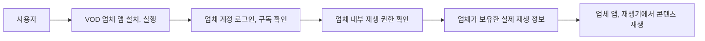

도 1은 사용자가 VOD 업체 앱과 계정을 통해 업체 내부 권한 및 재생 정보를 이용하는 종래의 폐쇄형 재생구조를 나타낸다.

### 도 2. 일반 광고 기반 콘텐츠 재생 흐름


도 2는 광고와 콘텐츠 권한을 동일 서비스가 관리하는 일반적인 광고 기반 재생구조를 나타낸다. 이 구조에는 외부 VOD 업체 식별자 등록, 실제 재생 정보 지연 취득 및 업체 발급 권한의 중개가 필수적으로 포함되지 않는다.

## 나. 본 발명의 도면

### 도 3. 본 발명의 전체 시스템 구조

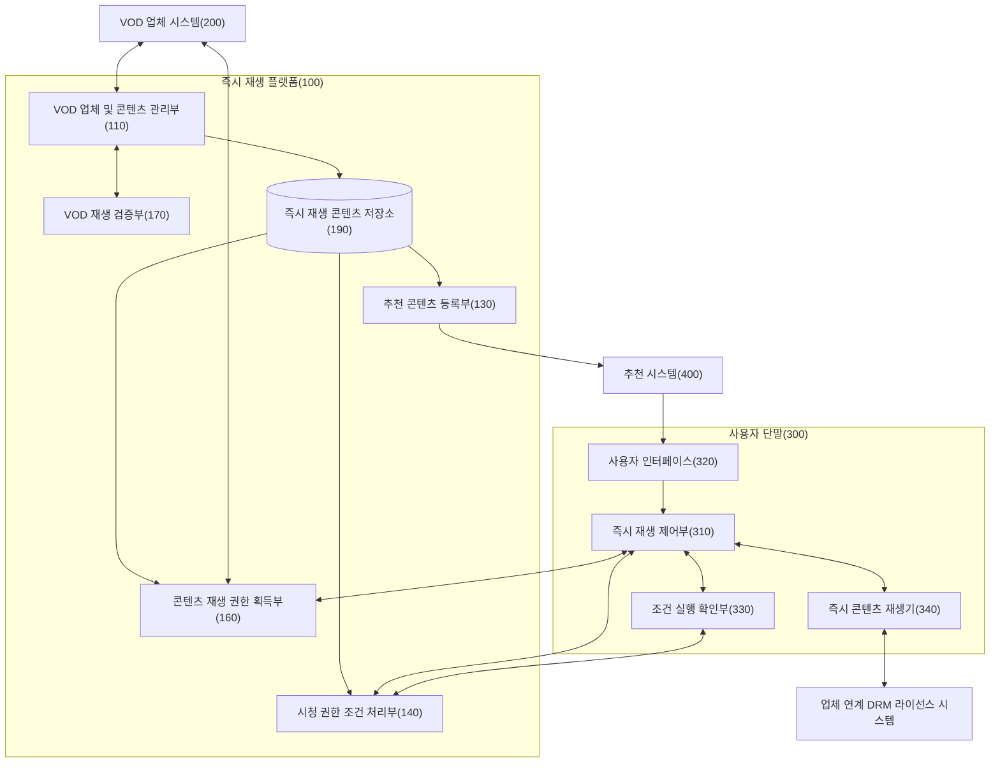

도 3은 플랫폼, VOD 업체, 추천 시스템, 사용자 단말의 시스템 경계와 구성부의 정적 연결 관계를 나타낸다. 업체 단위의 정적 재생 연동 프로필은 관리부를 통해 저장소에 저장되고, 콘텐츠는 해당 프로필 및 시청 권한 획득 조건 프로파일을 참조한다. DRM이 적용된 경우 단말의 즉시 콘텐츠 재생기가 업체 연계 DRM 라이선스 시스템과 통신하며, 플랫폼 서버는 콘텐츠 키를 직접 처리하지 않는다.

### 도 4. 등록 정보와 실제 재생 정보의 분리

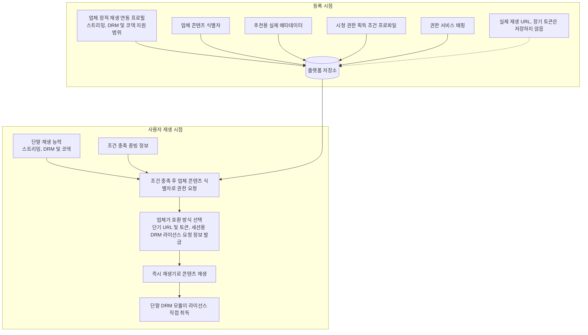

도 4는 등록 시 저장되는 업체 식별자, 메타데이터, 조건 프로파일, 정적 재생 연동 프로필과 사용자 재생 시점에 결정, 취득되는 선택 재생 방식 및 실제 재생 정보의 차이를 나타낸다.

### 도 5. 조건 충족 후 업체 재생 권한 취득 흐름

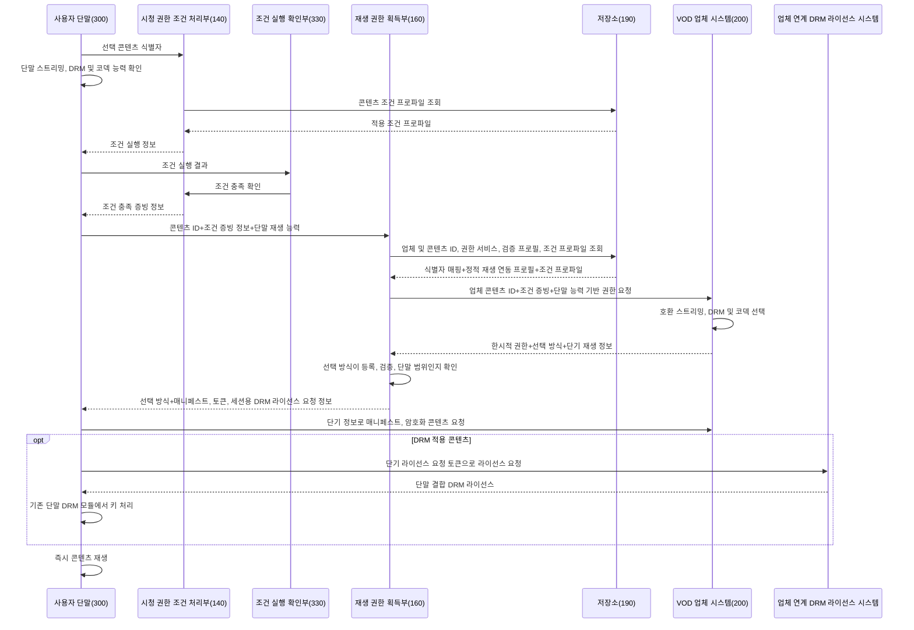

도 5는 플랫폼이 조건 충족 전에는 업체 권한을 요청하지 않고, 조건 충족 후 등록된 업체 콘텐츠 식별자와 단말 재생 능력을 사용하여 업체가 선택한 실제 재생 방식 및 재생 정보를 취득하는 순서를 나타낸다. DRM 라이선스 취득 자체는 종래 스트리밍에서도 존재할 수 있으나, 본 흐름에서는 세션용 DRM 라이선스 요청 정보가 등록 시 저장되지 않고 조건 충족 후 업체 권한 응답으로 지연 취득되며, 실제 라이선스와 콘텐츠 키의 사용은 기존 단말 DRM 모듈에서 처리된다.

### 도 6. 콘텐츠 재생 상태 전이

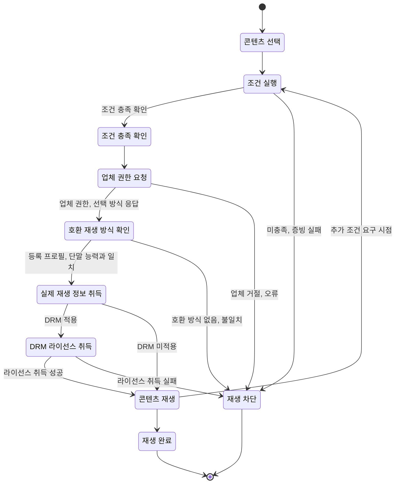

도 6은 조건 충족 확인과 업체 권한 발급이 모두 성공해야 콘텐츠 재생 상태로 전이되는 것을 나타낸다.

<!-- page-break:page-7 -->

## 5. 부록: 요약서 및 출원 전략

### 5.1 요약서

본 발명은 VOD 업체 시스템이 제공하는 콘텐츠를 업체 앱 설치 또는 업체 계정 로그인 없이 사용자 단말에서 즉시 재생하는 시스템 및 방법에 관한 것이다. 즉시 재생 플랫폼은 VOD 업체가 지원하는 스트리밍, DRM, 코덱, 권한 요청 규격 및 정적 DRM 연동 정보를 업체 단위의 정적 재생 연동 프로필로 저장한다. 또한 업체 등록과 분리된 콘텐츠 등록을 통해 업체 콘텐츠 식별자, 프로필 참조 값, 추천용 콘텐츠 메타데이터 및 하나 이상의 시청 권한 획득 조건 프로파일을 콘텐츠 단위로 연결하여 저장한다. 이때 실제 콘텐츠 URL, 장기 접근 토큰, DRM 키 또는 세션용 DRM 라이선스 요청 정보는 콘텐츠 등록 정보로 저장하지 않는다.

조건 프로파일은 광고 시청, 플랫폼 부담 프로모션, 사용자 단기 결제, 업체 부담 무료 프로모션 등 조건 유형과 조건 충족 증빙 정보의 형식, 권한 범위, 유효 시간 및 정산 참조 값을 포함할 수 있다. 검증된 콘텐츠의 메타데이터는 추천 시스템에 등록된다. 사용자가 단말에서 콘텐츠를 선택하면 플랫폼은 적용할 조건 프로파일을 선택하고 조건 실행 정보를 제공하며, 조건 실행 결과가 선택 조건을 충족하는 경우 조건 충족 증빙 정보를 생성한다.

조건 충족 증빙 정보가 생성된 경우에만 플랫폼은 저장된 업체 콘텐츠 식별자와 단말 재생 능력을 이용하여 해당 VOD 업체 시스템에 한시적 재생 권한을 요청한다. VOD 업체 시스템은 등록 프로필과 단말 재생 능력의 공통 지원 범위에서 실제 스트리밍, DRM 및 코덱 조합을 선택하고, 단기 URL, 접근 토큰, 매니페스트 위치 또는 세션용 DRM 라이선스 요청 정보를 포함하는 실제 재생 정보를 반환한다. 플랫폼은 취득한 선택 재생 방식, 한시적 권한 및 실제 재생 정보를 사용자 단말의 즉시 콘텐츠 재생기에 제공한다.

DRM이 적용된 경우 즉시 콘텐츠 재생기는 조건 충족 후 취득된 세션용 DRM 라이선스 요청 정보를 이용하여 업체 연계 DRM 라이선스 시스템으로부터 단말 결합 라이선스를 직접 취득하고, 기존 단말 DRM 모듈에서 콘텐츠 키를 처리한다. 단말이 DRM 라이선스로 보호 콘텐츠를 복호화하는 구조 자체는 종래 스트리밍에도 존재할 수 있다. 본 발명은 세션용 DRM 라이선스 요청 정보를 등록 단계에서 저장하지 않고 조건 충족 후 권한 응답으로 취득하며, 단말이 라이선스를 직접 취득하고 플랫폼에는 콘텐츠 키가 노출되지 않도록 처리 범위와 역할을 분리하는 점을 결합한다.

### 5.2 출원 전략

가장 넓은 독립항은 다음 결합을 중심으로 한다.

> `업체 단위 정적 재생 연동 프로필 등록` + `분리된 콘텐츠 단위 식별자, 추천 메타데이터, 조건 프로파일 등록` + `콘텐츠 등록 정보에서 실제 재생 정보 제외` + `조건 프로파일 선택, 실행, 증빙 정보 생성` + `조건 증빙 정보와 업체 식별자 및 단말 재생 능력 기반 권한 요청` + `업체 응답으로 선택 재생 방식과 실제 재생 정보 지연 취득` + `플랫폼 즉시 재생기에서 콘텐츠 재생`

1. 방법 독립항은 업체 등록과 콘텐츠 등록의 분리, 등록 데이터와 실행 재생 정보의 분리, 조건 프로파일 선택, 조건 충족, 업체 권한, 재생까지의 시간적 순서를 보호한다.
2. 시스템 독립항은 분리된 업체 등록 인터페이스와 콘텐츠 등록 인터페이스, 플랫폼 저장소, 시청 권한 조건 처리부, 권한 획득부 및 단말 재생기의 상호 관계를 보호한다.
3. 사용자 단말 독립항은 사용자 인터페이스, 즉시 재생 제어부, 조건 실행 확인부 및 재생기의 결합을 보호한다.
4. 등록 검증과 검증 성공 콘텐츠의 추천 등록은 종속항과 별도 플랫폼 독립항으로 준비한다.
5. 업체 단위 정적 재생 연동 프로필, 콘텐츠별 프로필 참조, 단말 능력 전달 및 업체의 호환 방식 선택은 독립항의 핵심 결합에 포함하고 종속항에서 세부 필드를 확장한다.
6. DRM 라이선스의 단말 직접 취득과 플랫폼에 콘텐츠 키를 노출하지 않는 구성은 기존 DRM 자체를 청구하기보다, 세션용 DRM 라이선스 요청 정보가 등록 시 저장되지 않고 조건 충족 후 VOD 업체 권한 응답으로 지연 취득되는 플랫폼, 업체 및 단말의 처리 범위와 역할 분리를 중심으로 보호한다.
7. 광고 시청, 단기 결제, 플랫폼 부담 프로모션, 업체 부담 무료 프로모션, 추가 조건별 권한 갱신, 단기 URL 및 토큰, 세션 결합, 일회성 조건 증빙 정보와 조건별 정산 로그를 종속항으로 확장한다.

### 5.3 식별자, 메타데이터, 재생 정보 분리의 보강 방향

독립항에서는 등록 시 저장되는 정보와 실행 시 취득되는 정보를 명확히 구분한다.

- 업체 단위로 등록, 저장: 정적 재생 연동 프로필, 지원 스트리밍, DRM 및 코덱 범위, 권한 요청 규격 및 정적 DRM 연동 정보
- 콘텐츠 단위로 등록, 저장: 업체 식별자, 업체 콘텐츠 식별자, 플랫폼 콘텐츠 식별자, 추천용 콘텐츠 메타데이터, 재생 연동 프로필 참조 값, 권한 서비스 매핑, 시청 권한 획득 조건 프로파일, 검증 상태
- 등록 시 저장하지 않는 정보: 실제 VOD 콘텐츠 URL, 실제 매니페스트 URL, 장기 접근 토큰, DRM 키, 세션용 DRM 라이선스 요청 정보
- 조건 실행 후 생성: 조건 충족 증빙 정보, 조건별 정산 이벤트 참조 값, 일회성 검증 값 및 만료정보
- 조건 충족 후 요청에 사용: 사용자 단말의 스트리밍, DRM 및 코덱 재생 능력 정보
- 조건 충족 후 취득: 업체가 선택한 실제 재생 방식, 한시적 재생 권한, 단기 URL, 접근 토큰, 매니페스트 위치, 세션용 DRM 라이선스 요청 정보
- 단말 내부에서 처리: 업체 연계 DRM 라이선스 시스템이 발급한 라이선스와 콘텐츠 키. 단말은 업체별 사전 콘텐츠 재생 라이선스가 아니라 기존 지원 DRM 모듈 또는 CDM을 이용한다.

“실제 재생 URL을 저장하지 않는다”는 부정적 한정만으로는 구현과 권리 범위가 불명확해질 수 있으므로, 저장하는 식별자, 메타데이터, 조건 프로파일과 조건 충족 후 취득하는 실제 재생 정보를 모두 적극적으로 기재한다.

### 5.4 등록 가능성을 높이는 차별점

1. 업체 콘텐츠 식별자는 플랫폼 추천에 직접 사용할 수 없는 불투명 값이고, 추천용 메타데이터는 실제 값으로 별도 저장된다는 데이터 역할 분리
2. 실제 재생 정보는 등록 시점이 아니라 조건 충족 후 개별 권한 응답에서 취득된다는 시간적 분리
3. 조건 충족 증빙 정보 생성 전에는 업체 권한 요청 자체가 생성, 전송되지 않는 제어 조건
4. 플랫폼이 자체 재생 권한을 발급하지 않고 원 VOD 업체가 권한과 실제 재생 정보를 발급하는 시스템 경계
5. 플랫폼 콘텐츠 식별자를 매개로 추천 메타데이터, 업체 콘텐츠 식별자, 조건 프로파일 및 권한 서비스를 연결하는 매핑 구조
6. 시험 권한 획득과 실제 재생 검증에 성공한 콘텐츠만 추천 시스템에 등록하는 구조
7. 조건 충족 증빙 정보, 업체 권한, 단기 재생 정보 및 실제 재생 결과를 세션, 콘텐츠, 조건 프로파일에 결합하고 재사용을 방지하는 구조
8. 업체 단위 정적 재생 연동 프로필과 개별 콘텐츠의 프로필 참조 값을 분리하고, 단말 재생 능력과의 공통 지원 범위에서 실제 재생 방식을 실행 시점에 선택하는 구조
9. 세션용 DRM 라이선스 요청 정보를 조건 충족 후 지연 취득하여 단말에 전달하고, 단말이 라이선스를 직접 취득하며 콘텐츠 키가 플랫폼 서버에 전달되지 않도록 처리 범위와 역할을 분리하는 구조

제8항과 제9항의 구조는 기존 스트리밍, DRM 알고리즘이나 단말의 DRM 라이선스 취득 구조 자체를 신규한 것으로 주장하기 위한 것이 아니라, 실제 재생 정보와 세션용 DRM 라이선스 요청 정보를 등록 시 저장하지 않는 본 발명이 다양한 단말에서 실시될 수 있는 구체적 정보 처리 관계와 시스템 경계를 보강하기 위한 것이다.

### 5.5 분할출원 또는 추가 variation 후보

| 후보 | 핵심 구성 | 권리화 포인트 |
|---|---|---|
| Variation A | 식별자, 메타데이터 등록과 실제 재생 정보 지연 취득 | 조건 구현과 독립적으로 다중 VOD 중개, 보안 데이터 분리 보호 |
| Variation B | 시청 권한 획득 조건 프로파일 등록, 선택, 증빙 | 광고, 결제, 프로모션을 공통 권한 획득 구조로 처리 |
| Variation C | 광고 시청 조건 프로파일 | 광고를 이용 자격으로 사용하되 권한 발급은 VOD 업체가 수행하는 조건부 제어 보호 |
| Variation D | 사용자 단기 결제 조건 프로파일 | 플랫폼 결제 승인 증빙과 외부 VOD 업체 권한 발급의 결합 보호 |
| Variation E | 플랫폼/업체 프로모션 조건 프로파일 | 프로모션 예산, 캠페인 증빙을 단기 권한 요청에 연결 |
| Variation F | 등록 단계 시험 권한 획득, 실제 재생 검증 | 검증되지 않은 외부 콘텐츠의 추천, 재생 차단 보호 |
| Variation G | 사용자 단말의 조건 실행 확인부, 재생기 | 단말 내부의 조건 실행, 권한, 재생 순서 제어 보호 |
| Variation H | 추가 조건별 다음 구간 권한 취득 | 콘텐츠 계속 재생을 구간별 조건 충족에 연동 |
| Variation I | 조건, 권한, 재생 로그의 정산 이벤트 | 기술적으로 대사된 조건별 수익, 비용, 수수료 정산 근거 생성 |
| Variation J | 업체 정적 재생 프로필과 콘텐츠 참조 분리 | 다수 콘텐츠의 연동 규격 중복을 줄이고 실행 시 호환 방식 선택 |
| Variation K | 단말 재생 능력 기반 업체 방식 선택 | 등록 프로필, 단말 능력, 검증 결과의 공통 지원 범위에서 실제 방식 결정 |
| Variation L | 단말 직접 DRM 라이선스 취득 | 플랫폼 서버에 콘텐츠 키를 노출하지 않는 처리 범위와 역할 분리 보호 |

### 5.6 특허 가능성과 추가 개발 구체화 수준에 대한 판단

#### 결론

현재 아이디어는 특허출원의 출발점으로 충분하며, 시스템 구성과 데이터 흐름도 기술적 수단으로 표현할 수 있다. 그러나 “광고를 시청하면 콘텐츠를 재생한다” 또는 “사용자가 단기 결제를 하면 콘텐츠를 재생한다”는 흐름만으로 넓게 청구하면 관련 선행특허, 광고 기반 스트리밍 및 단기 결제형 VOD 기술 때문에 신규성, 진보성 확보가 어렵다. 따라서 광고는 앱 설치 없는 즉시 재생을 위한 조건 프로파일의 한 실시예로 두고, 독립항은 외부 VOD 권한 획득을 위한 조건 프로파일 처리 구조를 중심으로 구성하는 것이 바람직하다.

특허 가능성을 높이는 핵심은 다음 구체적 결합이다.

1. 실제 재생 정보 대신 업체 제공 콘텐츠 식별자를 등록하는 구조
2. 추천에 필요한 콘텐츠 메타데이터는 실제 값으로 별도 저장하는 구조
3. 식별자, 메타데이터, 조건 프로파일, 권한 서비스를 동일 플랫폼 콘텐츠 식별자로 연결하는 구조
4. 조건 충족 증빙 정보 생성 전에는 업체 권한 요청을 생성하지 않는 제어 조건
5. 조건 충족 후 업체 콘텐츠 식별자로 원 VOD 업체에 권한을 요청하는 구조
6. 권한 응답으로 실제 재생 정보를 지연 취득하고 즉시 재생기에 제공하는 구조
7. 등록 단계 실제 재생 검증과 검증 성공 콘텐츠의 추천 등록
8. 업체의 정적 재생 연동 프로필과 단말 재생 능력의 공통 지원 범위에서 실제 재생 방식을 선택하는 구조
9. 실제 재생 정보 중 세션용 DRM 라이선스 요청 정보는 조건 충족 후 권한 응답으로 지연 취득하여 단말에 제공하되, 단말이 라이선스를 직접 취득하고 콘텐츠 키는 플랫폼 서버에 전달하지 않는 구조

#### 반드시 실제 코드 수준까지 작성해야 하는가

실제 소스코드, 서버 제품명, 데이터베이스 제품, 특정 암호 알고리즘 또는 최종 API 주소까지 확정할 필요는 없다. 다만 통상의 기술자가 문서만 보고 과도한 시행착오 없이 구현할 수 있을 정도로 다음 사항은 구체적으로 기재하는 것이 바람직하다.

- 각 구성부의 입력, 출력과 책임
- 식별자와 메타데이터의 필드 및 매핑 방법
- 등록 시 저장하지 않는 실제 재생 정보의 범위
- 조건 유형별 실행, 검증의 요청, 응답과 실패 조건
- 조건 충족 증빙 정보의 세션, 콘텐츠, 단말, 일회성 검증 값 결합 방식
- 업체 권한 요청, 응답의 예시 필드
- 업체 단위 정적 재생 연동 프로필과 콘텐츠별 프로필 참조 방법
- 단말 재생 능력의 전달 필드와 업체의 호환 재생 방식 선택, 검증 조건
- 세션용 DRM 라이선스 요청 정보의 전달과 플랫폼 서버, 단말 DRM 모듈의 처리 범위와 역할 분리
- 단기 URL 및 토큰의 유효 범위와 재사용 제한
- 즉시 재생기의 상태 전이와 조건 미충족 시 차단 동작
- 업체 등록 검증과 추천 활성화 기준
- 적어도 하나의 정상 흐름과 실패 흐름

본 직무발명서에는 위 수준의 실시예와 JSON, 상태, 순서도를 포함하였다. 시청 권한 획득 조건 프로파일, 조건 충족 증빙 정보, 정적 재생 연동 프로필, 단말 재생 능력, 업체 선택 재생 방식, 업체 권한 API의 최소 필드, 실제 재생 정보와 토큰의 수명, 재사용 제한 및 세션용 DRM 라이선스 요청 정보의 지연 취득 흐름도 구체화하였다. 따라서 아이디어 수준을 넘어 명세서 초안을 작성할 수 있는 기반은 마련되어 있다. 출원 전에는 실제 제품명, 실제 API 명칭, 실제 토큰 수명, 조건별 정산 수치 및 발명자, 선출원 정보를 제품, 계약 현황에 맞게 치환하면 된다.

#### 법적, 심사실무상 참고

- [특허법 제42조](https://www.law.go.kr/%EB%B2%95%EB%A0%B9/%ED%8A%B9%ED%97%88%EB%B2%95/%EC%A0%9C42%EC%A1%B0)는 발명의 설명을 통상의 기술자가 쉽게 실시할 수 있도록 명확하고 상세하게 기재하도록 요구한다.
- [대법원 2023. 4. 13. 선고 2022후10210 판결](https://www.law.go.kr/LSW/precInfoP.do?precSeq=239215)은 통상의 기술자가 과도한 실험이나 특수한 지식 없이 발명을 이해하고 재현할 수 있는 정도의 기재를 요구한다.
- [특허청 영업방법(BM) 특허 심사 안내](https://www.kipo.go.kr/ko/kpoContentView.do?menuCd=SCD0200231)는 영업방법 발명도 컴퓨터 관련 발명으로서 하드웨어 등 기술적 수단과 결합된 형태로 청구되어야 한다고 설명한다.

따라서 광고 수익 배분, 결제 수수료 또는 프로모션 과금이라는 사업 아이디어만 기재하는 것보다는 플랫폼 서버, 저장소, 사용자 단말, 시청 권한 조건 처리부, 조건 실행 확인부, 권한 획득부 및 즉시 재생기의 구체적인 정보 처리 관계로 작성해야 한다.

## 6. 제출 전 확인 사항

| 구분 | 확인 내용 | 상태 |
|---|---|---|
| 발명의 명칭 | 한글/영문 발명의 명칭 기재 | 완료 |
| 선행기술 | 유사 특허, 제품, 종래 방식 및 차별성 기재 | 예비 조사 완료, 정식 조사 필요 |
| 기술 분야 | 발명이 속하는 기술 분야 기재 | 완료 |
| 문제점/목적 | 종래기술의 문제점과 발명의 목적 기재 | 완료 |
| 구성 | 핵심 구성요소와 상호 관계 기재 | 완료 |
| 데이터 구조 | 업체 등록 레코드, 콘텐츠 등록 레코드, 조건 프로파일, 조건 충족 증빙 정보, 단말 능력, 권한 요청, 응답 및 필드별 설명 기재 | 완료 |
| 조건별 증빙 | 광고 시청, 단기 결제, 플랫폼 부담 프로모션, 업체 부담 무료 프로모션, 쿠폰, 멤버십의 실행, 검증, 실패 조건 기재 | 완료 |
| 권한 API | 업체 권한 요청, 응답의 최소 필드와 플랫폼의 응답 거절 기준 기재 | 완료 |
| 토큰, 재생 정보 수명 | 조건 증빙 정보, 한시적 권한, 단기 URL, 접근 토큰, 세션용 DRM 라이선스 요청 정보의 수명, 재사용 제한 기재 | 완료 |
| 검증, 활성화 | 업체 등록, 콘텐츠 등록, 조건 프로파일, 시험 권한 획득, 시험 재생 및 추천 활성화 기준 기재 | 완료 |
| 도면 | 종래기술 도면 2개와 본 발명 도면 4개 기재 | 완료 |
| 청구항 | 방법, 시스템, 사용자 단말, 기록매체 및 종속항 후보 기재 | 보강 완료, 변리사 문언 검토 필요 |
| 발명자 정보 | 성명, 소속, 연락처, 이메일 | 확인 필요 |
| 본 발명자 선출원 | 명칭과 출원번호 | 확인 필요 |
| 실제 구현값 | 제품명, API 명칭, 조건 유형별 증빙 방식, 지원 프로필, 단말 능력 필드, URL, 라이선스 요청 토큰 수명 | 명세서용 예시 반영, 제품별 실제 값 치환 필요 |
| 정산 조건 | 광고 수익 배분, 단기 결제 수수료, 플랫폼 부담 프로모션 비용, 업체 부담 추천 노출비 및 실제 재생 확인 기준 | 기술 구조 반영 완료, 계약상 수치 별도 기입 |
| 해외출원 | 미국, 유럽, PCT 출원 필요성 | 사업지역에 따라 결정 필요 |
