<!-- page-break:page-1 -->

<table>
  <tr>
    <td colspan="10" style="text-align:center; font-weight:bold;">직무발명(고안) 명세서<br>(Invention Disclosure)</td>
  </tr>
  <tr><td colspan="10">● 발명의 명칭 (Title of Invention)</td></tr>
  <tr><td colspan="2">한글</td><td colspan="8">외부 VOD 콘텐츠의 조건 결과 연계 권한 획득 및 검증 재생구성 기반 즉시 재생 시스템 및 방법</td></tr>
  <tr><td colspan="2">영어</td><td colspan="8">System and Method for Instant Playback of External VOD Content Based on Condition-Result Linked Entitlement and Verified Playback Configuration</td></tr>
  <tr><td colspan="10">● 관련 선행기술 및 선출원</td></tr>
  <tr><td rowspan="6">기술출처</td><td colspan="2" rowspan="2">유사특허/논문 등</td><td>명칭</td><td colspan="6">Digital Rights Management in a Distributed Network, Pre-paid Links to Network Servers, Location Specific Temporary Authentication System, DRM Sharing and Playback Service Specification Selection 외</td></tr>
  <tr><td>특허/출원번호</td><td colspan="6">US7711647B2, EP0913789B1, US11805132B2, US12111891B2, EP3491562B1, US9081939B2 외 — 기준일 및 공식 권리상태를 포함한 정식 조사 필요</td></tr>
  <tr><td colspan="2" rowspan="2">배경논문/제품 등</td><td>명칭</td><td colspan="6">광고 기반 VOD(AVOD), 단기 결제형 VOD(PPV/TVOD), 플랫폼·업체 부담 프로모션, DRM 스트리밍, 외부 콘텐츠 추천 플랫폼</td></tr>
  <tr><td>발행처/제품명</td><td colspan="6">일반적인 상용 스트리밍, 추천, 광고, 결제, 프로모션 및 DRM 연동 구조</td></tr>
  <tr><td colspan="2" rowspan="2">본 발명자 선출원</td><td>명칭</td><td colspan="6">확인 필요</td></tr>
  <tr><td>특허/출원번호</td><td colspan="6">확인 필요</td></tr>
  <tr><td colspan="10">● 발명자 연락처</td></tr>
  <tr><td colspan="2">성명</td><td colspan="2">소속</td><td colspan="3">연락처</td><td colspan="3">E-mail</td></tr>
  <tr><td colspan="2">확인 필요</td><td colspan="2">확인 필요</td><td colspan="3">확인 필요</td><td colspan="3">확인 필요</td></tr>
</table>

<!-- page-break:page-2 -->

## 1. 발명의 배경

### 가. 본 발명의 기술 분야

본 발명은 복수의 외부 주문형 비디오(Video on Demand, 이하 “VOD”) 업체가 제공하는 콘텐츠를 하나의 플랫폼에서 추천하고, 사용자가 해당 업체의 전용 앱을 설치하거나 업체 계정으로 별도 로그인하지 않고 플랫폼의 재생기에서 즉시 재생하도록 중계하는 기술에 관한 것이다.

구체적으로는 다음의 정보처리 관계에 관한 것이다.

1. 콘텐츠별로 재생 전 사전조건과 그 사전조건이 충족될 때 생성하여야 할 결과를 함께 등록한다.
2. 사용자 단말이나 광고·결제·프로모션 시스템은 조건 실행의 원천 결과를 플랫폼에 제공하고, 플랫폼은 콘텐츠별 조건 프로파일에 따라 조건 충족 여부를 최종 판정한다.
3. 플랫폼은 선택된 조건에 결합된 조건 결과 프로파일에 따라 외부 VOD 업체가 확인할 수 있는 구조화된 조건 결과 데이터를 생성하여 전송한다.
4. 외부 VOD 업체는 조건 결과 데이터를 사전에 등록된 확인 규칙 및 업체 고유의 콘텐츠 권한정책과 대조하고, 수락 또는 거절 상태와 필요한 정산처리 상태를 기록한 후 수락된 요청에 한하여 한시적 재생권한을 발급한다.
5. 콘텐츠 등록 시 실제 재생시험을 통과한 정적 재생구성과 그 프로필 버전을 저장하고, 실행 시 업체 응답의 실행 재생구성이 검증된 재생구성집합 및 단말 지원범위에 속하는 경우에만 동적 재생정보를 재생기에 전달한다.

플랫폼의 최종 판정은 광고 시청, 결제 승인 또는 프로모션 적용과 같이 플랫폼이 관찰하고 처리하는 사전조건의 충족에 관한 것이다. 콘텐츠 제공기간, 지역권리, 동시시청 제한 또는 계약 상태와 같은 VOD 업체 고유의 권한정책까지 플랫폼이 대신 결정하는 것은 아니다.

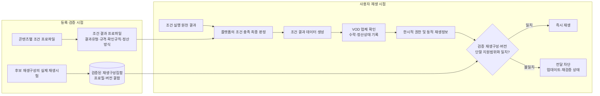

본 발명에서 정적 재생구성과 동적 재생정보는 구별된다. 정적 재생구성은 스트리밍 프로토콜, DRM 체계, 코덱 및 선택적인 보안 수준의 조합으로서 등록 검증의 대상이다. 동적 재생정보는 개별 재생 요청마다 달라질 수 있는 매니페스트 위치, 단기 URL, 접근 토큰 및 세션용 DRM 라이선스 요청정보이다. 실행 시 일치 여부를 판단하는 대상은 정적 재생구성과 그 버전이며, 동적 URL이나 토큰이 등록 시점의 값과 같아야 한다는 의미가 아니다.

본 발명의 주요 데이터는 다음과 같다.

| 데이터 | 역할 |
|---|---|
| 업체 재생 연동 프로필 | 업체가 지원하는 스트리밍, DRM, 코덱, 보안 수준 및 권한 요청 규격을 정의하는 업체 단위 정적 정보 |
| 콘텐츠 등록 정보 | 업체 콘텐츠 식별자, 추천용 메타데이터, 조건 프로파일, 결과 프로파일, 권한 서비스 및 재생 연동 프로필 참조를 연결하는 콘텐츠 단위 정보 |
| 시청 권한 획득 조건 프로파일 | 콘텐츠 재생 전에 확인할 광고 시청, 결제 또는 프로모션 등의 조건과 판정기준을 정의하는 정보 |
| 조건 결과 프로파일 | 조건 충족 시 생성할 결과 유형·데이터 규격·업체 확인 규칙·업체 처리행위·정산방식 및 버전을 정의하는 정보 |
| 조건 실행 원천 결과 | 사용자 단말, 광고 시스템, 결제 시스템 또는 프로모션 시스템이 플랫폼에 보고하는 실행 결과 |
| 조건 결과 데이터 | 플랫폼이 조건 충족을 최종 판정한 후 결과 프로파일에 따라 생성하여 업체에 제공하는 공통정보와 조건별 결과값 |
| 검증된 재생구성집합 | 콘텐츠 등록 검증에서 실제 재생시험을 통과한 정적 재생구성들을 콘텐츠, 프로필 및 버전에 연결한 플랫폼 생성 기록 |
| 업체 결과 처리상태 | 업체가 조건 결과 데이터를 확인한 뒤 기록하는 수락·거절 및 정산대기·정산없음 등의 상태 |
| 동적 재생정보 | 권한 발급 시 업체가 해당 실행 재생구성에 대응하여 반환하는 매니페스트 위치, 단기 URL·토큰 및 DRM 라이선스 요청정보 |

### 나. 종래기술 및 중점 선행기술 조사 결과

종래 시스템에는 다음의 하위기술이 각각 존재할 수 있다.

1. 사업규칙, 로그인 또는 결제 완료 후 외부 DRM 시스템이 데이터를 확인하고 재생권한을 발급하는 기술
2. 광고 시청, 사용자 결제 또는 스폰서 부담을 콘텐츠 접근이나 보상과 연결하는 기술
3. 콘텐츠와 업체의 메타데이터를 등록하고 외부 재생정보를 실행 시점에 취득하는 기술
4. 단말 지원범위에 맞는 DRM·스트리밍 구성을 선택하는 기술
5. 실제 재생시험 또는 DRM 검증 후 콘텐츠 제공상태를 전환하는 기술

따라서 광고·결제·프로모션이라는 조건의 존재, 외부 업체의 토큰 또는 라이선스 발급, 동적 재생정보의 실행 시점 취득, 단말 호환성 선택 또는 등록 시 시험재생을 각각 독립적인 차별점으로 보아서는 안 된다.

아래 상태는 2026-07-21 공개 데이터에 따른 예비정보이다. 만료·포기된 문헌도 선행기술이 될 수 있으나 현재 유효한 권리와는 구별되며, 출원 및 사업화 전에는 각 관할 등록원부와 패밀리·계속출원·존속기간을 다시 확인하여야 한다.

| 선행문헌 | 예비 상태 | 본 발명과 가까운 내용 | 본 발명에서 구체화한 차이 |
|---|---|---|---|
| [US7711647B2, *Digital rights management in a distributed network*](https://patents.google.com/patent/US7711647B2/en) | 미국 등록, Active 표시, 조정 만료 2028-05-19 | 등록·로그인·결제 등 사업규칙 완료 후 생성된 데이터를 외부 CDN의 DRM 시스템이 확인하고, 사전 등록된 권리·재생 프로필과 단말정보를 이용하여 라이선스를 발급한다. 조건 처리, 외부 확인·권리발급 및 사전 프로필 활용을 한 문헌에 가장 가깝게 보여 준다. | 조건별 결과 규격과 비용부담을 콘텐츠별 버전으로 결합하는 관계, 업체의 결과 수락·정산상태 기록과 권한발급의 연결, 콘텐츠별 실제 통과 재생구성집합 및 실행 응답 불일치 차단은 필수 연쇄로 확인되지 않는다. |
| [EP0913789B1, *Pre-paid links to network servers*](https://patents.google.com/patent/EP0913789B1/en) | Expired-Lifetime 표시 | 스폰서 결제근거를 포함한 데이터를 외부 콘텐츠 서버가 확인·저장하고 콘텐츠를 제공하며 스폰서에게 과금하는 구조이다. | 선불 스폰서 링크에 집중하며, 복수 조건의 공통 결과 구조, VOD 권한·DRM 및 검증 재생구성 일치 제어가 없다. |
| [US20190147471A1](https://patents.google.com/patent/US20190147471A1/en) / [US20090018909A1](https://patents.google.com/patent/US20090018909A1/en) | 미국 출원 Abandoned 표시, 전자의 국제출원은 Ceased 표시 | 광고 시청, 사용자 결제, 광고주 또는 중개자 부담을 콘텐츠 접근·보상과 연결한다. | 계정 크레딧, 가격감액 또는 중앙 정산이 중심이며, 외부 VOD 업체가 콘텐츠별 조건 결과 데이터를 확인·기록한 후 새 재생권한을 발급하고 검증 재생구성과 대조하는 흐름이 없다. |
| [US11805132B2, *Location specific temporary authentication system*](https://patents.google.com/patent/US11805132B2/en) | 미국 등록, Active 표시, 조정 만료 2041-03-10 | 거래·프로모션 등의 조건 충족 후 중개 시스템이 외부 콘텐츠 제공자에 자격정보를 보내고 제공자 승인 후 임시 접근을 부여한다. | 장소·기기·중개계정이 중심이고 조건 유형별 결과·정산 데이터가 아니다. 업체의 결과 수락기록과 검증 재생구성 대조도 없다. |
| [US12111891B2](https://patents.google.com/patent/US12111891B2/en) / [EP3491562B1](https://patents.google.com/patent/EP3491562B1/en), *DRM sharing and playback service specification selection* | 미국 Active 표시, 조정 만료 2038-02-26; 유럽 Active 표시, 예상 만료 2036-10-27 | 단말 지원 선택지와 콘텐츠 제한으로 재생방식을 정하고 저장된 토큰·선택방식과 후속 요청을 비교한다. | 조건 결과·정산·외부 VOD 권한발급 흐름이 없고, 콘텐츠별 실제 시험 통과 구성집합과 버전이 추천상태와 실행허용을 함께 지배하지 않는다. |
| [US9081939B2](https://patents.google.com/patent/US9081939B2/en) / [US9129092B1](https://patents.google.com/patent/US9129092B1/en) | 모두 Active 표시; 각각 조정 만료 2033-03-10, 예상 만료 2032-11-10 | 각각 권리·DRM 재생 QA 후 제공상태 전환 및 단말의 지원 DRM 구성 탐지·선택을 보여 준다. | 전자는 미디어 자산 인입형 구조이고 후자는 단말 구성 탐지에 그친다. 조건 결과, 업체 수락·정산·권한발급 및 검증집합 밖 실행 응답 차단과 결합되지 않는다. |

조사된 단일문헌에서는 다음 전체 연쇄가 그대로 확인되지 않았다.

> 콘텐츠별 조건 프로파일이 판정기준과 결과유형·데이터 규격·비용부담·업체 확인규칙을 함께 특정하고, 플랫폼이 원천 결과로 조건 충족을 최종 판정하여 해당 유형의 조건 결과 데이터를 업체에 보내며, 업체가 등록 규칙 및 고유 권한정책과 대조해 수락·정산상태를 기록한 뒤 한시적 재생권한을 발급하고, 그 실행 재생구성이 등록 시 실제 시험을 통과한 구성집합과 프로필 버전에 속하지 않으면 플랫폼이 동적 재생정보의 전달을 차단하는 연쇄

다만 US7711647B2는 조건 처리, 외부 확인·권리발급, 사전 프로필 및 단말정보 활용을 상당 부분 함께 보여 주므로 진보성 판단에서 가장 중요한 위험이다. 네 가지 조건의 단순 나열, 정산비율, 동적 URL·토큰의 지연 취득 또는 외부 업체가 권한을 발급한다는 사실만으로 차별성을 주장하지 않는다.

### 다. 종래기술의 문제점 및 본 발명의 목적

| 종래 또는 구현상 문제 | 본 발명의 목적 |
|---|---|
| 콘텐츠별 사전조건은 등록되어도 조건 충족 시 업체에 무엇을 제공하고 업체가 무엇을 처리하는지가 불명확하다. | 조건 프로파일에 결과 프로파일을 결합하여 조건과 결과유형·규격·비용부담·확인규칙·업체 처리행위를 콘텐츠별로 고정한다. |
| 단말과 플랫폼 중 누가 조건 충족을 최종 판단하는지 혼재하면 업체 권한발급 근거가 불명확해진다. | 단말과 외부 조건 시스템은 원천 결과를 보고하고, 플랫폼이 콘텐츠별 기준에 따라 사전조건 충족을 최종 판정한다. |
| 업체가 플랫폼 판정을 그대로 신뢰하거나 플랫폼이 업체의 고유 권한정책까지 대신 판단하는 것으로 읽힐 수 있다. | 업체가 수신 결과를 등록된 확인 규칙과 고유 권한정책에 대조하여 수락 여부를 결정하고, 수락 후 권한을 발급하도록 역할을 분리한다. |
| 광고, 사용자 결제, 플랫폼 부담 및 업체 부담 프로모션은 서로 경제적 결과가 다른데 같은 불투명 증빙값으로 처리하면 사후 정산 근거가 부족하다. | 조건 유형에 맞는 구조화된 결과 데이터를 생성하고 업체 수락·권한·재생 결과와 연결하여 정산 또는 정산 없음 상태를 기록한다. |
| 등록 때 실제 재생을 확인했더라도 실행 시 업체가 미등록 또는 변경된 구성을 반환하면 검증의 의미가 사라진다. | 등록 시 실제 통과 재생구성과 버전을 저장하고, 실행 응답이 검증집합 밖이면 재생정보를 전달하지 않으며 업데이트·재검증 상태로 전환한다. |
| 동적 URL이나 토큰의 정상적인 변경과 정적 재생구성 변경을 혼동할 수 있다. | 프로토콜·DRM·코덱·보안 수준의 정적 구성과 세션별 URL·토큰·DRM 요청정보를 구별하여 정적 구성과 버전만 일치 검증 대상으로 삼는다. |
| 실제 재생 URL과 장기 토큰을 추천 카탈로그에 저장하면 유출·만료·동기화 위험이 커진다. | 추천용 등록 정보와 동적 재생정보를 분리하고, 동적 재생정보는 권한발급 시점에 취득하여 짧은 수명의 실행영역에서만 사용한다. |

### 라. 본 발명의 해결수단 요약

1. VOD 업체가 업체 단위의 권한 서비스와 정적 재생 연동 프로필 및 그 버전을 등록한다.
2. 개별 콘텐츠에 업체 콘텐츠 식별자, 추천용 메타데이터, 하나 이상의 조건 프로파일과 각 조건에 결합된 결과 프로파일을 등록한다.
3. 플랫폼이 후보 재생구성별로 검증용 권한을 취득하여 실제 재생시험을 하고, 성공한 정적 재생구성과 프로필·콘텐츠 버전을 검증된 재생구성집합으로 저장한다.
4. 검증된 재생구성집합이 존재하고 다른 등록조건도 유효한 콘텐츠만 추천 가능 상태로 전환한다.
5. 사용자가 콘텐츠를 선택하면 단말 또는 외부 조건 시스템이 조건 실행의 원천 결과를 플랫폼에 제공한다.
6. 플랫폼이 콘텐츠별 조건 프로파일에 따라 조건 충족 여부를 최종 판정하고, 충족된 경우 해당 결과 프로파일에 따라 조건 결과 데이터를 생성한다.
7. 플랫폼이 업체 콘텐츠 식별자, 조건 결과 데이터, 적용 버전 및 실행할 검증 재생구성 또는 그 후보를 포함하는 권한 요청을 업체에 전송한다.
8. 업체가 조건 결과 데이터를 등록된 확인 규칙 및 고유 권한정책과 대조하고 수락·거절 및 정산처리 상태를 기록한다.
9. 업체가 수락한 요청에 한하여 검증된 재생구성에 대응하는 한시적 권한과 동적 재생정보를 발급한다.
10. 플랫폼이 응답의 프로필·버전 및 실행 재생구성을 검증된 재생구성집합과 단말 지원범위에 대조한다.
11. 일치하면 동적 재생정보를 단말 재생기에 전달하고, 불일치하면 전달을 차단하여 콘텐츠를 등록 업데이트 또는 재검증 필요 상태로 전환한다.
12. 조건 결과, 업체 수락·거절, 업체 권한 및 실제 재생 결과를 동일 거래 식별관계로 연결하여 정산대기·정산확정·정산취소·정산조정 또는 정산없음 상태를 관리한다.

## 2. 발명(고안)의 구체적 설명

### 가. 발명의 구성

#### 1) 전체 시스템 구조

본 발명의 시스템은 즉시 재생 플랫폼(100), 외부 VOD 업체 시스템(200), 사용자 단말(300), 추천 시스템(400) 및 선택적인 업체 연계 DRM 라이선스 시스템(500)을 포함한다.

##### 1-1. 등록·검증 및 추천 활성화 구조

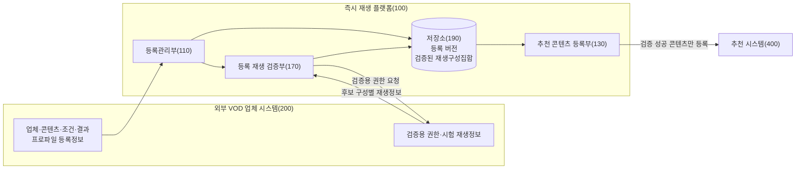

등록 흐름에서는 업체가 제공한 등록정보와 플랫폼이 실제 시험으로 생성한 검증 재생구성집합을 구분한다. 추천 시스템에는 검증을 통과한 콘텐츠만 등록한다.

##### 1-2. 조건 판정 및 업체 권한 발급 구조

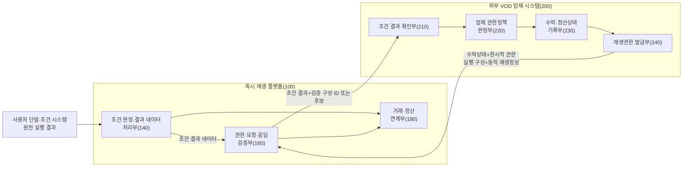

조건 처리 흐름에서는 플랫폼의 사전조건 판정과 업체의 결과 확인·고유 권한정책 판단을 분리한다. 업체는 결과를 수락하고 처리상태를 기록한 경우에만 재생권한을 발급한다.

##### 1-3. 실행 재생구성 검증 및 단말 재생 구조

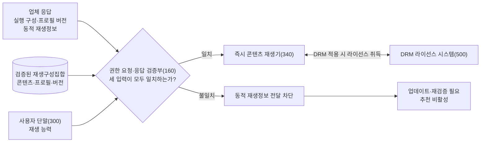

실행 흐름에서는 업체 응답의 정적 재생구성과 프로필 버전을 등록 시 실제 통과한 구성 및 단말 능력과 대조한다. 일치한 경우에만 동적 재생정보를 단말 재생기에 전달한다.

조건 실행·원천결과 보고부(330)는 광고 재생완료, 결제 승인 또는 프로모션 적용과 같은 원천 결과를 수집하여 플랫폼에 보고하지만 조건 충족의 최종 판정자는 아니다. 조건 판정·결과 데이터 처리부(140)가 콘텐츠별 조건 프로파일을 적용하여 최종 판정하고, 그 판정과 조건 결과 프로파일에 따라 업체 제공용 조건 결과 데이터를 생성한다.

외부 VOD 업체 시스템(200)은 플랫폼의 조건 판정을 처음부터 다시 수행하는 것이 아니라, 수신한 조건 결과 데이터가 업체가 해당 콘텐츠에 등록한 결과 규칙과 버전에 맞는지 확인하고 업체 고유 권한정책을 별도로 적용한다. 업체는 수락·거절 및 정산처리 상태를 기록한 뒤 수락된 경우에만 한시적 재생권한을 발급한다.

등록 재생 검증부(170)는 후보 프로필의 명칭만 저장하지 않고 실제 재생시험을 통과한 프로토콜·DRM·코덱·보안 수준 조합을 콘텐츠, 프로필 및 버전과 연결하여 저장한다. 실행 시 권한 요청·응답 검증부(160)는 업체가 반환한 실행 재생구성이 검증된 재생구성집합과 단말 지원범위에 포함되는지를 다시 확인한다.

#### 2) 구성부별 기능

1. **업체·콘텐츠 등록관리부(110)**
   업체 식별자, 권한 서비스, 정적 재생 연동 프로필 및 버전을 업체 단위로 등록한다. 개별 콘텐츠에는 업체 콘텐츠 식별자, 추천용 메타데이터, 조건 프로파일, 조건 결과 프로파일, 권한 서비스 참조 및 재생 프로필 참조를 연결한다. 프로필 또는 콘텐츠 변경이 기존 검증 결과에 영향을 주면 해당 콘텐츠를 업데이트 필요 상태로 전환한다.

2. **추천 콘텐츠 등록부(130)**
   유효한 검증 재생구성집합이 존재하고 제공기간·지역·조건 및 결과 프로파일이 유효한 콘텐츠만 추천 시스템에 등록한다. 검증 무효화, 등록 버전 변경 또는 실행 불일치가 발생하면 추천 노출을 중지한다.

3. **조건 판정·결과 데이터 처리부(140)**
   사용자 단말, 광고 시스템, 결제 시스템 또는 프로모션 시스템으로부터 원천 결과를 수신한다. 선택 콘텐츠의 조건 프로파일과 버전을 적용하여 조건 충족 여부를 플랫폼에서 최종 판정한다. 충족된 경우 연결된 결과 프로파일을 조회하여 업체 제공용 조건 결과 데이터를 생성하고, 미충족이면 권한 요청의 진행을 차단한다.

4. **권한 요청·응답 검증부(160)**
   업체 콘텐츠 식별자, 조건 결과 데이터, 적용 등록 버전, 단말 재생 능력 및 검증된 재생구성의 식별자를 포함하는 권한 요청을 생성한다. 업체 응답의 결과 수락상태, 권한, 프로필·버전, 실행 재생구성 및 동적 재생정보를 확인한다. 정적 구성과 버전이 검증집합 및 단말 지원범위에 맞을 때만 동적 재생정보를 단말로 전달한다.

5. **등록 재생 검증부(170)**
   업체 시스템에서 검증용 권한과 동적 재생정보를 취득하여 후보 재생구성별로 매니페스트 접근, DRM 라이선스 취득 및 미디어 재생 개시 중 하나 이상을 시험한다. 성공한 실제 구성과 프로필·콘텐츠 버전, 시험시각 및 유효기간을 검증된 재생구성집합으로 반환한다.

6. **거래·정산 연계부(180)**
   조건 결과 식별자, 업체 수락·거절 상태, 업체 권한 식별자 및 실제 재생 결과를 동일 권한 거래에 연결한다. 조건 유형에 따라 정산대기, 정산확정, 정산취소, 정산조정 또는 정산없음 상태를 관리한다.

7. **저장소(190)**
   업체 등록, 콘텐츠 등록, 조건·결과 프로파일, 검증된 재생구성집합, 권한 거래 및 상태변경 이력을 구분하여 저장한다. 추천 카탈로그에는 실제 VOD URL, 장기 접근 토큰, DRM 키 또는 특정 재생 요청의 DRM 라이선스 요청정보를 저장하지 않는다.

8. **조건 결과 확인부(210)**
   업체가 수신한 조건 결과 데이터의 대상 업체·콘텐츠, 조건·결과 프로파일과 버전, 결과 유형, 필수 결과값 및 플랫폼 판정값을 등록된 확인 규칙과 대조한다.

9. **업체 권한정책 판정부(220)**
   콘텐츠 제공지역, 제공기간, 동시시청 제한 및 계약 상태 등 업체 고유 정책을 적용하여 권한 요청의 수락 가능성을 판단한다. 이는 플랫폼의 광고 시청·결제·프로모션 조건 판정을 대체하지 않는다.

10. **수락·정산상태 기록부(230)**
    조건 결과의 수락 또는 거절과 사유를 권한 거래 식별자, 콘텐츠, 조건 프로파일 및 결과 식별자에 연결하여 기록한다. 정산 대상 조건이면 초기 정산상태를 기록하고, 업체 부담 무료 프로모션과 같이 별도 플랫폼 콘텐츠 비용 정산이 없는 조건이면 정산없음 상태를 기록한다.

11. **재생권한 발급부(240)**
    조건 결과와 업체 권한정책이 수락된 경우에만 한시적 재생권한을 발급한다. 권한 요청에 지정된 검증 구성 또는 요청에 포함된 검증 후보 중 단말과 호환되는 구성에 대응하는 동적 재생정보를 생성하여 플랫폼에 반환한다.

12. **조건 실행·원천결과 보고부(330)**
    광고 재생결과, 결제 승인결과 또는 사용자 행위결과를 수집하여 플랫폼에 보고한다. 프로모션 조건처럼 플랫폼 서버에서 직접 확인되는 결과는 이 구성부를 거치지 않을 수 있다.

13. **즉시 콘텐츠 재생기(340)**
    단말의 스트리밍·DRM·코덱·보안 수준 능력을 플랫폼에 제공하고, 플랫폼이 검증을 마친 동적 재생정보를 이용하여 콘텐츠를 재생한다. DRM이 적용되면 업체 연계 DRM 라이선스 시스템과 통신하여 라이선스를 취득하며, 콘텐츠 키는 단말의 보호된 DRM 처리영역에서 사용될 수 있다.

#### 3) 구성부별 입력·출력·판단책임

| 구성부 | 주요 입력 | 주요 출력 | 판단 또는 처리책임 |
|---|---|---|---|
| 등록관리부(110) | 업체·콘텐츠·조건·결과 프로파일 | 버전이 부여된 등록 레코드 | 참조 무결성, 스키마, 중복 및 변경 영향 확인 |
| 추천 등록부(130) | 검증집합, 제공상태 | 추천 등록·해제 요청 | 추천 가능 상태 유지 |
| 조건 판정·결과 처리부(140) | 원천 결과, 조건·결과 프로파일 | 플랫폼 판정, 조건 결과 데이터 | 사전조건 충족의 최종 판정과 결과 형식 선택 |
| 권한 요청·응답 검증부(160) | 결과 데이터, 단말 능력, 검증집합 | 업체 요청, 검증 결과, 단말 전달정보 | 응답의 정적 구성·버전 일치 여부 및 전달·차단 |
| 등록 재생 검증부(170) | 후보 재생구성, 검증용 권한 | 실제 통과 구성, 시험결과 | 콘텐츠별 검증 재생구성집합 생성 |
| 거래·정산 연계부(180) | 조건 결과, 업체 상태, 권한, 재생 결과 | 정산 또는 정산없음 상태 | 동일 권한 거래의 상태 연결 |
| 조건 결과 확인부(210) | 조건 결과 데이터, 등록 확인규칙 | 결과 수락·거절 판단자료 | 업체가 사전 합의한 결과 형식·내용 확인 |
| 업체 권한정책 판정부(220) | 콘텐츠·지역·기간·계약 상태 | 업체 권한정책 승인·거절 | 원 콘텐츠 권한정책 적용 |
| 상태 기록부(230) | 결과 확인·권한정책 결과 | 수락·거절, 정산상태 기록 | 업체 내부 처리상태 보존 |
| 권한 발급부(240) | 수락된 요청, 검증 구성 | 한시적 권한, 동적 재생정보 | 검증된 정적 구성에 대응하는 실행정보 발급 |
| 원천결과 보고부(330) | 광고·결제·사용자 행위의 실제 결과 | 원천 실행 결과 | 결과 수집과 보고만 수행 |
| 재생기(340) | 검증된 실행 구성, 동적 재생정보 | 재생 결과 | 콘텐츠와 선택적인 DRM 라이선스 처리 |

#### 4) 용어 정의

1. **업체 콘텐츠 식별자**: 외부 VOD 업체가 콘텐츠 또는 재생자산에 부여한 식별자로서, 플랫폼이 실제 재생 위치를 해석하지 않고 권한 요청에 사용하는 값이다.
2. **플랫폼 콘텐츠 식별자**: 추천 메타데이터, 업체 콘텐츠 식별자, 조건·결과 프로파일, 검증결과 및 권한 거래를 하나의 콘텐츠에 연결하는 플랫폼 식별자이다.
3. **시청 권한 획득 조건 프로파일**: 콘텐츠 재생 전에 확인할 조건 유형, 실행 파라미터, 판정기준, 적용기간, 대상 및 버전을 정의한 콘텐츠별 정보이다.
4. **조건 결과 프로파일**: 조건 충족 시 생성할 결과 유형과 데이터 규격, 업체 확인 규칙, 비용부담 또는 정산방식, 업체의 수락 후 처리행위 및 버전을 조건 프로파일에 연결한 정보이다.
5. **조건 실행 원천 결과**: 조건 실행 주체가 생성·보고하는 광고 재생기록, 결제 승인결과, 프로모션 적용결과 또는 사용자 행위결과이다.
6. **플랫폼 조건 판정**: 플랫폼이 원천 결과를 콘텐츠별 조건 프로파일의 판정기준에 적용하여 조건 충족 또는 미충족으로 최종 결정한 결과이다.
7. **조건 결과 데이터**: 플랫폼 조건 판정이 충족인 경우 결과 프로파일에 따라 생성되어 업체에 전달되는 데이터로서, 공통 식별정보·판정정보·결과유형·조건별 결과값·정산문맥을 포함할 수 있다.
8. **업체 확인 규칙**: 외부 VOD 업체가 조건 결과 데이터의 대상, 버전, 필수 필드, 결과유형 및 허용값을 확인하기 위해 콘텐츠별 결과 프로파일에 연결해 둔 규칙이다.
9. **업체 고유 권한정책**: 콘텐츠 제공지역·기간·계약상태·동시시청 등 원 콘텐츠의 권리범위를 업체가 판단하기 위한 정책이다.
10. **검증된 재생구성집합**: 등록 검증에서 실제 재생시험을 통과한 하나 이상의 정적 재생구성을 콘텐츠 식별자, 콘텐츠 등록 버전, 재생 프로필 식별자 및 버전과 연결한 집합이다.
11. **정적 재생구성**: 스트리밍 프로토콜, DRM 체계, 비디오·오디오 코덱 및 선택적인 보안 수준의 조합이다.
12. **실행 재생구성**: 개별 권한 요청에서 사용하도록 지정되거나 업체 응답에 포함된 정적 재생구성이다. 새 조합을 실행 시 임의로 만드는 것이 아니라 검증된 재생구성집합의 구성 중 하나여야 한다.
13. **동적 재생정보**: 특정 권한 거래 또는 재생 세션에 사용되는 매니페스트 위치, 단기 콘텐츠 URL, 접근 토큰, 권한 식별자, 만료정보 또는 DRM 라이선스 요청정보이다.
14. **한시적 재생권한**: 업체가 특정 콘텐츠, 권한 거래, 단말, 재생구간 또는 유효시간 중 하나 이상에 한정하여 발급하는 권한이다.
15. **권한 거래 식별자**: 플랫폼 판정, 조건 결과 데이터, 업체 수락·거절, 업체 권한, 동적 재생정보 및 실제 재생결과를 연결하는 식별자이다.
16. **업데이트 필요 상태**: 콘텐츠·업체·프로필 버전의 불일치로 등록정보 갱신이 필요한 상태이다.
17. **재검증 필요 상태**: 검증집합 밖 실행 구성의 수신, 프로필 변경 또는 반복 재생실패로 실제 재생시험을 다시 수행해야 하는 상태이다.

#### 5) 실행 재생구성의 지정 방식

콘텐츠별 검증된 재생구성집합에 하나의 구성만 존재하면 별도의 선택단계 없이 그 구성을 권한 요청에 지정한다. 복수 구성이 존재하면 다음 중 실제 구현에 맞는 방식을 사용할 수 있다.

- **플랫폼 지정 실시예**: 플랫폼이 검증된 재생구성집합과 단말 재생 능력의 공통범위에서 실행 구성을 정하고 그 구성 식별자를 권한 요청에 포함한다. 업체는 지정된 구성이 현재 제공 가능한지 확인하여 해당 구성의 동적 재생정보를 반환한다.
- **업체 선택 실시예**: 플랫폼이 단말과 호환되는 검증 구성 식별자들만 후보로 전송하고, 업체가 그 후보 중 하나를 선택하여 반환한다.

어느 실시예에서도 업체가 검증집합 밖의 새 스트리밍·DRM·코덱 조합을 정상 응답으로 반환할 수 없다. 플랫폼은 반환된 구성과 프로필 버전을 독립적으로 대조하고, 불일치하면 동적 재생정보를 재생기에 전달하지 않는다.

#### 6) 업체 등록 데이터

업체 등록은 업체 단위의 권한 서비스와 정적 재생 연동 프로필을 정의한다. 이 데이터는 특정 사용자 재생의 URL이나 토큰을 포함하지 않는다.

```json
{
  "providerRegistration": {
    "schemaVersion": "instantplay.provider-registration/2.0",
    "providerId": "com.example.vod",
    "providerStatus": "active",
    "grantServices": [
      {
        "grantServiceId": "example-vod-grant-service",
        "grantEndpoint": "https://api.example-vod.com/instantplay/grants",
        "authenticationProfileId": "platform-provider-auth-01",
        "requestSchemaVersion": "instantplay.grant-request/2.0",
        "responseSchemaVersion": "instantplay.grant-response/2.0"
      }
    ],
    "playbackProfiles": [
      {
        "playbackProfileId": "example-vod-profile-01",
        "profileVersion": 4,
        "allowedStreamingMethods": ["dash", "hls"],
        "allowedDrmSystems": ["playready"],
        "allowedVideoCodecs": ["h264", "hevc"],
        "allowedAudioCodecs": ["aac"],
        "allowedSecurityLevels": ["hardware-secure", "software-secure"]
      }
    ],
    "providerRegistrationVersion": 4,
    "updatedAt": "2026-07-01T00:00:00Z"
  }
}
```

| 필드 | 설명 |
|---|---|
| `grantServices` | 조건 결과 데이터와 권한 요청을 수신하여 권한 응답을 반환하는 업체 연동 서비스 |
| `playbackProfiles` | 업체가 등록할 수 있는 정적 재생구성의 범위 |
| `profileVersion` | 검증 결과와 실행 응답을 연결하는 재생 프로필 버전 |
| `providerRegistrationVersion` | 업체 등록 전체의 변경 버전 |

#### 7) 콘텐츠별 조건·결과 등록 데이터

콘텐츠 등록에서 각 조건 프로파일은 하나의 조건 결과 프로파일과 직접 연결된다. 조건 프로파일은 “무엇을 만족해야 하는가”를, 결과 프로파일은 “만족 시 업체에 어떤 결과를 어떤 규칙으로 제공하고 업체가 어떤 상태를 기록한 후 무엇을 하는가”를 정의한다.

```json
{
  "contentRegistration": {
    "schemaVersion": "instantplay.content-registration/2.0",
    "providerId": "com.example.vod",
    "providerContentId": "movie-12345",
    "platformContentId": "platform-title-7788",
    "recommendationMetadata": {
      "title": "예시 영화",
      "synopsis": "추천 화면에 표시되는 줄거리",
      "genres": ["drama"],
      "contentRating": "15",
      "posterImageUrl": "https://metadata.example.com/posters/7788.jpg",
      "runningTimeSec": 7200
    },
    "availability": {
      "regions": ["KR"],
      "validFrom": "2026-07-01T00:00:00Z",
      "validUntil": "2026-12-31T14:59:59Z"
    },
    "grantBinding": {
      "grantServiceId": "example-vod-grant-service",
      "playbackResourceId": "asset-5f91a2"
    },
    "playbackProfileRefs": [
      {
        "playbackProfileId": "example-vod-profile-01",
        "profileVersion": 4
      }
    ],
    "instantPlayPolicy": {
      "enabled": true,
      "providerLoginRequired": false,
      "defaultConditionProfileId": "condition-ad-view-01"
    },
    "entitlementConditionProfiles": [
      {
        "conditionProfileId": "condition-ad-view-01",
        "conditionProfileVersion": 3,
        "conditionType": "AD_VIEW",
        "conditionParameters": {
          "adPolicyId": "required-ad-policy-v3",
          "minimumCompletedRatio": 0.95
        },
        "decisionRuleRef": "platform-ad-completion-rule-v3",
        "grantScope": {
          "scope": "full-title",
          "maximumGrantTtlSec": 180
        },
        "conditionResultProfile": {
          "resultType": "AD_SETTLEMENT_BASIS",
          "resultSchemaVersion": "ad-result/2.0",
          "requiredResultFields": [
            "adId",
            "campaignId",
            "completedAt",
            "settlementRuleRef",
            "providerShareAmount",
            "platformShareAmount",
            "currency"
          ],
          "providerValidationRuleRef": "provider-ad-result-rule-v2",
          "providerActionOnAcceptance": "RECORD_SETTLEMENT_BASIS_AND_GRANT",
          "settlementMode": "REVENUE_SHARE",
          "settlementRuleRef": "ad-revshare-provider-platform-v3",
          "resultProfileVersion": 2
        }
      },
      {
        "conditionProfileId": "condition-provider-free-promo-01",
        "conditionProfileVersion": 2,
        "conditionType": "PROVIDER_FREE_PROMO",
        "conditionParameters": {
          "providerCampaignId": "provider-free-week-01",
          "eligibleContentPolicyRef": "provider-free-catalog-v2"
        },
        "decisionRuleRef": "provider-campaign-eligibility-rule-v2",
        "grantScope": {
          "scope": "full-title",
          "maximumGrantTtlSec": 180
        },
        "conditionResultProfile": {
          "resultType": "PROVIDER_FREE_ELIGIBILITY",
          "resultSchemaVersion": "provider-free-result/2.0",
          "requiredResultFields": [
            "providerCampaignId",
            "eligibleContentId",
            "eligibilityConfirmedAt",
            "noPlatformContentPayment"
          ],
          "providerValidationRuleRef": "provider-free-result-rule-v2",
          "providerActionOnAcceptance": "RECORD_NO_SETTLEMENT_AND_GRANT",
          "settlementMode": "NO_PLATFORM_CONTENT_PAYMENT",
          "settlementRuleRef": "no-platform-content-payment-v1",
          "resultProfileVersion": 2
        }
      },
      {
        "conditionProfileId": "condition-platform-promo-01",
        "conditionProfileVersion": 4,
        "conditionType": "PLATFORM_SPONSORED_PROMO",
        "conditionParameters": {
          "platformCampaignId": "instantplay-launch-promo",
          "budgetPolicyRef": "platform-budget-2026q3"
        },
        "decisionRuleRef": "platform-promo-eligibility-rule-v4",
        "grantScope": {
          "scope": "full-title",
          "maximumGrantTtlSec": 180
        },
        "conditionResultProfile": {
          "resultType": "PLATFORM_PAYABLE_BASIS",
          "resultSchemaVersion": "platform-promo-result/2.0",
          "requiredResultFields": [
            "platformCampaignId",
            "budgetReservationId",
            "providerPayableAmount",
            "currency",
            "settlementRuleRef"
          ],
          "providerValidationRuleRef": "provider-platform-promo-rule-v2",
          "providerActionOnAcceptance": "RECORD_PLATFORM_PAYABLE_AND_GRANT",
          "settlementMode": "PLATFORM_PAYABLE",
          "settlementRuleRef": "platform-pays-provider-v4",
          "resultProfileVersion": 2
        }
      },
      {
        "conditionProfileId": "condition-user-payment-01",
        "conditionProfileVersion": 5,
        "conditionType": "USER_PAYMENT",
        "conditionParameters": {
          "priceAmount": 700,
          "currency": "KRW",
          "paymentPolicyRef": "content-access-price-v5"
        },
        "decisionRuleRef": "platform-payment-approval-rule-v5",
        "grantScope": {
          "scope": "full-title",
          "maximumGrantTtlSec": 180
        },
        "conditionResultProfile": {
          "resultType": "USER_PAYMENT_SETTLEMENT_BASIS",
          "resultSchemaVersion": "user-payment-result/2.0",
          "requiredResultFields": [
            "paymentAuthorizationId",
            "approvedAmount",
            "currency",
            "approvedAt",
            "settlementRuleRef"
          ],
          "providerValidationRuleRef": "provider-payment-result-rule-v2",
          "providerActionOnAcceptance": "RECORD_PAYMENT_SETTLEMENT_AND_GRANT",
          "settlementMode": "USER_PAYMENT_SETTLEMENT",
          "settlementRuleRef": "user-payment-provider-platform-v5",
          "resultProfileVersion": 2
        }
      }
    ],
    "contentRegistrationVersion": 12
  }
}
```

조건 결과 프로파일의 핵심 필드는 다음과 같다.

| 필드 | 역할 |
|---|---|
| `resultType` | 조건 충족이 만들어내는 결과의 의미 |
| `resultSchemaVersion` | 업체가 해석할 조건 결과 데이터 형식 |
| `requiredResultFields` | 해당 결과 유형에서 업체에 제공할 필수 결과값 |
| `providerValidationRuleRef` | 업체가 등록한 결과 확인 규칙 |
| `providerActionOnAcceptance` | 결과 수락 후 상태 기록 및 권한발급 동작 |
| `settlementMode` | 수익배분, 플랫폼 지급의무, 사용자 결제정산 또는 플랫폼 콘텐츠 비용 정산 없음 |
| `settlementRuleRef` | 금액 산정 또는 정산정책의 버전 참조 |
| `resultProfileVersion` | 실행 요청과 업체 확인을 연결하는 결과 프로파일 버전 |

`requiredResultFields`에 기재한 금액·비율은 실시예이다. 독립적인 기술적 핵심은 금액 그 자체가 아니라, 콘텐츠별로 선택된 조건과 결과 규격에 따라 플랫폼이 서로 다른 구조의 결과 데이터를 만들고 업체가 등록 규칙과 결부하여 수락·정산상태·권한발급을 처리하는 관계이다.

#### 8) 플랫폼 생성 검증 재생구성 데이터

콘텐츠 등록 요청에 포함된 프로필 참조는 후보 범위일 뿐이다. 플랫폼은 실제 재생시험 후 별도의 검증 결과를 생성한다.

```json
{
  "playbackVerificationResult": {
    "verificationId": "verification-01J7...",
    "providerId": "com.example.vod",
    "providerRegistrationVersion": 4,
    "platformContentId": "platform-title-7788",
    "providerContentId": "movie-12345",
    "contentRegistrationVersion": 12,
    "playbackProfileId": "example-vod-profile-01",
    "profileVersion": 4,
    "verifiedPlaybackConfigurations": [
      {
        "verifiedConfigurationId": "verified-config-dash-pr-h265-v4",
        "streamingMethod": "dash",
        "drmSystemId": "playready",
        "videoCodec": "hevc",
        "audioCodec": "aac",
        "securityLevel": "hardware-secure",
        "testResult": "passed"
      },
      {
        "verifiedConfigurationId": "verified-config-hls-pr-h264-v4",
        "streamingMethod": "hls",
        "drmSystemId": "playready",
        "videoCodec": "h264",
        "audioCodec": "aac",
        "securityLevel": "software-secure",
        "testResult": "passed"
      }
    ],
    "testedAt": "2026-07-19T00:00:00Z",
    "validUntil": "2026-08-19T00:00:00Z",
    "verificationStatus": "passed",
    "recommendationStatus": "enabled"
  }
}
```

검증 결과는 업체가 선언한 지원목록만 복사한 것이 아니라 실제 시험을 통과한 구성의 기록이다. `providerRegistrationVersion`, `contentRegistrationVersion`, `profileVersion` 중 적용되는 값이 바뀌면 기존 집합을 그대로 실행 허용의 근거로 사용하지 않고 영향도를 확인하여 재검증한다.

#### 9) 조건 실행 원천 결과와 플랫폼 판정

다음은 광고 조건의 원천 결과와 플랫폼 내부 판정 레코드의 예이다.

```json
{
  "conditionSourceResult": {
    "sourceResultId": "source-result-ad-01J7...",
    "sourceType": "DEVICE_AD_PLAYER",
    "platformContentId": "platform-title-7788",
    "conditionProfileId": "condition-ad-view-01",
    "conditionProfileVersion": 3,
    "adId": "ad-9087",
    "campaignId": "campaign-3301",
    "startedAt": "2026-07-19T01:00:00Z",
    "completedAt": "2026-07-19T01:00:30Z",
    "playedRatio": 1.0
  },
  "platformConditionDecision": {
    "conditionDecisionId": "condition-decision-01J7...",
    "sourceResultId": "source-result-ad-01J7...",
    "platformContentId": "platform-title-7788",
    "conditionProfileId": "condition-ad-view-01",
    "conditionProfileVersion": 3,
    "decisionRuleRef": "platform-ad-completion-rule-v3",
    "decision": "satisfied",
    "decidedAt": "2026-07-19T01:00:31Z"
  }
}
```

단말이 `playedRatio`를 보고했다는 사실만으로 업체 권한 요청이 생성되는 것은 아니다. 플랫폼이 등록된 조건 프로파일의 대상, 버전, 완료비율 및 캠페인 상태를 적용하여 `satisfied`로 판정하여야 한다.

#### 10) 업체 제공용 조건 결과 데이터

플랫폼은 판정이 충족인 경우 조건 결과 프로파일에 맞는 결과 데이터를 생성한다. 광고 실시예는 다음과 같다.

```json
{
  "conditionResultData": {
    "conditionResultId": "condition-result-ad-01J7...",
    "grantTransactionId": "grant-tx-01J7...",
    "providerId": "com.example.vod",
    "providerContentId": "movie-12345",
    "platformContentId": "platform-title-7788",
    "playbackSessionId": "playback-session-01J7...",
    "conditionProfileId": "condition-ad-view-01",
    "conditionProfileVersion": 3,
    "resultType": "AD_SETTLEMENT_BASIS",
    "resultSchemaVersion": "ad-result/2.0",
    "resultProfileVersion": 2,
    "platformDecision": "satisfied",
    "completedAt": "2026-07-19T01:00:30Z",
    "conditionSpecificResult": {
      "adId": "ad-9087",
      "campaignId": "campaign-3301",
      "settlementRuleRef": "ad-revshare-provider-platform-v3",
      "grossSettlementAmount": 100,
      "providerShareAmount": 70,
      "platformShareAmount": 30,
      "currency": "KRW"
    },
    "settlementContext": {
      "settlementMode": "REVENUE_SHARE",
      "settlementBasisId": "ad-settlement-basis-01J7..."
    },
    "generatedAt": "2026-07-19T01:00:32Z"
  }
}
```

조건 유형별 `conditionSpecificResult`는 다음과 같이 달라질 수 있다.

| 조건 유형 | 플랫폼 판정의 입력 | 업체 제공 결과의 예 | 업체가 수락 시 기록할 상태 |
|---|---|---|---|
| 광고 시청 | 광고 식별자, 캠페인, 완료시각, 재생완료율 | 광고·캠페인 식별정보, 완료시각, 정산규칙, 업체·플랫폼 배분 기준 또는 계산결과 | 광고 정산대기 후 권한발급 |
| 업체 부담 무료 프로모션 | 업체 캠페인, 대상 콘텐츠, 적용기간 | 업체 캠페인, 대상 콘텐츠 적격성, 플랫폼의 콘텐츠 비용부담 없음 표시 | 정산없음 또는 별도 노출정책 상태 후 권한발급 |
| 플랫폼 부담 프로모션 | 플랫폼 캠페인, 예산정책, 대상 콘텐츠 | 예산 예약 식별자, 업체 지급예정 금액 또는 계산규칙, 통화, 정산규칙 | 플랫폼 지급대기 후 권한발급 |
| 사용자 결제 | 결제 승인 식별자, 승인금액, 통화, 승인시각 | 승인정보, 금액·통화, 수수료 또는 배분규칙 | 사용자 결제 정산대기 후 권한발급 |

정산이 없는 조건도 결과가 없는 것이 아니다. 업체 부담 무료 프로모션에서는 해당 콘텐츠가 업체 캠페인 대상이고 플랫폼이 별도 콘텐츠 대가를 부담하지 않는다는 결과를 업체가 확인하여 `NO_SETTLEMENT` 상태를 기록한 뒤 권한을 발급할 수 있다.

#### 11) 권한 요청 및 업체 응답 데이터

플랫폼 지정 실시예의 권한 요청과 업체 응답은 다음과 같다.

```json
{
  "grantRequest": {
    "requestType": "instantplay.grant-request/2.0",
    "grantTransactionId": "grant-tx-01J7...",
    "providerId": "com.example.vod",
    "providerContentId": "movie-12345",
    "playbackResourceId": "asset-5f91a2",
    "platformContentId": "platform-title-7788",
    "playbackSessionId": "playback-session-01J7...",
    "conditionResultData": {
      "conditionResultId": "condition-result-ad-01J7...",
      "conditionProfileId": "condition-ad-view-01",
      "conditionProfileVersion": 3,
      "resultType": "AD_SETTLEMENT_BASIS",
      "resultProfileVersion": 2,
      "platformDecision": "satisfied",
      "conditionSpecificResult": {
        "adId": "ad-9087",
        "campaignId": "campaign-3301",
        "settlementRuleRef": "ad-revshare-provider-platform-v3",
        "providerShareAmount": 70,
        "platformShareAmount": 30,
        "currency": "KRW"
      }
    },
    "requestedAccess": {
      "scope": "full-title",
      "maximumTtlSec": 180
    },
    "requestedVerifiedPlaybackConfigurationId": "verified-config-dash-pr-h265-v4",
    "deviceCapabilities": {
      "streamingMethods": ["dash"],
      "drmSystems": ["playready"],
      "videoCodecs": ["hevc"],
      "audioCodecs": ["aac"],
      "securityLevels": ["hardware-secure"]
    },
    "providerRegistrationVersion": 4,
    "contentRegistrationVersion": 12,
    "playbackProfileId": "example-vod-profile-01",
    "profileVersion": 4
  },
  "grantResponse": {
    "responseType": "instantplay.grant-response/2.0",
    "grantTransactionId": "grant-tx-01J7...",
    "providerId": "com.example.vod",
    "providerContentId": "movie-12345",
    "acceptedConditionResultId": "condition-result-ad-01J7...",
    "conditionResultDisposition": {
      "status": "accepted",
      "validationRuleRef": "provider-ad-result-rule-v2"
    },
    "providerSettlementRecord": {
      "settlementMode": "REVENUE_SHARE",
      "status": "pending",
      "providerSettlementRecordId": "provider-settlement-01J7..."
    },
    "grant": {
      "grantId": "provider-grant-01J7...",
      "scope": "full-title",
      "issuedAt": "2026-07-19T01:00:35Z",
      "expiresAt": "2026-07-19T01:03:35Z"
    },
    "executionPlaybackConfiguration": {
      "verifiedConfigurationId": "verified-config-dash-pr-h265-v4",
      "playbackProfileId": "example-vod-profile-01",
      "profileVersion": 4,
      "streamingMethod": "dash",
      "drmSystemId": "playready",
      "videoCodec": "hevc",
      "audioCodec": "aac",
      "securityLevel": "hardware-secure"
    },
    "dynamicPlaybackInformation": {
      "manifestUrl": "https://stream.example.com/playback-session-01J7/manifest.mpd",
      "playbackAccessToken": "SHORT_LIVED_PROVIDER_TOKEN",
      "drmLicenseRequestInformation": {
        "drmSystemId": "playready",
        "licenseEndpoint": "https://license.example.com/playready",
        "licenseRequestToken": "SHORT_LIVED_LICENSE_REQUEST_TOKEN"
      }
    }
  }
}
```

업체 선택 실시예에서는 `requestedVerifiedPlaybackConfigurationId` 대신 단말과 호환되는 `candidateVerifiedPlaybackConfigurationIds`를 전송할 수 있다. 업체 응답은 그 후보 중 하나의 식별자를 반환하여야 하고, 플랫폼은 반환값을 다시 확인한다.

권한 요청의 최소 정보는 다음과 같다.

- 권한 거래, 업체, 업체 콘텐츠, 플랫폼 콘텐츠 및 재생 세션 식별자
- 조건 결과 데이터와 조건·결과 프로파일 버전
- 요청 권한 범위
- 검증된 재생구성 식별자 또는 단말 호환 후보 식별자
- 단말 재생 능력
- 업체·콘텐츠·재생 프로필 버전

업체 응답의 최소 정보는 다음과 같다.

- 원 권한 거래와 수락한 조건 결과 식별자
- 조건 결과 수락 또는 거절 상태
- 정산처리 상태 또는 정산없음 상태
- 업체가 발급한 한시적 재생권한
- 검증 재생구성 식별자, 프로필 식별자 및 버전
- 해당 구성에 대응하는 동적 재생정보

플랫폼은 다음의 경우 동적 재생정보를 단말에 전달하지 않는다.

1. 업체·콘텐츠·권한 거래·재생 세션 또는 조건 결과 식별자가 원 요청과 일치하지 않는 경우
2. 업체가 조건 결과를 거절했거나 업체 고유 권한정책에 따라 권한을 발급하지 않은 경우
3. 조건·결과 프로파일 버전 또는 업체·콘텐츠 등록 버전이 적용 요청과 일치하지 않는 경우
4. 정산이 필요한 결과인데 업체 정산처리 상태가 누락되거나 결과 프로파일의 정산방식과 다른 경우
5. 실행 재생구성 식별자 또는 세부 구성이 검증된 재생구성집합에 포함되지 않는 경우
6. 실행 재생구성이 단말 재생 능력의 범위에 포함되지 않는 경우
7. 응답의 프로필 식별자 또는 버전이 검증 결과와 일치하지 않는 경우
8. 한시적 권한 또는 동적 재생정보가 만료되었거나 요청 권한 범위를 초과하는 경우

제5호 또는 제7호가 발생하면 이를 업체 과실이라는 법적·주관적 표현으로 판단하지 않는다. 플랫폼은 관측 가능한 상태인 `UNVERIFIED_PLAYBACK_CONFIGURATION` 또는 `REGISTRATION_VERSION_MISMATCH`로 기록하고, 동적 재생정보를 폐기하며 콘텐츠를 `UPDATE_REQUIRED` 또는 `REVERIFICATION_REQUIRED` 상태로 전환한다.

### 나. 발명의 동작 설명

#### 1) 업체·콘텐츠 등록 및 재생검증 흐름

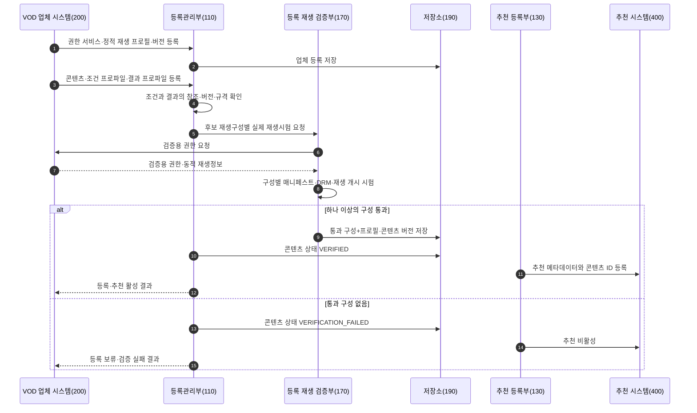

등록관리부는 콘텐츠 등록 시 다음을 확인한다.

| 검증 대상 | 활성화 기준 | 실패·무효화 기준 |
|---|---|---|
| 업체 등록 | 권한 서비스 연결, 요청·응답 규격, 하나 이상의 정적 재생 프로필 및 버전 존재 | 권한 서비스 불통, 규격 또는 프로필 누락 |
| 콘텐츠 등록 | 업체·콘텐츠 식별자, 추천 메타데이터, 조건·결과 프로파일 및 참조 버전 존재 | 참조 대상 없음, 제공기간 종료, 조건과 결과의 연결 누락 |
| 조건·결과 프로파일 | 조건 판정규칙, 결과유형·규격·업체 확인규칙·업체 처리행위·정산방식 존재 | 결과 규격이나 확인 규칙 없음, 조건과 결과 버전 불일치 |
| 실제 재생시험 | 후보 구성으로 권한 취득 후 매니페스트 접근 또는 재생 개시 성공 | 실행 구성 불명확, DRM 또는 재생 실패 |
| 추천 활성 | 하나 이상의 검증 구성 존재, 관련 버전과 검증기간 유효 | 프로필·콘텐츠·결과 프로파일 변경, 검증기간 만료, 실행 불일치 |

업체 등록 이후 정적 재생 프로필 또는 콘텐츠 등록 정보가 변경되었더라도 변경 영향이 없는 필드까지 항상 검증을 무효화할 필요는 없다. 다만 프로토콜, DRM, 코덱, 보안 수준, 권한 서비스, 콘텐츠 자산 또는 조건 결과 규격처럼 재생·권한 판단에 영향을 주는 값이 변경되면 기존 검증집합을 무효화하고 재검증 전까지 추천을 비활성화한다.

#### 2) 사용자 선택부터 권한발급·재생까지의 흐름

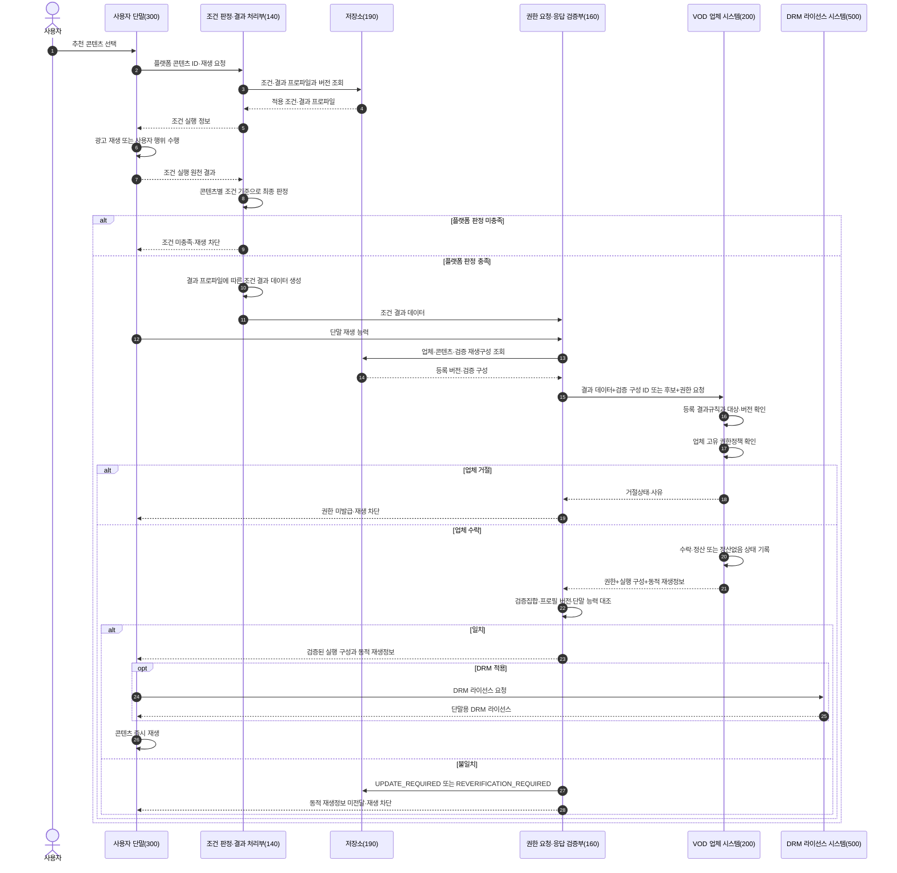

플랫폼이 조건을 충족으로 판정했다는 사실만으로 원 콘텐츠 권한이 생기는 것은 아니다. 조건 결과 데이터가 업체의 확인 규칙을 통과하고 업체 고유 권한정책도 충족되어 업체가 권한을 발급해야 재생 단계로 진행된다.

#### 3) 조건 유형별 판정·결과·업체 처리 실시예

| 조건 유형 | 원천 결과 | 플랫폼의 최종 판정 | 업체에 제공하는 조건 결과 | 업체 확인 및 상태 기록 | 권한 처리 |
|---|---|---|---|---|---|
| 광고 시청 | 광고·캠페인 ID, 재생시간, 완료시각 | 해당 콘텐츠의 광고정책·완료기준·캠페인 유효성 충족 여부 | 광고·캠페인 ID, 완료시각, 적용 정산규칙, 배분 기준 또는 계산결과 | 등록 광고규칙·결과 규격 확인 후 광고 정산대기 기록 | 수락 시 권한발급 |
| 업체 부담 무료 프로모션 | 업체 캠페인, 대상 콘텐츠·기간 | 콘텐츠가 업체 무료 캠페인 대상인지 확인 | 캠페인 ID, 대상 콘텐츠, 적용시각, 플랫폼 콘텐츠 비용부담 없음 | 업체 캠페인·권한정책 확인 후 정산없음 기록 | 수락 시 권한발급 |
| 플랫폼 부담 프로모션 | 플랫폼 캠페인, 예산 예약·대상 콘텐츠 | 캠페인·예산·콘텐츠 적격성 충족 여부 | 예산 예약 ID, 업체 지급예정 근거, 금액 또는 계산규칙, 통화 | 등록 프로모션 규칙 확인 후 플랫폼 지급대기 기록 | 수락 시 권한발급 |
| 사용자 결제 | 결제 승인 ID, 금액·통화·승인시각 | 등록 가격·통화·결제상태와 승인결과 일치 여부 | 결제 승인정보, 승인금액·통화, 적용 정산규칙 | 승인정보와 콘텐츠 가격정책 확인 후 결제 정산대기 기록 | 수락 시 권한발급 |

광고 수익배분율, 콘텐츠 가격 또는 프로모션 비용은 계약에 따라 달라질 수 있다. 본 발명의 주된 기술관계는 결과값의 구체 숫자가 아니라, 조건 유형에 맞는 결과 규격을 콘텐츠별로 등록하고 플랫폼 생성 결과, 업체 확인·상태 기록 및 권한발급을 같은 권한 거래로 연결하는 것이다.

#### 4) 권한 거래 실행 레코드

권한 거래 실행 레코드는 특정한 전송 객체로 고정되지 않으며, 다음 상태와 참조관계를 저장하거나 추적하기 위한 논리적 레코드이다.

- 권한 거래 식별자와 재생 세션 식별자
- 플랫폼·업체 콘텐츠 식별자
- 적용된 업체·콘텐츠·조건·결과·재생 프로필의 버전
- 조건 실행 원천 결과 참조와 플랫폼 판정
- 업체에 제공한 조건 결과 데이터 식별자
- 업체의 결과 수락·거절 및 정산처리 상태
- 검증 재생구성 식별자와 실행 재생구성
- 업체 권한 식별자와 유효시간
- 동적 재생정보의 보관 위치 또는 전달상태
- 실제 재생 개시·완료·실패 결과

동적 재생정보는 추천 카탈로그와 분리된 실행영역에 유지할 수 있다. 운영 로그에는 URL·토큰 원문 대신 권한 거래 식별자, 만료시각, 검증 결과 및 오류코드 등 필요한 최소정보만 기록할 수 있다.

#### 5) 업체 확인·권한·정산 상태의 연결

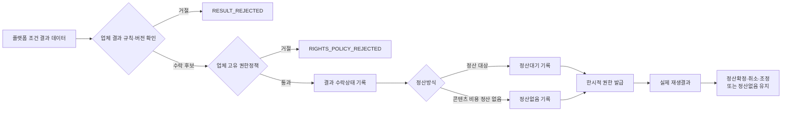

정산상태는 다음과 같이 처리될 수 있다.

| 상태 | 의미 |
|---|---|
| `PENDING` | 업체가 결과를 수락하고 권한을 발급했으나 정산 확정요건이 아직 완료되지 않음 |
| `CONFIRMED` | 정산 정책에서 요구하는 권한발급 또는 유효 재생결과가 확인됨 |
| `CANCELLED` | 결제 취소, 캠페인 무효 또는 권한발급·재생 실패로 정산이 취소됨 |
| `ADJUSTED` | 재생결과 또는 계약규칙에 따라 정산기준이 조정됨 |
| `NO_SETTLEMENT` | 업체 부담 무료 프로모션 등에서 플랫폼의 콘텐츠 대가 정산이 발생하지 않음 |

#### 6) 정상 실시예

1. **광고 시청 후 재생**
   사용자가 콘텐츠를 선택하면 플랫폼은 해당 콘텐츠의 광고 조건을 조회한다. 단말이 광고 실행결과를 보고하면 플랫폼이 완료기준을 적용해 충족을 판정한다. 플랫폼은 광고·캠페인·완료시각 및 정산규칙에 따른 결과 데이터를 업체에 보낸다. 업체가 결과 규칙과 콘텐츠 권한정책을 확인하고 광고 정산대기를 기록한 후 권한을 발급한다. 플랫폼은 반환 구성이 검증집합과 일치할 때 동적 재생정보를 단말에 전달한다.

2. **업체 부담 무료 프로모션**
   플랫폼은 업체가 등록한 캠페인과 콘텐츠 적격성을 확인한다. 조건 결과 데이터에는 캠페인·콘텐츠 및 플랫폼 콘텐츠 비용부담 없음이 포함된다. 업체는 캠페인과 권한정책을 확인하고 `NO_SETTLEMENT`를 기록한 뒤 권한을 발급한다.

3. **플랫폼 부담 프로모션**
   플랫폼은 캠페인 대상과 예산 예약을 확인하고, 업체에 대한 후정산 근거를 포함한 결과 데이터를 생성한다. 업체가 결과를 수락하여 플랫폼 지급대기를 기록하고 권한을 발급한다. 실제 재생결과는 후속 정산 확정 또는 취소에 사용될 수 있다.

4. **사용자 결제 후 재생**
   플랫폼은 결제 승인결과를 등록 가격·통화와 대조하고, 승인정보와 정산규칙을 조건 결과 데이터에 포함한다. 업체가 이를 확인해 결제 정산대기를 기록하고 권한을 발급한다.

#### 7) 실패 및 상태전이

| 오류 또는 불일치 | 플랫폼 또는 업체 처리 | 콘텐츠·거래 상태 |
|---|---|---|
| 원천 결과가 조건기준 미충족 | 플랫폼이 결과 데이터를 생성하지 않고 권한 요청 차단 | `PLATFORM_CONDITION_REJECTED` |
| 결과 데이터가 등록 규칙·버전과 불일치 | 업체가 거절상태와 사유 반환 | `PROVIDER_RESULT_REJECTED` |
| 업체 고유 권한정책 불충족 | 업체가 권한 미발급 | `RIGHTS_POLICY_REJECTED` |
| 정산 필수값 또는 정산방식 불일치 | 업체가 결과 거절 또는 보류 | `SETTLEMENT_DATA_INVALID` |
| 실행 구성이 검증집합 밖 | 플랫폼이 동적 재생정보 미전달·응답 폐기 | `UNVERIFIED_PLAYBACK_CONFIGURATION` |
| 응답의 프로필·콘텐츠 버전 불일치 | 플랫폼이 동적 재생정보 미전달 | `REGISTRATION_VERSION_MISMATCH` |
| 등록정보 갱신 필요 | 추천 비활성, 업체에 갱신 요청 | `UPDATE_REQUIRED` |
| 실제 재생 재시험 필요 | 추천 비활성, 재검증 대기 | `REVERIFICATION_REQUIRED` |
| 동적 URL·토큰 만료 | 만료 정보로 재생하지 않고 유효 정책에 따라 새 권한 요청 | 권한 거래 재요청 또는 종료 |
| DRM 라이선스 취득 실패 | 재생 차단, 오류 기록, 필요 시 재검증 | 재생 실패 또는 `REVERIFICATION_REQUIRED` |

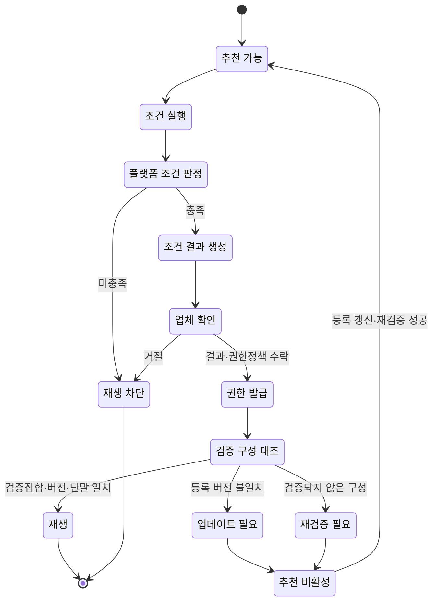

#### 8) 통신·보안 및 개인정보 실시예

플랫폼과 업체는 상호 인증된 통신채널, 요청·응답 서명 또는 그 밖의 통상적인 무결성 검증수단을 사용할 수 있다. 이러한 보안수단은 조건 결과 데이터의 주체와 변경 여부를 확인하기 위한 실시예이며, 특정 암호 알고리즘이 본 발명의 핵심은 아니다.

플랫폼은 업체 계정 대신 플랫폼의 재생 세션 또는 권한 거래 식별자를 사용할 수 있다. 업체가 법령 또는 계약상 필요한 최소 정보를 요구하는 경우에도 조건 결과와 권한 판단에 필요한 범위로 제한할 수 있다.

실제 콘텐츠 URL, 접근 토큰 및 DRM 라이선스 요청정보는 권한 유효시간 동안만 실행영역에 유지할 수 있다. DRM 콘텐츠 키는 플랫폼 카탈로그에 저장하지 않고 단말의 기존 DRM 모듈 또는 콘텐츠 복호화 모듈의 보호영역에서 처리할 수 있다.

### 다. 발명의 효과

1. 콘텐츠별 사전조건과 그 조건이 만들어내는 결과를 하나의 버전 관계로 연결하여 업체 권한발급의 근거를 명확히 할 수 있다.
2. 단말은 원천 결과를 보고하고 플랫폼이 조건 충족을 최종 판정하므로 조건 판단 주체의 혼선을 줄일 수 있다.
3. 업체는 결과 데이터의 등록 규칙과 고유 권한정책을 각각 확인하여 원 콘텐츠 권한을 유지하면서 플랫폼 조건결과를 사용할 수 있다.
4. 광고, 사용자 결제, 플랫폼 부담 및 업체 부담 프로모션을 서로 다른 결과·정산상태로 처리하면서 공통 권한 요청 구조를 사용할 수 있다.
5. 조건 결과, 업체 수락, 권한 및 실제 재생을 하나의 권한 거래로 연결하여 사후 정산이나 정산 없음의 근거를 추적할 수 있다.
6. 등록 시 실제 통과한 구성만 실행에 허용하여 업체의 등록정보 갱신 누락, 설정 전파 지연 또는 잘못된 응답으로 인한 비호환 재생을 차단할 수 있다.
7. 정적 재생구성과 동적 재생정보를 구분함으로써 정상적으로 바뀌는 세션 URL·토큰을 허용하면서 프로토콜·DRM·코덱 변경은 통제할 수 있다.
8. 실행 응답 불일치 시 재생정보 전달 차단, 추천 비활성 및 재검증을 연계하여 검증 수명주기를 자동화할 수 있다.
9. 실제 VOD URL, 장기 접근 토큰 및 DRM 키를 추천 카탈로그와 분리하여 보안과 동기화 위험을 줄일 수 있다.
10. 업체 앱 설치나 업체 계정 로그인 없이 플랫폼의 사용자 경험 안에서 외부 VOD 콘텐츠의 권한획득과 재생을 중계할 수 있다.

<!-- page-break:page-5 -->

## 3. 권리청구의 범위

이하 청구항은 직무발명서 단계의 권리화 초안이다. 출원 시에는 발명의 기준일을 확정하고, 정식 선행기술 조사 및 실제 구현 주체를 확인한 뒤 관할국 실무에 맞게 문언과 인용관계를 조정한다.

### 청구항 1

외부 VOD 콘텐츠의 재생을 중계하는 플랫폼 서버가 수행하는 방법에 있어서,

외부 VOD 콘텐츠별로 외부 VOD 업체의 콘텐츠 식별자, 상기 콘텐츠의 재생 전 조건을 정의하는 조건 프로파일, 상기 조건의 충족에 따라 생성할 결과의 유형과 데이터 규격 및 상기 외부 VOD 업체에서 적용할 확인 규칙을 정의하는 조건 결과 프로파일, 및 정적 재생 프로필의 식별자와 버전에 대응하여 실제 재생시험을 통과한 하나 이상의 재생구성을 포함하는 검증된 재생구성집합을 저장하는 단계;

사용자 단말에서 상기 외부 VOD 콘텐츠가 선택된 후 조건 실행 주체로부터 상기 조건의 실행에 관한 원천 결과를 수신하고, 상기 사용자 단말로부터 단말 재생 능력 정보를 수신하는 단계;

상기 조건 프로파일을 상기 원천 결과에 적용하여 상기 조건의 충족 여부를 상기 플랫폼 서버에서 판정하는 단계;

상기 조건이 충족된 것으로 판정된 경우, 상기 조건 결과 프로파일에 따라 조건 결과 데이터를 생성하는 단계;

상기 조건 결과 데이터와, 상기 검증된 재생구성집합에 포함된 재생구성의 식별자 또는 상기 단말 재생 능력 정보와 호환되는 복수 재생구성의 식별자를 포함하는 재생권한 요청을 상기 외부 VOD 업체 시스템으로 전송하는 단계;

상기 외부 VOD 업체 시스템으로부터, 상기 조건 결과 데이터에 대한 업체의 수락상태, 한시적 재생권한, 실행 재생구성, 상기 실행 재생구성에 적용된 정적 재생 프로필의 식별자와 버전 및 동적 재생정보를 포함하는 응답을 수신하는 단계;

상기 응답의 상기 실행 재생구성과 상기 정적 재생 프로필의 식별자 및 버전을, 상기 검증된 재생구성집합 및 상기 단말 재생 능력 정보와 대조하는 단계; 및

상기 업체의 수락상태가 수락을 나타내고 상기 실행 재생구성이 상기 검증된 재생구성집합에 포함되며 상기 사용자 단말에서 실행 가능한 경우에만 상기 동적 재생정보를 상기 사용자 단말에 전달하고, 그렇지 않은 경우 상기 동적 재생정보의 전달을 차단하는 단계

를 포함하는 외부 VOD 콘텐츠 재생 중계 방법.

### 청구항 2

청구항 1에 있어서,

상기 조건 결과 프로파일은 결과 유형, 결과 데이터 형식, 상기 외부 VOD 업체 시스템에서 적용할 확인 규칙, 결과 수락 후의 업체 처리행위, 정산방식 및 결과 프로파일 버전 중 둘 이상을 정의하고,

상기 조건 결과 데이터는 대상 콘텐츠 또는 업체 콘텐츠 식별자, 재생 세션 또는 권한 거래 식별자, 조건 프로파일의 식별자와 버전, 플랫폼 서버의 판정결과, 결과 유형 및 조건 유형별 결과값을 포함하는 방법.

### 청구항 3

청구항 1에 있어서,

상기 조건 실행 주체는 상기 사용자 단말, 광고 시스템, 결제 시스템 또는 프로모션 시스템 중 하나 이상이고,

상기 조건 실행 주체는 상기 원천 결과를 생성 또는 보고하며, 상기 조건의 충족 여부에 대한 최종 판정은 상기 플랫폼 서버에서 수행되는 방법.

### 청구항 4

청구항 1에 있어서,

상기 조건은 광고 시청, 사용자 결제, 플랫폼 부담 프로모션 및 외부 VOD 업체 부담 무료 프로모션 중 하나 이상이고,

상기 조건 결과 데이터는

광고 시청 조건에 대해서는 광고 또는 캠페인 식별정보, 완료시각 및 적용 정산규칙에 따른 배분 기준 또는 계산결과를,

사용자 결제 조건에 대해서는 결제 승인정보, 승인금액, 통화 및 적용 정산규칙을,

플랫폼 부담 프로모션에 대해서는 플랫폼 캠페인, 예산 예약정보 및 상기 외부 VOD 업체에 대한 지급 근거를, 또는

외부 VOD 업체 부담 무료 프로모션에 대해서는 업체 캠페인, 대상 콘텐츠 적격성 및 플랫폼의 콘텐츠 대가 정산이 없음을 나타내는 정보를

포함하는 방법.

### 청구항 5

청구항 1에 있어서,

상기 검증된 재생구성집합이 하나의 재생구성만 포함하는 경우 상기 실행 재생구성이 상기 하나의 재생구성과 일치하는지를 확인하고,

상기 검증된 재생구성집합이 복수의 재생구성을 포함하는 경우 상기 실행 재생구성이 상기 복수의 재생구성과 상기 단말 재생 능력 정보의 공통범위에 포함되는지를 확인하는 방법.

### 청구항 6

청구항 1에 있어서,

상기 대조 결과가 등록 버전 불일치 또는 검증되지 않은 실행 재생구성을 나타내는 경우,

상기 동적 재생정보의 전달을 차단하고, 상기 외부 VOD 콘텐츠를 추천 또는 재생 가능한 상태에서 제외하며, 상기 정적 재생 프로필의 갱신 또는 상기 외부 VOD 콘텐츠의 실제 재생 재검증이 필요한 상태로 전이하는 방법.

### 청구항 7

청구항 1에 있어서,

상기 동적 재생정보는 재생 세션별 콘텐츠 URL, 매니페스트 위치, 접근 토큰, 재생권한 식별자, 만료정보 및 DRM 라이선스 요청정보 중 하나 이상을 포함하고,

상기 플랫폼 서버는 상기 동적 재생정보를 상기 재생 세션에 연계하여 전달 또는 한시적으로 유지하되, 상기 외부 VOD 콘텐츠의 DRM 복호화 키를 추천 카탈로그에 저장하지 않는 방법.

### 청구항 8

외부 VOD 업체 시스템이 수행하는 콘텐츠 재생권한 제공 방법에 있어서,

플랫폼 서버로부터 업체 콘텐츠 식별자, 조건 결과 데이터, 하나 이상의 검증된 재생구성에 관한 정보 및 사용자 단말의 재생 능력 정보를 포함하는 재생권한 요청을 수신하는 단계;

상기 조건 결과 데이터의 대상 콘텐츠, 결과 유형 및 조건·결과 프로파일의 버전을 등록된 조건 결과 확인 규칙과 대조하고, 상기 외부 VOD 업체의 콘텐츠 권한정책을 적용하여 상기 재생권한 요청의 수락 여부를 결정하는 단계;

상기 수락 여부와, 정산이 요구되는 조건인 경우 정산처리 상태 또는 정산이 요구되지 않는 조건인 경우 정산없음 상태를, 상기 재생권한 요청 및 상기 조건 결과 데이터에 연계하여 기록하는 단계;

상기 재생권한 요청이 수락된 경우, 상기 하나 이상의 검증된 재생구성 중 상기 사용자 단말에서 실행 가능한 실행 재생구성에 대응하는 한시적 재생권한 및 동적 재생정보를 생성하는 단계; 및

상기 실행 재생구성, 상기 실행 재생구성에 적용된 정적 재생 프로필의 식별자와 버전, 상기 한시적 재생권한, 상기 동적 재생정보 및 상기 수락 여부를 포함하는 응답을 상기 플랫폼 서버로 전송하는 단계

를 포함하는 콘텐츠 재생권한 제공 방법.

### 청구항 9

청구항 8에 있어서,

상기 콘텐츠 권한정책은 서비스 지역, 이용 가능 기간, 동시 재생 제한 또는 콘텐츠 제공 계약 상태 중 하나 이상을 포함하고,

상기 외부 VOD 업체 시스템은 상기 플랫폼 서버가 수행한 조건 충족 판정을 다시 수행하는 대신, 상기 조건 결과 데이터의 대상 콘텐츠, 결과 유형, 조건·결과 프로파일 버전 및 필수 조건별 결과값 중 하나 이상을 상기 등록된 조건 결과 확인 규칙과 대조하는 방법.

### 청구항 10

청구항 8에 있어서,

상기 외부 VOD 업체 시스템은 재생권한 요청 식별자, 업체 콘텐츠 식별자, 재생 세션 식별자, 조건 프로파일 식별자 및 조건 결과 식별자에 연계하여 상기 조건 결과의 수락 또는 거절 상태를 기록하고,

정산이 요구되는 조건인 경우 업체 정산기록을 생성하여 정산대기, 정산확정, 정산취소 또는 정산조정 상태로 변경하며, 정산이 요구되지 않는 조건인 경우 정산없음 상태를 기록하는 방법.

### 청구항 11

플랫폼 서버가 외부 VOD 콘텐츠를 등록하고 검증하는 방법에 있어서,

외부 VOD 콘텐츠에 대한 업체 콘텐츠 식별자와, 스트리밍 프로토콜, DRM 방식, 코덱 및 보안 수준 중 하나 이상을 포함하는 정적 재생 프로필 및 그 버전을 등록하는 단계;

외부 VOD 업체 시스템으로부터 검증용 재생권한을 발급받아 하나 이상의 후보 재생구성에 대해 실제 재생시험을 수행하는 단계;

상기 실제 재생시험에 성공한 후보 재생구성을 상기 외부 VOD 콘텐츠 및 상기 정적 재생 프로필의 식별자와 버전에 연계하여 검증된 재생구성집합으로 저장하는 단계;

상기 검증된 재생구성집합이 존재하는 외부 VOD 콘텐츠에 대해서만 재생 또는 추천 가능 상태를 부여하는 단계; 및

상기 정적 재생 프로필의 변경 또는 실행 시점의 재생구성 불일치가 확인된 경우 기존 검증 상태를 무효화하고 등록 업데이트 또는 재검증이 필요한 상태로 전이하는 단계

를 포함하는 외부 VOD 콘텐츠 등록·검증 방법.

### 청구항 12

청구항 11에 있어서,

상기 실제 재생시험은 동적 재생정보의 획득, 매니페스트 또는 미디어 구간의 접근, DRM 라이선스 획득 및 미디어 재생 개시 중 하나 이상을 포함하고,

상기 검증된 재생구성집합의 각 기록은 콘텐츠 식별자, 정적 재생 프로필 식별자와 버전, 스트리밍 프로토콜, DRM 방식, 코덱, 보안 수준, 시험결과 및 시험시각 중 하나 이상을 포함하는 방법.

### 청구항 13

청구항 11에 있어서,

상기 정적 재생 프로필의 버전 변경, 기존 검증된 재생구성집합에 포함되지 않은 실행 재생구성의 수신 또는 실제 재생 실패 중 하나 이상이 발생한 경우 상기 재생 또는 추천 가능 상태를 해제하고,

갱신된 정적 재생 프로필 또는 콘텐츠 등록 버전에 대하여 검증용 재생권한을 다시 발급받아 실제 재생시험을 수행하는 방법.

### 청구항 14

외부 VOD 콘텐츠의 재생을 중계하는 플랫폼 시스템에 있어서,

콘텐츠별 조건 프로파일, 조건 결과 프로파일, 업체 콘텐츠 식별자 및 정적 재생 프로필의 버전에 대응하는 검증된 재생구성집합을 저장하는 저장부;

조건 실행 주체로부터 수신된 원천 결과에 상기 조건 프로파일을 적용하여 조건 충족 여부를 최종 판정하는 조건 판정부;

상기 판정에 따라 상기 조건 결과 프로파일에 대응하는 조건 결과 데이터를 생성하고 외부 VOD 업체 시스템으로 재생권한 요청을 전송하는 결과 데이터 처리부;

상기 외부 VOD 업체 시스템의 응답에 포함된 조건 결과 수락상태, 실행 재생구성 및 정적 재생 프로필의 버전을, 상기 검증된 재생구성집합 및 사용자 단말의 재생 능력 정보와 대조하는 재생구성 검증부; 및

상기 조건 결과 수락상태가 수락을 나타내고 상기 대조 결과가 일치하는 경우에만 동적 재생정보를 상기 사용자 단말에 전달하며, 그렇지 않은 경우 상기 동적 재생정보의 전달을 차단하는 재생 중계부

를 포함하는 플랫폼 시스템.

### 청구항 15

청구항 14에 있어서,

검증용 재생권한을 이용하여 후보 재생구성의 실제 재생시험을 수행하고, 성공한 재생구성을 콘텐츠 및 정적 재생 프로필의 버전에 연계하여 저장하며, 상기 정적 재생 프로필의 변경 또는 실행 재생구성 불일치 시 기존 검증 상태를 무효화하는 등록 재생 검증부를 더 포함하는 플랫폼 시스템.

### 청구항 16

플랫폼 서버로부터 조건 결과 데이터 및 검증된 재생구성에 관한 정보를 포함하는 재생권한 요청을 수신하는 수신부;

상기 조건 결과 데이터를 등록된 조건 결과 확인 규칙, 대상 콘텐츠 및 조건·결과 프로파일의 버전과 대조하고 외부 VOD 업체 고유의 콘텐츠 권한정책을 적용하는 권한 판정부;

상기 조건 결과의 수락 또는 거절 상태와, 정산이 요구되는 경우 정산처리 상태 또는 정산이 요구되지 않는 경우 정산없음 상태를 요청 식별자, 콘텐츠 식별자 및 재생 세션 식별자에 연계하여 기록하는 상태 기록부; 및

수락된 요청에 대해 상기 검증된 재생구성에 대응하는 한시적 재생권한과 동적 재생정보를 생성하여 상기 플랫폼 서버로 전송하는 재생권한 발급부

를 포함하는 외부 VOD 콘텐츠 제공 시스템.

### 청구항 17

외부 VOD 콘텐츠를 재생하는 사용자 단말에 있어서,

플랫폼 서버로부터 콘텐츠 정보를 수신하고 콘텐츠 선택 입력을 받는 사용자 인터페이스;

상기 선택된 콘텐츠에 대응하는 조건을 실행하고 상기 조건 실행의 원천 결과를 상기 플랫폼 서버로 전송하는 조건 실행부;

상기 사용자 단말의 스트리밍 프로토콜, DRM 방식, 코덱 또는 보안 수준에 관한 재생 능력 정보를 상기 플랫폼 서버로 전송하는 능력 보고부; 및

상기 플랫폼 서버에서 조건 충족이 판정되고 실행 재생구성과 검증된 재생구성집합의 일치가 확인된 후 전달된 동적 재생정보를 이용하여 상기 외부 VOD 콘텐츠를 재생하는 플레이어

를 포함하고,

상기 조건 실행부는 상기 원천 결과를 보고하되 상기 조건 충족 여부의 최종 판정은 상기 플랫폼 서버에서 수행되는 사용자 단말.

### 청구항 18

청구항 17에 있어서,

상기 플레이어는 상기 동적 재생정보에 포함된 DRM 라이선스 요청정보를 이용하여 상기 외부 VOD 업체 시스템 또는 DRM 라이선스 서버로부터 DRM 라이선스를 취득하고, 상기 DRM 라이선스를 이용하여 상기 외부 VOD 콘텐츠의 재생을 개시하는 사용자 단말.

### 청구항 19

프로세서에 의해 실행될 때 청구항 1 내지 청구항 7 중 어느 한 항의 플랫폼 서버 방법 또는 청구항 11 내지 청구항 13 중 어느 한 항의 등록·검증 방법을 수행하도록 하는 명령어가 저장된 비일시적 컴퓨터 판독 가능한 기록매체.

### 추가 종속항 또는 분할출원 후보

1. 업체가 조건 결과 데이터의 일부를 참조값으로 수신하고, 사전에 합의된 조회 인터페이스에서 전체 결과를 확인하는 구성
2. 복수 검증 구성 중 플랫폼이 실행 구성을 지정하는 구성과 업체가 후보 중 선택하는 구성을 각각 별도 종속항으로 한정하는 구성
3. 결과 프로파일 변경 시 조건 판정규칙은 유지하되 업체 확인규칙과 정산상태 처리만 갱신하는 구성
4. 콘텐츠 재생 중 추가 조건이 요구되면 다음 구간의 조건 결과·권한 거래를 별도로 생성하는 구성
5. 업체 결과 거절사유와 플랫폼 판정 기록을 대조하여 등록 결과 프로파일의 갱신을 요청하는 구성
6. 실제 재생결과가 정산 확정요건인 조건과 권한발급만으로 정산이 확정되는 조건을 구분하는 구성
7. 동적 재생정보를 사용자 단말에 직접 전달하지 않고 단기 프록시 참조값으로 전달하는 구성

<!-- page-break:page-6 -->

## 4. 도면

### 가. 종래기술 도면

#### 도 1. 업체 앱 중심의 VOD 재생

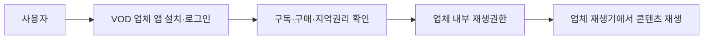

도 1은 사용자 진입, 권한 판단 및 재생이 하나의 VOD 업체 앱과 계정 안에서 수행되는 구조를 나타낸다.

#### 도 2. 조건과 콘텐츠 접근의 일반적 연결

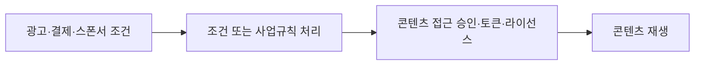

도 2는 조건 처리 후 콘텐츠 접근이 허용되는 넓은 개념이 이미 알려질 수 있음을 나타낸다. 본 발명은 이 개념 자체가 아니라 조건별 결과 규격, 업체 수락·정산상태·권한발급 및 등록 검증 재생구성의 실행 일치 제어를 결합한다.

### 나. 본 발명 도면

#### 도 3. 전체 시스템과 역할 경계

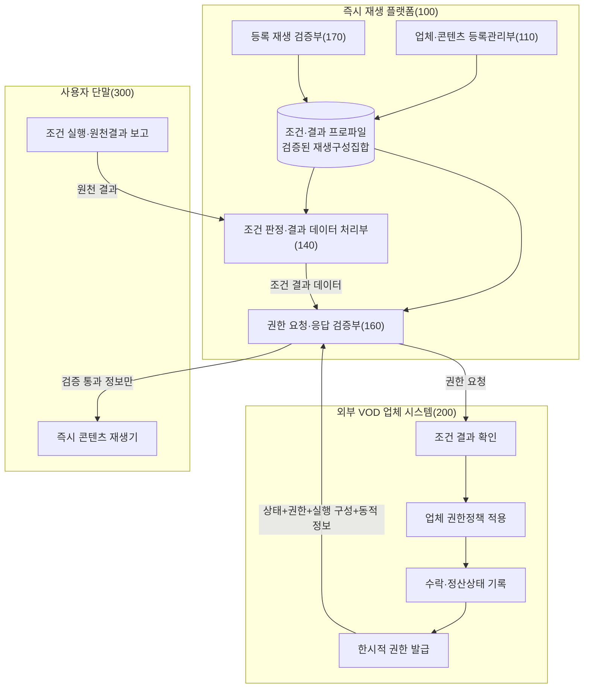

도 3은 플랫폼이 조건 충족을 최종 판정하고, 업체가 결과 규칙과 고유 권한정책을 확인하여 상태 기록 후 권한을 발급하며, 플랫폼이 실행 재생구성을 다시 확인하는 역할분담을 나타낸다.

#### 도 4. 등록정보·검증정보·동적 재생정보의 분리

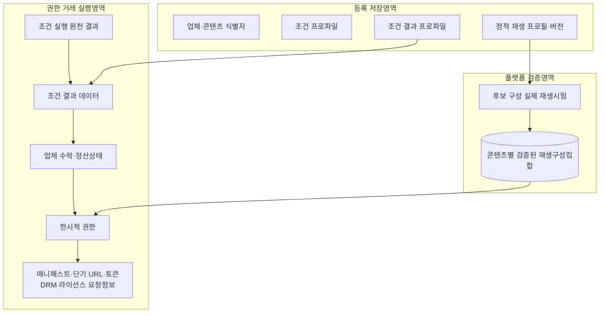

도 4에서 등록 저장영역은 정적 데이터와 버전을 저장하고, 검증영역은 실제 시험 통과 구성을 저장하며, 실행영역은 권한 거래별로 달라지는 동적 재생정보를 처리한다.

#### 도 5. 조건 결과 확인 후 업체 권한 취득

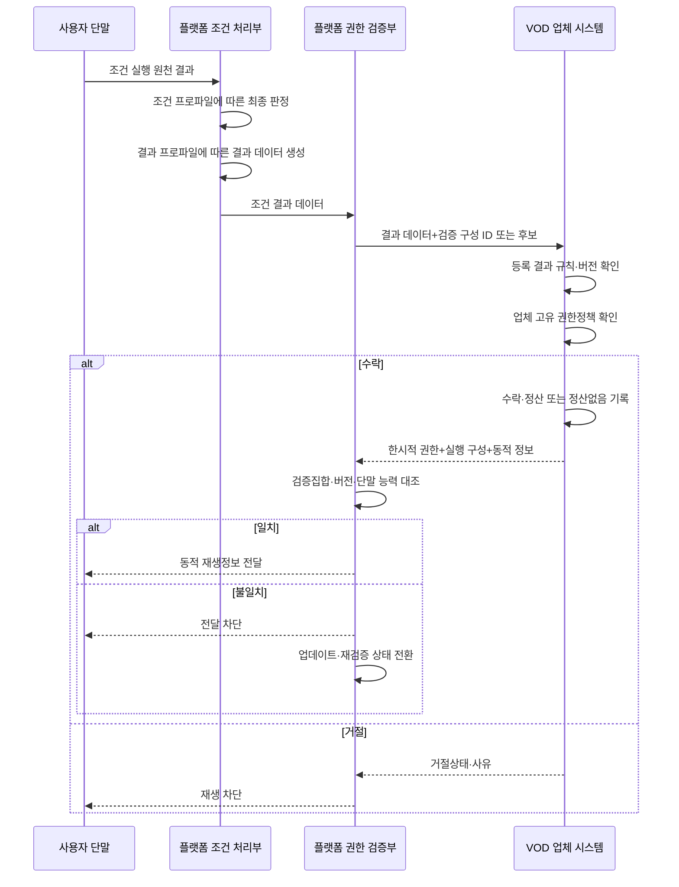

도 5는 조건 결과 생성부터 업체의 결과 확인·상태 기록·권한발급, 플랫폼의 검증 구성 일치 확인까지의 순차관계를 나타낸다.

#### 도 6. 등록 검증과 실행 불일치의 수명주기

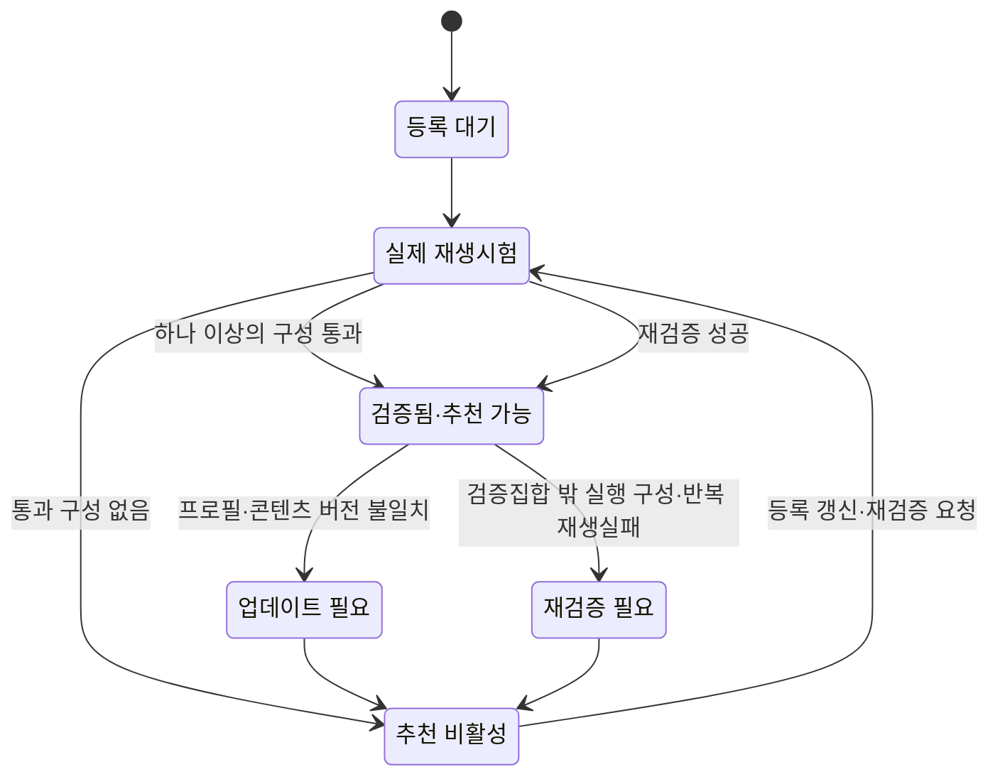

도 6은 등록 때 실제 통과한 구성을 기준으로 추천 가능 상태를 부여하고, 실행 시 불일치가 발생하면 추천을 중지한 후 갱신·재검증하는 수명주기를 나타낸다.

<!-- page-break:page-7 -->

## 5. 부록: 요약서 및 출원 전략

### 5.1 요약서

본 발명은 외부 VOD 업체가 제공하는 콘텐츠를 플랫폼의 사용자 단말에서 즉시 재생하도록 중계하는 시스템 및 방법에 관한 것이다. 플랫폼은 콘텐츠별로 재생 전 조건을 정의하는 조건 프로파일과, 조건 충족 시 생성할 결과 유형·데이터 규격·업체 확인 규칙·업체 처리행위·정산방식 및 버전을 정의하는 조건 결과 프로파일을 연결하여 저장한다.

사용자가 콘텐츠를 선택하면 사용자 단말, 광고 시스템, 결제 시스템 또는 프로모션 시스템이 조건 실행의 원천 결과를 플랫폼에 제공한다. 플랫폼은 콘텐츠별 조건 프로파일을 적용하여 조건 충족 여부를 최종 판정하고, 조건이 충족된 경우 조건 결과 프로파일에 따라 외부 VOD 업체 제공용 조건 결과 데이터를 생성한다. 광고 시청의 결과 데이터는 광고·캠페인 식별정보, 완료시각 및 적용 정산규칙을 포함할 수 있고, 업체 부담 무료 프로모션은 업체 캠페인·콘텐츠 적격성 및 플랫폼 콘텐츠 비용 정산 없음 정보를, 플랫폼 부담 프로모션은 업체에 대한 후정산 근거를, 사용자 결제는 결제 승인·금액·통화 및 정산규칙을 포함할 수 있다.

플랫폼은 조건 결과 데이터와 검증된 재생구성에 관한 정보를 외부 VOD 업체에 전송한다. 업체는 결과 데이터가 등록된 결과 확인 규칙과 대상 콘텐츠 및 버전에 맞는지 확인하고, 콘텐츠 제공지역·기간·계약 상태 등 업체 고유 권한정책을 적용한다. 업체는 수락 또는 거절과 정산처리 또는 정산없음 상태를 기록하고, 수락된 요청에 대해서만 한시적 재생권한과 동적 재생정보를 발급한다.

플랫폼은 콘텐츠 등록 단계에서 후보 재생구성에 대한 실제 재생시험을 수행하고, 성공한 프로토콜·DRM·코덱·보안 수준의 조합을 콘텐츠와 정적 재생 프로필 버전에 연결한 검증된 재생구성집합으로 저장한다. 실행 시 업체 응답의 실행 재생구성과 프로필 버전이 검증집합 및 단말 지원범위에 속하는 경우에만 매니페스트, 단기 URL·토큰 및 DRM 라이선스 요청정보 등의 동적 재생정보를 단말에 전달한다. 불일치하면 동적 재생정보를 전달하지 않고 콘텐츠를 업데이트 또는 재검증 필요 상태로 전환한다.

### 5.2 권리화 중심축

가장 중요한 플랫폼 독립항의 결합은 다음과 같다.

> `콘텐츠별 조건 프로파일과 조건 결과 프로파일의 버전 결합` + `조건 실행 원천 결과 수신` + `플랫폼의 조건 충족 최종 판정` + `결과 프로파일에 따른 구조화된 조건 결과 데이터 생성·전송` + `업체의 결과 수락상태·한시적 권한·실행 구성·동적 정보가 포함된 응답 수신` + `실행 구성과 프로필 버전을 등록 시 실제 통과한 재생구성집합 및 단말 능력과 대조` + `일치 시 전달, 불일치 시 차단·상태 변경`

권리화 축은 실시 주체별로 나눈다.

1. **플랫폼 방법·시스템**: 플랫폼이 직접 통제하는 조건 판정, 결과 데이터 생성·전송, 업체 응답 수신, 검증 구성 대조 및 전달·차단
2. **업체 방법·시스템**: 결과 데이터와 등록 확인 규칙·고유 권한정책의 대조, 수락·거절 및 정산상태 기록, 검증 구성에 대응하는 권한·동적 정보 발급
3. **등록·검증 수명주기**: 실제 재생시험, 콘텐츠별 통과 구성 저장, 추천 활성, 버전 변경·실행 불일치에 따른 무효화와 재검증
4. **사용자 단말**: 조건 실행 원천 결과와 단말 능력 보고, 플랫폼 검증 후 전달된 동적 정보에 따른 재생

한 독립항에 플랫폼, 업체, 단말의 모든 능동적 행위를 누적하지 않는다. 플랫폼 독립항은 업체 내부 검증행위를 “수행”하는 것으로 쓰지 않고, 업체의 수락상태와 권한응답을 “수신”하여 플랫폼 측 검증과 전달을 수행하는 것으로 완결한다.

### 5.3 선행기술 대비 방어할 구성과 한계

| 항목 | 선행기술 위험 | 명세서·청구항의 대응 |
|---|---|---|
| 조건 처리 후 외부 권한발급 | US7711647B2 등에 가까운 구조 존재 | 외부 발급 자체가 아니라 콘텐츠별 조건·결과 규격, 업체 수락·정산상태 및 검증 구성 수명주기와의 결합을 청구 |
| 광고·결제·스폰서 부담 | 여러 문헌에 개별 또는 통합 모델 존재 | 네 조건의 단순 열거가 아니라 결과 유형별 데이터 생성과 업체 상태처리의 공통 인터페이스를 청구 |
| 실행 시 URL·토큰 취득 | 일반적인 스트리밍·DRM에서 알려질 수 있음 | 동적 정보 지연 취득만을 독립 차별점으로 두지 않음 |
| 단말 호환 구성 선택 | DRM·재생 사양 선택 문헌 존재 | 등록 시 실제 통과 구성·프로필 버전과 실행 응답의 플랫폼 재대조 및 불일치 차단을 청구 |
| 재생시험 후 제공상태 전환 | QA·제공상태 기술 존재 | 외부 VOD 권한, 콘텐츠별 검증집합, 조건 결과 및 실행 불일치에 따른 추천 비활성·재검증을 연결 |
| 정산금액·배분비율 | 사업정책으로 평가될 위험 | 금액 자체보다 결과 규격, 식별자 연결, 수락·권한·재생에 따른 상태처리를 청구 |

가장 큰 신규성·진보성 위험은 US7711647B2이다. 정식 출원 전에는 이 문헌과 관련 패밀리의 등록 청구범위를 최종 청구항과 구성별로 대조하여야 한다. US12101309B2·US11855974B2, US11805132B2, US9450934B2, US12111891B2, EP3491562B1, EP2850841B1 및 US9081939B2도 보조 결합과 FTO 관점에서 확인할 필요가 있다.

EP0913789B1의 만료 및 US20190147471A1·US20090018909A1의 포기는 해당 문헌이 현재 유효한 배타권이라는 뜻이 아님을 나타낸다. 그러나 공개내용은 기준일에 따라 선행기술로 사용될 수 있으므로 특허성 검토에서 제외하지 않는다.

### 5.4 등록 가능성을 높이는 구체적 데이터 관계

1. 하나의 콘텐츠 등록 버전에서 각 조건 프로파일이 하나의 결과 프로파일 버전을 참조하는 관계
2. 원천 실행 결과와 플랫폼 최종 판정을 구별하는 관계
3. 플랫폼 판정과 조건 유형에 따라 서로 다른 결과 규격을 선택하여 업체 제공 데이터를 생성하는 관계
4. 업체가 결과 규칙에 따른 수락·거절과 업체 고유 권한정책을 구분하여 처리하는 관계
5. 업체 수락 또는 거절, 정산 또는 정산없음, 한시적 권한 및 재생결과를 하나의 권한 거래로 연결하는 관계
6. 콘텐츠별 실제 통과 재생구성을 정적 프로필·콘텐츠 버전에 연결하는 관계
7. 실행 응답의 정적 구성과 버전만 검증하고 세션별 동적 URL·토큰은 동일성 비교대상에서 제외하는 관계
8. 검증집합 밖 실행 응답에 대하여 동적 정보 미전달, 추천 비활성 및 재검증을 연결하는 관계

### 5.5 분할출원 또는 추가 variation 후보

| 후보 | 핵심 구성 | 권리화 포인트 |
|---|---|---|
| Variation A | 조건·결과 프로파일 공통 데이터 모델 | 서로 다른 광고·결제·프로모션 결과를 업체별 권한 API에 연결 |
| Variation B | 업체 결과 확인·상태 기록 | 업체 측 수락·거절·정산상태와 한시적 권한발급의 인과관계 |
| Variation C | 광고 정산 결과 데이터 | 광고·캠페인 완료결과와 업체·플랫폼 배분근거의 업체 제공 |
| Variation D | 업체 부담 무료 프로모션 | 캠페인 적격성과 플랫폼 콘텐츠 비용 정산 없음 기록 후 권한발급 |
| Variation E | 플랫폼 부담 프로모션 | 예산 예약·업체 지급근거와 권한발급·사후 정산 연결 |
| Variation F | 사용자 결제 | 결제 승인·금액·통화·정산규칙과 업체 권한발급 연결 |
| Variation G | 등록 재생검증 수명주기 | 실제 통과 구성 저장, 추천 활성, 버전 변경·불일치 무효화와 재검증 |
| Variation H | 복수 검증 구성 지정 | 플랫폼 지정 방식과 업체 후보선택 방식을 각각 보호 |
| Variation I | 정적 구성·동적 정보 분리 | 정적 구성만 실행 일치 검증하고 동적 정보는 권한 거래별로 취득 |
| Variation J | 권한 거래·정산 상태기계 | 조건 결과, 업체 수락, 권한, 실제 재생에 따른 정산상태 전이 |

### 5.6 발명자·개발팀 확인 필요사항

다음 사실은 출원문언 확정 전에 실제 설계자료로 확인한다.

1. 최초 공개, 제안, 설계문서 작성, 코드 반영 및 외부 시연 일자
2. 조건 프로파일과 조건 결과 프로파일을 콘텐츠별로 누가 등록·승인·버전관리하는지
3. 각 조건 유형에서 플랫폼이 최종 판정에 실제 사용하는 원천 결과와 판정기준
4. 업체가 조건 결과 데이터의 어떤 필드를 어떤 규칙과 대조하고 무엇을 보관하는지
5. 업체가 수락·거절 및 정산처리 상태를 권한 식별자와 실제로 연결하는지
6. 콘텐츠별 검증 재생구성이 하나인지 복수인지
7. 복수인 경우 플랫폼과 업체 중 누가 실행 구성을 지정하는지
8. 업체 응답의 프로필·버전·구성 불일치 시 추천 해제, 업데이트 요청 및 재검증 중 실제 상태전이
9. 동적 재생정보의 전달 경로와 보존기간
10. 실제 제품에서 업체 앱 설치와 업체 계정 로그인이 필요 없는 인증·계약 근거
11. 각 출시국에서 권한 요청, 조건 판정, 업체 확인, 재생 및 정산 서버가 위치하는 국가

제품 출시나 완성된 소스코드가 있어야만 출원할 수 있다는 의미는 아니다. 다만 위 연결관계가 발명자의 구체적 구상인지, 실제 구현과 맞는지는 출원 전에 확인하여야 한다.

### 5.7 법적·심사실무상 참고

- [특허법 제42조](https://www.law.go.kr/%EB%B2%95%EB%A0%B9/%ED%8A%B9%ED%97%88%EB%B2%95/%EC%A0%9C42%EC%A1%B0)에 맞추어 통상의 기술자가 실시할 수 있을 정도로 데이터 관계, 입력·출력, 순서와 실패처리를 명확히 기재한다.
- [특허법 제29조 관련 공식 해설](https://www.law.go.kr/LSW/cgmExpcInfoP.do?cgmExpcDatSeq=6506624&mode=2&ofiClsCd=350137) 및 [특허청 심사기준](https://kipo.go.kr/ko/kpoContentView.do?menuCd=SCD0201119)에 따라 신규성은 하나의 선행문헌, 진보성은 복수 문헌과 통상의 지식을 기준으로 최종 청구항별 판단한다.
- 광고료 배분, 결제 수수료 또는 프로모션 대가라는 사업값만 제시하지 않고, 플랫폼·업체·단말의 서버 간 데이터 생성·검증·상태전이와 결합하여 기재한다.

## 6. 제출 전 확인사항

| 구분 | 확인내용 | 상태 |
|---|---|---|
| 발명의 명칭 | 조건 결과 연계와 검증 재생구성 기반 즉시 재생을 반영 | 반영 |
| 기술 분야·목적 | 플랫폼 최종 판정, 업체 확인·권한발급, 실행 구성 일치 제어 | 반영 |
| 중점 선행기술 | US7711647B2 중심으로 관련 문헌·예비 상태·차이 정리 | 반영, 공식 상태 재확인 필요 |
| 조건·결과 데이터 모델 | 콘텐츠별 조건과 결과유형·규격·확인규칙·정산방식·버전 결합 | 반영 |
| 조건별 실시예 | 광고, 업체 부담 무료, 플랫폼 부담, 사용자 결제 결과 구분 | 반영 |
| 판정 주체 | 단말·외부 시스템은 원천 결과 보고, 플랫폼이 사전조건 최종 판정 | 반영 |
| 업체 처리 | 결과 확인, 고유 권한정책, 수락·거절, 정산상태, 권한발급 | 반영 |
| 등록 재생검증 | 실제 통과 정적 구성과 프로필·콘텐츠 버전 저장 | 반영 |
| 실행 응답 검증 | 검증집합·버전·단말 능력 일치 시에만 동적 정보 전달 | 반영 |
| 불일치 상태전이 | 전달 차단, 추천 비활성, 업데이트·재검증 | 반영 |
| 정적·동적 정보 구분 | 프로토콜·DRM·코덱과 세션 URL·토큰·DRM 요청정보 구분 | 반영 |
| 청구항 | 플랫폼, 업체, 등록검증, 시스템, 단말 및 기록매체로 주체 분리 | 초안 반영, 변리사 최종 문언 검토 필요 |
| 발명 기준일 | 최초 구상·문서·공개·시연 일자 | 확인 필요 |
| 복수 구성 선택 주체 | 플랫폼 지정 또는 업체 후보선택 중 실제 구현 | 확인 필요 |
| 업체 저장·확인 필드 | 조건별 필수값, 거절사유, 정산상태 | 확인 필요 |
| 발명자 정보·선출원 | 성명, 소속, 연락처, 선출원 명칭·번호 | 확인 필요 |
| 해외출원·FTO | 출시국별 활성 권리·패밀리·행위지 대조 | 별도 정식 조사 필요 |
