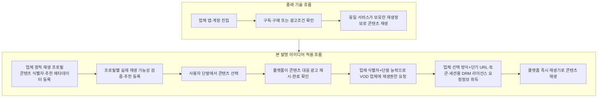
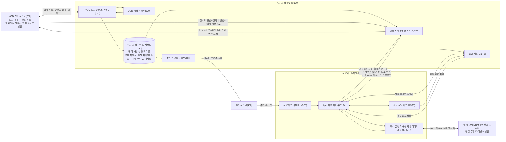
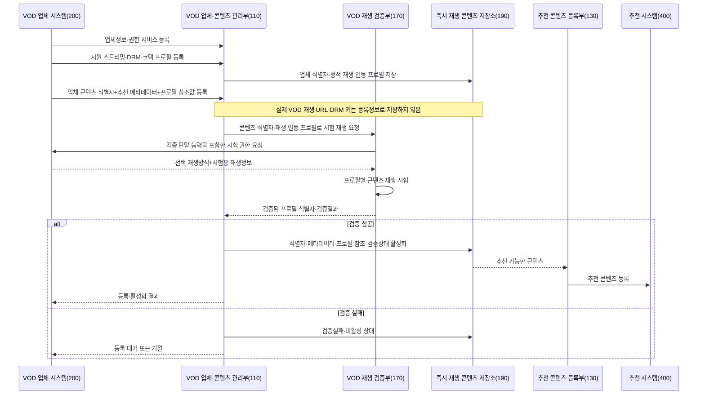
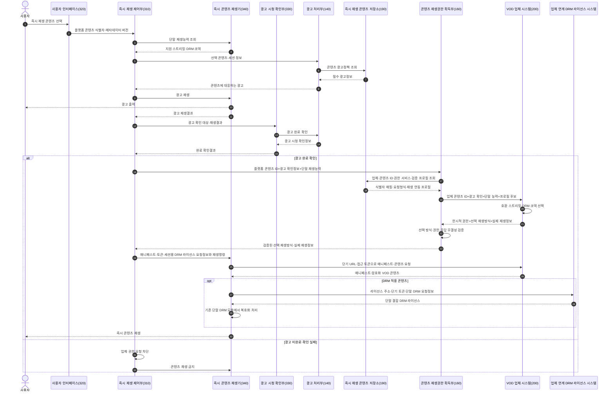
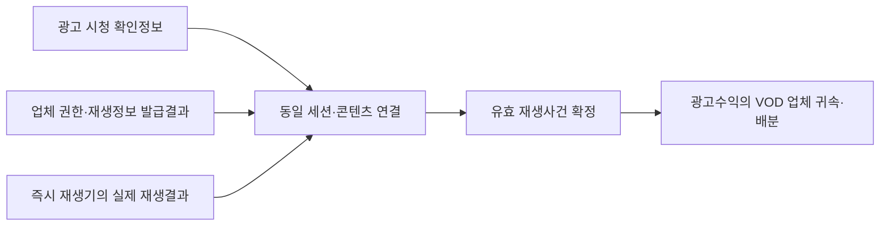
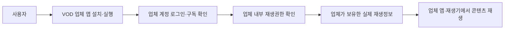
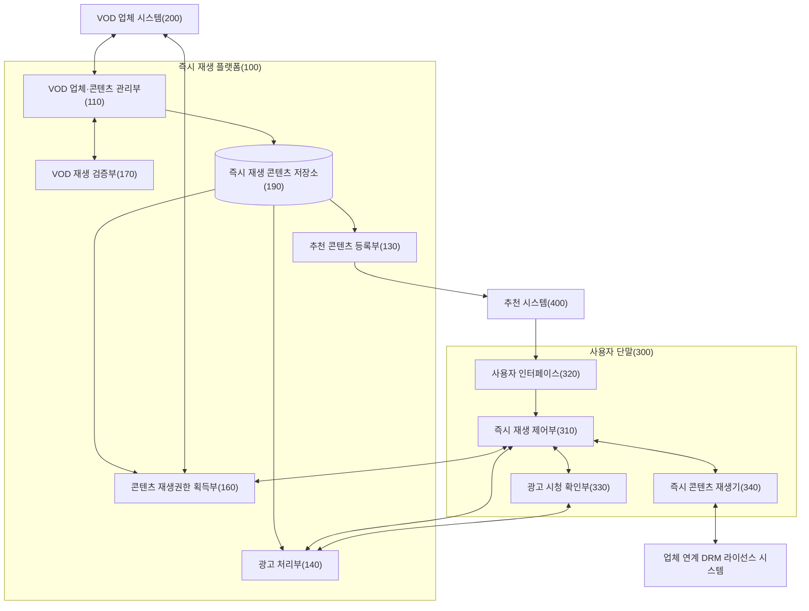
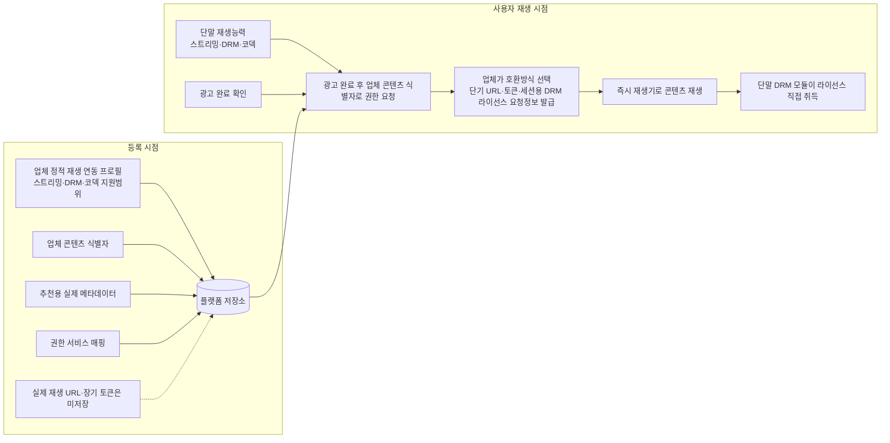
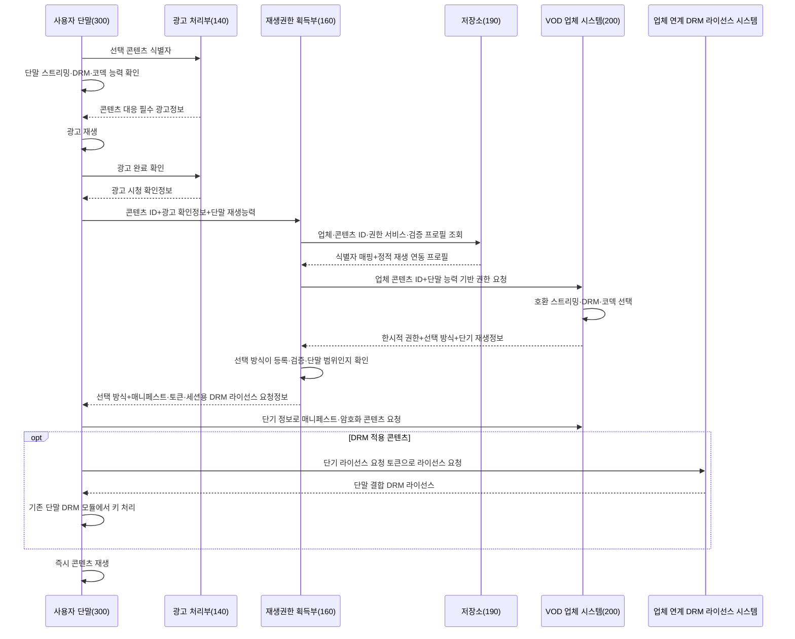
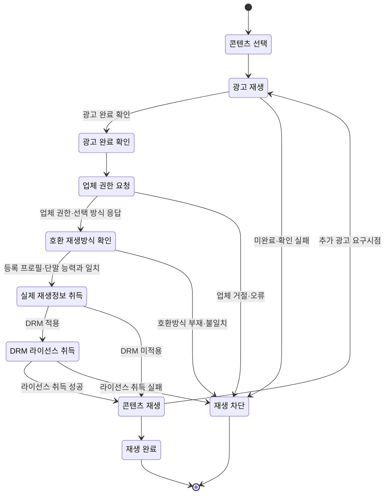

<!-- page-break:page-1 -->

<table>
  <tr>
    <td colspan="10" style="text-align:center; font-weight:bold;">직무발명(고안) 명세서<br>(Invention Disclosure)</td>
  </tr>
  <tr><td colspan="10">● 발명의 명칭 (Title of Invention)</td></tr>
  <tr><td colspan="2">한글</td><td colspan="8">VOD 업체 제공 식별자와 지연 취득 재생정보를 이용한 광고 조건부 즉시 콘텐츠 재생 시스템 및 방법</td></tr>
  <tr><td colspan="2">영어</td><td colspan="8">Advertisement-Conditioned Instant Content Playback System and Method Using Provider-Supplied Identifiers and Just-in-Time Playback Information</td></tr>
  <tr><td colspan="10">● 관련 선행기술 및 선출원</td></tr>
  <tr><td rowspan="6">기술출처</td><td colspan="2" rowspan="2">유사특허/논문 등</td><td>명칭</td><td colspan="6">Advertisements as Keys for Streaming Protected Content 외 예비 선행특허</td></tr>
  <tr><td>특허/출원번호</td><td colspan="6">US8918902B1, US8065417B1, US9892206B2, US20150242597A1 — 정식 선행기술 조사 필요</td></tr>
  <tr><td colspan="2" rowspan="2">배경논문/제품 등</td><td>명칭</td><td colspan="6">광고 기반 주문형 비디오(AVOD), 광고 기반 스트리밍, VOD 앱 기반 재생, 콘텐츠 추천 플랫폼</td></tr>
  <tr><td>발행처/제품명</td><td colspan="6">일반적인 상용 스트리밍·추천·광고 플랫폼 구조</td></tr>
  <tr><td colspan="2" rowspan="2">본 발명자 선출원</td><td>명칭</td><td colspan="6">확인 필요</td></tr>
  <tr><td>특허/출원번호</td><td colspan="6">확인 필요</td></tr>
  <tr><td colspan="10">● 발명자 연락처</td></tr>
  <tr><td colspan="2">성명</td><td colspan="2">소속</td><td colspan="3">연락처</td><td colspan="3">E-mail</td></tr>
  <tr><td colspan="2">확인 필요</td><td colspan="2">확인 필요</td><td colspan="3">확인 필요</td><td colspan="3">확인 필요</td></tr>
</table>

#### 【사전 체크 사항】

1. **발명의 대상 및 핵심 구조**
   - 복수의 VOD 업체가 제공하는 콘텐츠를 VOD 업체 앱 설치나 업체 계정 로그인 없이 플랫폼의 즉시 재생기로 재생하는 분산형 콘텐츠 재생 시스템이다.
   - 업체 등록 시 플랫폼은 VOD 업체가 지원하는 스트리밍 방식, DRM 체계, 코덱, 권한 요청규격 및 정적 DRM 연동정보를 정적 재생 연동 프로필로 등록한다.
   - 콘텐츠 등록 시 플랫폼은 실제 콘텐츠 파일, 영구 재생 URL 또는 DRM 키를 저장하지 않고, VOD 업체가 제공한 업체 콘텐츠 식별자와 상기 정적 재생 연동 프로필의 참조값을 저장한다.
   - 추천을 위해 제목, 장르, 출연진, 등급, 대표 이미지, 줄거리, 제공지역·기간 등 실제 콘텐츠 메타데이터는 플랫폼에 저장한다.
   - 사용자 선택 시 플랫폼은 콘텐츠 식별자에 대응하는 광고를 먼저 제시하고, 광고 완료 후에만 해당 식별자로 VOD 업체 서버에 재생권한을 요청한다.
   - 권한 요청에는 사용자 단말이 지원하는 스트리밍·DRM·코덱 능력정보가 포함될 수 있고, VOD 업체는 등록된 재생 연동 프로필과 단말 능력정보에 부합하는 실제 재생방식을 선택한다.
   - VOD 업체가 반환한 선택 재생방식, 단기 재생 URL, 접근 토큰, 매니페스트 위치 또는 세션용 DRM 라이선스 요청정보를 즉시 재생기에 제공하여 콘텐츠를 재생한다.
   - DRM이 적용된 경우 즉시 재생기는 업체 연계 DRM 라이선스 시스템으로부터 단말에 결합된 라이선스를 취득하고, 콘텐츠 키는 플랫폼 서버가 저장하거나 평문으로 취득하지 않는다.
   - 종래 스트리밍에서도 단말이 DRM 라이선스를 받아 콘텐츠를 복호화하는 구조는 존재한다. 본 발명은 DRM 라이선스 취득 자체가 아니라, 그 라이선스를 받기 위한 정보가 등록 시 저장되지 않고 광고 완료 후 VOD 업체 권한 응답으로 지연 취득되며, 단말이 직접 라이선스를 받고 플랫폼은 콘텐츠 키를 보지 않는 처리경계를 강조한다.

2. **종래기술과 구별되는 핵심 구성**
   - 광고 시청 후 동일 서비스 사업자가 보유한 콘텐츠를 재생하는 통상적인 광고 기반 스트리밍과 달리, 광고 플랫폼과 콘텐츠 권한 발급 주체인 VOD 업체가 분리되어 있다.
   - 콘텐츠 등록 시점에는 실제 재생 위치를 플랫폼에 고정하지 않고 업체 제공 식별자만 저장하며, 실제 재생정보는 광고 완료 후 사용자 재생 시점에 업체 서버에서 지연 취득한다.
   - 업체 식별자만으로는 추천이 불가능하므로 추천용 콘텐츠 메타데이터는 별도로 저장하고, 식별자·메타데이터·권한 서비스의 연결관계를 유지한다.
   - 등록된 콘텐츠는 실제 권한 획득과 재생 가능성을 검증한 후 추천 대상으로 활성화할 수 있다.

3. **적용 범위 및 전제 조건**
   - 텔레비전, 셋톱박스, 모바일 단말, 태블릿 또는 컴퓨터 등 플랫폼이 즉시 재생기와 네트워크 통신기능을 제공하는 사용자 단말에 적용할 수 있다.
   - VOD 업체는 업체 콘텐츠 식별자, 추천용 메타데이터, 정적 재생 연동 프로필, 권한 요청 인터페이스 및 실제 재생정보 반환 인터페이스를 등록해야 한다.
   - VOD 업체는 플랫폼이 지원하는 스트리밍·DRM 방식을 사용하거나 등록단계 검증을 통과해야 한다.
   - 광고 선정 알고리즘, 광고 형식 및 기존 DRM 구현 자체는 본 발명의 필수 차별점으로 한정하지 않는다.

4. **권리·계약·실행 조건이 확정되는 시점**
   - 업체 연동조건은 VOD 업체 등록과 플랫폼 검증이 완료되어 업체 상태가 활성화되는 시점에 확정된다.
   - 콘텐츠의 추천 가능상태는 콘텐츠 메타데이터·업체 식별자 등록 및 시험 재생 검증이 완료되는 시점에 확정된다.
   - 개별 사용자의 재생 가능상태는 필수 광고 시청 완료가 확인되고 VOD 업체가 한시적 재생권한을 발급하는 시점에 확정된다.
   - 실제 콘텐츠 URL 등 재생정보는 등록 시점이 아니라 개별 재생권한 발급 시점에 생성·취득될 수 있다.

5. **출원 전 확정하거나 치환할 정보**
   - 발명자 성명·소속·연락처 및 사내 과제명
   - 실제 제품에서 사용하는 업체·콘텐츠·재생 연동 프로필 등록 API 명칭
   - 업체 콘텐츠 식별자의 형식과 플랫폼 콘텐츠 식별자 매핑방법
   - 광고 시청 완료 확인정보의 생성·검증 주체와 위변조 방지방법
   - 단말 재생능력 필드, VOD 업체의 호환 재생방식 선택기준 및 권한 요청·응답의 필수 필드
   - 세션용 DRM 라이선스 요청정보의 단말 전달방법과 플랫폼 서버·단말 DRM 모듈 사이의 처리경계
   - 재생 URL 또는 접근 토큰의 유효시간·재사용 제한·단말 결합 여부
   - 콘텐츠 검증환경과 활성화 기준
   - 광고수익 배분조건 및 로그 보존범위

#### 【핵심 흐름 비교】

기존 VOD 또는 광고 기반 스트리밍은 보통 콘텐츠를 보유한 서비스가 콘텐츠 메타데이터, 실제 재생주소, 사용자 권한, 광고 및 재생기를 함께 관리한다. 본 발명은 플랫폼이 복수 VOD 업체의 콘텐츠를 추천하되 실제 재생정보는 보유하지 않고, 광고 완료 후 해당 업체에서 한시적으로 취득한다.

| 구분 | 기존 흐름 | 본 발명 적용 흐름 |
|---|---|---|
| 업체·콘텐츠 등록 | 업체 앱 또는 동일 서비스 내부 카탈로그에 실제 재생정보까지 등록 | 업체 재생 연동 프로필을 먼저 등록하고, 콘텐츠는 업체 제공 식별자·프로필 참조값·추천용 메타데이터를 등록하되 실제 재생 URL은 저장하지 않음 |
| 콘텐츠 노출 | 동일 서비스가 보유한 카탈로그를 노출 | 검증된 복수 VOD 업체의 메타데이터를 추천 시스템과 연계 |
| 사용자 진입 | VOD 업체 앱 설치·로그인 후 콘텐츠 선택 | 플랫폼 사용자 인터페이스에서 즉시 재생 콘텐츠 선택 |
| 광고 처리 | 동일 콘텐츠 서비스가 광고와 재생을 직접 제어 | 플랫폼이 선택 콘텐츠에 대응하는 필수 광고를 제시하고 완료를 확인 |
| 권한 획득 | 로그인·구독·구매 상태로 기존 권한 확인 | 광고 완료 후 업체 콘텐츠 식별자로 해당 VOD 업체 서버에 한시적 권한 요청 |
| 실제 재생정보 | 사전 저장된 URL 또는 업체 앱 내부정보 사용 | 단말 재생능력에 부합하도록 업체가 선택한 방식과 단기 URL·토큰·매니페스트·세션용 DRM 라이선스 요청정보를 권한 응답으로 지연 취득 |
| 콘텐츠 재생 | 업체 앱 또는 업체 재생기 | 플랫폼이 제공하는 즉시 콘텐츠 재생기 |
| 추가 광고 | 동일 서비스 내부 정책으로 처리 | 추가 광고 완료마다 다음 구간 권한 또는 갱신된 재생정보를 다시 취득 가능 |

핵심 차별점은 `등록단계의 식별자·메타데이터 저장`과 `실행단계의 실제 재생정보 지연 취득`을 분리하고, 두 단계를 `플랫폼 광고 시청 완료`라는 조건으로 연결하는 것이다.



도면의 핵심은 플랫폼이 등록단계에서 콘텐츠의 실제 재생주소를 보유하지 않으면서도 메타데이터로 콘텐츠를 추천하고, 광고 완료 후 저장된 업체 콘텐츠 식별자를 사용하여 실제 재생정보를 적시에 취득하는 데 있다.

<!-- page-break:page-2 -->

#### 1. 발명의 배경

#### 가. 본 발명의 기술분야

본 발명은 네트워크 기반 멀티미디어 콘텐츠 제공기술에 관한 것으로서, 보다 구체적으로는 다음 기술분야에 속한다.

- 복수 VOD 업체의 콘텐츠 등록·검증·추천 연계
- 업체 제공 식별자와 콘텐츠 메타데이터의 분리 저장
- 광고 시청 완료를 조건으로 하는 콘텐츠 접근제어
- VOD 업체 시스템으로부터의 한시적 재생권한 및 실제 재생정보 지연 취득
- 플랫폼 사용자 단말의 앱리스·비로그인 즉시 콘텐츠 재생
- 광고·권한·재생 사건의 세션 단위 연결 및 수익배분

본 발명은 콘텐츠의 스트리밍 코덱이나 DRM 알고리즘 자체를 새로 정의하지 않는다. 기존 스트리밍·DRM 기술 위에서 플랫폼, VOD 업체 시스템 및 사용자 단말 사이의 등록정보, 광고 완료 확인정보, 권한 요청 및 실제 재생정보의 흐름을 제어하는 시스템이다.

핵심 용어는 다음과 같다.

- **업체 제공 콘텐츠 식별자:** VOD 업체 내부에서 콘텐츠를 식별하고 권한 발급대상을 지정하는 불투명 식별자이다. 플랫폼은 이 식별자를 통해 콘텐츠를 참조하지만 식별자 자체로 실제 재생 URL을 알 필요는 없다.
- **추천용 콘텐츠 메타데이터:** 제목, 장르, 출연진, 등급, 줄거리, 대표 이미지, 제공지역·기간 등 추천·검색·표시에 필요한 정보이다.
- **정적 재생 연동 프로필:** VOD 업체가 지원하는 스트리밍 방식, DRM 체계, 코덱, 권한 요청규격, 인증방식 및 정적 DRM 연동정보처럼 업체 연동과 호환성 판단에 사용하는 업체 단위 정보이다. 실제 콘텐츠 URL, 장기 접근 토큰, DRM 키 및 세션용 DRM 라이선스 요청정보와 구별된다.
- **단말 재생능력 정보:** 사용자 단말의 즉시 재생기가 지원하는 스트리밍 방식, DRM 체계, 비디오·오디오 코덱 및 선택적인 해상도·보안수준을 나타내는 정보이다.
- **실제 재생정보:** 콘텐츠를 실제 요청·재생하기 위해 사용자 재생 시점에 필요한 단기 URL, 매니페스트 위치, 접근 토큰, 세션용 DRM 라이선스 요청정보 또는 이들의 조합이다.
- **정적 DRM 연동정보:** 업체 등록 시 정적 재생 연동 프로필에 포함될 수 있는 지원 DRM 체계, 라이선스 취득방식, 정적 라이선스 엔드포인트 후보 또는 응답검증정보이다. 이는 특정 콘텐츠·세션에 발급되는 토큰이나 DRM 키가 아니다.
- **세션용 DRM 라이선스 요청정보:** DRM 라이선스 자체 또는 콘텐츠 키가 아니라, 즉시 재생기가 광고 완료 후 특정 콘텐츠·세션·단말·재생구간 또는 유효시간에 한정하여 업체 연계 DRM 라이선스 시스템에 라이선스를 요청하는 데 사용하는 라이선스 서버 주소, 단기 라이선스 요청 토큰, DRM 체계 식별자 또는 이들의 조합이다.
- **단말 DRM 모듈:** 특정 VOD 업체별 콘텐츠 재생 라이선스가 사전 설치된 것이 아니라, 단말·OS·브라우저 또는 재생기가 지원하는 DRM 클라이언트 또는 콘텐츠 복호화 모듈이다. VOD 업체는 단말이 지원하는 DRM 체계와 공통되는 방식으로 콘텐츠별 라이선스를 발급할 수 있다.
- **지연 취득:** 실제 재생정보를 업체·콘텐츠 등록 시점에 저장하지 않고, 광고 완료 후 개별 재생권한 요청 시점에 VOD 업체 시스템으로부터 취득하는 처리이다.
- **광고 시청 확인정보:** 특정 세션·콘텐츠·광고 요구시점의 필수 광고 시청이 완료되었음을 나타내는 정보이다.

#### 나. 종래기술의 설명

1. **VOD 업체 앱 기반 재생**: 사용자는 업체 앱을 설치하고 업체 계정으로 로그인한 후 구독·구매권한을 확인받아 콘텐츠를 재생한다. 콘텐츠 식별자, 실제 재생정보, DRM과 사용자 권한은 해당 업체의 폐쇄된 시스템 안에서 처리된다.
2. **광고 기반 콘텐츠 재생**: 사용자가 광고를 시청한 후 콘텐츠 재생을 허용한다. 통상 광고와 콘텐츠 권한을 동일 서비스가 관리하거나 광고가 콘텐츠 스트림·암호화와 직접 결합된다.
3. **콘텐츠 중개·등록 플랫폼**: 콘텐츠 제공자 또는 서비스 제공자가 콘텐츠 브로커에 등록하고, 브로커가 CDN·저장소·메타데이터 서비스를 연결한다. 그러나 광고 완료 후 원 VOD 업체에서 개별 재생권한과 실제 재생정보를 지연 취득하는 구조와는 구별된다.
4. **임시 토큰 기반 재생**: 콘텐츠 또는 단말 식별자에 연결된 임시 토큰으로 재생을 허용한다. 그러나 본 발명은 토큰 자체보다 복수 업체 등록, 추천 메타데이터, 광고 완료 및 업체 발급 재생정보의 결합에 중점을 둔다.
5. **종래 DRM 라이선스 취득 구조**: 보호 콘텐츠 재생 시 단말의 DRM 모듈 또는 브라우저 CDM이 라이선스 서버로부터 콘텐츠별·세션별 라이선스를 받아 콘텐츠를 복호화하는 구조는 일반적인 스트리밍 기술에 포함된다. 단말에 특정 VOD 업체별 콘텐츠 재생 라이선스가 사전 설치되는 것이 아니라 단말이 Widevine, PlayReady, FairPlay 등 하나 이상의 DRM 체계를 지원하고, 업체가 해당 단말과 호환되는 DRM 체계로 라이선스를 발급한다. 공통 DRM 체계가 없으면 업체가 다중 DRM으로 별도 패키징·라이선스 발급을 제공하거나, 단말 제조사·플랫폼 개발 단계에서 해당 DRM 클라이언트를 통합해야 하며, 그렇지 않으면 재생이 제한될 수 있다.

종래기술에 대한 다음 표는 예비 조사결과이며, 출원 전 한국·미국·유럽·PCT 문헌을 포함하는 정식 선행기술 조사가 필요하다.

| 구분 | 선행기술 | 주요 내용 | 본 발명과의 관련성 및 차별성 |
|---|---|---|---|
| 1 | [US8918902B1, Advertisements as Keys for Streaming Protected Content](https://patents.google.com/patent/US8918902/en) | 광고를 보호 콘텐츠 접근을 위한 선행조건 또는 복호화 키로 사용하는 구조 | 광고 후 콘텐츠 접근이라는 넓은 개념은 선행한다. 본 발명은 복수 VOD 업체 등록, 업체 식별자·추천 메타데이터 분리 저장, 광고 완료 후 업체 서버에 대한 권한 요청 및 실제 재생정보 지연 취득을 결합하여 차별화해야 한다. |
| 2 | [US8065417B1, Service Provider Registration by a Content Broker](https://patents.google.com/patent/US8065417B1/en) | 콘텐츠 제공자가 등록 API로 브로커에 등록하고 브로커가 서비스 제공자·리소스 식별자를 연결 | 등록 API와 중개 구조는 선행한다. 본 발명은 실제 재생정보를 등록하지 않는 데이터 분리, 광고 완료 조건 및 원 VOD 업체가 발급하는 한시적 재생정보를 결합한다. |
| 3 | [US9892206B2, Content Metadata Directory Services](https://patents.google.com/patent/US9892206B2/en) | 콘텐츠 식별자, 메타데이터 출처 및 URL을 등록·조회하는 디렉터리 서비스 | 식별자·메타데이터 등록은 선행할 수 있다. 본 발명은 추천 메타데이터는 저장하되 실제 재생정보는 광고 완료 후 업체 권한 응답으로 취득한다. |
| 4 | [US20150242597A1, Transferring Authorization from an Authenticated Device to an Unauthenticated Device](https://patents.google.com/patent/US20150242597A1/en) | 콘텐츠 ID·사용자 자격·재생단말에 연결된 토큰으로 비인증 단말 재생 허용 | 비로그인 단말과 임시 토큰은 관련된다. 본 발명은 다른 인증단말의 사용자 자격 이전이 아니라 광고 완료와 업체 식별자를 이용한 VOD 업체 권한 취득을 사용한다. |
| 5 | 일반 AVOD·FAST 서비스 | 광고를 시청하는 사용자에게 동일 서비스의 콘텐츠 제공 | 광고와 추천 자체는 차별점이 아니다. 콘텐츠 권한 발급자가 외부 VOD 업체이고 실제 재생정보가 광고 후 지연 취득된다는 점이 다르다. |
| 6 | 일반 DRM 스트리밍 | 단말 DRM 모듈 또는 CDM이 라이선스 서버에서 콘텐츠별 라이선스를 받아 복호화 | DRM 라이선스 취득 자체는 선행한다. 본 발명은 세션용 DRM 라이선스 요청정보를 콘텐츠 등록정보로 저장하지 않고 광고 완료 후 VOD 업체 권한 응답으로 지연 취득하며, 단말이 직접 라이선스를 받고 플랫폼은 콘텐츠 키를 보지 않는 처리경계를 결합한다. |

#### 선행기술 대비 회피 및 차별화 방향

1. “광고를 보면 콘텐츠를 재생한다”는 넓은 개념만 청구하지 않고, 업체 식별자·추천 메타데이터·권한 서비스의 등록구조를 청구한다.
2. 등록 시 실제 콘텐츠 URL 또는 장기 재생정보를 저장하지 않는 데이터 분리와, 실행 시점의 실제 재생정보 지연 취득을 청구한다.
3. 플랫폼 광고 완료 확인 후에만 저장된 업체 콘텐츠 식별자로 원 VOD 업체 시스템에 권한을 요청하는 순차적 의존관계를 청구한다.
4. VOD 업체가 권한과 실제 재생정보의 발급주체이고 플랫폼은 이를 중개·취득한다는 시스템 경계를 명확히 한다.
5. 등록 콘텐츠의 권한 획득·실제 재생 검증과 검증 성공 콘텐츠의 추천 등록을 종속항 또는 별도 독립항으로 보호한다.
6. 광고 확인정보, 업체 식별자, 권한 응답 및 실제 재생을 동일 세션·콘텐츠에 결합하고 재사용을 제한하는 구성을 추가한다.

<!-- page-break:page-3 -->

#### 다. 종래기술 문제점 및 본 발명의 목적

##### 1) 종래기술의 문제점

첫째, 복수 VOD 업체의 콘텐츠를 하나의 플랫폼에서 추천하려면 플랫폼이 콘텐츠 정보를 알아야 하지만, 실제 재생 URL·장기 접근 토큰·DRM 키 또는 세션용 DRM 라이선스 요청정보까지 사전에 저장하면 보안위험, 주소 만료, 업체 정책변경 및 데이터 동기화 문제가 발생한다.

둘째, 업체가 제공한 불투명 콘텐츠 식별자만 저장하면 사용자에게 제목·장르·줄거리·이미지 등을 표시하거나 추천하기 어렵다. 따라서 업체 내부 식별자와 추천용 실제 메타데이터를 구분하면서도 동일 콘텐츠로 연결하는 구조가 필요하다.

셋째, 일반적인 광고 기반 스트리밍은 광고 플랫폼과 콘텐츠 권한 발급 시스템이 동일 서비스에 속하는 경우가 많다. 플랫폼이 외부 VOD 업체 콘텐츠에 광고를 붙이더라도 광고 완료와 업체의 재생권한 발급을 안전하게 연결하는 기술적 절차가 부족하다.

넷째, 플랫폼이 자체적으로 콘텐츠 이용권한을 생성하면 VOD 업체의 기존 권한·DRM 체계와 충돌할 수 있다. 반대로 매번 업체 앱을 실행하거나 사용자가 업체 계정으로 로그인하게 하면 즉시 재생 사용자 경험을 제공하기 어렵다.

다섯째, 업체가 등록한 식별자·권한 서비스·재생방식이 실제로 동작하지 않으면 추천된 콘텐츠가 재생되지 않는다. 등록정보의 형식검사만으로는 실제 권한 획득과 콘텐츠 재생 가능성을 보장할 수 없다.

여섯째, 실제 재생정보를 장기간 저장하면 URL이나 토큰이 유출·재사용될 수 있고, 콘텐츠별 제공지역·기간·권한범위의 변경을 즉시 반영하기 어렵다.

일곱째, VOD 업체와 사용자 단말이 복수의 스트리밍 방식·DRM 체계·코덱 조합을 지원할 때, 등록 시점에 하나의 실제 재생주소를 고정하면 단말과 호환되지 않는 방식이 선택될 수 있다. 업체의 정적 지원범위와 개별 단말의 재생능력을 실행 시점에 대조하여 실제 재생방식을 결정할 필요가 있다.

##### 2) 본 발명의 목적

본 발명의 주된 목적은 플랫폼이 VOD 업체의 실제 콘텐츠 파일이나 장기 재생 URL을 보유하지 않으면서도 복수 업체의 콘텐츠를 메타데이터 기반으로 추천하고 즉시 재생할 수 있는 시스템을 제공하는 것이다.

다른 목적은 사용자가 플랫폼이 제시한 필수 광고를 완료한 경우에만 저장된 업체 콘텐츠 식별자를 사용하여 해당 VOD 업체 시스템에 한시적 콘텐츠 재생권한을 요청함으로써, 광고 시청을 업체 권한 획득의 선행조건으로 연결하는 것이다.

또 다른 목적은 업체가 발급한 단기 URL·접근 토큰·매니페스트 위치·세션용 DRM 라이선스 요청정보를 사용자 재생 시점에 지연 취득하여, 등록정보의 노후화와 실제 재생정보의 장기 노출을 줄이는 것이다.

또 다른 목적은 등록된 콘텐츠의 실제 권한 획득과 재생을 시험한 후 추천 대상으로 활성화하여 추천과 재생 가능성의 불일치를 줄이는 것이다.

또 다른 목적은 VOD 업체 앱 설치나 업체 계정 로그인 없이 플랫폼의 즉시 콘텐츠 재생기로 콘텐츠를 재생하면서도 VOD 업체의 기존 권한 발급과 DRM 체계를 유지하는 것이다.

또 다른 목적은 업체의 정적 재생 연동 프로필과 개별 사용자 단말의 재생능력 정보를 대조하여 호환되는 스트리밍·DRM·코덱 조합을 재생 시점에 선택하고, 종래 단말 DRM 모듈의 라이선스 취득·키 처리 구조를 이용하되 DRM 콘텐츠 키를 플랫폼 서버에 노출하지 않으면서 보호 콘텐츠를 재생하는 것이다.

##### 3) 본 발명의 해결수단 요약

본 발명은 즉시 재생 플랫폼, VOD 업체 시스템, 사용자 단말 및 추천 시스템을 포함한다.

1. VOD 업체는 플랫폼이 제공하는 업체 등록 인터페이스를 통해 업체정보, 권한 서비스, 지원 스트리밍 방식, DRM 체계, 코덱, 권한 요청규격 및 정적 DRM 연동정보를 포함하는 정적 재생 연동 프로필을 업체 단위로 등록한다.
2. VOD 업체는 상기 업체 등록과 분리된 콘텐츠 등록 인터페이스를 통해 업체 콘텐츠 식별자, 추천용 콘텐츠 메타데이터, 광고정책 참조값 및 이미 등록된 정적 재생 연동 프로필을 지시하는 참조값을 콘텐츠 단위로 등록한다.
3. 플랫폼은 업체 콘텐츠 식별자와 추천용 메타데이터 및 재생 연동 프로필 참조값을 동일 플랫폼 콘텐츠 식별자에 연결하여 저장하되, 등록정보 또는 영구 카탈로그 저장소에는 실제 콘텐츠 URL·영구 접근 토큰·DRM 키·특정 세션용 DRM 라이선스 요청정보를 저장하지 않는다.
4. 플랫폼은 등록된 권한 요청방법과 재생 연동 프로필로 시험 권한 획득 및 시험 재생을 수행하고, 성공한 콘텐츠만 추천 시스템에 등록한다.
5. 사용자가 단말에서 콘텐츠를 선택하면 플랫폼의 광고 처리부는 선택 콘텐츠 식별자에 대응하는 필수 광고정보를 단말에 제공한다.
6. 단말의 즉시 재생 제어부는 플랫폼의 즉시 콘텐츠 재생기 또는 단말 멀티미디어 재생기로 광고를 재생하고, 단말 광고 시청 확인부와 플랫폼 광고 처리부가 완료를 확인한다.
7. 광고 완료가 확인된 경우에만 플랫폼의 콘텐츠 재생권한 획득부가 저장된 업체 콘텐츠 식별자·권한 서비스·재생 연동 프로필을 조회하고 단말 재생능력 정보를 포함하는 권한 요청을 생성한다.
8. 콘텐츠 재생권한 획득부는 해당 VOD 업체 시스템에 식별자 기반 권한 요청을 전송한다. VOD 업체 시스템은 정적 재생 연동 프로필과 단말 재생능력의 공통범위에서 실제 스트리밍·DRM·코덱 조합을 선택하고, 한시적 권한과 실제 재생정보를 반환한다.
9. 플랫폼은 선택 재생방식, 단기 URL·접근 토큰·매니페스트 및 세션용 DRM 라이선스 요청정보를 즉시 재생기에 제공한다. 여기서 세션용 DRM 라이선스 요청정보는 라이선스 자체 또는 콘텐츠 키가 아니라 라이선스 서버 주소·단기 요청 토큰 등 라이선스 요청에 필요한 정보이다. DRM이 적용된 경우 즉시 재생기는 업체 연계 라이선스 시스템과 기존 단말 DRM 모듈을 이용하여 단말 결합 라이선스를 취득한 후 콘텐츠를 재생한다.
10. DRM 콘텐츠 키는 플랫폼 서버 또는 즉시 재생 제어부에 평문으로 전달·저장되지 않고 기존 단말 DRM 모듈의 보호범위에서 처리될 수 있다.
11. 추가 광고가 요구되는 경우 콘텐츠를 일시정지하고, 광고 완료 후 다음 구간의 권한과 재생정보를 다시 취득할 수 있다.

광고 미완료, 광고 확인 실패, 업체 권한 발급 거절, 실제 재생정보 만료 또는 콘텐츠 불일치가 발생하면 콘텐츠 재생을 시작하지 않거나 중지한다. 이미 완료된 동일 광고 확인정보와 동일 세션·콘텐츠에 연결된 요청만 제한적으로 재시도할 수 있다.

<!-- page-break:page-4 -->

#### 2. 발명(고안)의 구체적 설명

#### 가. 발명의 구성

##### 1) 전체 시스템 구조

본 발명의 시스템은 즉시 재생 플랫폼(100), VOD 업체 시스템(200), 사용자 단말(300) 및 추천 시스템(400)을 포함한다.



즉시 재생 콘텐츠 저장소는 업체 단위의 정적 재생 연동 프로필과 이를 참조하는 업체 콘텐츠 식별자·추천용 메타데이터를 저장하지만, 실제 콘텐츠 URL이나 장기 접근 토큰은 저장하지 않는다. 콘텐츠 재생권한 획득부는 광고 완료 후 저장된 업체 식별자와 단말 재생능력을 사용하여 VOD 업체 시스템에 권한을 요청하고, 업체가 선택한 호환 재생방식과 실제 재생정보를 취득한다. DRM이 적용되면 사용자 단말의 즉시 콘텐츠 재생기는 광고 완료 후 취득된 세션용 DRM 라이선스 요청정보를 사용하여 업체 연계 DRM 라이선스 시스템과 직접 통신하고 기존 단말 DRM 모듈로 라이선스를 처리할 수 있다.

##### 2) 주요 모듈 정의

1. **VOD 업체·콘텐츠 관리부(110)**: 플랫폼이 VOD 업체에 업체·재생 연동 프로필·콘텐츠 등록방법을 제공한다. 업체가 지원하는 스트리밍·DRM·코덱·권한 요청규격을 정적 재생 연동 프로필로 등록하고, 개별 콘텐츠의 업체 식별자·메타데이터·재생 연동 프로필 참조값을 별도로 등록·버전관리한다.
2. **추천 콘텐츠 등록부(130)**: 검증된 콘텐츠의 메타데이터와 플랫폼 콘텐츠 식별자를 추천 시스템에 등록하고 비활성화·검증 만료 시 등록을 해제한다.
3. **광고 처리부(140)**: 선택 콘텐츠 식별자와 광고정책을 이용하여 필수 광고정보를 제공하고, 단말의 광고 시청 확인부와 광고 완료를 확인한다.
4. **콘텐츠 재생권한 획득부(160)**: 광고 완료 확인 후 저장소에서 VOD 업체·콘텐츠 식별자, 권한 요청정보 및 정적 재생 연동 프로필을 조회한다. 사용자 단말의 재생능력 정보를 포함하여 업체 서버에 한시적 권한을 요청하고, 업체가 선택한 스트리밍·DRM·코덱 조합과 실제 재생정보를 취득·검증한다.
5. **VOD 재생 검증부(170)**: 등록된 업체 식별자, 권한 서비스 및 정적 재생 연동 프로필을 이용하여 지원 조합별 시험 권한 획득과 실제 콘텐츠 재생을 검증한다.
6. **즉시 재생 콘텐츠 저장소(190)**: 업체별 정적 재생 연동 프로필과, 이를 참조하는 업체·콘텐츠 식별자, 추천용 메타데이터, 권한 서비스 매핑, 광고정책 참조 및 검증상태를 구분하여 저장한다. 실제 콘텐츠 URL, DRM 키 및 장기 토큰은 등록정보로 저장하지 않는다.
7. **VOD 업체 시스템(200)**: 업체·재생 연동 프로필·콘텐츠 등록정보를 제공한다. 플랫폼이 전송한 업체 콘텐츠 식별자와 단말 재생능력을 확인하여 호환되는 실제 재생방식을 선택하고, 한시적 권한과 실제 재생정보를 발급하며 콘텐츠와 업체 연계 DRM 라이선스 시스템을 제공한다.
8. **즉시 재생 제어부(310)**: 콘텐츠 선택, 광고정보 요청, 광고 재생, 광고 완료 확인, 권한 획득 및 콘텐츠 재생의 순서를 제어한다.
9. **사용자 인터페이스(320)**: 추천 콘텐츠의 메타데이터를 표시하고 사용자의 즉시 재생 선택을 즉시 재생 제어부에 전달한다.
10. **광고 시청 확인부(330)**: 광고 재생결과를 광고 처리부의 요청정보와 대조하여 광고 완료를 확인한다.
11. **즉시 콘텐츠 재생기 또는 멀티미디어 재생기(340)**: 단말이 지원하는 스트리밍·DRM·코덱 능력정보를 즉시 재생 제어부에 제공한다. 광고와 VOD 콘텐츠를 재생하고, DRM이 적용된 경우 업체가 반환한 세션용 DRM 라이선스 요청정보를 이용하여 기존 단말 DRM 모듈을 통해 라이선스를 취득하며 재생결과를 반환한다.
12. **추천 시스템(400)**: 플랫폼이 등록한 검증된 콘텐츠의 메타데이터를 이용하여 사용자 단말에 추천 콘텐츠를 제공한다.

##### 3) 용어 정의

1. **불투명 업체 콘텐츠 식별자**: 플랫폼이 내부 구조나 실제 재생 위치를 해석하지 않고 VOD 업체 권한 요청에 그대로 또는 변환하여 사용하는 식별자이다.
2. **플랫폼 콘텐츠 식별자**: 추천·선택·광고·권한·재생로그를 하나의 콘텐츠로 연결하기 위해 플랫폼이 사용하는 식별자이다.
3. **추천용 실제 메타데이터**: 사용자에게 콘텐츠를 설명·추천하기 위해 플랫폼이 실제 값으로 저장하는 제목, 장르, 출연진, 등급, 줄거리, 대표 이미지 등의 정보이다.
4. **실제 재생정보**: VOD 콘텐츠의 재생을 시작하기 위해 필요한 단기 URL, 매니페스트 위치, 접근 토큰, 세션용 DRM 라이선스 요청정보 또는 이들의 조합이다.
5. **지연 취득 재생정보**: 등록단계에 플랫폼이 저장하지 않고 개별 사용자 재생권한 발급 시점에 VOD 업체로부터 취득하는 실제 재생정보이다.
6. **광고 시청 확인정보**: 특정 즉시 재생 세션·콘텐츠·광고 요구시점의 광고 완료를 증명하거나 조회할 수 있는 정보이다.
7. **한시적 콘텐츠 재생권한**: VOD 업체가 특정 콘텐츠·세션·단말·재생구간·유효시간 중 하나 이상에 한정하여 발급하는 권한이다.
8. **즉시 재생 세션**: 콘텐츠 선택부터 광고 확인, 권한 획득 및 재생 종료까지의 실행정보를 연결하는 짧은 수명의 세션이다.
9. **정적 재생 연동 프로필**: 업체 단위로 등록되는 지원 스트리밍 방식, DRM 체계, 비디오·오디오 코덱, 권한 요청규격, 인증방식 및 정적 DRM 연동정보의 집합이다. 복수 프로필을 등록하고 개별 콘텐츠가 하나 이상을 참조할 수 있다.
10. **단말 재생능력 정보**: 특정 사용자 단말의 즉시 콘텐츠 재생기가 지원하는 스트리밍 방식, DRM 체계, 코덱 및 선택적인 해상도·보안수준의 집합이다.
11. **선택 재생방식**: VOD 업체 시스템이 정적 재생 연동 프로필과 단말 재생능력 정보의 공통범위에서 선택하여 권한 응답에 포함한 스트리밍·DRM·코덱 조합이다.
12. **정적 DRM 연동정보**: 정적 재생 연동 프로필에 포함되는 지원 DRM 체계, 라이선스 취득방식, 정적 라이선스 엔드포인트 후보 또는 응답검증정보이다. 이는 업체 등록단계에서 저장될 수 있으나 콘텐츠별 세션 토큰이나 DRM 키와 구별된다.
13. **세션용 DRM 라이선스 요청정보**: 즉시 콘텐츠 재생기가 업체 연계 DRM 라이선스 시스템에 라이선스를 요청하는 데 사용하는 라이선스 주소, 단기 라이선스 요청 토큰, DRM 체계 식별자 또는 이들의 조합이다. 이는 콘텐츠별 재생 라이선스 자체나 콘텐츠 키와 구별되며, 특정 VOD 업체별 콘텐츠 재생 라이선스가 단말에 사전 설치되어 있음을 의미하지 않는다. 즉시 콘텐츠 재생기는 단말·OS·브라우저가 기존에 지원하는 DRM 모듈 또는 CDM을 이용하고, VOD 업체 시스템은 단말 재생능력 정보와 공통되는 DRM 체계를 선택한다.

##### 4) 업체 등록 JSON 및 콘텐츠 등록 JSON

업체 등록은 VOD 업체가 플랫폼에 한 번 또는 버전별로 제공하는 정적 연동정보를 등록하는 절차이고, 콘텐츠 등록은 이미 등록된 업체·권한 서비스·재생 연동 프로필을 참조하여 개별 콘텐츠를 등록하는 절차이다. 두 절차는 서로 다른 요청 또는 서로 다른 시점의 API 호출로 수행될 수 있으며, 콘텐츠 등록 JSON은 정적 재생 연동 프로필의 정의를 다시 포함하지 않고 식별자로만 참조한다.

`grantEndpoint`는 업체 권한 서비스를 호출하기 위한 업체 연동주소로서 실제 VOD 콘텐츠 주소와 다르다. 업체 등록 JSON은 개별 콘텐츠 식별자나 추천용 메타데이터를 포함하지 않고, 콘텐츠 등록 JSON은 실제 콘텐츠 URL, 실제 매니페스트 URL, 장기 접근 토큰, DRM 키 또는 특정 세션용 DRM 라이선스 요청정보를 포함하지 않는다.

###### 업체 등록 JSON

```json
{
  "providerRegistration": {
    "schemaVersion": "instantplay.provider-registration/1.0",
    "providerId": "com.example.vod",
    "providerDisplayName": "Example VOD",
    "providerStatus": "active",
    "grantServices": [
      {
        "grantServiceId": "example-vod-grant-service",
        "grantEndpoint": "https://api.example-vod.com/instantplay/grants",
        "authenticationProfileId": "platform-mutual-auth-01",
        "requestSchemaVersion": "instantplay.grant-request/1.0",
        "responseVerificationKeyId": "example-vod-response-key-01"
      }
    ],
    "playbackProfiles": [
      {
        "playbackProfileId": "example-vod-profile-01",
        "supportedStreamingMethods": ["dash", "hls"],
        "supportedVideoCodecs": ["h264", "hevc"],
        "supportedAudioCodecs": ["aac"],
        "supportedDrmSystems": [
          {
            "drmSystemId": "playready",
            "licenseAcquisitionMode": "player-direct",
            "licenseRequestInformationSource": "grant-response",
            "staticLicenseEndpointPolicy": "not-fixed-in-content-registration"
          }
        ],
        "profileVersion": 4
      }
    ],
    "providerRegistrationVersion": 4,
    "updatedAt": "2026-07-01T00:00:00Z"
  }
}
```

###### 콘텐츠 등록 JSON

```json
{
  "contentRegistration": {
    "schemaVersion": "instantplay.content-registration/1.0",
    "providerId": "com.example.vod",
    "providerContentId": "movie-12345",
    "platformContentId": "platform-title-7788",
    "recommendationMetadata": {
      "title": "예시 영화",
      "synopsis": "추천 화면에 표시되는 줄거리",
      "genres": ["drama"],
      "cast": ["actor-a", "actor-b"],
      "contentRating": "15",
      "posterImageUrl": "https://metadata.example.com/posters/7788.jpg",
      "runningTimeSec": 7200
    },
    "availability": {
      "regions": ["KR"],
      "validFrom": "2026-07-01T00:00:00Z",
      "validUntil": "2026-12-31T14:59:59Z"
    },
    "grantBinding": {
      "grantServiceId": "example-vod-grant-service",
      "playbackResourceId": "asset-5f91a2"
    },
    "playbackProfileRefs": [
      {
        "playbackProfileId": "example-vod-profile-01",
        "minimumProfileVersion": 4
      }
    ],
    "instantPlayPolicy": {
      "enabled": true,
      "requiredAdPolicyId": "required-ad-policy-v1",
      "maximumGrantTtlSec": 120,
      "vendorLoginRequired": false
    },
    "verification": {
      "status": "passed",
      "verifiedPlaybackProfileIds": ["example-vod-profile-01"],
      "verificationId": "verification-01J...",
      "validUntil": "2026-08-19T00:00:00Z"
    },
    "contentRegistrationVersion": 12
  }
}
```

###### 업체 등록 필드 설명

| 필드 | 필수 여부 | 설명 |
|---|---|---|
| `providerRegistration` | 필수 | 업체 단위 정적 연동정보를 담는 등록 레코드 |
| `providerId` | 필수 | VOD 업체를 식별하고 권한 서비스와 콘텐츠 등록을 연결하는 값 |
| `grantServices` | 필수 | 업체 콘텐츠 재생권한 발급 서비스를 호출하기 위한 정적 연동정보의 집합 |
| `grantServiceId` | 필수 | 콘텐츠 등록 레코드가 참조할 권한 서비스 식별자 |
| `grantEndpoint` | 필수 | 업체 권한 서비스를 호출할 주소이며 실제 VOD 콘텐츠 주소와 다름 |
| `authenticationProfileId` | 필수 | 플랫폼과 업체 권한 서비스 사이의 인증방식 참조값 |
| `requestSchemaVersion` | 필수 | 업체별 권한 요청형식 버전 |
| `responseVerificationKeyId` | 선택 | 업체 권한 응답의 진위·무결성 검증에 사용할 키 식별자 |
| `playbackProfiles` | 필수 | 업체가 제공할 수 있는 정적 재생 연동 프로필의 집합 |
| `playbackProfileId` | 필수 | 개별 콘텐츠가 참조할 정적 재생 연동 프로필 식별자 |
| `supportedStreamingMethods` | 필수 | 업체가 즉시 재생에 제공할 수 있는 스트리밍 방식의 집합 |
| `supportedDrmSystems` | 선택 | 업체가 제공할 수 있는 DRM 체계와 정적 DRM 연동정보의 집합 |
| `licenseAcquisitionMode` | 선택 | 재생기가 라이선스 시스템에 직접 요청하는지 등을 나타내는 값 |
| `licenseRequestInformationSource` | 선택 | 세션용 라이선스 주소·토큰이 권한 응답 등에서 취득됨을 나타내는 값 |
| `staticLicenseEndpointPolicy` | 선택 | 정적 프로필에 고정 라이선스 주소를 둘지, 권한 응답에서 받을지를 나타내는 정책 |
| `profileVersion` | 필수 | 정적 재생 연동 프로필의 변경 버전 |
| `providerRegistrationVersion` | 필수 | 업체 등록정보의 변경 버전 |

###### 콘텐츠 등록 필드 설명

| 필드 | 필수 여부 | 설명 |
|---|---|---|
| `contentRegistration` | 필수 | 콘텐츠 단위 등록 레코드 |
| `providerId` | 필수 | 이미 등록된 VOD 업체를 참조하는 값 |
| `providerContentId` | 필수 | VOD 업체가 제공하는 불투명 콘텐츠 식별자 |
| `platformContentId` | 필수 | 플랫폼 추천·광고·세션·권한 처리를 연결하는 콘텐츠 식별자 |
| `recommendationMetadata` | 필수 | 추천·검색·표시를 위해 플랫폼이 실제 값으로 저장하는 메타데이터 |
| `posterImageUrl` | 선택 | 추천 화면용 대표 이미지의 위치이며 실제 VOD 영상주소와 다름 |
| `availability` | 필수 | 제공지역과 제공기간 |
| `grantBinding` | 필수 | 업체 콘텐츠 식별자를 이미 등록된 권한 발급 서비스와 연결하는 정보 |
| `playbackResourceId` | 필수 | 업체 권한 발급대상을 특정하는 재생 자산 식별자 |
| `playbackProfileRefs` | 필수 | 이미 등록된 정적 재생 연동 프로필 참조값의 집합 |
| `minimumProfileVersion` | 선택 | 콘텐츠 검증 당시 요구된 프로필의 최소 버전 |
| `requiredAdPolicyId` | 필수 | 콘텐츠에 적용할 필수 광고정책의 참조값 |
| `maximumGrantTtlSec` | 선택 | 업체에 요청할 권한의 최대 유효시간 |
| `vendorLoginRequired` | 필수 | 즉시 재생에서는 거짓이어야 하는 업체 로그인 요구 여부 |
| `verification` | 필수 | 콘텐츠의 시험 권한 획득과 실제 재생 검증상태 |
| `verifiedPlaybackProfileIds` | 필수 | 실제 시험 재생을 통과한 재생 연동 프로필 식별자의 집합 |
| `contentRegistrationVersion` | 필수 | 권한 요청과 추천 등록에 적용되는 콘텐츠 등록정보 버전 |

업체 등록 레코드는 호환성 판단에 필요한 정적 지원범위만 나타내며, 특정 콘텐츠나 특정 사용자 세션에 사용할 실제 재생방식을 미리 확정하지 않는다. 콘텐츠 등록 레코드는 업체 등록 레코드의 `providerId`, `grantServiceId` 및 `playbackProfileId`를 참조하여 다수 콘텐츠가 동일 업체 프로필을 공유할 수 있게 한다. 대표 이미지 URL은 추천용 메타데이터이며 VOD 콘텐츠의 실제 재생주소와 구별된다.

##### 5) 권한 요청 및 지연 취득 재생정보 JSON

권한 요청은 광고 완료가 확인된 후 콘텐츠 재생권한 획득부(160)가 생성한다. 응답은 VOD 업체 시스템(200)이 생성하며, 등록단계에 저장하지 않았던 실제 재생정보를 포함할 수 있다.

```json
{
  "grantRequest": {
    "requestType": "instantplay.grant-request/1.0",
    "requestId": "grant-request-01J...",
    "providerId": "com.example.vod",
    "providerContentId": "movie-12345",
    "playbackResourceId": "asset-5f91a2",
    "platformContentId": "platform-title-7788",
    "anonymousSessionId": "session-01J...",
    "adConfirmation": {
      "adConfirmationId": "ad-confirmation-01J...",
      "adCheckpointId": "checkpoint-initial",
      "confirmationProof": "SIGNED_AD_CONFIRMATION"
    },
    "requestedAccess": {
      "scope": "playback-segment",
      "segmentIndex": 1,
      "maximumTtlSec": 120
    },
    "requestedPlaybackProfileIds": ["example-vod-profile-01"],
    "deviceCapabilities": {
      "streamingMethods": ["dash", "hls"],
      "drmSystems": ["playready"],
      "videoCodecs": ["h264", "hevc"],
      "audioCodecs": ["aac"]
    },
    "providerRegistrationVersion": 4,
    "contentRegistrationVersion": 12,
    "nonce": "ONE_TIME_REQUEST_NONCE",
    "platformSignature": "SIGNED_PLATFORM_REQUEST"
  },
  "grantResponse": {
    "responseType": "instantplay.grant-response/1.0",
    "requestId": "grant-request-01J...",
    "grantId": "vendor-grant-01J...",
    "issuer": "com.example.vod",
    "providerContentId": "movie-12345",
    "anonymousSessionId": "session-01J...",
    "permittedPlayback": {
      "scope": "playback-segment",
      "segmentIndex": 1
    },
    "selectedPlaybackConfiguration": {
      "playbackProfileId": "example-vod-profile-01",
      "streamingMethod": "dash",
      "drmSystemId": "playready",
      "videoCodec": "hevc",
      "audioCodec": "aac"
    },
    "playbackInformation": {
      "manifestUrl": "https://stream.example.com/session-01J/manifest.mpd",
      "playbackAccessToken": "SHORT_LIVED_VENDOR_TOKEN",
      "drmLicenseRequestInformation": {
        "acquisitionMode": "player-direct",
        "drmSystemId": "playready",
        "licenseEndpoint": "https://license.example.com/playready",
        "licenseRequestToken": "SHORT_LIVED_LICENSE_TOKEN"
      }
    },
    "issuedAt": "2026-07-19T01:01:25Z",
    "expiresAt": "2026-07-19T01:03:25Z",
    "vendorSignature": "SIGNED_VENDOR_GRANT"
  }
}
```

###### 권한 요청 및 재생정보 필드 설명

| 필드 | 필수 여부 | 설명 |
|---|---|---|
| `requestId` | 필수 | 권한 요청과 업체 응답을 연결하는 식별자 |
| `providerId` | 필수 | 권한을 발급할 VOD 업체 |
| `providerContentId` | 필수 | 등록 시 저장한 업체 제공 콘텐츠 식별자 |
| `playbackResourceId` | 필수 | 업체 내부의 실제 재생 자산 참조값 |
| `platformContentId` | 필수 | 추천·광고·세션과 업체 콘텐츠를 연결하는 플랫폼 식별자 |
| `anonymousSessionId` | 필수 | 광고 확인·권한·재생을 연결하는 세션 |
| `adConfirmation` | 필수 | 권한 요청의 선행조건이 된 광고 시청 확인정보 |
| `requestedAccess` | 필수 | 요청 재생범위·구간·유효시간 |
| `requestedPlaybackProfileIds` | 필수 | 콘텐츠가 참조하고 시험 재생을 통과한 정적 재생 연동 프로필의 후보 |
| `deviceCapabilities` | 필수 | 실제 사용자 단말이 지원하는 스트리밍·DRM·비디오·오디오 코덱의 집합 |
| `providerRegistrationVersion` | 필수 | 권한 요청에 적용한 업체 등록정보 버전 |
| `contentRegistrationVersion` | 필수 | 권한 요청에 적용한 콘텐츠 등록정보 버전 |
| `nonce` | 필수 | 권한 요청의 반복 사용 방지값 |
| `platformSignature` | 선택 | 업체가 플랫폼 요청의 진위를 확인하는 값 |
| `grantId` | 필수 | VOD 업체가 발급한 권한 식별자 |
| `issuer` | 필수 | 권한 발급 VOD 업체 |
| `permittedPlayback` | 필수 | 업체가 실제 허용한 재생범위 |
| `selectedPlaybackConfiguration` | 필수 | 업체가 재생 연동 프로필과 단말 능력의 공통범위에서 선택한 실제 스트리밍·DRM·코덱 조합 |
| `playbackProfileId` | 필수 | 선택된 정적 재생 연동 프로필 식별자 |
| `streamingMethod` | 필수 | 선택된 실제 스트리밍 방식 |
| `drmSystemId` | DRM 적용 시 필수 | 선택된 DRM 체계 식별자 |
| `videoCodec`·`audioCodec` | 선택 | 선택된 비디오·오디오 코덱 |
| `playbackInformation` | 필수 | 광고 완료 후 지연 취득된 실제 콘텐츠 재생정보 |
| `manifestUrl` | 실시예별 필수 | 단기 매니페스트 또는 재생목록 위치 |
| `playbackAccessToken` | 실시예별 필수 | 실제 콘텐츠 요청에 사용하는 짧은 수명의 토큰 |
| `drmLicenseRequestInformation` | DRM 적용 시 필수 | 단말 재생기가 기존 DRM 모듈을 이용하여 라이선스를 취득하는 데 필요한 세션용 주소·토큰 등 요청정보 |
| `acquisitionMode` | DRM 적용 시 필수 | 단말 재생기의 라이선스 직접 취득 등 라이선스 처리방식 |
| `licenseEndpoint` | DRM 적용 시 필수 | 단말 재생기가 라이선스를 요청할 업체 연계 주소 |
| `licenseRequestToken` | 선택 | 특정 콘텐츠·세션·단말에 한정된 단기 라이선스 요청 토큰 |
| `issuedAt`·`expiresAt` | 필수 | 권한과 실제 재생정보의 발급·만료시각 |
| `vendorSignature` | 선택 | 업체 응답의 진위·무결성을 검증하는 값 |

콘텐츠 재생권한 획득부(160)는 `selectedPlaybackConfiguration`이 등록된 재생 연동 프로필, 콘텐츠의 검증결과 및 `deviceCapabilities`의 공통범위에 포함되는지 확인한 후 단말에 전달한다. 호환되는 공통범위가 없거나 업체가 등록되지 않은 방식을 선택한 경우 권한 응답을 거절한다.

`drmLicenseRequestInformation`은 DRM 콘텐츠 키 자체가 아니다. 즉시 콘텐츠 재생기(340)는 이 정보를 이용하여 업체 연계 DRM 라이선스 시스템에 직접 라이선스를 요청할 수 있다. 라이선스 응답과 콘텐츠 키의 복호화·사용은 기존 단말 DRM 모듈에서 수행되며, 플랫폼 서버 또는 즉시 재생 제어부가 콘텐츠 키를 평문으로 취득하거나 영구 저장하는 것을 요구하지 않는다.

종래 스트리밍에서도 단말의 DRM 모듈 또는 CDM이 라이선스 서버로부터 콘텐츠별 라이선스를 받아 보호 콘텐츠를 복호화하는 구조는 존재한다. 본 실시예는 그 구조 자체를 신규한 DRM 기술로 주장하지 않고, 라이선스 요청에 필요한 세션용 주소·토큰 등 세션용 DRM 라이선스 요청정보가 콘텐츠 등록단계에 플랫폼에 저장되지 않으며 광고 완료 이후 VOD 업체 권한 응답으로 지연 취득된다는 점과, 단말이 라이선스를 직접 취득하고 플랫폼이 콘텐츠 키를 보지 않는 점을 시스템 경계로 한정한다.

##### 6) 즉시 재생 세션 패키지

즉시 재생 세션 패키지는 사용자 선택부터 광고 재생, 광고 완료 확인, 업체 권한 획득 및 콘텐츠 재생까지의 실행상태를 연결한다. 영구 사용자 계정 대신 짧은 수명의 익명 세션으로 구현할 수 있다.

세션 패키지는 다음을 포함할 수 있다.

- 익명 재생 세션 식별자
- 플랫폼 콘텐츠 식별자와 업체 콘텐츠 식별자
- 적용된 등록 버전
- 적용 후보 및 선택된 재생 연동 프로필 식별자
- 단말 재생능력 정보와 업체가 선택한 스트리밍·DRM·코덱 조합
- 광고 요청·광고 목록·광고 요구시점 식별자
- 광고 시청 확인정보와 일회성 값
- 업체 권한 요청·응답 식별자
- 실제 재생정보, 세션용 DRM 라이선스 요청정보 및 만료시각
- 현재 재생구간·위치·상태
- 광고·권한·재생 로그의 무결성 참조값

세션 패키지는 특정 콘텐츠·단말·광고 요구시점·권한 유효시간에 결합될 수 있다. 만료되거나 이미 사용된 광고 확인정보, 권한 또는 실제 재생정보는 다른 세션에 재사용하지 못하도록 제한할 수 있다.

#### 나. 발명의 동작 설명

##### 1) 업체·콘텐츠 사전 등록 흐름



플랫폼은 먼저 업체 단위의 권한 서비스와 정적 재생 연동 프로필을 저장하고, 이후 별도의 콘텐츠 등록 절차에서 업체 콘텐츠 식별자와 추천용 콘텐츠 메타데이터 및 검증된 프로필 참조값을 동일 플랫폼 콘텐츠 식별자에 연결한다. 콘텐츠 등록은 이미 등록된 업체 식별자, 권한 서비스 식별자 및 재생 연동 프로필 식별자를 참조하므로, 업체 등록 JSON과 콘텐츠 등록 JSON이 하나의 요청으로 함께 제출될 필요는 없다. 시험 요청에서 업체가 반환한 방식이 등록 프로필과 검증 단말 능력의 공통범위인지 확인하고 실제 재생까지 성공한 프로필만 활성화한다. 실제 콘텐츠 URL은 저장하지 않으므로 주소 변경·만료·유출위험을 줄이고, 사용자 재생 시점에 업체의 최신 제공조건과 실제 단말 능력을 적용할 수 있다.

##### 2) 추천 후보 생성·처리 흐름

1. 추천 콘텐츠 등록부는 저장소에서 활성 업체에 속하고 재생 검증이 유효한 콘텐츠를 조회한다.
2. 플랫폼 콘텐츠 식별자와 추천용 메타데이터를 추천 시스템에 등록한다.
3. 추천 시스템은 제목·장르·등급·대표 이미지·제공지역·기간 등의 메타데이터로 후보를 생성한다.
4. 사용자 단말의 사용자 인터페이스에 추천 콘텐츠를 제공한다.
5. 사용자가 콘텐츠를 선택하면 사용자 인터페이스는 플랫폼 콘텐츠 식별자와 콘텐츠 정보버전을 즉시 재생 제어부에 전달한다.
6. 실제 재생 URL은 추천 시스템이나 사용자 인터페이스에 제공되지 않는다.

##### 3) 광고·권한·세션 생성 및 재생 흐름



광고 완료 전에는 실제 재생정보가 존재하지 않거나 단말에 제공되지 않는다. 광고 완료 확인 후 콘텐츠 재생권한 획득부가 업체 콘텐츠 식별자와 단말 재생능력을 업체 시스템에 전달하고, 업체 시스템은 등록·검증된 재생 연동 프로필과 단말 재생능력의 공통범위에서 실제 재생방식을 선택한다. 콘텐츠 재생권한 획득부는 선택 결과를 검증한 후 실제 재생정보를 단말에 전달한다.

DRM이 적용된 실시예에서 즉시 콘텐츠 재생기는 업체가 광고 완료 후 권한 응답으로 반환한 세션용 DRM 라이선스 요청정보를 이용하여 업체 연계 라이선스 시스템과 직접 통신할 수 있다. 이 과정은 기존 DRM 규격을 사용할 수 있으며, DRM 알고리즘·보안 하드웨어 또는 콘텐츠 키 생성방식 자체는 본 발명의 필수 차별점이 아니다. 차별점은 DRM 라이선스를 받기 위한 세션용 요청정보가 등록 시 저장되는 것이 아니라 광고 완료 후 지연 취득되고, 실제 라이선스 취득과 키 사용은 단말 DRM 모듈에서 수행되며, 콘텐츠 키가 플랫폼 서버나 즉시 재생 제어부에 평문으로 전달되지 않는 처리경계에 있다.

##### 4) 부가 처리 및 정산 흐름



광고 완료만 존재하고 업체 권한 발급 또는 실제 재생이 실패한 경우에는 수익배분을 보류하거나 별도 정책을 적용할 수 있다. 광고 선정·과금 공식 자체는 본 발명의 필수 구성이 아니며, 광고 확인·권한 발급·재생결과가 같은 업체 콘텐츠 식별자와 세션으로 연결되는 구조가 중요하다.

##### 5) 폴백 흐름

1. **업체 등록정보 오류**: 업체 식별자, 권한 서비스 또는 응답검증정보가 유효하지 않으면 업체 등록을 대기·거절한다.
2. **콘텐츠 검증 실패**: 시험 권한 획득 또는 시험 재생에 실패하면 콘텐츠를 비활성화하고 추천 시스템에 등록하지 않는다.
3. **광고정보 획득 실패**: 선택 콘텐츠에 요구되는 광고를 얻지 못하면 즉시 재생을 시작하지 않는다.
4. **광고 미완료 또는 확인 실패**: 콘텐츠 재생권한 획득부를 호출하지 않고 재생을 차단한다.
5. **업체 권한 발급 거절**: 사용자에게 재생 불가 결과를 표시하고 실제 재생정보를 제공하지 않는다.
6. **실제 재생정보 만료**: 만료된 URL·토큰으로 재생하지 않고, 정책에 따라 새 광고 또는 기존 유효 광고 확인정보에 기반한 권한 재취득을 수행한다.
7. **업체 응답과 콘텐츠 불일치**: 업체·콘텐츠·세션·권한범위가 일치하지 않으면 응답을 폐기하고 보안기록을 생성한다.
8. **호환 재생방식 부재**: 등록·검증된 재생 연동 프로필과 단말 재생능력 사이에 공통 스트리밍·DRM·코덱 조합이 없으면 업체 권한을 요청하지 않거나 업체 응답을 거절하고 재생 불가를 표시한다.
9. **선택 재생방식 불일치**: 업체가 반환한 선택 재생방식이 등록 프로필, 콘텐츠 검증결과 또는 단말 재생능력에 포함되지 않으면 실제 재생정보를 단말에 전달하지 않는다.
10. **DRM 라이선스 취득 실패**: 라이선스 주소·토큰의 만료, DRM 체계 불일치 또는 라이선스 발급 거절 시 암호화 콘텐츠를 재생하지 않고 정책에 따라 동일 권한범위에서 제한적으로 재시도한다.
11. **콘텐츠 재생 실패**: 동일 권한의 허용범위에서 제한적으로 재시도하고, 실패가 지속되면 세션을 종료한다.
12. **추가 광고 실패**: 진행 중인 VOD 콘텐츠를 일시정지하고 다음 구간 권한을 요청하지 않는다.

##### 6) 개발 세부 사항

| 구분 | 내용 |
|---|---|
| 식별자 분리 | `platformContentId`, `providerId`, `providerContentId`, `playbackResourceId`의 의미와 매핑방향을 정의한다. 업체 식별자는 실제 URL을 포함하지 않는 불투명 값으로 구현할 수 있다. |
| 메타데이터 범위 | 추천에 필요한 제목·장르·등급·줄거리·이미지·제공지역·기간을 정의하고, 실제 VOD 재생주소와 명확히 구분한다. |
| 등록 API | 업체·재생 연동 프로필·콘텐츠 등록을 구분하고 버전, 인증, 중복요청 방지, 변경이력 및 비활성화 절차를 정의한다. |
| 정적 프로필 분리 | 업체가 지원하는 스트리밍·DRM·코덱·권한 요청규격을 업체 단위 프로필로 저장하고, 개별 콘텐츠는 프로필 식별자를 참조한다. 프로필에는 실제 콘텐츠 URL·세션 토큰·DRM 키를 포함하지 않는다. |
| 실제 재생정보 미저장 | 등록 데이터 모델과 로그에서 실제 매니페스트 URL·장기 토큰·DRM 키를 제외한다. 단기 URL이 운영 로그에 남는 경우 마스킹·암호화·짧은 보존기간을 적용한다. |
| 등록 검증 | 업체 권한 서비스에 시험용 요청을 보내고 매니페스트 접근·재생 시작까지 확인하는 검증상태와 유효기간을 정의한다. |
| 광고 연결 | 콘텐츠 식별자와 필수 광고정책의 매핑, 광고 요청 식별자, 광고 요구시점 및 광고 목록 버전을 정의한다. |
| 광고 완료 확인 | 재생결과를 세션·콘텐츠·광고 요청에 결합하고, 일회성 값·서명·서버 상태조회 중 하나 이상으로 단말 임의완료를 제한한다. |
| 권한 요청 API | 업체별 엔드포인트, 인증방식, 요청·응답 규격, 오류코드, 재시도 및 응답검증방법을 정의한다. |
| 단말 재생능력 | 즉시 재생기가 지원하는 스트리밍·DRM·코덱 집합을 권한 요청에 포함하되, 단말을 직접 식별할 필요가 없는 최소 능력정보만 사용할 수 있다. |
| 호환방식 선택 | VOD 업체가 등록 프로필과 단말 재생능력의 공통범위에서 실제 스트리밍·DRM·코덱 조합을 선택하여 응답하고, 플랫폼은 등록·검증 범위와 일치하는지 확인한다. |
| 지연 취득 응답 | 선택 재생방식, 단기 URL, 접근 토큰, 매니페스트 위치, DRM 라이선스 주소·단기 토큰, 허용범위 및 만료시각 중 실제 재생에 필요한 항목을 정의한다. |
| DRM 처리경계 | 플랫폼 서버는 세션용 DRM 라이선스 요청정보를 전달할 수 있으나 콘텐츠 키를 평문으로 취득·저장하지 않는다. 실제 라이선스 취득과 키 사용은 즉시 재생기와 기존 단말 DRM 모듈이 담당한다. |
| 권한 결합 | 광고 확인정보, 업체 콘텐츠 식별자, 익명 세션, 단말 또는 재생구간을 업체 권한 요청에 결합한다. |
| 즉시 재생기 상태 | 콘텐츠선택·광고대기·광고재생·광고확인·권한대기·콘텐츠재생·일시정지·완료·실패 상태와 전이조건을 정의한다. |
| 추가 광고 | 광고 요구시점 도달 시 재생을 일시정지하고, 광고 확인 후 다음 구간 권한과 실제 재생정보를 재취득한다. |
| 보안 | 플랫폼·업체 상호인증, 요청서명, 응답서명, 일회성 값, URL·토큰 TTL 및 재사용 방지를 적용할 수 있다. |
| 개인정보 | VOD 업체 사용자계정 대신 익명 즉시 재생 세션을 사용하고 정산·감사에 필요한 최소 정보만 저장한다. |
| 정산 로그 | 광고 확인, 권한 발급, 실제 재생 시작·완료를 같은 업체·콘텐츠·세션으로 연결한다. |

상기 개발 세부 사항은 특정 프로그래밍 언어, 데이터베이스 제품, 클라우드 사업자 또는 암호 알고리즘으로 한정할 필요가 없다. 다만 통상의 기술자가 구현할 수 있도록 입력정보, 출력정보, 구성부의 책임, 실행 순서, 실패조건 및 하나 이상의 구체적 데이터 예를 명세서에 포함하는 것이 바람직하다.

#### 다. 발명의 효과

1. 플랫폼은 실제 VOD 콘텐츠 파일이나 장기 재생 URL을 보유하지 않고도 복수 업체 콘텐츠를 추천·즉시 재생할 수 있다.
2. 실제 재생정보를 광고 완료 후 지연 취득하므로 등록 시점의 URL 만료·변경·유출과 동기화 문제를 줄일 수 있다.
3. 업체 제공 식별자와 추천용 실제 메타데이터를 분리 저장하여 업체 내부 콘텐츠 구조를 노출하지 않으면서 추천 품질을 유지할 수 있다.
4. 광고 완료가 확인된 경우에만 업체 권한 요청을 수행하므로 광고 기반 이용자격을 기술적으로 강제할 수 있다.
5. 콘텐츠 권한의 발급주체를 VOD 업체로 유지하여 업체의 기존 계약·DRM·지역·기간 정책을 적용할 수 있다.
6. 사용자에게 VOD 업체 앱 설치와 업체 계정 로그인을 요구하지 않고 플랫폼의 즉시 재생기로 콘텐츠를 제공할 수 있다.
7. 등록단계의 실제 재생 검증으로 추천되었지만 재생되지 않는 콘텐츠를 줄일 수 있다.
8. 복수 업체의 서로 다른 권한 API를 플랫폼 저장소의 식별자·서비스 매핑으로 통합할 수 있다.
9. 광고 확인·업체 권한·실제 재생을 동일 세션에 연결하여 광고수익의 업체 배분 근거를 생성할 수 있다.
10. 추가 광고마다 다음 구간의 한시적 권한을 취득하여 콘텐츠의 계속 재생을 구간 단위로 제어할 수 있다.
11. 업체 단위의 정적 재생 연동 프로필을 개별 콘텐츠 등록정보와 분리함으로써 동일 연동규격의 중복 저장을 줄이고 업체의 지원방식 변경을 일관되게 반영할 수 있다.
12. 실제 단말 재생능력과 업체 지원범위의 공통조합을 재생 시점에 선택하므로 단말과 호환되지 않는 스트리밍·DRM·코덱으로 인한 재생 실패를 줄일 수 있다.
13. DRM 콘텐츠 키를 플랫폼 서버에 노출하지 않고 기존 단말 DRM 모듈에서 처리함으로써 VOD 업체의 기존 콘텐츠 보호체계를 유지할 수 있다.

<!-- page-break:page-5 -->

## 3. 권리청구의 범위

이하 청구항은 직무발명서 단계의 초안이며, 정식 출원 시 선행기술 조사결과와 관할국 실무에 따라 용어·범위·인용관계를 조정한다.

### 청구항 1

VOD 업체 시스템이 제공하는 콘텐츠를 사용자 단말에서 즉시 재생하도록 즉시 재생 플랫폼이 수행하는 방법에 있어서,

상기 즉시 재생 플랫폼이 상기 VOD 업체 시스템으로부터 업체 식별자, 권한 서비스 식별자, 권한 요청규격, 지원 스트리밍 방식, 지원 DRM 체계, 지원 코덱 및 정적 DRM 연동정보 중 하나 이상을 포함하는 정적 재생 연동 프로필을 업체 단위로 등록받아 저장하는 단계;

상기 즉시 재생 플랫폼이 상기 정적 재생 연동 프로필의 등록 이후 또는 별도의 콘텐츠 등록 요청에 따라, 상기 VOD 업체 시스템이 부여한 업체 콘텐츠 식별자, 플랫폼 콘텐츠 식별자, 상기 콘텐츠의 추천을 위한 콘텐츠 메타데이터, 광고정책 식별자, 권한 서비스 식별자 및 하나 이상의 정적 재생 연동 프로필 참조값을 콘텐츠 단위로 등록받아 서로 연결하여 저장하는 단계;

상기 즉시 재생 플랫폼이 상기 콘텐츠 단위의 등록정보 또는 영구 카탈로그 저장소에 상기 콘텐츠의 실제 재생을 위한 네트워크 위치정보, DRM 키 또는 특정 콘텐츠·세션·단말·재생구간에 결합되는 세션용 DRM 라이선스 요청정보를 저장하지 않는 단계;

상기 즉시 재생 플랫폼이 상기 콘텐츠 메타데이터와 상기 플랫폼 콘텐츠 식별자를 추천 시스템에 제공하고, 상기 사용자 단말로부터 상기 플랫폼 콘텐츠 식별자에 대응하는 콘텐츠의 즉시 재생 선택정보를 수신하는 단계;

상기 즉시 재생 플랫폼이 상기 선택된 콘텐츠에 대응하는 필수 광고정보를 상기 사용자 단말에 제공하고, 상기 사용자 단말과 상기 광고의 시청 완료를 확인하는 단계;

상기 광고의 시청 완료가 확인된 경우에만, 상기 즉시 재생 플랫폼이 상기 플랫폼 콘텐츠 식별자를 이용하여 상기 저장된 업체 콘텐츠 식별자, 권한 서비스 식별자 및 정적 재생 연동 프로필 참조값을 조회하고, 상기 광고의 시청 완료 확인정보, 상기 업체 콘텐츠 식별자, 상기 정적 재생 연동 프로필 참조값 및 상기 사용자 단말의 단말 재생능력 정보를 포함하는 재생권한 요청을 상기 VOD 업체 시스템에 전송하는 단계;

상기 즉시 재생 플랫폼이 상기 VOD 업체 시스템으로부터 상기 정적 재생 연동 프로필과 상기 단말 재생능력 정보의 공통범위에서 선택된 선택 재생방식, 상기 콘텐츠의 한시적 재생권한 및 상기 콘텐츠의 실제 재생을 위한 재생정보를 포함하는 권한 응답을 취득하는 단계;

상기 즉시 재생 플랫폼이 상기 선택 재생방식이 상기 정적 재생 연동 프로필 및 상기 단말 재생능력 정보의 범위에 포함되는지 확인하는 단계; 및

상기 즉시 재생 플랫폼이 확인된 상기 선택 재생방식, 상기 한시적 재생권한 및 상기 재생정보를 상기 사용자 단말의 즉시 콘텐츠 재생기에 제공하는 단계를 포함하는 광고 조건부 즉시 콘텐츠 재생 방법.

### 청구항 2

청구항 1에 있어서, 상기 콘텐츠 메타데이터는 제목, 장르, 출연진, 이용등급, 줄거리, 대표 이미지, 재생시간, 제공지역 및 제공기간 중 하나 이상을 포함하고, 상기 네트워크 위치정보는 실제 콘텐츠 URL 및 실제 매니페스트 URL 중 하나 이상을 포함하며, 상기 세션용 DRM 라이선스 요청정보는 라이선스 서버 주소, 단기 DRM 라이선스 요청 토큰 및 DRM 체계 식별자 중 하나 이상을 포함하는 방법.

### 청구항 3

청구항 1에 있어서, 상기 즉시 재생 플랫폼이 상기 등록된 업체 콘텐츠 식별자, 권한 서비스 식별자 및 정적 재생 연동 프로필 참조값을 이용하여 검증용 재생권한을 획득하고 상기 콘텐츠의 실제 재생 가능성을 시험하며, 상기 시험에 성공한 콘텐츠만 상기 추천 시스템에 등록하는 방법.

### 청구항 4

청구항 1에 있어서, 상기 광고의 시청 완료를 확인하는 단계는 상기 사용자 단말의 광고 시청 확인부가 광고 재생결과를 상기 즉시 재생 플랫폼의 광고 처리부에 제공하고, 상기 광고 처리부가 광고 요청 식별자, 콘텐츠 식별자, 즉시 재생 세션 및 광고 요구시점 중 하나 이상을 대조하는 단계를 포함하는 방법.

### 청구항 5

청구항 4에 있어서, 상기 광고 시청 완료의 확인결과는 일회성 값, 만료정보, 서명 및 무결성 증명 중 하나 이상을 포함하고 하나의 콘텐츠 재생권한 요청에만 사용되는 방법.

### 청구항 6

청구항 1에 있어서, 상기 정적 재생 연동 프로필을 포함하는 업체 등록 레코드는 개별 콘텐츠 식별자 및 추천용 콘텐츠 메타데이터를 포함하지 않고, 상기 콘텐츠 단위의 등록정보를 포함하는 콘텐츠 등록 레코드는 상기 정적 재생 연동 프로필의 정의를 포함하지 않으며, 상기 콘텐츠 등록 레코드는 업체 식별자, 권한 서비스 식별자 및 정적 재생 연동 프로필 식별자를 참조값으로 포함하는 방법.

### 청구항 7

청구항 1에 있어서, 상기 단말 재생능력 정보는 상기 사용자 단말이 지원하는 스트리밍 방식, DRM 체계, 비디오 코덱, 오디오 코덱, 해상도 및 보안수준 중 하나 이상을 포함하고, 상기 권한 응답을 취득하는 단계는 상기 VOD 업체 시스템이 상기 정적 재생 연동 프로필과 상기 단말 재생능력 정보의 공통범위에서 선택한 스트리밍 방식, DRM 체계 또는 코덱을 나타내는 선택 재생방식을 취득하는 단계를 포함하는 방법.

### 청구항 8

청구항 1에 있어서, 상기 재생정보는 단기 콘텐츠 URL, 매니페스트 위치, 콘텐츠 접근 토큰 또는 세션용 DRM 라이선스 요청정보 중 하나 이상을 포함하고, 상기 세션용 DRM 라이선스 요청정보는 특정 콘텐츠·세션·단말·재생구간 또는 유효시간에 한정되어 상기 광고의 시청 완료 후 상기 VOD 업체 시스템의 권한 응답으로 취득되며, DRM이 적용된 경우 상기 즉시 콘텐츠 재생기는 상기 세션용 DRM 라이선스 요청정보를 이용하여 업체 연계 DRM 라이선스 시스템으로부터 라이선스를 취득하고 콘텐츠 키는 상기 즉시 재생 플랫폼에 평문으로 전달되지 않는 방법.

### 청구항 9

청구항 1에 있어서, 상기 콘텐츠의 재생 중 추가 광고 요구시점에 도달하면 상기 즉시 콘텐츠 재생기가 콘텐츠 재생을 일시정지하고, 추가 광고의 시청 완료가 확인된 후 상기 즉시 재생 플랫폼이 다음 재생구간의 한시적 재생권한 및 갱신된 재생정보를 상기 VOD 업체 시스템으로부터 취득하는 방법.

### 청구항 10

청구항 1에 있어서, 상기 업체 콘텐츠 식별자는 상기 실제 재생을 위한 네트워크 위치정보를 포함하지 않는 불투명 식별자이고, 상기 즉시 재생 플랫폼은 플랫폼 콘텐츠 식별자를 매개로 상기 업체 콘텐츠 식별자, 상기 콘텐츠 메타데이터, 광고정책, 권한 서비스 식별자 및 정적 재생 연동 프로필 식별자를 연결하는 방법.

### 청구항 11

청구항 1에 있어서, 상기 광고의 시청 완료 확인정보, 상기 VOD 업체 시스템의 권한 응답 및 상기 즉시 콘텐츠 재생기의 실제 재생결과를 동일한 즉시 재생 세션·업체·콘텐츠와 연결하고, 연결된 결과를 광고수익의 VOD 업체 배분 근거로 생성하는 방법.

### 청구항 12

광고 조건부 즉시 콘텐츠 재생 시스템에 있어서,

VOD 업체 시스템에 업체 등록 인터페이스와 콘텐츠 등록 인터페이스를 분리하여 제공하고, 상기 업체 등록 인터페이스를 통해 업체 식별자, 권한 서비스 식별자, 권한 요청규격, 지원 스트리밍 방식, 지원 DRM 체계, 지원 코덱 및 정적 DRM 연동정보 중 하나 이상을 포함하는 정적 재생 연동 프로필을 업체 단위로 등록받으며, 상기 콘텐츠 등록 인터페이스를 통해 업체 콘텐츠 식별자, 플랫폼 콘텐츠 식별자, 추천용 콘텐츠 메타데이터, 광고정책 식별자, 권한 서비스 식별자 및 정적 재생 연동 프로필 참조값을 콘텐츠 단위로 등록받는 VOD 업체·콘텐츠 관리부;

상기 업체 단위의 정적 재생 연동 프로필과 상기 콘텐츠 단위의 등록정보를 서로 구분하여 저장하고, 상기 콘텐츠 단위의 등록정보에서는 상기 업체 콘텐츠 식별자와 상기 추천용 콘텐츠 메타데이터 및 상기 정적 재생 연동 프로필 참조값을 서로 연결하여 저장하되 실제 콘텐츠의 네트워크 위치정보, DRM 키 또는 세션용 DRM 라이선스 요청정보를 등록정보 또는 영구 카탈로그 저장소에 저장하지 않는 즉시 재생 콘텐츠 저장소;

상기 콘텐츠 메타데이터를 이용하여 검증된 콘텐츠를 추천 시스템에 등록하는 추천 콘텐츠 등록부;

사용자 단말에서 선택된 콘텐츠에 대응하는 필수 광고정보를 제공하고 상기 사용자 단말과 광고 시청 완료를 확인하는 광고 처리부;

상기 광고 시청 완료가 확인된 경우에만 상기 저장소에서 상기 선택된 콘텐츠에 대응하는 업체 콘텐츠 식별자, 권한 서비스 식별자 및 정적 재생 연동 프로필 참조값을 조회하고, 상기 업체 콘텐츠 식별자와 사용자 단말의 재생능력 정보를 이용하여 상기 VOD 업체 시스템에 상기 콘텐츠의 한시적 재생권한을 요청하며, 상기 VOD 업체 시스템으로부터 상기 정적 재생 연동 프로필과 상기 사용자 단말의 재생능력 정보의 공통범위에서 선택된 재생방식, 상기 한시적 재생권한 및 실제 재생정보를 취득하고, 상기 선택된 재생방식이 상기 정적 재생 연동 프로필 및 상기 사용자 단말의 재생능력 정보의 범위에 포함되는지 확인하는 콘텐츠 재생권한 획득부; 및

상기 사용자 단말의 재생능력 정보를 제공하고, 상기 필수 광고정보에 대응하는 광고를 재생하며, 상기 콘텐츠 재생권한 획득부가 취득한 상기 선택된 재생방식, 한시적 재생권한 및 실제 재생정보를 이용하여 상기 VOD 업체 시스템의 콘텐츠를 재생하는 상기 사용자 단말의 즉시 콘텐츠 재생기를 포함하는 즉시 콘텐츠 재생 시스템.

### 청구항 13

청구항 12에 있어서, 상기 VOD 업체·콘텐츠 관리부의 요청에 따라 상기 콘텐츠 재생권한 요청정보와 정적 재생 연동 프로필을 이용한 검증용 권한 획득 및 상기 콘텐츠의 프로필별 시험 재생을 수행하고 검증된 재생 연동 프로필 식별자를 반환하는 VOD 재생 검증부를 더 포함하며, 상기 추천 콘텐츠 등록부는 하나 이상의 재생 연동 프로필에 대한 검증결과가 성공인 콘텐츠만 상기 추천 시스템에 등록하는 시스템.

### 청구항 14

즉시 콘텐츠 재생 사용자 단말에 있어서,

추천용 콘텐츠 메타데이터를 표시하고 사용자의 즉시 재생 콘텐츠 선택을 수신하는 사용자 인터페이스;

상기 사용자 단말이 지원하는 스트리밍 방식, DRM 체계 및 코덱 중 하나 이상을 포함하는 단말 재생능력 정보를 제공하고, 광고 또는 VOD 콘텐츠를 재생하며 재생결과를 반환하는 멀티미디어 재생기;

즉시 재생 플랫폼의 광고 처리부가 제공한 필수 광고정보와 상기 멀티미디어 재생기의 광고 재생결과를 이용하여 상기 광고 처리부와 광고 시청 완료를 확인하는 광고 시청 확인부; 및

상기 사용자 인터페이스가 전달한 선택 콘텐츠 정보를 상기 광고 처리부에 제공하고, 상기 광고 시청 확인부가 광고 시청 완료를 확인한 경우에만 상기 단말 재생능력 정보와 함께 상기 즉시 재생 플랫폼에 상기 선택 콘텐츠의 재생권한 취득을 요청하며, 상기 즉시 재생 플랫폼이 VOD 업체 시스템으로부터 취득한 선택 재생방식, 한시적 재생권한 및 실제 재생정보를 상기 멀티미디어 재생기에 제공하여 상기 VOD 콘텐츠를 재생시키는 즉시 재생 제어부를 포함하고,

상기 실제 재생정보가 세션용 DRM 라이선스 요청정보를 포함하는 경우 상기 멀티미디어 재생기는 광고 시청 완료 후 취득된 상기 세션용 DRM 라이선스 요청정보를 이용하여 업체 연계 DRM 라이선스 시스템으로부터 라이선스를 직접 취득하고 기존 단말 DRM 모듈에서 콘텐츠 키를 처리하는 사용자 단말.

### 청구항 15

프로세서에 의해 실행될 때 청구항 1 내지 청구항 11 중 어느 한 항의 방법을 수행하도록 하는 명령어를 포함하는 프로그램이 기록된 컴퓨터 판독 가능한 기록매체.

### 추가 종속항 후보

1. 업체별로 서로 다른 권한 서비스 주소·인증방식·요청규격·응답검증키를 저장하는 구성
2. 콘텐츠 등록정보가 업체 콘텐츠 식별자와 업체 권한 서비스 식별자를 함께 포함하는 구성
3. 실제 재생정보를 메모리에서만 한시적으로 유지하고 영구 저장소에는 저장하지 않는 구성
4. 단기 URL 또는 접근 토큰을 재생기 전달 후 즉시 삭제하거나 만료시키는 구성
5. 업체 응답의 발급주체·콘텐츠·세션·범위·만료·서명을 검증하는 구성
6. 광고 시청 확인정보와 업체 권한 요청에 동일한 콘텐츠 식별자·세션·광고 요구시점을 포함하는 구성
7. 광고 완료 후 업체 권한 서비스 장애 시 동일 요청 식별자로 제한적으로 재시도하는 구성
8. 등록정보 변경 시 기존 재생 검증결과를 무효화하고 추천 등록을 해제하는 구성
9. 콘텐츠별 광고정책과 업체별 권한 유효시간을 별도로 설정하는 구성
10. 실제 재생정보가 VOD 업체의 CDN·DRM 서비스에 대한 단기 접근정보를 포함하는 구성
11. 하나의 업체가 복수 재생 연동 프로필을 등록하고 개별 콘텐츠가 하나 이상의 검증된 프로필을 참조하는 구성
12. 업체가 선택한 재생방식이 등록 프로필·단말 재생능력·콘텐츠 검증결과에 모두 포함되는지 플랫폼이 확인하는 구성
13. DRM 라이선스 요청 토큰을 콘텐츠·세션·단말·만료시각 중 하나 이상에 결합하는 구성

<!-- page-break:page-6 -->

## 4. 도 면

## 가. 종래기술의 도면

### 도 1. VOD 업체 앱 기반 재생 흐름



도 1은 사용자가 VOD 업체 앱과 계정을 통해 업체 내부 권한 및 재생정보를 이용하는 종래의 폐쇄형 재생구조를 나타낸다.

### 도 2. 일반 광고 기반 콘텐츠 재생 흐름


도 2는 광고와 콘텐츠 권한을 동일 서비스가 관리하는 일반적인 광고 기반 재생구조를 나타낸다. 이 구조에는 외부 VOD 업체 식별자 등록, 실제 재생정보 지연 취득 및 업체 발급 권한의 중개가 필수적으로 포함되지 않는다.

## 나. 본 발명의 도면

### 도 3. 본 발명의 전체 시스템 구조



도 3은 플랫폼·VOD 업체·추천 시스템·사용자 단말의 시스템 경계와 구성부의 정적 연결관계를 나타낸다. 업체 단위의 정적 재생 연동 프로필은 관리부를 통해 저장소에 저장되고, 콘텐츠는 해당 프로필을 참조한다. DRM이 적용된 경우 단말의 즉시 콘텐츠 재생기가 업체 연계 DRM 라이선스 시스템과 통신하며, 플랫폼 서버는 콘텐츠 키를 직접 처리하지 않는다.

### 도 4. 등록정보와 실제 재생정보의 분리



도 4는 등록 시 저장되는 업체 식별자·메타데이터·정적 재생 연동 프로필과 사용자 재생 시점에 결정·취득되는 선택 재생방식 및 실제 재생정보의 차이를 나타낸다.

### 도 5. 광고 완료 후 업체 재생권한 취득 흐름



도 5는 플랫폼이 광고 완료 전에는 업체 권한을 요청하지 않고, 광고 완료 후 등록된 업체 콘텐츠 식별자와 단말 재생능력을 사용하여 업체가 선택한 실제 재생방식 및 재생정보를 취득하는 순서를 나타낸다. DRM 라이선스 취득 자체는 종래 스트리밍에서도 존재할 수 있으나, 본 흐름에서는 세션용 DRM 라이선스 요청정보가 등록 시 저장되지 않고 광고 완료 후 업체 권한 응답으로 지연 취득되며, 실제 라이선스와 콘텐츠 키의 사용은 기존 단말 DRM 모듈에서 처리된다.

### 도 6. 콘텐츠 재생상태 전이



도 6은 광고 완료 확인과 업체 권한 발급이 모두 성공해야 콘텐츠 재생상태로 전이되는 것을 나타낸다.

<!-- page-break:page-7 -->

## 5. 부록: 요약서 및 출원 전략

### 5.1 요약서

본 발명은 VOD 업체 시스템이 제공하는 콘텐츠를 업체 앱 설치 또는 업체 계정 로그인 없이 사용자 단말에서 즉시 재생하는 시스템 및 방법에 관한 것이다. 즉시 재생 플랫폼은 VOD 업체가 지원하는 스트리밍·DRM·코덱·권한 요청규격 및 정적 DRM 연동정보를 업체 단위의 정적 재생 연동 프로필로 저장하고, 업체 등록과 분리된 콘텐츠 등록을 통해 개별 콘텐츠에 대하여 업체 콘텐츠 식별자, 프로필 참조값 및 추천용 콘텐츠 메타데이터를 연결하여 저장하되 실제 콘텐츠 URL, 장기 접근 토큰, DRM 키 또는 세션용 DRM 라이선스 요청정보는 등록정보로 저장하지 않는다. 검증된 콘텐츠의 메타데이터는 추천 시스템에 등록된다. 사용자가 사용자 단말에서 콘텐츠를 선택하면 플랫폼은 선택 콘텐츠에 대응하는 필수 광고를 제공하고 사용자 단말과 광고 시청 완료를 확인한다. 광고 완료가 확인된 경우에만 플랫폼은 저장된 업체 콘텐츠 식별자와 단말 재생능력을 이용하여 해당 VOD 업체 시스템에 한시적 재생권한을 요청한다. VOD 업체 시스템은 등록 프로필과 단말 재생능력의 공통범위에서 실제 스트리밍·DRM·코덱 조합을 선택하고, 단기 URL, 접근 토큰, 매니페스트 위치 또는 세션용 DRM 라이선스 요청정보를 포함하는 실제 재생정보를 반환한다. 플랫폼은 취득한 선택 재생방식, 한시적 권한 및 실제 재생정보를 사용자 단말의 즉시 콘텐츠 재생기에 제공한다. DRM이 적용된 경우 즉시 콘텐츠 재생기는 광고 완료 후 취득된 세션용 DRM 라이선스 요청정보를 이용하여 업체 연계 DRM 라이선스 시스템으로부터 단말 결합 라이선스를 직접 취득하고 기존 단말 DRM 모듈에서 콘텐츠 키를 처리한다. DRM 라이선스를 단말이 받아 보호 콘텐츠를 복호화하는 구조 자체는 종래 스트리밍에도 존재할 수 있으나, 본 발명은 세션용 DRM 라이선스 요청정보의 등록단계 미저장, 광고 완료 후 권한 응답에 의한 지연 취득, 단말 직접 라이선스 취득 및 콘텐츠 키의 플랫폼 비노출이라는 처리경계를 결합한다.

### 5.2 출원 전략

가장 넓은 독립항은 다음 결합을 중심으로 한다.

> `업체 단위 정적 재생 연동 프로필 등록` + `분리된 콘텐츠 단위 식별자·추천 메타데이터 등록` + `콘텐츠 등록정보의 실제 재생정보 미저장` + `콘텐츠 대응 광고 완료 확인` + `업체 식별자와 단말 재생능력 기반 권한 요청` + `업체 응답으로 선택 재생방식과 실제 재생정보 지연 취득` + `플랫폼 즉시 재생기에서 콘텐츠 재생`

1. 방법 독립항은 업체 등록과 콘텐츠 등록의 분리, 등록 데이터와 실행 재생정보의 분리, 광고·권한·재생까지의 시간적 순서를 보호한다.
2. 시스템 독립항은 분리된 업체 등록 인터페이스와 콘텐츠 등록 인터페이스, 플랫폼 저장소, 광고 처리부, 권한 획득부 및 단말 재생기의 상호관계를 보호한다.
3. 사용자 단말 독립항은 사용자 인터페이스, 즉시 재생 제어부, 광고 시청 확인부 및 재생기의 결합을 보호한다.
4. 등록 검증과 검증 성공 콘텐츠의 추천 등록은 종속항과 별도 플랫폼 독립항으로 준비한다.
5. 업체 단위 정적 재생 연동 프로필, 콘텐츠별 프로필 참조, 단말 능력 전달 및 업체의 호환방식 선택은 독립항의 핵심 결합에 포함하고 종속항에서 세부 필드를 확장한다.
6. DRM 라이선스의 단말 직접 취득과 콘텐츠 키의 플랫폼 비노출은 기존 DRM 자체를 청구하기보다, 세션용 DRM 라이선스 요청정보가 등록 시 저장되지 않고 광고 완료 후 VOD 업체 권한 응답으로 지연 취득되는 플랫폼·업체·단말의 처리경계로 보호한다.
7. 추가 광고별 권한 갱신, 단기 URL·토큰, 세션 결합, 일회성 광고 확인정보와 수익배분 로그를 종속항으로 확장한다.

### 5.3 식별자·메타데이터·재생정보 분리의 보강 방향

독립항에서는 등록 시 저장되는 정보와 실행 시 취득되는 정보를 명확히 구분한다.

- 업체 단위로 등록·저장: 정적 재생 연동 프로필, 지원 스트리밍·DRM·코덱 범위, 권한 요청규격 및 정적 DRM 연동정보
- 콘텐츠 단위로 등록·저장: 업체 식별자, 업체 콘텐츠 식별자, 플랫폼 콘텐츠 식별자, 추천용 콘텐츠 메타데이터, 재생 연동 프로필 참조값, 권한 서비스 매핑, 광고정책, 검증상태
- 등록 시 미저장: 실제 VOD 콘텐츠 URL, 실제 매니페스트 URL, 장기 접근 토큰, DRM 키, 세션용 DRM 라이선스 요청정보
- 광고 완료 후 요청에 사용: 사용자 단말의 스트리밍·DRM·코덱 재생능력 정보
- 광고 완료 후 취득: 업체가 선택한 실제 재생방식, 한시적 재생권한, 단기 URL, 접근 토큰, 매니페스트 위치, 세션용 DRM 라이선스 요청정보
- 단말 내부에서 처리: 업체 연계 DRM 라이선스 시스템이 발급한 라이선스와 콘텐츠 키. 단말은 업체별 사전 콘텐츠 재생 라이선스가 아니라 기존 지원 DRM 모듈 또는 CDM을 이용한다.

“실제 재생 URL을 저장하지 않는다”는 부정적 한정만으로는 구현과 권리범위가 불명확해질 수 있으므로, 저장하는 식별자·메타데이터와 광고 후 취득하는 실제 재생정보를 모두 적극적으로 기재한다.

### 5.4 등록 가능성을 높이는 차별점

1. 업체 콘텐츠 식별자는 플랫폼 추천에 직접 사용할 수 없는 불투명 값이고, 추천용 메타데이터는 실제 값으로 별도 저장된다는 데이터 역할 분리
2. 실제 재생정보는 등록 시점이 아니라 광고 완료 후 개별 권한 응답에서 취득된다는 시간적 분리
3. 광고 완료 확인 전에는 업체 권한 요청 자체가 생성·전송되지 않는 제어조건
4. 플랫폼이 자체 재생권한을 발급하지 않고 원 VOD 업체가 권한과 실제 재생정보를 발급하는 시스템 경계
5. 플랫폼 콘텐츠 식별자를 매개로 추천 메타데이터, 업체 콘텐츠 식별자, 광고정책 및 권한 서비스를 연결하는 매핑구조
6. 시험 권한 획득과 실제 재생 검증에 성공한 콘텐츠만 추천 시스템에 등록하는 구조
7. 광고 확인정보·업체 권한·단기 재생정보·실제 재생결과의 세션·콘텐츠 결합과 재사용 방지
8. 업체 단위 정적 재생 연동 프로필과 개별 콘텐츠의 프로필 참조값을 분리하고, 단말 재생능력과의 공통범위에서 실제 재생방식을 실행 시점에 선택하는 구조
9. 세션용 DRM 라이선스 요청정보를 광고 완료 후 지연 취득하여 단말에 전달하고, 단말이 라이선스를 직접 취득하며 콘텐츠 키는 플랫폼 서버가 취득하지 않는 처리경계

제8항과 제9항의 구조는 기존 스트리밍·DRM 알고리즘이나 단말의 DRM 라이선스 취득 구조 자체를 신규한 것으로 주장하기 위한 것이 아니라, 실제 재생정보와 세션용 DRM 라이선스 요청정보를 등록 시 저장하지 않는 본 발명이 다양한 단말에서 실시될 수 있는 구체적 정보처리 관계와 시스템 경계를 보강하기 위한 것이다.

### 5.5 분할출원 또는 추가 variation 후보

| 후보 | 핵심 구성 | 권리화 포인트 |
|---|---|---|
| Variation A | 식별자·메타데이터 등록과 실제 재생정보 지연 취득 | 광고 구현과 독립적으로 다중 VOD 중개·보안 데이터 분리 보호 |
| Variation B | 광고 완료 확인 후 업체 권한 요청 | 광고를 이용자격으로 사용하되 권한 발급은 VOD 업체가 수행하는 조건부 제어 보호 |
| Variation C | 등록단계 시험 권한 획득·실제 재생 검증 | 검증되지 않은 외부 콘텐츠의 추천·재생 차단 보호 |
| Variation D | 검증결과 기반 추천 등록 | 추천 노출과 실제 즉시 재생 가능성을 연결하는 플랫폼 구조 보호 |
| Variation E | 사용자 단말의 제어부·광고 확인부·재생기 | 단말 내부의 광고·권한·재생 순서제어 보호 |
| Variation F | 추가 광고별 다음 구간 권한 취득 | 콘텐츠 계속 재생을 구간별 광고 완료에 연동 |
| Variation G | 광고·권한·재생 로그의 업체 귀속 | 기술적으로 대사된 광고수익 배분근거 생성 |
| Variation H | 업체 정적 재생 프로필과 콘텐츠 참조 분리 | 다수 콘텐츠의 연동규격 중복을 줄이고 실행 시 호환방식 선택 |
| Variation I | 단말 재생능력 기반 업체 방식 선택 | 등록 프로필·단말 능력·검증결과의 공통범위에서 실제 방식 결정 |
| Variation J | 단말 직접 DRM 라이선스 취득 | 플랫폼 서버에 콘텐츠 키를 노출하지 않는 처리경계 보호 |

### 5.6 특허 가능성과 추가 개발 구체화 수준에 대한 판단

#### 결론

현재 아이디어는 특허출원의 출발점으로 충분하며, 시스템 구성과 데이터 흐름도 기술적 수단으로 표현할 수 있다. 그러나 “광고를 시청하면 콘텐츠를 재생한다”는 흐름만으로 넓게 청구하면 관련 선행특허와 광고 기반 스트리밍 기술 때문에 신규성·진보성 확보가 어렵다.

특허 가능성을 높이는 핵심은 다음 구체적 결합이다.

1. 실제 재생정보 대신 업체 제공 콘텐츠 식별자를 등록하는 구조
2. 추천에 필요한 콘텐츠 메타데이터는 실제 값으로 별도 저장하는 구조
3. 식별자·메타데이터·광고정책·권한 서비스를 동일 플랫폼 콘텐츠 식별자로 연결하는 구조
4. 광고 완료 전에는 업체 권한 요청을 생성하지 않는 제어조건
5. 광고 완료 후 업체 콘텐츠 식별자로 원 VOD 업체에 권한을 요청하는 구조
6. 권한 응답으로 실제 재생정보를 지연 취득하고 즉시 재생기에 제공하는 구조
7. 등록단계 실제 재생 검증과 검증 성공 콘텐츠의 추천 등록
8. 업체의 정적 재생 연동 프로필과 단말 재생능력의 공통범위에서 실제 재생방식을 선택하는 구조
9. 실제 재생정보 중 세션용 DRM 라이선스 요청정보는 광고 완료 후 권한 응답으로 지연 취득하여 단말에 제공하되, 단말이 라이선스를 직접 취득하고 콘텐츠 키는 플랫폼 서버에 전달하지 않는 구조

#### 반드시 실제 코드 수준까지 작성해야 하는가

실제 소스코드, 서버 제품명, 데이터베이스 제품, 특정 암호 알고리즘 또는 최종 API 주소까지 확정할 필요는 없다. 다만 통상의 기술자가 문서만 보고 과도한 시행착오 없이 구현할 수 있을 정도로 다음 사항은 구체적으로 기재하는 것이 바람직하다.

- 각 구성부의 입력·출력과 책임
- 식별자와 메타데이터의 필드 및 매핑방법
- 등록 시 저장하지 않는 실제 재생정보의 범위
- 광고 완료 확인의 요청·응답과 실패조건
- 업체 권한 요청·응답의 예시 필드
- 업체 단위 정적 재생 연동 프로필과 콘텐츠별 프로필 참조방법
- 단말 재생능력의 전달필드와 업체의 호환 재생방식 선택·검증조건
- 세션용 DRM 라이선스 요청정보의 전달과 플랫폼 서버·단말 DRM 모듈의 처리경계
- 단기 URL·토큰의 유효범위와 재사용 제한
- 즉시 재생기의 상태전이와 광고 미완료 시 차단동작
- 업체 등록 검증과 추천 활성화 기준
- 적어도 하나의 정상 흐름과 실패 흐름

본 직무발명서에는 위 수준의 실시예와 JSON·상태·순서도를 포함하였다. 정적 재생 연동 프로필, 단말 재생능력, 업체 선택 재생방식 및 세션용 DRM 라이선스 요청정보의 지연 취득 흐름도 구체화하였다. 따라서 아이디어 수준을 넘어 명세서 초안을 작성할 수 있는 기반은 마련되어 있다. 다만 출원 전에 광고 완료 확인정보의 실제 생성주체, 업체 권한 API의 최소 필드, 지원할 재생 연동 프로필의 범위, 실제 재생정보와 DRM 라이선스 요청 토큰의 수명 및 단말 전달방식을 내부 설계로 한 번 더 확정하면 실시가능요건과 청구항 명확성을 강화할 수 있다.

#### 법적·심사실무상 참고

- [특허법 제42조](https://www.law.go.kr/%EB%B2%95%EB%A0%B9/%ED%8A%B9%ED%97%88%EB%B2%95/%EC%A0%9C42%EC%A1%B0)는 발명의 설명을 통상의 기술자가 쉽게 실시할 수 있도록 명확하고 상세하게 기재하도록 요구한다.
- [대법원 2023. 4. 13. 선고 2022후10210 판결](https://www.law.go.kr/LSW/precInfoP.do?precSeq=239215)은 통상의 기술자가 과도한 실험이나 특수한 지식 없이 발명을 이해하고 재현할 수 있는 정도의 기재를 요구한다.
- [특허청 영업방법(BM) 특허 심사 안내](https://www.kipo.go.kr/ko/kpoContentView.do?menuCd=SCD0200231)는 영업방법 발명도 컴퓨터 관련 발명으로서 하드웨어 등 기술적 수단과 결합된 형태로 청구되어야 한다고 설명한다.

따라서 광고수익 배분이라는 사업 아이디어만 기재하는 것보다는 플랫폼 서버, 저장소, 사용자 단말, 광고 확인부, 권한 획득부 및 즉시 재생기의 구체적인 정보처리 관계로 작성해야 한다.

## 6. 제출 전 확인 사항

| 구분 | 확인 내용 | 상태 |
|---|---|---|
| 발명의 명칭 | 한글/영문 발명의 명칭 기재 | 완료 |
| 선행기술 | 유사 특허, 제품, 종래 방식 및 차별성 기재 | 예비 조사 완료, 정식 조사 필요 |
| 기술분야 | 발명이 속하는 기술분야 기재 | 완료 |
| 문제점/목적 | 종래기술의 문제점과 발명의 목적 기재 | 완료 |
| 구성 | 핵심 구성요소와 상호 관계 기재 | 완료 |
| 데이터 구조 | 업체 등록 레코드, 콘텐츠 등록 레코드, 단말 능력, 권한 요청·응답 및 필드별 설명 기재 | 완료 |
| 도면 | 종래기술 도면 2개와 본 발명 도면 4개 기재 | 완료 |
| 청구항 | 방법, 시스템, 사용자 단말, 기록매체 및 종속항 후보 기재 | 초안 완료, 변리사 검토 필요 |
| 발명자 정보 | 성명, 소속, 연락처, 이메일 | 확인 필요 |
| 본 발명자 선출원 | 명칭과 출원번호 | 확인 필요 |
| 실제 구현값 | 제품명, API 명칭, 광고 확인방식, 지원 프로필, 단말 능력 필드, URL·라이선스 요청 토큰 수명 | 출원 전 일부 확정 필요 |
| 수익배분 조건 | 업체 계약과 유효 재생사건 기준 | 사업·법무 확인 필요 |
| 해외출원 | 미국·유럽·PCT 출원 필요성 | 사업지역에 따라 결정 필요 |
