<!-- page-break:page-1 -->

<table>
  <tr>
    <td colspan="10" style="text-align:center; font-weight:bold;">직무발명(고안) 명세서<br>(Invention Disclosure)</td>
  </tr>
  <tr><td colspan="10">● 발명의 명칭 (Title of Invention)</td></tr>
  <tr><td colspan="2">한글</td><td colspan="8">외부 VOD 콘텐츠의 조건 결과 연계 권한 획득 및 검증 재생구성 기반 즉시 재생 시스템 및 방법</td></tr>
  <tr><td colspan="2">영어</td><td colspan="8">System and Method for Instant Playback of External VOD Content Based on Condition-Result Linked Entitlement and Verified Playback Configuration</td></tr>
  <tr><td colspan="10">● 관련 선행기술 및 선출원</td></tr>
  <tr><td rowspan="6">기술출처</td><td colspan="2" rowspan="2">유사특허/논문 등</td><td>명칭</td><td colspan="6">등록공보 기술내용 대조 문헌: Digital Rights Management in a Distributed Network, Location Specific Temporary Authentication System, DRM Sharing and Playback Service Specification Selection</td></tr>
  <tr><td>특허/출원번호</td><td colspan="6">기술내용 대조 완료: US7711647B2, US11805132B2, US12111891B2 및 동일 패밀리 EP3491562B1 — 세부 결과는 제3장 다 항 참조</td></tr>
  <tr><td colspan="2" rowspan="2">배경논문/제품 등</td><td>명칭</td><td colspan="6">광고 기반 VOD(AVOD), 단기 결제형 VOD(PPV/TVOD), 플랫폼·업체 부담 프로모션, DRM 스트리밍, 외부 콘텐츠 추천 플랫폼</td></tr>
  <tr><td>발행처/제품명</td><td colspan="6">일반적인 상용 스트리밍, 추천, 광고, 결제, 프로모션 및 DRM 연동 구조</td></tr>
  <tr><td colspan="2" rowspan="2">본 발명자 선출원</td><td>명칭</td><td colspan="6">확인 필요</td></tr>
  <tr><td>특허/출원번호</td><td colspan="6">확인 필요</td></tr>
  <tr><td colspan="10">● 발명자 연락처</td></tr>
  <tr><td colspan="2">성명</td><td colspan="2">소속</td><td colspan="3">연락처</td><td colspan="3">E-mail</td></tr>
  <tr><td colspan="2">확인 필요</td><td colspan="2">확인 필요</td><td colspan="3">확인 필요</td><td colspan="3">확인 필요</td></tr>
</table>

> **문서 안내**: 제1장은 발명을 처음 접하는 심사자를 위한 개요, 제2장은 구현 가능한 수준의 구체적 설명, 제3장은 권리화 아이디어, 제4장은 도면과 전체 데이터 형식 예시이다. 본문의 JSONC는 핵심 관계만 보여 주는 축약 예시이며, 전체 형식은 제4장을 참조한다.
>
> **JSONC 주석 안내**: 모든 코드 예시에서 `//` 오른쪽 문구는 각 필드나 목록 값의 뜻을 설명하기 위한 문서용 주석이다. 실제 플랫폼과 외부 VOD 업체 사이에 전송하는 JSON 메시지에는 이 주석을 포함하지 않는다.

<!-- page-break:page-2 -->

## 1. 발명의 개요

### 가. 한눈에 보는 발명

#### 1) 적용 대상

본 발명은 사용자가 추천 화면에서 **특정 영화·에피소드와 같은 개별 외부 VOD 타이틀을 선택한 뒤**, 해당 콘텐츠의 재생권한을 새로 취득하여 플랫폼 재생기에서 재생하는 과정에 관한 것이다.

실시간·선형 방송의 채널 전환, 편성표 또는 EPG를 이용한 프로그램 선택·재생 제어는 본 발명의 대상이 아니다.

#### 2) 한 문장으로 설명한 핵심 아이디어

> 플랫폼이 광고 시청·결제·프로모션과 같은 재생 조건의 충족 여부를 판정하여 그 결과를 외부 VOD 업체에 보내고, 업체가 자기 권한정책에 따라 한시적 권한을 발급하면, 플랫폼은 그 권한의 재생 방식이 사전에 실제 시험을 통과한 방식과 일치할 때에만 단말의 즉시 재생을 허용한다.

#### 3) 해결하려는 문제

외부 VOD 콘텐츠를 추천 목록에 노출하는 것만으로는 즉시 재생이 완성되지 않는다. 종래 방식에서는 사용자가 업체 앱으로 이동하여 앱을 설치하고 업체 계정으로 로그인하거나 별도 구매 절차를 거쳐야 할 수 있다. 플랫폼 안에서 재생하려면 다음 네 가지 문제가 함께 해결되어야 한다.

| 문제 | 본 발명의 해결 방향 |
|---|---|
| 조건을 충족한 뒤 업체에 무엇을 제공해야 하는지 불명확함 | 콘텐츠별 조건과, 그 조건이 만들어내는 결과의 형식·확인 규칙을 함께 등록 |
| 플랫폼과 업체 중 누가 무엇을 판단하는지 불명확함 | 플랫폼은 광고·결제·프로모션 조건을 판정하고, 업체는 지역·기간·계약 등 콘텐츠 권리를 판단 |
| 조건 결과와 업체 권한 발급을 추적하기 어려움 | 조건 결과, 업체 수락·거절, 한시적 권한 및 재생 결과를 하나의 권한 거래로 연결 |
| 등록 때 확인한 재생 방식과 실행 때 받은 방식이 달라질 수 있음 | 등록 시 실제 시험 합격 목록을 저장하고, 실행 응답이 그 목록과 다르면 재생정보 사용을 차단 |

#### 4) 발명을 이루는 두 개의 기술 축

| 기술 축 | 쉬운 설명 |
|---|---|
| **조건 결과 연계 권한 획득** | 플랫폼의 조건 판정과 업체의 최종 콘텐츠 권한 판단을 분리하되, 한 번의 재생권한 거래로 연결한다. |
| **실제 시험 기반 재생구성 검증** | 등록 때 실제 재생에 성공한 프로토콜·DRM·코덱 조합만 실행 때 허용하고, 구성이나 버전이 달라지면 차단한다. |

두 기술 축은 각각 독립적인 아이디어가 아니라, 조건을 만족하여 권한을 얻은 뒤에도 **검증된 방식으로만 재생을 허용한다**는 하나의 연속된 처리 흐름으로 결합된다.

#### 5) 가장 단순한 전체 흐름

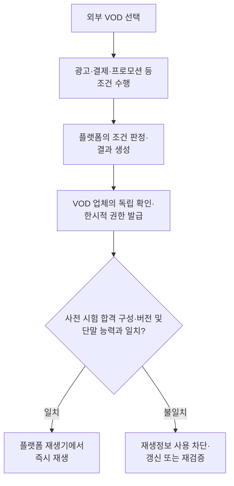

#### 6) 광고 시청 후 영화 재생 예

다음은 이해를 돕기 위한 기준 실시예이다.

1. 사용자가 플랫폼 추천 화면에서 외부 VOD 업체의 영화를 선택한다.
2. 해당 영화에는 “플랫폼이 지정한 광고 2개를 모두 완료하면 재생 가능”이라는 조건과, 광고 완료 시 업체에 제공할 결과 형식이 연결되어 있다.
3. 플랫폼은 지정된 각 광고 재생 슬롯에 고유한 `adPlaybackId`를 부여한다. 단말이 그 식별자와 완료 이벤트를 보내면 플랫폼은 같은 식별자의 재전송을 한 번만 세어 완료 광고 개수가 등록된 요구 개수 이상인지 최종 판정한다.
4. 플랫폼이 광고·캠페인 식별정보와 적용 결과 프로파일 버전을 포함하는 조건 결과를 업체에 보낸다.
5. 업체는 결과 형식이 맞는지 확인하고, 자기 시스템에서 지역·제공기간·계약·동시재생 제한을 판단한다.
6. 업체가 요청을 수락하면 짧은 유효기간의 재생권한과 세션별 임시 재생정보를 발급한다.
7. 플랫폼은 업체가 반환한 DASH 스트리밍·PlayReady 저작권 보호·HEVC 영상 압축 방식과 프로필 버전이 해당 영화의 사전 시험 합격 목록에 있고 단말에서도 실행 가능한지 확인한다.
8. 모두 일치하면 재생정보를 단말에 전달하고, 하나라도 다르면 전달과 사용을 차단하여 등록 정보 갱신 또는 재검증을 요청한다.

위 광고, 비율, 재생 방식 및 유효기간은 설명을 위한 예시이다. 사용자 결제, 플랫폼 부담 프로모션 또는 업체 부담 무료 프로모션에도 같은 처리 관계를 적용할 수 있다.

### 나. 누가 무엇을 판단하는가

| 주체 | 판단하거나 처리하는 일 | 대신 판단하지 않는 일 |
|---|---|---|
| **플랫폼** | 조건 수행 기록을 콘텐츠별 기준에 적용하여 조건 충족을 최종 판정하고, 조건 결과를 생성하며, 업체 응답의 재생구성·버전·단말 호환성을 확인 | 업체의 지역·기간·계약·동시재생 등 고유 콘텐츠 권리 |
| **외부 VOD 업체** | 조건 결과의 형식과 버전을 확인하고, 업체 고유 권한정책을 적용하여 수락·거절하며, 수락 시 한시적 권한을 발급 | 플랫폼이 정한 광고·결제·프로모션 조건의 최종 판정 |
| **사용자 단말** | 단말 능력과 조건 수행 기록을 보고하고, 검증을 통과한 세션별 임시 재생정보로 콘텐츠를 재생 | 업체 권한정책 판단 또는 검증되지 않은 재생 방식 선택 |
| **조건 실행 시스템** | 광고 재생, 결제 승인, 프로모션 적용 등의 실제 수행 기록 생성 | 콘텐츠별 조건 충족의 최종 판정과 VOD 권한 발급 |

핵심은 플랫폼의 판정을 업체가 무조건 신뢰하는 것도 아니고, 플랫폼이 업체 권한정책까지 대신 결정하는 것도 아니라는 점이다. 두 판단은 하나의 거래 안에서 순서대로 수행된다.

### 다. 발명의 필수 요소

| 순서 | 필수 요소 | 의미 |
|---|---|---|
| 1 | 조건과 결과의 콘텐츠별 연결 | 무엇을 충족해야 하는지뿐 아니라, 충족 시 업체에 어떤 형식의 결과를 제공할지도 함께 정한다. |
| 2 | 플랫폼의 조건 최종 판정 | 단말이나 외부 시스템은 실제 수행 기록을 보내고, 플랫폼이 콘텐츠별 기준을 적용한다. |
| 3 | 업체의 독립 확인과 권한 판단 | 업체가 결과 형식·버전과 자기 콘텐츠 권한정책을 확인한다. |
| 4 | 수락 상태와 한시적 권한의 연결 | 업체가 수락·거절을 권한 거래에 기록하고, 수락한 경우에만 한시적 권한을 발급한다. |
| 5 | 실제 시험 합격 재생구성의 저장 | 콘텐츠 등록 때 실제 시험에 성공한 정적 재생 방식과 프로필·버전을 저장한다. |
| 6 | 실행 응답의 재검증 | 실행 시 업체 응답의 구성·버전과 단말 능력을 사전 합격 목록에 다시 대조한다. |
| 7 | 불일치 시 사용 차단 | 불일치하면 세션별 임시 재생정보를 전달·취득·사용하지 못하게 하고 업데이트 또는 재검증 상태로 전환한다. |

정산이 필요한 조건에서는 업체가 수락할 때 초기 정산 처리 상태를 같은 거래에 연결할 수 있다. 정산이 없는 조건에서는 `NO_SETTLEMENT`와 같은 상태를 연결할 수 있다. 다만 외부 정산 원장이나 정산 계산 자체가 발명의 첫 번째 설명을 지배하는 핵심은 아니다.

### 라. 관련 기술과 본 발명의 차이

종래에도 조건 충족 후 토큰 또는 DRM 라이선스를 발급하는 기술, 광고·결제와 콘텐츠 접근을 연결하는 기술, 단말에 맞는 재생 방식을 선택하는 기술, 등록 단계에서 콘텐츠를 시험하는 기술은 각각 존재할 수 있다. 따라서 이들 요소 하나만으로 차별성을 설명하기는 어렵다.

본 발명에서 중점적으로 검토할 결합 관계는 다음과 같다.

> 콘텐츠별 조건과 업체에 보낼 결과 형식을 버전으로 연결하고, 플랫폼의 판정 결과를 업체가 독립적으로 확인하여 권한을 발급하며, 실행 응답을 콘텐츠별 실제 시험 합격 재생 방식 및 그 버전과 다시 대조하여 불일치 시 사용을 차단하는 전체 흐름

이 결합 관계와 유사 문헌의 구체적인 비교는 제3장 다항에서 설명한다. 제1장에서는 개별 요소보다 두 기술 축의 결합이 발명의 중심이라는 점만 먼저 이해하면 된다.

### 마. 기대 효과

1. 사용자가 업체 앱을 설치하거나 업체 계정으로 직접 로그인하는 별도 흐름을 줄이고 플랫폼 경험 안에서 재생권한을 취득할 수 있다.
2. 플랫폼의 조건 판정과 업체의 콘텐츠 권한 판단을 분리하여 책임 경계를 명확히 할 수 있다.
3. 업체는 최종 권한 판단권을 유지하면서 플랫폼의 광고·결제·프로모션 결과를 이용할 수 있다.
4. 조건 결과, 업체 수락, 권한 및 실제 재생 결과를 같은 거래로 추적할 수 있다.
5. 등록 때 실제 시험한 재생 방식과 실행 응답이 다르면 재생을 차단하여 비호환·오등록 위험을 줄일 수 있다.
6. 정적 재생 방식과 세션별 URL·토큰을 분리하여 정상적인 동적 정보 변경은 허용하면서 중요한 구성 변경은 통제할 수 있다.

<!-- page-break:page-3 -->

## 2. 발명(고안)의 구체적 설명

### 가. 먼저 알아둘 쉬운 용어

| 문서 용어 | 쉬운 표현 | 설명 |
|---|---|---|
| 조건 프로파일 | 재생 전 조건 | 지정 광고 완료 개수, 결제 승인, 프로모션 적용처럼 무엇을 만족해야 하는지와 판정 기준 |
| 조건 실행 원천 결과 | 실제 수행 기록 | 단말·광고·결제·프로모션 시스템이 생성한 원래 기록 |
| 조건 결과 프로파일 | 업체에 보낼 결과의 설계도 | 조건 충족 시 만들 결과의 유형·형식·업체 확인 규칙·버전 |
| 조건 결과 데이터 | 플랫폼이 만든 판정 결과 | 플랫폼이 원천 기록을 기준에 적용한 뒤 업체에 제공하는 구조화된 결과 |
| 검증된 재생구성집합 | 사전 재생 시험 합격 목록 | 실제 시험에 성공한 프로토콜·DRM·코덱·보안 수준 조합과 버전 |
| 재생 프로필 | 업체의 재생 방식 규격 | 업체가 지원하는 정적 재생 방식의 범위와 그 변경 버전 |
| 정적 재생구성 | 재생 방식 조합 | DASH/HLS 스트리밍 방식, DRM(디지털 권리관리) 체계, 영상·음성 코덱, 보안 수준 등 등록·검증 대상 |
| 동적 재생정보 | 세션별 임시 재생정보 | 짧은 수명의 매니페스트 URL, 접근 토큰, 권한 ID, DRM 라이선스 요청정보 |
| 권한 거래 | 한 번의 권한 요청 처리 | 조건 결과, 업체 수락·거절, 한시적 권한, 실행 검증 및 재생 결과를 연결하는 단위 |

정적 재생구성은 등록 때 실제 시험하고 실행 때 다시 대조한다. 반면 동적 재생정보는 요청마다 바뀌는 것이 정상이며, 등록 때의 URL이나 토큰과 같아야 하는 것은 아니다.

### 나. 기준 실시예의 전체 흐름

기준 실시예는 플랫폼이 단말에 맞는 검증 재생구성 하나를 지정하고, 조건 결과 데이터의 내용을 권한 요청에 포함하며, 업체가 플랫폼에 권한과 동적 재생정보를 반환하는 방식이다. 이하 본문의 축약 JSONC와 단계 설명은 특별한 표시가 없는 한 이 기준 실시예를 나타낸다.

아래 구조도 A~C에서 노드와 화살표에 표시된 숫자는 기준 실시예의 주된 처리 순서를 나타낸다. 각 구조도의 순서는 `1`부터 독립적으로 시작하며 본문의 단계 번호와 일대일로 대응하는 참조 번호가 아니다. `A`·`B` 등의 영문자는 같은 순번에 필요한 복수 입력, 저장 경로 또는 결과 분기를 구분한다. 이 구조도들은 쉬운 이해를 위한 기능 흐름도이며 제4장의 정식 도면을 대체하지 않는다.

#### 1) 등록·검증 단계

1. 업체가 권한 서비스와 지원 가능한 정적 재생 프로필 및 버전을 등록한다.
2. 콘텐츠별로 업체 콘텐츠 ID, 재생 자산 ID, 재생 전 조건과 조건 결과 프로파일을 연결한다.
3. 플랫폼이 후보 구성별로 검증용 권한을 받아 매니페스트 접근, DRM 라이선스 취득 또는 재생 개시를 실제 시험한다.
4. 성공한 구성만 콘텐츠·자산·등록 버전·프로필 버전과 연결하여 검증 결과로 저장한다.
5. 유효한 검증 결과가 있는 콘텐츠만 즉시 재생 추천 대상으로 활성화한다.

##### 구조도 A. 등록·검증 및 추천 활성화

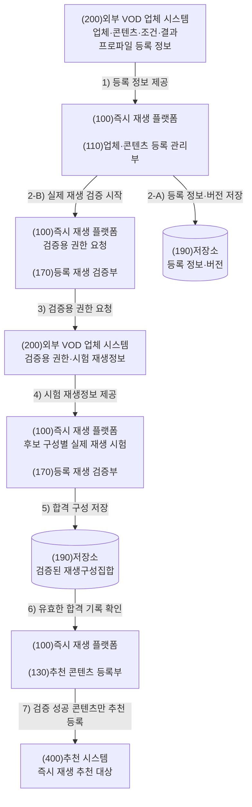

등록 단계에서는 업체가 제공한 지원 정보와 플랫폼이 실제 시험을 거쳐 만든 합격 목록을 구분한다. 도식의 두 저장 노드는 저장소(190) 안에서 구분되는 등록 정보 영역과 검증 결과 영역을 나타낸다. 기준 실시예에서는 유효한 합격 기록이 있는 콘텐츠만 즉시 재생 추천 대상으로 활성화한다.

#### 2) 사용자 재생 단계

1. 사용자가 콘텐츠를 선택하고 필요한 광고·결제·프로모션 조건을 수행한다.
2. 플랫폼이 실제 수행 기록에 콘텐츠별 기준을 적용하여 충족 여부를 최종 판정한다.
3. 충족되면 플랫폼이 조건 결과 프로파일에 맞는 결과를 생성하고, 단말과 호환되는 검증 구성 하나를 지정하여 업체에 권한을 요청한다.
4. 업체가 결과 형식·버전과 업체 고유 권한정책을 확인하고 수락 또는 거절한다.
5. 업체가 수락한 경우에만 한시적 권한, 실행 구성·프로필 버전 및 동적 재생정보를 반환한다.
6. 플랫폼이 응답 식별자, 실행 구성, 프로필 버전 및 단말 호환성을 대조한다.
7. 모두 일치하면 재생정보를 단말에 전달하고, 불일치하면 사용을 차단하여 업데이트 또는 재검증 상태로 전환한다.

##### 구조도 B. 조건 판정 및 업체 권한 발급

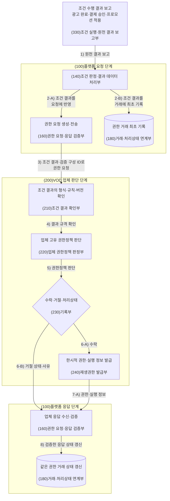

2-A는 생성한 조건 결과를 업체 권한 요청에 사용하는 경로이고, 2-B는 같은 결과를 추적용 권한 거래에 기록하는 경로이다. 실행 단계의 앞부분에서는 플랫폼이 재생 전 조건을 판정하고, 업체가 조건 결과의 형식·버전과 자기 콘텐츠 권한정책을 독립적으로 확인한다. 업체가 거절하면 거절 상태와 사유만 플랫폼에 돌려주고, 수락한 경우에만 한시적 권한과 실행 정보를 발급한다. 플랫폼은 어느 응답이든 검증한 뒤 8단계에서 그 상태를 권한 거래에 갱신한다. 거래·처리상태 연계부(180)는 ‘최초 기록’과 ‘응답 후 갱신’으로 나누어 표시되며, 두 노드는 같은 권한 거래를 처리하는 동일 구성부이다. 이 구조도는 플랫폼이 검증된 실행 구성을 지정하는 기준 실시예를 나타낸다.

업체가 요청을 수락하여 권한과 재생정보를 반환하더라도 곧바로 단말에 전달되는 것은 아니다. 업체 응답은 다음 실행 검증 단계의 입력이 된다.

##### 구조도 C. 실행 재생구성 검증 및 단말 재생

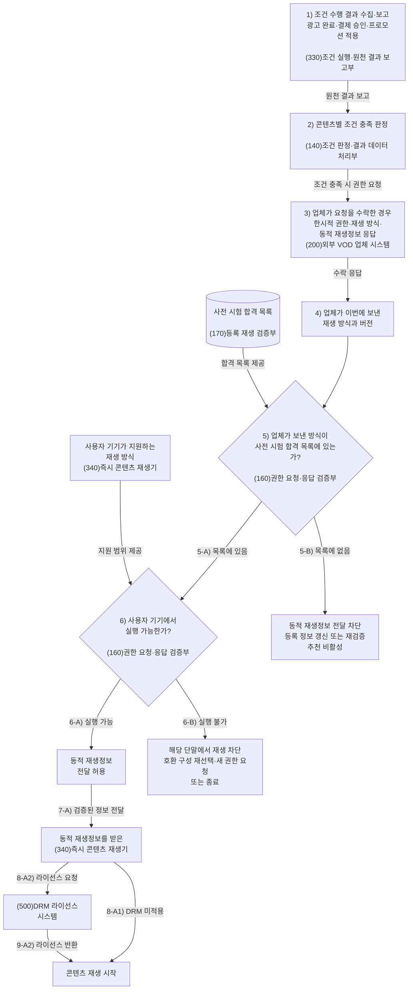

이 구조도는 조건 수행부터 단말 재생까지의 연결을 한 흐름으로 보여 준다. 조건 실행·원천 결과 보고부(330)는 광고 완료·결제 승인·프로모션 적용과 같은 실제 수행 기록을 모아 보고할 뿐, 조건 충족 여부를 판단하지 않는다. 조건 판정·결과 데이터 처리부(140)가 콘텐츠별 기준으로 충족 여부를 판정하고, 업체가 요청을 수락한 경우에만 권한과 이번 세션의 동적 재생정보가 돌아온다.

이후 권한 요청·응답 검증부(160)는 두 번 확인한다. 먼저 업체가 보낸 재생 방식과 버전이 등록 재생 검증부(170)의 사전 시험 합격 목록에 있는지 확인한다. 목록에 없으면 동적 재생정보를 차단하고 등록 정보 갱신 또는 재검증 상태로 전환한다. 목록에 있으면 같은 방식이 사용자 기기 재생기(340)에서도 실행 가능한지 확인한다. 특정 단말에서 실행할 수 없는 경우에는 해당 세션만 차단하고, 가능한 경우 호환되는 다른 검증 구성을 선택하거나 재생을 종료할 수 있다.

두 확인을 모두 통과하면 동적 재생정보를 즉시 콘텐츠 재생기(340)에 전달한다. DRM이 적용된 콘텐츠에서는 재생기(340)가 DRM 라이선스 시스템(500)에 라이선스를 요청하고, 라이선스를 받은 뒤 콘텐츠를 재생한다. 업체가 거절한 요청은 구조도 B에서 종료되므로 구조도 C의 재생 검증 단계로 넘어오지 않는다. 프로모션 조건처럼 플랫폼 서버에서 직접 확인되는 결과는 330을 거치지 않을 수 있다. 또한 동적 재생정보는 요청마다 달라질 수 있으므로 사전 시험 당시 값과 같은지를 비교하는 대상이 아니다.

이로써 조건 결과에 근거한 업체 권한 발급과 사전 시험 결과에 근거한 실행 허용 판단이 하나의 재생 흐름으로 연결된다. 이하에서는 같은 관계를 축약 데이터와 전체 데이터 형식으로 설명한다.

### 다. 등록과 검증의 축약 데이터 예시

다음 JSONC는 아이디어의 핵심 연결관계만 보여 주는 축약 예시이다. 실제 전체 필드와 중첩 구조는 제4장 다항을 참조한다.

```jsonc
{
  "platformContentId": "platform-title-7788", // 플랫폼 내부에서 콘텐츠를 구분하는 식별자
  "providerContentId": "movie-12345", // 외부 VOD 업체 내부에서 콘텐츠를 구분하는 식별자
  "conditionProfile": { // 콘텐츠 재생 전에 충족해야 할 조건을 정의한 축약 객체
    "conditionProfileId": "condition-ad-view-01", // 적용한 재생 전 조건 프로파일의 식별자
    "conditionType": "AD_VIEW", // 광고 시청·결제·프로모션 등 재생 전 조건의 종류
    "conditionProfileVersion": 4, // 적용한 조건 판정 규칙의 변경 버전
    "requiredCompletedAdCount": 2 // 사용자가 완료해야 하는 지정 광고의 정확한 개수
  },
  "conditionResultProfile": { // 조건 충족 시 생성하여 업체에 보낼 결과 형식의 정의
    "resultType": "AD_COMPLETION_RESULT", // 조건 충족으로 생성되는 결과 데이터의 종류
    "resultSchemaVersion": "ad-completion-result/1.0", // 조건 결과 데이터의 구조와 필드를 식별하는 형식 버전
    "providerValidationRuleRef": "provider-ad-completion-rule-v2", // 업체가 조건 결과를 검증할 때 적용할 규칙과 버전의 참조값
    "resultProfileVersion": 2 // 조건 결과 프로파일이 변경될 때 증가하는 버전
  },
  "verifiedPlayback": { // 사전 재생 시험에 합격한 구성을 가리키는 축약 객체
    "playbackResourceId": "asset-5f91a2", // 매니페스트와 미디어 조각이 속한 실제 재생 자산 식별자
    "playbackProfileId": "example-vod-profile-01", // 업체가 등록한 정적 재생 방식 규격의 식별자
    "profileVersion": 4, // 정적 재생 프로필이 변경될 때 증가하는 버전
    "verifiedConfigurationId": "verified-config-dash-pr-h265-v4" // 실제 재생 시험을 통과한 정적 재생구성의 식별자
  }
}
```

이 예시는 한 콘텐츠에 재생 전 조건, 업체가 확인할 결과 형식, 실제 시험을 통과한 재생 방식이 함께 연결되어 있음을 나타낸다. 조건의 존재만 등록하는 것이 아니라 결과의 의미와 확인 규칙을 버전화하고, 업체 지원목록을 그대로 복사하는 대신 플랫폼의 실제 시험 결과를 콘텐츠·재생 자산에 연결하는 것이 중요하다.

### 라. 실행 권한 요청과 응답의 축약 데이터 예시

다음 두 JSONC도 개념 설명용 축약본이다. 전체 요청·수락 응답·거절 응답 형식은 제4장 다항을 참조한다.

```jsonc
{
  "grantTransactionId": "grant-tx-01J7...", // 조건 결과·권한 요청·응답·재생 결과를 한 건으로 연결하는 거래 식별자
  "providerContentId": "movie-12345", // 외부 VOD 업체 내부에서 콘텐츠를 구분하는 식별자
  "playbackSessionId": "playback-session-01J7...", // 한 번의 사용자 재생 시도를 구분하는 세션 식별자
  "conditionResultData": { // 플랫폼이 생성하여 업체에 제공하는 조건 판정 결과 데이터
    "conditionResultId": "condition-result-ad-01J7...", // 플랫폼이 생성한 조건 결과 데이터의 식별자
    "conditionProfileId": "condition-ad-view-01", // 적용한 재생 전 조건 프로파일의 식별자
    "conditionProfileVersion": 4, // 적용한 조건 판정 규칙의 변경 버전
    "platformDecision": "satisfied", // 업체가 확인할 수 있도록 전달하는 플랫폼의 조건 판정값
    "resultType": "AD_COMPLETION_RESULT", // 조건 충족으로 생성되는 결과 데이터의 종류
    "resultSchemaVersion": "ad-completion-result/1.0", // 조건 결과 데이터의 구조와 필드를 식별하는 형식 버전
    "resultProfileVersion": 2, // 조건 결과 프로파일이 변경될 때 증가하는 버전
    "completedAdCount": 2 // 중복을 제거한 뒤 완료로 인정된 지정 광고 개수
  },
  "requestedVerifiedPlaybackConfigurationId": "verified-config-dash-pr-h265-v4" // 플랫폼이 이번 실행에 사용하도록 지정한 사전 검증 구성 식별자
}
```

```jsonc
{
  "grantTransactionId": "grant-tx-01J7...", // 조건 결과·권한 요청·응답·재생 결과를 한 건으로 연결하는 거래 식별자
  "providerContentId": "movie-12345", // 외부 VOD 업체 내부에서 콘텐츠를 구분하는 식별자
  "playbackSessionId": "playback-session-01J7...", // 한 번의 사용자 재생 시도를 구분하는 세션 식별자
  "conditionResultId": "condition-result-ad-01J7...", // 플랫폼이 생성한 조건 결과 데이터의 식별자
  "conditionResultDisposition": { // 업체가 조건 결과를 검증한 뒤 내린 수락 또는 거절 판단
    "status": "ACCEPTED" // 업체가 조건 결과를 수락했는지 또는 거절했는지 나타내는 상태
  },
  "grant": { // 업체가 최종 권한 판단 후 발급한 한시적 재생권한
    "grantId": "provider-grant-01J7...", // 업체가 발급한 한시적 재생권한의 식별자
    "expiresAt": "2026-07-19T01:03:35Z" // 업체가 발급한 한시적 재생권한이 만료되는 시각
  },
  "executionPlaybackConfiguration": { // 이번 권한 응답에서 실제 실행하도록 지정한 정적 재생구성
    "verifiedConfigurationId": "verified-config-dash-pr-h265-v4", // 실제 재생 시험을 통과한 정적 재생구성의 식별자
    "playbackProfileId": "example-vod-profile-01", // 업체가 등록한 정적 재생 방식 규격의 식별자
    "profileVersion": 4 // 정적 재생 프로필이 변경될 때 증가하는 버전
  },
  "dynamicPlaybackInformation": { // 세션마다 새로 발급되는 단기 URL·토큰·DRM 요청정보
    "manifestUrl": "https://stream.example.com/session/manifest.mpd", // 해당 재생 세션에서 사용할 스트리밍 매니페스트의 단기 주소
    "playbackAccessToken": "SHORT_LIVED_TOKEN", // 해당 재생 세션에서 콘텐츠 접근에 사용하는 단기 토큰
    "expiresAt": "2026-07-19T01:03:35Z" // 세션별 URL·토큰·DRM 요청정보가 만료되는 시각
  }
}
```

플랫폼이 확인할 핵심은 다음과 같다.

- 응답이 원래 권한 거래·콘텐츠·재생 세션에 대한 것인지
- 업체가 어떤 조건 결과를 수락했는지
- 업체가 유효기간이 있는 재생권한을 발급했는지
- 실행 구성과 프로필 버전이 사전 시험 합격 기록과 같은지
- 실행 구성이 단말에서 재생 가능한지

### 마. 외부 VOD 업체 연동 범위와 협력 전제

외부 VOD 업체는 단순히 콘텐츠 URL을 제공하는 주체가 아니라 자기 콘텐츠에 대한 최종 권한 판단 주체이다. 따라서 플랫폼이 임의로 업체 권한을 만들 수 없으며, 업체가 조건 결과를 확인하고 한시적 권한을 발급할 수 있는 연동이 필요하다.

아래 인터페이스는 논리적 기능 구분이다. 각각을 별도 신규 API(시스템 간 요청·응답 규격)로 만들 필요는 없고, 하나의 연동 주소, 업체 관리 화면, 일괄 등록, 변경 알림 또는 기존 권한·DRM 연동 규격의 조합으로 구현할 수 있다.

#### 1) 논리 인터페이스

| 인터페이스 | 핵심 입력·처리 | 결과 |
|---|---|---|
| **업체 등록** | 업체 ID, 권한 서비스, 서비스 인증 프로필, 요청·응답 스키마, 지원 재생 프로필·버전 | 플랫폼이 업체 단위 연동 규격과 지원 범위를 식별 |
| **콘텐츠 등록** | 업체·플랫폼 콘텐츠 ID, 재생 자산 ID, 조건·결과 프로파일, 업체 확인 규칙, 권한정책 참조, 재생 프로필 | 콘텐츠별 조건·결과·권한 서비스·재생 방식의 관계 형성 |
| **등록 검증** | 대상 콘텐츠, 후보 구성, 시험 단말 능력, 검증 목적의 권한 요청 | 업체가 시험용 권한·동적 정보를 제공하고 플랫폼이 실제 시험 결과를 생성 |
| **실행 권한** | 거래·콘텐츠·세션 ID, 조건 결과, 지정 검증 구성, 단말 능력, 적용 버전, 필요한 최소 권한문맥 | 업체의 수락·거절, 한시적 권한, 실행 구성·버전, 동적 재생정보 또는 거절사유 |

#### 2) 책임 경계

| 주체 | 책임 |
|---|---|
| 플랫폼 | 조건 최종 판정, 조건 결과 생성, 권한 요청, 업체 응답의 식별자·구성·버전·단말 호환성 검증, 성공 시 중계·실패 시 차단 |
| 외부 VOD 업체 | 결과 확인 규칙 적용, 고유 권한정책 판단, 수락·거절과 상태 기록, 한시적 권한·동적 재생정보 발급, 검증용 접근 제공 |
| 플랫폼·업체 공동 | ID 매핑, 스키마·버전, 서비스 간 인증, 무결성·재전송·오류 처리 규약 합의 |

#### 3) 협력 수준

| 협력 수준 | 필요한 기능 |
|---|---|
| **필수 연동 전제** | 서비스 간 인증, 콘텐츠·자산 ID 매핑, 결과 확인 규칙·버전, 재생 프로필·버전, 검증용 권한, 실행 권한 요청·응답, 수락·거절 상태, 한시적 권한과 동적 재생정보 |
| **운영 권장** | 등록·프로필 변경 통지, 오류코드, 거래 ID 기반 멱등 처리, 재생 성공·실패 콜백, 권한 취소·갱신 |
| **확장 대안** | 조건 결과 참조조회, 플랫폼 검증 승인 후 단말의 업체 직접 취득, 비동기 후속 정산상태, 단기 프록시 참조 |

“업체 앱 설치나 업체 계정 직접 로그인이 없다”는 것은 익명 접근을 뜻하지 않는다. 플랫폼과 업체는 상호 인증된 서비스 자격정보를 사용한다. 업체가 계약 또는 법령상 필요로 하는 경우 업체 범위의 가명 주체 ID, 지역, 동시재생 문맥 또는 단말 보안 수준을 권한 판단에 필요한 최소 범위로 교환할 수 있다. 플랫폼이 업체 사용자의 장기 비밀번호나 DRM 콘텐츠 키를 보관할 필요는 없다.

### 바. 기준 흐름을 유지하기 위한 구현 세부사항

#### 1) 버전과 검증 결과의 유효범위

업체 등록 버전, 콘텐츠 등록 버전, 조건·결과 프로파일 버전 및 재생 프로필 버전을 각각 기록한다. 이들 중 검증 결과에 영향을 주는 값이 바뀌면 과거의 시험 합격 목록을 자동으로 현재 실행의 근거로 사용하지 않는다. 영향 콘텐츠를 등록 정보 갱신 필요 또는 재검증 필요 상태로 전환한다.

콘텐츠 등록 정보의 지역·기간은 추천과 사전 필터에 사용할 수 있지만 업체의 실행 시점 최종 권한 판단을 대체하지 않는다. 업체는 자기 최신 권한정책에 따라 지역·기간·계약·동시재생 가능 여부를 다시 판단한다.

#### 2) 실제 시험 기록의 단위

검증 결과는 업체, 콘텐츠, 재생 자산, 콘텐츠 등록 버전, 재생 프로필 ID·버전별로 생성한다. 시험시각, 유효기간 및 실제 통과한 정적 재생구성을 함께 기록한다. 콘텐츠가 복수 프로필을 사용하면 프로필별 결과를 구분하고, 유효한 결과가 하나 이상 있는 경우에만 즉시 재생 추천 상태를 부여한다.

#### 3) 실제 수행 기록부터 권한까지의 추적 사슬

실제 수행 기록 ID → 플랫폼 판정 ID → 조건 결과 ID → 권한 거래 ID → 업체 권한 ID → 재생 세션 결과를 순서대로 연결한다. 원천 기록과 플랫폼 판정을 별도로 남기므로 업체가 확인한 결과가 어떤 수행 기록과 판정에서 만들어졌는지 추적할 수 있다.

#### 4) 실행 허용 게이트

플랫폼은 업체 응답을 받으면 거래·업체·콘텐츠·재생 자산·세션 ID, 콘텐츠·프로필 버전, 실행 구성의 합격 목록 포함 여부 및 단말 호환성을 하나의 실행 허용 게이트에서 확인한다. 모든 조건을 통과하기 전에는 동적 재생정보의 전달·취득·사용을 허용하지 않는다.

#### 5) 재시도와 처리상태

같은 권한 요청을 재전송할 때에는 동일한 거래 ID를 사용하여 중복 권한과 중복 처리상태가 생기지 않도록 할 수 있다. 업체의 수락·거절과 권한 상태는 거래에 연결한다. 정산 대상 조건이면 초기 정산 상태를, 정산이 필요하지 않은 조건이면 정산 없음 상태를 선택적으로 연결하며, 상세 정산 계산과 외부 정산원장은 별도 시스템으로 구현할 수 있다.

### 사. 기준 실시예와 대안 실시예

기준 실시예는 아이디어를 가장 구체적으로 설명하기 위한 대표 설계이며 상용 구현 완료를 뜻하지 않는다. 대안 실시예도 아래의 공통 관계를 유지해야 한다.

- 플랫폼이 조건 충족을 최종 판정한다.
- 업체가 결과와 자기 권한정책을 독립적으로 확인한다.
- 업체가 수락한 경우에만 한시적 권한을 발급한다.
- 실행 구성·프로필 버전이 사전 검증 결과와 맞아야 한다.
- 불일치하면 동적 재생정보의 전달·취득·사용을 차단한다.

| 구분 | 기준 실시예 | 대안 실시예 |
|---|---|---|
| 실행 구성 선택 | 플랫폼이 검증집합과 단말 능력의 공통범위에서 하나를 지정 | 플랫폼이 호환 후보만 보내고 업체가 그중 하나를 선택 |
| 조건 결과 제공 | 결과 전체를 권한 요청에 포함 | 결과 ID·무결성값·만료시각을 보내고 업체가 인증된 인터페이스에서 조회 |
| 동적 정보 전달 | 업체 → 플랫폼 → 단말 | 업체가 구성·버전과 일회용 참조를 플랫폼에 먼저 보내고, 검증 승인 후 단말이 업체에서 직접 취득하거나 프록시 참조를 사용 |
| 후속 처리상태 | 업체가 수락과 필요한 초기 상태를 응답에 포함 | 수락과 초기 상태는 권한 발급 전에 기록하고 정산 등이 필요한 경우 상세 후속 상태만 비동기 통지 |
| 등록 시험 | 해당 콘텐츠 자산으로 실제 시험 | 대표 자산으로 프로필 단위 시험 후, 대상 콘텐츠별 권한과 매니페스트 또는 미디어 구간 접근을 별도 확인 |

업체 직접 취득 대안에서 업체는 실행 구성·프로필·버전과 일회용 취득참조를 먼저 플랫폼에 보낸다. 플랫폼이 이를 검증하여 거래·세션에 결합된 실행승인을 발급한 뒤에만 업체가 단말의 취득을 허용하므로 플랫폼의 검증 게이트를 우회하지 않는다.

대표 자산 시험만으로 대상 콘텐츠를 검증 완료 처리하지 않는다. 대상 콘텐츠별로 검증용 권한을 받고 최소한 매니페스트 또는 미디어 구간의 실제 접근을 확인해야 한다.

### 아. 실패 처리·보안·개인정보

| 실패 상황 | 플랫폼 처리 |
|---|---|
| 조건 미충족 | 업체 권한 요청을 생성하지 않고 재생 차단 |
| 업체 결과 거절 또는 권한정책 불통과 | 거절사유를 기록하고 권한·동적 정보 없이 종료 |
| 거래·콘텐츠·세션 ID 불일치 | 응답을 폐기하고 재생정보 사용 차단 |
| 콘텐츠·프로필·결과 버전 불일치 | 콘텐츠를 등록 정보 갱신 필요 상태로 전환 |
| 실행 구성이 시험 합격 목록 밖이거나 단말과 비호환 | 재생정보 사용 차단 및 재검증 필요 상태로 전환 |
| 권한·동적 정보 만료 | 새 권한 거래를 시작하고 만료된 정보를 재사용하지 않음 |

플랫폼과 업체는 등록된 서비스 인증 프로필에 따라 상호 인증된 통신채널을 사용한다. 요청·응답 서명, 처리시각, 일회용 난수 또는 같은 거래 ID의 재시도에 중복 권한을 만들지 않는 처리와 같은 통상적인 무결성·재전송 방지 수단을 사용할 수 있다. 특정 암호 알고리즘 자체는 발명의 핵심으로 한정하지 않는다.

실제 콘텐츠 URL, 접근 토큰 및 DRM 라이선스 요청정보는 권한 유효기간 동안만 실행 영역에 유지할 수 있다. DRM 콘텐츠 키는 추천 카탈로그나 플랫폼의 일반 저장영역에 보관하지 않고 단말의 보호된 DRM 처리영역에서 사용할 수 있다.

### 자. 도면의 구성부와 대응하는 상세 기능

| 도면부호 | 구성부 | 핵심 기능 |
|---|---|---|
| 100 | 즉시 재생 플랫폼 | 등록·조건 판정·업체 권한 요청·실행 검증을 조정 |
| 110 | 업체·콘텐츠 등록관리부 | 업체·콘텐츠·조건·결과·프로필 및 버전 등록 |
| 130 | 추천 콘텐츠 등록부 | 검증이 유효한 콘텐츠만 즉시 재생 추천 대상으로 활성화 |
| 140 | 조건 판정·결과 데이터 처리부 | 실제 수행 기록에 조건 기준을 적용하고 조건 결과 생성 |
| 160 | 권한 요청·응답 검증부 | 업체 권한 요청, 응답 식별자·구성·버전·단말 호환성 확인 |
| 170 | 등록 재생 검증부 | 후보 구성의 실제 접근·DRM·재생 시험과 합격 목록 생성 |
| 180 | 거래·처리상태 연계부 | 조건 결과·업체 수락·권한·재생 결과와 처리상태 연결 |
| 190 | 저장소 | 등록 정보, 검증 결과, 거래 기록 및 상태 이력 분리 저장 |
| 200 | 외부 VOD 업체 시스템 | 결과 확인·권한정책 판단·상태 기록·한시적 권한 발급 |
| 210 | 조건 결과 확인부 | 조건 결과의 형식·규칙·버전 확인 |
| 220 | 업체 권한정책 판정부 | 지역·기간·계약 등 업체 고유 권한정책 적용 |
| 230 | 수락·거절·처리상태 기록부 | 수락·거절 및 필요한 초기 처리상태 기록 |
| 240 | 재생권한 발급부 | 수락한 요청에만 한시적 권한과 동적 재생정보 발급 |
| 300 | 사용자 단말 | 조건 수행 기록·단말 능력 보고 및 검증된 정보로 재생 |
| 330 | 조건 실행·원천 결과 보고부 | 광고·결제·프로모션 등의 실제 수행 결과 수집·보고 |
| 340 | 즉시 콘텐츠 재생기 | 검증을 통과한 동적 재생정보로 콘텐츠 재생 |
| 400 | 추천 시스템 | 검증이 유효한 외부 VOD 콘텐츠를 추천 대상으로 제공 |
| 500 | DRM 라이선스 시스템 | DRM 적용 콘텐츠에서 선택적으로 라이선스 발급 |

<!-- page-break:page-4 -->

## 3. 권리화 아이디어

이 장은 발명의 권리화 후보와 그 중심 기술 관계를 정리한다. 구체적인 청구항 문언과 범위는 정식 선행기술 조사와 실제 연동 구조 확인 후 결정한다.

### 가. 핵심 권리화 후보

#### 1) 플랫폼 중계 방법 또는 시스템

다음 관계의 결합을 중심으로 검토한다.

1. 콘텐츠별 조건 프로파일과 조건 결과 프로파일을 연결하여 저장한다.
2. 플랫폼이 실제 수행 기록에 조건 기준을 적용하여 충족 여부를 최종 판정하고 조건 결과를 생성한다.
3. 업체가 조건 결과와 업체 고유 권한정책을 확인하여 수락한 경우 한시적 권한을 발급한다.
4. 플랫폼이 업체 응답의 실행 구성·프로필 버전과 단말 능력을 실제 시험 합격 목록에 대조한다.
5. 수락상태, 거래·세션 ID, 실행 구성 및 버전이 모두 맞는 경우에만 동적 재생정보를 사용하게 한다.

#### 2) 외부 VOD 업체의 권한 제공 방법 또는 시스템

플랫폼의 조건 결과를 등록된 확인 규칙에 대조하고 업체 고유 권한정책을 별도로 적용하여 수락·거절을 기록한 뒤, 수락된 요청에만 검증된 실행 구성에 대응하는 한시적 권한과 동적 재생정보를 발급하는 관계를 검토한다.

#### 3) 콘텐츠 등록·재생 검증 방법 또는 시스템

업체가 등록한 지원목록만 신뢰하지 않고 검증용 권한으로 실제 접근·DRM·재생 시험을 수행하여 성공 구성을 콘텐츠·자산·프로필·버전에 연결하고, 실행 불일치 또는 프로필 변경 시 검증을 무효화하는 관계를 검토한다.

#### 4) 결합 관계

가장 중요한 권리화 후보는 단순한 “조건 후 토큰 발급”이나 “호환 재생 방식 선택”이 아니라, 다음 두 관계가 동일 거래에서 결합되는 구성이다.

- 콘텐츠별 조건·결과 규칙에 따른 플랫폼 판정과 업체의 독립 확인·권한 발급
- 콘텐츠별 실제 시험 합격 구성·버전과 실행 응답의 대조 및 불일치 차단

### 나. 추가 권리화 후보

1. 업체가 조건 결과 전체 대신 참조값을 수신하고 인증된 조회 인터페이스에서 결과를 확인하는 구성
2. 플랫폼이 실행 구성을 지정하는 구성과 업체가 호환 후보 중 하나를 선택하는 구성을 각각 한정하는 구성
3. 정적 재생 프로필 버전 또는 콘텐츠 등록 버전이 바뀌면 검증을 무효화하고 추천을 중지하는 구성
4. 업체가 실행 구성·프로필·버전과 일회용 참조를 먼저 반환하고 플랫폼 검증 승인 후 단말이 업체에서 직접 취득하는 구성
5. 동적 재생정보 대신 유효기간이 짧은 플랫폼 프록시 참조값을 단말에 전달하는 구성
6. 업체가 수락과 초기 처리상태를 권한 발급 전에 기록하고 상세 정산상태만 비동기로 통지하는 구성
7. 대표 자산으로 프로필 단위 시험을 수행하되 대상 콘텐츠별 권한과 매니페스트 또는 미디어 접근을 별도 확인하는 구성
8. 결과 프로파일이 바뀌면 조건 판정 규칙은 유지하면서 업체 확인 규칙과 처리상태만 갱신하는 구성
9. 업체 거절사유와 플랫폼 판정 기록을 비교하여 결과 프로파일 갱신을 요청하는 구성
10. 콘텐츠 재생 중 추가 조건이 발생하면 다음 구간에 대한 별도 조건 결과와 권한 거래를 생성하는 구성

### 다. 주요 문헌 대조 결과

아래 표는 공개된 등록공보의 명세서와 등록 청구항에서 확인한 결과이다. 발명 기준일이 이 문서에 기입되지 않았으므로 공개시점에 따른 법적 선행성은 판단하지 않고 기술내용만 대조하였다.

| 대조 문헌 | 확인된 공통점 | 확인된 차이 |
|---|---|---|
| [US7711647B2, *Digital rights management in a distributed network*](https://patents.google.com/patent/US7711647B2/en) | **부분 일치.** 사업 처리 후 콘텐츠 제공자가 토큰을 만들고, 별도 CDN 서버가 토큰과 단말 정보를 검증하여 온디맨드 콘텐츠용 DRM 라이선스를 발급한다(청구항 1·3·5~6·8·10·12~13). | 조건의 원천 결과를 콘텐츠별 형식·버전으로 전달하여 업체가 의미를 다시 판단하는 구성은 없다. 실제 콘텐츠 재생시험 합격 구성·버전, 업체 응답과 그 구성의 후단 대조 및 전 과정을 묶는 거래 ID도 확인되지 않았다. |
| [US11805132B2, *Location specific temporary authentication system*](https://patents.google.com/patent/US11805132B2/en) | **부분 일치.** 서버가 기기·장소 또는 거래 조건을 확인하고 중간 사용자계정을 외부 콘텐츠 제공자에게 보내 승인받은 뒤 임시 접근을 제공한다(청구항 1·10·14·17~19·25). | 업체가 승인하는 대상은 콘텐츠별 조건 결과가 아니라 중간 사용자계정이다. 조건 결과 형식·버전, 실제 재생시험 합격 구성, 업체 실행 응답의 재생구성·버전 검증 및 공통 권한 거래 ID는 확인되지 않았다. |
| [US12111891B2](https://patents.google.com/patent/US12111891B2/en) / [EP3491562B1](https://patents.google.com/patent/EP3491562B1/en), *DRM sharing and playback service specification selection* | **재생 검증 부분이 일치.** 단말 지원 재생 방식 중 콘텐츠 제한속성에 맞는 방식을 고르고, 그 선택과 후속 단말 요청을 토큰으로 비교한 뒤 접근을 허용한다(미국 청구항 1·9·12~15, 유럽 청구항 1·8~10). | EPG·선형방송 문헌은 아니다. 그러나 실제 콘텐츠로 시험하여 합격한 구성·버전을 쓰는 것도 아니며, 조건 결과, 외부 VOD 업체의 별도 권한 발급, 업체 응답 재검증 및 공통 권한 거래는 확인되지 않았다. |

따라서 세 문헌은 `토큰 기반 DRM 권한`, `외부 제공자 승인과 임시 접근`, `재생 방식 선택·요청 대조`라는 개별 부분을 각각 보여 준다. 검토한 어느 한 문헌에도 이 부분들이 본 발명과 같이 **버전화된 조건 결과 → 업체의 독립 권한 판단 → 콘텐츠별 실제 재생시험 합격 구성 → 업체 응답 재검증 → 공통 거래 기록**으로 연결된 구조는 확인되지 않았다.

### 라. 확인이 필요한 기술 사항

1. 플랫폼 지정 방식을 주된 실시예로 하고 업체 선택 방식을 어느 범위까지 청구할지
2. 조건 결과 전체 포함 방식과 참조조회 방식을 하나의 상위 개념으로 묶을 수 있는지
3. 수락·거절 상태 기록과 정산 상태를 독립항의 필수 구성으로 둘지 종속항으로 둘지
4. “실제 재생 시험”의 최소 범위를 매니페스트 접근, DRM 라이선스 취득, 미디어 구간 접근 또는 재생 개시 중 어디까지로 정할지
5. 플랫폼 방법, 업체 방법, 등록·검증 방법, 플랫폼 시스템, 업체 시스템 및 기록매체 중 어떤 청구유형을 선택할지
6. 서비스 인증, 멱등 처리, 가명 권한문맥 등 운영 전제 가운데 기술적 차별성과 직접 관련된 범위를 어디까지 포함할지

<!-- page-break:page-5 -->

## 4. 도면 및 전체 데이터 형식

도 1과 도 2는 종래 구조를, 도 3 내지 도 6은 본 발명의 **기준 실시예**를 나타낸다. 대안 실시예는 제2장 사항을 참조한다. 제4장 다항의 전체 JSONC는 본문의 축약 예시를 보완하기 위한 데이터 관계 설명 자료이다.

### 가. 종래기술 도면

#### 도 1. 업체 앱 중심의 VOD 재생

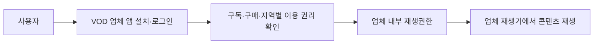

도 1은 사용자 진입, 권한 판단 및 재생이 단일 VOD 업체 앱 및 계정 체계 내에서 수행되는 구조를 나타낸다.

#### 도 2. 조건과 콘텐츠 접근의 일반적 연결

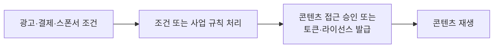

도 2는 조건 처리 후 콘텐츠 접근을 허용하는 일반적인 구조를 나타낸다. 본 발명은 이러한 구조 자체가 아니라, 조건별 결과 규격, 업체의 수락·거절·처리상태·권한 발급, 등록 시 검증된 재생구성과 실행 재생구성 간 일치 제어를 결합한 점에 특징이 있다.

### 나. 본 발명 도면

#### 도 3. 전체 시스템과 역할 경계

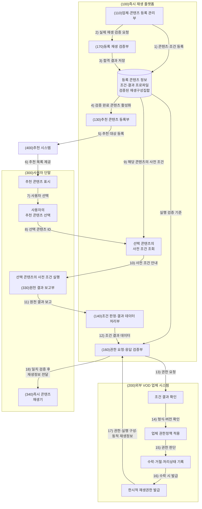

도 3은 등록·검증을 통과한 콘텐츠가 추천 콘텐츠 등록부(130)를 거쳐 추천 시스템(400)에 등록되고, 추천 시스템을 통해 사용자 단말에 추천되는 과정부터 나타낸다. 사용자가 추천된 콘텐츠를 선택하면 플랫폼은 선택 콘텐츠 식별자로 해당 콘텐츠에 등록된 사전 조건을 조회하여 단말에 안내한다. 단말은 그 이후에 해당 조건을 실행하고 원천 결과를 보고한다. 이어서 플랫폼이 조건 충족을 최종 판정하고, 업체가 결과 규칙과 고유 권한정책을 확인해 상태를 기록한 후 권한을 발급하며, 플랫폼이 실행 재생구성을 다시 확인한다.

#### 도 4. 등록 정보·검증 정보·동적 재생정보의 분리

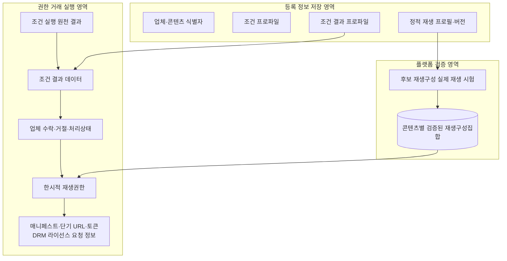

도 4에서 등록 정보 저장 영역은 정적 데이터와 버전을 저장하고, 검증 영역은 실제 재생 시험을 통과한 재생구성을 저장하며, 실행 영역은 권한 거래별로 달라지는 동적 재생정보를 처리한다.

#### 도 5. 조건 결과 확인 후 업체 권한 취득

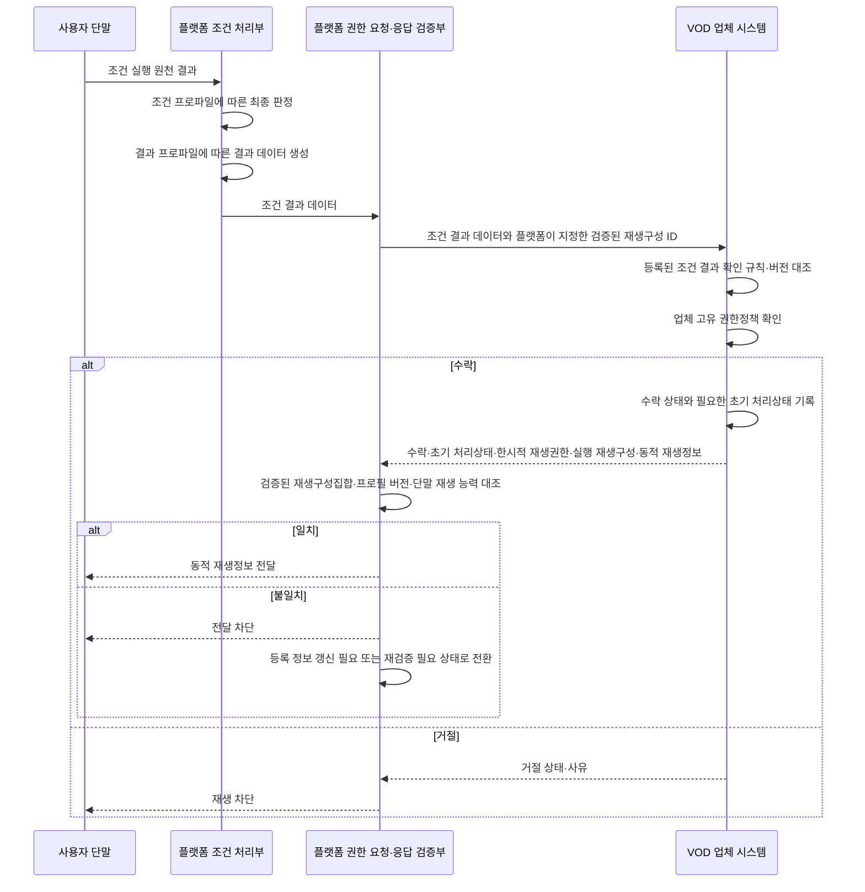

도 5는 조건 결과 생성부터 업체의 결과 확인·상태 기록·권한 발급, 플랫폼의 검증된 재생구성과의 일치 확인까지 이어지는 순서를 나타낸다.

#### 도 6. 등록 검증 및 실행 불일치에 따른 상태 전이

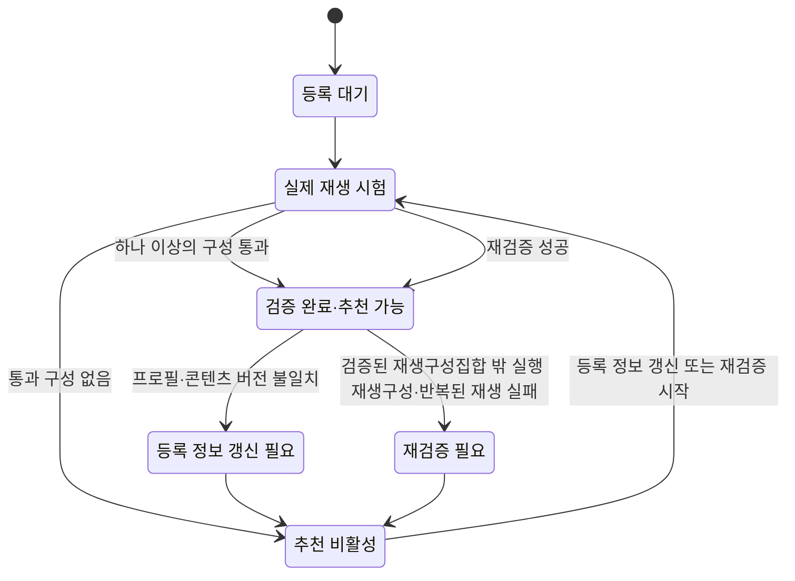

도 6은 등록 시 실제 재생 시험을 통과한 재생구성을 기준으로 추천 가능 상태를 부여하고, 실행 중 불일치가 발생하면 추천을 중지한 후 등록 정보를 갱신하고 재검증하는 상태 전이 과정을 나타낸다.

### 다. 전체 데이터 형식 예시 — 기준 실시예

> 이 항은 기준 실시예의 전체 데이터 관계를 설명하는 참고 부록이다. 이하 JSONC는 필수 API 규격을 확정한 것이 아니라, 데이터가 어떤 식별자와 버전으로 연결되는지를 설명하는 전체 예시이다. `//` 주석은 문서 설명용이므로 실제 전송 시 제거한다. 발명의 공통 기술관계는 제1장과 제2장의 설명을 기준으로 하며, 필드명·중첩 구조·전송 방식·인증 방식은 실제 업체 연동 환경에 따라 달라질 수 있다.

#### 도 7. 주요 식별자와 버전의 연결 관계

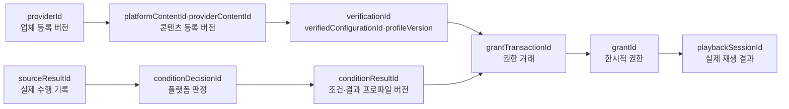

| 연결 정보 | 역할 |
|---|---|
| 업체·콘텐츠·재생 자산 ID | 어떤 업체의 어떤 콘텐츠와 실제 재생 자산에 대한 거래인지 식별 |
| 업체·콘텐츠 등록 버전 | 등록 이후 변경된 정보를 과거 검증 결과와 혼용하지 않도록 구분 |
| 재생 프로필·검증 구성 ID | 실제 시험한 정적 재생 방식과 실행 응답을 연결 |
| 원천 결과→플랫폼 판정→조건 결과 ID | 실제 수행 기록부터 업체 제공 결과까지의 생성 근거를 추적 |
| 권한 거래·재생 세션·권한 ID | 업체 수락·권한 발급·동적 정보·재생 결과를 한 번의 처리로 연결 |

#### 1) 업체 등록 데이터

```jsonc
{
  "providerRegistration": { // 업체 단위의 권한 서비스와 재생 방식을 묶은 등록 객체
    "schemaVersion": "instantplay.provider-registration/2.0", // 현재 요청 또는 응답 메시지의 전체 형식 버전
    "providerId": "com.example.vod", // 재생권한을 판단하고 발급하는 외부 VOD 업체의 식별자
    "providerStatus": "active", // 업체 연동을 현재 사용할 수 있는지 나타내는 상태
    "grantServices": [ // 업체가 플랫폼에 제공하는 재생권한 서비스 목록
      { // 업체가 제공하는 개별 권한 서비스
        "grantServiceId": "example-vod-grant-service", // 이번 콘텐츠에 사용할 업체 권한 서비스의 식별자
        "grantEndpoint": "https://api.example-vod.com/instantplay/grants", // 플랫폼이 재생권한 요청을 보낼 업체 연동 주소
        "authenticationProfileId": "platform-provider-auth-01", // 플랫폼과 업체 사이의 서비스 인증 방식을 가리키는 참조값
        "requestSchemaVersion": "instantplay.grant-request/2.0", // 업체가 수신하도록 합의한 권한 요청 메시지 형식 버전
        "responseSchemaVersion": "instantplay.grant-response/2.0" // 업체가 반환하도록 합의한 권한 응답 메시지 형식 버전
      }
    ],
    "playbackProfiles": [ // 업체가 플랫폼에 등록한 정적 재생 프로필 목록
      { // 업체가 등록한 개별 재생 프로필
        "playbackProfileId": "example-vod-profile-01", // 업체가 등록한 정적 재생 방식 규격의 식별자
        "profileVersion": 4, // 정적 재생 프로필이 변경될 때 증가하는 버전
        "allowedStreamingMethods": [ // 해당 재생 프로필에서 업체가 허용한 스트리밍 방식 목록
          "dash", // 업체가 허용한 개별 스트리밍 방식
          "hls" // 업체가 허용한 개별 스트리밍 방식
        ],
        "allowedDrmSystems": [ // 해당 재생 프로필에서 업체가 허용한 DRM 방식 목록
          "playready" // 업체가 허용한 개별 DRM 방식
        ],
        "allowedVideoCodecs": [ // 해당 재생 프로필에서 업체가 허용한 영상 코덱 목록
          "h264", // 업체가 허용한 개별 영상 코덱
          "hevc" // 업체가 허용한 개별 영상 코덱
        ],
        "allowedAudioCodecs": [ // 해당 재생 프로필에서 업체가 허용한 음성 코덱 목록
          "aac" // 업체가 허용한 개별 음성 코덱
        ],
        "allowedSecurityLevels": [ // 해당 재생 프로필에서 업체가 허용한 단말 보안 수준 목록
          "hardware-secure", // 업체가 허용한 개별 단말 보안 수준
          "software-secure" // 업체가 허용한 개별 단말 보안 수준
        ]
      }
    ],
    "providerRegistrationVersion": 4, // 업체 등록 정보가 변경될 때 증가하는 버전
    "updatedAt": "2026-07-01T00:00:00Z" // 업체 등록 정보가 마지막으로 변경된 시각
  }
}
```

업체 등록은 권한 서비스, 서비스 인증 프로필, 요청·응답 형식 및 업체가 지원하는 정적 재생 프로필을 정의한다. 특정 사용자 세션의 URL·토큰·DRM 콘텐츠 키는 포함하지 않는다.

#### 2) 콘텐츠·조건·결과 등록 데이터

```jsonc
{
  "contentRegistration": { // 콘텐츠별 식별자·조건·권한·재생정보를 묶은 등록 객체
    "schemaVersion": "instantplay.content-registration/2.0", // 현재 요청 또는 응답 메시지의 전체 형식 버전
    "providerId": "com.example.vod", // 재생권한을 판단하고 발급하는 외부 VOD 업체의 식별자
    "providerContentId": "movie-12345", // 외부 VOD 업체 내부에서 콘텐츠를 구분하는 식별자
    "platformContentId": "platform-title-7788", // 플랫폼 내부에서 콘텐츠를 구분하는 식별자
    "recommendationMetadata": { // 추천 화면에서 콘텐츠를 설명하고 표시하는 데 쓰는 정보
      "title": "예시 영화", // 추천 화면에 표시할 콘텐츠 제목
      "synopsis": "추천 화면에 표시되는 줄거리", // 추천 화면에 표시할 콘텐츠 줄거리
      "genres": [ // 추천 화면에 표시할 콘텐츠 장르 목록
        "drama" // 콘텐츠에 부여된 개별 장르
      ],
      "contentRating": "15", // 추천 화면에 표시할 콘텐츠 시청 등급
      "posterImageUrl": "https://metadata.example.com/posters/7788.jpg", // 추천 화면에 표시할 포스터 이미지 주소
      "runningTimeSec": 7200 // 콘텐츠의 전체 재생시간(초)
    },
    "availability": { // 추천 및 사전 필터링에 사용하는 콘텐츠 제공 가능 범위
      "regions": [ // 추천 및 사전 필터링상 콘텐츠를 제공할 수 있는 지역 목록
        "KR" // 콘텐츠를 제공할 수 있는 개별 지역 코드
      ],
      "validFrom": "2026-07-01T00:00:00Z", // 콘텐츠 제공 가능 기간의 시작 시각
      "validUntil": "2026-12-31T14:59:59Z" // 콘텐츠 제공 또는 재생 검증이 유효한 마지막 시각
    },
    "grantBinding": { // 권한 서비스와 실제 재생 자산을 연결하는 정보
      "grantServiceId": "example-vod-grant-service", // 이번 콘텐츠에 사용할 업체 권한 서비스의 식별자
      "playbackResourceId": "asset-5f91a2", // 매니페스트와 미디어 조각이 속한 실제 재생 자산 식별자
      "providerRightsPolicyRef": "provider-rights-policy-kr-v5" // 업체가 실행 시 적용할 콘텐츠 권한정책과 버전의 참조값
    },
    "playbackProfileRefs": [ // 해당 콘텐츠가 사용할 수 있는 재생 프로필의 참조 목록
      { // 콘텐츠가 참조하는 개별 재생 프로필
        "playbackProfileId": "example-vod-profile-01", // 업체가 등록한 정적 재생 방식 규격의 식별자
        "profileVersion": 4 // 정적 재생 프로필이 변경될 때 증가하는 버전
      }
    ],
    "instantPlayPolicy": { // 해당 콘텐츠에 적용되는 즉시 재생 정책
      "enabled": true, // 해당 콘텐츠에 즉시 재생 기능을 적용할지 여부
      "directProviderUserLoginRequired": false, // 즉시 재생 과정에서 업체 계정 직접 로그인이 필요한지 여부
      "defaultConditionProfileId": "condition-ad-view-01" // 별도 선택이 없을 때 적용할 기본 조건 프로파일
    },
    "entitlementConditionProfiles": [ // 이 콘텐츠에서 선택하거나 적용할 수 있는 재생 전 조건 목록
      { // 콘텐츠에 연결된 개별 재생 전 조건
        "conditionProfileId": "condition-ad-view-01", // 적용한 재생 전 조건 프로파일의 식별자
        "conditionProfileVersion": 4, // 적용한 조건 판정 규칙의 변경 버전
        "conditionType": "AD_VIEW", // 광고 시청·결제·프로모션 등 재생 전 조건의 종류
        "conditionParameters": { // 조건 충족 여부를 판정하는 데 필요한 세부 기준
          "adPolicyId": "required-ad-count-policy-v4", // 지정 광고의 선택·개수·집계 규칙을 가리키는 참조값
          "requiredCompletedAdCount": 2, // 사용자가 완료해야 하는 지정 광고의 정확한 개수
          "countingRule": "DISTINCT_COMPLETED_AD_PLAYBACKS" // 완료 광고를 중복 없이 집계하는 규칙
        },
        "decisionRuleRef": "platform-distinct-ad-count-rule-v4", // 플랫폼이 조건 판정에 적용한 규칙과 버전의 참조값
        "grantScope": { // 조건 충족 시 플랫폼이 요청할 수 있는 재생권한의 범위
          "scope": "full-title", // 플랫폼이 요청하는 콘텐츠 이용 범위
          "maximumGrantTtlSec": 180 // 콘텐츠 등록상 허용되는 재생권한의 최대 유효시간(초)
        },
        "conditionResultProfile": { // 조건 충족 시 생성하여 업체에 보낼 결과 형식의 정의
          "resultType": "AD_SETTLEMENT_BASIS", // 조건 충족으로 생성되는 결과 데이터의 종류
          "resultSchemaVersion": "ad-result/2.0", // 조건 결과 데이터의 구조와 필드를 식별하는 형식 버전
          "requiredResultFields": [ // 업체가 조건 결과 검증에 반드시 필요하다고 지정한 필드 목록
            "completedAdCount", // 업체가 확인할 완료 광고 개수 필드명
            "completedAdPlaybackIds", // 업체가 확인할 완료 광고 재생 식별자 목록의 필드명
            "campaignId", // 업체가 확인할 광고 캠페인 식별자 필드명
            "completedAt", // 업체가 확인할 조건 완료시각 필드명
            "settlementRuleRef", // 업체가 확인할 정산 규칙 참조값 필드명
            "providerShareAmount", // 업체 배분금액 필드명
            "platformShareAmount", // 플랫폼 배분금액 필드명
            "currency" // 통화 코드 필드명
          ],
          "providerValidationRuleRef": "provider-ad-result-rule-v2", // 업체가 조건 결과를 검증할 때 적용할 규칙과 버전의 참조값
          "providerActionOnAcceptance": "RECORD_SETTLEMENT_BASIS_AND_GRANT", // 조건 결과를 수락한 뒤 업체가 수행할 후속 처리
          "settlementMode": "REVENUE_SHARE", // 조건 수행 비용 또는 대가를 처리하는 정산 방식
          "settlementRuleRef": "ad-revshare-provider-platform-v3", // 금액 산정과 배분에 적용한 정산 규칙·버전의 참조값
          "resultProfileVersion": 2 // 조건 결과 프로파일이 변경될 때 증가하는 버전
        }
      },
      { // 콘텐츠에 연결된 개별 재생 전 조건
        "conditionProfileId": "condition-provider-free-promo-01", // 적용한 재생 전 조건 프로파일의 식별자
        "conditionProfileVersion": 2, // 적용한 조건 판정 규칙의 변경 버전
        "conditionType": "PROVIDER_FREE_PROMO", // 광고 시청·결제·프로모션 등 재생 전 조건의 종류
        "conditionParameters": { // 조건 충족 여부를 판정하는 데 필요한 세부 기준
          "providerCampaignId": "provider-free-week-01", // 업체가 비용을 부담하는 프로모션 캠페인의 식별자
          "eligibleContentPolicyRef": "provider-free-catalog-v2" // 업체 프로모션 대상 콘텐츠를 정하는 정책의 참조값
        },
        "decisionRuleRef": "provider-campaign-eligibility-rule-v2", // 플랫폼이 조건 판정에 적용한 규칙과 버전의 참조값
        "grantScope": { // 조건 충족 시 플랫폼이 요청할 수 있는 재생권한의 범위
          "scope": "full-title", // 플랫폼이 요청하는 콘텐츠 이용 범위
          "maximumGrantTtlSec": 180 // 콘텐츠 등록상 허용되는 재생권한의 최대 유효시간(초)
        },
        "conditionResultProfile": { // 조건 충족 시 생성하여 업체에 보낼 결과 형식의 정의
          "resultType": "PROVIDER_FREE_ELIGIBILITY", // 조건 충족으로 생성되는 결과 데이터의 종류
          "resultSchemaVersion": "provider-free-result/2.0", // 조건 결과 데이터의 구조와 필드를 식별하는 형식 버전
          "requiredResultFields": [ // 업체가 조건 결과 검증에 반드시 필요하다고 지정한 필드 목록
            "providerCampaignId", // 업체 프로모션 캠페인 식별자 필드명
            "eligibleContentId", // 프로모션 대상 콘텐츠 식별자 필드명
            "eligibilityConfirmedAt", // 프로모션 대상 확인시각 필드명
            "noPlatformContentPayment" // 플랫폼 콘텐츠 대금 없음 여부 필드명
          ],
          "providerValidationRuleRef": "provider-free-result-rule-v2", // 업체가 조건 결과를 검증할 때 적용할 규칙과 버전의 참조값
          "providerActionOnAcceptance": "RECORD_NO_SETTLEMENT_AND_GRANT", // 조건 결과를 수락한 뒤 업체가 수행할 후속 처리
          "settlementMode": "NO_PLATFORM_CONTENT_PAYMENT", // 조건 수행 비용 또는 대가를 처리하는 정산 방식
          "settlementRuleRef": "no-platform-content-payment-v1", // 금액 산정과 배분에 적용한 정산 규칙·버전의 참조값
          "resultProfileVersion": 2 // 조건 결과 프로파일이 변경될 때 증가하는 버전
        }
      },
      { // 콘텐츠에 연결된 개별 재생 전 조건
        "conditionProfileId": "condition-platform-promo-01", // 적용한 재생 전 조건 프로파일의 식별자
        "conditionProfileVersion": 4, // 적용한 조건 판정 규칙의 변경 버전
        "conditionType": "PLATFORM_SPONSORED_PROMO", // 광고 시청·결제·프로모션 등 재생 전 조건의 종류
        "conditionParameters": { // 조건 충족 여부를 판정하는 데 필요한 세부 기준
          "platformCampaignId": "instantplay-launch-promo", // 플랫폼이 비용을 부담하는 프로모션 캠페인의 식별자
          "budgetPolicyRef": "platform-budget-2026q3" // 플랫폼 부담 프로모션의 예산 사용 규칙을 가리키는 참조값
        },
        "decisionRuleRef": "platform-promo-eligibility-rule-v4", // 플랫폼이 조건 판정에 적용한 규칙과 버전의 참조값
        "grantScope": { // 조건 충족 시 플랫폼이 요청할 수 있는 재생권한의 범위
          "scope": "full-title", // 플랫폼이 요청하는 콘텐츠 이용 범위
          "maximumGrantTtlSec": 180 // 콘텐츠 등록상 허용되는 재생권한의 최대 유효시간(초)
        },
        "conditionResultProfile": { // 조건 충족 시 생성하여 업체에 보낼 결과 형식의 정의
          "resultType": "PLATFORM_PAYABLE_BASIS", // 조건 충족으로 생성되는 결과 데이터의 종류
          "resultSchemaVersion": "platform-promo-result/2.0", // 조건 결과 데이터의 구조와 필드를 식별하는 형식 버전
          "requiredResultFields": [ // 업체가 조건 결과 검증에 반드시 필요하다고 지정한 필드 목록
            "platformCampaignId", // 플랫폼 프로모션 캠페인 식별자 필드명
            "budgetReservationId", // 플랫폼 예산 예약 식별자 필드명
            "providerPayableAmount", // 업체 지급 예정금액 필드명
            "currency", // 통화 코드 필드명
            "settlementRuleRef" // 업체가 확인할 정산 규칙 참조값 필드명
          ],
          "providerValidationRuleRef": "provider-platform-promo-rule-v2", // 업체가 조건 결과를 검증할 때 적용할 규칙과 버전의 참조값
          "providerActionOnAcceptance": "RECORD_PLATFORM_PAYABLE_AND_GRANT", // 조건 결과를 수락한 뒤 업체가 수행할 후속 처리
          "settlementMode": "PLATFORM_PAYABLE", // 조건 수행 비용 또는 대가를 처리하는 정산 방식
          "settlementRuleRef": "platform-pays-provider-v4", // 금액 산정과 배분에 적용한 정산 규칙·버전의 참조값
          "resultProfileVersion": 2 // 조건 결과 프로파일이 변경될 때 증가하는 버전
        }
      },
      { // 콘텐츠에 연결된 개별 재생 전 조건
        "conditionProfileId": "condition-user-payment-01", // 적용한 재생 전 조건 프로파일의 식별자
        "conditionProfileVersion": 5, // 적용한 조건 판정 규칙의 변경 버전
        "conditionType": "USER_PAYMENT", // 광고 시청·결제·프로모션 등 재생 전 조건의 종류
        "conditionParameters": { // 조건 충족 여부를 판정하는 데 필요한 세부 기준
          "priceAmount": 700, // 사용자 결제 조건에서 요구하는 결제금액
          "currency": "KRW", // 금액에 적용되는 통화 코드
          "paymentPolicyRef": "content-access-price-v5" // 사용자 결제 조건에 적용할 가격·승인 정책의 참조값
        },
        "decisionRuleRef": "platform-payment-approval-rule-v5", // 플랫폼이 조건 판정에 적용한 규칙과 버전의 참조값
        "grantScope": { // 조건 충족 시 플랫폼이 요청할 수 있는 재생권한의 범위
          "scope": "full-title", // 플랫폼이 요청하는 콘텐츠 이용 범위
          "maximumGrantTtlSec": 180 // 콘텐츠 등록상 허용되는 재생권한의 최대 유효시간(초)
        },
        "conditionResultProfile": { // 조건 충족 시 생성하여 업체에 보낼 결과 형식의 정의
          "resultType": "USER_PAYMENT_SETTLEMENT_BASIS", // 조건 충족으로 생성되는 결과 데이터의 종류
          "resultSchemaVersion": "user-payment-result/2.0", // 조건 결과 데이터의 구조와 필드를 식별하는 형식 버전
          "requiredResultFields": [ // 업체가 조건 결과 검증에 반드시 필요하다고 지정한 필드 목록
            "paymentAuthorizationId", // 사용자 결제 승인 식별자 필드명
            "approvedAmount", // 승인된 사용자 결제금액 필드명
            "currency", // 통화 코드 필드명
            "approvedAt", // 사용자 결제 승인시각 필드명
            "settlementRuleRef" // 업체가 확인할 정산 규칙 참조값 필드명
          ],
          "providerValidationRuleRef": "provider-payment-result-rule-v2", // 업체가 조건 결과를 검증할 때 적용할 규칙과 버전의 참조값
          "providerActionOnAcceptance": "RECORD_PAYMENT_SETTLEMENT_AND_GRANT", // 조건 결과를 수락한 뒤 업체가 수행할 후속 처리
          "settlementMode": "USER_PAYMENT_SETTLEMENT", // 조건 수행 비용 또는 대가를 처리하는 정산 방식
          "settlementRuleRef": "user-payment-provider-platform-v5", // 금액 산정과 배분에 적용한 정산 규칙·버전의 참조값
          "resultProfileVersion": 2 // 조건 결과 프로파일이 변경될 때 증가하는 버전
        }
      }
    ],
    "contentRegistrationVersion": 12 // 콘텐츠 등록 정보가 변경될 때 증가하는 버전
  }
}
```

`availability`는 추천과 사전 필터를 위한 등록 정보이며 업체의 실행 시점 최종 권한 판단을 대체하지 않는다. `providerRightsPolicyRef`는 업체가 실행 시 적용할 고유 정책의 참조값이다. `requiredResultFields`는 공통 필드와 조건별 필드의 경로를 명확히 정하여 구현할 수 있으며, 이 예시의 `completedAt`은 조건 결과의 공통 필드에 위치한다. 광고 금액·배분·정산 필드는 정산이 필요한 조건을 보여 주는 선택 예이며 모든 실시예의 필수 필드는 아니다.

#### 3) 플랫폼이 생성하는 재생구성 검증 결과

```jsonc
{
  "playbackVerificationResult": { // 플랫폼이 실제 재생 시험으로 생성한 검증 결과
    "verificationId": "verification-01J7...", // 플랫폼의 실제 재생 시험 결과를 구분하는 식별자
    "providerId": "com.example.vod", // 재생권한을 판단하고 발급하는 외부 VOD 업체의 식별자
    "providerRegistrationVersion": 4, // 업체 등록 정보가 변경될 때 증가하는 버전
    "platformContentId": "platform-title-7788", // 플랫폼 내부에서 콘텐츠를 구분하는 식별자
    "providerContentId": "movie-12345", // 외부 VOD 업체 내부에서 콘텐츠를 구분하는 식별자
    "playbackResourceId": "asset-5f91a2", // 매니페스트와 미디어 조각이 속한 실제 재생 자산 식별자
    "contentRegistrationVersion": 12, // 콘텐츠 등록 정보가 변경될 때 증가하는 버전
    "playbackProfileId": "example-vod-profile-01", // 업체가 등록한 정적 재생 방식 규격의 식별자
    "profileVersion": 4, // 정적 재생 프로필이 변경될 때 증가하는 버전
    "verifiedPlaybackConfigurations": [ // 플랫폼의 실제 재생 시험을 통과한 구성 목록
      { // 실제 재생 시험을 통과한 개별 구성
        "verifiedConfigurationId": "verified-config-dash-pr-h265-v4", // 실제 재생 시험을 통과한 정적 재생구성의 식별자
        "streamingMethod": "dash", // 이번 재생에 실제 선택된 스트리밍 방식
        "drmSystemId": "playready", // 이번 재생 또는 라이선스 요청에 적용되는 DRM 방식 식별자
        "videoCodec": "hevc", // 이번 재생에 실제 선택된 영상 코덱
        "audioCodec": "aac", // 이번 재생에 실제 선택된 음성 코덱
        "securityLevel": "hardware-secure", // 이번 재생에 실제 적용되는 단말 보안 수준
        "testResult": "PASSED" // 개별 재생구성이 실제 시험을 통과했는지 나타내는 결과
      },
      { // 실제 재생 시험을 통과한 개별 구성
        "verifiedConfigurationId": "verified-config-hls-pr-h264-v4", // 실제 재생 시험을 통과한 정적 재생구성의 식별자
        "streamingMethod": "hls", // 이번 재생에 실제 선택된 스트리밍 방식
        "drmSystemId": "playready", // 이번 재생 또는 라이선스 요청에 적용되는 DRM 방식 식별자
        "videoCodec": "h264", // 이번 재생에 실제 선택된 영상 코덱
        "audioCodec": "aac", // 이번 재생에 실제 선택된 음성 코덱
        "securityLevel": "software-secure", // 이번 재생에 실제 적용되는 단말 보안 수준
        "testResult": "PASSED" // 개별 재생구성이 실제 시험을 통과했는지 나타내는 결과
      }
    ],
    "testedAt": "2026-07-19T00:00:00Z", // 플랫폼이 실제 재생 시험을 수행한 시각
    "validUntil": "2026-08-19T00:00:00Z", // 콘텐츠 제공 또는 재생 검증이 유효한 마지막 시각
    "verificationStatus": "VERIFIED", // 콘텐츠의 사전 재생 시험이 유효한지 나타내는 상태
    "recommendationStatus": "ENABLED" // 검증 결과에 따라 즉시 재생 추천에 노출할 수 있는지 나타내는 상태
  }
}
```

검증 결과는 업체 선언을 복사한 값이 아니라 플랫폼의 실제 시험 기록이다. 하나의 결과는 한 콘텐츠·재생 자산·재생 프로필 버전에 대한 기록이며, 콘텐츠가 복수 프로필을 사용하면 프로필별 검증 결과를 별도로 생성한다.

#### 4) 조건 실행의 원천 결과와 플랫폼 판정

```jsonc
{
  "conditionSourceResult": { // 단말 또는 외부 시스템이 보고한 실제 조건 수행 기록
    "sourceResultId": "source-result-ad-01J7...", // 단말 또는 외부 시스템이 생성한 실제 조건 수행 기록의 식별자
    "sourceType": "DEVICE_AD_PLAYER", // 실제 조건 수행 기록을 생성한 시스템의 종류
    "platformContentId": "platform-title-7788", // 플랫폼 내부에서 콘텐츠를 구분하는 식별자
    "conditionProfileId": "condition-ad-view-01", // 적용한 재생 전 조건 프로파일의 식별자
    "conditionProfileVersion": 4, // 적용한 조건 판정 규칙의 변경 버전
    "campaignId": "campaign-3301", // 광고 또는 프로모션 캠페인의 식별자
    "adPlaybackResults": [ // 지정 광고별 실제 재생 완료 결과 목록
      { // 지정 광고 한 건의 실제 재생 결과
        "adPlaybackId": "ad-playback-9087-01", // 지정 광고 재생 건을 중복 없이 구분하는 고유 식별자
        "adId": "ad-9087", // 재생된 광고 콘텐츠의 식별자
        "completionStatus": "COMPLETED", // 개별 지정 광고 재생의 완료 여부
        "completedAt": "2026-07-19T01:00:15Z" // 해당 조건 또는 광고 재생이 완료된 시각
      },
      { // 지정 광고 한 건의 실제 재생 결과
        "adPlaybackId": "ad-playback-9088-01", // 지정 광고 재생 건을 중복 없이 구분하는 고유 식별자
        "adId": "ad-9088", // 재생된 광고 콘텐츠의 식별자
        "completionStatus": "COMPLETED", // 개별 지정 광고 재생의 완료 여부
        "completedAt": "2026-07-19T01:00:30Z" // 해당 조건 또는 광고 재생이 완료된 시각
      }
    ],
    "completedAdCount": 2, // 중복을 제거한 뒤 완료로 인정된 지정 광고 개수
    "playbackSessionId": "playback-session-01J7..." // 한 번의 사용자 재생 시도를 구분하는 세션 식별자
  },
  "platformConditionDecision": { // 플랫폼이 저장한 조건 충족 판정 기록
    "conditionDecisionId": "condition-decision-01J7...", // 플랫폼이 내린 조건 충족 판정 기록의 식별자
    "sourceResultId": "source-result-ad-01J7...", // 단말 또는 외부 시스템이 생성한 실제 조건 수행 기록의 식별자
    "platformContentId": "platform-title-7788", // 플랫폼 내부에서 콘텐츠를 구분하는 식별자
    "conditionProfileId": "condition-ad-view-01", // 적용한 재생 전 조건 프로파일의 식별자
    "conditionProfileVersion": 4, // 적용한 조건 판정 규칙의 변경 버전
    "decisionRuleRef": "platform-distinct-ad-count-rule-v4", // 플랫폼이 조건 판정에 적용한 규칙과 버전의 참조값
    "requiredCompletedAdCount": 2, // 사용자가 완료해야 하는 지정 광고의 정확한 개수
    "verifiedCompletedAdCount": 2, // 플랫폼이 유효하다고 확인한 지정 광고 완료 개수
    "decision": "satisfied", // 플랫폼이 내린 조건 충족 여부의 최종 판정값
    "decidedAt": "2026-07-19T01:00:31Z", // 플랫폼이 조건 충족 여부를 최종 판정한 시각
    "playbackSessionId": "playback-session-01J7..." // 한 번의 사용자 재생 시도를 구분하는 세션 식별자
  }
}
```

원천 결과와 플랫폼 판정은 서로 다른 객체로 보존한다. 지정된 광고 재생 슬롯마다 고유한 `adPlaybackId`를 사용하고 같은 식별자의 완료 이벤트가 재전송되어도 한 번만 집계한다. `sourceResultId`, `conditionDecisionId`, `playbackSessionId`를 통해 어떤 수행 기록이 어떤 판정으로 이어졌는지 추적한다.

#### 5) 업체 제공용 조건 결과 데이터

```jsonc
{
  "conditionResultData": { // 플랫폼이 생성하여 업체에 제공하는 조건 판정 결과 데이터
    "conditionResultId": "condition-result-ad-01J7...", // 플랫폼이 생성한 조건 결과 데이터의 식별자
    "grantTransactionId": "grant-tx-01J7...", // 조건 결과·권한 요청·응답·재생 결과를 한 건으로 연결하는 거래 식별자
    "providerId": "com.example.vod", // 재생권한을 판단하고 발급하는 외부 VOD 업체의 식별자
    "providerContentId": "movie-12345", // 외부 VOD 업체 내부에서 콘텐츠를 구분하는 식별자
    "platformContentId": "platform-title-7788", // 플랫폼 내부에서 콘텐츠를 구분하는 식별자
    "playbackSessionId": "playback-session-01J7...", // 한 번의 사용자 재생 시도를 구분하는 세션 식별자
    "conditionProfileId": "condition-ad-view-01", // 적용한 재생 전 조건 프로파일의 식별자
    "conditionProfileVersion": 4, // 적용한 조건 판정 규칙의 변경 버전
    "resultType": "AD_SETTLEMENT_BASIS", // 조건 충족으로 생성되는 결과 데이터의 종류
    "resultSchemaVersion": "ad-result/2.0", // 조건 결과 데이터의 구조와 필드를 식별하는 형식 버전
    "resultProfileVersion": 2, // 조건 결과 프로파일이 변경될 때 증가하는 버전
    "platformDecision": "satisfied", // 업체가 확인할 수 있도록 전달하는 플랫폼의 조건 판정값
    "completedAt": "2026-07-19T01:00:30Z", // 해당 조건 또는 광고 재생이 완료된 시각
    "conditionSpecificResult": { // 광고·결제·프로모션 등 조건 유형별 상세 결과값
      "completedAdCount": 2, // 중복을 제거한 뒤 완료로 인정된 지정 광고 개수
      "completedAdPlaybackIds": [ // 완료로 인정된 지정 광고 재생 건의 식별자 목록
        "ad-playback-9087-01", // 완료로 인정된 개별 광고 재생 건의 식별자
        "ad-playback-9088-01" // 완료로 인정된 개별 광고 재생 건의 식별자
      ],
      "campaignId": "campaign-3301", // 광고 또는 프로모션 캠페인의 식별자
      "settlementRuleRef": "ad-revshare-provider-platform-v3", // 금액 산정과 배분에 적용한 정산 규칙·버전의 참조값
      "grossSettlementAmount": 100, // 배분 전 총 정산 기준금액의 예시값
      "providerShareAmount": 70, // 외부 VOD 업체에 배분될 정산금액의 예시값
      "platformShareAmount": 30, // 플랫폼에 배분될 정산금액의 예시값
      "currency": "KRW" // 금액에 적용되는 통화 코드
    },
    "settlementContext": { // 정산이 필요한 조건에서 업체가 후속 처리할 정산 문맥
      "settlementMode": "REVENUE_SHARE", // 조건 수행 비용 또는 대가를 처리하는 정산 방식
      "settlementBasisId": "ad-settlement-basis-01J7..." // 조건 수행과 업체 정산 처리를 연결하는 선택적 정산 근거 식별자
    },
    "generatedAt": "2026-07-19T01:00:32Z", // 플랫폼이 조건 결과 데이터를 생성한 시각
    "conditionDecisionId": "condition-decision-01J7..." // 플랫폼이 내린 조건 충족 판정 기록의 식별자
  }
}
```

이 객체는 플랫폼이 생성한 조건 결과의 독립 저장형 예시이다. `conditionDecisionId`로 플랫폼 판정과 연결되고, `grantTransactionId`로 후속 권한 요청과 연결된다. `settlementRuleRef`와 금액 필드는 광고 정산이 필요한 경우의 선택 예로서, 등록 당시 규칙을 실행 결과에 다시 표시하여 업체가 적용 버전을 대조할 수 있게 한다.

#### 6) 실행 권한 요청

```jsonc
{
  "grantRequest": { // 플랫폼이 외부 VOD 업체에 보내는 재생권한 요청 전체
    "schemaVersion": "instantplay.grant-request/2.0", // 플랫폼 권한 요청 메시지의 형식 버전
    "grantTransactionId": "grant-tx-01J7...", // 조건 결과·권한 요청·응답·재생 결과를 한 건으로 연결하는 거래 식별자
    "providerId": "com.example.vod", // 재생권한을 판단하고 발급하는 외부 VOD 업체의 식별자
    "providerContentId": "movie-12345", // 외부 VOD 업체 내부에서 콘텐츠를 구분하는 식별자
    "playbackResourceId": "asset-5f91a2", // 매니페스트와 미디어 조각이 속한 실제 재생 자산 식별자
    "platformContentId": "platform-title-7788", // 플랫폼 내부에서 콘텐츠를 구분하는 식별자
    "playbackSessionId": "playback-session-01J7...", // 한 번의 사용자 재생 시도를 구분하는 세션 식별자
    "conditionResultData": { // 플랫폼이 생성하여 업체에 제공하는 조건 판정 결과 데이터
      "conditionResultId": "condition-result-ad-01J7...", // 플랫폼이 생성한 조건 결과 데이터의 식별자
      "conditionProfileId": "condition-ad-view-01", // 적용한 재생 전 조건 프로파일의 식별자
      "conditionProfileVersion": 4, // 적용한 조건 판정 규칙의 변경 버전
      "resultType": "AD_SETTLEMENT_BASIS", // 조건 충족으로 생성되는 결과 데이터의 종류
      "resultSchemaVersion": "ad-result/2.0", // 조건 결과 데이터의 구조와 필드를 식별하는 형식 버전
      "resultProfileVersion": 2, // 조건 결과 프로파일이 변경될 때 증가하는 버전
      "platformDecision": "satisfied", // 업체가 확인할 수 있도록 전달하는 플랫폼의 조건 판정값
      "completedAt": "2026-07-19T01:00:30Z", // 해당 조건 또는 광고 재생이 완료된 시각
      "conditionSpecificResult": { // 광고·결제·프로모션 등 조건 유형별 상세 결과값
        "completedAdCount": 2, // 중복을 제거한 뒤 완료로 인정된 지정 광고 개수
        "completedAdPlaybackIds": [ // 완료로 인정된 지정 광고 재생 건의 식별자 목록
          "ad-playback-9087-01", // 완료로 인정된 개별 광고 재생 건의 식별자
          "ad-playback-9088-01" // 완료로 인정된 개별 광고 재생 건의 식별자
        ],
        "campaignId": "campaign-3301", // 광고 또는 프로모션 캠페인의 식별자
        "settlementRuleRef": "ad-revshare-provider-platform-v3", // 금액 산정과 배분에 적용한 정산 규칙·버전의 참조값
        "grossSettlementAmount": 100, // 배분 전 총 정산 기준금액의 예시값
        "providerShareAmount": 70, // 외부 VOD 업체에 배분될 정산금액의 예시값
        "platformShareAmount": 30, // 플랫폼에 배분될 정산금액의 예시값
        "currency": "KRW" // 금액에 적용되는 통화 코드
      },
      "settlementContext": { // 정산이 필요한 조건에서 업체가 후속 처리할 정산 문맥
        "settlementMode": "REVENUE_SHARE", // 조건 수행 비용 또는 대가를 처리하는 정산 방식
        "settlementBasisId": "ad-settlement-basis-01J7..." // 조건 수행과 업체 정산 처리를 연결하는 선택적 정산 근거 식별자
      },
      "generatedAt": "2026-07-19T01:00:32Z", // 플랫폼이 조건 결과 데이터를 생성한 시각
      "conditionDecisionId": "condition-decision-01J7..." // 플랫폼이 내린 조건 충족 판정 기록의 식별자
    },
    "requestedAccess": { // 플랫폼이 업체에 요청하는 이용 범위와 최대 유효시간
      "scope": "full-title", // 플랫폼이 요청하는 콘텐츠 이용 범위
      "maximumTtlSec": 180 // 이번 요청에서 플랫폼이 요구하는 최대 권한 유효시간(초)
    },
    "rightsContext": { // 업체 고유 권한정책 판단에 제공하는 최소한의 이용 문맥
      "providerScopedSubjectId": "psid-7f21...", // 해당 업체 범위에서만 사용되는 가명 사용자 식별자
      "regionCode": "KR", // 업체의 지역 권한 판단에 제공하는 현재 지역 코드
      "activePlaybackSessionCount": 0 // 업체의 동시 재생 제한 판단에 제공하는 현재 재생 세션 수
    },
    "requestedVerifiedPlaybackConfigurationId": "verified-config-dash-pr-h265-v4", // 플랫폼이 이번 실행에 사용하도록 지정한 사전 검증 구성 식별자
    "deviceCapabilities": { // 사용자 단말이 실제 지원한다고 보고한 재생 능력
      "streamingMethods": [ // 사용자 단말이 지원하는 스트리밍 방식 목록
        "dash" // 단말이 지원하는 개별 스트리밍 방식
      ],
      "drmSystems": [ // 사용자 단말이 지원하는 DRM 방식 목록
        "playready" // 단말이 지원하는 개별 DRM 방식
      ],
      "videoCodecs": [ // 사용자 단말이 지원하는 영상 코덱 목록
        "hevc" // 단말이 지원하는 개별 영상 코덱
      ],
      "audioCodecs": [ // 사용자 단말이 지원하는 음성 코덱 목록
        "aac" // 단말이 지원하는 개별 음성 코덱
      ],
      "securityLevels": [ // 사용자 단말이 지원하는 보안 수준 목록
        "hardware-secure" // 단말이 지원하는 개별 보안 수준
      ]
    },
    "providerRegistrationVersion": 4, // 업체 등록 정보가 변경될 때 증가하는 버전
    "contentRegistrationVersion": 12, // 콘텐츠 등록 정보가 변경될 때 증가하는 버전
    "playbackProfileId": "example-vod-profile-01", // 업체가 등록한 정적 재생 방식 규격의 식별자
    "profileVersion": 4 // 정적 재생 프로필이 변경될 때 증가하는 버전
  }
}
```

기준 실시예에서는 조건 결과 내용을 요청 안에 포함한다. 상위 요청과 중복되는 업체·콘텐츠·거래·세션 식별자는 상위 필드를 기준으로 하고, 포함된 `conditionResultData`에는 조건 판정과 결과 해석에 필요한 내용을 둔다.

#### 7) 수락 응답

```jsonc
{
  "grantResponse": { // 외부 VOD 업체가 플랫폼에 반환하는 권한 처리 응답 전체
    "schemaVersion": "instantplay.grant-response/2.0", // 업체 권한 응답 메시지의 형식 버전
    "grantTransactionId": "grant-tx-01J7...", // 조건 결과·권한 요청·응답·재생 결과를 한 건으로 연결하는 거래 식별자
    "providerId": "com.example.vod", // 재생권한을 판단하고 발급하는 외부 VOD 업체의 식별자
    "providerContentId": "movie-12345", // 외부 VOD 업체 내부에서 콘텐츠를 구분하는 식별자
    "playbackResourceId": "asset-5f91a2", // 매니페스트와 미디어 조각이 속한 실제 재생 자산 식별자
    "platformContentId": "platform-title-7788", // 플랫폼 내부에서 콘텐츠를 구분하는 식별자
    "playbackSessionId": "playback-session-01J7...", // 한 번의 사용자 재생 시도를 구분하는 세션 식별자
    "providerRegistrationVersion": 4, // 업체 등록 정보가 변경될 때 증가하는 버전
    "contentRegistrationVersion": 12, // 콘텐츠 등록 정보가 변경될 때 증가하는 버전
    "conditionResultId": "condition-result-ad-01J7...", // 플랫폼이 생성한 조건 결과 데이터의 식별자
    "conditionResultDisposition": { // 업체가 조건 결과를 검증한 뒤 내린 수락 또는 거절 판단
      "status": "ACCEPTED", // 업체가 조건 결과를 수락했는지 또는 거절했는지 나타내는 상태
      "conditionProfileId": "condition-ad-view-01", // 적용한 재생 전 조건 프로파일의 식별자
      "conditionProfileVersion": 4, // 적용한 조건 판정 규칙의 변경 버전
      "resultSchemaVersion": "ad-result/2.0", // 조건 결과 데이터의 구조와 필드를 식별하는 형식 버전
      "resultProfileVersion": 2, // 조건 결과 프로파일이 변경될 때 증가하는 버전
      "providerValidationRuleRef": "provider-ad-result-rule-v2", // 업체가 조건 결과를 검증할 때 적용할 규칙과 버전의 참조값
      "appliedProviderRightsPolicyRef": "provider-rights-policy-kr-v5" // 업체가 이번 권한 판단에 실제 적용한 권한정책과 버전의 참조값
    },
    "providerSettlementRecord": { // 업체가 선택적으로 생성한 정산 처리 기록
      "settlementMode": "REVENUE_SHARE", // 조건 수행 비용 또는 대가를 처리하는 정산 방식
      "status": "PENDING", // 업체의 선택적 정산 기록이 현재 어느 처리 단계인지 나타내는 상태
      "providerSettlementRecordId": "provider-settlement-01J7..." // 업체가 생성한 정산 처리 기록의 식별자
    },
    "grant": { // 업체가 최종 권한 판단 후 발급한 한시적 재생권한
      "grantId": "provider-grant-01J7...", // 업체가 발급한 한시적 재생권한의 식별자
      "scope": "full-title", // 업체가 실제 허용한 콘텐츠 이용 범위
      "issuedAt": "2026-07-19T01:00:35Z", // 업체가 한시적 재생권한을 발급한 시각
      "expiresAt": "2026-07-19T01:03:35Z" // 업체가 발급한 한시적 재생권한이 만료되는 시각
    },
    "executionPlaybackConfiguration": { // 이번 권한 응답에서 실제 실행하도록 지정한 정적 재생구성
      "verifiedConfigurationId": "verified-config-dash-pr-h265-v4", // 실제 재생 시험을 통과한 정적 재생구성의 식별자
      "playbackProfileId": "example-vod-profile-01", // 업체가 등록한 정적 재생 방식 규격의 식별자
      "profileVersion": 4, // 정적 재생 프로필이 변경될 때 증가하는 버전
      "streamingMethod": "dash", // 이번 재생에 실제 선택된 스트리밍 방식
      "drmSystemId": "playready", // 이번 재생 또는 라이선스 요청에 적용되는 DRM 방식 식별자
      "videoCodec": "hevc", // 이번 재생에 실제 선택된 영상 코덱
      "audioCodec": "aac", // 이번 재생에 실제 선택된 음성 코덱
      "securityLevel": "hardware-secure" // 이번 재생에 실제 적용되는 단말 보안 수준
    },
    "dynamicPlaybackInformation": { // 세션마다 새로 발급되는 단기 URL·토큰·DRM 요청정보
      "manifestUrl": "https://stream.example.com/playback-session-01J7/manifest.mpd", // 해당 재생 세션에서 사용할 스트리밍 매니페스트의 단기 주소
      "playbackAccessToken": "SHORT_LIVED_PROVIDER_TOKEN", // 해당 재생 세션에서 콘텐츠 접근에 사용하는 단기 토큰
      "expiresAt": "2026-07-19T01:03:35Z", // 세션별 URL·토큰·DRM 요청정보가 만료되는 시각
      "drmLicenseRequestInformation": { // 단말이 DRM 라이선스를 요청할 때 필요한 정보
        "drmSystemId": "playready", // 이번 재생 또는 라이선스 요청에 적용되는 DRM 방식 식별자
        "licenseEndpoint": "https://license.example.com/playready", // 단말이 DRM 라이선스 요청을 보낼 주소
        "licenseRequestToken": "SHORT_LIVED_LICENSE_REQUEST_TOKEN" // DRM 라이선스 요청에만 사용하는 단기 토큰
      }
    }
  }
}
```

수락 응답은 원 요청 식별자와 적용 버전을 되돌려 주고, 수락한 조건 결과, 업체가 실제 적용한 권한정책 참조값, 초기 처리상태, 한시적 권한, 실행 재생구성 및 동적 재생정보를 포함한다. 플랫폼은 이 정보를 검증한 뒤에만 단말의 사용을 허용한다.

#### 8) 거절 응답

```jsonc
{
  "grantResponse": { // 외부 VOD 업체가 플랫폼에 반환하는 권한 처리 응답 전체
    "schemaVersion": "instantplay.grant-response/2.0", // 업체 권한 응답 메시지의 형식 버전
    "grantTransactionId": "grant-tx-01J8...", // 조건 결과·권한 요청·응답·재생 결과를 한 건으로 연결하는 거래 식별자
    "providerId": "com.example.vod", // 재생권한을 판단하고 발급하는 외부 VOD 업체의 식별자
    "providerContentId": "movie-12345", // 외부 VOD 업체 내부에서 콘텐츠를 구분하는 식별자
    "playbackResourceId": "asset-5f91a2", // 매니페스트와 미디어 조각이 속한 실제 재생 자산 식별자
    "platformContentId": "platform-title-7788", // 플랫폼 내부에서 콘텐츠를 구분하는 식별자
    "playbackSessionId": "playback-session-01J8...", // 한 번의 사용자 재생 시도를 구분하는 세션 식별자
    "providerRegistrationVersion": 4, // 업체 등록 정보가 변경될 때 증가하는 버전
    "contentRegistrationVersion": 12, // 콘텐츠 등록 정보가 변경될 때 증가하는 버전
    "conditionResultId": "condition-result-ad-01J8...", // 플랫폼이 생성한 조건 결과 데이터의 식별자
    "conditionResultDisposition": { // 업체가 조건 결과를 검증한 뒤 내린 수락 또는 거절 판단
      "status": "REJECTED", // 업체가 조건 결과를 수락했는지 또는 거절했는지 나타내는 상태
      "conditionProfileId": "condition-ad-view-01", // 적용한 재생 전 조건 프로파일의 식별자
      "conditionProfileVersion": 4, // 적용한 조건 판정 규칙의 변경 버전
      "resultSchemaVersion": "ad-result/2.0", // 조건 결과 데이터의 구조와 필드를 식별하는 형식 버전
      "resultProfileVersion": 2, // 조건 결과 프로파일이 변경될 때 증가하는 버전
      "providerValidationRuleRef": "provider-ad-result-rule-v2", // 업체가 조건 결과를 검증할 때 적용할 규칙과 버전의 참조값
      "appliedProviderRightsPolicyRef": "provider-rights-policy-kr-v5", // 업체가 이번 권한 판단에 실제 적용한 권한정책과 버전의 참조값
      "reasonCode": "PROVIDER_RIGHTS_POLICY_DENIED" // 수락 거절 또는 처리 실패의 구체적인 사유 코드
    }
  }
}
```

거절 응답에는 원 요청을 식별할 공통 정보, 확인한 조건 결과, 적용 버전, 실제 적용한 업체 권한정책 참조값과 거절사유를 포함한다. 권한, 실행 재생구성 및 동적 재생정보는 포함하지 않는다.

#### 9) 실제 재생 결과

```jsonc
{
  "playbackOutcome": { // 한시적 권한으로 실제 재생을 시도한 결과 보고 객체
    "playbackResultId": "playback-result-01J7...", // 실제 재생 결과 기록의 식별자
    "grantTransactionId": "grant-tx-01J7...", // 조건 결과·권한 요청·응답·재생 결과를 한 건으로 연결하는 거래 식별자
    "grantId": "provider-grant-01J7...", // 업체가 발급한 한시적 재생권한의 식별자
    "providerId": "com.example.vod", // 재생권한을 판단하고 발급하는 외부 VOD 업체의 식별자
    "providerContentId": "movie-12345", // 외부 VOD 업체 내부에서 콘텐츠를 구분하는 식별자
    "platformContentId": "platform-title-7788", // 플랫폼 내부에서 콘텐츠를 구분하는 식별자
    "playbackSessionId": "playback-session-01J7...", // 한 번의 사용자 재생 시도를 구분하는 세션 식별자
    "verifiedConfigurationId": "verified-config-dash-pr-h265-v4", // 실제 재생 시험을 통과한 정적 재생구성의 식별자
    "playbackProfileId": "example-vod-profile-01", // 업체가 등록한 정적 재생 방식 규격의 식별자
    "profileVersion": 4, // 정적 재생 프로필이 변경될 때 증가하는 버전
    "status": "PLAYBACK_STARTED", // 실제 콘텐츠 재생의 시작·실패·종료 상태
    "startedAt": "2026-07-19T01:00:38Z", // 사용자 단말에서 실제 콘텐츠 재생이 시작된 시각
    "reportedAt": "2026-07-19T01:00:39Z" // 플랫폼이 실제 재생 결과를 기록하거나 업체에 보고한 시각
  }
}
```

재생 결과는 권한 거래·업체 권한·재생 세션·실행 구성과 연결한다. 재생 개시, 실패, 종료 또는 완료 같은 후속 상태를 같은 식별관계로 보고할 수 있으며, 업체 처리상태나 재검증 판단의 근거로 사용할 수 있다.

### 라. 대안 실시예에서 추가되는 논리 필드

| 필드 | 용도 |
|---|---|
| `conditionResultReference` | 조건 결과 ID, 인증된 조회 인터페이스 참조, 무결성값과 만료시각을 포함하여 결과 전체 대신 전송 |
| `candidateVerifiedPlaybackConfigurationIds` | 플랫폼이 단말과 호환되는 검증 구성 후보만 보내고 업체가 하나를 선택하는 경우 사용 |
| `deliveryMode` | `PLATFORM_RELAY` 또는 `PROVIDER_DIRECT_AFTER_PLATFORM_APPROVAL`과 같이 전달 방식을 표시 |
| `acquisitionReference` | 거래·세션·검증 구성·프로필 버전과 결합된 일회용 직접 취득 참조 |
| `platformExecutionApproval` | 플랫폼이 구성·버전 대조를 마친 뒤 발급하며, 업체가 단말 직접 취득을 허용할 때 확인 |

### 마. 전체 형식 사용 시 공통 검증 원칙

1. 요청과 응답의 거래·업체·콘텐츠·재생 자산·세션 식별자가 일치해야 한다.
2. 조건·결과 프로파일 버전과 업체·콘텐츠 등록 버전이 요청에 적용된 값과 일치해야 한다.
3. 수락 응답의 실행 구성 ID와 세부 구성이 검증 결과에 포함되고 단말 능력과 호환되어야 한다.
4. 프로필 ID·버전이 검증 결과와 일치해야 한다.
5. 업체가 실제 적용했다고 응답한 권한정책 참조값과 조건 결과 확인 규칙이 등록된 관계와 맞아야 한다.
6. 거절 응답에는 권한과 동적 재생정보가 없어야 하며, 수락 응답의 권한과 동적 정보는 만료 전이어야 한다.
7. 실제 재생 결과는 원 권한 거래·업체 권한·재생 세션·실행 구성과 연결되어야 한다.
8. 하나라도 맞지 않으면 동적 재생정보의 전달·취득·사용을 허용하지 않고 등록 정보 갱신 또는 재검증 상태로 전환한다.
