<!-- page-break:page-1 -->

<table>
  <tr>
    <td colspan="10" style="text-align:center; font-weight:bold;">직무발명(고안) 명세서<br>(Invention Disclosure)</td>
  </tr>
  <tr><td colspan="10">● 발명의 명칭 (Title of Invention)</td></tr>
  <tr><td colspan="2">한글</td><td colspan="8">조건부 재생권한 획득과 사전 검증된 재생 방식을 이용한 외부 VOD 콘텐츠 즉시 재생 시스템 및 방법</td></tr>
  <tr><td colspan="2">영어</td><td colspan="8">System and Method for Instant Playback of External VOD Content Through Conditional Playback Entitlement Acquisition and Use of a Pre-Validated Playback Scheme</td></tr>
  <tr><td colspan="10">● 관련 선행기술 및 선출원</td></tr>
  <tr><td rowspan="6">기술출처</td><td colspan="2" rowspan="2">유사특허/논문 등</td><td>명칭</td><td colspan="6">Digital Rights Management in a Distributed Network, Pre-paid Links to Network Servers, Location Specific Temporary Authentication System, DRM Sharing and Playback Service Specification Selection 외</td></tr>
  <tr><td>특허/출원번호</td><td colspan="6">US7711647B2, EP0913789B1, US11805132B2, US12111891B2, EP3491562B1, US9081939B2 외 — 기준일 및 공식 권리상태를 포함한 정식 조사 필요</td></tr>
  <tr><td colspan="2" rowspan="2">배경논문/제품 등</td><td>명칭</td><td colspan="6">광고 기반 VOD(AVOD), 건별 결제형 VOD(PPV/TVOD), 플랫폼·업체 부담 프로모션, DRM 스트리밍, 외부 콘텐츠 추천 플랫폼</td></tr>
  <tr><td>발행처/제품명</td><td colspan="6">일반적인 상용 스트리밍, 추천, 광고, 결제, 프로모션 및 DRM 연동 구조</td></tr>
  <tr><td colspan="2" rowspan="2">본 발명자 선출원</td><td>명칭</td><td colspan="6">확인 필요</td></tr>
  <tr><td>특허/출원번호</td><td colspan="6">확인 필요</td></tr>
  <tr><td colspan="10">● 발명자 연락처</td></tr>
  <tr><td colspan="2">성명</td><td colspan="2">소속</td><td colspan="3">연락처</td><td colspan="3">E-mail</td></tr>
  <tr><td colspan="2">확인 필요</td><td colspan="2">확인 필요</td><td colspan="3">확인 필요</td><td colspan="3">확인 필요</td></tr>
</table>

<!-- page-break:page-2 -->

## 1. 발명의 배경

### 가. 본 발명의 기술 분야

본 발명은 복수의 외부 주문형 비디오(Video on Demand, 이하 “VOD”) 업체가 제공하는 콘텐츠를 하나의 플랫폼에서 추천하고, 사용자가 해당 업체의 전용 앱을 설치하거나 업체 계정에 별도로 로그인하지 않고도 플랫폼 내 재생기에서 즉시 재생할 수 있도록 연동하는 기술에 관한 것이다.

구체적으로는 다음과 같은 정보 처리 절차와 구성 간 관계에 관한 것이다.

1. 콘텐츠별로 재생 전에 충족해야 하는 조건과, 해당 조건이 충족될 때 생성할 결과를 함께 등록한다.
2. 사용자 단말이나 광고·결제·프로모션 시스템은 조건 실행의 원천 결과를 플랫폼에 제공하고, 플랫폼은 콘텐츠별 조건 프로파일에 따라 조건 충족 여부를 최종 판정한다.
3. 플랫폼은 선택된 조건에 결합된 조건 결과 프로파일에 따라 외부 VOD 업체가 확인할 수 있는 구조화된 조건 결과 데이터를 생성하여 전송한다.
4. 외부 VOD 업체는 조건 결과 데이터를 사전에 등록된 확인 규칙 및 업체 고유의 콘텐츠 권한정책과 대조한다. 이어서 수락 또는 거절 상태와 필요한 정산 처리 상태를 기록하고, 수락된 요청에 한해서만 한시적 재생권한을 발급한다.
5. 콘텐츠 등록 시 실제 재생 시험을 통과한 정적 재생구성과 그 프로필 버전을 저장한다. 실행 시에는 업체 응답의 실행 재생구성이 검증된 재생구성집합과 단말 지원 범위에 모두 포함되는 경우에만 동적 재생정보를 재생기에 전달한다.

플랫폼의 최종 판정은 광고 시청, 결제 승인 또는 프로모션 적용처럼 플랫폼이 확인·처리할 수 있는 조건의 충족 여부에 관한 것이다. 콘텐츠 제공 기간, 지역별 이용 권리, 동시 시청 제한 또는 계약 상태와 같은 VOD 업체 고유의 권한정책까지 플랫폼이 대신 결정하는 것은 아니다.

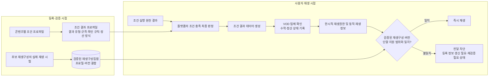

본 발명에서는 정적 재생구성과 동적 재생정보를 구별한다. 정적 재생구성은 스트리밍 프로토콜, DRM 체계, 코덱 및 필요한 경우 적용되는 보안 수준의 조합으로, 등록 단계에서 검증한다. 동적 재생정보는 개별 재생 요청마다 달라질 수 있는 매니페스트 위치, 단기 URL, 접근 토큰 및 재생 세션별 DRM 라이선스 요청 정보이다. 실행 시 일치 여부를 판단하는 대상은 정적 재생구성과 그 버전이다. 동적 URL이나 토큰까지 등록 시점의 값과 같아야 한다는 뜻은 아니다.

본 발명의 주요 데이터는 다음과 같다.

| 데이터 | 역할 |
|---|---|
| 업체 재생 연동 프로필 | 업체가 지원하는 스트리밍, DRM, 코덱, 보안 수준 및 권한 요청 규격을 정의하는 업체 단위 정적 정보 |
| 콘텐츠 등록 정보 | 업체 콘텐츠 식별자, 추천용 메타데이터, 조건 프로파일, 결과 프로파일, 권한 서비스 및 재생 연동 프로필 참조를 연결하는 콘텐츠 단위 정보 |
| 재생 권한 획득 조건 프로파일 | 콘텐츠 재생 전에 확인할 광고 시청, 결제 또는 프로모션 등의 조건과 판정 기준을 정의하는 정보 |
| 조건 결과 프로파일 | 조건 충족 시 생성할 결과 유형·데이터 규격·업체 확인 규칙·업체 처리 방식·정산 방식 및 버전을 정의하는 정보 |
| 조건 실행 원천 결과 | 사용자 단말, 광고 시스템, 결제 시스템 또는 프로모션 시스템이 플랫폼에 보고하는 실행 결과 |
| 조건 결과 데이터 | 플랫폼이 조건 충족을 최종 판정한 후 결과 프로파일에 따라 생성하여 업체에 제공하는 공통정보와 조건별 결과값 |
| 검증된 재생구성집합 | 콘텐츠 등록 검증에서 실제 재생 시험을 통과한 하나 이상의 정적 재생구성을 콘텐츠 식별자와 콘텐츠 등록 버전, 재생 프로필 식별자와 프로필 버전에 연결해 플랫폼이 생성한 기록 |
| 업체 결과 처리 상태 | 업체가 조건 결과 데이터를 확인한 뒤 기록하는 수락·거절 및 정산 대기·정산 없음 등의 상태 |
| 동적 재생정보 | 권한 발급 시 업체가 해당 실행 재생구성에 대응하여 반환하는 매니페스트 위치, 단기 URL·토큰 및 DRM 라이선스 요청 정보 |

### 나. 종래기술 및 중점 선행기술 조사 결과

종래 시스템에는 다음과 같은 개별 기술이 존재할 수 있다.

1. 사업 규칙, 로그인 또는 결제 완료 후 외부 DRM 시스템이 데이터를 확인하고 재생권한을 발급하는 기술
2. 광고 시청, 사용자 결제 또는 스폰서 부담을 콘텐츠 접근이나 보상과 연결하는 기술
3. 콘텐츠와 업체의 메타데이터를 등록하고 외부 재생정보를 실행 시점에 취득하는 기술
4. 단말 지원 범위에 맞는 DRM·스트리밍 구성을 선택하는 기술
5. 실제 재생 시험 또는 DRM 검증 후 콘텐츠 제공 상태를 전환하는 기술

따라서 광고·결제·프로모션 조건의 존재, 외부 업체의 토큰 또는 라이선스 발급, 실행 시점의 동적 재생정보 취득, 단말 호환 구성 선택, 등록 단계의 시험 재생은 각각 그 자체만으로 독립적인 차별점이 되기 어렵다.

아래 상태는 2026-07-21 공개 데이터를 기준으로 정리한 예비 정보이다. 만료되거나 포기된 문헌도 선행기술이 될 수 있지만, 현재 유효한 권리와는 구별해야 한다. 출원 및 사업화 전에는 각 관할의 등록원부와 패밀리·계속출원·존속기간을 다시 확인해야 한다.

| 선행문헌 | 예비 상태 | 본 발명과 가까운 내용 | 본 발명에서 구체화한 차이 |
|---|---|---|---|
| [US7711647B2, *Digital rights management in a distributed network*](https://patents.google.com/patent/US7711647B2/en) | 미국 등록, Active(유효) 표시, 조정 후 만료일 2028-05-19 | 등록·로그인·결제 등 사업 규칙 완료 후 생성된 데이터를 외부 CDN의 DRM 시스템이 확인하고, 사전 등록된 권리·재생 프로필과 단말 정보를 이용하여 라이선스를 발급한다. 조건 처리, 외부 확인·권리 발급 및 사전 등록 프로필의 활용까지 하나의 문헌에서 보여 주는 가장 유사한 사례이다. | 조건별 결과 규격과 비용 부담을 콘텐츠별 버전으로 결합하는 관계, 업체의 결과 수락·정산 상태 기록과 권한 발급의 연결, 콘텐츠별 실제 통과 재생구성집합 및 실행 응답 불일치 차단은 필수적인 일련의 처리 흐름으로 확인되지 않는다. |
| [EP0913789B1, *Pre-paid links to network servers*](https://patents.google.com/patent/EP0913789B1/en) | Expired-Lifetime(존속기간 만료) 표시 | 스폰서의 결제 근거를 포함한 데이터를 외부 콘텐츠 서버가 확인·저장하고 콘텐츠를 제공하며 스폰서에게 과금하는 구조이다. | 선불 스폰서 링크에 집중하며, 복수 조건의 공통 결과 구조, VOD 권한·DRM 및 검증된 재생구성의 일치 제어가 없다. |
| [US20190147471A1](https://patents.google.com/patent/US20190147471A1/en) / [US20090018909A1](https://patents.google.com/patent/US20090018909A1/en) | 미국 출원 Abandoned(포기) 표시, 전자의 국제출원은 Ceased(절차 종료) 표시 | 광고 시청, 사용자 결제, 광고주 또는 중개자 부담을 콘텐츠 접근·보상과 연결한다. | 계정 크레딧, 가격 할인 또는 중앙 정산이 중심이며, 외부 VOD 업체가 콘텐츠별 조건 결과 데이터를 확인·기록한 후 새 재생권한을 발급하고 검증된 재생구성과 대조하는 흐름이 없다. |
| [US11805132B2, *Location specific temporary authentication system*](https://patents.google.com/patent/US11805132B2/en) | 미국 등록, Active(유효) 표시, 조정 후 만료일 2041-03-10 | 거래·프로모션 등의 조건 충족 후 중개 시스템이 외부 콘텐츠 제공자에게 자격 정보를 보내고, 제공자의 승인 후 임시 접근을 부여한다. | 장소·기기·중개 계정이 중심이고 조건 유형별 결과·정산 데이터가 아니다. 업체의 결과 수락 기록과 검증된 재생구성 대조도 없다. |
| [US12111891B2](https://patents.google.com/patent/US12111891B2/en) / [EP3491562B1](https://patents.google.com/patent/EP3491562B1/en), *DRM sharing and playback service specification selection* | 미국 Active(유효) 표시, 조정 후 만료일 2038-02-26; 유럽 Active(유효) 표시, 예상 만료일 2036-10-27 | 단말 지원 선택지와 콘텐츠 제한으로 재생 방식을 정하고 저장된 토큰·선택 방식과 후속 요청을 비교한다. | 조건 결과·정산·외부 VOD 권한 발급 흐름이 없고, 콘텐츠별 실제 시험 통과 구성집합과 버전이 추천 상태와 실행 허용 여부를 함께 결정하지 않는다. |
| [US9081939B2](https://patents.google.com/patent/US9081939B2/en) / [US9129092B1](https://patents.google.com/patent/US9129092B1/en) | 모두 Active(유효) 표시; 각각 조정 후 만료일 2033-03-10, 예상 만료일 2032-11-10 | 각각 권리 및 DRM 재생 품질 검증(QA) 후 제공 상태를 전환하는 기술과 단말이 지원하는 DRM 구성을 탐지·선택하는 기술을 보여 준다. | 전자는 미디어 자산을 자체 시스템으로 수집하는 구조이고 후자는 단말 구성 탐지에 그친다. 조건 결과, 업체 수락·정산·권한 발급 및 검증된 재생구성집합 밖의 실행 응답 차단과 결합되지 않는다. |

조사한 개별 문헌에서는 다음의 전체 처리 흐름을 그대로 확인할 수 없었다.

> 콘텐츠별 조건 프로파일과 이에 연결된 조건 결과 프로파일을 통해 판정 기준, 결과 유형, 데이터 규격, 비용 부담 방식 및 업체 확인 규칙을 정의한다. 플랫폼은 원천 결과를 바탕으로 조건 충족 여부를 최종 판정하고, 해당 유형의 조건 결과 데이터를 업체에 보낸다. 업체는 이를 등록 규칙 및 고유 권한정책과 대조하여 수락·정산 상태를 기록한 뒤 한시적 재생권한을 발급한다. 플랫폼은 실행 재생구성이 등록 단계의 실제 시험을 통과한 검증된 재생구성집합에 포함되지 않거나 프로필 버전이 일치하지 않으면 동적 재생정보의 전달을 차단한다.

다만 US7711647B2는 조건 처리, 외부 확인·권리 발급, 사전 프로필 및 단말 정보 활용을 상당 부분 함께 보여 주므로 진보성 판단에서 가장 주의해야 할 문헌이다. 따라서 조건 유형의 단순 나열, 정산 비율, 동적 URL·토큰의 지연 취득, 또는 외부 업체가 권한을 발급한다는 사실만으로 차별성을 주장하지 않는다.

### 다. 종래기술의 문제점 및 본 발명의 목적

| 종래 또는 구현상 문제 | 본 발명의 목적 |
|---|---|
| 콘텐츠별 사전조건은 등록되어도 조건 충족 시 업체에 무엇을 제공하고 업체가 무엇을 처리하는지가 불명확하다. | 조건 프로파일에 결과 프로파일을 결합하여 조건과 결과 유형·규격·비용 부담·확인 규칙·업체 처리 방식을 콘텐츠별로 정한다. |
| 단말과 플랫폼 중 조건 충족을 최종 판단하는 주체가 불분명하면 업체의 권한 발급 근거도 불명확해진다. | 단말과 외부 조건 시스템은 원천 결과를 보고하고, 플랫폼이 콘텐츠별 기준에 따라 사전조건 충족을 최종 판정한다. |
| 업체가 플랫폼 판정을 그대로 신뢰하거나 플랫폼이 업체의 고유 권한정책까지 대신 판단하는 것으로 읽힐 수 있다. | 업체가 수신 결과를 등록된 확인 규칙 및 고유 권한정책과 대조하여 수락 여부를 결정하고, 수락 후 권한을 발급하도록 역할을 분리한다. |
| 광고, 사용자 결제, 플랫폼 부담 및 업체 부담 프로모션은 경제적 결과가 서로 다르다. 이를 출처와 의미가 드러나지 않는 단일 증빙값으로 처리하면 사후 정산 근거가 부족해진다. | 조건 유형에 맞는 구조화된 결과 데이터를 생성하고, 업체의 수락·권한·재생 결과와 연결하여 정산 또는 정산 없음 상태를 기록한다. |
| 등록 때 실제 재생을 확인했더라도 실행 시 업체가 미등록 또는 변경된 구성을 반환하면 검증의 의미가 사라진다. | 등록 시 실제 시험을 통과한 재생구성과 버전을 저장하고, 실행 응답이 검증된 재생구성집합 밖이면 재생정보를 전달하지 않으며 등록 정보 갱신 필요 또는 재검증 필요 상태로 전환한다. |
| 동적 URL이나 토큰의 정상적인 변경과 정적 재생구성 변경을 혼동할 수 있다. | 프로토콜·DRM·코덱·보안 수준의 정적 구성과 세션별 URL·토큰·DRM 라이선스 요청 정보를 구별하여 정적 구성과 버전만 일치 검증 대상으로 삼는다. |
| 실제 재생 URL과 장기 토큰을 추천 카탈로그에 저장하면 유출·만료·동기화 위험이 커진다. | 추천용 등록 정보와 동적 재생정보를 분리하고, 동적 재생정보는 권한 발급 시점에 취득하여 유효 기간이 짧은 실행 영역에서만 사용한다. |

### 라. 본 발명의 해결수단 요약

1. VOD 업체가 업체 단위의 권한 서비스와 정적 재생 연동 프로필 및 그 버전을 등록한다.
2. 개별 콘텐츠에 업체 콘텐츠 식별자, 추천용 메타데이터, 하나 이상의 조건 프로파일과 각 조건에 결합된 결과 프로파일을 등록한다.
3. 플랫폼이 후보 재생구성별로 검증용 권한을 취득하여 실제 재생 시험을 하고, 성공한 정적 재생구성과 프로필·콘텐츠 버전을 검증된 재생구성집합으로 저장한다.
4. 검증된 재생구성집합이 존재하고 그 밖의 등록 조건도 유효한 콘텐츠만 추천 가능 상태로 전환한다.
5. 사용자가 콘텐츠를 선택하면 단말 또는 외부 조건 시스템이 조건 실행의 원천 결과를 플랫폼에 제공한다.
6. 플랫폼이 콘텐츠별 조건 프로파일에 따라 조건 충족 여부를 최종 판정하고, 충족된 경우 해당 결과 프로파일에 따라 조건 결과 데이터를 생성한다.
7. 기준 실시예에서는 플랫폼이 업체 콘텐츠 식별자, 조건 결과 데이터, 적용되는 콘텐츠 등록 버전과 재생 프로필 버전, 그리고 플랫폼이 지정한 하나의 검증된 재생구성을 포함하는 권한 요청을 업체에 전송한다. 업체가 호환 후보 중 하나를 선택하는 방식은 아래 제2장 가. 5)의 대안 실시예로 구분한다.
8. 업체가 조건 결과 데이터를 등록된 확인 규칙 및 고유 권한정책과 대조하고 수락·거절 및 정산 처리 상태를 기록한다.
9. 업체가 수락한 요청에 한하여 검증된 재생구성에 대응하는 한시적 재생권한과 동적 재생정보를 발급한다.
10. 플랫폼이 응답의 프로필·버전 및 실행 재생구성을 검증된 재생구성집합과 대조하고, 실행 재생구성이 단말 지원 범위에 포함되는지 확인한다.
11. 일치하면 동적 재생정보를 단말 재생기에 전달한다. 불일치하면 전달을 차단하고 해당 콘텐츠를 등록 정보 갱신 필요 또는 재검증 필요 상태로 전환한다.
12. 조건 결과, 업체의 수락·거절, 업체 권한 및 실제 재생 결과를 동일한 권한 거래 식별자를 기준으로 연결하여 정산 대기·정산 확정·정산 취소·정산 조정 또는 정산 없음 상태를 관리한다.

### 마. 필수 구성·기준 실시예·대안 실시예의 구분

본 직무발명서에서는 각 구성의 지위를 다음과 같이 구분한다. 이는 발명의 아이디어를 회사와 변리사에게 정확히 전달하기 위한 구분으로, 특정 제품의 구현 완료 여부를 단정하는 것은 아니다. 실제 제품에 반영된 범위와 시점은 소스코드·설계서·시험 기록 등 별도 자료로 확인한다.

| 구분 | 본 문서에서의 의미 | 권리화 검토 시 취급 |
|---|---|---|
| **필수 구성** | 아래의 공통 기술 관계를 이루며, 기준 실시예와 대안 실시예에 공통으로 유지되는 발명의 중심 구성 | 독립항의 중심 후보로 검토 |
| **기준 실시예** | 본 아이디어의 동작과 데이터 흐름을 가장 구체적으로 설명하기 위해 채택한 대표 설계 | 상세한 설명·도면·예시 데이터의 기본값으로 사용 |
| **대안 실시예** | 필수 구성을 유지하면서 선택 주체, 데이터 전달 경로 또는 처리 시점을 달리하는 변형 | 실제 사업·연동 방식에 따라 종속항 또는 별도 독립항 후보로 검토 |

필수 구성에 해당하는 공통 기술 관계는 다음과 같다.

1. 콘텐츠별 조건 프로파일과 조건 결과 프로파일을 연결하여 저장한다.
2. 조건 실행 주체가 원천 결과를 제공하고, 플랫폼이 콘텐츠별 조건에 따라 충족 여부를 최종 판정한다.
3. 플랫폼의 판정에 따라 생성된 조건 결과 데이터를 외부 VOD 업체가 확인할 수 있게 제공한다.
4. 외부 VOD 업체가 조건 결과와 업체 고유 권한정책을 독립적으로 확인하고, 수락한 경우에만 한시적 재생권한을 발급한다.
5. 외부 VOD 업체가 조건 결과의 수락 또는 거절을 권한 거래와 연결하여 기록한다. 요청을 수락한 경우, 정산이 필요한 조건에는 초기 정산 처리 상태를 연결하고 정산이 필요하지 않은 조건에는 정산 없음 상태를 연결한다. 다만 외부 정산 원장의 상세 기록과 후속 상태를 동기식으로 반환하는 것까지 필수로 한정하지는 않는다.
6. 등록 단계에서 실제 재생 시험을 통과한 정적 재생구성과 해당 콘텐츠·프로필·버전의 관계를 저장한다.
7. 실행 단계에서 업체 응답의 재생구성, 재생 프로필 및 버전을 검증 결과와 대조하고, 해당 구성이 단말 지원 범위에 포함되는지 확인한다.
8. 대조에 실패하면 동적 재생정보의 단말 전달·취득 또는 사용을 허용하지 않고 등록 정보 갱신 필요 또는 재검증 필요 상태로 전환한다.

이하의 JSON 예시와 순서도는 별도 표시가 없는 한 **기준 실시예**를 나타낸다. 기준 실시예에서는 플랫폼이 하나의 실행 재생구성을 지정하고 조건 결과 데이터의 전체 내용을 권한 요청에 포함한다. 다만 상위 요청과 중복되는 공통 식별 정보는 상위 필드에 둘 수 있다. 업체는 수락 상태와 초기 정산 처리 상태를 기록한 뒤 한시적 재생권한과 동적 재생정보를 플랫폼에 반환하고, 플랫폼은 응답을 검증한 후 동적 재생정보를 단말에 전달한다. 여기서 기준 실시예는 대표적인 설명 방식을 뜻하며, 상용 구현이 완료되었다는 의미는 아니다.

대안 실시예에서는 업체의 재생구성 선택, 조건 결과 식별자를 이용한 조회, 플랫폼의 검증 승인 후 단말이 업체로부터 직접 취득하는 방식 또는 프록시 참조값 전달, 외부 조건 시스템의 원천 결과 제공, 후속 정산 상태의 비동기 통지 등을 사용할 수 있다. 다만 어느 대안에서도 위 필수 구성, 업체의 독립적인 권한 판단, 권한 발급 전 수락·초기 처리 상태의 거래 연계 기록 및 플랫폼의 실행 허용 판정은 유지한다.

## 2. 발명(고안)의 구체적 설명

### 가. 발명의 구성

#### 1) 전체 시스템 구조

본 발명의 시스템은 즉시 재생 플랫폼(100), 외부 VOD 업체 시스템(200), 사용자 단말(300), 추천 시스템(400) 및 선택적인 업체 연계 DRM 라이선스 시스템(500)을 포함한다.

##### 1-1. 등록·검증 및 추천 활성화 구조

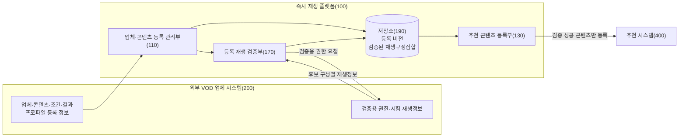

등록 흐름에서는 업체가 제공한 등록 정보와, 플랫폼이 실제 재생 시험을 거쳐 생성한 검증된 재생구성집합을 구분한다. 추천 시스템에는 검증을 통과한 콘텐츠만 등록한다.

##### 1-2. 조건 판정 및 업체 권한 발급 구조

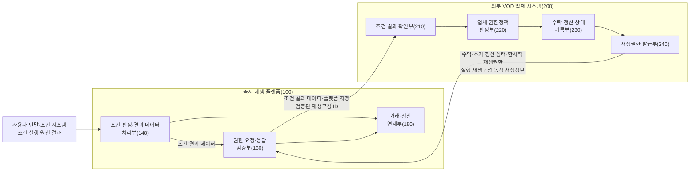

조건 처리 흐름에서는 플랫폼의 사전조건 판정과 업체의 결과 확인·고유 권한정책 판단을 분리한다. 업체는 결과를 확인해 수락 여부와 처리 상태를 기록하고, 수락한 경우에만 재생권한을 발급한다.

##### 1-3. 실행 재생구성 검증 및 단말 재생 구조

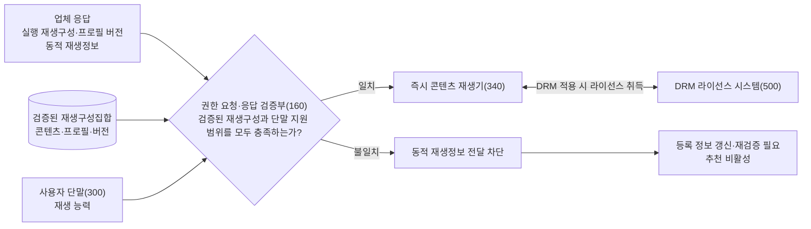

실행 흐름에서는 업체 응답의 정적 재생구성과 프로필 버전을 검증된 재생구성집합과 대조하고, 해당 구성이 단말 재생 능력에 부합하는지 확인한다. 두 기준을 모두 충족한 경우에만 동적 재생정보를 단말 재생기에 전달한다.

조건 실행·원천 결과 보고부(330)는 광고 재생 완료, 결제 승인 또는 프로모션 적용과 같은 원천 결과를 수집하여 플랫폼에 보고한다. 다만 조건 충족 여부를 최종 판정하지는 않는다. 조건 판정·결과 데이터 처리부(140)가 콘텐츠별 조건 프로파일을 적용해 최종 판정하고, 그 판정과 조건 결과 프로파일에 따라 업체에 제공할 조건 결과 데이터를 생성한다.

외부 VOD 업체 시스템(200)은 플랫폼의 조건 판정을 처음부터 다시 수행하지 않는다. 대신 수신한 조건 결과 데이터가 해당 콘텐츠에 등록된 결과 규칙과 버전에 맞는지 확인하고, 업체 고유 권한정책을 별도로 적용한다. 업체는 수락·거절 및 정산 처리 상태를 기록한 뒤, 요청을 수락한 경우에만 한시적 재생권한을 발급한다.

등록 재생 검증부(170)는 후보 프로필 정보만 저장하는 데 그치지 않는다. 실제 재생 시험을 통과한 프로토콜·DRM·코덱·보안 수준의 조합을 콘텐츠, 프로필 및 버전과 연결하여 저장한다. 실행 시 권한 요청·응답 검증부(160)는 업체가 반환한 실행 재생구성이 검증된 재생구성집합과 단말 지원 범위에 모두 포함되는지 다시 확인한다.

#### 2) 구성부별 기능

1. **업체·콘텐츠 등록 관리부(110)**
   업체 식별자, 권한 서비스, 정적 재생 연동 프로필 및 버전을 업체 단위로 등록한다. 개별 콘텐츠에는 업체 콘텐츠 식별자, 추천용 메타데이터, 조건 프로파일, 조건 결과 프로파일, 권한 서비스 및 재생 프로필에 대한 참조 정보를 연결한다. 프로필 또는 콘텐츠의 변경이 기존 검증 결과에 영향을 주면 해당 콘텐츠를 등록 정보 갱신 필요 상태로 전환한다.

2. **추천 콘텐츠 등록부(130)**
   유효한 검증된 재생구성집합이 존재하고 제공 기간·지역·조건 및 결과 프로파일이 유효한 콘텐츠만 추천 시스템에 등록한다. 검증 무효화, 등록 버전 변경 또는 실행 불일치가 발생하면 해당 콘텐츠를 추천 목록에서 제외한다.

3. **조건 판정·결과 데이터 처리부(140)**
   사용자 단말, 광고 시스템, 결제 시스템 또는 프로모션 시스템으로부터 원천 결과를 수신한다. 선택된 콘텐츠의 조건 프로파일과 버전을 적용하여 조건 충족 여부를 플랫폼에서 최종 판정한다. 충족된 경우 연결된 결과 프로파일을 조회하여 업체에 제공할 조건 결과 데이터를 생성하고, 충족되지 않은 경우에는 권한 요청 절차를 중단한다.

4. **권한 요청·응답 검증부(160)**
   업체 콘텐츠 식별자, 조건 결과 데이터, 적용 등록 버전, 단말 재생 능력 및 검증된 재생구성의 식별자를 포함하는 권한 요청을 생성한다. 업체 응답의 결과 수락 상태, 권한, 프로필·버전, 실행 재생구성 및 동적 재생정보를 확인한다. 정적 구성과 버전이 검증된 재생구성집합에 포함되고 단말 지원 범위에도 맞을 때만 동적 재생정보를 단말로 전달한다.

5. **등록 재생 검증부(170)**
   업체 시스템에서 검증용 권한과 동적 재생정보를 취득하여 후보 재생구성별로 매니페스트 접근, DRM 라이선스 취득 및 미디어 재생 개시 중 하나 이상을 시험한다. 시험을 통과한 구성과 프로필·콘텐츠 버전, 시험 시각 및 유효 기간을 연결하여 검증된 재생구성집합으로 생성·저장한다.

6. **거래·정산 연계부(180)**
   조건 결과 식별자, 업체 수락·거절 상태, 업체 권한 식별자 및 실제 재생 결과를 동일한 권한 거래에 연결한다. 업체가 반환한 초기 정산 상태를 해당 거래와 연결하고, 이후 정산 확정·취소·조정 또는 정산 없음 유지 상태를 추적한다.

7. **저장소(190)**
   업체 등록, 콘텐츠 등록, 조건·결과 프로파일, 검증된 재생구성집합, 권한 거래 및 상태 변경 이력을 구분하여 저장한다. 추천 카탈로그에는 실제 VOD URL, 장기 접근 토큰, DRM 키 또는 특정 재생 요청에 사용되는 DRM 라이선스 요청 정보를 저장하지 않는다.

8. **조건 결과 확인부(210)**
   업체가 수신한 조건 결과 데이터의 대상 업체·콘텐츠, 조건·결과 프로파일과 버전, 결과 유형, 필수 결과값 및 플랫폼 판정값을 등록된 확인 규칙과 대조한다.

9. **업체 권한정책 판정부(220)**
   콘텐츠 제공 지역, 제공 기간, 동시 시청 제한 및 계약 상태 등 업체 고유 정책을 적용하여 권한 요청의 수락 가능성을 판단한다. 이는 플랫폼의 광고 시청·결제·프로모션 조건 판정을 대체하지 않는다.

10. **수락·정산 상태 기록부(230)**
    조건 결과의 수락 또는 거절과 그 사유를 권한 거래 식별자, 콘텐츠, 조건 프로파일 및 결과 식별자에 연결하여 기록한다. 정산 대상 조건이면 초기 정산 상태를 기록한다. 업체가 비용을 부담하는 무료 프로모션처럼 플랫폼과 별도의 콘텐츠 비용 정산이 필요하지 않은 조건이면 정산 없음 상태를 기록한다.

11. **재생권한 발급부(240)**
    기준 실시예에서는 조건 결과가 수락되고 업체 고유 권한정책에 따라 재생이 허용된 경우에만 한시적 재생권한을 발급한다. 권한 요청에서 플랫폼이 지정한 검증된 재생구성에 대응하는 동적 재생정보를 생성하여 플랫폼에 반환한다. 업체가 호환 후보 중 하나를 선택하는 경우는 아래 5)의 대안 실시예를 따른다.

12. **조건 실행·원천 결과 보고부(330)**
    광고 재생 결과, 결제 승인 결과 또는 사용자 행위 결과를 수집하여 플랫폼에 보고한다. 프로모션 조건처럼 플랫폼 서버에서 직접 확인되는 결과는 이 구성부를 거치지 않을 수 있다.

13. **즉시 콘텐츠 재생기(340)**
    단말이 지원하는 스트리밍 프로토콜, DRM, 코덱 및 보안 수준 정보를 플랫폼에 제공한다. 이어서 플랫폼이 검증한 실행 재생구성에 대응하는 동적 재생정보를 이용하여 콘텐츠를 재생한다. DRM이 적용되면 업체 연계 DRM 라이선스 시스템과 통신하여 라이선스를 취득하며, 콘텐츠 키는 단말의 보호된 DRM 처리 영역에서 사용할 수 있다.

#### 3) 구성부별 입력·출력·판단책임

| 구성부 | 주요 입력 | 주요 출력 | 판단 또는 처리책임 |
|---|---|---|---|
| 업체·콘텐츠 등록 관리부(110) | 업체·콘텐츠·조건·결과 프로파일 | 버전이 부여된 등록 기록 | 참조 무결성, 스키마, 중복 및 변경 영향 확인 |
| 추천 콘텐츠 등록부(130) | 검증된 재생구성집합, 제공 상태 | 추천 등록·해제 요청 | 추천 가능 상태 유지 |
| 조건 판정·결과 데이터 처리부(140) | 원천 결과, 조건·결과 프로파일 | 플랫폼 판정, 조건 결과 데이터 | 사전조건 충족의 최종 판정과 결과 형식 선택 |
| 권한 요청·응답 검증부(160) | 결과 데이터, 단말 능력, 검증된 재생구성집합 | 업체 요청, 검증 결과, 단말 전달 정보 | 응답의 정적 구성·버전 일치 여부 및 전달·차단 |
| 등록 재생 검증부(170) | 후보 재생구성, 검증용 권한 | 실제 통과 구성, 시험 결과 | 콘텐츠별 검증된 재생구성집합 생성 |
| 거래·정산 연계부(180) | 조건 결과, 업체 상태, 권한, 재생 결과 | 거래에 연결된 업체 정산 상태 | 업체가 반환한 상태의 거래 연계·추적 |
| 조건 결과 확인부(210) | 조건 결과 데이터, 등록 확인 규칙 | 결과 수락·거절 판단 자료 | 업체가 사전 합의한 결과 형식·내용 확인 |
| 업체 권한정책 판정부(220) | 콘텐츠·지역·기간·계약 상태 | 업체 권한정책 수락·거절 | 해당 콘텐츠의 권한정책 적용 |
| 수락·정산 상태 기록부(230) | 결과 확인·권한정책 결과 | 수락·거절, 정산 상태 기록 | 업체 내부 처리 상태 보존 |
| 재생권한 발급부(240) | 수락된 요청, 검증된 재생구성 | 한시적 재생권한, 동적 재생정보 | 검증된 정적 재생구성에 대응하는 실행 정보 발급 |
| 조건 실행·원천 결과 보고부(330) | 광고·결제·사용자 행위의 실제 결과 | 원천 결과 | 결과 수집과 보고만 수행 |
| 즉시 콘텐츠 재생기(340) | 검증된 실행 재생구성, 동적 재생정보 | 재생 결과 | 콘텐츠 재생 및 필요한 경우 DRM 라이선스 처리 |

#### 4) 용어 정의

1. **업체 콘텐츠 식별자**: 외부 VOD 업체가 콘텐츠 또는 재생 자산에 부여한 식별자로서, 플랫폼이 실제 재생 위치를 해석하지 않고 권한 요청에 사용하는 값이다.
2. **플랫폼 콘텐츠 식별자**: 추천 메타데이터, 업체 콘텐츠 식별자, 조건·결과 프로파일, 검증 결과 및 권한 거래를 하나의 콘텐츠에 연결하는 플랫폼 식별자이다.
3. **재생 권한 획득 조건 프로파일**: 콘텐츠 재생 전에 확인할 조건 유형, 실행 매개변수, 판정 기준, 적용 기간, 대상 및 버전을 정의한 콘텐츠별 정보이다.
4. **조건 결과 프로파일**: 조건 충족 시 생성할 결과 유형과 데이터 규격, 업체 확인 규칙, 비용 부담 또는 정산 방식, 업체가 결과를 수락한 후 수행할 처리 내용 및 버전을 조건 프로파일에 연결한 정보이다.
5. **조건 실행 원천 결과**: 조건 실행 주체가 생성·보고하는 광고 재생 기록, 결제 승인 결과, 프로모션 적용 결과 또는 사용자 행위 결과이다.
6. **플랫폼 조건 판정**: 플랫폼이 원천 결과에 콘텐츠별 조건 프로파일의 판정 기준을 적용하여 조건의 충족 여부를 최종 판정한 결과이다.
7. **조건 결과 데이터**: 플랫폼이 조건이 충족된 것으로 판정한 경우 조건 결과 프로파일에 따라 생성하여 업체에 전달하는 데이터이다. 공통 식별 정보·판정 정보·결과 유형·조건별 결과값·정산 관련 정보를 포함할 수 있다.
8. **업체 확인 규칙**: 외부 VOD 업체가 조건 결과 데이터의 대상, 버전, 필수 항목, 결과 유형 및 허용값을 확인할 수 있도록 콘텐츠별 조건 결과 프로파일에 연결하여 등록한 규칙이다.
9. **업체 고유 권한정책**: 콘텐츠 제공 지역·기간·계약 상태·동시 시청 등 해당 콘텐츠의 권리 범위를 업체가 판단하기 위한 정책이다.
10. **검증된 재생구성집합**: 등록 검증에서 실제 재생 시험을 통과한 하나 이상의 정적 재생구성을 콘텐츠 식별자, 콘텐츠 등록 버전, 재생 프로필 식별자 및 버전과 연결한 집합이다.
11. **정적 재생구성**: 스트리밍 프로토콜, DRM 체계, 비디오·오디오 코덱 및 선택적인 보안 수준의 조합이다.
12. **실행 재생구성**: 개별 권한 요청에서 사용하도록 지정되거나 업체 응답에 포함된 정적 재생구성이다. 실행 단계에서 새로운 조합을 임의로 만드는 것이 아니라 검증된 재생구성집합의 구성 중 하나여야 한다.
13. **동적 재생정보**: 특정 권한 거래 또는 재생 세션에 사용되는 매니페스트 위치, 단기 콘텐츠 URL, 접근 토큰, 권한 식별자, 만료 정보 또는 DRM 라이선스 요청 정보이다.
14. **한시적 재생권한**: 업체가 특정 콘텐츠, 권한 거래, 단말, 재생 구간 또는 유효 시간 중 하나 이상의 범위로 제한하여 발급하는 권한이다.
15. **권한 거래 식별자**: 플랫폼 판정, 조건 결과 데이터, 업체 수락·거절, 업체가 발급한 재생권한, 동적 재생정보 및 실제 재생 결과를 연결하는 식별자이다.
16. **등록 정보 갱신 필요 상태(`UPDATE_REQUIRED`)**: 콘텐츠 등록 버전, 업체 등록 버전 또는 재생 프로필 버전이 일치하지 않아 등록 정보의 갱신 여부를 확인해야 하는 상태이다.
17. **재검증 필요 상태**: 검증된 재생구성집합에 포함되지 않은 실행 재생구성을 수신하거나 재생 실패가 반복되어 실제 재생 시험을 다시 수행해야 하는 상태이다.

#### 5) 기준 및 대안 실시예의 실행 재생구성 지정 방식

본 문서의 기준 실시예는 **플랫폼 지정 방식**이다. 콘텐츠별 검증된 재생구성집합에 하나의 구성만 존재하면 별도의 선택 단계 없이 그 구성을 권한 요청에 지정한다. 복수 구성이 존재하면 플랫폼이 검증된 재생구성 중 단말이 지원하는 하나를 정한다. **업체 선택 방식**은 선택 가능한 대안 실시예로 구분한다.

- **기준 실시예 — 플랫폼 지정 방식**: 플랫폼이 검증된 재생구성집합 중 단말이 지원하는 실행 재생구성을 정하고, 그 구성 식별자를 권한 요청에 포함한다. 업체는 지정된 구성을 현재 제공할 수 있는지 확인하여 해당 구성의 동적 재생정보를 반환한다.
- **대안 실시예 — 업체 선택 방식**: 플랫폼이 단말과 호환되는 검증된 재생구성의 식별자만 후보로 전송하고, 업체가 그 후보 중 하나를 선택하여 반환한다.

어느 실시예에서도 업체가 검증된 재생구성집합에 없는 새 스트리밍·DRM·코덱 조합을 반환하면 플랫폼은 이를 정상 응답으로 인정하지 않는다. 플랫폼은 반환된 구성과 프로필 버전을 각각 대조하고, 불일치하면 동적 재생정보를 재생기에 전달하거나 단말이 이를 취득·사용하도록 허용하지 않는다.

기준 실시예와 주요 대안 실시예의 차이는 다음과 같다.

| 구분 항목 | 기준 실시예 | 대안 실시예 | 공통으로 유지되는 사항 |
|---|---|---|---|
| 실행 재생구성 선택 | 플랫폼이 검증된 재생구성 중 단말이 지원하는 하나를 지정 | 플랫폼이 호환 후보만 보내고 업체가 그중 하나를 선택 | 검증된 재생구성집합 밖의 구성은 허용하지 않음 |
| 조건 결과 제공 | 조건 결과 데이터 전체 내용을 권한 요청에 포함 | 결과 식별자와 무결성 확인 정보를 보내고 업체가 합의된 인터페이스로 조회 | 업체가 등록된 확인 규칙에 따라 결과를 독립적으로 확인 |
| 동적 재생정보 전달 | 업체 → 플랫폼 → 단말 | 업체가 실행 재생구성·프로필·버전과 동적 재생정보 취득용 일회용 참조값을 플랫폼에 먼저 응답하고, 검증 승인 후 단말이 그 참조값으로 업체에서 직접 취득하거나 플랫폼의 단기 프록시 참조값을 사용 | 플랫폼의 실행 허용 판정 전에는 단말이 사용할 수 없도록 통제 |
| 원천 결과 제공 | 플랫폼이 연동한 광고·결제·프로모션 시스템 또는 단말이 제공 | 독립된 외부 조건 시스템이 제공 | 플랫폼이 콘텐츠별 조건의 충족 여부를 최종 판정 |
| 정산 처리 상태 | 업체가 권한 응답에 초기 상태를 함께 기록·반환 | 업체가 수락과 초기 처리 상태를 권한 발급 전에 기록하고, 상세 정산 기록과 후속 상태를 거래 식별자에 연결하여 비동기로 통지 | 조건 결과·수락·권한·정산을 같은 거래 관계로 연결 |
| 등록 재생 시험 | 해당 콘텐츠의 검증용 권한과 실제 자산으로 시험 | 대표 자산으로 프로필 단위 구성 시험을 하고, 대상 콘텐츠별 권한과 매니페스트 또는 자산 접근 유효성을 별도 확인 | 대표 자산 시험만으로 대상 콘텐츠를 검증 완료 처리하지 않으며, 실제 시험 구성과 적용 버전을 저장 |

단말이 업체로부터 동적 재생정보를 직접 취득하는 대안에서는 업체가 먼저 실행 재생구성·프로필·버전과 동적 재생정보 취득용 일회용 참조값을 플랫폼에 응답한다. 플랫폼은 이를 검증한 뒤 거래·세션에 연결된 실행 승인을 발급한다. 업체는 이 승인을 확인한 경우에만 단말이 해당 참조값을 사용하도록 허용한다. 따라서 이 대안에서도 플랫폼의 검증 절차를 우회하지 않는다.

대표 자산을 사용하는 대안에서도 대상 콘텐츠별 검증은 생략되지 않는다. 대표 자산으로 재생 프로필별 정적 구성을 시험한 뒤, 대상 콘텐츠에 대해서도 검증용 재생권한을 발급받아 최소한 해당 콘텐츠의 매니페스트 또는 미디어 일부 구간에 실제로 접근할 수 있는지 확인해야 한다. 대표 자산 시험만으로 대상 콘텐츠에 검증 완료(`VERIFIED`) 상태를 부여하지 않는다.

#### 6) 외부 VOD 업체 연동 범위 및 협력 전제

본 발명에서 외부 VOD 업체는 단순히 콘텐츠 URL만 제공하는 주체가 아니다. 업체는 자사가 제공하는 콘텐츠에 대한 최종 권한 판단 주체로서, 플랫폼이 제공한 조건 결과를 확인하고 한시적 재생권한을 발급하는 연동 주체이다. 따라서 아래의 필수 협력이 제공되지 않으면 외부 VOD 업체의 독립 확인과 권한 발급을 전제로 한 본 실시예를 그대로 구현하기 어렵다.

아래 구분은 필요한 **논리적 인터페이스**를 나타낸다. 반드시 서로 다른 신규 API로 구현할 필요는 없으며, 하나의 엔드포인트, 업체 관리 콘솔, 배치 등록, 웹훅 또는 기존 권한(entitlement)·DRM API를 조합하여 구현할 수 있다.

##### 6-1. 연동 인터페이스

| 논리 인터페이스 | 플랫폼이 제공하거나 호출하는 정보 | 외부 VOD 업체가 제공하거나 처리하는 정보 | 변경·실패 시 처리 |
|---|---|---|---|
| **업체 등록** | 플랫폼 사업자 식별 정보, 지원 스키마 버전 | 업체 식별자, 권한 발급 엔드포인트, 서비스 인증 프로필 참조값, 요청·응답 스키마 버전, 지원 재생 프로필과 그 버전 | 업체 등록 버전을 갱신하고, 영향을 받는 콘텐츠를 갱신하거나 재검증 |
| **콘텐츠 등록** | 플랫폼 콘텐츠 식별자, 조건·결과 프로파일 후보 | 업체 콘텐츠·재생 자산 식별자, 사용할 권한 서비스, 조건 결과 확인 규칙과 버전, 업체 권한정책 참조값, 재생 프로필 식별자·버전 | 콘텐츠 등록 버전을 갱신하고 기존 검증 결과의 유효성을 다시 판정 |
| **등록 검증** | 검증 거래 식별자, 대상 콘텐츠·후보 구성, 시험 단말 능력, 검증 목적의 권한 요청 | 검증용 한시적 재생권한, 시험 자산 또는 매니페스트, DRM 라이선스 요청 정보, 적용 프로필·버전 | 플랫폼이 실제 시험 결과를 생성·저장하고, 프로필 변경 시 관련 콘텐츠의 검증된 재생구성집합을 무효화하거나 재시험 |
| **실행 권한 요청·응답** | 거래·업체·콘텐츠·재생 자산·세션 식별자, 조건 결과 데이터 또는 대안 실시예의 참조값, 요청 권한 범위, 지정 구성 또는 대안 실시예의 호환 후보, 단말 능력, 적용 버전, 필요한 경우 업체의 권한 판단에 필요한 최소 정보 | 결과 확인, 업체 고유 권한정책 대조, 수락·거절과 사유, 한시적 재생권한·만료 정보, 선택된 구성·프로필·버전, 동적 재생정보, 필요한 정산 상태 | 식별자·버전·구성 불일치 또는 만료 시 전달·취득·사용 차단, 등록 정보 갱신 또는 재검증 |

##### 6-2. 역할과 책임 경계

| 주체 | 담당 범위 | 담당하지 않는 범위 |
|---|---|---|
| **플랫폼** | 원천 결과 수집, 콘텐츠별 조건 최종 판정, 조건 결과 생성, 업체 권한 요청, 응답의 검증된 재생구성·버전·단말 호환성 대조, 검증을 통과한 경우 동적 재생정보 중계 및 실패한 경우 차단 | 업체의 지역·기간·계약·동시 시청 등 고유 권한정책의 최종 결정, DRM 콘텐츠 키 발급 |
| **외부 VOD 업체** | 조건 결과가 등록된 확인 규칙에 부합하는지 확인, 업체 고유 권한정책 판단, 수락·거절 및 업체 측 상태 기록, 한시적 재생권한·동적 재생정보 발급, 검증용 접근 제공 | 플랫폼 조건의 최종 충족 판정, 플랫폼 추천 순위 결정 |
| **사용자 단말** | 단말 재생 능력 보고, 필요한 경우 조건 실행 및 원천 결과 보고, 수신한 한시적 재생권한으로 기존 재생기·DRM 모듈을 통한 재생 | 외부 VOD 업체의 고유 권한정책 결정, 검증되지 않은 구성으로의 임의 변경 |
| **조건 실행 시스템** | 광고·결제·프로모션 등 조건 수행과 원천 결과 생성·보고 | 콘텐츠별 조건의 최종 충족 판정과 외부 VOD 권한 발급 |
| **플랫폼·업체 공동** | 식별자 매핑, 스키마·버전, 서비스 간 인증, 무결성·재전송·오류처리 규약의 합의 | 상대방 고유 정책을 대신 결정하는 일 |

사용자에게 업체 앱 설치나 업체 계정 로그인을 요구하지 않는다고 해서 익명 접근을 허용한다는 뜻은 아니다. 플랫폼과 업체는 상호 인증된 서비스 자격 정보를 사용한다. 계약 또는 법령상 필요한 경우에는 해당 업체 범위에서만 유효한 가명 사용자·가구·세션 식별자, 지역, 동시 재생 판단 정보 또는 단말 보안 수준을 필요한 최소 범위에서 교환할 수 있다. 플랫폼은 업체 사용자의 장기 비밀번호나 DRM 콘텐츠 키를 보유할 필요가 없다.

##### 6-3. 업체 협력 수준

다음 표는 외부 업체와 기준 또는 대안 실시예를 구현하기 위한 **연동 전제**를 구분한 것이다. 여기서 “필수 연동 전제”는 사업·시스템 구현에 필요한 협력 범위를 뜻하며, 모든 항목이 독립청구항의 필수 구성요소라는 의미는 아니다.

| 협력 수준 | 업체가 제공하는 기능 | 본 발명에서의 위치 |
|---|---|---|
| **필수 연동 전제** | 서비스 간 인증, 콘텐츠·재생 자산 식별자 매핑, 조건 결과 확인 규칙과 버전, 재생 프로필·버전, 검증용 재생권한과 시험용 동적 재생정보, 실행 권한 요청·응답, 요청 식별자를 응답에 포함, 수락·거절 여부와 초기 처리 상태를 해당 거래에 연계하여 기록, 한시적 재생권한과 동적 재생정보 발급 | 기준 또는 대안 실시예의 구현에 필요한 업체 협력 범위 |
| **운영 권장** | 등록·프로필 변경 통지, 명시적 오류 코드, 거래 식별자 기반 멱등 처리, 재생 성공·실패 결과 통지(콜백), 권한 취소·갱신 | 재시도·장애 대응·자동 재검증과 운영 안정성 향상 |
| **확장 대안** | 조건 결과 참조 조회, 검증 승인 후 단말의 업체 직접 취득, 비동기 후속 정산 상태 통지, 단기 프록시 참조 정보 | 선택한 대안 실시예에 한하여 필요 |

같은 권한 요청을 재전송할 때에는 `grantTransactionId`를 유지할 수 있다. 업체는 동일 요청을 반복 처리해도 권한이나 정산이 중복 생성되지 않도록 하는 멱등 처리를 이 식별자를 기준으로 수행한다. 이후 기존 처리 결과 또는 같은 의미의 최신 상태를 반환할 수 있다.

일반 공개 URL이나 단순 딥링크가 어떤 사용자 화면으로 이어지는지는 업체 구현에 따라 달라질 수 있다. 다만 조건 결과에 대한 업체의 확인, 그 결과에 기초한 새로운 한시적 재생권한 발급, 실행 재생구성 검증으로 이어지는 일련의 처리 흐름이 없는 단순 링크 전달은 본 문서의 기준 실시예와 구별된다. 업체의 수락·거절 및 초기 처리 상태 기록은 모든 실시예에서 유지한다. 외부 정산 원장 연동, 후속 정산 상태 통지 또는 동적 재생정보의 직접 취득 기능은 콘텐츠 조건과 업체 계약에 따라 운영 권장 사항이나 확장 대안으로 선택할 수 있다.

#### 7) 업체 등록 데이터

업체 등록 정보는 업체 단위의 권한 서비스와 정적 재생 연동 프로필을 정의한다. 이 정보에는 특정 사용자의 재생 URL이나 토큰이 포함되지 않는다.

```json
{
  "providerRegistration": {
    "schemaVersion": "instantplay.provider-registration/2.0",
    "providerId": "com.example.vod",
    "providerStatus": "active",
    "grantServices": [
      {
        "grantServiceId": "example-vod-grant-service",
        "grantEndpoint": "https://api.example-vod.com/instantplay/grants",
        "authenticationProfileId": "platform-provider-auth-01",
        "requestSchemaVersion": "instantplay.grant-request/2.0",
        "responseSchemaVersion": "instantplay.grant-response/2.0"
      }
    ],
    "playbackProfiles": [
      {
        "playbackProfileId": "example-vod-profile-01",
        "profileVersion": 4,
        "allowedStreamingMethods": ["dash", "hls"],
        "allowedDrmSystems": ["playready"],
        "allowedVideoCodecs": ["h264", "hevc"],
        "allowedAudioCodecs": ["aac"],
        "allowedSecurityLevels": ["hardware-secure", "software-secure"]
      }
    ],
    "providerRegistrationVersion": 4,
    "updatedAt": "2026-07-01T00:00:00Z"
  }
}
```

| 필드 | 설명 |
|---|---|
| `grantServices` | 조건 결과 데이터가 포함된 권한 요청을 수신하고 권한 응답을 반환하는 업체 측 연동 서비스 |
| `playbackProfiles` | 업체가 지원한다고 사전에 등록한 정적 재생구성의 범위 |
| `profileVersion` | 검증 결과와 실행 시점의 응답을 연결하는 재생 프로필 버전 |
| `providerRegistrationVersion` | 업체 등록 정보 전체의 변경 이력을 식별하는 버전 |

#### 8) 콘텐츠별 조건·결과 등록 데이터

콘텐츠 등록에서 각 조건 프로파일은 하나의 조건 결과 프로파일과 직접 연결된다. 조건 프로파일은 “충족해야 할 요건”을 정의한다. 조건 결과 프로파일은 “조건 충족 시 플랫폼이 업체에 제공할 결과와 적용 규칙, 그리고 업체가 결과를 수락한 후 기록할 상태와 수행할 조치”를 정의한다.

```json
{
  "contentRegistration": {
    "schemaVersion": "instantplay.content-registration/2.0",
    "providerId": "com.example.vod",
    "providerContentId": "movie-12345",
    "platformContentId": "platform-title-7788",
    "recommendationMetadata": {
      "title": "예시 영화",
      "synopsis": "추천 화면에 표시되는 줄거리",
      "genres": ["drama"],
      "contentRating": "15",
      "posterImageUrl": "https://metadata.example.com/posters/7788.jpg",
      "runningTimeSec": 7200
    },
    "availability": {
      "regions": ["KR"],
      "validFrom": "2026-07-01T00:00:00Z",
      "validUntil": "2026-12-31T14:59:59Z"
    },
    "grantBinding": {
      "grantServiceId": "example-vod-grant-service",
      "playbackResourceId": "asset-5f91a2",
      "providerRightsPolicyRef": "provider-rights-policy-kr-v5"
    },
    "playbackProfileRefs": [
      {
        "playbackProfileId": "example-vod-profile-01",
        "profileVersion": 4
      }
    ],
    "instantPlayPolicy": {
      "enabled": true,
      "directProviderUserLoginRequired": false,
      "defaultConditionProfileId": "condition-ad-view-01"
    },
    "entitlementConditionProfiles": [
      {
        "conditionProfileId": "condition-ad-view-01",
        "conditionProfileVersion": 3,
        "conditionType": "AD_VIEW",
        "conditionParameters": {
          "adPolicyId": "required-ad-policy-v3",
          "minimumCompletedRatio": 0.95
        },
        "decisionRuleRef": "platform-ad-completion-rule-v3",
        "grantScope": {
          "scope": "full-title",
          "maximumGrantTtlSec": 180
        },
        "conditionResultProfile": {
          "resultType": "AD_SETTLEMENT_BASIS",
          "resultSchemaVersion": "ad-result/2.0",
          "requiredResultFields": [
            "adId",
            "campaignId",
            "completedAt",
            "settlementRuleRef",
            "providerShareAmount",
            "platformShareAmount",
            "currency"
          ],
          "providerValidationRuleRef": "provider-ad-result-rule-v2",
          "providerActionOnAcceptance": "RECORD_SETTLEMENT_BASIS_AND_GRANT",
          "settlementMode": "REVENUE_SHARE",
          "settlementRuleRef": "ad-revshare-provider-platform-v3",
          "resultProfileVersion": 2
        }
      },
      {
        "conditionProfileId": "condition-provider-free-promo-01",
        "conditionProfileVersion": 2,
        "conditionType": "PROVIDER_FREE_PROMO",
        "conditionParameters": {
          "providerCampaignId": "provider-free-week-01",
          "eligibleContentPolicyRef": "provider-free-catalog-v2"
        },
        "decisionRuleRef": "provider-campaign-eligibility-rule-v2",
        "grantScope": {
          "scope": "full-title",
          "maximumGrantTtlSec": 180
        },
        "conditionResultProfile": {
          "resultType": "PROVIDER_FREE_ELIGIBILITY",
          "resultSchemaVersion": "provider-free-result/2.0",
          "requiredResultFields": [
            "providerCampaignId",
            "eligibleContentId",
            "eligibilityConfirmedAt",
            "noPlatformContentPayment"
          ],
          "providerValidationRuleRef": "provider-free-result-rule-v2",
          "providerActionOnAcceptance": "RECORD_NO_SETTLEMENT_AND_GRANT",
          "settlementMode": "NO_PLATFORM_CONTENT_PAYMENT",
          "settlementRuleRef": "no-platform-content-payment-v1",
          "resultProfileVersion": 2
        }
      },
      {
        "conditionProfileId": "condition-platform-promo-01",
        "conditionProfileVersion": 4,
        "conditionType": "PLATFORM_SPONSORED_PROMO",
        "conditionParameters": {
          "platformCampaignId": "instantplay-launch-promo",
          "budgetPolicyRef": "platform-budget-2026q3"
        },
        "decisionRuleRef": "platform-promo-eligibility-rule-v4",
        "grantScope": {
          "scope": "full-title",
          "maximumGrantTtlSec": 180
        },
        "conditionResultProfile": {
          "resultType": "PLATFORM_PAYABLE_BASIS",
          "resultSchemaVersion": "platform-promo-result/2.0",
          "requiredResultFields": [
            "platformCampaignId",
            "budgetReservationId",
            "providerPayableAmount",
            "currency",
            "settlementRuleRef"
          ],
          "providerValidationRuleRef": "provider-platform-promo-rule-v2",
          "providerActionOnAcceptance": "RECORD_PLATFORM_PAYABLE_AND_GRANT",
          "settlementMode": "PLATFORM_PAYABLE",
          "settlementRuleRef": "platform-pays-provider-v4",
          "resultProfileVersion": 2
        }
      },
      {
        "conditionProfileId": "condition-user-payment-01",
        "conditionProfileVersion": 5,
        "conditionType": "USER_PAYMENT",
        "conditionParameters": {
          "priceAmount": 700,
          "currency": "KRW",
          "paymentPolicyRef": "content-access-price-v5"
        },
        "decisionRuleRef": "platform-payment-approval-rule-v5",
        "grantScope": {
          "scope": "full-title",
          "maximumGrantTtlSec": 180
        },
        "conditionResultProfile": {
          "resultType": "USER_PAYMENT_SETTLEMENT_BASIS",
          "resultSchemaVersion": "user-payment-result/2.0",
          "requiredResultFields": [
            "paymentAuthorizationId",
            "approvedAmount",
            "currency",
            "approvedAt",
            "settlementRuleRef"
          ],
          "providerValidationRuleRef": "provider-payment-result-rule-v2",
          "providerActionOnAcceptance": "RECORD_PAYMENT_SETTLEMENT_AND_GRANT",
          "settlementMode": "USER_PAYMENT_SETTLEMENT",
          "settlementRuleRef": "user-payment-provider-platform-v5",
          "resultProfileVersion": 2
        }
      }
    ],
    "contentRegistrationVersion": 12
  }
}
```

`directProviderUserLoginRequired: false`는 사용자가 해당 업체의 앱에서 업체 계정으로 직접 로그인할 필요가 없음을 뜻한다. 다만 플랫폼과 업체 간 서비스 인증, 해당 업체 범위에서만 유효한 가명 사용자 식별자의 사용, 업체 고유 권한정책의 확인까지 생략한다는 의미는 아니다.

조건 결과 프로파일의 핵심 필드는 다음과 같다.

| 필드 | 역할 |
|---|---|
| `resultType` | 조건 충족 시 생성되는 결과의 의미 |
| `resultSchemaVersion` | 업체가 해석할 조건 결과 데이터의 형식 |
| `requiredResultFields` | 해당 결과 유형에서 업체에 제공해야 하는 필수 필드 |
| `providerValidationRuleRef` | 업체가 사전에 등록한 결과 확인 규칙 |
| `providerActionOnAcceptance` | 결과 수락 후 업체가 수행할 상태 기록 및 권한 발급 동작 |
| `settlementMode` | 수익 배분, 플랫폼이 업체에 지급할 의무, 사용자 결제 정산 또는 플랫폼의 콘텐츠 대가 부담 없음 등 정산 방식 |
| `settlementRuleRef` | 금액 산정 기준 또는 정산 정책 버전을 가리키는 참조값 |
| `resultProfileVersion` | 실행 요청과 업체의 확인 결과를 연결하는 결과 프로파일 버전 |

`requiredResultFields`에 기재된 금액과 비율은 예시값이다. 기술적 핵심은 개별 금액 자체가 아니라, 콘텐츠별로 선택된 조건과 결과 규격에 따라 플랫폼이 조건별로 구조가 다른 결과 데이터를 생성하고, 업체가 이를 사전에 등록한 규칙에 따라 확인·수락하여 정산 상태를 기록한 뒤 권한을 발급하는 연계 구조에 있다.

#### 9) 플랫폼이 생성하는 재생구성 검증 결과 데이터

콘텐츠 등록 요청에 포함된 재생 프로필 참조는 검증 대상 후보를 나타낼 뿐이다. 플랫폼은 실제 재생 시험을 거친 후 별도의 검증 결과를 생성한다.

```json
{
  "playbackVerificationResult": {
    "verificationId": "verification-01J7...",
    "providerId": "com.example.vod",
    "providerRegistrationVersion": 4,
    "platformContentId": "platform-title-7788",
    "providerContentId": "movie-12345",
    "contentRegistrationVersion": 12,
    "playbackProfileId": "example-vod-profile-01",
    "profileVersion": 4,
    "verifiedPlaybackConfigurations": [
      {
        "verifiedConfigurationId": "verified-config-dash-pr-h265-v4",
        "streamingMethod": "dash",
        "drmSystemId": "playready",
        "videoCodec": "hevc",
        "audioCodec": "aac",
        "securityLevel": "hardware-secure",
        "testResult": "passed"
      },
      {
        "verifiedConfigurationId": "verified-config-hls-pr-h264-v4",
        "streamingMethod": "hls",
        "drmSystemId": "playready",
        "videoCodec": "h264",
        "audioCodec": "aac",
        "securityLevel": "software-secure",
        "testResult": "passed"
      }
    ],
    "testedAt": "2026-07-19T00:00:00Z",
    "validUntil": "2026-08-19T00:00:00Z",
    "verificationStatus": "passed",
    "recommendationStatus": "enabled"
  }
}
```

검증 결과는 업체가 제출한 지원 목록을 그대로 복사한 것이 아니라, 실제 재생 시험을 통과한 구성을 기록한 것이다. `providerRegistrationVersion`, `contentRegistrationVersion`, `profileVersion` 중 해당 콘텐츠에 적용되는 버전 값이 변경되면 먼저 변경의 영향 범위를 확인한다. 재생 또는 권한 판단에 영향을 주는 변경이면 기존 검증 결과를 실행 허용의 근거로 계속 사용하지 않고 필요한 범위를 재검증한다.

#### 10) 조건 실행의 원천 결과와 플랫폼의 판정

다음은 광고 시청 조건에서 수집한 원천 결과와 플랫폼 내부 판정 기록의 예이다.

```json
{
  "conditionSourceResult": {
    "sourceResultId": "source-result-ad-01J7...",
    "sourceType": "DEVICE_AD_PLAYER",
    "platformContentId": "platform-title-7788",
    "conditionProfileId": "condition-ad-view-01",
    "conditionProfileVersion": 3,
    "adId": "ad-9087",
    "campaignId": "campaign-3301",
    "startedAt": "2026-07-19T01:00:00Z",
    "completedAt": "2026-07-19T01:00:30Z",
    "playedRatio": 1.0
  },
  "platformConditionDecision": {
    "conditionDecisionId": "condition-decision-01J7...",
    "sourceResultId": "source-result-ad-01J7...",
    "platformContentId": "platform-title-7788",
    "conditionProfileId": "condition-ad-view-01",
    "conditionProfileVersion": 3,
    "decisionRuleRef": "platform-ad-completion-rule-v3",
    "decision": "satisfied",
    "decidedAt": "2026-07-19T01:00:31Z"
  }
}
```

단말이 `playedRatio`를 보고했다는 이유만으로 업체에 보낼 재생권한 요청이 생성되는 것은 아니다. 플랫폼이 등록된 조건 프로파일에 지정된 대상 콘텐츠, 프로파일 버전, 최소 완료 비율 및 캠페인 상태를 확인한 뒤 `satisfied`(충족)로 판정해야 한다. 후속 조건 결과와 권한 거래를 추적할 수 있도록 `sourceResultId` 또는 별도의 상관관계 식별자를 재생 세션과 연결하여 유지할 수 있다.

#### 11) 업체 제공용 조건 결과 데이터

플랫폼은 조건이 충족된 것으로 판정한 경우, 조건 결과 프로파일에 맞는 결과 데이터를 생성한다. 광고 시청 조건의 예는 다음과 같다.

```json
{
  "conditionResultData": {
    "conditionResultId": "condition-result-ad-01J7...",
    "grantTransactionId": "grant-tx-01J7...",
    "providerId": "com.example.vod",
    "providerContentId": "movie-12345",
    "platformContentId": "platform-title-7788",
    "playbackSessionId": "playback-session-01J7...",
    "conditionProfileId": "condition-ad-view-01",
    "conditionProfileVersion": 3,
    "resultType": "AD_SETTLEMENT_BASIS",
    "resultSchemaVersion": "ad-result/2.0",
    "resultProfileVersion": 2,
    "platformDecision": "satisfied",
    "completedAt": "2026-07-19T01:00:30Z",
    "conditionSpecificResult": {
      "adId": "ad-9087",
      "campaignId": "campaign-3301",
      "settlementRuleRef": "ad-revshare-provider-platform-v3",
      "grossSettlementAmount": 100,
      "providerShareAmount": 70,
      "platformShareAmount": 30,
      "currency": "KRW"
    },
    "settlementContext": {
      "settlementMode": "REVENUE_SHARE",
      "settlementBasisId": "ad-settlement-basis-01J7..."
    },
    "generatedAt": "2026-07-19T01:00:32Z"
  }
}
```

조건 유형별 `conditionSpecificResult`는 다음과 같이 달라질 수 있다.

| 조건 유형 | 플랫폼 판정에 사용되는 정보 | 업체에 제공하는 결과의 예 | 업체가 결과 수락 시 기록할 상태 |
|---|---|---|---|
| 광고 시청 | 광고 식별자, 캠페인 정보, 완료 시각, 재생 완료 비율 | 광고 및 캠페인 식별 정보, 완료 시각, 정산 규칙, 업체와 플랫폼 간 배분 기준 또는 계산 결과 | 광고 정산 대기 상태를 기록한 후 권한 발급 |
| 업체 부담 무료 프로모션 | 업체 캠페인, 대상 콘텐츠, 적용 기간 | 업체 캠페인 정보, 대상 콘텐츠의 적격 여부, 플랫폼이 콘텐츠 대가를 부담하지 않음을 나타내는 정보 | 정산 없음 상태를 기록한 후 권한 발급 |
| 플랫폼 부담 프로모션 | 플랫폼 캠페인, 예산 정책, 대상 콘텐츠 | 예산 예약 식별자, 업체 지급 예정액 또는 계산 규칙, 통화, 정산 규칙 | 플랫폼의 업체 지급 의무에 대한 정산 대기 상태를 기록한 후 권한 발급 |
| 사용자 결제 | 결제 승인 식별자, 승인 금액, 통화, 승인 시각 | 결제 승인 정보, 금액과 통화, 수수료 또는 배분 규칙 | 사용자 결제 정산 대기 상태를 기록한 후 권한 발급 |

정산이 발생하지 않는 조건이라고 해서 결과 데이터까지 없는 것은 아니다. 업체 부담 무료 프로모션에서는 해당 콘텐츠가 업체 캠페인의 대상임과 플랫폼이 별도의 콘텐츠 대가를 부담하지 않음을 나타내는 결과 데이터를 업체가 확인한다. 이어서 `NO_SETTLEMENT` 상태를 기록한 뒤 권한을 발급할 수 있다.

#### 12) 권한 요청 및 업체 응답 데이터

기준 실시예인 ‘플랫폼 지정 방식’에서 사용하는 권한 요청과 업체 응답은 다음과 같다. 다음 예시에서는 조건 결과 데이터의 내용을 요청 본문에 직접 포함하되, 상위 요청과 중복되는 공통 식별 정보는 상위 필드에 둔다.

```json
{
  "grantRequest": {
    "requestType": "instantplay.grant-request/2.0",
    "grantTransactionId": "grant-tx-01J7...",
    "providerId": "com.example.vod",
    "providerContentId": "movie-12345",
    "playbackResourceId": "asset-5f91a2",
    "platformContentId": "platform-title-7788",
    "playbackSessionId": "playback-session-01J7...",
    "conditionResultData": {
      "conditionResultId": "condition-result-ad-01J7...",
      "conditionProfileId": "condition-ad-view-01",
      "conditionProfileVersion": 3,
      "resultType": "AD_SETTLEMENT_BASIS",
      "resultSchemaVersion": "ad-result/2.0",
      "resultProfileVersion": 2,
      "platformDecision": "satisfied",
      "completedAt": "2026-07-19T01:00:30Z",
      "conditionSpecificResult": {
        "adId": "ad-9087",
        "campaignId": "campaign-3301",
        "settlementRuleRef": "ad-revshare-provider-platform-v3",
        "grossSettlementAmount": 100,
        "providerShareAmount": 70,
        "platformShareAmount": 30,
        "currency": "KRW"
      },
      "settlementContext": {
        "settlementMode": "REVENUE_SHARE",
        "settlementBasisId": "ad-settlement-basis-01J7..."
      },
      "generatedAt": "2026-07-19T01:00:32Z"
    },
    "requestedAccess": {
      "scope": "full-title",
      "maximumTtlSec": 180
    },
    "rightsContext": {
      "providerScopedSubjectId": "psid-7f21...",
      "regionCode": "KR",
      "activePlaybackSessionCount": 0
    },
    "requestedVerifiedPlaybackConfigurationId": "verified-config-dash-pr-h265-v4",
    "deviceCapabilities": {
      "streamingMethods": ["dash"],
      "drmSystems": ["playready"],
      "videoCodecs": ["hevc"],
      "audioCodecs": ["aac"],
      "securityLevels": ["hardware-secure"]
    },
    "providerRegistrationVersion": 4,
    "contentRegistrationVersion": 12,
    "playbackProfileId": "example-vod-profile-01",
    "profileVersion": 4
  },
  "grantResponse": {
    "responseType": "instantplay.grant-response/2.0",
    "grantTransactionId": "grant-tx-01J7...",
    "providerId": "com.example.vod",
    "providerContentId": "movie-12345",
    "playbackResourceId": "asset-5f91a2",
    "platformContentId": "platform-title-7788",
    "playbackSessionId": "playback-session-01J7...",
    "providerRegistrationVersion": 4,
    "contentRegistrationVersion": 12,
    "acceptedConditionResultId": "condition-result-ad-01J7...",
    "conditionResultDisposition": {
      "status": "ACCEPTED",
      "conditionProfileId": "condition-ad-view-01",
      "conditionProfileVersion": 3,
      "resultSchemaVersion": "ad-result/2.0",
      "resultProfileVersion": 2,
      "validationRuleRef": "provider-ad-result-rule-v2"
    },
    "providerSettlementRecord": {
      "settlementMode": "REVENUE_SHARE",
      "status": "PENDING",
      "providerSettlementRecordId": "provider-settlement-01J7..."
    },
    "grant": {
      "grantId": "provider-grant-01J7...",
      "scope": "full-title",
      "issuedAt": "2026-07-19T01:00:35Z",
      "expiresAt": "2026-07-19T01:03:35Z"
    },
    "executionPlaybackConfiguration": {
      "verifiedConfigurationId": "verified-config-dash-pr-h265-v4",
      "playbackProfileId": "example-vod-profile-01",
      "profileVersion": 4,
      "streamingMethod": "dash",
      "drmSystemId": "playready",
      "videoCodec": "hevc",
      "audioCodec": "aac",
      "securityLevel": "hardware-secure"
    },
    "dynamicPlaybackInformation": {
      "manifestUrl": "https://stream.example.com/playback-session-01J7/manifest.mpd",
      "playbackAccessToken": "SHORT_LIVED_PROVIDER_TOKEN",
      "drmLicenseRequestInformation": {
        "drmSystemId": "playready",
        "licenseEndpoint": "https://license.example.com/playready",
        "licenseRequestToken": "SHORT_LIVED_LICENSE_REQUEST_TOKEN"
      }
    }
  }
}
```

위 JSON은 수락 응답의 예이므로 `acceptedConditionResultId`를 사용한다. 거절 응답에서는 업체가 확인한 조건 결과 식별자를 수락 여부와 무관한 별도의 응답 필드로 반환할 수 있다.

대안 실시예인 업체 선택 방식에서는 `requestedVerifiedPlaybackConfigurationId` 대신 단말과 호환되는 `candidateVerifiedPlaybackConfigurationIds`를 전송할 수 있다. 업체는 응답에서 후보 중 하나의 식별자를 반환해야 하며, 플랫폼은 반환된 식별자가 후보 목록과 단말 재생 능력에 부합하는지 다시 확인한다.

다음은 그 밖의 대안 실시예에서 사용할 수 있는 개념적 필드이다. 각 참조값은 업체 등록 시 정한 서비스 인증 프로필에 따라 조회할 수 있고, 해당 권한 거래 및 재생 세션과 연결되며, 짧은 유효 기간을 갖도록 설정할 수 있다.

| 대안 필드 | 의미와 결합 규칙 |
|---|---|
| `conditionResultReference` | 조건 결과 식별자, 결과 조회용 참조값, 결과의 무결성을 확인하기 위한 값 및 만료 시각을 포함한다. 업체는 서비스 간 인증을 거친 뒤 해당 권한 거래에 속한 결과만 조회한다. |
| `deliveryMode` | 기준 실시예에서는 `PLATFORM_RELAY`로, 단말 직접 취득 방식에서는 `PROVIDER_DIRECT_AFTER_PLATFORM_APPROVAL`로 표시한다. |
| `acquisitionReference` | 업체가 플랫폼에 먼저 반환하는 동적 재생정보 취득용 일회용 참조값이다. 내부 정보를 노출하지 않으며, 권한 거래, 재생 세션, 검증된 재생구성, 프로필 버전 및 만료 시각에 연결되도록 생성한다. |
| `platformExecutionApproval` | 플랫폼이 실행 재생구성과 프로필 버전을 대조한 후 발급하는 승인 정보이다. 업체는 이 승인이 `acquisitionReference` 및 동일한 권한 거래·재생 세션에 연결되어 있음을 확인한 경우에만 단말이 동적 재생정보를 직접 취득하도록 허용한다. |

권한 요청에 포함되는 최소 정보는 다음과 같다.

- 권한 거래 식별자, 업체 식별자, 업체 콘텐츠 식별자, 플랫폼 콘텐츠 식별자 및 재생 세션 식별자
- 기준 실시예의 조건 결과 데이터 또는 대안 실시예의 `conditionResultReference`와 조건 프로파일·조건 결과 프로파일 버전
- 요청하는 권한의 범위
- 플랫폼 지정 방식에서는 검증된 재생구성의 식별자, 업체 선택 방식에서는 단말과 호환되는 후보 구성의 식별자
- 단말 재생 능력
- 업체 등록, 콘텐츠 등록 및 재생 프로필의 각 버전
- 업체 고유 권한정책에 필요한 경우, 해당 업체 범위에서만 유효한 가명 사용자 식별자, 지역 코드, 동시 재생 세션 수 등 최소한의 `rightsContext` 정보

업체가 수락 또는 거절할 때 응답에 공통으로 포함해야 하는 최소 정보는 다음과 같다.

- 원래 요청의 권한 거래 식별자, 업체 식별자, 콘텐츠 식별자, 재생 세션 식별자 및 업체가 확인한 조건 결과 식별자
- 조건 결과에 대한 수락 또는 거절 상태
- 적용된 조건 프로파일 및 조건 결과 프로파일의 버전과 업체 등록 및 콘텐츠 등록 버전
- 거절한 경우에는 거절 사유 코드와, 필요한 경우 실패한 규칙의 참조값

수락 응답에는 다음 정보를 추가한다.

- 정산이 필요한 경우에는 초기 정산 처리 상태, 정산이 필요하지 않은 경우에는 정산 없음 상태
- 업체가 발급한 한시적 재생권한과 만료 정보
- 검증된 재생구성 식별자, 프로필 식별자 및 버전
- 기준 실시예에서는 동적 재생정보, 직접 취득 방식에서는 `acquisitionReference`

플랫폼은 다음의 경우 동적 재생정보를 단말에 전달하거나, 단말이 이를 취득·사용하도록 허용하지 않는다.

1. 응답에 포함된 업체, 콘텐츠, 권한 거래, 재생 세션 또는 조건 결과 식별자 중 하나라도 원래 요청과 일치하지 않는 경우
2. 업체가 조건 결과를 거절했거나 업체 고유 권한정책에 따라 권한을 발급하지 않은 경우
3. 조건 프로파일·조건 결과 프로파일 버전 또는 업체·콘텐츠 등록 버전이 해당 권한 요청에 적용된 버전과 일치하지 않는 경우
4. 정산이 필요한 결과임에도 업체의 초기 정산 처리 상태가 누락되었거나, 업체가 기록한 정산 방식이 조건 결과 프로파일에 정의된 방식과 일치하지 않는 경우
5. 실행 재생구성 식별자 또는 세부 구성이 검증된 재생구성집합에 포함되지 않는 경우
6. 실행 재생구성이 단말의 재생 지원 범위를 벗어나는 경우
7. 응답의 프로필 식별자 또는 버전이 검증 결과와 일치하지 않는 경우
8. 한시적 재생권한이나 동적 재생정보가 만료되었거나 요청한 권한 범위를 벗어나는 경우

제5호 또는 제7호에 해당하더라도 이를 곧바로 업체의 과실로 단정하지 않는다. 플랫폼은 객관적으로 확인 가능한 상태 코드인 `UNVERIFIED_PLAYBACK_CONFIGURATION` 또는 `REGISTRATION_VERSION_MISMATCH` 중 하나로 기록한다. 이어서 동적 재생정보를 폐기하고 콘텐츠를 `UPDATE_REQUIRED` 또는 `REVERIFICATION_REQUIRED` 상태로 전환한다.

### 나. 발명의 동작 설명

#### 1) 업체·콘텐츠 등록 및 재생 검증 흐름

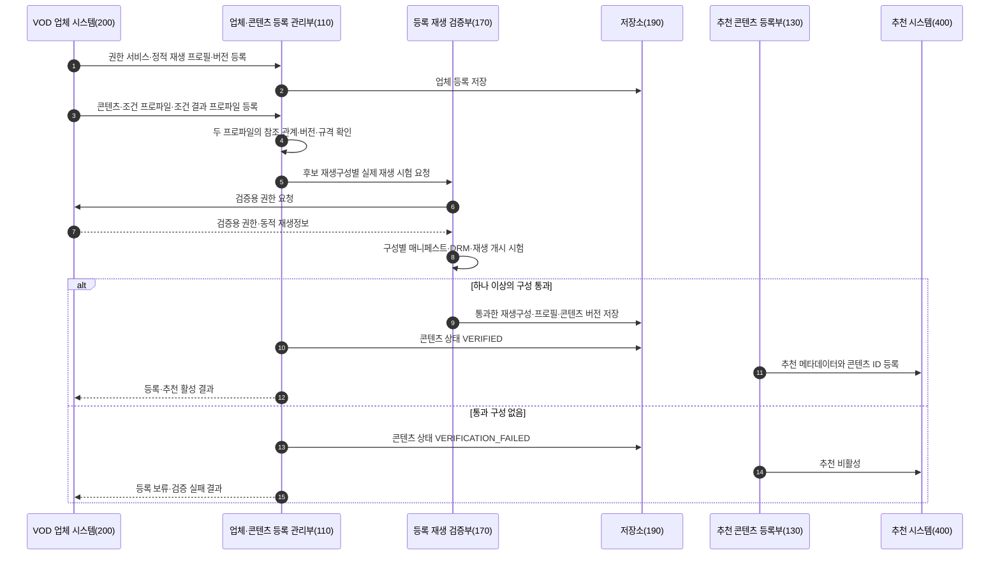

업체·콘텐츠 등록 관리부는 콘텐츠 등록 시 다음을 확인한다.

| 검증 대상 | 활성화 기준 | 실패·무효화 기준 |
|---|---|---|
| 업체 등록 | 권한 서비스 연결, 요청·응답 규격, 하나 이상의 정적 재생 프로필 및 버전 존재 | 권한 서비스 연결 실패, 규격 또는 프로필 누락 |
| 콘텐츠 등록 | 업체·콘텐츠 식별자, 추천 메타데이터, 조건·결과 프로파일 및 참조 버전 존재 | 참조 대상 없음, 제공 기간 종료, 조건과 결과의 연결 누락 |
| 조건·결과 프로파일 | 조건 판정 규칙, 결과 유형·규격·업체 확인 규칙·업체의 후속 처리·정산 방식 존재 | 결과 규격이나 확인 규칙 없음, 조건과 결과 버전 불일치 |
| 실제 재생 시험 | 후보 구성으로 권한 취득 후 매니페스트 접근 또는 재생 개시 성공 | 실행할 재생구성이 특정되지 않음, DRM 또는 재생 실패 |
| 추천 활성 | 검증된 재생구성이 하나 이상 존재하고 관련 버전이 일치하며 검증 유효 기간이 남아 있음 | 프로필·콘텐츠·결과 프로파일 변경, 검증 유효 기간 만료, 실행 불일치 |

업체 등록 후 정적 재생 프로필 또는 콘텐츠 등록 정보가 변경되더라도 재생·권한 판단에 영향을 주지 않는 필드의 변경까지 검증을 무효화할 필요는 없다. 다만 프로토콜, DRM, 코덱, 보안 수준, 권한 서비스, 콘텐츠 자산 또는 조건 결과 규격처럼 재생·권한 판단에 영향을 주는 값이 변경되면 기존의 검증된 재생구성집합을 무효화하고 재검증이 완료될 때까지 추천을 비활성화한다.

#### 2) 사용자 선택부터 권한 발급·재생까지의 흐름

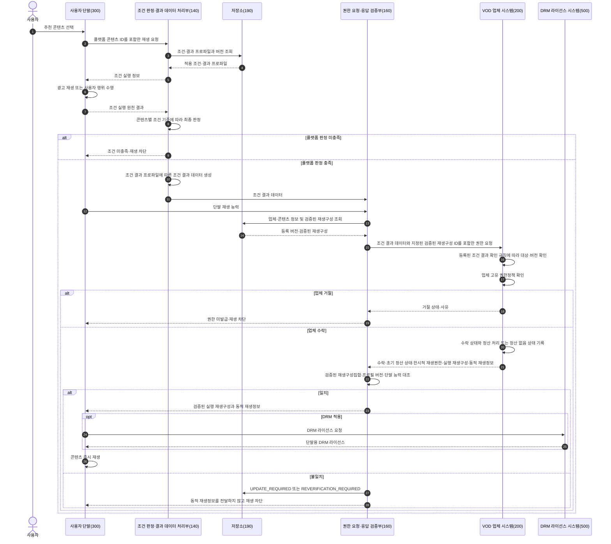

플랫폼이 조건을 충족한 것으로 판정했다는 사실만으로 외부 VOD 콘텐츠의 재생권한이 부여되는 것은 아니다. 조건 결과 데이터가 업체의 확인 규칙에 부합하고, 해당 요청이 업체 고유의 콘텐츠 권한정책을 충족하여 업체가 재생권한을 발급해야 재생 단계로 진행된다.

#### 3) 조건 유형별 판정·결과·업체 처리 실시예

| 조건 유형 | 원천 결과 | 플랫폼의 최종 판정 | 업체에 제공하는 조건 결과 | 업체의 확인 및 상태 기록 | 권한 처리 |
|---|---|---|---|---|---|
| 광고 시청 | 광고·캠페인 ID, 재생 시간, 완료 시각 | 해당 콘텐츠의 광고정책·완료 기준·캠페인 유효성 충족 여부 | 광고·캠페인 ID, 완료 시각, 적용 정산 규칙, 배분 기준 또는 계산 결과 | 등록된 광고 규칙과 결과 규격을 확인한 후 광고 정산 대기 상태 기록 | 수락 시 권한 발급 |
| 업체 부담 무료 프로모션 | 업체 캠페인, 대상 콘텐츠·기간 | 콘텐츠가 업체 무료 캠페인 대상인지 확인 | 캠페인 ID, 대상 콘텐츠, 적용 시각, 플랫폼의 콘텐츠 대가 부담 없음 | 업체 캠페인·권한정책 확인 후 정산 없음 상태 기록 | 수락 시 권한 발급 |
| 플랫폼 부담 프로모션 | 플랫폼 캠페인, 예산 예약·대상 콘텐츠 | 캠페인·예산·콘텐츠 적격성 충족 여부 | 예산 예약 ID, 업체 지급 예정 근거, 금액 또는 계산 규칙, 통화 | 등록된 프로모션 규칙 확인 후 플랫폼의 업체 지급 의무에 대한 정산 대기 상태 기록 | 수락 시 권한 발급 |
| 사용자 결제 | 결제 승인 ID, 금액·통화·승인 시각 | 등록 가격·통화·결제 상태와 승인 결과 일치 여부 | 결제 승인 정보, 승인 금액·통화, 적용 정산 규칙 | 승인 정보와 콘텐츠 가격정책 확인 후 결제 정산 대기 상태 기록 | 수락 시 권한 발급 |

광고 수익 배분율, 콘텐츠 가격 또는 프로모션 비용은 계약에 따라 달라질 수 있다. 본 발명의 핵심 기술적 관계는 결과값의 구체적인 수치가 아니라, 조건 유형에 맞는 결과 규격을 콘텐츠별로 등록하고 플랫폼이 생성한 조건 결과 데이터와 업체의 확인·상태 기록·권한 발급을 하나의 권한 거래로 연결하는 데 있다.

#### 4) 권한 거래 실행 기록

권한 거래 실행 기록은 특정 전송 객체의 형식에 한정되지 않으며, 다음 상태와 참조 관계를 저장하거나 추적하기 위한 논리적 기록이다.

- 권한 거래 식별자와 재생 세션 식별자
- 플랫폼·업체 콘텐츠 식별자
- 적용된 업체·콘텐츠·조건·결과·재생 프로필의 버전
- 조건 실행 원천 결과에 대한 참조 및 플랫폼의 판정 결과
- 업체에 제공한 조건 결과 데이터 식별자
- 업체의 결과 수락·거절 및 정산 처리 상태
- 검증된 재생구성 식별자와 실행 재생구성
- 업체 권한 식별자와 유효 시간
- 동적 재생정보의 보관 위치 또는 전달 상태
- 실제 재생 개시·완료·실패 결과

동적 재생정보는 추천 카탈로그와 분리된 실행 영역에 유지할 수 있다. 운영 로그에는 URL 또는 토큰의 원문 대신 권한 거래 식별자, 만료 시각, 검증 결과 및 오류 코드 등 필요한 최소한의 정보만 기록할 수 있다.

#### 5) 업체 확인·권한·정산 상태의 연결

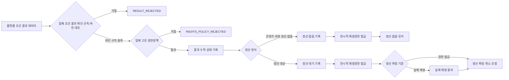

정산 상태는 다음과 같이 처리될 수 있다.

| 상태 | 의미 |
|---|---|
| `PENDING` | 업체가 결과를 수락하고 초기 정산 상태를 기록했으나 정산 확정 요건이 아직 충족되지 않음 |
| `CONFIRMED` | 정산 정책에서 요구하는 권한 발급 또는 유효한 재생 결과가 확인됨 |
| `CANCELLED` | 결제 취소, 캠페인 무효, 권한 발급 실패 또는 재생 실패로 정산이 취소됨 |
| `ADJUSTED` | 재생 결과 또는 계약 규칙에 따라 정산 기준이 조정됨 |
| `NO_SETTLEMENT` | 업체 부담 무료 프로모션 등에서 플랫폼이 콘텐츠 대가를 정산할 의무가 발생하지 않음 |

#### 6) 정상 실시예

1. **광고 시청 후 재생**
   사용자가 콘텐츠를 선택하면 플랫폼은 해당 콘텐츠의 광고 조건을 조회한다. 단말이 광고 실행 결과를 보고하면 플랫폼이 완료 기준을 적용하여 충족 여부를 판정한다. 플랫폼은 광고·캠페인·완료 시각 및 정산 규칙에 따른 결과 데이터를 업체에 보낸다. 업체는 조건 결과 확인 규칙과 콘텐츠 권한정책을 확인하고 광고 정산 대기 상태를 기록한 후 권한을 발급한다. 플랫폼은 반환된 구성이 검증된 재생구성집합과 일치할 때 동적 재생정보를 단말에 전달한다.

2. **업체 부담 무료 프로모션**
   플랫폼은 업체가 등록한 캠페인과 콘텐츠 적격성을 확인한다. 조건 결과 데이터에는 캠페인·콘텐츠 및 플랫폼의 콘텐츠 대가 부담 없음이 포함된다. 업체는 캠페인과 권한정책을 확인하고 `NO_SETTLEMENT`를 기록한 뒤 권한을 발급한다.

3. **플랫폼 부담 프로모션**
   플랫폼은 캠페인 대상과 예산 예약을 확인하고, 업체에 대한 사후 정산 근거를 포함한 결과 데이터를 생성한다. 업체는 결과를 수락하고 플랫폼의 업체 지급 의무에 대한 정산 대기 상태를 기록한 뒤 권한을 발급한다. 실제 재생 결과는 후속 정산 확정 또는 취소에 사용할 수 있다.

4. **사용자 결제 후 재생**
   플랫폼은 결제 승인 결과를 등록된 가격·통화와 대조하고, 승인 정보와 정산 규칙을 조건 결과 데이터에 포함한다. 업체는 이를 확인해 결제 정산 대기 상태를 기록한 뒤 권한을 발급한다.

#### 7) 실패 처리 및 상태 전이

| 오류 또는 불일치 | 플랫폼 또는 업체 처리 | 콘텐츠·거래 상태 |
|---|---|---|
| 원천 결과가 조건 기준을 충족하지 않음 | 플랫폼이 결과 데이터를 생성하지 않고 권한 요청 차단 | `PLATFORM_CONDITION_REJECTED` |
| 결과 데이터가 등록 규칙·버전과 불일치 | 업체가 거절 상태와 사유 반환 | `PROVIDER_RESULT_REJECTED` |
| 업체 고유 권한정책 불충족 | 업체가 권한을 발급하지 않음 | `RIGHTS_POLICY_REJECTED` |
| 정산에 필요한 필수 항목 또는 정산 방식 불일치 | 업체가 결과를 거절하거나 처리를 보류 | `SETTLEMENT_DATA_INVALID` |
| 실행 재생구성이 검증된 재생구성집합에 포함되지 않음 | 플랫폼이 동적 재생정보를 전달하지 않고 응답을 폐기 | `UNVERIFIED_PLAYBACK_CONFIGURATION` |
| 응답의 프로필·콘텐츠 버전 불일치 | 플랫폼이 동적 재생정보를 전달하지 않음 | `REGISTRATION_VERSION_MISMATCH` |
| 등록 정보 갱신 필요 상태 | 추천 비활성, 업체에 갱신 요청 | `UPDATE_REQUIRED` |
| 실제 재생에 대한 재검증 필요 | 추천 비활성, 재검증 대기 | `REVERIFICATION_REQUIRED` |
| 동적 URL·토큰 만료 | 만료된 정보로 재생을 시도하지 않고 적용되는 권한정책에 따라 새 권한 요청 | 권한 거래 재요청 또는 종료 |
| DRM 라이선스 취득 실패 | 재생 차단, 오류 기록, 필요 시 재검증 | 재생 실패 또는 `REVERIFICATION_REQUIRED` |

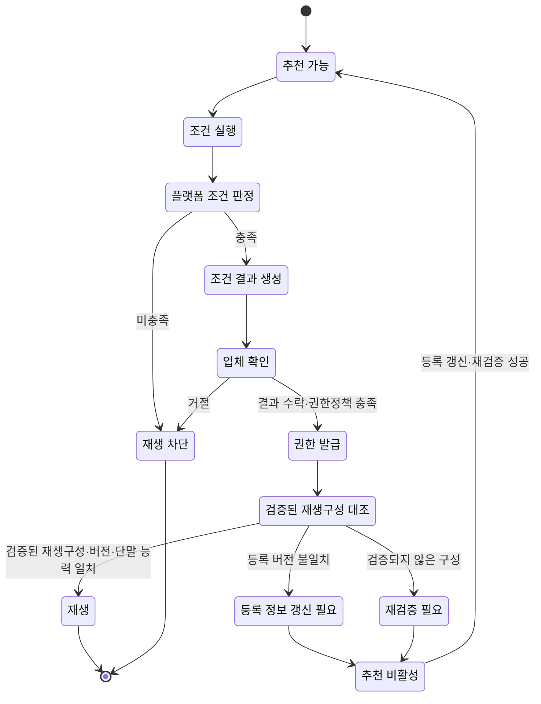

#### 8) 통신·보안 및 개인정보 실시예

기준 실시예와 대안 실시예에서 플랫폼과 업체는 업체 등록 시 정한 서비스 인증 프로필에 따라 상호 인증이 적용된 통신 채널을 사용한다. 요청·응답 서명, 타임스탬프와 일회성 난수(nonce), 동일 거래 식별자를 이용한 중복 요청 방지(멱등 처리), 그 밖에 통상적으로 사용되는 무결성 보호 및 재전송 방지 수단을 추가로 사용할 수 있다. 구체적인 인증 방식이나 암호 알고리즘 자체는 본 발명의 핵심으로 한정하지 않는다.

사용자에게 업체 전용 앱 설치나 업체 계정 **직접 로그인**을 요구하지 않지만, 이는 업체가 권한 판단에 필요한 이용 주체나 세션 정보를 식별하지 않는 익명 접근을 의미하지 않는다. 플랫폼은 재생 세션·권한 거래 식별자와 해당 업체의 서비스 범위에서만 유효한 가명 사용자 식별자를 사용할 수 있다. 업체가 법령 또는 계약에 따라 지역·동시 재생·단말 보안 수준 등의 정보를 요구하면 조건 결과 및 권한 판단에 필요한 최소한의 범위에서 제공할 수 있다.

실제 콘텐츠 URL, 접근 토큰 및 DRM 라이선스 요청 정보는 권한 유효 시간 동안만 실행 영역에 유지할 수 있다. DRM 콘텐츠 키는 추천 카탈로그에 저장하지 않고 단말의 기존 DRM 모듈 또는 콘텐츠 복호화 모듈의 보호 영역에서 처리할 수 있다.

### 다. 발명의 효과

1. 콘텐츠별 재생 전 조건과 그 조건의 충족에 따라 생성되는 결과를 하나의 버전 체계로 연결하여 업체의 권한 발급 근거를 명확히 할 수 있다.
2. 단말은 원천 결과를 보고하고 플랫폼이 조건 충족을 최종 판정하므로 조건 판단 주체의 혼선을 줄일 수 있다.
3. 업체는 결과 데이터의 등록 규칙과 고유 권한정책을 각각 확인하여 외부 VOD 콘텐츠에 대한 최종 권한 판단권을 유지하면서 플랫폼이 생성한 조건 결과 데이터를 사용할 수 있다.
4. 광고, 사용자 결제, 플랫폼 부담 프로모션과 업체 부담 프로모션을 서로 다른 결과·정산 상태로 처리하면서 공통 권한 요청 구조를 사용할 수 있다.
5. 조건 결과, 업체 수락, 권한 및 실제 재생을 하나의 권한 거래로 연결하여 사후 정산이나 정산 없음의 근거를 추적할 수 있다.
6. 등록 시 실제 시험을 통과한 구성만 실행에 허용하여 업체의 등록 정보 갱신 누락, 설정 전파 지연 또는 잘못된 응답으로 인한 비호환 재생을 차단할 수 있다.
7. 정적 재생구성과 동적 재생정보를 구분함으로써 세션마다 정상적으로 변경될 수 있는 URL·토큰을 허용하면서 프로토콜·DRM·코덱 변경은 통제할 수 있다.
8. 실행 응답 불일치 시 재생정보 전달 차단, 추천 비활성 및 재검증을 연결하여 검증 상태의 전이 과정을 자동화할 수 있다.
9. 실제 VOD URL, 장기 접근 토큰 및 DRM 키를 추천 카탈로그와 분리하여 보안과 동기화 위험을 줄일 수 있다.
10. 업체 전용 앱을 설치하거나 업체 계정으로 직접 로그인하지 않고도 플랫폼 내에서 외부 VOD 콘텐츠의 권한 획득과 재생을 연계할 수 있다.

<!-- page-break:page-5 -->

## 3. 권리화 아이디어 및 청구항 초안 — 변리사 검토용

이하 청구항은 직무발명서 단계의 권리화 초안이다. 출원 시에는 발명의 기준일을 확정하고, 정식 선행기술 조사 및 실제 구현 주체를 확인한 뒤 관할국 실무에 맞게 문언과 인용관계를 조정한다.

### 청구항 1

외부 VOD 콘텐츠의 재생을 중계하는 플랫폼 서버가 수행하는 방법에 있어서,

외부 VOD 콘텐츠별로 외부 VOD 업체의 콘텐츠 식별자, 상기 콘텐츠의 재생 전 조건을 정의하는 조건 프로파일, 상기 조건의 충족에 따라 생성할 결과의 유형과 데이터 규격 및 상기 외부 VOD 업체 시스템이 적용할 확인 규칙을 정의하는 조건 결과 프로파일, 및 정적 재생 프로필의 식별자와 버전에 대응하여 실제 재생 시험을 통과한 하나 이상의 재생구성을 포함하는 검증된 재생구성집합을 저장하는 단계;

상기 외부 VOD 콘텐츠가 사용자 단말에서 선택된 후, 조건 실행 주체로부터 상기 조건의 실행에 관한 원천 결과를 수신하고 상기 사용자 단말로부터 단말 재생 능력 정보를 수신하는 단계;

상기 조건 프로파일을 상기 원천 결과에 적용하여 상기 조건의 충족 여부를 상기 플랫폼 서버에서 판정하는 단계;

상기 조건이 충족된 것으로 판정된 경우, 상기 조건 결과 프로파일에 따라 조건 결과 데이터를 생성하는 단계;

권한 거래 식별자 및 재생 세션 식별자와, 상기 조건 결과 데이터와, 상기 검증된 재생구성집합에 포함된 재생구성의 식별자 또는 상기 단말 재생 능력 정보와 호환되는 복수의 재생구성 식별자를 포함하는 재생권한 요청을 상기 외부 VOD 업체 시스템으로 전송하는 단계;

상기 외부 VOD 업체 시스템으로부터, 상기 권한 거래 식별자 및 재생 세션 식별자와, 상기 조건 결과 데이터에 대한 업체의 수락 상태, 한시적 재생권한, 실행 재생구성, 상기 실행 재생구성에 적용된 정적 재생 프로필의 식별자와 버전 및 동적 재생정보를 포함하는 응답을 수신하는 단계;

상기 응답의 상기 실행 재생구성과 상기 정적 재생 프로필의 식별자 및 버전을, 상기 검증된 재생구성집합 및 상기 단말 재생 능력 정보와 대조하는 단계; 및

상기 업체의 수락 상태가 수락을 나타내고, 상기 응답에 포함된 권한 거래 식별자 및 재생 세션 식별자가 상기 재생권한 요청에 포함된 권한 거래 식별자 및 재생 세션 식별자와 일치하며, 상기 실행 재생구성이 상기 검증된 재생구성집합에 포함되고, 상기 정적 재생 프로필의 식별자와 버전이 상기 실행 재생구성과 연계하여 저장된 식별자 및 버전과 일치하며, 상기 실행 재생구성이 상기 사용자 단말에서 실행 가능한 경우에만 상기 동적 재생정보를 상기 사용자 단말에 전달하고, 그렇지 않은 경우 상기 동적 재생정보의 전달을 차단하는 단계

를 포함하는 외부 VOD 콘텐츠 재생 중계 방법.

### 청구항 2

청구항 1에 있어서,

상기 조건 결과 프로파일은 결과 유형, 결과 데이터 형식, 상기 외부 VOD 업체 시스템이 적용할 확인 규칙, 결과가 수락된 후 업체가 수행할 처리, 정산 방식 및 조건 결과 프로파일의 버전 중 둘 이상을 정의하고,

상기 조건 결과 데이터는 대상 콘텐츠 또는 업체 콘텐츠 식별자, 재생 세션 또는 권한 거래 식별자, 조건 프로파일의 식별자와 버전, 플랫폼 서버의 판정 결과, 결과 유형 및 조건 유형별 결과값을 포함하는 방법.

### 청구항 3

청구항 1에 있어서,

상기 조건 실행 주체는 상기 사용자 단말, 광고 시스템, 결제 시스템 또는 프로모션 시스템 중 하나 이상이고,

상기 조건 실행 주체가 상기 원천 결과를 생성하거나 보고하고, 상기 조건의 충족 여부에 대한 최종 판정은 상기 플랫폼 서버가 수행하는 방법.

### 청구항 4

청구항 1에 있어서,

상기 조건은 광고 시청, 사용자 결제, 플랫폼 부담 프로모션 및 외부 VOD 업체 부담 무료 프로모션 중 하나 이상이고,

상기 조건 결과 데이터는

광고 시청 조건에 대해서는 광고 또는 캠페인 식별 정보, 완료 시각 및 적용되는 정산 규칙에 따른 배분 기준 또는 계산 결과를,

사용자 결제 조건에 대해서는 결제 승인 정보, 승인 금액, 통화 및 적용되는 정산 규칙을,

플랫폼 부담 프로모션에 대해서는 플랫폼 캠페인, 예산 예약 정보 및 상기 외부 VOD 업체에 대한 지급 근거를, 또는

외부 VOD 업체 부담 무료 프로모션에 대해서는 업체 캠페인 정보, 대상 콘텐츠의 적격성 및 플랫폼의 콘텐츠 대가 정산이 없음을 나타내는 정보를

포함하는 방법.

### 청구항 5

청구항 1에 있어서,

상기 검증된 재생구성집합이 하나의 재생구성만 포함하는 경우 상기 실행 재생구성이 상기 하나의 재생구성과 일치하는지를 확인하고,

상기 검증된 재생구성집합이 복수의 재생구성을 포함하는 경우 상기 실행 재생구성이 상기 복수의 재생구성 가운데 상기 단말 재생 능력 정보와 호환되는 재생구성 중 하나와 일치하는지를 확인하는 방법.

### 청구항 6

청구항 1에 있어서,

상기 대조 결과가 등록 버전 불일치 또는 검증되지 않은 실행 재생구성을 나타내는 경우,

상기 동적 재생정보의 전달을 차단하고, 상기 외부 VOD 콘텐츠의 추천 가능 상태 또는 재생 가능 상태를 해제하며, 상기 정적 재생 프로필의 갱신 또는 상기 외부 VOD 콘텐츠의 실제 재생에 대한 재검증이 필요한 상태로 전이하는 방법.

### 청구항 7

청구항 1에 있어서,

상기 동적 재생정보는 재생 세션별 콘텐츠 URL, 매니페스트 위치, 접근 토큰, 재생권한 식별자, 만료 정보 및 DRM 라이선스 요청 정보 중 하나 이상을 포함하고,

상기 플랫폼 서버는 상기 동적 재생정보를 상기 재생 세션에 연계하여 전달하거나 한시적으로 유지하되, 상기 외부 VOD 콘텐츠의 DRM 복호화 키를 추천 카탈로그에 저장하지 않는 방법.

### 청구항 8

외부 VOD 업체 시스템이 수행하는 콘텐츠 재생권한 제공 방법에 있어서,

플랫폼 서버로부터 권한 거래 식별자, 업체 콘텐츠 식별자, 재생 세션 식별자, 조건 결과 데이터, 하나 이상의 검증된 재생구성에 관한 정보 및 사용자 단말의 재생 능력 정보를 포함하는 재생권한 요청을 수신하는 단계;

상기 조건 결과 데이터의 대상 콘텐츠, 결과 유형 및 조건 프로파일과 조건 결과 프로파일의 버전을 등록된 조건 결과 확인 규칙과 대조하고, 상기 외부 VOD 업체의 콘텐츠 권한정책을 적용하여 상기 재생권한 요청의 수락 여부를 결정하는 단계;

상기 수락 여부를 상기 재생권한 요청 및 상기 조건 결과 데이터에 연계하여 기록하고, 정산이 요구되는 조건인 경우에는 정산 처리 상태를, 정산이 요구되지 않는 조건인 경우에는 정산 없음 상태를 상기 재생권한 요청 및 상기 조건 결과 데이터에 연계하여 기록하는 단계;

상기 재생권한 요청이 수락된 경우, 상기 하나 이상의 검증된 재생구성 중 상기 사용자 단말에서 실행 가능한 실행 재생구성에 대응하는 한시적 재생권한 및 동적 재생정보를 생성하는 단계; 및

상기 권한 거래 식별자, 상기 업체 콘텐츠 식별자, 상기 재생 세션 식별자, 상기 실행 재생구성, 상기 실행 재생구성에 적용된 정적 재생 프로필의 식별자와 버전, 상기 한시적 재생권한, 상기 동적 재생정보 및 상기 수락 여부를 포함하는 응답을 상기 플랫폼 서버로 전송하는 단계

를 포함하는 콘텐츠 재생권한 제공 방법.

### 청구항 9

청구항 8에 있어서,

상기 콘텐츠 권한정책은 서비스 지역, 이용 가능 기간, 동시 재생 제한 또는 콘텐츠 제공 계약 상태 중 하나 이상을 포함하고,

상기 외부 VOD 업체 시스템은 상기 플랫폼 서버가 수행한 조건 충족 판정을 다시 수행하는 대신, 상기 조건 결과 데이터의 대상 콘텐츠, 결과 유형, 조건 프로파일 및 조건 결과 프로파일의 버전, 그리고 확인 규칙에서 요구하는 조건별 결과값 중 하나 이상을 상기 등록된 조건 결과 확인 규칙과 대조하는 방법.

### 청구항 10

청구항 8에 있어서,

상기 외부 VOD 업체 시스템은 상기 권한 거래 식별자, 업체 콘텐츠 식별자, 재생 세션 식별자, 조건 프로파일 식별자 및 상기 조건 결과 데이터에 포함된 조건 결과 식별자에 연계하여 상기 조건 결과의 수락 또는 거절 상태를 기록하고,

정산이 요구되는 조건인 경우 업체 정산 기록을 생성하고 이를 정산 대기, 정산 확정, 정산 취소 또는 정산 조정 상태로 설정하거나 변경하며, 정산이 요구되지 않는 조건인 경우 정산 없음 상태를 기록하는 방법.

### 청구항 11

플랫폼 서버가 외부 VOD 콘텐츠를 등록하고 검증하는 방법에 있어서,

외부 VOD 콘텐츠에 대한 업체 콘텐츠 식별자와, 스트리밍 프로토콜, DRM 방식, 코덱 및 보안 수준 중 하나 이상을 포함하는 정적 재생 프로필 및 그 버전을 등록하는 단계;

외부 VOD 업체 시스템으로부터 검증용 재생권한을 발급받아 하나 이상의 후보 재생구성에 대해 실제 재생 시험을 수행하는 단계;

상기 실제 재생 시험을 통과한 후보 재생구성을 상기 외부 VOD 콘텐츠 및 상기 정적 재생 프로필의 식별자와 버전에 연계하여 검증된 재생구성집합으로 저장하는 단계;

상기 검증된 재생구성집합이 존재하는 외부 VOD 콘텐츠에 대해서만 재생 가능 상태 또는 추천 가능 상태를 부여하는 단계; 및

상기 정적 재생 프로필의 변경 또는 실행 시점의 재생구성 불일치가 확인된 경우 기존 검증 상태를 무효화하고 등록 정보 갱신 또는 재검증이 필요한 상태로 전이하는 단계

를 포함하는 외부 VOD 콘텐츠 등록·검증 방법.

### 청구항 12

청구항 11에 있어서,

상기 실제 재생 시험은 동적 재생정보의 획득, 매니페스트 또는 미디어 세그먼트에 대한 접근, DRM 라이선스 획득 및 미디어 재생 개시 중 하나 이상을 포함하고,

상기 검증된 재생구성집합의 각 기록은 콘텐츠 식별자, 정적 재생 프로필 식별자와 버전, 스트리밍 프로토콜, DRM 방식, 코덱, 보안 수준, 시험 결과 및 시험 시각 중 하나 이상을 포함하는 방법.

### 청구항 13

청구항 11에 있어서,

상기 정적 재생 프로필의 버전 변경, 기존 검증된 재생구성집합에 포함되지 않은 실행 재생구성의 수신 또는 실제 재생 실패 중 하나 이상이 발생한 경우 상기 재생 가능 상태 또는 추천 가능 상태를 해제하고,

갱신된 정적 재생 프로필 또는 콘텐츠 등록 정보의 버전에 대하여 검증용 재생권한을 다시 발급받아 실제 재생 시험을 수행하는 방법.

### 청구항 14

외부 VOD 콘텐츠의 재생을 중계하는 플랫폼 시스템에 있어서,

콘텐츠별 조건 프로파일, 조건 결과 프로파일, 업체 콘텐츠 식별자 및 정적 재생 프로필의 버전에 대응하는 검증된 재생구성집합을 저장하는 저장부;

조건 실행 주체로부터 수신된 원천 결과에 상기 조건 프로파일을 적용하여 조건 충족 여부를 최종 판정하는 조건 판정부;

상기 판정에 따라 상기 조건 결과 프로파일에 대응하는 조건 결과 데이터를 생성하고 외부 VOD 업체 시스템에 재생권한 요청을 전송하는 결과 데이터 처리부;

상기 외부 VOD 업체 시스템의 응답에 포함된 조건 결과의 수락 상태, 실행 재생구성 및 정적 재생 프로필의 버전을 상기 검증된 재생구성집합 및 사용자 단말의 재생 능력 정보와 대조하는 재생구성 검증부; 및

상기 조건 결과의 수락 상태가 수락을 나타내고 상기 대조 결과가 일치하는 경우에만 동적 재생정보를 상기 사용자 단말에 전달하며, 그렇지 않은 경우 상기 동적 재생정보의 전달을 차단하는 재생 중계부

를 포함하는 플랫폼 시스템.

### 청구항 15

청구항 14에 있어서,

검증용 재생권한을 이용하여 후보 재생구성의 실제 재생 시험을 수행하고, 성공한 재생구성을 콘텐츠 및 정적 재생 프로필의 버전에 연계하여 저장하며, 상기 정적 재생 프로필의 변경 또는 실행 재생구성의 불일치가 확인되면 기존 검증 상태를 무효화하는 등록 재생 검증부를 더 포함하는 플랫폼 시스템.

### 청구항 16

외부 VOD 콘텐츠 제공 시스템에 있어서,

플랫폼 서버로부터 요청 식별자, 콘텐츠 식별자, 재생 세션 식별자, 조건 결과 데이터 및 검증된 재생구성에 관한 정보를 포함하는 재생권한 요청을 수신하는 수신부;

상기 조건 결과 데이터를, 등록된 조건 결과 확인 규칙, 대상 콘텐츠, 조건 프로파일의 버전 및 조건 결과 프로파일의 버전과 대조하고 외부 VOD 업체 고유의 콘텐츠 권한정책을 적용하는 권한 판정부;

상기 조건 결과의 수락 또는 거절 상태와, 정산이 요구되는 경우 정산 처리 상태 또는 정산이 요구되지 않는 경우 정산 없음 상태를 요청 식별자, 콘텐츠 식별자 및 재생 세션 식별자에 연계하여 기록하는 상태 기록부; 및

수락된 요청에 대해 상기 검증된 재생구성에 대응하는 한시적 재생권한과 동적 재생정보를 생성하여 상기 플랫폼 서버로 전송하는 재생권한 발급부

를 포함하는 외부 VOD 콘텐츠 제공 시스템.

### 청구항 17

외부 VOD 콘텐츠를 재생하는 사용자 단말에 있어서,

플랫폼 서버로부터 콘텐츠 정보를 수신하고 콘텐츠 선택 입력을 받는 사용자 인터페이스;

상기 콘텐츠 선택 입력에 따라 선택된 외부 VOD 콘텐츠에 대응하는 조건을 실행하고 상기 조건 실행의 원천 결과를 상기 플랫폼 서버로 전송하는 조건 실행부;

상기 사용자 단말의 스트리밍 프로토콜, DRM 방식, 코덱 또는 보안 수준에 관한 재생 능력 정보를 상기 플랫폼 서버로 전송하는 능력 보고부; 및

상기 플랫폼 서버가 조건이 충족된 것으로 판정하고 실행 재생구성이 검증된 재생구성집합과 일치함을 확인한 후 전달한 동적 재생정보를 이용하여 상기 외부 VOD 콘텐츠를 재생하는 플레이어

를 포함하고,

상기 조건 실행부가 상기 원천 결과를 보고하되, 상기 조건 충족 여부의 최종 판정은 상기 플랫폼 서버가 수행하도록 구성되는 사용자 단말.

### 청구항 18

청구항 17에 있어서,

상기 플레이어는 상기 동적 재생정보에 포함된 DRM 라이선스 요청 정보를 이용하여 상기 외부 VOD 업체 시스템 또는 DRM 라이선스 서버로부터 DRM 라이선스를 취득하고, 상기 DRM 라이선스를 이용하여 상기 외부 VOD 콘텐츠의 재생을 개시하는 사용자 단말.

### 청구항 19

프로세서에 의해 실행될 때 청구항 1 내지 청구항 7 중 어느 한 항에 따른 방법 또는 청구항 11 내지 청구항 13 중 어느 한 항에 따른 방법을 수행하게 하는 명령어가 저장된 컴퓨터 판독 가능한 비일시적 기록매체.

### 추가 종속항 또는 분할출원 후보

1. 업체가 조건 결과 데이터의 일부를 참조값으로 수신하고, 사전에 합의된 조회 인터페이스를 통해 전체 결과를 확인하는 구성
2. 복수의 검증된 재생구성 중 플랫폼이 실행 재생구성을 지정하는 구성과 업체가 후보 중 하나를 선택하는 구성을 각각 별도 종속항으로 한정하는 구성
3. 조건 결과 프로파일 변경 시 조건 판정 규칙은 유지하되 업체 확인 규칙과 정산 상태 처리만 갱신하는 구성
4. 콘텐츠 재생 중 추가 조건이 요구되면 후속 재생 구간의 조건 결과·권한 거래를 별도로 생성하는 구성
5. 업체의 결과 거절 사유와 플랫폼 판정 기록을 대조하여 등록된 조건 결과 프로파일의 갱신을 요청하는 구성
6. 실제 재생 결과가 정산 확정 요건인 조건과 권한 발급만으로 정산이 확정되는 조건을 구분하는 구성
7. 동적 재생정보를 사용자 단말에 직접 전달하지 않고 유효 기간이 짧은 프록시 참조값으로 전달하는 구성
8. 업체가 실행 재생구성·프로필·버전과 동적 재생정보 취득용 일회용 참조값을 플랫폼에 먼저 반환하고, 플랫폼이 일치 여부를 확인한 후 단말이 해당 참조값을 이용해 업체로부터 동적 재생정보를 직접 취득하는 구성
9. 업체가 결과 수락과 초기 정산 처리 상태를 권한 발급 전에 권한 거래와 연계하여 기록하되, 상세 정산 기록과 후속 상태를 비동기 방식으로 통지하는 구성
10. 대표 미디어 자산을 이용하여 프로필 단위로 실제 재생 시험을 수행하고, 대상 콘텐츠별 권한 및 매니페스트 또는 자산 접근 유효성을 별도로 확인한 경우에만 해당 콘텐츠의 검증 상태를 부여하는 구성

<!-- page-break:page-6 -->

## 4. 도면

도 1과 도 2는 종래 구조를, 도 3 내지 도 6은 본 발명의 **기준 실시예**를 나타낸다. 업체가 호환 가능한 후보 재생구성 중 실행 재생구성을 선택하는 방식 등의 대안 실시예는 제2장 ‘가. 발명의 구성’의 제5항·제6항 및 제3장 ‘추가 종속항 또는 분할출원 후보’를 참조한다.

### 가. 종래기술 도면

#### 도 1. 업체 앱 중심의 VOD 재생

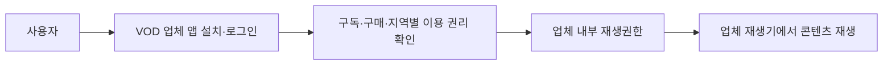

도 1은 사용자 진입, 권한 판단 및 재생이 단일 VOD 업체 앱 및 계정 체계 내에서 수행되는 구조를 나타낸다.

#### 도 2. 조건과 콘텐츠 접근의 일반적 연결

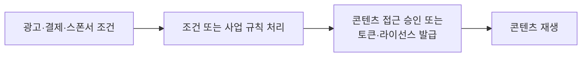

도 2는 조건 처리 후 콘텐츠 접근을 허용하는 일반적인 구조를 나타낸다. 본 발명은 이러한 구조 자체가 아니라, 조건별 결과 규격, 업체의 수락·정산 상태·권한 발급, 등록 시 검증된 재생구성과 실행 재생구성 간 일치 제어를 결합한 점에 특징이 있다.

### 나. 본 발명 도면

#### 도 3. 전체 시스템과 역할 경계

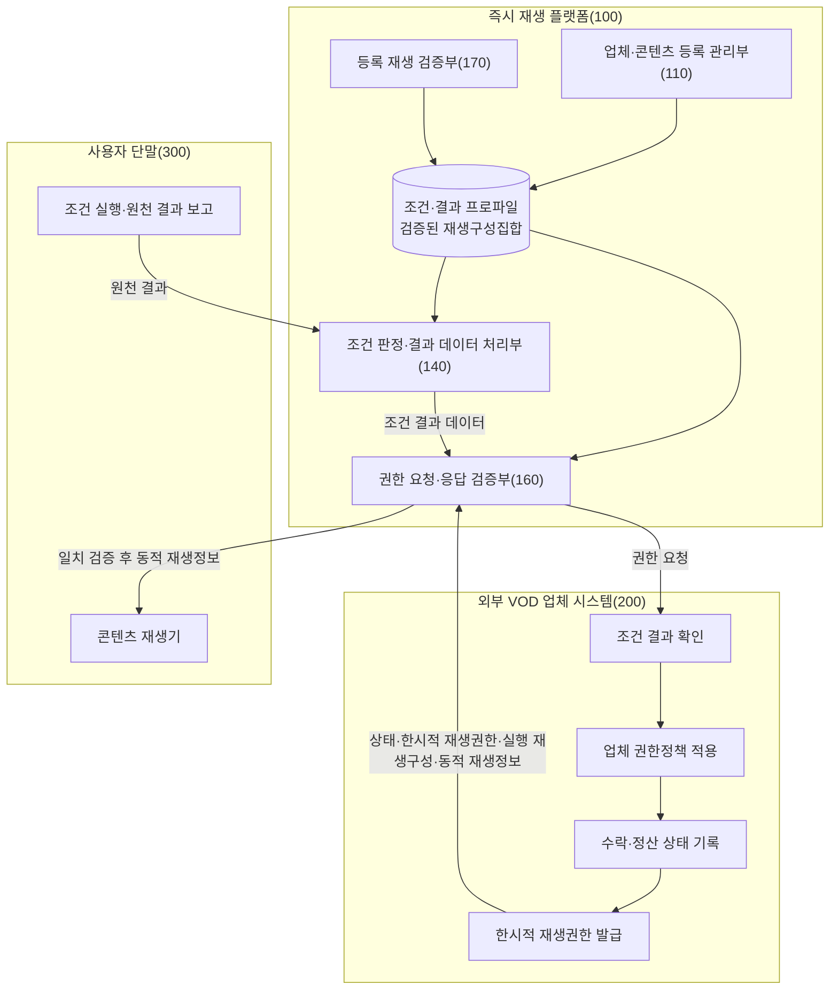

도 3은 플랫폼이 조건 충족을 최종 판정하고, 업체가 결과 규칙과 고유 권한정책을 확인해 상태를 기록한 후 권한을 발급하며, 플랫폼이 실행 재생구성을 다시 확인하는 역할 분담을 나타낸다.

#### 도 4. 등록 정보·검증 정보·동적 재생정보의 분리

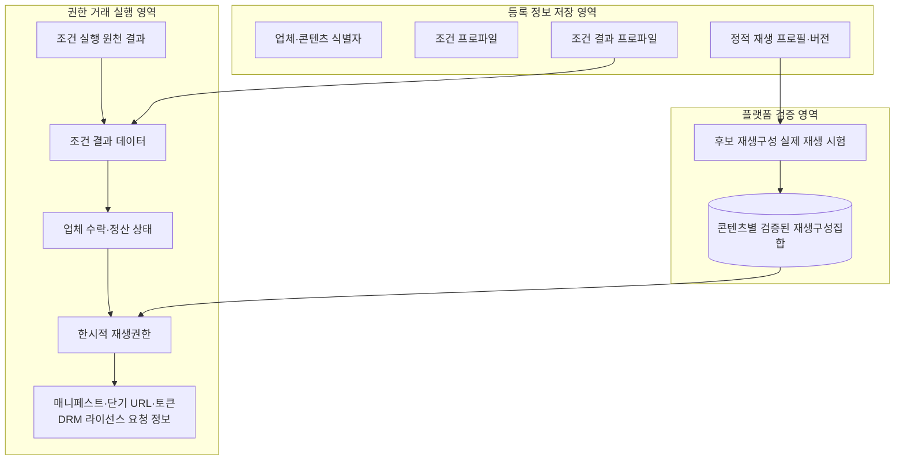

도 4에서 등록 정보 저장 영역은 정적 데이터와 버전을 저장하고, 검증 영역은 실제 재생 시험을 통과한 재생구성을 저장하며, 실행 영역은 권한 거래별로 달라지는 동적 재생정보를 처리한다.

#### 도 5. 조건 결과 확인 후 업체 권한 취득

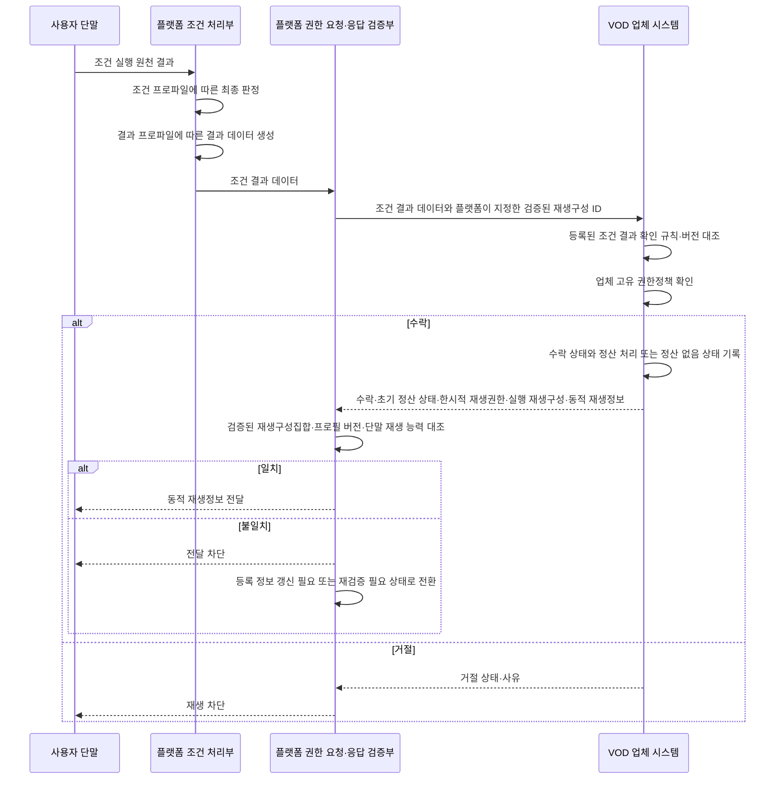

도 5는 조건 결과 생성부터 업체의 결과 확인·상태 기록·권한 발급, 플랫폼의 검증된 재생구성과의 일치 확인까지 이어지는 순서를 나타낸다.

#### 도 6. 등록 검증 및 실행 불일치에 따른 상태 전이

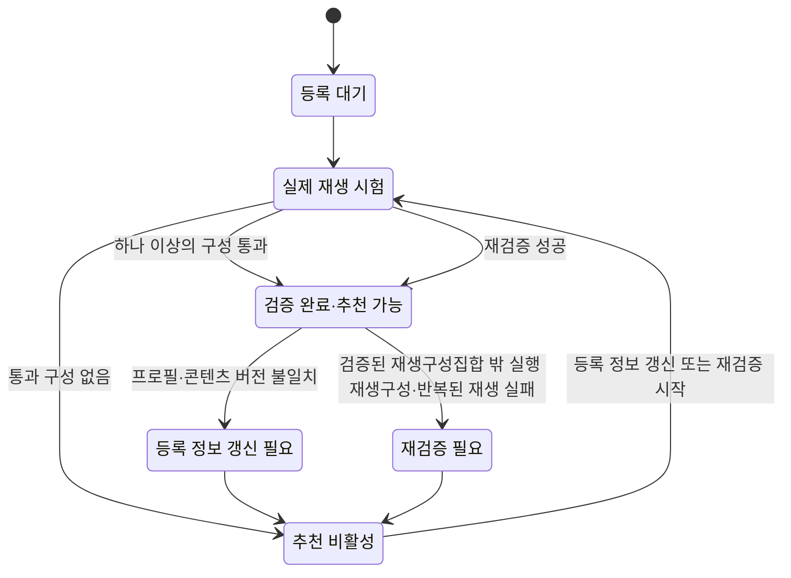

도 6은 등록 시 실제 재생 시험을 통과한 재생구성을 기준으로 추천 가능 상태를 부여하고, 실행 중 불일치가 발생하면 추천을 중지한 후 등록 정보를 갱신하고 재검증하는 상태 전이 과정을 나타낸다.
