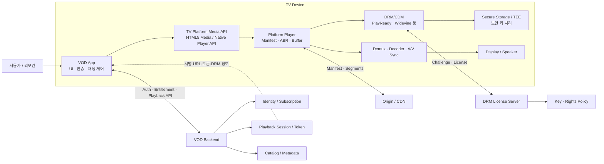
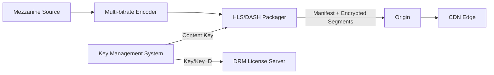
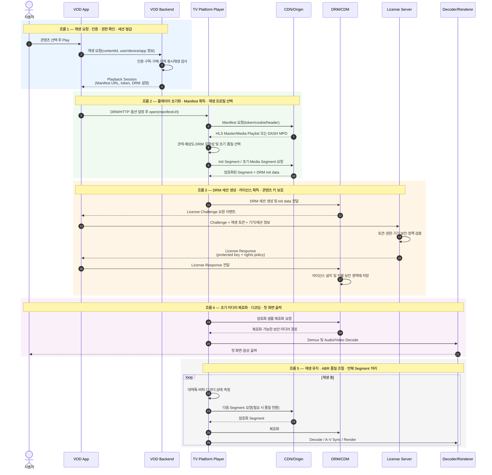
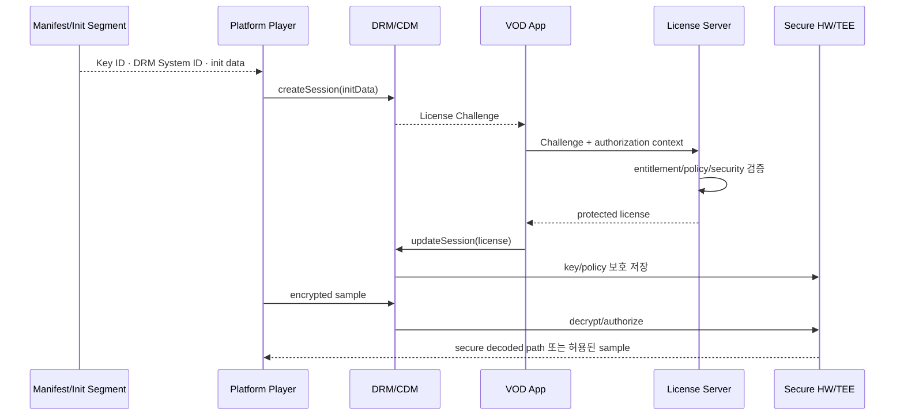
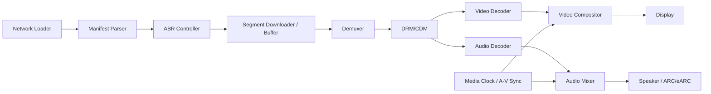
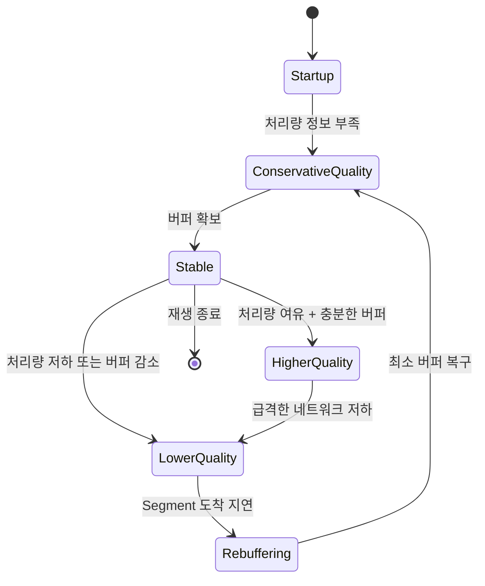
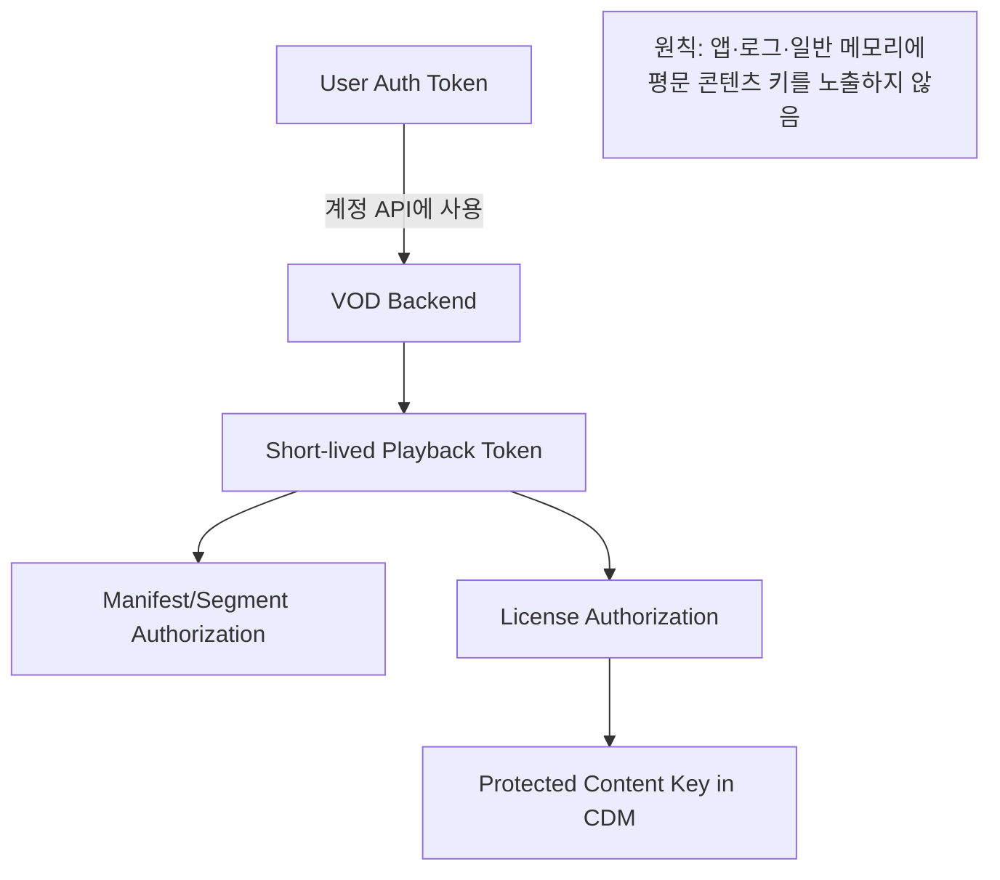

# TV 플랫폼 기반 VOD 스트리밍 구조와 처리 흐름

## 1. 목적과 범위

이 문서는 스마트 TV 환경에서 사용자가 VOD 앱을 통해 콘텐츠 재생을 요청했을 때, **VOD 앱**, **TV 플랫폼 플레이어**, **VOD 사업자 서버**, **CDN**, **DRM 시스템**이 어떻게 협력하는지 구조적 관점에서 설명한다.

주요 범위는 다음과 같다.

- HLS 및 MPEG-DASH 기반 적응형 스트리밍
- 인증, 이용 권한 확인, 재생 세션 발급
- DRM 초기화, 라이선스 획득, 복호화
- Manifest 및 미디어 Segment 요청
- ABR(Adaptive Bitrate) 품질 선택
- TV 내부 디코딩 및 화면·음성 출력
- 장애, 갱신, 보안 경계

---

## 2. 전체 시스템 구조



### 구성요소별 책임

| 구성요소 | 핵심 책임 | 보유하거나 처리하는 정보 |
|---|---|---|
| VOD 앱 | UI, 로그인, 콘텐츠 선택, 재생 요청, 플레이어 제어 | 사용자 토큰, 콘텐츠 ID, 앱 상태 |
| TV 플랫폼 | 네트워크 재생, 버퍼링, ABR, DRM 연동, 디코딩, 출력 | Manifest, 트랙 정보, 버퍼 상태 |
| VOD Backend | 인증 연계, 권한 확인, 동시 재생 제한, 재생 세션 생성 | 계정·구독·지역·기기 정책 |
| CDN/Origin | Manifest와 암호화된 미디어 Segment 전달 | MPD/M3U8, init/media Segment |
| DRM License Server | Challenge 검증 및 라이선스 발급 | 콘텐츠 키, 권한·만료·출력 정책 |
| CDM/보안 영역 | 라이선스 처리, 키 보호, 미디어 복호화 | 보호된 콘텐츠 키와 DRM 세션 |

VOD 앱은 일반적으로 콘텐츠 키를 직접 취급하지 않는다. 키와 복호화 처리는 TV 플랫폼의 CDM(Content Decryption Module)과 보안 실행 영역이 담당한다.

---

## 3. 콘텐츠 준비 및 배포 구조

재생 전에 VOD 사업자는 원본 콘텐츠를 여러 화질과 코덱 조합으로 인코딩하고, 짧은 구간의 Segment로 패키징한다.



패키저는 콘텐츠를 암호화하고 Manifest에 DRM 초기화 정보 또는 그 참조를 기록한다. 미디어 파일과 라이선스는 서로 다른 경로로 제공되므로, CDN에서 암호화 Segment를 얻더라도 유효한 라이선스 없이는 정상적으로 재생할 수 없다.

---

## 4. 사용자 재생 요청의 전체 흐름



### 단계별 해설

1. **재생 의도 수신**: 앱이 콘텐츠 ID와 현재 사용자·기기 상태를 조합한다.
2. **재생 권한 확인**: Backend가 로그인, 구독 상품, 구매 여부, 연령, 국가, 동시 스트림 수 등을 확인한다.
3. **재생 세션 생성**: Backend가 짧은 수명의 재생 토큰, Manifest URL, DRM 방식과 License URL 등을 반환한다.
4. **플레이어 초기화**: 앱은 TV 플랫폼 API에 URL과 DRM/HTTP 옵션을 설정한다. 플랫폼별로 설정 순서와 API 명칭은 다르다.
5. **Manifest 해석**: 플랫폼 플레이어가 재생 가능한 코덱, 해상도, HDR, 오디오, 자막 Representation을 고른다.
6. **DRM 세션 구성**: Manifest 또는 Init Segment의 DRM 초기화 정보를 CDM에 전달한다.
7. **라이선스 획득**: CDM이 만든 Challenge를 License Server에 보내고, 권한 정책과 보호된 키가 포함된 응답을 CDM에 설치한다.
8. **초기 버퍼 형성**: Init Segment와 일정 분량의 Media Segment를 받아 복호화·디코딩한다.
9. **재생 시작**: 충분한 버퍼와 첫 디코딩 프레임이 준비되면 영상과 음성을 동기화해 출력한다.
10. **지속 재생**: 플레이어가 네트워크와 버퍼를 관찰하면서 다음 Segment의 품질을 조정한다.

---

## 5. 스트리밍 방식 상세

### HLS

HLS는 M3U8 Playlist를 사용한다.

- Master Playlist: 화질, 대역폭, 코덱, 오디오·자막 그룹을 기술
- Media Playlist: 선택한 트랙의 Segment 순서와 주소를 기술
- Segment: MPEG-TS 또는 fragmented MP4 형태가 일반적
- DRM: TV 상용 환경에서는 플랫폼 지원 범위에 따라 보호 방식이 결정됨

```text
Master.m3u8
 ├─ video_2160p.m3u8 → init.mp4, seg-001.m4s, seg-002.m4s ...
 ├─ video_1080p.m3u8 → init.mp4, seg-001.m4s, seg-002.m4s ...
 ├─ audio_ko.m3u8
 └─ subtitle_ko.m3u8
```

### MPEG-DASH

DASH는 MPD(Media Presentation Description)를 사용한다.

- Period: 콘텐츠 타임라인의 구간
- AdaptationSet: 영상, 음성, 자막 같은 트랙 그룹
- Representation: 특정 코덱·비트레이트·해상도 버전
- SegmentTemplate/SegmentTimeline: Segment URL과 시간 정보
- DRM: `ContentProtection` 요소와 Init Segment의 보호 정보를 통해 CDM 초기화

```text
Manifest.mpd
 └─ Period
    ├─ AdaptationSet (video)
    │  ├─ Representation 2160p
    │  ├─ Representation 1080p
    │  └─ Representation 720p
    ├─ AdaptationSet (audio-ko)
    └─ AdaptationSet (subtitle-ko)
```

### 비교

| 구분 | HLS | MPEG-DASH |
|---|---|---|
| Manifest | M3U8 | MPD(XML) |
| 표준화 기반 | Apple 중심으로 발전 | MPEG 국제 표준 |
| 미디어 형식 | TS, fMP4 | 주로 fMP4/WebM |
| 품질 단위 | Variant/Playlist | Representation |
| 공통 기능 | VOD/Live, ABR, 다중 오디오, 자막, 광고 연계 | VOD/Live, ABR, 다중 오디오, 자막, 광고 연계 |

실제 선택은 TV 모델의 컨테이너·코덱·DRM 조합 지원, VOD 사업자의 패키징 방식, CDN 전략에 의해 결정된다.

---

## 6. DRM 처리 상세

DRM은 콘텐츠 암호화와 재생 권한 정책을 결합한다. 대표적인 TV DRM으로 PlayReady와 Widevine이 있으며, 제조사·지역·모델에 따라 지원 조합이 다르다.



### 라이선스에 포함될 수 있는 정책

- 재생 시작·종료 또는 라이선스 만료 시각
- 재생 가능 횟수나 기간
- 온라인/오프라인 허용 여부
- 최대 해상도 또는 보안 수준
- HDCP 같은 출력 보호 요구
- 갱신 조건과 재생 중 heartbeat

### 앱과 플랫폼의 DRM 역할 분리

- 앱은 사업자 인증 토큰과 License Server 통신 정책을 관리한다.
- CDM은 Challenge 생성, 응답 해석, 키 보관과 복호화를 담당한다.
- 플랫폼은 암호화 샘플을 CDM과 디코더 사이의 안전한 경로로 전달한다.
- 사업자 서버는 계정 권리와 DRM 라이선스 정책을 연결한다.

---

## 7. TV 플랫폼 내부 재생 파이프라인



앱이 `play()`를 호출하더라도 곧바로 영상이 출력되는 것은 아니다. 플랫폼은 Manifest 해석, DRM 준비, 초기 Segment 다운로드, 버퍼 확보, 디코더 준비를 완료한 뒤 재생 상태로 전환한다. 앱은 준비, 버퍼링, 재생, 일시정지, 종료, 오류 이벤트를 받아 UI에 반영한다.

---

## 8. ABR과 버퍼링

ABR은 다음 정보를 함께 사용해 Representation을 선택한다.

- 최근 Segment 다운로드 처리량
- 현재 버퍼 길이
- 화면 해상도와 디코더 성능
- 비트레이트 전환 안정성
- CDN 응답 지연과 오류율
- 사용자가 선택한 데이터 절약·최고 화질 정책



높은 화질을 선택하는 것보다 재생 중단을 방지하는 것이 보통 우선된다. 초기에는 보수적인 품질로 빨리 시작하고 측정값이 안정되면 점진적으로 올리는 전략이 일반적이다.

---

## 9. API 관점의 예시

아래 코드는 특정 제조사 API가 아닌 개념적 흐름이다.

```javascript
const playback = await vodApi.createPlaybackSession({
  contentId,
  deviceId,
  capabilities: tvPlatform.getMediaCapabilities()
});

player.setHttpHeaders({
  Authorization: `Bearer ${playback.playbackToken}`
});

player.configureDrm({
  system: playback.drmSystem,
  licenseUrl: playback.licenseUrl,
  acquireLicense: async (challenge) => {
    return vodApi.acquireLicense({
      challenge,
      playbackToken: playback.playbackToken
    });
  }
});

player.open(playback.manifestUrl);
player.on("ready", () => player.play());
player.on("buffering", updateLoadingUi);
player.on("error", handlePlaybackError);
```

플랫폼에 따라 DRM 속성을 `open()` 전 설정해야 하거나, 플랫폼이 License URL 요청을 직접 수행하거나, 앱이 Challenge/Response를 중계해야 할 수 있다.

---

## 10. 토큰과 URL의 보안 경계



권장 원칙은 다음과 같다.

- 계정용 장기 토큰과 재생용 단기 토큰을 분리한다.
- Manifest/Segment URL 또는 쿠키에 짧은 만료 시간을 적용한다.
- 라이선스 요청을 재생 세션, 기기, 콘텐츠와 결합한다.
- 민감한 토큰, Challenge, License 전문을 로그에 남기지 않는다.
- TLS를 사용하고 필요하면 요청 서명과 재전송 방지 값을 추가한다.
- 앱 종료·로그아웃·재생 종료 시 세션과 민감 상태를 정리한다.

---

## 11. 주요 오류와 복구 흐름

| 구간 | 대표 오류 | 처리 방향 |
|---|---|---|
| 인증/권한 | 로그인 만료, 구독 없음, 지역 제한 | 토큰 갱신 또는 명확한 사용자 안내 |
| Playback API | 동시 재생 초과, 세션 발급 실패 | 기존 세션 정리 안내, 제한된 재시도 |
| Manifest | 401/403/404, 파싱 실패 | URL·토큰 갱신, 포맷 호환성 확인 |
| DRM | 미지원 DRM, License 거절·만료 | 호환 프로필 선택, 권한 재검사 |
| Segment | CDN timeout, 5xx | 지수 백오프, 다른 CDN/품질로 전환 |
| Decoder | 미지원 코덱/HDR/레벨 | 호환 Representation 선택 또는 오류 안내 |
| Output | HDCP 미충족 | 보호 출력 경로 안내 또는 정책상 재생 차단 |

재시도는 계층별로 중복 수행하지 않도록 설계해야 한다. 앱, 플레이어, 네트워크 라이브러리가 각각 독립적으로 무제한 재시도하면 요청 폭증과 긴 대기 시간이 발생할 수 있다.

---

## 12. 요약

TV VOD 스트리밍은 앱 하나가 모든 기능을 수행하는 구조가 아니다. VOD 앱은 사용자 경험과 사업자 재생 세션을 관리하고, VOD Backend는 인증·이용 권한과 재생 정책을 판단하며, CDN은 Manifest와 암호화된 미디어 Segment를 전달한다. TV Platform Player는 Manifest 해석, ABR, 버퍼링, DRM 연동, 디코딩과 출력을 담당한다.

핵심 처리 경로는 다음과 같다.

```text
사용자 Play
→ 인증·Entitlement 확인
→ Playback Session 발급
→ Manifest 획득·해석
→ DRM Challenge/License 교환
→ Segment 다운로드
→ 보안 복호화
→ Demux/Decode/A-V Sync
→ 화면·음성 출력
→ ABR 기반 반복 다운로드
```

앱 설치와 VOD 로그인을 광고 시청으로 대체하는 별도 서비스 구조는 [Instant Play Platform](./instant_play_platform.md) 문서에서 설명한다.
