<!-- page-break:page-1 -->

대외비

<table>
  <tr>
    <td colspan="10" style="text-align:center; font-weight:bold;">직무발명(고안) 명세서<br>(Invention Disclosure)</td>
  </tr>
  <tr>
    <td colspan="10">● 발명의 명칭 (Title of Invention)</td>
  </tr>
  <tr>
    <td colspan="2">한글</td>
    <td colspan="8">스마트 TV 환경에서 광고 기반 UPD 앱리스 재생 방법 및 시스템</td>
  </tr>
  <tr>
    <td colspan="2">영어</td>
    <td colspan="8">Method and System for Advertising-Based App-Less UPD Playback in a Smart TV Environment</td>
  </tr>
  <tr>
    <td colspan="10">● 관련 선행기술 및 선출원</td>
  </tr>
  <tr>
    <td rowspan="6">기술출처</td>
    <td colspan="2" rowspan="2">유사특허/논문 등</td>
    <td>명칭</td>
    <td colspan="6">스마트 TV 통합 검색 및 추천, VOD 앱 딥링크 재생, AVOD/FAST 광고 기반 재생, DRM 라이선스 발급, 앱 설치/로그인 상태 감지, 통합 미디어 플레이어 및 광고 정산 관련 문헌</td>
  </tr>
  <tr>
    <td>특허/출원번호</td>
    <td colspan="6">상세 비교는 본 명세서 1.나 및 부록의 선행기술 대비 차별화 방향 참조</td>
  </tr>
  <tr>
    <td colspan="2" rowspan="2">배경논문/제품 등</td>
    <td>명칭</td>
    <td colspan="6">Tizen 기반 스마트 TV, Smart Hub/Home 추천, Universal Guide, AVPlay 또는 Unified Player, Samsung Ads, Widevine/PlayReady 계열 DRM, FAST/AVOD 서비스</td>
  </tr>
  <tr>
    <td>발행처/제품명</td>
    <td colspan="6">스마트 TV 플랫폼, 외부 VOD 앱, 광고 서버, DRM 서버, TV 제품 개발사 추천 및 재생 플랫폼</td>
  </tr>
  <tr>
    <td colspan="2" rowspan="2">본 발명자 선출원</td>
    <td>명칭</td>
    <td colspan="6">해당 시 기재</td>
  </tr>
  <tr>
    <td>특허/출원번호</td>
    <td colspan="6">해당 시 기재</td>
  </tr>
  <tr>
    <td colspan="10">● 발명자 연락처</td>
  </tr>
  <tr>
    <td colspan="2">성명</td>
    <td colspan="2">소속</td>
    <td colspan="3">연락처</td>
    <td colspan="3">E-mail</td>
  </tr>
  <tr>
    <td colspan="2">TBD</td>
    <td colspan="2">TBD</td>
    <td colspan="3">TBD</td>
    <td colspan="3">TBD</td>
  </tr>
</table>

#### 【사전 체크 사항】

1. 본 발명은 스마트 TV, 특히 Tizen 기반 삼성 TV와 같은 디스플레이 장치에서 외부 VOD 콘텐츠 추천에 UPD를 연계하고, 사용자가 추천 콘텐츠를 선택하여 기존 VOD 앱 화면이 로딩된 후 화면 인식에 의해 앱 설치, 로그인, 회원가입 또는 결제 유도 화면이 확인되는 경우 UPD 기반 광고 재생을 제안하는 구조에 관한 것이다.
2. 본 발명은 단순한 VOD 앱 딥링크, 단순 광고 삽입 또는 일반 DRM 라이선스 발급이 아니라, UPD 기반 RAG 구성 및 기존 추천 연계, VOD 앱 화면 로딩 후 화면 인식, UPD 적용 가능성 확인, 광고 완료 증명 토큰, provider-signed entitlement token, DRM 라이선스 요청 및 Unified Player 또는 AVPlay 재생을 결합한다.
3. 본 명세서에서 UPD는 추천 시스템과 RAG 기반 콘텐츠 해석 시스템에 연계되고, 필요한 경우 앱 화면 이후의 대체 재생에 사용되는 통합 재생 서술자 또는 통합 재생 결정 정보를 의미한다. UPD는 재생 URL, DRM 정책, 자막 정책, 광고 정책, 사업자 식별자, 콘텐츠 식별자, 만료 조건 및 전자서명 정보를 포함할 수 있다.
4. 본 발명은 기존 앱 기반 재생 실패 자체를 처리하는 기술이 아니라, 기존 VOD 앱 또는 앱 유도 화면이 표시된 이후 화면 인식을 통해 로그인/설치 장벽이 확인되는 경우에 한해 UPD 적용 여부를 사용자에게 묻고 광고 기반 대체 재생을 수행하는 기술이다.
5. 본 발명은 모든 외부 VOD 서비스를 일괄적으로 앱 없이 대체하는 것을 전제로 하지 않고, 초기에는 제휴 AVOD/FAST 콘텐츠, 미리보기, 1화 무료, 특정 구간 무료 또는 광고 기반 샘플 재생과 같이 사업자 협력이 가능한 범위에서 적용될 수 있다.
6. 본 문서는 직무발명 신고 및 1차 특허명세서 검토를 위한 초안이며, 실제 제품명, 사업자명, 삼성 계정 연동 범위, 광고 서버 명칭, DRM 계약 조건, 정산 비율 및 플랫폼 권한 체계는 출원 전 확정 정보로 치환한다.

#### 【핵심 흐름 비교】

본 발명의 유용성은 스마트 TV 추천 화면에서 외부 VOD 콘텐츠를 선택한 뒤 기존 VOD 앱 화면으로 이동하고, 그 화면이 앱 설치 또는 로그인 유도 화면인 경우에만 광고 기반 UPD 대체 재생을 제안하는 데 있다. 즉, UPD는 추천 단계에서는 RAG와 기존 추천 시스템을 보강하고, 실행 단계에서는 기존 앱 화면 이후의 장벽 상황에서 선택적으로 적용된다.

| 구분 | 기존 흐름 | 본 발명 적용 흐름 |
|---|---|---|
| 추천 구성 | 기존 추천 시스템이 콘텐츠 메타데이터와 사용자 이력을 이용 | UPD를 RAG 지식으로 구성하고 기존 추천 시스템에 연계하여 UPD 적용 가능한 후보를 보강 |
| 콘텐츠 선택 | Smart Hub, Home 또는 Universal Guide의 추천 카드에서 외부 VOD 콘텐츠를 선택 | 사용자가 추천 콘텐츠를 누르면 기존 VOD 앱 또는 앱 유도 화면이 먼저 로딩 |
| 화면 인식 | 사용자가 앱 내부 로그인, 회원가입, 결제 또는 설치 안내 화면에서 이탈할 수 있음 | 앱 로딩 후 화면 인식으로 설치/로그인 유도 화면인지 판단하고, 해당 경우에만 UPD 적용 여부를 확인 |
| UPD 제안 | 별도 대체 재생 제안 없이 앱 화면에 머무름 | UPD 적용 가능 시 사용자에게 광고 기반 미리보기, 무료 재생 또는 샘플 재생을 제안 |
| 광고 처리 | 광고가 VOD 앱 내부 또는 별도 광고 시스템에서 독립적으로 처리 | 광고 완료 증명 토큰을 발급하고 이를 UPD 검증, provider entitlement 및 DRM 라이선스 요청과 연결 |
| 재생 권한 | 앱 내부 권한 확인 또는 단순 재생 URL/DRM 정보 전달 | provider-signed token, 단기 entitlement, DRM 세션 및 UPD 전자서명을 결합하여 Unified Player 또는 AVPlay에서 재생 |
| UPD 실패/거절 | 사용자가 앱 설치 또는 로그인 화면에 머무름 | UPD 적용 실패 또는 광고 기반 재생 거절 시 기존 앱 화면 표시 상태로 마무리 |
| 사업자 적용 | 모든 OTT에 동일한 방식으로 적용하기 어려움 | 제휴 AVOD/FAST, 무료 회차, 미리보기, 프로모션 콘텐츠부터 단계적으로 적용 |

요약하면, 본 발명은 UPD를 이용해 RAG 기반 추천 보강을 수행하고, 사용자가 추천 콘텐츠를 선택한 후 기존 VOD 앱 화면에서 설치 또는 로그인 유도 화면이 인식되는 경우에 한해 광고 기반 UPD 재생을 제안한다. 사용자가 수락하면 광고 완료 증명과 provider-signed entitlement 및 DRM 세션을 연결하여 Unified Player 또는 AVPlay 기반 재생을 수행하고, 사용자가 거절하거나 UPD 적용에 실패하면 기존 앱 화면 표시 상태를 유지한다.

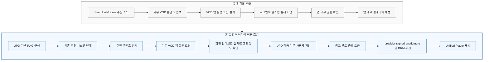

상기 다이어그램에서 종래 기술은 추천 UI 이후 VOD 앱으로 제어권이 넘어가며, 앱 설치 또는 로그인 장벽이 발생하면 사용자의 재생 경험이 단절된다. 반면 본 발명은 UPD를 추천 단계의 RAG 지식으로 활용하고, 기존 VOD 앱 화면이 표시된 뒤 화면 인식으로 설치 또는 로그인 유도 화면이 확인되는 경우에만 광고 기반 UPD 재생을 제안한다.

<!-- page-break:page-2 -->

대외비

#### 1. 발명의 배경

#### 가. 본 발명의 기술분야

본 발명은 스마트 TV, 디스플레이 장치, 셋톱박스, 스트리밍 단말 또는 이와 연동되는 TV 제품 개발사 서버가 외부 VOD 사업자의 콘텐츠 추천에 UPD를 연계하고, 기존 VOD 앱 화면에서 설치 또는 로그인 장벽이 감지되는 경우 광고 기반 UPD 대체 재생을 제공하는 콘텐츠 추천 및 재생 제어 기술에 관한 것이다.

보다 구체적으로, 본 발명은 VOD 사업자 또는 TV 제품 개발사 서버가 제공하는 UPD를 RAG 기반 콘텐츠 해석 시스템에 구성하고 기존 추천 시스템과 연계하며, 사용자가 추천 콘텐츠를 선택하면 기존 VOD 앱 또는 앱 유도 화면을 로딩하고, 화면 인식 결과가 앱 설치, 로그인, 회원가입 또는 결제 유도 상태를 나타내는 경우 UPD 적용 가능 여부를 확인하여 사용자에게 광고 기반 재생을 제안하는 방법 및 시스템에 관한 것이다.

본 발명에서 UPD는 추천 보강 및 대체 재생에 사용되는 통합 재생 서술자 또는 통합 재생 결정 정보로서, 콘텐츠 식별자, 사업자 식별자, 추천 인덱싱용 메타데이터, 재생 URL 또는 manifest template, DRM 유형, 라이선스 요청 정보, 자막 정보, 광고 정책, 만료 조건 및 전자서명 정보를 포함할 수 있다.

#### 나. 종래기술의 설명

종래 스마트 TV 또는 디스플레이 장치의 외부 VOD 재생 방식은 대체로 다음 유형으로 구분된다.

1. **앱 실행형 재생**: 사용자가 Smart Hub, Home 또는 추천 화면에서 콘텐츠를 선택하면 해당 VOD 사업자의 전용 앱을 설치하거나 실행하고, 콘텐츠 탐색, 로그인, 회원가입, 결제, 광고, DRM 및 재생 UI를 앱 내부에서 처리한다.
2. **통합 검색/딥링크형 재생**: TV 제품 개발사 또는 플랫폼이 복수 VOD 사업자의 콘텐츠 메타데이터를 검색 대상으로 통합하고, 선택된 콘텐츠에 대해 VOD 앱 딥링크 또는 웹뷰를 호출한다.
3. **앱 설치 확인 및 폴백형 재생**: 앱이 설치되어 있지 않거나 실행에 실패하면 앱 설치 안내, 스토어 이동 또는 대체 콘텐츠 추천을 제공한다.
4. **광고 기반 AVOD/FAST 재생**: pre-roll, mid-roll 또는 end-roll 광고를 삽입하고 광고 완료 이벤트를 광고 서버 또는 분석 서버에 전송한다.
5. **DRM/권한 토큰 기반 재생**: 재생 URL, DRM 라이선스 URL 또는 인증 토큰을 플레이어에 제공하여 콘텐츠를 재생한다.

그러나 이러한 종래기술은 추천 단계에서 콘텐츠를 노출한 뒤 기존 VOD 앱 화면으로 이동하게 할 뿐, 앱 화면이 설치 안내, 로그인, 회원가입 또는 결제 유도 상태인지 인식하여 UPD 적용 가능성을 확인하고 광고 기반 대체 재생을 제안하는 흐름을 제공하지 못한다. 또한 UPD 기반 RAG 추천 보강, 화면 인식 기반 장벽 판단, 광고 완료 증명, provider-signed entitlement token, DRM 라이선스 요청 및 TV 내부 Unified Player 또는 AVPlay 설정을 하나의 흐름으로 연결하지 못한다.

다음 표는 본 발명과 관련성이 높은 선행기술 및 차별성을 정리한 것이다.

| 구분 | 선행기술 | 주요 내용 | 본 발명과의 관련성 및 차별성 |
|---|---|---|---|
| 1 | 스마트 TV 통합 검색 및 추천 | Smart Hub, Home 또는 Universal Guide에서 외부 VOD 콘텐츠를 노출하고 앱 딥링크를 호출 | 추천 노출과 앱 실행은 제공하나, UPD를 RAG 지식으로 구성하여 기존 추천을 보강하고 앱 화면 이후의 장벽 상황과 연결하지 않음 |
| 2 | VOD 앱 딥링크 및 앱 설치 안내 | 콘텐츠 선택 후 앱 실행, 앱 설치 또는 스토어 이동을 수행 | 기존 앱 화면이 표시된 이후 설치/로그인 유도 화면을 인식하여 UPD 광고 재생을 제안하는 구조가 부족함 |
| 3 | AVOD/FAST 광고 재생 | 광고 시청 후 무료 콘텐츠 또는 FAST 채널을 재생 | 광고 완료 증명 토큰을 provider entitlement 및 DRM license 요청과 결합하여 외부 VOD 앱리스 재생 권한으로 사용하는 구조가 부족함 |
| 4 | DRM 라이선스 및 인증 토큰 | Widevine, PlayReady 등 DRM license와 재생 토큰을 이용 | 단일 재생 권한은 처리하나, 화면 인식 기반 장벽 판단, UPD 검증 및 광고 unlock을 통합하지 않음 |
| 5 | 화면 인식 및 UI 상태 감지 | 화면 이미지 또는 UI 상태를 분석하여 특정 상태를 판단 | 설치/로그인 유도 화면 인식을 UPD 적용 여부 확인, 광고 완료 검증 및 Unified Player 재생과 결합하지 않음 |

#### 선행기술 대비 회피 및 차별화 방향

본 발명은 선행기술과의 중복을 회피하기 위해 다음 기술적 특징을 핵심 구성으로 한다.

1. UPD를 RAG 기반 콘텐츠 해석 시스템의 지식으로 구성하고 기존 추천 시스템과 연계하여 UPD 적용 가능 후보를 추천 단계에서 보강한다.
2. 사용자가 추천 콘텐츠를 선택하면 기존 VOD 앱 또는 앱 유도 화면을 먼저 로딩하고, 화면 인식 모듈이 설치 안내, 로그인, 회원가입 또는 결제 유도 화면인지 판단한다.
3. 상기 화면 인식 결과가 앱 설치 또는 로그인 장벽을 나타내는 경우에 한해, UPD Resolver Service가 해당 콘텐츠의 UPD 적용 가능 여부를 확인한다.
4. 광고 재생 완료 후 ad completion token 또는 completion proof를 발급하고, 이를 provider entitlement token 발급 또는 DRM license 요청의 조건으로 사용한다.
5. UPD는 재생 URL, DRM, subtitle, ad policy, providerId, contentId, 만료 조건 및 전자서명 정보를 포함하고, TV 플랫폼 서비스 또는 Unified Playback Service가 이를 검증한다.
6. Unified Player, AVPlay 또는 내부 player stack은 검증된 UPD와 DRM 세션을 이용하여 VOD 사업자 전용 앱 설치 또는 전체 실행 없이 콘텐츠를 재생한다.
7. UPD 적용 실패, 광고 기반 재생 거절 또는 권한 토큰 발급 실패 시 기존 VOD 앱 화면 또는 앱 유도 화면을 그대로 표시하는 방식으로 폴백한다.

<!-- page-break:page-3 -->

대외비

#### 다. 종래기술 문제점 및 본 발명의 목적

##### 1) 종래기술의 문제점

기존 스마트 TV의 외부 VOD 재생 방식은 사용자가 추천 콘텐츠를 선택한 뒤 해당 VOD 앱으로 이동해야 하므로 재생 지연, 앱 설치 부담, 로그인 반복, 회원가입 장벽, 결제 화면 노출 및 UI 단절이 발생한다. TV 환경에서는 원격 제어기 입력이 제한적이고 화면 전환 비용이 크기 때문에, 모바일 환경보다 로그인 및 앱 설치 장벽이 사용자의 이탈로 이어질 가능성이 높다.

기존 통합 검색 또는 추천 방식은 여러 사업자의 콘텐츠를 한 화면에 노출할 수 있으나, 선택 이후에는 여전히 앱 실행 또는 앱 설치에 의존한다. 따라서 추천 시스템이 사용자의 관심을 유도하더라도, 실제 앱 화면이 설치 안내, 로그인, 회원가입 또는 결제 유도 화면이면 사용자가 재생 전에 이탈할 수 있다.

기존 앱 설치 여부 확인 및 폴백 방식은 앱이 설치되어 있지 않은 경우 앱 스토어 또는 설치 안내로 이동시키는 데 그친다. 이 방식은 실제로 화면에 표시된 설치 또는 로그인 유도 상태를 인식해 사용자에게 광고 기반 미리보기, 무료 회차, 제휴 콘텐츠 또는 프로모션 콘텐츠와 같은 UPD 대체 재생 기회를 제안하지 못한다.

기존 광고 기반 재생 방식은 광고 노출, 광고 완료 또는 광고 클릭 이벤트를 수집할 수 있으나, 광고 완료 증명을 provider entitlement token 발급, DRM 라이선스 요청 및 Unified Player 재생 권한과 직접 결합하지 못한다. 따라서 광고 시청이 외부 VOD 앱리스 재생 권한으로 안전하게 전환되었음을 증명하기 어렵다.

기존 DRM/토큰 기반 재생 방식은 재생 URL과 DRM license URL 또는 인증 토큰을 플레이어에 전달할 수 있으나, UPD 기반 추천 보강, 앱 화면 로딩 후 화면 인식, UPD 적용 여부 확인, 사용자 수락, 광고 완료 검증 및 provider-signed token을 포함하는 TV 플랫폼 중심의 실행 흐름을 제공하지 못한다.

##### 2) 본 발명의 목적

본 발명의 목적은 스마트 TV 추천 UI에서 외부 VOD 콘텐츠가 선택된 뒤 기존 VOD 앱 화면에서 앱 설치 또는 로그인 장벽이 표시되는 경우, 사용자가 재생 전에 이탈하는 문제를 줄이는 것이다.

본 발명의 다른 목적은 UPD를 이용하여 RAG 기반 콘텐츠 해석 시스템을 구성하고 기존 추천 시스템과 연계함으로써, 추천 단계에서 UPD 적용 가능한 콘텐츠 후보를 보강하는 것이다.

본 발명의 또 다른 목적은 사용자가 추천 콘텐츠를 선택한 후 기존 VOD 앱 또는 앱 유도 화면을 로딩하고, 화면 인식 결과가 앱 설치, 로그인, 회원가입 또는 결제 유도 화면인 경우에 한해 광고 기반 UPD 재생을 제안하도록 하는 것이다.

본 발명의 또 다른 목적은 광고 완료 증명 토큰 또는 completion proof를 provider-signed entitlement token 발급, DRM license 요청 또는 UPD 실행 검증과 연결하여, 광고 기반 재생 unlock을 안전하게 처리하는 것이다.

본 발명의 또 다른 목적은 UPD가 재생 URL, DRM, 자막, 광고 정책, providerId, contentId, 만료 조건 및 전자서명 정보를 포함하도록 하여, Unified Playback Service가 이를 검증하고 Unified Player 또는 AVPlay와 같은 기존 미디어 파이프라인을 설정하도록 하는 것이다.

본 발명의 또 다른 목적은 제휴 AVOD/FAST 콘텐츠, 미리보기, 1화 무료, 일부 구간 무료 또는 프로모션 콘텐츠와 같은 현실적인 범위에서 시작하여, 사업자 협력 및 정산 구조 확정에 따라 광고 기반 전체 재생 또는 통합 entitlement로 확장 가능한 플랫폼을 제공하는 것이다.

##### 3) 본 발명의 해결수단 요약

본 발명의 일 실시예에 따르면, TV 제품 개발사 서버는 VOD 사업자의 UPD 또는 UPD 메타데이터를 수신하고, 이를 RAG 기반 콘텐츠 해석 시스템이 검색 가능한 지식으로 구성한다. 기존 추천 시스템은 사용자 컨텍스트 및 콘텐츠 메타데이터와 함께 상기 UPD 기반 지식을 이용하여 외부 VOD 콘텐츠 추천 후보를 생성 또는 보강한다.

디스플레이 장치가 Smart Hub, Home, Universal Guide 또는 추천 UI에서 외부 VOD 콘텐츠 선택 이벤트를 수신하면, 시스템은 기존 VOD 앱 딥링크 또는 앱 유도 경로에 따라 VOD 앱 화면을 로딩한다. 이후 화면 인식 모듈은 로딩된 화면이 앱 설치 안내, 로그인 요청, 회원가입 요청, 결제 요청 또는 권한 부족 안내 화면인지 판단한다.

상기 화면 인식 결과가 설치 또는 로그인 유도 화면을 나타내는 경우, UPD Resolver Service는 providerId, contentId, updId 및 장치 정보를 이용하여 해당 콘텐츠의 UPD 적용 가능 여부를 판단한다. 상기 화면 인식 결과가 설치 또는 로그인 유도 화면이 아닌 경우에는 본 발명의 UPD 대체 재생 절차를 수행하지 않고 기존 앱 화면을 유지한다.

UPD 적용이 가능한 경우, TV 플랫폼은 사용자에게 현재 앱 설치 또는 로그인 절차 대신 광고를 보고 콘텐츠를 재생할 수 있음을 제안한다. 사용자가 수락하면 Ad Unlock Engine은 pre-roll 광고 또는 지정된 광고를 재생하고, 광고 완료 증명 토큰을 생성하거나 광고 서버로부터 수신한다. 광고 완료 증명 토큰은 providerId, contentId, 만료 시간, 광고 완료 상태 및 전자서명 정보를 포함할 수 있다.

Unified Playback Service는 광고 완료 증명 토큰 및 UPD를 검증하고, VOD 사업자 또는 권한 서버로부터 provider-signed entitlement token 또는 DRM license 요청용 토큰을 수신한다. 이후 Unified Player, AVPlay 또는 내부 player stack은 재생 URL, DRM license, subtitle 및 ad policy를 설정하여 콘텐츠를 재생한다.

UPD 적용이 불가능하거나, 사용자가 광고 기반 재생을 수락하지 않거나, 광고 완료 증명 또는 provider entitlement 발급이 실패한 경우, 시스템은 추가 대체 경로를 강제하지 않고 기존 VOD 앱 화면 또는 앱 유도 화면을 계속 표시하는 방식으로 폴백한다.

<!-- page-break:page-4 -->

대외비

#### 2. 발명(고안)의 구체적 설명

#### 가. 발명의 구성

##### 1) 전체 시스템 구조

본 발명의 시스템은 다음 구성요소 중 적어도 하나를 포함한다.

1. **UPD/RAG 추천 연계부**: UPD 또는 UPD 메타데이터를 RAG 기반 콘텐츠 해석 시스템의 지식으로 구성하고 기존 추천 시스템에 연계한다.
2. **Smart Hub/Home 추천 UI**: UPD 기반으로 보강된 외부 VOD 콘텐츠 추천 카드, Universal Guide 항목 또는 콘텐츠 선택 UI를 제공한다.
3. **VOD 앱 화면 로딩부**: 사용자가 추천 콘텐츠를 선택하면 기존 앱 딥링크 또는 앱 유도 경로에 따라 VOD 앱 화면을 먼저 표시한다.
4. **화면 인식 모듈**: 로딩된 VOD 앱 화면이 앱 설치 안내, 로그인 요청, 회원가입 요청, 결제 요청 또는 권한 부족 안내 화면인지 판단한다.
5. **UPD Resolver Service**: 화면 인식 결과가 설치 또는 로그인 유도 화면인 경우 providerId, contentId, updId 및 장치 정보를 이용하여 UPD 적용 가능 여부를 판단한다.
6. **Ad Unlock Engine**: 사용자가 광고 기반 UPD 재생을 수락하면 광고를 재생하고 광고 완료 증명 토큰 또는 completion proof를 생성, 수신 또는 검증한다.
7. **Provider Entitlement Gateway**: 광고 완료 증명 토큰, providerId, contentId 및 장치 정보를 이용하여 provider-signed entitlement token 또는 DRM 요청용 토큰을 수신한다.
8. **Unified Playback Service**: UPD, 광고 완료 증명 및 provider-signed entitlement token을 검증하고 DRM 세션, 재생 URL, 자막 및 광고 정책을 설정한다.
9. **Unified Player 또는 AVPlay**: TV 내부 미디어 파이프라인으로서, 검증된 세션 정보를 이용해 콘텐츠를 재생한다.
10. **Playback/Event Collector**: 콘텐츠 시작, 콘텐츠 완료, 광고 시작, 광고 완료, 광고 오류, DRM 오류, UPD 적용 실패 및 fallback 이벤트를 수집한다.
11. **UPD Fallback 처리부**: UPD 적용 실패 또는 사용자의 광고 기반 재생 거절 시 기존 VOD 앱 화면 또는 앱 유도 화면을 계속 표시한다.

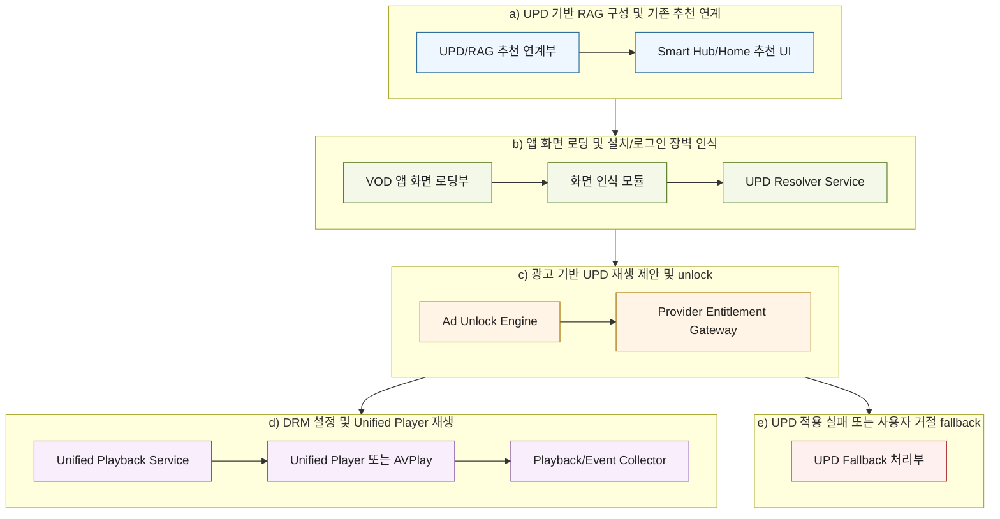

##### 2) 주요 모듈 정의

| 모듈 | 기능 |
|---|---|
| UPD/RAG 추천 연계부 | UPD를 RAG 지식으로 구성하고 기존 추천 시스템의 후보 생성 또는 후보 설명에 연계 |
| Smart Hub/Home 추천 UI | UPD 기반으로 보강된 외부 VOD 콘텐츠 추천 카드와 콘텐츠 선택 이벤트를 제공 |
| VOD 앱 화면 로딩부 | 사용자가 추천 콘텐츠를 선택하면 기존 VOD 앱 또는 앱 유도 화면을 먼저 표시 |
| 화면 인식 모듈 | 로딩된 앱 화면이 설치, 로그인, 회원가입, 결제 또는 권한 부족 유도 화면인지 판단 |
| UPD Resolver Service | 화면 인식 결과에 따라 UPD 적용 가능 여부, UPD fetch 및 UPD signature validation을 수행 |
| Ad Unlock Engine | 사용자 수락 후 pre-roll 광고 재생, 광고 완료 확인, completion proof 생성 및 광고 우회 방지를 처리 |
| Provider Entitlement Gateway | 광고 완료 증명에 기초하여 provider-signed token 또는 DRM 요청 토큰을 수신 |
| Unified Playback Service | UPD의 URL, DRM, subtitle, ad policy를 파싱하고 기존 player stack을 설정 |
| Unified Player 또는 AVPlay | 스마트 TV의 내부 미디어 파이프라인을 이용해 콘텐츠를 재생 |
| Playback/Event Collector | 재생, 광고, UPD 적용 실패 및 fallback 이벤트를 수집 |
| UPD Fallback 처리부 | UPD 불가 또는 사용자 광고 재생 거절 시 기존 VOD 앱 화면을 유지 |

##### 3) 용어 정의

| 용어 | 정의 |
|---|---|
| UPD | 추천 보강 및 앱 화면 이후 대체 재생에 사용되는 통합 재생 서술자 또는 통합 재생 결정 정보 |
| 추천 연계 메타데이터 | 기존 추천 카드가 VOD 앱 경로로 이동하되, 화면 인식 후 UPD fallback을 검토할 수 있도록 providerId, contentId 및 updId를 함께 보유하는 정보 |
| 화면 인식 기반 장벽 | 로딩된 VOD 앱 화면이 설치 안내, 로그인 요청, 회원가입 요청, 결제 요청 또는 권한 부족 안내 화면으로 판단된 상태 |
| ad completion token | 광고 완료 사실을 증명하기 위해 광고 서버 또는 TV 플랫폼이 발급하는 단기 토큰 |
| provider-signed entitlement token | VOD 사업자 또는 권한 서버가 특정 콘텐츠, 장치, 광고 완료 또는 세션 조건에 대해 발급하는 서명된 재생 권한 토큰 |
| Unified Playback Service | UPD 검증, DRM 세션 생성, 광고 정책 적용 및 player stack 설정을 수행하는 TV 플랫폼 서비스 |

##### 4) 추천 연계 메타데이터 JSON

다음은 기존 VOD 앱 경로를 유지하면서, 화면 인식 후 UPD 적용 가능성을 확인할 수 있도록 추천 카드에 연계되는 메타데이터의 예시이다.

```json
{
  "actionType": "APP_DEEPLINK_WITH_UPD_FALLBACK",
  "appDeepLink": "providerapp://play/vod_123",
  "updId": "upd_12345",
  "providerId": "provider_a",
  "contentId": "vod_123",
  "contentType": "AVOD",
  "fallbackTrigger": "LOGIN_OR_INSTALL_SCREEN_RECOGNITION"
}
```

###### 추천 연계 메타데이터 필드 설명

| 필드 | 설명 |
|---|---|
| actionType | 기존 앱 딥링크 실행 후 화면 인식 결과에 따라 UPD fallback을 검토할 수 있음을 나타내는 값 |
| appDeepLink | 먼저 표시할 기존 VOD 앱 또는 앱 유도 화면으로 이동하기 위한 딥링크 |
| updId | 화면 인식 후 UPD 적용 가능성을 조회 또는 검증하기 위한 식별자 |
| providerId | VOD 사업자 식별자 |
| contentId | 콘텐츠 식별자 |
| contentType | AVOD, FAST, preview, freeEpisode, promo 등 콘텐츠 유형 |
| fallbackTrigger | UPD 적용 여부 확인을 시작하는 화면 인식 조건 |

##### 5) 화면 인식 결과 JSON

다음은 기존 VOD 앱 화면이 로딩된 후 화면 인식 모듈이 생성할 수 있는 결과의 예시이다.

```json
{
  "providerId": "provider_a",
  "contentId": "vod_123",
  "screenState": "LOGIN_REQUIRED",
  "recognizedText": ["로그인", "회원가입", "계속하려면 로그인하세요"],
  "confidence": 0.94,
  "updFallbackEligible": true,
  "reasonCode": "LOGIN_SCREEN_RECOGNIZED",
  "checkedAt": "2026-06-08T00:00:00Z"
}
```

###### 화면 인식 결과 필드 설명

| 필드 | 설명 |
|---|---|
| providerId | VOD 사업자 식별자 |
| contentId | 콘텐츠 식별자 |
| screenState | APP_INSTALL_REQUIRED, LOGIN_REQUIRED, SIGNUP_REQUIRED, PAYMENT_REQUIRED, ENTITLEMENT_REQUIRED 등 화면 상태 |
| recognizedText | 화면에서 인식된 주요 문구 또는 UI 요소 |
| confidence | 화면 상태 판단 신뢰도 |
| updFallbackEligible | UPD 적용 가능성 확인 대상인지 여부 |
| reasonCode | UPD 적용 여부 확인을 시작한 화면 인식 사유 |
| checkedAt | 상태 확인 시각 |

##### 6) UPD JSON

다음은 UPD의 일 예시이다.

```json
{
  "updId": "upd_12345",
  "schemaVersion": "1.0",
  "providerId": "provider_a",
  "contentId": "vod_123",
  "playback": {
    "manifestUrl": "https://provider.example/manifest/vod_123.mpd",
    "protocol": "dash",
    "subtitleUrl": "https://provider.example/subtitle/vod_123.vtt"
  },
  "drm": {
    "type": "widevine",
    "licenseUrl": "https://provider.example/drm/license",
    "entitlementMode": "AD_UNLOCK",
    "tokenMode": "PROVIDER_SIGNED_TOKEN"
  },
  "adPolicy": {
    "adMode": "PRE_ROLL_UNLOCK",
    "adTagTemplateId": "ad_tag_001",
    "minimumCompletionRate": 1.0,
    "completionTokenRequired": true
  },
  "devicePolicy": {
    "allowedDeviceClass": ["tizen_tv", "smart_tv"],
    "minimumSecurityLevel": "platform_service",
    "offlinePlaybackAllowed": false
  },
  "validity": {
    "notBefore": "2026-06-08T00:00:00Z",
    "expiresAt": "2026-06-08T00:10:00Z"
  },
  "signature": {
    "alg": "ES256",
    "keyId": "provider_a_key_01",
    "value": "base64url-signature"
  }
}
```

###### UPD 필드 설명

| 필드 | 설명 |
|---|---|
| updId | UPD 식별자 |
| schemaVersion | UPD 스키마 버전 |
| providerId | VOD 사업자 식별자 |
| contentId | 콘텐츠 식별자 |
| playback | manifest URL, protocol, subtitle URL 등 재생 설정 |
| drm | DRM 유형, license URL, entitlement mode 및 토큰 방식 |
| adPolicy | 광고 unlock 방식, 광고 태그 템플릿, 완료율 조건 및 completion token 필요 여부 |
| devicePolicy | 허용 장치 클래스, 보안 수준 및 오프라인 재생 허용 여부 |
| validity | UPD 유효 시작 시각 및 만료 시각 |
| signature | UPD 위변조 방지를 위한 전자서명 정보 |

##### 7) 광고 완료 증명 토큰 JSON

다음은 광고 기반 unlock을 위한 광고 완료 증명 토큰의 예시이다.

```json
{
  "adCompletionToken": "base64url-token",
  "providerId": "provider_a",
  "contentId": "vod_123",
  "adSessionId": "ad_session_789",
  "completionStatus": "COMPLETED",
  "completionRate": 1.0,
  "expiresIn": 600,
  "issuedAt": "2026-06-08T00:01:00Z",
  "signature": "base64url-signature"
}
```

##### 8) DRM entitlement JSON

다음은 광고 완료 증명 후 provider-signed token을 포함하는 DRM entitlement 예시이다.

```json
{
  "drm": {
    "type": "widevine",
    "licenseUrl": "https://provider.example/drm/license",
    "entitlementMode": "AD_UNLOCK",
    "token": "time_limited_provider_signed_token",
    "expiresAt": "2026-06-08T00:10:00Z"
  }
}
```

##### 9) 세션 패키지

Unified Playback Service는 UPD, 광고 완료 증명 토큰, provider-signed entitlement token 및 장치 정보를 검증한 뒤 다음 정보를 포함하는 세션 패키지를 생성할 수 있다.

| 구성요소 | 내용 |
|---|---|
| sessionId | 재생 세션 식별자 |
| providerId/contentId | VOD 사업자 및 콘텐츠 식별자 |
| manifestUrl | 검증된 재생 manifest URL |
| drmSession | DRM 유형, license URL, provider-signed token 및 license 요청 헤더 |
| subtitleConfig | 자막 URL 및 언어 설정 |
| adConfig | 광고 unlock 상태, 광고 정책 및 후속 광고 조건 |
| deviceBinding | 장치 클래스, 보안 수준 또는 장치 식별자 해시 |
| playbackPolicy | 오프라인 금지, 만료 시간, seek 제한 또는 미리보기 구간 |
| eventConfig | 재생/광고/오류 이벤트 수집 엔드포인트 |

#### 나. 발명의 동작 설명

##### 1) UPD 기반 RAG 구성 및 기존 추천 연계 흐름

TV 제품 개발사 서버는 VOD 사업자 또는 내부 콘텐츠 관리 시스템으로부터 UPD 또는 UPD 메타데이터를 수신한다. 상기 UPD는 콘텐츠 식별자, 사업자 식별자, 콘텐츠 유형, 광고 기반 재생 가능성, 미리보기 가능성, DRM 유형 및 재생 정책 정보를 포함할 수 있다.

RAG 기반 콘텐츠 해석 시스템은 상기 UPD를 검색 가능한 지식 또는 벡터 인덱스로 구성한다. 기존 추천 시스템은 사용자 컨텍스트, 콘텐츠 메타데이터 및 RAG 검색 결과를 함께 사용하여 추천 후보를 보강한다. 이때 추천 카드는 기존 VOD 앱으로 이동하기 위한 appDeepLink와, 화면 인식 이후 UPD fallback을 검토하기 위한 updId를 함께 보유할 수 있다.

##### 2) 기존 VOD 앱 화면 로딩 및 화면 인식 흐름

사용자가 Smart Hub, Home 또는 Universal Guide에서 추천 콘텐츠를 선택하면, 디스플레이 장치는 먼저 기존 VOD 앱 딥링크 또는 앱 유도 경로에 따라 VOD 앱 화면을 로딩한다. 본 발명은 이 단계에서 기존 앱 기반 재생 실패를 별도로 처리하지 않는다.

VOD 앱 화면이 표시되면 화면 인식 모듈이 화면 내 문구, 버튼, UI 배치 또는 상태 코드를 분석한다. 화면 인식 결과가 앱 설치 안내, 로그인 요청, 회원가입 요청, 결제 요청 또는 권한 부족 안내에 해당하는 경우, 시스템은 해당 콘텐츠에 대한 UPD 적용 가능 여부를 확인한다. 화면 인식 결과가 이러한 장벽 화면이 아닌 경우, UPD 대체 재생 절차는 진행하지 않고 기존 VOD 앱 화면을 유지한다.

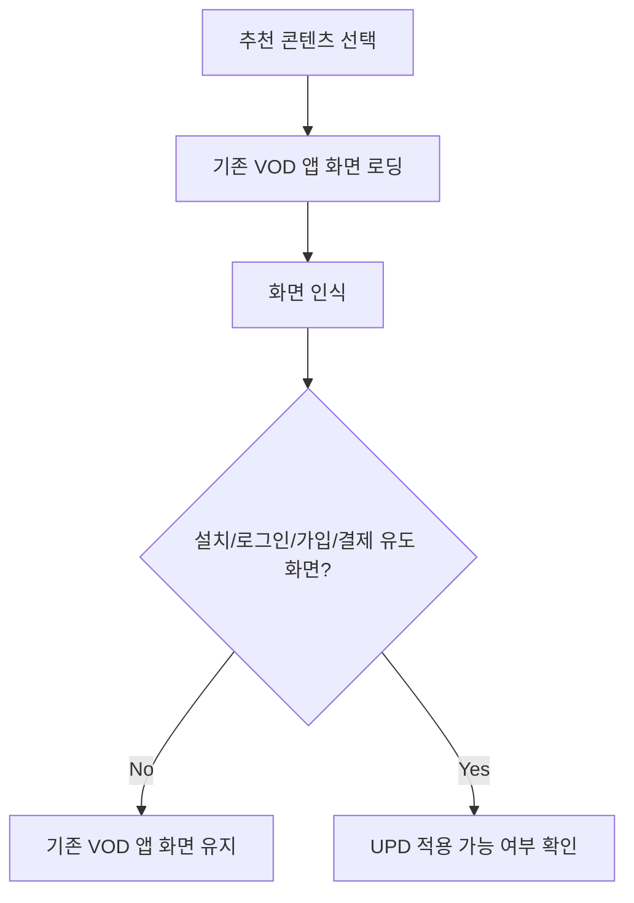

##### 3) UPD 적용 여부 확인 및 사용자 수락 흐름

UPD Resolver Service는 화면 인식 결과가 장벽 화면임을 나타내는 경우에만 providerId, contentId, updId, 콘텐츠 유형 및 장치 정보를 이용하여 UPD 적용 가능 여부를 확인한다. UPD 적용이 가능한 경우, TV 플랫폼은 사용자가 현재 표시 중인 로그인 또는 설치 절차를 계속 진행하는 대신 광고를 보고 미리보기, 무료 회차, 무료 구간 또는 샘플 재생을 할 수 있음을 제안한다.

사용자가 광고 기반 UPD 재생을 수락하면 Ad Unlock Engine으로 진행한다. 사용자가 수락하지 않으면 시스템은 기존 VOD 앱 화면 또는 앱 유도 화면을 그대로 표시하고 절차를 종료한다.

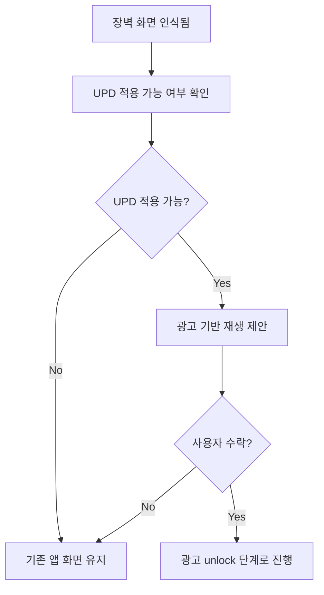

##### 4) 광고 unlock 및 provider entitlement 흐름

Ad Unlock Engine은 UPD의 adPolicy에 따라 pre-roll 광고 또는 지정된 광고를 재생한다. 광고가 완료되면 광고 서버 또는 TV 플랫폼은 ad completion token 또는 completion proof를 발급한다. 상기 토큰은 광고가 실제로 완료되었음을 나타내며, providerId, contentId, adSessionId, completionStatus, completionRate, expiresIn 및 signature를 포함할 수 있다.

Provider Entitlement Gateway는 광고 완료 증명 토큰을 VOD 사업자 또는 권한 서버에 전달하고, provider-signed entitlement token 또는 DRM 라이선스 요청용 토큰을 수신한다. 쉽게 말해, 이 단계는 사용자가 광고를 완료했으므로 해당 콘텐츠를 제한된 조건으로 재생할 수 있다는 VOD 사업자의 서명된 허가를 받는 단계이다.

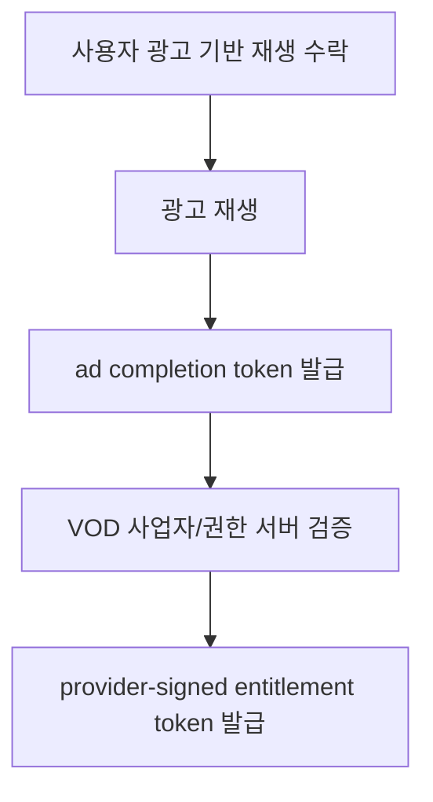

##### 5) DRM 설정 및 Unified Player 재생 흐름

Unified Playback Service는 UPD, 광고 완료 증명 토큰 및 provider-signed entitlement token을 검증한다. 검증이 완료되면 UPD에 포함된 manifest URL, DRM 유형, license URL, subtitle URL 및 ad policy를 기존 AVPlay 또는 내부 player stack에 설정한다.

Unified Player 또는 AVPlay는 설정된 DRM 세션과 재생 URL을 이용하여 콘텐츠를 재생한다. 이 단계는 새로운 VOD 앱을 추가로 실행하는 것이 아니라, TV 내부 미디어 파이프라인이 검증된 UPD 세션 정보를 사용하여 제한된 범위의 콘텐츠를 재생하는 방식으로 수행된다.

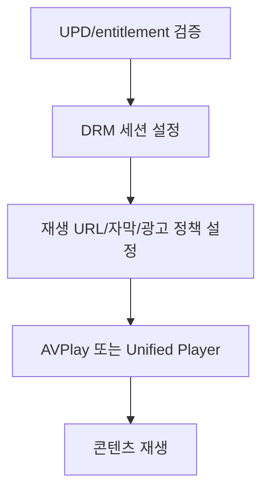

##### 6) UPD 적용 실패 및 사용자 거절 fallback 흐름

UPD 적용 실패 또는 사용자 거절 fallback은 광고 기반 UPD 재생 단계에서만 발생한다. 예컨대 UPD 적용이 불가능하거나, UPD 검증이 실패하거나, 광고 완료 증명 토큰이 발급되지 않거나, provider-signed entitlement token이 발급되지 않거나, 사용자가 광고 기반 재생을 원하지 않는 경우가 이에 해당한다.

이 경우 시스템은 기존 앱 기반 재생 실패를 추가로 처리하지 않고, 사용자가 이미 보고 있던 VOD 앱 화면 또는 앱 설치/로그인 유도 화면을 계속 표시한다. 즉, 본 발명의 fallback은 기존 앱 화면으로 돌아가거나 그 화면을 유지하는 것이며, 별도의 앱 실행 실패 처리, 대체 콘텐츠 추천 또는 캐스팅 안내를 필수 구성으로 하지 않는다.

##### 7) 단계별 적용 전략

본 발명은 다음 단계로 적용될 수 있다.

| 단계 | 대상 | 특징 |
|---|---|---|
| Phase 1 | 제휴 AVOD/FAST 콘텐츠 | 무료 VOD, 광고 기반 콘텐츠, FAST 채널 catch-up, 중소 VOD 사업자, 교육/키즈/다큐 콘텐츠에 적용 |
| Phase 2 | 미리보기/무료 회차 | 예고편, 첫 10분 미리보기, 1화 무료, 특정 시즌 무료, 광고 기반 샘플 재생에 적용 |
| Phase 3 | 광고 기반 전체 재생 | 제휴 사업자와 정산 구조가 확정된 경우 광고 시청 후 일회성 재생 권한을 부여 |
| Phase 4 | 통합 계정/구독 연계 | TV 제품 개발사 계정 또는 통합 entitlement와 제휴 VOD 권한을 연결 |

##### 8) 개발 세부 사항

TV 플랫폼 내부 구현에서는 일반 서드파티 앱보다 platform privilege, system app 또는 preloaded service 권한을 갖는 시스템 서비스 구현이 바람직하다. 화면 인식 모듈은 VOD 앱 화면이 로딩된 후 화면 문구, 버튼, UI layout, provider API 응답 또는 접근성 정보를 이용하여 설치/로그인/회원가입/결제 유도 화면 여부를 판단할 수 있다.

Unified Playback Service는 새로운 플레이어를 별도로 구현하기보다, 기존 AVPlay 또는 내부 player stack을 오케스트레이션하는 방식으로 구성될 수 있다. 구체적으로 UPD의 URL, DRM, subtitle 및 ad policy를 파싱하고, provider-signed token과 광고 완료 증명 토큰의 유효성을 검증한 뒤 기존 미디어 파이프라인에 필요한 설정을 주입한다.

광고 완료 검증은 광고 우회 방지를 위해 단순 광고 시작 이벤트가 아니라 completion proof 또는 ad completion token을 기준으로 수행된다. 상기 토큰은 단기 만료 시간을 가지며 providerId, contentId, adSessionId 및 signature를 포함하여 위변조를 방지한다.

콘텐츠 제공자 반발을 줄이기 위해, UPD는 기존 앱 유입을 완전히 대체하는 것이 아니라 앱 화면에서 사용자가 설치 또는 로그인 장벽에 걸렸을 때 제공되는 제한적 체험 경로로 포지셔닝될 수 있다. 예컨대 광고 기반 10분 미리보기, 1화 무료, 가입 전 체험 재생, 브랜드 로딩 화면 제공 또는 재생 중 가입 CTA 제공과 함께 사용될 수 있다.

#### 다. 발명의 효과

본 발명에 따르면 다음과 같은 효과가 있다.

1. 스마트 TV 추천 콘텐츠 선택 후 기존 VOD 앱 화면에서 앱 설치 또는 로그인 장벽이 표시될 때 사용자 이탈을 줄일 수 있다.
2. UPD를 RAG 기반 콘텐츠 해석 시스템과 기존 추천 시스템에 연계하여 UPD 적용 가능성이 있는 추천 후보를 보강할 수 있다.
3. 광고 완료 증명 토큰과 provider-signed entitlement token을 결합하여 광고 기반 재생 unlock을 안전하게 처리할 수 있다.
4. 기존 Unified Player, AVPlay 또는 내부 player stack을 재사용하여 새로운 플레이어 구축 부담을 줄일 수 있다.
5. UPD 적용 실패 또는 사용자의 광고 기반 재생 거절 시 기존 앱 화면을 유지하므로, 기존 VOD 앱 유입 흐름과 충돌을 줄일 수 있다.
6. 제휴 AVOD/FAST, 미리보기, 무료 회차 및 프로모션 콘텐츠부터 단계적으로 적용하여 사업자 수용성을 높일 수 있다.
7. TV 제품 개발사 입장에서는 Smart Hub 체류시간, 광고 수익화, AI 추천 경험 및 플랫폼 주도권을 강화할 수 있다.

<!-- page-break:page-5 -->

대외비

## 3. 권리청구의 범위

### 청구항 1

스마트 TV 환경에서 외부 VOD 콘텐츠를 재생하는 방법에 있어서,

TV 제품 개발사 서버 또는 디스플레이 장치가 외부 VOD 콘텐츠에 대한 UPD 또는 UPD 메타데이터를 RAG 기반 콘텐츠 해석 시스템이 검색 가능한 지식으로 구성하는 단계;

상기 RAG 기반 콘텐츠 해석 시스템의 검색 결과를 기존 추천 시스템에 연계하여 Smart Hub, Home, Universal Guide 또는 추천 UI의 외부 VOD 콘텐츠 추천 후보를 생성 또는 보강하는 단계;

사용자가 상기 추천 후보 중 하나의 외부 VOD 콘텐츠를 선택하면, 상기 외부 VOD 콘텐츠에 대응하는 기존 VOD 애플리케이션 화면 또는 앱 유도 화면을 로딩하는 단계;

상기 로딩된 화면에 대한 화면 인식을 수행하여, 상기 화면이 앱 설치 안내, 로그인 요청, 회원가입 요청, 결제 요청 또는 권한 부족 안내 화면 중 적어도 하나인지 판단하는 단계;

상기 화면 인식 결과가 앱 설치 안내, 로그인 요청, 회원가입 요청, 결제 요청 또는 권한 부족 안내 화면 중 적어도 하나에 해당하는 경우, providerId, contentId, updId 또는 장치 정보 중 적어도 하나에 기초하여 UPD 적용 가능 여부를 판단하는 단계;

상기 UPD 적용이 가능한 경우, 사용자에게 현재 표시 중인 기존 VOD 애플리케이션 화면 또는 앱 유도 화면 대신 광고 기반 UPD 재생을 제안하는 단계;

사용자가 상기 광고 기반 UPD 재생을 수락하면 광고를 재생하고 광고 완료 증명 토큰을 생성 또는 수신하는 단계;

상기 광고 완료 증명 토큰 및 UPD를 검증하고, VOD 사업자 또는 권한 서버로부터 provider-signed entitlement token 또는 DRM 라이선스 요청용 토큰을 수신하는 단계; 및

상기 UPD, 상기 provider-signed entitlement token 및 DRM 정보를 이용하여 Unified Player, AVPlay 또는 내부 player stack을 통해 상기 외부 VOD 콘텐츠를 재생하는 단계를 포함하는 방법.

### 청구항 2

청구항 1에 있어서, 상기 추천 후보는 기존 VOD 애플리케이션 화면으로 이동하기 위한 appDeepLink와, 화면 인식 이후 UPD 적용 가능 여부를 확인하기 위한 updId를 함께 포함하는 추천 연계 메타데이터를 포함하는 방법.

### 청구항 3

청구항 1에 있어서, 상기 화면 인식은 TV 플랫폼의 시스템 서비스, preloaded service 또는 platform privilege를 갖는 모듈에 의해 수행되는 방법.

### 청구항 4

청구항 1에 있어서, 상기 화면 인식은 화면 내 텍스트, 버튼, UI layout, 접근성 정보, provider API 응답 또는 앱 상태 코드 중 적어도 하나를 이용하여 수행되는 방법.

### 청구항 5

청구항 1에 있어서, 상기 UPD는 updId, schemaVersion, providerId, contentId, manifestUrl, protocol, subtitleUrl, DRM type, licenseUrl, entitlementMode, adPolicy, devicePolicy, validity 및 signature 중 적어도 하나를 포함하는 방법.

### 청구항 6

청구항 1에 있어서, 상기 UPD 적용 가능 여부를 판단하는 단계는 콘텐츠 유형이 AVOD, FAST, preview, freeEpisode, promo 또는 광고 기반 sample playback 중 적어도 하나인지 판단하는 단계를 포함하는 방법.

### 청구항 7

청구항 1에 있어서, 상기 광고 완료 증명 토큰은 providerId, contentId, adSessionId, completionStatus, completionRate, expiresIn, issuedAt 또는 signature 중 적어도 하나를 포함하는 방법.

### 청구항 8

청구항 1에 있어서, 상기 광고 완료 증명 토큰은 pre-roll 광고의 완료, 광고 서버 검증 또는 광고 완료율 조건 충족에 기초하여 발급되는 방법.

### 청구항 9

청구항 1에 있어서, 상기 provider-signed entitlement token은 광고 완료 증명 토큰, providerId, contentId, 장치 클래스 또는 세션 식별자 중 적어도 하나에 바인딩되는 방법.

### 청구항 10

청구항 1에 있어서, 상기 provider-signed entitlement token은 DRM license 요청의 인증 헤더, 요청 파라미터 또는 요청 본문 중 적어도 하나에 포함되는 방법.

### 청구항 11

청구항 1에 있어서, 상기 Unified Player, AVPlay 또는 내부 player stack을 통해 재생하는 단계는 UPD의 재생 URL, DRM 정보, 자막 정보 및 광고 정책을 파싱하고 기존 미디어 파이프라인을 설정하는 단계를 포함하는 방법.

### 청구항 12

청구항 1에 있어서, 사용자가 상기 광고 기반 UPD 재생을 수락하지 않는 경우, 상기 기존 VOD 애플리케이션 화면 또는 앱 유도 화면을 계속 표시하는 단계를 더 포함하는 방법.

### 청구항 13

청구항 1에 있어서, UPD 적용 불가, UPD 검증 실패, 광고 완료 검증 실패, DRM license 요청 실패 또는 provider entitlement 발급 실패가 발생한 경우, 상기 기존 VOD 애플리케이션 화면 또는 앱 유도 화면을 계속 표시하는 방법.

### 청구항 14

청구항 1에 있어서, 상기 화면 인식 결과가 앱 설치 안내, 로그인 요청, 회원가입 요청, 결제 요청 또는 권한 부족 안내 화면에 해당하지 않는 경우, UPD 적용 여부를 확인하지 않고 상기 기존 VOD 애플리케이션 화면을 유지하는 방법.

### 청구항 15

청구항 1에 있어서, 상기 광고 기반 재생은 미리보기, 첫 10분 무료 재생, 1화 무료 재생, 특정 시즌 무료 재생, 프로모션 콘텐츠 재생 또는 광고 기반 샘플 재생 중 적어도 하나를 포함하는 방법.

### 청구항 16

청구항 1에 있어서, 상기 UPD는 공개키 기반 전자서명, JSON Web Signature, COSE Signature 또는 provider keyId에 대응하는 서명 검증 방식 중 하나로 검증되는 방법.

### 청구항 17

청구항 1에 있어서, 상기 방법은 콘텐츠 시작, 콘텐츠 완료, 광고 시작, 광고 완료, 광고 오류, DRM 오류, UPD 검증 실패 또는 UPD fallback 이벤트 중 적어도 하나를 수집하는 단계를 더 포함하는 방법.

### 청구항 18

스마트 TV 환경에서 외부 VOD 콘텐츠를 재생하는 시스템에 있어서,

외부 VOD 콘텐츠에 대한 UPD 또는 UPD 메타데이터를 RAG 기반 콘텐츠 해석 시스템이 검색 가능한 지식으로 구성하고 기존 추천 시스템에 연계하는 UPD/RAG 추천 연계부;

상기 기존 추천 시스템의 추천 후보를 Smart Hub, Home, Universal Guide 또는 추천 UI에 제공하는 추천 UI;

사용자가 추천 콘텐츠를 선택하면 기존 VOD 애플리케이션 화면 또는 앱 유도 화면을 로딩하는 VOD 앱 화면 로딩부;

상기 로딩된 화면이 앱 설치 안내, 로그인 요청, 회원가입 요청, 결제 요청 또는 권한 부족 안내 화면 중 적어도 하나인지 판단하는 화면 인식 모듈;

상기 화면 인식 결과에 기초하여 providerId, contentId, updId 또는 장치 정보 중 적어도 하나를 이용해 UPD 적용 가능 여부를 판단하는 UPD Resolver Service;

광고를 재생하고 광고 완료 증명 토큰을 생성, 수신 또는 검증하는 Ad Unlock Engine;

상기 광고 완료 증명 토큰에 기초하여 VOD 사업자 또는 권한 서버로부터 provider-signed entitlement token 또는 DRM 라이선스 요청용 토큰을 수신하는 Provider Entitlement Gateway;

상기 UPD, 상기 provider-signed entitlement token 및 DRM 정보를 검증하고 Unified Player, AVPlay 또는 내부 player stack을 설정하는 Unified Playback Service; 및

UPD 적용 실패 또는 사용자의 광고 기반 재생 거절 시 기존 VOD 애플리케이션 화면 또는 앱 유도 화면을 계속 표시하도록 하는 UPD Fallback 처리부를 포함하는 시스템.

### 청구항 19

청구항 18에 있어서, 상기 시스템은 콘텐츠 시작, 콘텐츠 완료, 광고 시작, 광고 완료, 광고 오류, DRM 오류, UPD 검증 실패 또는 UPD fallback 이벤트를 수집하는 Playback/Event Collector를 더 포함하는 시스템.

### 청구항 20

청구항 18에 있어서, 상기 Unified Playback Service는 새로운 플레이어를 생성하는 것이 아니라, 기존 AVPlay 또는 내부 player stack에 재생 URL, DRM license 요청 정보, subtitle 설정 및 광고 정책을 주입하여 콘텐츠를 재생하는 시스템.

### 청구항 21

컴퓨터 판독 가능한 기록매체에 저장된 프로그램으로서, 프로세서에 의해 실행될 때 청구항 1 내지 청구항 17 중 어느 한 항의 방법을 수행하도록 하는 프로그램.

### 추가 종속항 후보

1. 추천 연계 메타데이터가 appDeepLink와 updId를 함께 포함하고, 기존 VOD 앱 화면이 표시된 후 화면 인식 결과에 따라 updId를 이용해 UPD 적용 가능 여부를 확인하는 구성.
2. 화면 인식 결과가 screenState, recognizedText, confidence 및 updFallbackEligible을 반환하는 구성.
3. 화면 인식은 provider API 응답이 없거나 앱 상태 코드가 충분하지 않은 경우 보조 수단으로 사용되는 구성.
4. 광고 완료 증명 토큰이 광고 서버 검증 결과와 장치 세션 식별자에 바인딩되는 구성.
5. provider-signed entitlement token이 특정 contentId, device class 및 만료 시간에 바인딩되는 구성.
6. 화면 인식 신뢰도가 기준값 미만인 경우 UPD 제안을 표시하지 않고 기존 VOD 앱 화면을 유지하는 구성.
7. 대형 OTT 적용 시 전체 콘텐츠 재생이 아니라 미리보기, 1화 무료 또는 프로모션 콘텐츠에 한정하여 UPD 경로를 제공하는 구성.
8. 재생 중 가입 CTA, 브랜드 로딩 화면 또는 앱 설치 전환 버튼을 제공하여 UPD를 앱 유입 전환 funnel로 사용하는 구성.
9. 광고 완료율이 사전에 설정된 threshold 미만인 경우 provider entitlement token 발급을 거절하는 구성.
10. UPD 검증 실패, 광고 완료 검증 실패 또는 provider entitlement 발급 실패 시 기존 VOD 앱 화면 또는 앱 유도 화면을 계속 표시하는 구성.

<!-- page-break:page-6 -->

대외비

## 4. 도 면

## 가. 종래기술의 도면

### 도 1. 종래 앱 실행형 외부 VOD 재생 구조

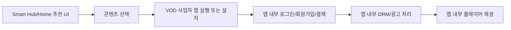

도 1은 종래기술에서 TV 추천 UI가 콘텐츠 노출까지만 담당하고, 실제 재생은 VOD 사업자 앱 실행 이후 앱 내부에서 처리되는 구조를 나타낸다. 이 구조에서는 앱 미설치, 로그인, 회원가입 또는 결제 장벽이 발생하면 추천 경험과 재생 경험이 단절된다.

### 도 2. 종래 앱 설치 안내 및 딥링크 폴백 구조

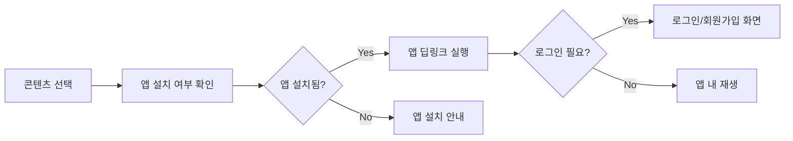

도 2는 앱 설치 여부를 확인하고 앱이 없으면 설치 안내를 제공하는 종래 폴백 구조를 나타낸다. 이 구조는 앱 없이 광고 기반 미리보기 또는 무료 재생을 제공하지 못한다.

## 나. 본 발명의 도면

### 도 3. 본 발명의 전체 시스템 구조

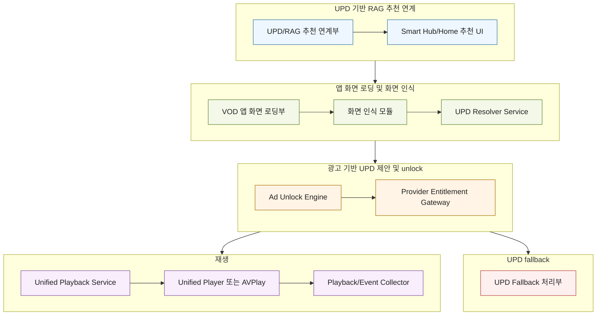

도 3은 본 발명의 전체 시스템 구조를 나타낸다. UPD는 먼저 RAG 기반 추천 보강에 사용되고, 사용자가 추천 콘텐츠를 선택하면 기존 VOD 앱 화면이 로딩된다. 이후 화면 인식으로 설치 또는 로그인 유도 화면이 확인되는 경우에만 UPD 적용 가능 여부를 확인하고, 사용자가 광고 기반 재생을 수락하면 광고 완료 증명, provider entitlement 및 Unified Playback Service를 통해 재생한다.

### 도 4. 기존 VOD 앱 화면 인식 기반 UPD 적용 흐름

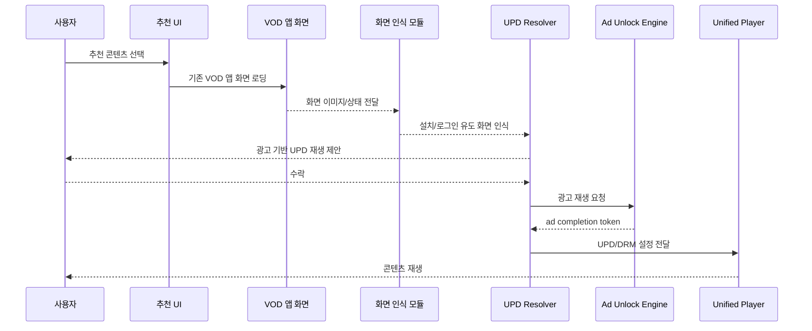

도 4는 사용자가 추천 콘텐츠를 선택한 후 기존 VOD 앱 화면이 표시되고, 화면 인식 결과가 앱 설치 또는 로그인 유도 화면인 경우 UPD 적용 가능 여부를 확인하여 광고 기반 재생을 제안하는 흐름을 나타낸다.

### 도 5. 사용자 수락 및 거절 분기 흐름

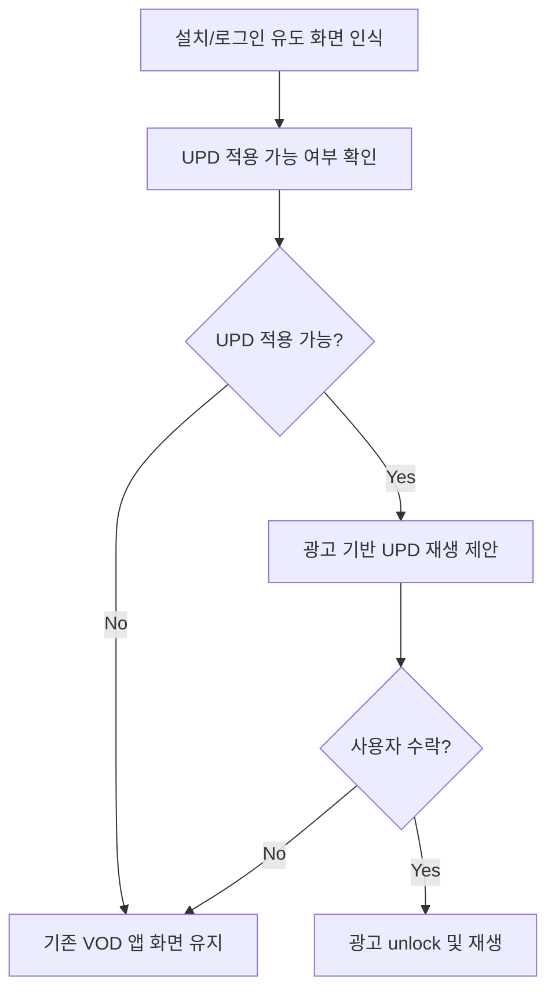

도 5는 UPD 적용 가능성이 확인된 후 사용자에게 광고 기반 재생을 제안하고, 사용자가 거절하거나 UPD 적용이 불가능한 경우 기존 VOD 앱 화면을 유지하는 흐름을 나타낸다.

### 도 6. 광고 완료 증명 및 DRM entitlement 연동 흐름

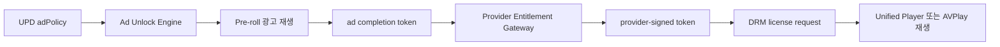

도 6은 광고 완료 증명 토큰이 provider-signed entitlement token 및 DRM license 요청과 연결되어 광고 기반 재생 unlock을 수행하는 흐름을 나타낸다.

### 도 7. UPD 적용 실패 fallback 흐름

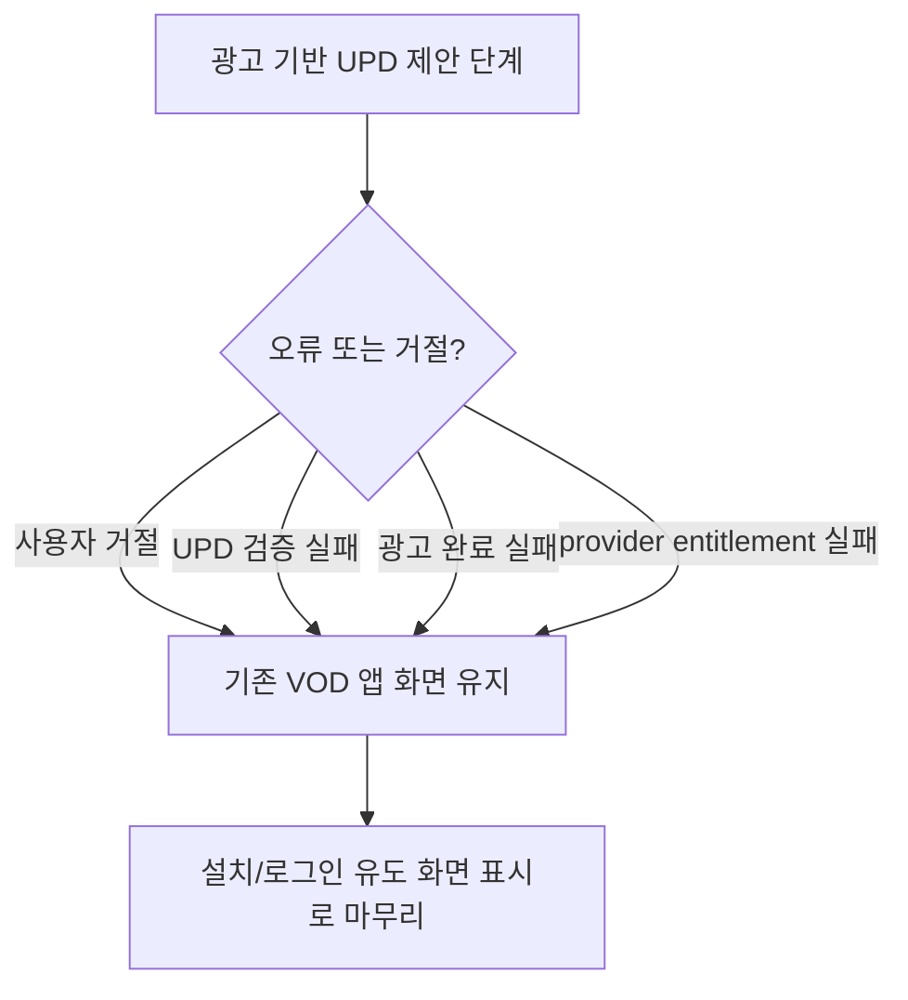

도 7은 UPD 적용 실패 또는 사용자의 광고 기반 재생 거절 시 별도의 앱 실행 실패 처리를 수행하지 않고, 기존 VOD 앱 화면 또는 앱 유도 화면을 계속 표시하는 fallback 흐름을 나타낸다.

<!-- page-break:page-7 -->

대외비

## 5. 부록: 요약서 및 출원 전략

### 5.1 요약서

본 발명은 스마트 TV, 특히 Tizen 기반 삼성 TV와 같은 디스플레이 장치에서 UPD를 RAG 기반 콘텐츠 해석 시스템과 기존 추천 시스템에 연계하고, 사용자가 추천 콘텐츠를 선택한 후 기존 VOD 앱 화면에서 앱 설치, 로그인, 회원가입 또는 결제 유도 화면이 인식되는 경우 광고 기반 UPD 재생을 제안하는 방법 및 시스템에 관한 것이다.

TV 제품 개발사 서버는 VOD 사업자의 UPD 또는 UPD 메타데이터를 수신하여 RAG 지식 또는 벡터 인덱스로 구성하고, 기존 추천 시스템은 이를 이용하여 외부 VOD 콘텐츠 추천 후보를 보강한다. 추천 후보는 기존 VOD 앱 화면으로 이동하기 위한 appDeepLink와, 화면 인식 이후 UPD 적용 가능성을 확인하기 위한 updId를 함께 포함할 수 있다.

사용자가 추천 콘텐츠를 선택하면 디스플레이 장치는 먼저 기존 VOD 앱 화면 또는 앱 유도 화면을 로딩한다. 화면 인식 모듈은 상기 화면이 앱 설치 안내, 로그인 요청, 회원가입 요청, 결제 요청 또는 권한 부족 안내 화면인지 판단한다. 해당 장벽 화면이 인식되는 경우에만 UPD Resolver Service가 UPD 적용 가능 여부를 확인하고 사용자에게 광고 기반 재생을 제안한다.

사용자가 수락하면 Ad Unlock Engine은 광고를 재생하고 광고 완료 증명 토큰을 생성 또는 수신한다. Unified Playback Service는 상기 광고 완료 증명 토큰 및 UPD를 검증하고, VOD 사업자 또는 권한 서버로부터 provider-signed entitlement token 또는 DRM 라이선스 요청용 토큰을 수신한다. 이후 Unified Player, AVPlay 또는 내부 player stack은 UPD의 URL, DRM, subtitle 및 ad policy 정보를 이용하여 외부 VOD 콘텐츠를 재생한다.

UPD 적용이 불가능하거나, 사용자가 광고 기반 재생을 원하지 않거나, 광고 완료 증명 또는 provider entitlement 발급이 실패한 경우에는 기존 VOD 앱 화면 또는 앱 유도 화면을 계속 표시한다. 이에 따라 본 발명은 기존 앱 유입 흐름을 유지하면서도, 설치 및 로그인 장벽 상황에서 광고 기반 무료 재생, 미리보기, 제휴 AVOD/FAST 콘텐츠 및 프로모션 콘텐츠의 앱리스 체험 재생을 가능하게 한다.

### 5.2 출원 전략

본 발명의 1순위 독립항은 “UPD 기반 RAG 구성 및 기존 추천 연계 + 추천 콘텐츠 선택 후 기존 VOD 앱 화면 로딩 + 화면 인식 기반 설치/로그인 유도 화면 판단 + UPD 적용 가능성 확인 + 사용자 광고 기반 재생 수락 + 광고 완료 증명 토큰 + provider-signed entitlement token + Unified Player 또는 AVPlay 재생”의 결합을 중심으로 구성하는 것이 바람직하다.

종속항은 다음 방향으로 강화할 수 있다.

1. UPD 또는 UPD 메타데이터를 RAG 지식으로 구성하고 기존 추천 시스템에 연계하는 구조를 구체화한다.
2. 추천 연계 메타데이터의 appDeepLink/updId 병행 구조를 구체화한다.
3. 기존 VOD 앱 화면 로딩 후 화면 내 텍스트, UI layout, provider API 응답 또는 접근성 정보를 이용한 장벽 화면 인식 방식을 구체화한다.
4. UPD의 URL, DRM, subtitle, ad policy, devicePolicy, validity 및 signature 필드를 구체화한다.
5. 광고 완료 증명 토큰과 provider-signed entitlement token 및 DRM license 요청의 결합을 구체화한다.
6. UPD 불가, 사용자 거절 또는 권한 발급 실패 시 기존 앱 화면을 유지하는 fallback 구조를 포함한다.

### 5.3 광고 기반 unlock 및 DRM 연동 보강 방향

광고 기반 unlock은 본 발명의 핵심 차별점 중 하나이다. 단순 광고 삽입이 아니라, 광고 완료 증명 토큰이 provider entitlement 및 DRM license 요청의 조건으로 사용된다는 점을 명세서와 청구항에 명확히 반영하는 것이 중요하다.

특히 ad completion token은 providerId, contentId, adSessionId, completionRate, 만료 시간 및 전자서명을 포함할 수 있고, provider-signed entitlement token은 상기 광고 완료 증명, 장치 클래스, 콘텐츠 식별자 및 세션 식별자에 바인딩될 수 있다. 이 구조는 광고 우회를 방지하고, VOD 사업자에게 광고 시청이 실제 재생 권한 부여 조건으로 검증되었음을 보장할 수 있다.

### 5.4 등록 가능성을 높이는 차별점

1. 본 발명은 UPD를 RAG 기반 콘텐츠 해석 시스템과 기존 추천 시스템에 연계하여 추천 후보를 보강한다.
2. 사용자가 추천 콘텐츠를 선택하면 기존 VOD 앱 화면을 먼저 표시하고, 그 화면을 인식하여 설치/로그인 장벽 여부를 판단한다.
3. 광고 완료 증명 토큰을 provider-signed entitlement token 및 DRM license 요청과 연결한다.
4. 기존 Unified Player, AVPlay 또는 내부 player stack을 오케스트레이션하여 앱 설치 또는 전체 앱 실행 없이 재생한다.
5. UPD 적용 실패 또는 사용자의 광고 기반 재생 거절 시 기존 VOD 앱 화면을 유지하여 기존 앱 유입 흐름과 충돌을 줄인다.
6. AVOD/FAST, 미리보기, 1화 무료, 특정 구간 무료 및 프로모션 콘텐츠부터 적용할 수 있어 사업자 협력 가능성을 높인다.

### 5.5 분할출원 또는 추가 variation 후보

| 후보 | 핵심 구성 | 권리화 포인트 |
|---|---|---|
| Variation A | UPD 기반 RAG 추천 연계 | UPD 지식 구성, 벡터 인덱스, 기존 추천 후보 보강 |
| Variation B | 화면 인식 기반 UPD fallback | 기존 VOD 앱 화면 로딩 후 설치/로그인/가입/결제 유도 화면 판단 |
| Variation C | 광고 완료 증명 기반 재생 unlock | ad completion token, completion proof, 광고 완료율 검증, provider entitlement 발급 |
| Variation D | DRM entitlement 및 Unified Player 재생 | provider-signed token, DRM license request, Unified Player 또는 AVPlay 설정 |
| Variation E | UPD 실패/거절 fallback | UPD 불가, 검증 실패, 사용자 거절 시 기존 VOD 앱 화면 유지 |
| Variation F | 사업자 친화형 미리보기/프로모션 UPD | 10분 미리보기, 1화 무료, 브랜드 로딩, 가입 CTA, 앱 유입 funnel |

## 6. 제출 전 확인 사항

| 구분 | 확인 내용 | 상태 |
|---|---|---|
| 발명의 명칭 | 한글/영문 발명의 명칭 기재 | 반영 |
| 선행기술 | 스마트 TV 추천, 앱 딥링크, 앱 설치 안내, AVOD/FAST, DRM 및 광고 unlock 관련 종래 방식 기재 | 반영 |
| 기술분야 | 스마트 TV, 외부 VOD, UPD, 광고 기반 앱리스 재생, DRM 및 Unified Player 분야 기재 | 반영 |
| 문제점/목적 | 앱 설치, 로그인, 회원가입, 결제 장벽 및 추천 UX 단절 문제 기재 | 반영 |
| 구성 | UPD/RAG 추천 연계부, VOD 앱 화면 로딩부, 화면 인식 모듈, UPD Resolver, Ad Unlock Engine, Provider Entitlement Gateway, Unified Playback Service, UPD Fallback 처리부 기재 | 반영 |
| JSON 필드 | 추천 연계 메타데이터, 화면 인식 결과, UPD, 광고 완료 증명 토큰, DRM entitlement 예시 기재 | 반영 |
| 도면 | 종래기술 도면 및 본 발명 도면 Mermaid 형식 기재 | 반영 |
| 청구항 | 방법, 시스템, 기록매체 청구항 및 종속항 후보 기재 | 반영 |
| 발명자 정보 | 성명, 소속, 연락처, 이메일 | 출원 전 보완 필요 |
| 실제 구현값 | 제품명, 사업자명, 광고 서버, DRM 조건, 정산 정책, 플랫폼 권한 | 출원 전 보완 필요 |
