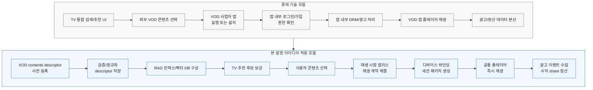
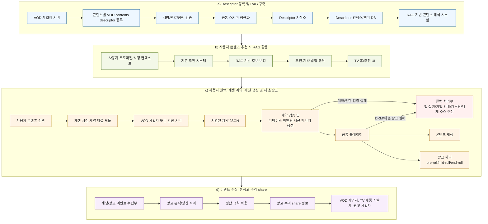
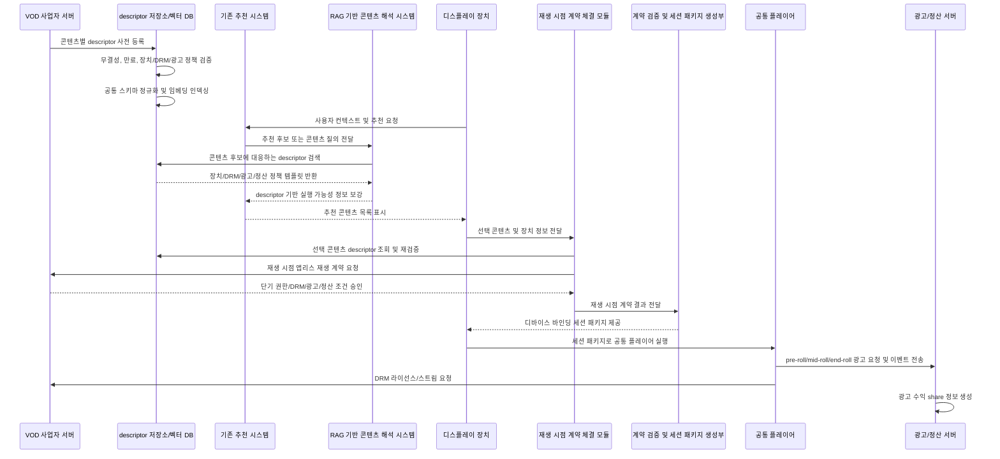

# VOD 콘텐츠 즉시 재생 방법 및 시스템

작성일: 2026-05-28  
초안 목적: 선행특허 조사, 비교, 차별성 및 출원용 명세서/청구항 초안 정리  
발명 유형: 방법, 디스플레이 장치, 서버 시스템, 컴퓨터 판독 가능 기록매체

> 본 문서는 발명 발굴 및 특허 명세서 초안 작성을 위한 기술 문서이다. 최종 출원 전에는 변리사의 선행기술 정밀조사, 청구범위 보정, 권리범위 및 침해 리스크 검토가 필요하다.

## 핵심 흐름 비교

본 발명의 유용성은 외부 VOD 콘텐츠를 "추천은 TV가 하고, 재생은 VOD 앱으로 넘기는 구조"에서 "추천, 권한 계약, 재생, 광고 및 정산을 TV 제품 개발사 플랫폼 안에서 연결하는 구조"로 전환하는 데 있다.

| 구분 | 기존 흐름 | 본 발명 적용 흐름 |
|---|---|---|
| 콘텐츠 준비 | VOD 사업자가 콘텐츠 메타데이터 또는 딥링크를 제공 | VOD 사업자가 콘텐츠별 VOD contents descriptor를 사전 등록하고, TV 제품 개발사가 이를 검증·정규화 |
| 추천/검색 | TV 추천 UI가 콘텐츠를 노출하더라도 외부 앱의 가입·로그인·구독 상태를 알 수 없어 실제 재생 가능성은 분리됨 | descriptor 인덱스/벡터 DB와 RAG 기반 콘텐츠 해석 시스템이 추천 후보를 보강하고, 후보 재생 정책·계약 가능성·광고 조건·정산 가능성을 랭킹에 반영 |
| 사용자 선택 후 | VOD 사업자 앱 실행, 앱 설치, 로그인, 앱 내부 플레이어 전환이 발생 | 선택 시점에 VOD 사업자 또는 권한 서버와 재생 계약을 체결하고, 공통 플레이어용 세션 패키지를 생성 |
| 재생 권한 | 앱 내부 권한 확인 또는 단순 재생 URL/DRM 토큰 전달 | 디스플레이 장치 또는 장치 클래스에 바인딩된 단기 권한 토큰, DRM 요청 정보, 광고 스케줄, 정산 규칙을 포함하는 서명된 실행 계약 사용 |
| 광고/정산 | 광고와 수익 정산이 VOD 앱 또는 외부 광고 시스템에 분산됨 | pre-roll, mid-roll, end-roll 광고 재생 이벤트와 수익 share 정보를 재생 계약 및 정산 규칙에 따라 연결 |
| 사용자 경험 | 앱 전환, 재로그인, 설치 유도, 재생 지연으로 추천 경험이 끊김 | TV 홈/추천 화면에서 선택한 외부 VOD 콘텐츠를 앱 설치 또는 전체 앱 실행 없이 즉시 재생 |

요약하면, 본 발명은 외부 VOD 콘텐츠를 TV 플랫폼의 추천 화면에 "보여주는" 수준을 넘어, 추천 후보 생성부터 재생 시점 계약, 디바이스 바인딩 재생, 광고 이벤트 수집 및 수익 share까지 하나의 실행 가능한 흐름으로 묶는다. 이 점이 단순 통합 검색, 딥링크, DRM 전달 또는 광고 삽입 기술과 구별되는 핵심 효과이다.



상기 다이어그램에서 종래 기술은 추천 UI 이후 VOD 앱으로 제어권이 넘어가고 로그인, DRM, 광고 및 정산이 앱 내부 또는 외부 시스템에 분산된다. 반면 본 발명은 descriptor 사전 등록, RAG 기반 추천 보강, 재생 시점 계약, 디바이스 바인딩 세션 패키지, 공통 플레이어 재생 및 광고 수익 share를 TV 제품 개발사 플랫폼에서 하나의 실행 흐름으로 연결한다.

## 1. 발명의 핵심 요약

본 발명은 외부 VOD 사업자가 콘텐츠별 VOD contents descriptor를 사전에 등록하고, TV 제품 개발사가 상기 descriptor를 RAG 기반 콘텐츠 해석 시스템 및 기존 추천 시스템과 연계하여 콘텐츠 추천에 활용하며, 사용자가 실제로 특정 VOD 콘텐츠의 재생을 선택한 시점에 VOD 사업자 또는 권한 서버와 재생 시점 앱리스 재생 계약을 동적으로 체결하고, 그 결과로 특정 디스플레이 장치 또는 장치 클래스에만 유효한 디바이스 바인딩 세션 패키지를 생성하여 공통 플레이어에서 콘텐츠를 즉시 재생하는 기술이다.

핵심 구성은 다음과 같다.

1. VOD 사업자가 콘텐츠 식별자, 필수 메타데이터, 재생 템플릿, DRM 정책 템플릿, 장치 정책, 광고 정책 템플릿 및 수익 share 정책 식별자를 포함하는 VOD contents descriptor를 사전에 등록한다.
2. TV 제품 개발사가 복수 VOD 사업자의 descriptor를 검증, 정규화 및 인덱싱하여 RAG 기반 콘텐츠 해석 시스템과 기존 추천 시스템에 제공한다.
3. 기존 추천 시스템이 사용자 컨텍스트에 기초하여 콘텐츠 후보를 산출하면, RAG 기반 콘텐츠 해석 시스템이 descriptor 인덱스로부터 앱리스 재생 가능성, 장치 호환성, 광고 조건 및 권한 모드를 보강한다.
4. 사용자가 추천 또는 검색된 외부 VOD 콘텐츠를 선택하면, 재생 시점 계약 체결 모듈이 선택 콘텐츠의 descriptor와 디스플레이 장치 정보를 이용하여 VOD 사업자 또는 권한 서버와 재생 시점 앱리스 재생 계약을 체결한다.
5. 재생 시점 앱리스 재생 계약에 기초하여 단기 권한 토큰, DRM 라이선스 요청 정보, 광고 스케줄, 브랜드 표시 정보, 분석 비콘, 재생 기능 구성 정보 및 만료 조건을 포함하는 디바이스 바인딩 세션 패키지가 생성된다.
6. 디스플레이 장치의 공통 플레이어는 VOD 사업자 전용 애플리케이션을 설치하거나 전체 앱 런타임을 실행하지 않고 세션 패키지에 따라 콘텐츠를 재생한다.

## 2. 선행기술 조사

### 2.1 조사 대상 및 검색 관점

검색 관점은 다음과 같다.

- 복수 VOD 사업자 또는 복수 미디어 벤더 지원
- 콘텐츠 통합 탐색 또는 통합 추천 UI
- 미설치 콘텐츠 제공자 앱의 자동 설치 또는 실행
- DRM, 장치 클래스, 권한 정보를 포함하는 미디어 매니페스트 또는 정책
- 토큰 기반 콘텐츠 접근 및 임시 권한
- VOD 광고 삽입 및 광고 결과 보고
- 클라우드 기반 UI 또는 공통 미디어 UI

### 2.2 주요 선행문헌

| 구분 | 문헌 | 주요 내용 | 본 발명과의 관련성 |
|---|---|---|---|
| 매우 높음 | [US20030196204A1 / US7774343B2, Multiple media vendor support](https://patents.google.com/patent/US20030196204A1/en) | 복수 미디어/VOD 벤더를 지원하기 위해 벤더별 프로토콜, 데이터 구조, 카탈로그, 스트리밍 서버 등을 처리하는 구조를 개시한다. | 다중 VOD 벤더 지원이라는 큰 틀에서 가장 가까운 선행문헌이다. |
| 높음 | [US20080127281A1 / US7647332B2, Aggregating content from multiple content delivery types in a discovery interface](https://patents.google.com/patent/US20080127281A1) | 방송, VOD, IP 콘텐츠 등 복수 전달 유형의 콘텐츠 discovery 데이터를 통합 UI에 표시한다. | 통합 탐색/발견 UI 측면에서 유사하다. |
| 높음 | [US9854309B2, Multi source and destination media discovery and management platform](https://patents.google.com/patent/US9854309B2/en) | 복수 콘텐츠 소스 및 복수 재생 대상 장치의 미디어를 통합적으로 탐색, 관리, 재생 제어한다. | 복수 소스 콘텐츠 표시 및 재생 제어 측면에서 유사하다. |
| 높음 | [US20180113699A1, Automatically Installing Applications Based on Content Selection](https://patents.google.com/patent/US20180113699A1) | 사용자가 추천 콘텐츠를 선택했을 때 해당 콘텐츠 제공자 앱이 미설치이면 앱을 다운로드/설치하고 재생을 개시한다. | "앱 미설치 상태에서 콘텐츠 선택"이라는 문제 상황이 유사하지만, 해결 방향은 반대이다. |
| 중간-높음 | [US10455265B2, Program and device class entitlements in a media platform](https://patents.google.com/patent/US10455265B2) | 미디어 매니페스트 또는 정책에 프로그램 권한, 장치 클래스, 광고 삽입, 부모 통제 등의 정보를 포함하여 클라이언트 권한을 제어한다. | 장치 클래스와 권한 정책 측면에서 유사하다. |
| 중간 | [US10162943B2, Streamlined digital rights management](https://patents.google.com/patent/US10162943B2) | DRM 처리 지연을 줄이기 위해 보안 세션, 서명 URL, 권한 정보, 라이선스 정보를 매니페스트 또는 메타데이터와 결합한다. | 즉시 재생과 DRM 준비 측면에서 유사하다. |
| 중간 | [US20180114030A1, Secure content access system](https://patents.google.com/patent/US20180114030A1/en) | 구독, 라이선스, 임시 토큰, 갱신 토큰 등을 이용하여 미디어 콘텐츠 접근을 제어한다. | 임시 토큰 및 보안 접근 측면에서 유사하다. |
| 중간 | [US8973032B1, Advertisement insertion into media content for streaming](https://patents.google.com/patent/US8973032B1/en) | 스트리밍 미디어 콘텐츠에 광고를 삽입하는 구조를 개시한다. | 광고 삽입 자체와 관련된다. |
| 중간 | [US20220020363A1, Configurable control of voice command systems](https://patents.google.com/patent/US20220020363A1/en) | 스트리밍 앱의 UI 상태에 따라 음성 명령을 구성하거나 변환한다. | 사용자 명령 변환 측면에서 일부 유사하다. |
| 국내 참고 | [KR20210058791A / KR102380673B1, 클라우드 기반 유저 인터페이스 제공 시스템 및 그 방법](https://patents.google.com/patent/KR20210058791A/ko) | 원격 애플리케이션 서버가 UI 제어 커맨드와 리소스를 제공하고 단말에서 UI를 렌더링한다. | 공통 UI 제공 및 클라우드 제어 측면에서 참고된다. |

## 3. 선행기술 대비 비교 및 차별성

### 3.1 선행기술과 본 발명의 구성 비교

| 비교 항목 | 주요 선행기술 | 선행기술의 한계 | 본 발명의 차별 구성 |
|---|---|---|---|
| 복수 VOD 사업자 지원 | US20030196204A1 | 벤더별 VOD 프로토콜과 카탈로그 지원에 중점을 둔다. 사전 등록 descriptor를 RAG/추천 지식 원천으로 쓰고, 실제 재생 계약은 사용자 선택 시점에 체결하는 구조는 명확하지 않다. | 복수 VOD 사업자의 콘텐츠별 descriptor를 사전 등록 및 정규화하되, 재생 권한 및 세션은 사용자 선택 시점에 동적으로 계약하고 장치에 바인딩한다. |
| 통합 탐색 UI | US20080127281A1, US9854309B2 | 콘텐츠 discovery 또는 소스/장치 관리가 중심이다. 콘텐츠 선택 이후 전용 앱 없이 세션을 생성하는 실행 계층은 부족하다. | 추천/탐색 이후, 계약 검증과 세션 패키지 생성에 의해 공통 플레이어가 직접 재생한다. |
| 앱 미설치 문제 | US20180113699A1 | 콘텐츠 제공자 앱이 없으면 앱을 설치한다. | 앱을 설치하지 않고, 전용 앱 UI 런타임 전체도 실행하지 않는다. 공통 플레이어와 세션 패키지로 재생한다. |
| 권한/장치 클래스 | US10455265B2 | 매니페스트에 권한 및 장치 클래스 정보를 포함한다. | 사전 descriptor는 앱리스 가능성과 정책 템플릿을 나타내고, 실제 권한 토큰과 장치 바인딩 조건은 재생 시점 계약에서 확정된다. |
| DRM 즉시 재생 | US10162943B2 | DRM 지연을 줄이는 스트리밍 보안 구조에 초점이 있다. | DRM 정보뿐 아니라 앱리스 허용, 광고, 브랜드, 분석, UI 기능, 명령 변환을 포함하는 계약 기반 실행 구조이다. |
| 임시 토큰 | US20180114030A1 | 구독/라이선스/임시 토큰 기반 접근 제어를 다룬다. | 토큰은 단독 권한 수단이 아니라 사전 descriptor를 기초로 콘텐츠 선택 시점에 체결되는 재생 시점 앱리스 재생 계약에 따라 특정 디스플레이 장치 또는 장치 클래스에 바인딩되어 세션 패키지에 포함된다. |
| 광고 삽입 | US8973032B1 | 광고 삽입 자체를 다룬다. | 광고 정책 템플릿은 descriptor에 사전 등록되고, 실제 광고 스케줄 및 수익 share 조건은 재생 시점 계약 및 세션 패키지에서 확정된다. |
| 명령 변환 | US20220020363A1 | 특정 앱 또는 음성 명령 시스템의 제어 구성에 가깝다. | 전용 앱 없이 계약 내 재생 기능/명령 변환 정보에 따라 공통 플레이어 명령을 벤더별 실행 명령으로 변환한다. |

### 3.2 본 발명의 신규성 후보 포인트

본 발명은 다음 구성의 결합을 통해 선행기술과 차별화된다.

1. 외부 VOD 사업자가 콘텐츠별 VOD contents descriptor를 사전에 등록한다.
2. descriptor는 재생 URL 자체 또는 완성된 재생 권한 계약이 아니라, 콘텐츠 식별자, 필수 메타데이터, 장치 클래스, DRM 정책 템플릿, 광고 정책 템플릿 및 수익 share 정책 식별자를 포함한다.
3. TV 제품 개발사가 복수 사업자의 descriptor를 검증, 정규화 및 RAG 검색 인덱스로 구성한다.
4. 기존 추천 시스템의 콘텐츠 후보가 descriptor 기반 앱리스 가능성, 장치 호환성, 광고 조건 및 권한 모드로 보강된다.
5. 사용자의 콘텐츠 선택 시점에 VOD 사업자 또는 권한 서버와 재생 시점 앱리스 재생 계약을 체결하고, 이때 실제 단기 권한 토큰, DRM 라이선스 요청 정보, 광고 스케줄, 수익 share 조건 및 만료 조건이 확정된다.
6. 재생 시점 계약에 기초하여 특정 디스플레이 장치 또는 장치 클래스에 바인딩된 세션 패키지를 새로 생성한다.
7. VOD 사업자의 전용 애플리케이션 설치 또는 전체 앱 런타임 실행 없이, 디스플레이 장치의 공통 플레이어가 세션을 생성한다.
8. 계약 체결 실패 또는 장치 호환성 실패 시 전용 앱 실행, 가입 안내, 캐스팅 또는 대체 소스 추천으로 폴백한다.

### 3.3 진보성 주장 방향

선행기술은 각각 다중 VOD 지원, 통합 discovery UI, 앱 자동 설치, DRM/권한 매니페스트, 임시 토큰, 광고 삽입을 개별적으로 개시한다. 그러나 이들 기술은 대체로 콘텐츠 탐색 계층, 기존 앱 실행/설치, 또는 일반적인 DRM/광고 처리에 초점이 있다.

본 발명은 외부 VOD 사업자의 정책을 보존하면서도 전용 앱 설치 또는 전체 앱 실행을 제거하기 위해, 사전 등록 descriptor와 재생 시점 계약을 분리한다. 사전 descriptor는 추천 및 RAG 검색을 위한 지식 원천으로 사용되고, 실제 재생 권한은 사용자가 콘텐츠를 선택한 시점에 VOD 사업자 또는 권한 서버와 동적으로 체결된다. 이는 단순히 기존 VOD 데이터를 통합하거나 앱을 자동 설치하는 것과 달리, 탐색/추천 단계의 정보와 실행/권한 단계의 계약을 분리하여 보안성, 최신 정책 반영성 및 장치 바인딩 재생을 동시에 달성하는 조합이다.

따라서 진보성 주장은 다음 효과를 중심으로 구성하는 것이 바람직하다.

- 사용자의 앱 설치/회원가입 진입 장벽 감소
- 외부 VOD 사업자의 콘텐츠 보호 및 재생 시점 정책 유지
- 장치 바인딩 단기 세션으로 URL/토큰 재사용 방지
- 공통 플레이어 기반의 빠른 재생 시작
- 복수 사업자 descriptor를 정규화하여 사업자 온보딩 및 운영 비용 감소

## 4. 명세서 초안

### 4.1 발명의 명칭

VOD 콘텐츠 즉시 재생 방법 및 시스템

### 4.2 기술분야

본 발명은 디스플레이 장치에서 영상 콘텐츠를 추천, 선택 및 재생하는 기술에 관한 것이다. 보다 상세하게는, 외부 VOD 사업자가 콘텐츠별 VOD contents descriptor를 사전에 등록하고, TV 제품 개발사가 상기 descriptor를 RAG 기반 콘텐츠 해석 시스템 및 기존 추천 시스템과 연계하여 추천 후보를 보강하며, 사용자의 실제 재생 선택 시점에 재생 시점 앱리스 재생 계약을 동적으로 체결하고 디바이스 바인딩 세션 패키지를 생성하여, VOD 사업자 전용 애플리케이션의 설치 또는 전체 실행 없이 디스플레이 장치의 공통 플레이어에서 외부 VOD 콘텐츠를 즉시 재생하는 방법, 디스플레이 장치, 서버 시스템 및 컴퓨터 판독 가능 기록매체에 관한 것이다.

### 4.3 배경기술

스마트 TV, 셋톱박스, 차량용 디스플레이, AI 디스플레이 장치 등은 사용자의 시청 이력, 검색 이력, 선호 장르, 시간대, 가족 구성원별 이용 패턴 등을 분석하여 영상 콘텐츠를 추천한다. 또한 복수의 VOD 또는 OTT 사업자가 제공하는 콘텐츠를 하나의 홈 화면 또는 검색 결과 화면에서 표시하는 서비스도 제공되고 있다.

그러나 추천 또는 검색된 콘텐츠가 특정 외부 VOD 사업자의 콘텐츠인 경우, 사용자는 해당 콘텐츠를 실제로 재생하기 위해 VOD 사업자의 전용 애플리케이션을 설치하고, 애플리케이션을 실행하고, 로그인, 회원가입, 결제 또는 구독 절차를 수행해야 하는 경우가 많다. 이러한 절차는 콘텐츠 선택 이후 실제 재생까지의 지연을 증가시키고 사용자의 이탈을 유발한다.

특히 descriptor를 기반으로 추천된 콘텐츠라 하더라도, 해당 VOD 사업자의 애플리케이션이 설치되어 있지 않거나, 설치되어 있더라도 회원가입, 로그인, 구독 또는 결제가 완료되어 있지 않은 경우 사용자는 즉시 재생할 수 없다. 또한 디스플레이 장치 또는 TV 제품 개발사 플랫폼은 외부 VOD 애플리케이션 내부의 회원가입 상태, 로그인 세션, 구독 상태, 결제 상태 또는 앱 내부 재생 가능 상태를 안정적으로 알 수 없다. 따라서 추천 단계에서 단순히 descriptor 또는 앱 설치 여부만으로 실제 재생 가능 여부를 확정하는 것은 어렵다.

한편 VOD 사업자 입장에서는 전용 앱을 실행하지 않는 재생 환경에서 콘텐츠 URL, DRM 라이선스, 광고 정책, 브랜드 표시, 분석 비콘, 지역/연령 제한 및 재생 기능 정책이 무단으로 변경되거나 누락되는 것을 우려할 수 있다. 따라서 단순히 콘텐츠 URL 또는 DRM 정보를 제공하는 것만으로는 외부 디스플레이 장치의 공통 플레이어에서 안전한 재생을 허용하기 어렵다.

이에 따라, 외부 VOD 사업자의 재생 정책을 보존하면서도 사용자가 전용 애플리케이션을 설치하거나 전체 앱 런타임을 실행하지 않고 콘텐츠를 즉시 재생할 수 있는 기술이 요구된다.

### 4.4 해결하려는 과제

본 발명의 과제는 사용자가 외부 VOD 사업자의 전용 애플리케이션을 설치하거나 전체 실행하지 않고도, 디스플레이 장치의 공통 플레이어를 통해 외부 VOD 콘텐츠를 즉시 재생할 수 있도록 하는 것이다.

본 발명의 다른 과제는 VOD 사업자가 콘텐츠 식별자, 필수 메타데이터, 디바이스 클래스, DRM 정책 템플릿, 광고 정책 템플릿 및 수익 share 정책 식별자를 포함하는 VOD contents descriptor를 사전에 제공하도록 하고, TV 제품 개발사의 서버가 이를 검증, 정규화 및 RAG 검색 인덱스로 구성하도록 하는 것이다.

본 발명의 또 다른 과제는 descriptor 기반 추천 단계에서는 외부 VOD 애플리케이션의 설치, 회원가입, 로그인, 구독 또는 결제 상태를 확정적으로 판단하지 않고, 사용자가 콘텐츠 재생을 요청한 시점에 VOD 사업자 또는 권한 서버와 별도의 재생 시점 앱리스 재생 계약을 체결하여 실제 재생 가능 여부와 권한 조건을 확정하도록 하는 것이다.

본 발명의 또 다른 과제는 사용자의 콘텐츠 선택 시점에 VOD 사업자 서버 또는 권한 서버와 재생 시점 앱리스 재생 계약을 동적으로 체결하고, 계약 검증 및 세션 패키지 생성부가 특정 디스플레이 장치 또는 장치 클래스에 바인딩된 단기 권한 토큰과 DRM 라이선스 요청 정보를 포함하는 세션 패키지를 생성하여, 재생 URL 또는 권한 토큰의 재사용을 방지하는 것이다.

본 발명의 또 다른 과제는 사전 descriptor의 장치 정책 또는 DRM 정책이 만족되지 않거나, 재생 시점 계약 체결 실패, 앱리스 허용 불가 또는 장치 호환성 실패 시 사용자 경험을 중단하지 않고 전용 앱 실행, 가입 안내, 캐스팅 또는 대체 소스 추천과 같은 폴백 경로를 제공하는 것이다.

### 4.5 과제 해결 수단

일 실시예에 따른 방법은, VOD 사업자 서버가 VOD 콘텐츠별 descriptor를 생성하여 TV 제품 개발사의 descriptor 저장소에 사전 등록하는 단계, 상기 descriptor 저장소가 상기 descriptor를 검증 및 정규화하고 RAG 기반 콘텐츠 해석 시스템이 검색 가능한 descriptor 인덱스를 구성하는 단계, 디스플레이 장치 또는 추천 서버가 사용자 기호 정보에 기초하여 하나 이상의 외부 VOD 콘텐츠 후보를 추천하는 단계, 상기 RAG 기반 콘텐츠 해석 시스템이 상기 descriptor 인덱스를 검색하여 상기 콘텐츠 후보의 후보 재생 정책, 장치 호환성 및 광고 조건을 보강하되 외부 VOD 애플리케이션의 회원가입, 로그인, 구독 또는 결제 상태를 실제 재생 가능 상태로 확정하지 않는 단계, 상기 외부 VOD 콘텐츠 중 선택된 콘텐츠에 대한 사용자 선택 또는 재생 요청을 수신하는 단계, 상기 선택된 콘텐츠에 대응하는 descriptor와 상기 디스플레이 장치의 장치 정보를 이용하여 VOD 사업자 서버 또는 권한 서버와 재생 시점 앱리스 재생 계약을 체결하는 단계, 계약 검증 및 세션 패키지 생성부가 상기 재생 시점 앱리스 재생 계약에 기초하여 디스플레이 장치 또는 장치 클래스에 바인딩된 세션 패키지를 생성하는 단계, 및 상기 세션 패키지에 기초하여 VOD 사업자 전용 애플리케이션을 설치 또는 전체 실행하지 않고 공통 플레이어에서 콘텐츠를 재생하는 단계를 포함할 수 있다.

상기 VOD contents descriptor는 콘텐츠 식별자, VOD 사업자 식별자, 필수 콘텐츠 메타데이터, 재생 엔드포인트 템플릿, 스트리밍 프로토콜, 지원 DRM 타입, 지원 장치 클래스, 지역 제한, 광고 정책 템플릿, 수익 share 정책 식별자, descriptor 버전, 만료 시간 및 무결성 검증 정보를 포함할 수 있다.

상기 재생 시점 앱리스 재생 계약 또는 이에 기초한 세션 패키지는 디스플레이 장치 식별자 또는 장치 클래스에 바인딩된 단기 권한 토큰, 서명된 재생 URL, DRM 라이선스 요청 파라미터, 광고 스케줄, 브랜드 로딩 자원, 분석 비콘, UI 기능 구성 정보, 명령 변환 테이블, 수익 share 정보, 세션 만료 조건 및 폐기 조건을 포함할 수 있다.

### 4.6 발명의 효과

본 발명에 따르면, 사용자는 외부 VOD 사업자의 콘텐츠를 선택한 후 전용 애플리케이션 설치, 앱 전환 또는 전체 앱 런타임 실행 없이 공통 플레이어에서 콘텐츠를 즉시 시청할 수 있다.

또한 VOD 사업자는 콘텐츠별 descriptor를 사전에 등록하여 추천 및 검색 노출을 가능하게 하면서도, 실제 재생 권한과 단기 토큰은 재생 시점 계약에서 확정함으로써 콘텐츠 권한, DRM, 광고, 브랜드 표시, 분석 및 재생 기능 정책을 최신 상태로 유지할 수 있다.

또한 TV 제품 개발사는 복수 VOD 사업자의 descriptor를 정규화하고 RAG 기반 콘텐츠 해석 시스템의 지식 원천으로 활용함으로써, 사업자별 전용 앱 구현 없이도 외부 콘텐츠 추천 및 앱리스 재생 경험을 제공할 수 있다.

또한 디바이스 바인딩 단기 권한 토큰 및 세션 패키지를 이용함으로써, 재생 URL 또는 권한 토큰이 다른 장치에서 재사용되는 것을 방지할 수 있다.

### 4.7 도면의 간단한 설명

도 1은 본 발명의 일 실시예에 따른 앱리스 즉시 재생 시스템의 전체 구성도이며, VOD 사업자 서버, 사전 등록 VOD contents descriptor, TV 제품 개발사의 descriptor 저장소, RAG 기반 콘텐츠 해석 시스템, 기존 추천 시스템, 재생 시점 계약 체결 모듈, 계약 검증 및 세션 패키지 생성부, 디스플레이 장치의 공통 플레이어, 광고 서버 및 정산 서버 간의 관계를 나타낸다.

도 2는 VOD 사업자 서버가 VOD contents descriptor를 생성하고 descriptor 저장소에 사전 등록하는 흐름도이다.

도 3은 descriptor 저장소가 VOD contents descriptor를 검증, 정규화 및 인덱싱하는 흐름도이다.

도 4는 사용자가 추천 콘텐츠를 선택한 후 재생 시점 앱리스 재생 계약이 체결되고 디바이스 바인딩 세션 패키지가 생성되는 흐름도이다.

도 5는 디스플레이 장치의 공통 플레이어가 세션 패키지에 기초하여 콘텐츠를 재생하는 흐름도이다.

도 6은 계약 검증 실패 또는 앱리스 허용 불가 시 폴백 경로를 제공하는 흐름도이다.

## 5. 발명의 실시를 위한 구체적인 내용

### 5.1 용어 정의

본 명세서에서 "앱리스"란 사용자가 VOD 사업자의 전용 애플리케이션을 다운로드 또는 설치하지 않거나, 전용 애플리케이션의 전체 UI 런타임을 실행하지 않는 것을 의미한다. 다만 디스플레이 장치의 운영체제, 공통 미디어 파이프라인, DRM/CDM 모듈, 공통 웹 런타임, 표준 스트리밍 라이브러리, 공통 광고 SDK 또는 경량 벤더 어댑터의 사용은 배제하지 않는다.

본 명세서에서 "VOD contents descriptor" 또는 "descriptor"는 VOD 사업자가 콘텐츠별로 사전에 등록하는 구조화 데이터이다. descriptor는 콘텐츠 메타데이터, 장치 클래스, DRM 정책 템플릿, 광고 정책 템플릿 및 수익 share 정책 식별자를 포함할 수 있다. descriptor는 추천, 검색, RAG 기반 콘텐츠 해석 및 재생 가능성 판단에 사용되며, 그 자체가 특정 사용자 또는 특정 장치에 대한 최종 재생 권한을 부여하는 것은 아니다.

본 명세서에서 "재생 시점 앱리스 재생 계약"은 사용자가 특정 콘텐츠의 재생을 선택한 시점에, 선택된 콘텐츠의 descriptor, 디스플레이 장치 정보, 사용자 권한 상태, 지역 정보, 광고 조건 및 VOD 사업자 정책에 기초하여 동적으로 체결되는 실행 계약이다. 재생 시점 앱리스 재생 계약은 특정 디스플레이 장치 또는 장치 클래스에 대한 단기 재생 권한, DRM 라이선스 요청 조건, 광고 스케줄, 수익 share 조건, 만료 조건 및 전자서명 또는 무결성 검증 정보를 포함할 수 있다.

본 명세서에서 "디바이스 바인딩"은 세션 패키지 또는 단기 권한 토큰이 특정 디스플레이 장치, 장치 식별자, 장치 클래스, 보안 수준, 지역 또는 이들의 조합에 대해 유효하도록 제한되는 것을 의미한다.

본 명세서에서 "공통 플레이어"는 디스플레이 장치가 제공하는 미디어 재생 모듈로서, 복수 VOD 사업자의 콘텐츠를 재생 시점 앱리스 재생 계약 및 세션 패키지에 따라 재생할 수 있는 플레이어를 의미한다.

### 5.2 시스템 구성

일 실시예에서 시스템은 VOD 사업자 서버, descriptor 저장소, RAG 기반 콘텐츠 해석 시스템, 재생 시점 계약 체결 모듈, 계약 검증 및 세션 패키지 생성부, 추천 엔진, 디스플레이 장치, 공통 플레이어, DRM/권한 브로커, 광고 처리 모듈, 분석 서버 및 정산 서버를 포함할 수 있다.

VOD 사업자 서버는 콘텐츠별 VOD contents descriptor를 생성하여 사전 등록한다. descriptor 저장소는 복수 VOD 사업자로부터 descriptor를 수신하고, 각 descriptor의 무결성, 만료 시간, 지원 장치 클래스 및 필수 정책 필드를 검증한다.

재생 시점 계약 체결 모듈은 사용자가 선택한 콘텐츠, 사전 등록 descriptor 및 디스플레이 장치의 장치 식별자 또는 장치 클래스에 기초하여 VOD 사업자 서버 또는 권한 서버와 재생 시점 앱리스 재생 계약을 체결한다. 계약 검증 및 세션 패키지 생성부는 상기 계약 결과를 검증하고, 그 결과에 따라 세션 패키지를 생성한다. 계약 검증 및 세션 패키지 생성부는 디스플레이 장치 내에 구현되거나 TV 제품 개발사 서버 또는 클라우드 서버에 구현될 수 있다.

디스플레이 장치의 공통 플레이어는 세션 패키지에 포함된 재생 URL, DRM 라이선스 요청 정보, 광고 스케줄, 브랜드 표시 정보 및 재생 기능 구성 정보에 따라 콘텐츠를 재생한다.

#### 5.2.1 전체 시스템 구조

일 실시예에서 VOD contents descriptor는 VOD 사업자가 콘텐츠별로 사전 제공하는 재생 가능성 및 정책 템플릿 데이터에 해당한다. TV 제품 개발사는 복수 VOD 사업자로부터 수신한 콘텐츠별 descriptor를 검증하고, 이를 descriptor 저장소 및 RAG 기반 콘텐츠 해석 시스템의 지식 원천으로 구성할 수 있다. 기존 추천 시스템은 사용자 취향, 시청 이력 및 컨텍스트에 기초하여 콘텐츠 후보를 산출하고, RAG 기반 콘텐츠 해석 시스템은 해당 후보가 앱리스 재생 후보인지, 어떤 VOD 사업자가 제공하는지, 어떤 광고/DRM/브랜드/권한 정책 템플릿이 적용될 수 있는지를 descriptor로부터 검색 및 보강한다.

사용자가 추천된 VOD 콘텐츠를 선택하면, 재생 시점 계약 체결 모듈은 선택된 콘텐츠의 descriptor와 디스플레이 장치의 장치 식별자 또는 장치 클래스를 이용하여 VOD 사업자 서버 또는 권한 서버와 재생 시점 앱리스 재생 계약을 체결한다. 상기 계약에서 실제 단기 권한 토큰, DRM 라이선스 요청 정보, 광고 스케줄, 수익 share 조건 및 만료 조건이 확정되고, 그 결과로 계약 검증 및 세션 패키지 생성부가 디바이스 바인딩 세션 패키지를 생성한다. 디스플레이 장치의 공통 플레이어는 세션 패키지에 포함된 광고 스케줄에 따라 pre-roll, mid-roll 및 end-roll 광고 중 적어도 하나를 재생하고, 광고 재생 결과를 분석 서버 또는 정산 서버로 전송한다. 정산 서버는 재생 시점 앱리스 재생 계약 또는 별도 정산 계약에 정의된 정산 규칙에 기초하여 VOD 사업자, TV 제품 개발사, 광고 사업자 간의 광고 수익 share 정보를 생성한다.



상기 전체 시스템 구조는 descriptor 등록 및 RAG 구축, RAG 활용 추천, 재생 시점 계약 체결 및 공통 플레이어 재생, 이벤트 수집 및 광고 수익 share의 네 개 시점 패키지로 구분된다. 각 패키지는 내부적으로 좌에서 우로 진행되고, 전체 패키지는 a 단계에서 d 단계로 순차 진행된다.

#### 5.2.2 descriptor 기반 RAG 및 추천 연계 흐름

descriptor 기반 RAG 및 추천 연계 흐름은 다음과 같이 구성될 수 있다.



#### 5.2.3 모듈별 정의 및 기술

| 모듈 | 정의 | 주요 기능 및 기술적 특징 |
|---|---|---|
| VOD 사업자 서버 | 외부 VOD 콘텐츠를 제공하는 사업자의 서버이다. | 콘텐츠별 재생 URL, DRM 라이선스 서버, 광고 정책, 브랜드 표시 정보, 분석 비콘 및 앱리스 허용 조건을 생성하거나 제공한다. |
| descriptor 생성/등록 모듈 | 콘텐츠별 VOD contents descriptor를 생성하고 사전 등록하는 VOD 사업자 측 모듈이다. | 개별 VOD 콘텐츠 단위로 descriptor를 생성한다. descriptor에는 콘텐츠 식별자, 필수 메타데이터, 장치 클래스, DRM 정책 템플릿, 광고 정책 템플릿, 수익 share 정책 식별자, 만료 및 무결성 검증 정보가 포함된다. |
| descriptor 수신부 | TV 제품 개발사 측에서 VOD 사업자 descriptor를 수신하는 모듈이다. | 복수 VOD 사업자의 descriptor를 API, 배치 파일, 메시지 큐, 매니페스트 확장 또는 관리 포털을 통해 수신한다. |
| 무결성/정책 검증부 | descriptor의 출처와 사전 등록 가능성을 검증하는 모듈이다. | VOD 사업자의 공개키 또는 인증서 체인을 이용하여 descriptor의 전자서명 또는 무결성 값을 검증하고, 만료 시간, 지역 제한, 장치 클래스, DRM 보안 수준 및 출력 보호 조건을 확인한다. |
| 공통 스키마 정규화 모듈 | VOD 사업자별로 상이한 descriptor 필드를 공통 descriptor 스키마로 변환하는 모듈이다. | 사업자별 광고 정책명, DRM 필드명, 기능 식별자, 분석 비콘 형식을 공통 필드로 매핑한다. 이를 통해 기존 추천 시스템, RAG 시스템, 재생 시점 계약 체결 모듈 및 계약 검증 및 세션 패키지 생성부가 동일한 방식으로 descriptor를 해석할 수 있다. |
| descriptor 저장소 | 검증 및 정규화된 descriptor를 저장하는 저장소이다. | 콘텐츠 식별자, VOD 사업자 식별자, descriptor 버전, DRM 정책 템플릿, 광고 정책 템플릿, 수익 share 정책 식별자 및 만료 조건을 구조화하여 저장한다. |
| descriptor 인덱스/벡터 DB | descriptor의 텍스트, 메타데이터 및 정책 필드를 검색 가능하게 구성한 인덱스이다. | 콘텐츠 제목, VOD 사업자 식별자, 장치 클래스, 지역, DRM 정책 템플릿, 광고 정책 템플릿 및 수익 share 정책 식별자 등을 임베딩 또는 색인화하여 RAG 기반 검색에 사용한다. |
| RAG 기반 콘텐츠 해석 시스템 | 기존 추천 후보 또는 사용자 질의를 descriptor 지식 기반으로 보강하는 시스템이다. | 추천 후보에 대응하는 descriptor를 검색하고, 콘텐츠 매칭, 제공 사업자 식별, 장치 호환성, DRM 호환성, 광고 조건, 수익 share 정책 식별자 및 폴백 필요 여부를 반환한다. |
| 기존 추천 시스템 | 사용자 취향과 이용 맥락에 따라 콘텐츠 후보를 산출하는 기존 추천 엔진이다. | 사용자 시청 이력, 검색 이력, 선호 장르, 시간대, 가족 구성원, 디바이스 사용 패턴 등을 기반으로 콘텐츠 후보를 생성한다. 본 발명에서는 RAG 시스템이 반환한 descriptor 기반 실행 가능성 및 정책 정보를 추천 후보 랭킹에 결합한다. |
| 추천-계약 결합 랭커 | 기존 추천 점수와 descriptor 기반 실행 가능성 점수를 결합하는 모듈이다. | 추천 점수, 장치 호환성, 광고 조건, 예상 시작 지연, 화질, DRM 지원 및 수익 share 조건을 고려하여 사용자에게 표시할 콘텐츠와 재생 소스를 결정한다. |
| 재생 시점 계약 체결 모듈 | 사용자 선택 시점에 VOD 사업자 서버 또는 권한 서버와 재생 시점 앱리스 재생 계약을 동적으로 체결하는 모듈이다. | 선택 콘텐츠 descriptor, 장치 식별자, 장치 클래스, 보안 수준, 지역 정보, 사용자 권한 상태 및 광고 조건을 전송하고, VOD 사업자로부터 단기 권한 토큰, DRM 라이선스 요청 조건, 광고 스케줄, 수익 share 조건, 만료 조건 및 전자서명 정보를 수신한다. |
| 계약 검증 및 세션 패키지 생성부 | 재생 시점 계약 결과에 기초하여 디바이스 바인딩 세션 패키지를 생성하는 구성부이다. | 재생 시점 계약 결과를 검증하고, 장치 식별자 또는 장치 클래스에 바인딩된 단기 권한 토큰, DRM 라이선스 요청 정보, 광고 스케줄, 브랜드 표시 정보, 분석 비콘, UI 기능 구성 및 폐기 조건을 포함하는 세션 패키지를 생성한다. |
| 추천 UI | 디스플레이 장치에서 추천 콘텐츠를 사용자에게 표시하는 UI이다. | 기존 추천 콘텐츠와 앱리스 재생 가능 콘텐츠를 표시하고, 사용자가 콘텐츠를 선택하면 계약 검증 및 세션 패키지 생성부에 선택 콘텐츠와 장치 정보를 전달한다. |
| 공통 플레이어 | VOD 사업자 전용 앱 설치 또는 전체 실행 없이 콘텐츠를 재생하는 디스플레이 장치의 플레이어이다. | 세션 패키지에 포함된 재생 URL, DRM 정보, 광고 스케줄, 브랜드 표시 정보 및 기능 구성을 해석하여 콘텐츠를 재생한다. 공통 DRM/CDM, 미디어 파이프라인, 광고 모듈 및 경량 벤더 어댑터를 사용할 수 있다. |
| DRM/CDM 및 권한 브로커 | DRM 라이선스 및 단기 권한 토큰을 처리하는 모듈이다. | 세션 패키지의 DRM 라이선스 요청 정보를 이용해 라이선스를 요청하고, 장치 바인딩 토큰, 보안 수준, 출력 보호 상태 및 만료 조건을 검증한다. |
| 광고 처리 모듈 | 세션 패키지의 광고 스케줄에 따라 광고를 재생하는 모듈이다. | pre-roll, mid-roll, end-roll 광고 중 적어도 하나를 재생하고, 광고 완료, 스킵 시도, 노출, 오류 및 상호작용 이벤트를 수집한다. |
| 광고 중개/광고 태그 서버 | 광고 소재 또는 광고 태그를 제공하는 서버이다. | VOD 사업자 광고 서버 또는 제3자 광고 서버와 연동하여 광고 소재를 선택하고, 광고 요청 및 응답을 세션 식별자와 연결한다. |
| 재생/광고 이벤트 수집부 | 콘텐츠 및 광고 재생 이벤트를 수집하는 디스플레이 장치 측 모듈이다. | 콘텐츠 시작, 일시정지, 완료, 오류, 광고 노출, 광고 완료, 광고 스킵 시도, end-roll 완료 여부 등을 분석 서버 또는 정산 서버로 전송한다. |
| 광고 분석/정산 서버 | 광고 재생 결과와 수익 share 정보를 생성하는 서버이다. | 광고 이벤트, 세션 식별자, VOD 사업자 식별자, TV 제품 개발사 식별자 및 계약의 수익 share 정산 규칙에 기초하여 VOD 사업자, TV 제품 개발사, 광고 사업자 간의 수익 share 정보를 생성한다. |

### 5.3 VOD contents descriptor 및 재생 시점 계약의 데이터 구조

VOD contents descriptor는 JSON, XML, 프로토콜 버퍼, CBOR, JWT, 미디어 매니페스트 확장 필드 또는 이들의 조합으로 표현될 수 있다. descriptor는 콘텐츠별로 사전 등록되는 데이터이며, 추천 및 RAG 검색을 위한 콘텐츠 정보와 재생 가능성 판단을 위한 필수 정책 템플릿을 포함한다. descriptor는 특정 사용자 또는 특정 장치에 대한 최종 재생 권한을 직접 부여하지 않으며, 실제 재생 권한은 재생 시점 앱리스 재생 계약에서 확정된다.

예시적인 VOD contents descriptor는 mandatory 필드만 포함하여 다음과 같이 표현될 수 있다.

```json
{
  "descriptorId": "providerA-vod12345-desc-v3",
  "contentId": "vod-12345",
  "providerId": "provider-A",
  "schemaVersion": "1.0",
  "metadata": {
    "title": "Sample Movie"
  },
  "playback": {
    "manifestTemplateId": "providerA-dash-template",
    "protocol": "MPEG-DASH",
    "supportedDrmTypes": ["Widevine"],
    "licenseRequestTemplateId": "wv-template-01"
  },
  "devicePolicy": {
    "deviceClasses": ["smart-tv-2026"],
    "regions": ["KR"]
  },
  "adPolicy": {
    "supportedBreakTypes": ["pre-roll", "mid-roll", "end-roll"],
    "adTagTemplateId": "providerA-adtag-template"
  },
  "revenueShare": {
    "settlementRuleId": "settlement-rule-01"
  },
  "security": {
    "expiresAt": "2026-12-31T23:59:59Z",
    "descriptorVersion": "3",
    "signatureAlgorithm": "ES256",
    "keyId": "providerA-key-2026",
    "signature": "base64url-signature"
  }
}
```

사용자가 상기 descriptor에 대응하는 콘텐츠의 재생을 선택하면, 재생 시점 계약 체결 모듈은 VOD 사업자 서버 또는 권한 서버에 재생 계약 요청을 전송한다. 재생 계약 요청은 콘텐츠 식별자, descriptor 식별자, 디스플레이 장치 식별자, 장치 클래스, 보안 수준, 지역 정보, 사용자 권한 상태, 광고 컨텍스트 및 세션 nonce 중 적어도 하나를 포함할 수 있다.

예시적인 재생 시점 앱리스 재생 계약 응답은 다음과 같다.

```json
{
  "playbackContractId": "providerA-vod12345-session-789",
  "descriptorId": "providerA-vod12345-desc-v3",
  "contentId": "vod-12345",
  "providerId": "provider-A",
  "deviceBinding": {
    "deviceIdHash": "hashed-tv-device-id",
    "deviceClass": "smart-tv-2026",
    "region": "KR"
  },
  "entitlement": {
    "mode": "ad-sponsored-temporary",
    "shortLivedToken": "signed-short-lived-token",
    "expiresAt": "2026-05-28T10:30:00Z"
  },
  "playback": {
    "signedManifestUrl": "https://vod.example.com/manifest/12345.mpd?token=...",
    "drmType": "Widevine",
    "licenseServerUrl": "https://license.example.com/wv",
    "licenseRequestParameters": {
      "token": "signed-license-token",
      "sessionNonce": "session-nonce"
    }
  },
  "adSchedule": {
    "preRoll": ["ad-break-001"],
    "midRoll": [
      {"time": "00:10:00", "adBreakId": "ad-break-010"},
      {"time": "00:25:00", "adBreakId": "ad-break-025"}
    ],
    "endRoll": ["ad-break-end"]
  },
  "revenueShare": {
    "settlementRuleId": "settlement-rule-01"
  },
  "security": {
    "sessionNonce": "session-nonce",
    "signatureAlgorithm": "ES256",
    "keyId": "providerA-key-2026",
    "signature": "base64url-signature"
  }
}
```

#### 5.3.1 VOD contents descriptor mandatory field 설명

| Field | 설명 |
|---|---|
| `descriptorId` | VOD 사업자가 사전 등록하는 descriptor의 고유 식별자이다. 동일 콘텐츠의 descriptor 버전 변경, 폐기, 재등록 및 RAG 인덱스 갱신 기준으로 사용된다. |
| `contentId` | VOD 사업자 또는 공통 콘텐츠 식별 체계에서 사용하는 콘텐츠 식별자이다. 추천 후보, 재생 시점 계약 요청 및 정산 이벤트를 동일 콘텐츠에 연결하는 기준이다. |
| `providerId` | 콘텐츠를 제공하는 VOD 사업자의 식별자이다. 공개키 조회, 계약 요청 라우팅, 광고/정산 배분 및 사업자별 정책 적용에 사용된다. |
| `schemaVersion` | descriptor JSON 스키마의 버전이다. TV 제품 개발사 서버가 descriptor를 파싱하고 정규화할 때 호환성 판단에 사용한다. |
| `metadata.title` | 콘텐츠 제목이다. 기존 추천 시스템, 검색 UI 및 RAG 기반 콘텐츠 해석 시스템에서 콘텐츠 매칭을 위한 최소 메타데이터로 사용된다. |
| `playback.manifestTemplateId` | 실제 manifest URL이 아니라, 재생 시점 계약에서 서명된 manifest URL을 생성하거나 요청하기 위한 템플릿 식별자이다. |
| `playback.protocol` | 콘텐츠의 스트리밍 프로토콜이다. 예를 들어 MPEG-DASH, HLS, CMAF 등이 될 수 있으며, 디스플레이 장치의 플레이어 호환성 판단에 사용된다. |
| `playback.supportedDrmTypes` | 콘텐츠 재생에 사용할 수 있는 DRM 타입 목록이다. 예를 들어 Widevine, PlayReady 등이 될 수 있으며, 장치의 DRM/CDM 지원 여부와 매칭된다. |
| `playback.licenseRequestTemplateId` | 재생 시점 DRM 라이선스 요청 파라미터를 생성하기 위한 템플릿 식별자이다. 실제 라이선스 토큰은 재생 시점 계약에서 발급된다. |
| `devicePolicy.deviceClasses` | descriptor가 지원하는 디스플레이 장치 클래스 목록이다. 예를 들어 특정 연식의 TV, 차량용 디스플레이, 셋톱 내장 디스플레이 등이 될 수 있다. |
| `devicePolicy.regions` | descriptor가 적용될 수 있는 지역 코드 목록이다. 재생 시점 계약 요청 시 장치 지역 또는 서비스 지역과 비교된다. |
| `adPolicy.supportedBreakTypes` | 콘텐츠에 적용 가능한 광고 break 타입 목록이다. pre-roll, mid-roll, end-roll 중 실제 적용 대상은 재생 시점 계약에서 확정된다. |
| `adPolicy.adTagTemplateId` | 광고 태그 또는 광고 요청 URL을 재생 시점에 생성하기 위한 템플릿 식별자이다. 실제 광고 소재 또는 광고 break ID는 실행 계약/세션 패키지에서 정해진다. |
| `revenueShare.settlementRuleId` | 광고 수익 share를 계산하기 위한 정산 규칙 식별자이다. 실제 광고 이벤트가 발생하면 정산 서버가 이 식별자를 기준으로 수익 share 정책을 조회한다. |
| `security.expiresAt` | descriptor의 유효기간이다. 만료된 descriptor는 추천/RAG 후보 또는 재생 시점 계약 요청의 근거로 사용되지 않을 수 있다. |
| `security.descriptorVersion` | VOD 사업자가 관리하는 descriptor 버전이다. 동일 콘텐츠의 정책 갱신, 캐시 무효화 및 RAG 인덱스 갱신에 사용된다. |
| `security.signatureAlgorithm` | descriptor 전자서명에 사용된 알고리즘이다. 예를 들어 ES256, RS256 등이 될 수 있다. |
| `security.keyId` | descriptor 서명 검증에 사용할 VOD 사업자 공개키 또는 인증서를 찾기 위한 키 식별자이다. |
| `security.signature` | VOD 사업자가 descriptor의 무결성과 출처를 보증하기 위해 생성한 전자서명 값이다. |

#### 5.3.2 재생 시점 앱리스 재생 계약 응답 mandatory field 설명

| Field | 설명 |
|---|---|
| `playbackContractId` | 재생 시점 앱리스 재생 계약의 고유 식별자이다. 세션 추적, 계약 폐기, 광고 이벤트 연결 및 정산 감사에 사용된다. |
| `descriptorId` | 본 재생 계약이 참조하는 사전 등록 descriptor의 식별자이다. 사전 정책 템플릿과 실행 계약을 연결한다. |
| `contentId` | 실제 재생 대상 콘텐츠의 식별자이다. descriptor, 재생 세션, 광고 이벤트 및 정산 기록을 동일 콘텐츠 기준으로 연결한다. |
| `providerId` | 재생을 승인한 VOD 사업자의 식별자이다. 권한 검증, DRM 요청, 광고 정책 및 정산 배분에 사용된다. |
| `deviceBinding.deviceIdHash` | 재생 계약을 특정 디스플레이 장치에 바인딩하기 위한 해시된 장치 식별자이다. 원본 장치 ID 노출을 줄이면서 세션 재사용을 방지한다. |
| `deviceBinding.deviceClass` | 재생 계약이 허용되는 장치 클래스이다. descriptor의 `devicePolicy.deviceClasses` 및 실제 장치 정보와 매칭된다. |
| `deviceBinding.region` | 재생 계약이 유효한 지역이다. 지역 제한, 광고 정책 및 정산 정책 적용에 사용된다. |
| `entitlement.mode` | 재생 권한 모드이다. 예를 들어 광고 기반 임시 재생, 미리보기, 제휴 권한, 기존 연동 계정 권한 등이 될 수 있다. |
| `entitlement.shortLivedToken` | 특정 콘텐츠, 장치 및 세션에 대해 제한적으로 유효한 단기 권한 토큰이다. 공통 플레이어가 재생 URL 또는 DRM 라이선스를 요청할 때 사용한다. |
| `entitlement.expiresAt` | 단기 권한 토큰 및 재생 계약의 만료 시각이다. 만료 이후에는 세션 패키지 또는 토큰을 사용할 수 없다. |
| `playback.signedManifestUrl` | 공통 플레이어가 실제로 접근할 서명된 manifest URL이다. descriptor의 manifest template으로부터 재생 시점에 생성된다. |
| `playback.drmType` | 본 세션에서 실제로 적용되는 DRM 타입이다. descriptor의 지원 DRM 목록과 장치의 DRM 지원 상태에 기초하여 확정된다. |
| `playback.licenseServerUrl` | DRM 라이선스를 요청할 서버 URL이다. |
| `playback.licenseRequestParameters.token` | DRM 라이선스 요청에 포함되는 라이선스 요청용 토큰이다. |
| `playback.licenseRequestParameters.sessionNonce` | 라이선스 요청과 재생 세션을 연결하고 재사용을 방지하기 위한 세션 nonce이다. |
| `adSchedule.preRoll` | 콘텐츠 재생 전 실행할 광고 break 식별자 목록이다. |
| `adSchedule.midRoll` | 콘텐츠 재생 중 실행할 광고 break 시점 및 식별자 목록이다. 각 항목은 재생 시각과 광고 break ID를 포함한다. |
| `adSchedule.endRoll` | 콘텐츠 재생 후 실행할 광고 break 식별자 목록이다. |
| `revenueShare.settlementRuleId` | 본 세션의 광고 수익 share에 적용할 정산 규칙 식별자이다. |
| `security.sessionNonce` | 재생 계약 응답, DRM 요청, 광고 이벤트 및 세션 패키지를 연결하기 위한 nonce이다. |
| `security.signatureAlgorithm` | 재생 시점 계약 응답의 전자서명에 사용된 알고리즘이다. |
| `security.keyId` | 재생 시점 계약 응답의 서명 검증에 사용할 공개키 또는 인증서를 찾기 위한 키 식별자이다. |
| `security.signature` | VOD 사업자 서버 또는 권한 서버가 재생 시점 계약 응답의 무결성과 출처를 보증하기 위해 생성한 전자서명 값이다. |

### 5.4 descriptor 사전 등록 및 검증

VOD 사업자 서버는 콘텐츠별 VOD contents descriptor를 생성하고, descriptor의 적어도 일부에 대해 VOD 사업자의 개인키로 전자서명하거나 무결성 검증 값을 부여한다. 전자서명 또는 무결성 검증 대상은 콘텐츠 식별자, VOD 사업자 식별자, 필수 메타데이터, 장치 정책, DRM 정책 템플릿, 광고 정책 템플릿, 수익 share 정책 식별자, descriptor 버전 및 만료 시간 중 적어도 하나를 포함할 수 있다.

descriptor 저장소는 VOD 사업자의 공개키 또는 인증서 체인을 이용하여 descriptor의 전자서명 또는 무결성을 검증한다. 또한 descriptor 저장소는 descriptor의 만료 여부, 지원 장치 클래스, 지역 제한, DRM 타입, 스트리밍 프로토콜, 광고 태그 템플릿 및 수익 share 정책 식별자를 검증한다.

검증된 descriptor는 공통 descriptor 스키마로 정규화되어 저장될 수 있다. 예를 들어 특정 VOD 사업자가 `skipOpening`, 다른 사업자가 `introSkip`, 또 다른 사업자가 `skip_intro`라는 필드를 사용하더라도, descriptor 저장소는 이를 공통 기능 식별자인 `skip_intro`로 정규화할 수 있다. 정규화된 descriptor는 구조화 DB에 저장되고, 콘텐츠 메타데이터 및 정책 필드는 RAG 기반 콘텐츠 해석 시스템이 검색 가능한 descriptor 인덱스 또는 벡터 DB로 구성될 수 있다.

### 5.5 콘텐츠 추천 및 사용자 선택

추천 엔진은 사용자의 시청 이력, 검색 이력, 선호 장르, 콘텐츠 평점, 시청 시간대, 자연어 요청, 디스플레이 장치 사용 패턴 또는 가족 구성원별 이용 패턴 중 적어도 하나에 기초하여 하나 이상의 콘텐츠를 추천할 수 있다.

추천 결과에는 디스플레이 장치에 설치된 앱의 콘텐츠뿐 아니라, descriptor가 검증 및 인덱싱된 외부 VOD 콘텐츠가 포함될 수 있다. 사용자가 외부 VOD 콘텐츠를 선택하면, 디스플레이 장치 또는 재생 시점 계약 체결 모듈은 선택된 콘텐츠에 대응하는 descriptor를 descriptor 저장소로부터 획득한다.

다만 descriptor 기반 추천은 콘텐츠 후보와 후보 재생 정책을 산출하기 위한 단계이며, 외부 VOD 애플리케이션 내부의 실제 재생 가능 여부를 확정하는 단계는 아니다. 예를 들어 외부 VOD 애플리케이션이 설치되지 않은 상태, 애플리케이션은 설치되었으나 회원가입 또는 로그인이 완료되지 않은 상태, 구독 또는 결제가 요구되는 상태는 TV 제품 개발사 플랫폼이 직접 관찰하거나 신뢰성 있게 판별하기 어렵다. 따라서 본 발명은 추천 단계에서 외부 앱 상태를 확정적으로 판별하려 하지 않고, 사용자의 재생 요청 시점에 VOD 사업자 또는 권한 서버가 발급하는 서명된 재생 시점 앱리스 재생 계약을 통해 실제 재생 가능 여부와 실행 조건을 확정한다.

일 실시예에서 TV 제품 개발사는 콘텐츠별 descriptor를 RAG 기반 콘텐츠 해석 시스템의 지식 원천으로 구성한다. 기존 추천 시스템이 사용자 프로파일에 기초하여 콘텐츠 후보를 산출하면, RAG 기반 콘텐츠 해석 시스템은 descriptor 저장소 또는 descriptor 인덱스로부터 해당 후보의 VOD 사업자 식별자, 장치 호환성, DRM 정책 템플릿, 광고 정책 템플릿, 수익 share 정책 식별자 및 폴백 조건을 검색하여 추천 후보를 보강할 수 있다. 추천-계약 결합 랭커는 기존 추천 점수와 상기 descriptor 기반 보강 정보를 결합하여 사용자에게 표시할 콘텐츠와 재생 소스를 결정할 수 있으나, 최종 재생 권한은 재생 요청 시점의 계약 체결 결과에 의해 확정된다.

### 5.5.1 RAG 기반 추천 후보 보강 및 랭킹

일 실시예에서 기존 추천 시스템은 사용자 프로파일, 시청 이력, 검색 이력, 시간대, 디바이스 사용 패턴 또는 자연어 요청을 기초로 콘텐츠 후보 목록과 제1 추천 점수를 생성한다. RAG 기반 콘텐츠 해석 시스템은 상기 콘텐츠 후보 목록의 콘텐츠 식별자, 제목, 장르, 제공 사업자 후보 또는 자연어 질의를 이용하여 descriptor 인덱스/벡터 DB를 검색한다.

RAG 기반 콘텐츠 해석 시스템은 검색된 descriptor로부터 다음 정보를 추출하여 추천 후보를 보강할 수 있다.

- 콘텐츠 후보에 대응하는 VOD 사업자 식별자
- 디스플레이 장치의 장치 클래스 및 지역과 descriptor의 장치 정책 간 호환성
- 디스플레이 장치의 DRM/CDM 지원 상태와 descriptor의 DRM 정책 템플릿 간 호환성
- pre-roll, mid-roll, end-roll 중 적용 가능한 광고 break 타입
- 재생 시점 계약에 사용할 광고 태그 템플릿 및 수익 share 정책 식별자
- 외부 앱 설치, 회원가입, 로그인, 구독 또는 결제 상태를 알 수 없는 경우 재생 요청 시점에 계약 검증으로 전환하기 위한 폴백 경로

추천-계약 결합 랭커는 기존 추천 시스템의 제1 추천 점수와 descriptor 기반 실행 가능성 점수를 결합하여 제2 추천 점수를 산출할 수 있다. descriptor 기반 실행 가능성 점수는 장치 호환성, DRM 호환성, 지역 호환성, 광고 조건, 예상 재생 시작 지연, 수익 share 정책 식별자 또는 폴백 필요 여부 중 적어도 하나에 기초하여 산출될 수 있다.

이에 따라, 단순히 사용자의 취향과 유사한 콘텐츠만 표시하는 것이 아니라, 재생 시점 계약 체결 가능성이 높고 디스플레이 장치의 공통 플레이어에서 즉시 재생될 가능성이 높은 콘텐츠가 우선 표시될 수 있다. 다만 상기 점수는 추천 및 랭킹을 위한 예측값이며, 외부 VOD 애플리케이션의 실제 회원가입, 로그인, 구독 또는 결제 상태에 대한 확정 판단을 의미하지 않는다.

### 5.6 재생 시점 계약 체결 및 디바이스 바인딩 세션 패키지 생성

재생 시점 계약 체결 모듈은 선택된 콘텐츠의 descriptor와 디스플레이 장치의 장치 식별자, 장치 클래스, 보안 수준, 지역 정보, DRM 지원 정보 및 광고 컨텍스트 중 적어도 하나를 이용하여 VOD 사업자 서버 또는 권한 서버에 재생 계약 요청을 전송한다. 이때 디스플레이 장치 또는 TV 제품 개발사 플랫폼이 외부 VOD 애플리케이션 내부의 회원가입, 로그인, 구독 또는 결제 상태를 직접 판별할 수 없는 경우에도, VOD 사업자 서버 또는 권한 서버는 descriptor에 정의된 후보 정책과 요청 시점의 사업자 정책을 비교하여 앱리스 재생 허용 여부, 광고 기반 무료 재생 가능 여부, 미리보기 가능 여부, 제휴 권한 가능 여부 또는 거절 사유를 판단한다. 허용되는 경우 VOD 사업자 서버 또는 권한 서버는 재생 시점 앱리스 재생 계약을 생성하고, 허용되지 않는 경우 계약 거절 사유 또는 폴백 정책을 반환할 수 있다.

계약 검증 및 세션 패키지 생성부는 상기 재생 시점 앱리스 재생 계약에 기초하여 세션 패키지를 생성한다.

세션 패키지는 다음 정보를 포함할 수 있다.

- 세션 식별자
- 디스플레이 장치 식별자 또는 장치 클래스
- 콘텐츠 식별자 및 VOD 사업자 식별자
- 단기 권한 토큰
- 서명된 재생 URL 또는 매니페스트 URL
- DRM 라이선스 요청 파라미터
- 광고 스케줄 및 광고 태그
- 수익 share 정책 식별자 또는 수익 share 정보
- 브랜드 로딩 이미지 또는 영상
- 분석 비콘
- 재생 기능 구성 정보
- 명령 변환 테이블
- 세션 만료 시간 및 폐기 조건

단기 권한 토큰은 특정 장치, 특정 콘텐츠, 특정 VOD 사업자, 특정 지역, 특정 화질 또는 특정 시간 범위에 대해 유효하도록 제한될 수 있다.

### 5.7 공통 플레이어 재생

디스플레이 장치의 공통 플레이어는 세션 패키지를 수신하고 세션 패키지의 무결성 및 만료 시간을 검증한다. 검증에 성공하면 공통 플레이어는 브랜드 로딩 화면을 표시하고, 광고 정책에 따라 프리롤 광고를 재생할 수 있다.

이후 공통 플레이어는 DRM 라이선스 요청 정보를 이용하여 DRM 라이선스를 획득하고, 서명된 재생 URL 또는 매니페스트 URL을 통해 VOD 콘텐츠를 재생한다. 콘텐츠 재생 중 미드롤 광고 조건이 충족되면, 공통 플레이어 또는 광고 처리 모듈은 광고 스케줄에 따라 미드롤 광고를 재생할 수 있다.

공통 플레이어는 VOD 사업자의 전용 애플리케이션을 다운로드 또는 설치하지 않고, 전용 애플리케이션의 전체 UI 런타임을 실행하지 않는다. 다만 공통 DRM/CDM 모듈, 공통 웹 런타임, 표준 스트리밍 라이브러리 또는 경량 벤더 어댑터를 사용할 수 있다.

### 5.8 세션 패키지 폐기 및 재사용 방지

세션 패키지는 세션 만료 시간 도래, 콘텐츠 재생 완료, 사용자 종료, 장치 변경, 지역 변경, 재생 시점 계약 취소, 보안 검증 실패 또는 VOD 사업자 정책 변경 중 적어도 하나의 조건이 발생하면 폐기될 수 있다.

공통 플레이어 또는 계약 검증 및 세션 패키지 생성부는 동일 세션 패키지 또는 동일 단기 권한 토큰이 다른 장치에서 재사용되는 것을 방지하기 위해, 장치 식별자, 장치 클래스, 보안 모듈 식별자, nonce 또는 세션 카운터를 검증할 수 있다.

### 5.9 폴백 처리

descriptor의 장치 정책 또는 DRM 정책이 만족되지 않거나, 재생 시점 앱리스 재생 계약의 체결에 실패하거나, 디스플레이 장치가 요구 DRM, 코덱, 보안 수준, 지역 제한 또는 연령 제한을 만족하지 않는 경우, 디스플레이 장치는 폴백 경로를 제공할 수 있다.

폴백 경로는 VOD 사업자의 전용 애플리케이션 실행, 전용 애플리케이션 설치 안내, VOD 사업자 가입 또는 로그인 안내, 외부 장치로의 캐스팅, 동일 콘텐츠의 다른 앱리스 가능 소스 추천 또는 미리보기 콘텐츠 제공 중 적어도 하나를 포함할 수 있다.

### 5.10 분석 및 광고 정산

공통 플레이어는 세션 패키지에 포함된 분석 비콘에 따라 콘텐츠 재생 시작, 일시정지, 재개, 완료, 오류, 광고 노출, 광고 완료, 광고 스킵 시도 및 사용자 상호작용 이벤트를 분석 서버 또는 정산 서버로 전송할 수 있다.

정산 서버는 광고 재생 결과 및 재생 시점 앱리스 재생 계약에 포함된 수익 share 정책 또는 descriptor에 포함된 수익 share 정책 식별자에 기초하여 VOD 사업자, TV 제품 개발사 및 광고 사업자 중 적어도 일부에 대한 수익 share 정보를 생성할 수 있다.

### 5.10.1 광고 이벤트와 수익 share 정보의 연결

일 실시예에서 재생 시점 앱리스 재생 계약은 `playbackContractId`, `descriptorId`, `contentId`, `providerId`, `deviceBinding` 정보, `adSchedule` 및 `revenueShare.settlementRuleId`를 포함한다. 공통 플레이어 또는 광고 처리 모듈은 광고 요청, 광고 노출, 광고 완료, 광고 스킵 시도, 광고 오류, 콘텐츠 재생 시작, 콘텐츠 재생 완료 및 세션 종료 이벤트를 생성할 때 상기 `playbackContractId`, `contentId`, `providerId`, 세션 nonce 및 광고 break 식별자를 함께 전송할 수 있다.

광고 분석/정산 서버는 수신된 광고 이벤트를 세션 단위로 집계하고, 재생 시점 앱리스 재생 계약의 `revenueShare.settlementRuleId` 또는 descriptor의 수익 share 정책 식별자를 기준으로 정산 규칙을 조회한다. 정산 서버는 광고 이벤트의 유효성, 중복 여부, 세션 만료 여부 및 장치 바인딩 일치 여부를 검증한 후, VOD 사업자, TV 제품 개발사, 광고 사업자 중 적어도 일부에 대한 수익 share 정보를 생성할 수 있다.

상기 수익 share 정보는 세션 식별자, 콘텐츠 식별자, VOD 사업자 식별자, TV 제품 개발사 식별자, 광고 break 식별자, 광고 완료 여부, 정산 규칙 식별자 및 배분 금액 또는 배분 비율 중 적어도 하나를 포함할 수 있다.

## 6. 동작 흐름

### 6.1 descriptor 사전 등록 흐름

1. VOD 사업자 서버가 콘텐츠별 VOD contents descriptor를 생성한다.
2. VOD 사업자 서버가 descriptor의 적어도 일부를 전자서명하거나 무결성 검증 값을 생성한다.
3. VOD 사업자 서버가 descriptor를 descriptor 저장소로 전송한다.
4. descriptor 저장소가 무결성, 만료 시간, 장치 정책, DRM 정책, 광고 정책 템플릿 및 수익 share 정책 식별자를 검증한다.
5. 검증된 descriptor가 공통 descriptor 스키마로 정규화되어 저장된다.
6. 정규화된 descriptor의 콘텐츠 메타데이터 및 정책 필드가 RAG 기반 콘텐츠 해석 시스템이 검색 가능한 descriptor 인덱스로 구성된다.

### 6.2 앱리스 재생 흐름

1. 추천 엔진이 외부 VOD 콘텐츠를 추천한다.
2. RAG 기반 콘텐츠 해석 시스템이 콘텐츠별 descriptor 인덱스를 검색하여 추천 후보의 VOD 사업자, 장치 호환성, DRM 정책 템플릿, 광고 정책 템플릿 및 수익 share 정책 식별자를 보강한다.
3. 추천-계약 결합 랭커가 기존 추천 점수와 descriptor 기반 보강 정보를 결합하여 추천 콘텐츠 및 후보 재생 소스를 결정하되, 외부 VOD 애플리케이션의 설치, 회원가입, 로그인, 구독 또는 결제 상태를 실제 재생 가능 상태로 확정하지 않는다.
4. 디스플레이 장치가 추천 콘텐츠를 표시한다.
5. 사용자가 외부 VOD 콘텐츠를 선택하고 재생을 요청한다.
6. 디스플레이 장치 또는 재생 시점 계약 체결 모듈이 선택 콘텐츠의 descriptor를 획득한다.
7. 재생 시점 계약 체결 모듈이 descriptor, 장치 정보, 지역 정보 및 광고 컨텍스트에 기초하여 VOD 사업자 서버 또는 권한 서버에 재생 시점 앱리스 재생 계약을 요청한다.
8. VOD 사업자 서버 또는 권한 서버가 요청 시점의 사업자 정책, 권한 모드, 광고 기반 무료 재생 가능 여부, 미리보기 가능 여부, 장치 정책 및 DRM 정책을 검증하여 앱리스 재생 허용 여부를 판단한다.
9. 앱리스 재생이 허용되면, VOD 사업자 서버 또는 권한 서버가 서명된 재생 시점 앱리스 재생 계약을 발급한다.
10. 앱리스 재생이 허용되지 않으면, 계약 거절 사유 또는 폴백 정책에 따라 전용 앱 실행, 앱 설치 안내, 회원가입 또는 로그인 안내, 구매 안내, 캐스팅 또는 대체 소스 추천을 제공한다.
11. 재생 시점 앱리스 재생 계약에 기초하여 디바이스 바인딩 세션 패키지를 생성한다.
12. 공통 플레이어가 세션 패키지를 검증한다.
13. 공통 플레이어가 브랜드 로딩 화면 및 pre-roll 광고를 재생한다.
14. 공통 플레이어가 DRM 라이선스를 획득하고 VOD 콘텐츠를 재생한다.
15. 콘텐츠 재생 중 mid-roll 광고 조건이 충족되면 광고 처리 모듈이 mid-roll 광고를 재생한다.
16. 콘텐츠 재생 종료 시 end-roll 광고 조건이 충족되면 광고 처리 모듈이 end-roll 광고를 재생한다.
17. 광고 및 콘텐츠 재생 이벤트를 분석 서버 또는 정산 서버로 전송한다.
18. 재생 종료 또는 만료 조건 발생 시 세션 패키지를 폐기한다.

### 6.3 광고 재생 및 수익 share 흐름

1. 재생 시점 계약 체결 모듈이 선택 콘텐츠의 descriptor에 포함된 광고 정책 템플릿 및 수익 share 정책 식별자를 확인한다.
2. 재생 시점 앱리스 재생 계약에서 pre-roll, mid-roll 및 end-roll 광고 중 적용 대상 광고 스케줄과 수익 share 조건을 확정한다.
3. 계약 검증 및 세션 패키지 생성부가 확정된 광고 스케줄을 세션 패키지에 포함한다.
4. 공통 플레이어 또는 광고 처리 모듈이 광고 스케줄에 따라 광고 서버 또는 광고 중개 서버에 광고 태그를 요청한다.
5. 광고 처리 모듈이 pre-roll 광고를 재생한 후 콘텐츠 재생을 시작한다.
6. 콘텐츠 재생 중 세션 패키지에 정의된 시간 마커, 매니페스트 이벤트 또는 재생 비율 조건이 충족되면 mid-roll 광고를 재생한다.
7. 콘텐츠 재생 완료 또는 종료 조건이 충족되면 end-roll 광고를 재생한다.
8. 재생/광고 이벤트 수집부가 광고 요청, 광고 노출, 광고 완료, 광고 스킵 시도, 콘텐츠 재생 시작, 콘텐츠 완료 및 오류 이벤트를 광고 분석/정산 서버로 전송한다.
9. 광고 분석/정산 서버가 세션 식별자, 콘텐츠 식별자, VOD 사업자 식별자, TV 제품 개발사 식별자 및 수익 share 정책 식별자를 기준으로 광고 수익 share 정보를 생성한다.
10. 광고 수익 share 정보는 VOD 사업자, TV 제품 개발사, 광고 사업자 중 적어도 일부에 대한 배분 금액 또는 배분 비율을 포함한다.

### 6.4 폴백 흐름

1. descriptor 장치 정책 불충족, DRM 정책 불충족, 재생 시점 계약 체결 실패 또는 호환성 실패가 감지된다.
2. 실패 원인이 VOD 사업자의 재생 시점 승인 거절, DRM 미지원, 지역 제한, 연령 제한 또는 descriptor 만료 중 어느 것인지 판단한다.
3. 실패 원인에 따라 전용 앱 실행, 앱 설치 안내, 가입 안내, 캐스팅 또는 대체 소스 추천을 선택한다.
4. 가능한 경우 사용자의 콘텐츠 선택 상태 또는 재생 위치를 폴백 경로에 전달한다.

## 7. 청구항 초안

### 청구항 1

디스플레이 장치에서 외부 VOD 콘텐츠를 앱리스 방식으로 재생하는 방법에 있어서,

복수의 VOD 사업자로부터 콘텐츠별 VOD contents descriptor를 사전에 수신하는 단계, 상기 VOD contents descriptor는 콘텐츠 식별자, VOD 사업자 식별자, 콘텐츠 제목, 재생 템플릿, DRM 정책 템플릿, 장치 정책, 광고 정책 템플릿, 수익 share 정책 식별자 및 무결성 검증 정보를 포함하고;

상기 VOD contents descriptor를 검증 및 정규화하여 descriptor 저장소에 저장하고, RAG 기반 콘텐츠 해석 시스템이 검색 가능한 descriptor 인덱스를 구성하는 단계;

사용자 기호 정보에 기초하여 하나 이상의 외부 VOD 콘텐츠 후보를 추천하는 단계;

상기 RAG 기반 콘텐츠 해석 시스템이 상기 descriptor 인덱스를 검색하여 상기 외부 VOD 콘텐츠 후보의 VOD 사업자, 장치 호환성, DRM 정책 템플릿, 광고 정책 템플릿 및 수익 share 정책 식별자를 보강하되, 외부 VOD 애플리케이션의 설치, 회원가입, 로그인, 구독 또는 결제 상태에 기초한 실제 재생 가능 여부를 확정하지 않는 단계;

상기 추천된 외부 VOD 콘텐츠 중 선택된 VOD 콘텐츠에 대한 사용자 재생 요청을 수신하는 단계;

상기 선택된 VOD 콘텐츠에 대응하는 VOD contents descriptor와 상기 디스플레이 장치의 장치 정보를 이용하여, 상기 선택된 VOD 콘텐츠를 제공하는 VOD 사업자 서버 또는 권한 서버와 재생 시점 앱리스 재생 계약을 체결하는 단계;

상기 재생 시점 앱리스 재생 계약의 보안 검증 정보, 만료 시간, 앱리스 허용 조건 및 상기 디스플레이 장치의 호환성을 검증하는 단계;

상기 검증된 재생 시점 앱리스 재생 계약에 기초하여, 상기 디스플레이 장치 또는 상기 디스플레이 장치의 장치 클래스에 바인딩된 단기 권한 토큰, DRM 라이선스 요청 정보, 광고 스케줄 및 재생 기능 구성 정보를 포함하는 세션 패키지를 생성하는 단계;

상기 세션 패키지에 기초하여, 상기 VOD 사업자의 전용 애플리케이션을 설치 또는 전체 실행하지 않고 상기 디스플레이 장치의 공통 플레이어에서 재생 세션을 생성하는 단계; 및

상기 공통 플레이어를 통해 상기 선택된 VOD 콘텐츠를 재생하는 단계를 포함하는 영상 콘텐츠 재생 방법.

### 청구항 2

청구항 1에 있어서,

상기 VOD contents descriptor는 descriptor 식별자, 스키마 버전, 콘텐츠 식별자, VOD 사업자 식별자, 콘텐츠 제목, 매니페스트 템플릿 식별자, 스트리밍 프로토콜, 지원 DRM 타입, 라이선스 요청 템플릿 식별자, 지원 장치 클래스, 지원 지역, 광고 태그 템플릿 식별자, 지원 광고 브레이크 타입, 수익 share 정책 식별자, descriptor 버전, 만료 시간, 서명 알고리즘, 키 식별자 및 전자서명 정보 중 적어도 하나를 포함하는 영상 콘텐츠 재생 방법.

### 청구항 3

청구항 1에 있어서,

상기 재생 시점 앱리스 재생 계약은 상기 선택된 VOD 콘텐츠가 무료 콘텐츠, 광고 기반 무료 콘텐츠, 미리보기 콘텐츠, VOD 사업자와 TV 제품 개발사 간 제휴에 의해 허용된 콘텐츠 또는 사용자의 사전 연동 계정 권한에 의해 허용된 콘텐츠인지 여부를 나타내는 권한 모드를 포함하는 영상 콘텐츠 재생 방법.

### 청구항 4

청구항 1에 있어서,

상기 VOD 사업자의 전용 애플리케이션을 설치 또는 전체 실행하지 않는 것은, 상기 VOD 사업자의 전용 애플리케이션을 다운로드 또는 설치하지 않고, 상기 전용 애플리케이션의 전체 UI 런타임을 실행하지 않는 것을 포함하는 영상 콘텐츠 재생 방법.

### 청구항 5

청구항 4에 있어서,

상기 공통 플레이어가 디스플레이 장치의 공통 미디어 파이프라인, DRM/CDM 모듈, 웹 런타임, 표준 스트리밍 라이브러리 또는 경량 벤더 어댑터 중 적어도 하나를 사용하는 영상 콘텐츠 재생 방법.

### 청구항 6

청구항 1에 있어서,

상기 재생 시점 앱리스 재생 계약의 보안 검증 정보를 검증하는 단계는 상기 VOD 사업자의 공개키 또는 인증서 체인을 이용하여 상기 재생 시점 앱리스 재생 계약의 전자서명을 검증하는 단계를 포함하는 영상 콘텐츠 재생 방법.

### 청구항 7

청구항 1에 있어서,

상기 디스플레이 장치의 호환성을 검증하는 단계는 상기 디스플레이 장치의 장치 클래스, DRM 지원 여부, 보안 수준, 코덱 지원 여부, 지역 정보 또는 출력 보호 상태 중 적어도 하나를 상기 VOD contents descriptor의 장치 정책 또는 상기 재생 시점 앱리스 재생 계약의 장치 바인딩 조건과 비교하는 단계를 포함하는 영상 콘텐츠 재생 방법.

### 청구항 8

청구항 1에 있어서,

상기 세션 패키지를 생성하는 단계는 상기 디스플레이 장치의 장치 식별자, 장치 클래스, 보안 모듈 식별자, 지역 정보 또는 세션 nonce 중 적어도 하나에 기초하여 상기 단기 권한 토큰을 생성하는 단계를 포함하는 영상 콘텐츠 재생 방법.

### 청구항 9

청구항 1에 있어서,

상기 세션 패키지는 세션 식별자, 서명된 재생 URL, 브랜드 표시 정보, 분석 비콘, 명령 변환 테이블, 세션 만료 시간 및 폐기 조건 중 적어도 하나를 더 포함하는 영상 콘텐츠 재생 방법.

### 청구항 10

청구항 1에 있어서,

상기 descriptor 저장소는 복수 VOD 사업자로부터 수신된 VOD contents descriptor를 공통 descriptor 스키마로 정규화하여 저장하고, 상기 정규화된 VOD contents descriptor를 RAG 기반 콘텐츠 해석 시스템이 검색 가능한 descriptor 인덱스로 구성하는 영상 콘텐츠 재생 방법.

### 청구항 11

청구항 10에 있어서,

상기 공통 descriptor 스키마로 정규화하는 것은 VOD 사업자별로 상이한 재생 템플릿 필드, 광고 정책 템플릿 필드, 수익 share 정책 식별자 필드 또는 DRM 정책 템플릿 필드를 공통 필드로 매핑하는 것을 포함하고, 상기 descriptor 인덱스는 콘텐츠 메타데이터, 장치 호환성, DRM 정책 템플릿, 광고 정책 템플릿 및 수익 share 정책 식별자 중 적어도 하나를 검색 대상으로 포함하는 영상 콘텐츠 재생 방법.

### 청구항 12

청구항 1에 있어서,

상기 재생 기능 구성 정보는 오프닝 건너뛰기, 엔딩 건너뛰기, 다음 회차 자동 재생, 주요 장면 표시, 멀티앵글 선택, 오디오 트랙 선택, 자막 선택, 화질 선택, 광고 상호작용 또는 라이브 시점 이동 중 적어도 하나에 대응하는 재생 기능 디스크립터를 포함하는 영상 콘텐츠 재생 방법.

### 청구항 13

청구항 12에 있어서,

상기 재생 기능 디스크립터를 공통 기능 스키마에 매핑하여 상기 공통 플레이어의 통합 플레이백 UI를 생성하는 단계를 더 포함하는 영상 콘텐츠 재생 방법.

### 청구항 14

청구항 13에 있어서,

상기 통합 플레이백 UI를 통해 수신된 사용자 입력에 대응하는 공통 재생 명령을, 상기 VOD contents descriptor의 명령 변환 템플릿 또는 상기 세션 패키지에 포함된 명령 변환 정보에 따라 VOD 사업자 API 호출, 미디어 매니페스트 기반 seek, 트랙 변경, 광고 정책 적용, DRM 권한 처리 또는 분석 비콘 전송 중 적어도 하나로 변환하여 실행하는 단계를 더 포함하는 영상 콘텐츠 재생 방법.

### 청구항 15

청구항 1에 있어서,

상기 공통 플레이어를 통해 상기 선택된 VOD 콘텐츠를 재생하는 단계는, 상기 광고 스케줄에 따라 상기 선택된 VOD 콘텐츠의 재생 전, 재생 중 또는 재생 후에 pre-roll 광고, mid-roll 광고 또는 end-roll 광고 중 적어도 하나를 재생하는 단계를 포함하는 영상 콘텐츠 재생 방법.

### 청구항 16

청구항 15에 있어서,

상기 광고 콘텐츠의 재생 결과를 광고 서버, 분석 서버 또는 정산 서버 중 적어도 하나로 전송하고, 상기 VOD contents descriptor에 포함된 수익 share 정책 식별자 또는 상기 재생 시점 앱리스 재생 계약에 포함된 수익 share 정책에 기초하여 VOD 사업자, TV 제품 개발사 및 광고 사업자 중 적어도 일부에 대한 광고 수익 share 정보를 생성하는 단계를 더 포함하는 영상 콘텐츠 재생 방법.

### 청구항 17

청구항 1에 있어서,

상기 세션 패키지는 세션 만료 시간 도래, 콘텐츠 재생 완료, 사용자 종료, 장치 변경, 지역 변경, 계약 취소 또는 보안 검증 실패 중 적어도 하나가 발생하면 폐기되는 영상 콘텐츠 재생 방법.

### 청구항 18

청구항 1에 있어서,

상기 VOD contents descriptor의 장치 정책 불충족, DRM 정책 불충족, 상기 재생 시점 앱리스 재생 계약의 체결 실패, 앱리스 허용 불가 또는 디스플레이 장치 호환성 실패가 발생하면, 상기 VOD 사업자의 전용 애플리케이션 실행, 전용 애플리케이션 설치 안내, VOD 사업자 가입 안내, 외부 장치로의 캐스팅 또는 앱리스 재생 가능한 대체 콘텐츠 소스 추천 중 적어도 하나를 제공하는 단계를 더 포함하는 영상 콘텐츠 재생 방법.

### 청구항 19

외부 VOD 콘텐츠를 앱리스 방식으로 재생하는 디스플레이 장치에 있어서,

영상을 표시하는 디스플레이부;

네트워크를 통해 VOD contents descriptor, 재생 시점 앱리스 재생 계약 또는 세션 패키지를 수신하는 통신부;

상기 VOD contents descriptor의 장치 정책 및 DRM 정책을 확인하고, 상기 재생 시점 앱리스 재생 계약의 보안 검증 정보, 만료 시간, 앱리스 허용 조건 및 장치 호환성을 검증하는 프로세서; 및

상기 세션 패키지에 기초하여 VOD 사업자의 전용 애플리케이션을 설치 또는 전체 실행하지 않고 외부 VOD 콘텐츠를 재생하는 공통 플레이어를 포함하고,

상기 프로세서는 선택된 VOD 콘텐츠에 대응하는 VOD contents descriptor와 상기 디스플레이 장치의 장치 정보를 이용하여 재생 시점 앱리스 재생 계약을 요청하고, 상기 재생 시점 앱리스 재생 계약에 기초하여 상기 디스플레이 장치 또는 상기 디스플레이 장치의 장치 클래스에 바인딩된 단기 권한 토큰, DRM 라이선스 요청 정보, 광고 스케줄 및 재생 기능 구성 정보를 포함하는 세션 패키지를 획득 또는 생성하도록 구성되는 디스플레이 장치.

### 청구항 20

외부 VOD 콘텐츠를 앱리스 방식으로 제공하는 서버 시스템에 있어서,

복수의 VOD 사업자 서버로부터 VOD 콘텐츠별 VOD contents descriptor를 사전에 수신하고, 상기 VOD contents descriptor의 무결성, 만료 시간, 장치 정책, DRM 정책 템플릿, 광고 정책 템플릿 및 수익 share 정책 식별자를 검증하여 저장하는 descriptor 저장소;

상기 descriptor 저장소에 저장된 VOD contents descriptor를 RAG 기반 콘텐츠 해석 시스템이 검색 가능한 descriptor 인덱스로 구성하는 인덱싱 서버;

디스플레이 장치로부터 콘텐츠 선택 정보 및 장치 정보를 수신하고, 선택된 VOD 콘텐츠에 대응하는 VOD contents descriptor에 기초하여 VOD 사업자 서버 또는 권한 서버와 재생 시점 앱리스 재생 계약을 체결하는 재생 시점 계약 체결 모듈; 및

상기 재생 시점 앱리스 재생 계약에 기초하여 상기 디스플레이 장치 또는 상기 디스플레이 장치의 장치 클래스에 바인딩된 세션 패키지를 생성하여 상기 디스플레이 장치에 제공하는 계약 검증 및 세션 패키지 생성부를 포함하는 서버 시스템.

### 청구항 21

하나 이상의 프로세서에 의해 실행될 때 청구항 1 내지 청구항 18 중 어느 한 항의 방법을 수행하도록 하는 명령어를 저장한 비일시적 컴퓨터 판독 가능 기록매체.

### 추가 종속항 후보

청구항 1에 있어서,

상기 RAG 기반 콘텐츠 해석 시스템은 상기 외부 VOD 콘텐츠 후보의 콘텐츠 식별자, 제목 또는 자연어 질의 중 적어도 하나를 이용하여 상기 descriptor 인덱스를 검색하고, 검색된 VOD contents descriptor로부터 VOD 사업자 식별자, 장치 호환성, DRM 정책 템플릿, 광고 정책 템플릿 및 수익 share 정책 식별자 중 적어도 하나를 추출하는 영상 콘텐츠 재생 방법.

청구항 1에 있어서,

상기 외부 VOD 콘텐츠 후보를 추천하는 단계는 기존 추천 시스템이 사용자 프로파일에 기초하여 제1 추천 점수를 산출하는 단계를 포함하고,

상기 추천 후보를 보강하는 단계 이후, 상기 제1 추천 점수와 descriptor 기반 실행 가능성 점수를 결합하여 제2 추천 점수를 산출하는 단계를 더 포함하는 영상 콘텐츠 재생 방법.

청구항 1에 있어서,

상기 descriptor 기반 실행 가능성 점수는 장치 호환성, DRM 호환성, 지역 호환성, 광고 조건, 예상 재생 시작 지연, 수익 share 정책 식별자 또는 폴백 필요 여부 중 적어도 하나에 기초하여 산출되는 영상 콘텐츠 재생 방법.

청구항 1에 있어서,

상기 추천 후보를 보강하는 단계는 외부 VOD 애플리케이션의 설치, 회원가입, 로그인, 구독 또는 결제 상태를 실제 재생 가능 상태로 확정하지 않고, 상기 추천된 외부 VOD 콘텐츠에 대한 사용자 재생 요청이 수신된 경우에 VOD 사업자 서버 또는 권한 서버와의 재생 시점 앱리스 재생 계약을 통해 앱리스 재생 허용 여부를 확정하는 단계를 포함하는 영상 콘텐츠 재생 방법.

청구항 1에 있어서,

상기 재생 시점 앱리스 재생 계약의 체결 결과가 앱리스 재생 불허를 나타내는 경우, 상기 체결 결과에 포함된 거절 사유 또는 폴백 정책에 기초하여 VOD 사업자 전용 애플리케이션 실행, 전용 애플리케이션 설치 안내, 회원가입 또는 로그인 안내, 구매 안내, 미리보기 재생, 캐스팅 또는 대체 소스 추천 중 적어도 하나를 제공하는 영상 콘텐츠 재생 방법.

청구항 16에 있어서,

상기 광고 수익 share 정보를 생성하는 단계는 광고 이벤트에 포함된 playbackContractId, 콘텐츠 식별자, VOD 사업자 식별자, 광고 break 식별자 및 세션 nonce를 이용하여 광고 이벤트를 재생 시점 앱리스 재생 계약과 매칭하는 단계를 포함하는 영상 콘텐츠 재생 방법.

청구항 16에 있어서,

상기 광고 수익 share 정보를 생성하는 단계는 상기 재생 시점 앱리스 재생 계약의 수익 share 정책 식별자 또는 상기 VOD contents descriptor의 수익 share 정책 식별자를 이용하여 정산 규칙을 조회하고, 상기 정산 규칙에 기초하여 VOD 사업자, TV 제품 개발사 및 광고 사업자 중 적어도 일부에 대한 배분 금액 또는 배분 비율을 산출하는 단계를 포함하는 영상 콘텐츠 재생 방법.
