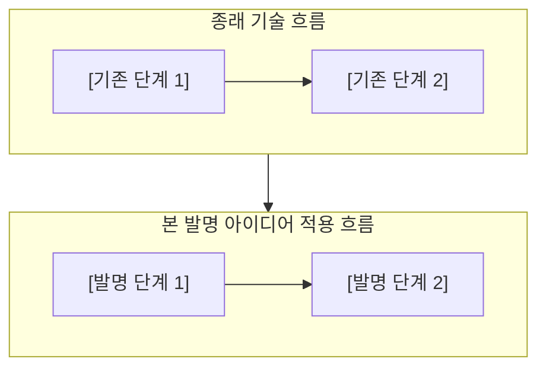
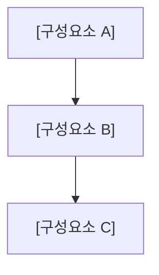
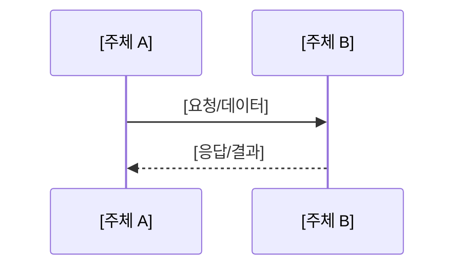
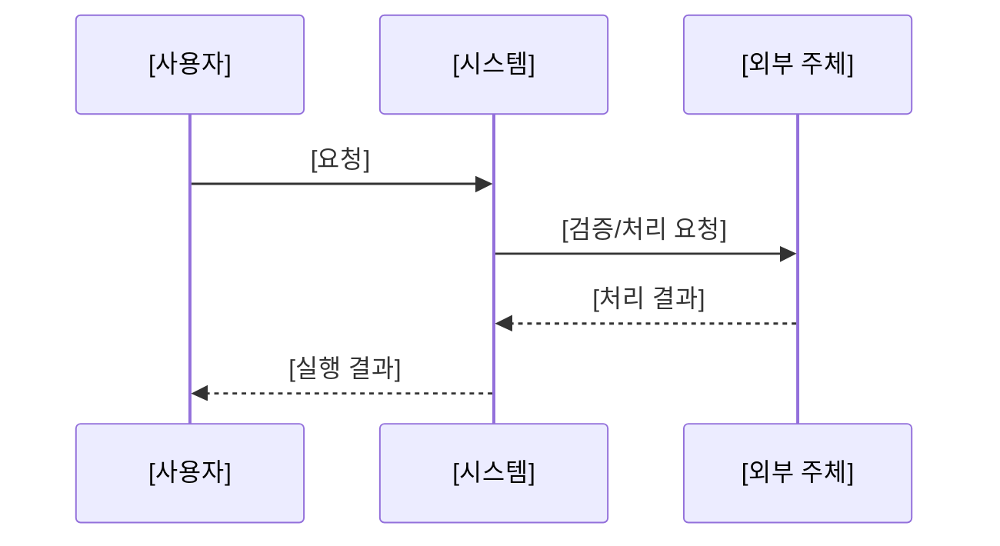
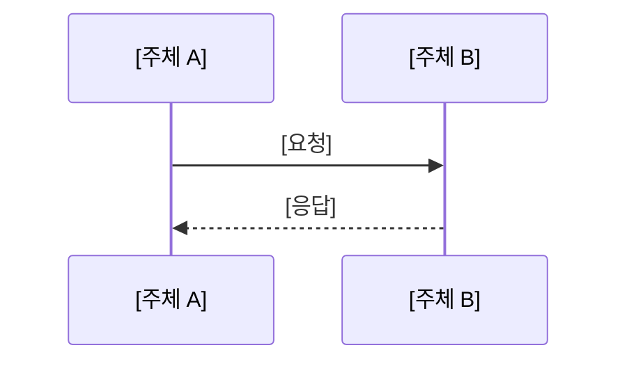

<!-- page-break:page-1 -->

대외비

<table>
  <tr>
    <td colspan="10" style="text-align:center; font-weight:bold;">직무발명(고안) 명세서<br>(Invention Disclosure)</td>
  </tr>
  <tr><td colspan="10">● 발명의 명칭 (Title of Invention)</td></tr>
  <tr><td colspan="2">한글</td><td colspan="8">[한글 발명 명칭]</td></tr>
  <tr><td colspan="2">영어</td><td colspan="8">[영문 발명 명칭]</td></tr>
  <tr><td colspan="10">● 관련 선행기술 및 선출원</td></tr>
  <tr><td rowspan="6">기술출처</td><td colspan="2" rowspan="2">유사특허/논문 등</td><td>명칭</td><td colspan="6">[명칭]</td></tr>
  <tr><td>특허/출원번호</td><td colspan="6">[특허/출원번호]</td></tr>
  <tr><td colspan="2" rowspan="2">배경논문/제품 등</td><td>명칭</td><td colspan="6">[명칭]</td></tr>
  <tr><td>발행처/제품명</td><td colspan="6">[발행처/제품명]</td></tr>
  <tr><td colspan="2" rowspan="2">본 발명자 선출원</td><td>명칭</td><td colspan="6">[해당 시 기재]</td></tr>
  <tr><td>특허/출원번호</td><td colspan="6">[해당 시 기재]</td></tr>
  <tr><td colspan="10">● 발명자 연락처</td></tr>
  <tr><td colspan="2">성명</td><td colspan="2">소속</td><td colspan="3">연락처</td><td colspan="3">E-mail</td></tr>
  <tr><td colspan="2">[성명]</td><td colspan="2">[소속]</td><td colspan="3">[연락처]</td><td colspan="3">[이메일]</td></tr>
</table>

#### 【사전 체크 사항】

1. [발명의 대상 및 핵심 구조]
2. [종래기술과 구별되는 핵심 구성]
3. [적용 범위 및 전제 조건]
4. [권리·계약·실행 조건이 확정되는 시점]
5. [출원 전 확정하거나 치환할 정보]

#### 【핵심 흐름 비교】

[발명의 유용성과 기존 구조 대비 변화 요약]

| 구분 | 기존 흐름 | 본 발명 적용 흐름 |
|---|---|---|
| [단계 1] | [기존 흐름] | [본 발명 흐름] |
| [단계 2] | [기존 흐름] | [본 발명 흐름] |
| [단계 3] | [기존 흐름] | [본 발명 흐름] |

[핵심 차별점 요약]



[다이어그램 설명]

<!-- page-break:page-2 -->

대외비

#### 1. 발명의 배경

#### 가. 본 발명의 기술분야

[발명이 속하는 기술분야]

[발명의 구체적인 적용 기술 및 범위]

[핵심 용어의 개략적 정의]

#### 나. 종래기술의 설명

[종래기술의 유형과 동작 방식]

1. **[종래기술 유형 1]**: [설명]
2. **[종래기술 유형 2]**: [설명]
3. **[종래기술 유형 3]**: [설명]

[종래기술의 한계 요약]

| 구분 | 선행기술 | 주요 내용 | 본 발명과의 관련성 및 차별성 |
|---|---|---|---|
| 1 | [문헌/제품명] | [주요 내용] | [관련성 및 차별성] |
| 2 | [문헌/제품명] | [주요 내용] | [관련성 및 차별성] |

#### 선행기술 대비 회피 및 차별화 방향

1. [차별화 특징 1]
2. [차별화 특징 2]
3. [차별화 특징 3]

<!-- page-break:page-3 -->

대외비

#### 다. 종래기술 문제점 및 본 발명의 목적

##### 1) 종래기술의 문제점

[문제점 1]

[문제점 2]

[문제점 3]

##### 2) 본 발명의 목적

[주된 목적]

[다른 목적]

[또 다른 목적]

##### 3) 본 발명의 해결수단 요약

[핵심 구성요소와 작동 관계를 중심으로 해결수단 요약]

[정보 처리, 요청, 검증, 실행 등의 흐름]

[예외 또는 폴백 처리]

<!-- page-break:page-4 -->

대외비

#### 2. 발명(고안)의 구체적 설명

#### 가. 발명의 구성

##### 1) 전체 시스템 구조

[전체 시스템 구성 설명]



[도면의 구성요소 및 연결 관계 설명]

##### 2) 주요 모듈 정의

1. **[모듈 1]**: [기능]
2. **[모듈 2]**: [기능]
3. **[모듈 3]**: [기능]

##### 3) 용어 정의

1. **[용어 1]**: [정의]
2. **[용어 2]**: [정의]
3. **[용어 3]**: [정의]

##### 4) [데이터 구조 1] JSON

[데이터 구조의 목적과 생성 시점]

```json
{
  "field1": "[값 또는 설명]",
  "field2": "[값 또는 설명]"
}
```

###### [데이터 구조 1] 필드 설명

| 필드 | 필수 여부 | 설명 |
|---|---|---|
| `field1` | 필수 | [설명] |
| `field2` | 선택 | [설명] |

##### 5) [데이터 구조 2] JSON

[데이터 구조의 목적과 생성 시점]

```json
{
  "field1": "[값 또는 설명]",
  "field2": "[값 또는 설명]"
}
```

###### [데이터 구조 2] 필드 설명

| 필드 | 필수 여부 | 설명 |
|---|---|---|
| `field1` | 필수 | [설명] |
| `field2` | 선택 | [설명] |

##### 6) [실행/세션 패키지]

[패키지의 구성, 생성 방식, 유효 범위 및 보안 조건]

#### 나. 발명의 동작 설명

##### 1) [사전 등록/준비 흐름]



[흐름 설명]

##### 2) [후보 생성/처리 흐름]

[단계별 동작 설명]

##### 3) [요청·계약·세션 생성 흐름]



[흐름 설명]

##### 4) [부가 처리 및 정산 흐름]


[흐름 설명]

##### 5) 폴백 흐름

1. [실패 조건 1과 대응]
2. [실패 조건 2와 대응]
3. [실패 조건 3과 대응]

##### 6) 개발 세부 사항

| 구분 | 내용 |
|---|---|
| [항목 1] | [구현 세부 내용] |
| [항목 2] | [구현 세부 내용] |

#### 다. 발명의 효과

1. [효과 1]
2. [효과 2]
3. [효과 3]

<!-- page-break:page-5 -->

대외비

## 3. 권리청구의 범위

### 청구항 1

[독립 방법항: 구성 단계와 단계 간 관계를 기재]

### 청구항 2

청구항 1에 있어서, [종속 구성].

### 청구항 3

청구항 1에 있어서, [종속 구성].

### 청구항 4

청구항 1에 있어서, [종속 구성].

<!-- 필요한 종속항을 같은 형식으로 추가 -->

### 청구항 [시스템 독립항 번호]

[독립 시스템항: 구성요소와 구성요소 간 관계를 기재]

### 청구항 [기록매체항 번호]

컴퓨터 판독 가능한 기록매체에 저장된 프로그램으로서, 프로세서에 의해 실행될 때 청구항 [방법항 범위]의 방법을 수행하도록 하는 프로그램.

### 추가 종속항 후보

1. [추가 종속항 후보 1]
2. [추가 종속항 후보 2]
3. [추가 종속항 후보 3]

<!-- page-break:page-6 -->

대외비

## 4. 도 면

## 가. 종래기술의 도면

### 도 1. [종래기술 도면 제목]


도 1은 [도면 설명]을 나타낸다.

### 도 2. [종래기술 도면 제목]


도 2는 [도면 설명]을 나타낸다.

## 나. 본 발명의 도면

### 도 3. 본 발명의 전체 시스템 구조


도 3은 [전체 시스템 구조 설명]을 나타낸다.

### 도 4. [세부 흐름 제목]



도 4는 [도면 설명]을 나타낸다.

<!-- 필요한 도면을 같은 형식으로 추가 -->

<!-- page-break:page-7 -->

대외비

## 5. 부록: 요약서 및 출원 전략

### 5.1 요약서

[발명의 핵심 구성, 동작 및 효과를 간결하게 요약]

### 5.2 출원 전략

[독립항의 핵심 결합 구성 및 권리화 방향]

1. [종속항 강화 방향 1]
2. [종속항 강화 방향 2]
3. [종속항 강화 방향 3]

### 5.3 [핵심 기술요소] 보강 방향

[핵심 기술요소의 독립항·종속항·분할출원 배치 전략]

### 5.4 등록 가능성을 높이는 차별점

1. [차별점 1]
2. [차별점 2]
3. [차별점 3]

### 5.5 분할출원 또는 추가 variation 후보

| 후보 | 핵심 구성 | 권리화 포인트 |
|---|---|---|
| Variation A | [핵심 구성] | [권리화 포인트] |
| Variation B | [핵심 구성] | [권리화 포인트] |

## 6. 제출 전 확인 사항

| 구분 | 확인 내용 | 상태 |
|---|---|---|
| 발명의 명칭 | 한글/영문 발명의 명칭 기재 | [상태] |
| 선행기술 | 유사 특허, 제품, 종래 방식 및 차별성 기재 | [상태] |
| 기술분야 | 발명이 속하는 기술분야 기재 | [상태] |
| 문제점/목적 | 종래기술의 문제점과 발명의 목적 기재 | [상태] |
| 구성 | 핵심 구성요소와 상호 관계 기재 | [상태] |
| 데이터 구조 | 필수 필드 및 필드별 설명 기재 | [상태] |
| 도면 | 종래기술 및 본 발명의 도면 기재 | [상태] |
| 청구항 | 방법, 시스템, 기록매체 청구항 및 종속항 후보 기재 | [상태] |
| 발명자 정보 | 성명, 소속, 연락처, 이메일 | [상태] |
| 실제 구현값 | 제품명, 사업자명, 정책 및 보안 수준 | [상태] |
