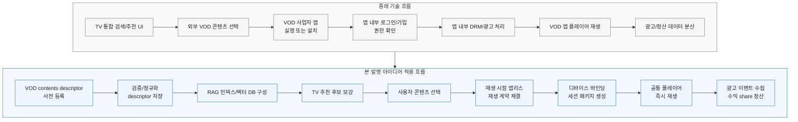
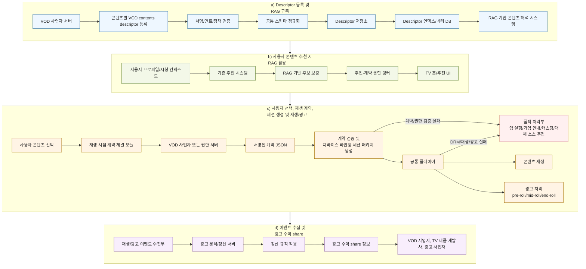
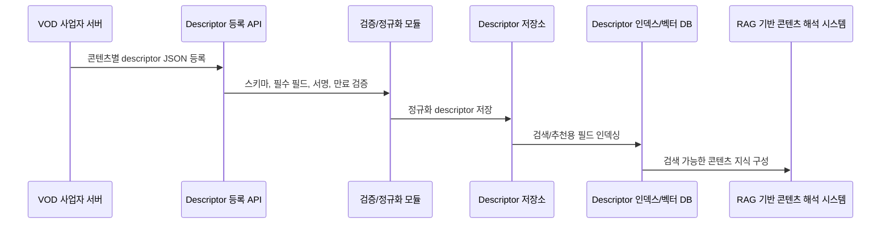
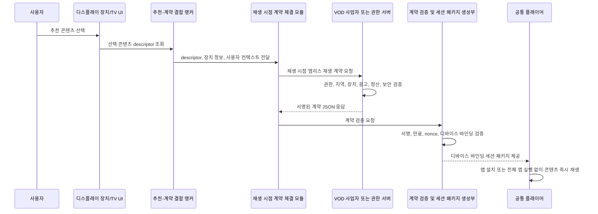
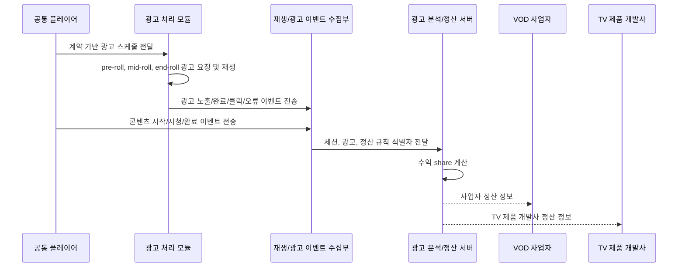
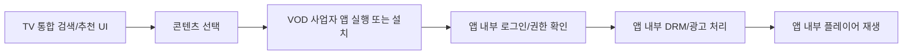
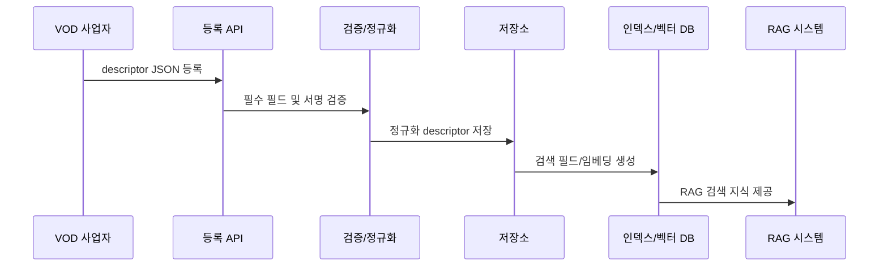
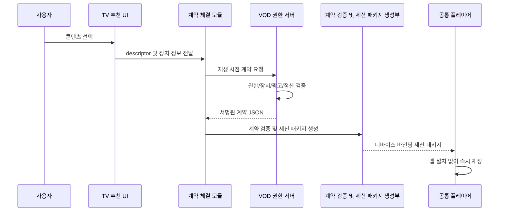
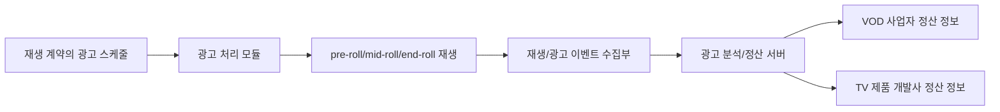

<!-- page-break:page-1 -->

대외비

<table>
  <tr>
    <td colspan="10" style="text-align:center; font-weight:bold;">직무발명(고안) 명세서<br>(Invention Disclosure)</td>
  </tr>
  <tr>
    <td colspan="10">● 발명의 명칭 (Title of Invention)</td>
  </tr>
  <tr>
    <td colspan="2">한글</td>
    <td colspan="8">VOD 콘텐츠 즉시 재생 방법 및 시스템</td>
  </tr>
  <tr>
    <td colspan="2">영어</td>
    <td colspan="8">Method and System for Instant Playback of VOD Content</td>
  </tr>
  <tr>
    <td colspan="10">● 관련 선행기술 및 선출원</td>
  </tr>
  <tr>
    <td rowspan="6">기술출처</td>
    <td colspan="2" rowspan="2">유사특허/논문 등</td>
    <td>명칭</td>
    <td colspan="6">EP2934056A1, US9866938B2, US20030196204A1/US7774343B2, US20230179872A1, US20220201219A1 등 외부 콘텐츠 검색, 통합 재생, 콘텐츠 추천, 광고 삽입, DRM 및 디바이스 인증 관련 문헌</td>
  </tr>
  <tr>
    <td>특허/출원번호</td>
    <td colspan="6">상세 비교는 본 명세서 1.나 및 부록의 선행기술 조사 표 참조</td>
  </tr>
  <tr>
    <td colspan="2" rowspan="2">배경논문/제품 등</td>
    <td>명칭</td>
    <td colspan="6">스마트 TV 통합 검색/추천, OTT 앱 기반 재생, SSAI/CSAI 광고 삽입, DRM 라이선스 발급, TV 제품 개발사 추천 플랫폼</td>
  </tr>
  <tr>
    <td>발행처/제품명</td>
    <td colspan="6">각 OTT 서비스 앱, 스마트 TV 통합 콘텐츠 허브, 광고 서버 및 정산 시스템</td>
  </tr>
  <tr>
    <td colspan="2" rowspan="2">본 발명자 선출원</td>
    <td>명칭</td>
    <td colspan="6">해당 시 기재</td>
  </tr>
  <tr>
    <td>특허/출원번호</td>
    <td colspan="6">해당 시 기재</td>
  </tr>
  <tr>
    <td colspan="10">● 발명자 연락처</td>
  </tr>
  <tr>
    <td colspan="2">성명</td>
    <td colspan="2">소속</td>
    <td colspan="3">연락처</td>
    <td colspan="3">E-mail</td>
  </tr>
  <tr>
    <td colspan="2">TBD</td>
    <td colspan="2">TBD</td>
    <td colspan="3">TBD</td>
    <td colspan="3">TBD</td>
  </tr>
</table>

#### 【사전 체크 사항】

1. 본 발명은 VOD 사업자 앱 설치 또는 전체 앱 런타임 실행 없이, TV 제품 개발사 또는 디스플레이 장치 측 플랫폼이 외부 VOD 콘텐츠를 추천하고 재생 시점에 권한 계약을 체결하여 즉시 재생하는 구조에 관한 것이다.
2. 본 발명은 단순한 콘텐츠 URL 전달이나 일반 DRM 라이선스 발급이 아니라, 사전 등록된 콘텐츠별 VOD contents descriptor, RAG 기반 콘텐츠 해석/추천 보강, 재생 시점 실행 계약, 디스플레이 장치 또는 장치 클래스 바인딩 세션 패키지, 광고 재생 및 수익 share 정산을 결합한다.
3. descriptor 기반 추천은 외부 VOD 콘텐츠의 후보 및 후보 재생 정책을 산출하는 단계이며, 외부 VOD 애플리케이션의 설치, 회원가입, 로그인, 구독 또는 결제 상태를 TV 제품 개발사 플랫폼이 확정적으로 판단하는 단계가 아니다.
4. 본 발명은 사용자가 추천 콘텐츠의 재생을 요청한 시점에 VOD 사업자 또는 권한 서버와 서명된 재생 시점 앱리스 재생 계약을 체결하여 실제 재생 가능 여부, 광고 기반 무료 재생 가능 여부, 미리보기 가능 여부, 구매/가입 필요 여부 및 폴백 경로를 확정한다.
5. 본 문서는 직무발명 신고 및 1차 특허명세서 검토를 위한 초안이며, 발명자 정보, 실제 제품명, 사업자명, 키 관리 체계, 정산 비율 등은 출원 전 확정 정보로 치환한다.

#### 【핵심 흐름 비교】

본 발명의 유용성은 외부 VOD 콘텐츠를 “추천은 TV가 하고, 재생은 VOD 앱으로 넘기는 구조”에서 “추천, 권한 계약, 재생, 광고 및 정산을 TV 제품 개발사 플랫폼 안에서 연결하는 구조”로 전환하는 데 있다.

| 구분 | 기존 흐름 | 본 발명 적용 흐름 |
|---|---|---|
| 콘텐츠 준비 | VOD 사업자가 콘텐츠 메타데이터 또는 딥링크를 제공 | VOD 사업자가 콘텐츠별 VOD contents descriptor를 사전 등록하고, TV 제품 개발사가 이를 검증·정규화 |
| 추천/검색 | TV 추천 UI가 콘텐츠를 노출하더라도 외부 앱의 가입·로그인·구독 상태를 알 수 없어 실제 재생 가능성은 분리됨 | descriptor 인덱스/벡터 DB와 RAG 기반 콘텐츠 해석 시스템이 추천 후보를 보강하고, 후보 재생 정책·계약 가능성·광고 조건·정산 가능성을 랭킹에 반영 |
| 사용자 선택 후 | VOD 사업자 앱 실행, 앱 설치, 로그인, 앱 내부 플레이어 전환이 발생 | 선택 시점에 VOD 사업자 또는 권한 서버와 재생 계약을 체결하고, 공통 플레이어용 세션 패키지를 생성 |
| 재생 권한 | 앱 내부 권한 확인 또는 단순 재생 URL/DRM 토큰 전달 | 디스플레이 장치 또는 장치 클래스에 바인딩된 단기 권한 토큰, DRM 요청 정보, 광고 스케줄, 정산 규칙을 포함하는 서명된 실행 계약 사용 |
| 광고/정산 | 광고와 수익 정산이 VOD 앱 또는 외부 광고 시스템에 분산됨 | pre-roll, mid-roll, end-roll 광고 재생 이벤트와 수익 share 정보를 재생 계약 및 정산 규칙에 따라 연결 |
| 사용자 경험 | 앱 전환, 재로그인, 설치 유도, 재생 지연으로 추천 경험이 끊김 | TV 홈/추천 화면에서 선택한 외부 VOD 콘텐츠를 앱 설치 또는 전체 앱 실행 없이 즉시 재생 |

요약하면, 본 발명은 외부 VOD 콘텐츠를 TV 플랫폼의 추천 화면에 “보여주는” 수준을 넘어, 추천 후보 생성부터 재생 시점 계약, 디바이스 바인딩 재생, 광고 이벤트 수집 및 수익 share까지 하나의 실행 가능한 흐름으로 묶는다. 이 점이 단순 통합 검색, 딥링크, DRM 전달 또는 광고 삽입 기술과 구별되는 핵심 효과이다.



상기 다이어그램에서 종래 기술은 추천 UI 이후 VOD 앱으로 제어권이 넘어가고 로그인, DRM, 광고 및 정산이 앱 내부 또는 외부 시스템에 분산된다. 반면 본 발명은 descriptor 사전 등록, RAG 기반 추천 보강, 재생 시점 계약, 디바이스 바인딩 세션 패키지, 공통 플레이어 재생 및 광고 수익 share를 TV 제품 개발사 플랫폼에서 하나의 실행 흐름으로 연결한다.

<!-- page-break:page-2 -->

대외비

#### 1. 발명의 배경

#### 가. 본 발명의 기술분야

본 발명은 디스플레이 장치, 스마트 TV, 셋톱박스, 스트리밍 단말, 차량용 디스플레이 또는 이와 연동되는 TV 제품 개발사 서버가 외부 VOD 사업자의 콘텐츠를 앱 설치 없이 즉시 재생하도록 하는 콘텐츠 재생 플랫폼 기술에 관한 것이다.

보다 구체적으로, 본 발명은 VOD 사업자가 콘텐츠별 VOD contents descriptor를 사전에 등록하고, TV 제품 개발사 플랫폼 또는 서버가 상기 descriptor를 기반으로 RAG(Retrieval-Augmented Generation) 기반 콘텐츠 해석 시스템, 추천 시스템 및 광고/정산 시스템을 구성하며, 사용자가 추천된 VOD 콘텐츠를 선택한 재생 시점에 VOD 사업자 또는 권한 서버와 재생 시점 앱리스 재생 계약을 체결하여 디바이스 바인딩 세션 패키지를 생성하는 방법 및 시스템에 관한 것이다.

본 발명에서 VOD contents descriptor는 콘텐츠의 메타데이터, 재생 템플릿, 지원 DRM, 디바이스 정책, 광고 정책, 수익 share 정책 및 서명 정보를 포함하는 사전 등록용 기술 서술자이다. 재생 시점 앱리스 재생 계약은 특정 재생 요청에 대해 VOD 사업자 또는 권한 서버가 발급하는 실행 계약으로서, 디바이스 바인딩, 단기 권한 토큰, 서명된 매니페스트 URL, DRM 라이선스 요청 정보, 광고 스케줄, 수익 share 정책 식별자 및 전자서명을 포함한다.

#### 나. 종래기술의 설명

종래 스마트 TV 또는 디스플레이 장치의 외부 VOD 재생 방식은 대체로 다음 유형으로 구분된다.

1. **앱 실행형 재생**: 사용자가 콘텐츠를 선택하면 해당 VOD 사업자의 전용 앱을 설치하거나 실행하고, 콘텐츠 탐색, 로그인, 광고, DRM, 재생 UI 및 분석을 앱 내부에서 처리한다.
2. **통합 검색/딥링크형 재생**: TV 제품 개발사 또는 플랫폼이 복수 VOD 사업자의 콘텐츠 메타데이터를 검색 대상으로 통합하고, 선택된 콘텐츠에 대해 VOD 앱 딥링크 또는 웹뷰를 호출한다.
3. **URL/DRM 전달형 재생**: 재생 URL과 DRM 라이선스 URL 또는 인증 토큰을 전달하여 플레이어가 콘텐츠를 재생하게 한다.
4. **광고 삽입형 재생**: SSAI 또는 CSAI 방식으로 pre-roll, mid-roll, end-roll 광고를 삽입하고, 광고 노출/클릭/완료 이벤트를 광고 서버 또는 분석 서버에 전송한다.
5. **추천형 재생**: TV 제품 개발사 또는 플랫폼이 콘텐츠 메타데이터를 기반으로 추천 후보를 생성하되, 실제 재생 권한 및 광고/정산은 각 VOD 앱 또는 서비스 서버가 별도로 처리한다.

그러나 이러한 종래기술은 VOD 사업자 앱의 설치 또는 전체 실행에 의존하거나, 콘텐츠 URL 및 DRM 정보 전달에 머무르며, TV 제품 개발사가 사전 등록 descriptor를 기반으로 RAG 인덱스를 구성하고, 추천-계약-재생-광고-정산을 하나의 앱리스 즉시 재생 구조로 연결하는 기술적 구성을 명확히 제공하지 못한다.

다음 표는 본 발명과 관련성이 높은 선행기술 및 차별성을 정리한 것이다.

| 구분 | 선행기술 | 주요 내용 | 본 발명과의 관련성 및 차별성 |
|---|---|---|---|
| 1 | EP2934056A1 / US9866938B2 계열 | 제3자 콘텐츠를 통합 탐색하고, 콘텐츠 아이템에 대한 재생 가능성 또는 이용 가능성을 판단하는 기술 | 콘텐츠 검색/탐색과 관련되나, 사전 등록 descriptor를 RAG 인덱스로 구성하고 재생 시점에 앱리스 실행 계약을 체결하여 디바이스 바인딩 세션 패키지를 생성하는 구조가 부족함 |
| 2 | US20030196204A1 / US7774343B2 계열 | 디지털 콘텐츠 액세스 권한, DRM, 라이선스 및 사용자/장치 인증 관련 기술 | DRM 및 권한 부여와 관련되나, 콘텐츠별 descriptor와 재생 시점 계약을 분리하고 광고 스케줄 및 수익 share 정책까지 실행 계약에 포함하는 구조와 다름 |
| 3 | US20230179872A1 계열 | 콘텐츠 추천, 검색 결과 보강, 사용자 선호 기반 후보 생성 기술 | 추천 시스템과 관련되나, 추천 후보가 재생 시점 계약 체결 모듈 및 공통 플레이어와 직접 결합되는 구조가 아님 |
| 4 | US20220201219A1 계열 | 광고 삽입, 콘텐츠 재생 이벤트, 광고 분석 또는 수익화 기술 | 광고 이벤트 및 정산과 관련되나, VOD contents descriptor의 광고 정책과 재생 시점 계약의 광고 스케줄/수익 share 정책이 TV 제품 개발사 플랫폼에서 연결되는 구성이 부족함 |
| 5 | 일반 OTT 앱/스마트 TV 통합 허브 | 앱 기반 콘텐츠 재생, 통합 검색, 딥링크, 앱 전환, TV 제품 개발사 추천 | 사용자는 앱 실행 또는 서비스 이동을 경험하며, TV 제품 개발사 공통 플레이어에서 외부 VOD를 즉시 재생하기 위한 계약 JSON, 세션 패키지 및 디바이스 바인딩 실행 구조가 아님 |

#### 선행기술 대비 회피 및 차별화 방향

본 발명은 선행기술과의 중복을 회피하기 위해 다음 기술적 특징을 핵심 구성으로 한다.

1. VOD 사업자가 재생 URL 자체가 아니라 콘텐츠별 VOD contents descriptor를 사전 등록한다.
2. TV 제품 개발사 플랫폼 또는 서버가 descriptor를 정규화하고 RAG 기반 콘텐츠 해석 시스템이 검색 가능한 descriptor 인덱스 또는 벡터 DB를 구성한다.
3. 사용자가 추천 콘텐츠를 선택하면, VOD 사업자 또는 권한 서버가 별도의 재생 시점 앱리스 재생 계약 JSON을 발급한다.
4. 재생 계약은 장치 식별자 또는 장치 클래스에 바인딩되고, 단기 권한 토큰, DRM 라이선스 요청 정보, 광고 스케줄, 수익 share 정책 식별자 및 전자서명을 포함한다.
5. 공통 플레이어는 VOD 사업자 전용 애플리케이션의 설치 또는 전체 실행 없이 재생 세션을 생성한다.
6. 광고 재생 및 광고 수익 share는 descriptor의 정책과 재생 시점 계약의 정산 규칙에 따라 연결되고, 재생/광고 이벤트 수집부와 광고 분석/정산 서버가 이를 처리한다.

<!-- page-break:page-3 -->

대외비

#### 다. 종래기술 문제점 및 본 발명의 목적

##### 1) 종래기술의 문제점

기존 앱 실행형 VOD 재생 방식은 사용자가 콘텐츠 선택 후 해당 사업자 앱으로 이동해야 하므로 재생 지연, 앱 설치 부담, 로그인 반복, UI 단절, 추천 경험의 이탈이 발생한다. TV 제품 개발사 입장에서는 외부 VOD 콘텐츠를 자사 추천 경험 안에 노출할 수 있더라도, 실제 재생·광고·정산은 VOD 앱 내부에서 닫힌 형태로 처리되므로 플랫폼 차원의 분석 및 수익화 연결이 어렵다.

descriptor를 기반으로 외부 VOD 콘텐츠를 추천하더라도, 추천된 콘텐츠가 미설치 앱의 콘텐츠이거나, 앱은 설치되어 있으나 회원가입, 로그인, 구독 또는 결제가 완료되지 않은 서비스의 콘텐츠인 경우 사용자는 즉시 재생할 수 없다. 또한 TV 제품 개발사 플랫폼은 외부 VOD 애플리케이션 내부의 회원가입 상태, 로그인 세션, 구독 상태, 결제 상태 또는 앱 내부 재생 가능 상태를 안정적으로 알 수 없으므로, 추천 단계에서 실제 재생 가능 여부를 확정하기 어렵다.

기존 통합 검색/딥링크 방식은 여러 사업자의 콘텐츠를 한 화면에 노출할 수 있으나, 선택 이후에는 여전히 앱 이동 또는 웹뷰 실행에 의존한다. 이 방식은 콘텐츠 메타데이터를 검색 대상으로 사용하는 데 그치며, 디바이스 보안 수준, 광고 정책, 수익 share 정책, DRM 요청 방식, 재생 기능 구성 등을 실행 가능한 계약으로 검증하고 세션화하지 못한다.

기존 DRM/URL 전달 방식은 재생 URL, 라이선스 서버 URL 또는 토큰을 플레이어에 제공하는 방식이므로 단일 재생 요청을 처리할 수는 있으나, VOD 사업자가 허용하는 앱리스 재생 조건, 광고 정책, UI/분석 기능, 정산 규칙, 디바이스 클래스별 허용 범위 및 서명 검증을 하나의 실행 계약으로 표현하지 못한다.

기존 광고 삽입 및 정산 기술은 콘텐츠 재생 중 광고를 삽입하고 이벤트를 수집하는 데 초점을 두지만, TV 제품 개발사 추천 시스템에서 시작된 외부 VOD 즉시 재생 요청이 광고 수익 share 정책과 결합되는 전체 흐름을 제공하지 않는다.

##### 2) 본 발명의 목적

본 발명의 목적은 외부 VOD 사업자의 콘텐츠를 TV 제품 개발사 또는 디스플레이 장치 플랫폼의 추천 경험 안에서 앱 설치 없이 즉시 재생하도록 하는 것이다.

본 발명의 다른 목적은 VOD 사업자가 콘텐츠별 VOD contents descriptor를 사전에 등록하고, TV 제품 개발사가 이를 RAG 기반 콘텐츠 해석 시스템과 기존 추천 시스템에 연결하여 추천 후보를 보강하도록 하는 것이다.

본 발명의 또 다른 목적은 descriptor 기반 추천 단계에서 외부 VOD 앱의 설치, 회원가입, 로그인, 구독 또는 결제 상태를 확정 판단하지 않고, 사용자의 재생 요청 시점에 VOD 사업자 또는 권한 서버와 재생 시점 앱리스 재생 계약을 체결하여 실제 재생 가능 여부와 실행 조건을 확정하는 것이다.

본 발명의 또 다른 목적은 사용자가 추천된 콘텐츠를 선택하는 재생 시점에만 VOD 사업자 또는 권한 서버와 실행 계약을 체결하여, 불필요한 사전 권한 발급을 줄이고, 최신 권한 상태, 지역, 디바이스 보안 수준, 광고 조건 및 정산 조건을 반영하는 것이다.

본 발명의 또 다른 목적은 재생 시점 계약에 기초하여 디스플레이 장치 또는 장치 클래스에 바인딩된 단기 권한 토큰, DRM 라이선스 요청 정보, 광고 스케줄 및 재생 기능 구성 정보를 포함하는 세션 패키지를 생성하는 것이다.

본 발명의 또 다른 목적은 공통 플레이어가 VOD 사업자 전용 애플리케이션의 설치 또는 전체 실행 없이 재생 세션을 구성하고, 광고 재생 이벤트 및 콘텐츠 재생 이벤트를 수집하여 광고 분석 및 수익 share 정산으로 연결하는 것이다.

##### 3) 본 발명의 해결수단 요약

본 발명의 일 실시예에 따르면, VOD 사업자 서버는 콘텐츠별 VOD contents descriptor를 TV 제품 개발사 서버 또는 디스플레이 장치 플랫폼에 사전 등록한다. 상기 descriptor는 콘텐츠 식별자, 사업자 식별자, 스키마 버전, 제목, 재생 템플릿 식별자, 프로토콜, 지원 DRM 유형, 라이선스 요청 템플릿 식별자, 디바이스 클래스, 지역, 광고 브레이크 유형, 광고 태그 템플릿 식별자, 정산 규칙 식별자 및 전자서명 정보를 포함한다.

TV 제품 개발사 서버는 등록된 descriptor를 정규화 스키마로 변환하고, descriptor 인덱스 또는 벡터 DB를 구성하며, RAG 기반 콘텐츠 해석 시스템이 기존 추천 시스템의 후보 생성 또는 후보 설명에 활용할 수 있도록 한다. 추천 시스템은 사용자 컨텍스트, 시청 이력, 콘텐츠 선호도 및 descriptor 인덱스 검색 결과를 이용하여 외부 VOD 콘텐츠 추천 후보를 생성한다. 이때 descriptor 기반 추천은 외부 VOD 콘텐츠의 후보 재생 정책, 장치 호환성, 광고 조건 및 폴백 가능성을 예측 또는 보강하는 것이며, 외부 VOD 애플리케이션의 실제 회원가입, 로그인, 구독 또는 결제 상태를 확정하지 않는다.

사용자가 추천 콘텐츠를 선택하고 재생을 요청하면, 디스플레이 장치 또는 TV 제품 개발사 서버는 선택된 콘텐츠의 descriptor 및 장치 정보를 이용하여 VOD 사업자 또는 권한 서버에 재생 시점 앱리스 재생 계약을 요청한다. VOD 사업자 또는 권한 서버는 권한 상태, 디바이스 정책, 지역, 광고 정책, 정산 정책 및 보안 조건을 검증한 뒤, 앱리스 재생 허용, 광고 기반 무료 재생, 미리보기, 구매/가입 필요 또는 거절 사유 중 적어도 하나를 포함하는 재생 시점 앱리스 재생 계약 JSON 또는 폴백 정책을 생성하여 서명한다.

디스플레이 장치 또는 TV 제품 개발사 서버는 서명된 재생 계약을 검증하고, 검증된 계약에 기초하여 디스플레이 장치 또는 장치 클래스에 바인딩된 세션 패키지를 생성한다. 공통 플레이어는 세션 패키지에 포함된 서명된 매니페스트 URL, DRM 라이선스 요청 정보 및 광고 스케줄에 따라 콘텐츠 및 광고를 재생하고, 재생/광고 이벤트 수집부는 광고 분석/정산 서버에 이벤트를 제공한다.

<!-- page-break:page-4 -->

대외비

#### 2. 발명(고안)의 구체적 설명

#### 가. 발명의 구성

##### 1) 전체 시스템 구조

본 발명의 시스템은 VOD 사업자 서버, VOD contents descriptor 등록/검증부, descriptor 저장소, descriptor 인덱스/벡터 DB, RAG 기반 콘텐츠 해석 시스템, 기존 추천 시스템, 추천-계약 결합 랭커, 재생 시점 계약 체결 모듈, 계약 검증 및 세션 패키지 생성부, 공통 플레이어, 광고 처리 모듈, 재생/광고 이벤트 수집부, 광고 분석/정산 서버 및 폴백 처리부를 포함한다.



상기 전체 시스템 구조는 descriptor 등록 및 RAG 구축, RAG 활용 추천, 재생 시점 계약 체결 및 공통 플레이어 재생, 이벤트 수집 및 광고 수익 share의 네 개 시점 패키지로 구분된다. 각 패키지는 내부적으로 좌에서 우로 진행되고, 전체 패키지는 a 단계에서 d 단계로 순차 진행된다.

##### 2) 주요 모듈 정의

| 모듈 | 정의 및 기능 |
|---|---|
| VOD 사업자 서버 | 외부 VOD 콘텐츠의 원천 사업자 서버로서 콘텐츠별 descriptor를 등록하고, 재생 시점 계약 요청에 응답한다. |
| VOD contents descriptor 등록 API | VOD 사업자가 콘텐츠별 descriptor JSON을 사전 등록하는 인터페이스이다. |
| Descriptor 검증/정규화 모듈 | descriptor의 스키마, 필수 필드, 서명, 만료 시간, 지원 프로토콜, DRM 유형, 디바이스 정책, 광고 정책 및 정산 정책을 검증하고 내부 정규화 스키마로 변환한다. |
| Descriptor 저장소 | 검증된 descriptor와 버전 정보를 저장하며 콘텐츠 식별자, 사업자 식별자, 지역, 장치 클래스 및 정산 규칙 식별자에 따라 조회할 수 있도록 한다. |
| Descriptor 인덱스/벡터 DB | descriptor의 제목, 장르, 줄거리, 출연진, 권리 조건, 광고 조건 등 검색 가능한 요소를 인덱싱하거나 임베딩하여 RAG 기반 콘텐츠 해석 시스템이 검색할 수 있도록 한다. |
| RAG 기반 콘텐츠 해석 시스템 | 사용자 질의, 시청 맥락, 추천 후보 설명 또는 콘텐츠 비교를 위해 descriptor 인덱스에서 관련 정보를 검색하고, 기존 추천 시스템의 후보 생성 또는 후보 설명을 보강한다. |
| 기존 추천 시스템 | 사용자 프로필, 시청 이력, 선호도, 시간대, 장치 컨텍스트 및 RAG 보강 정보를 이용하여 콘텐츠 추천 후보를 생성한다. |
| 추천-계약 결합 랭커 | 추천 점수와 함께 후보 재생 정책, 권한 계약 가능성, 광고 수익성, 장치 적합성, 지역 적합성 및 사업자 정책을 고려하여 최종 추천 순위를 산출한다. 이 랭킹은 외부 앱의 회원가입, 로그인, 구독 또는 결제 상태에 대한 확정 판단을 의미하지 않는다. |
| 재생 시점 계약 체결 모듈 | 사용자가 콘텐츠를 선택한 시점에 descriptor, 장치 정보, 사용자 컨텍스트 및 광고/정산 조건을 이용하여 VOD 사업자 또는 권한 서버에 실행 계약을 요청한다. |
| VOD 사업자 또는 권한 서버 | 재생 권한, 지역, 디바이스 클래스, 보안 수준, 광고 정책 및 정산 규칙을 검증하고 서명된 재생 시점 앱리스 재생 계약 JSON을 발급하거나, 가입/로그인/구매 필요, 앱 실행 필요, 미리보기만 허용 또는 대체 소스 추천과 같은 폴백 정책을 반환한다. |
| 계약 검증 및 세션 패키지 생성부 | 재생 계약의 전자서명, 만료, nonce, 디바이스 바인딩, DRM 요청 조건 및 광고 스케줄을 검증한 후 공통 플레이어가 사용할 세션 패키지를 생성한다. |
| 공통 플레이어 | VOD 사업자 전용 앱의 설치 또는 전체 실행 없이, 세션 패키지에 따라 외부 VOD 콘텐츠와 광고를 재생하는 TV/디스플레이 장치 측 플레이어이다. |
| 광고 처리 모듈 | pre-roll, mid-roll, end-roll 등 계약 기반 광고 스케줄을 처리하고 광고 태그, 광고 로딩, 광고 재생, 스킵 정책 및 광고 오류를 제어한다. |
| 재생/광고 이벤트 수집부 | 콘텐츠 시작/중지/완료, 광고 노출/클릭/완료/오류, DRM 오류, 세션 만료, 장치 변경 등 이벤트를 수집한다. |
| 광고 분석/정산 서버 | 이벤트를 분석하여 VOD 사업자, TV 제품 개발사, 광고 네트워크 또는 기타 참여자 사이의 수익 share 정보를 생성한다. |
| 폴백 처리부 | 계약 검증 실패, 권한 부재, DRM 불일치 또는 광고 정책 충돌 시 앱 실행, 가입 안내, 캐스팅, 대체 소스 추천 중 하나 이상으로 전환한다. |

##### 3) 용어 정의

| 용어 | 의미 |
|---|---|
| VOD contents descriptor | VOD 사업자가 콘텐츠별로 사전 등록하는 기술 서술자이며, 추천, 검색, 계약 요청 및 재생 준비를 위한 필수 정보를 포함한다. |
| 재생 시점 앱리스 재생 계약 | 사용자가 콘텐츠를 선택한 재생 시점에 VOD 사업자 또는 권한 서버가 발급하는 실행 계약이다. 앱 설치 또는 전체 앱 런타임 실행 없이 공통 플레이어가 재생할 수 있도록 계약 조건과 보안 정보를 포함한다. |
| 디바이스 바인딩 | 재생 계약 또는 세션 패키지가 특정 디스플레이 장치, 장치 식별자 해시, 장치 클래스, 지역 또는 보안 수준에만 유효하도록 제한되는 것을 의미한다. |
| 세션 패키지 | 검증된 재생 계약으로부터 생성되는 단기 실행 묶음이며, 매니페스트 URL, DRM 요청 정보, 광고 스케줄, 권한 토큰, 세션 nonce, 재생 기능 구성 및 정산 식별자를 포함한다. |
| 공통 플레이어 | 복수 VOD 사업자의 외부 콘텐츠를 공통 방식으로 재생하는 TV/디스플레이 장치 측 플레이어이다. |
| RAG 기반 콘텐츠 해석 시스템 | descriptor 인덱스 또는 벡터 DB를 검색하여 추천 후보 생성, 후보 설명, 자연어 질의 응답 및 콘텐츠 비교를 보강하는 시스템이다. |
| 수익 share | 광고 노출, 광고 완료, 시청 시간, 콘텐츠 사업자, TV 제품 개발사 또는 광고 네트워크별 정산 규칙에 따라 광고 수익을 배분하는 것을 의미한다. |

##### 4) VOD contents descriptor JSON

VOD contents descriptor는 VOD 사업자가 콘텐츠별로 미리 등록하는 사전 descriptor이며, 즉시 재생 가능성 판단 및 재생 시점 계약 요청에 필요한 필수 정보를 포함한다. 아래 예시는 필수 필드만 포함한다.

```json
{
  "descriptorId": "providerA-vod12345-desc-v3",
  "contentId": "vod-12345",
  "providerId": "provider-A",
  "schemaVersion": "1.0",
  "metadata": {
    "title": "Sample Movie"
  },
  "playback": {
    "manifestTemplateId": "providerA-dash-template",
    "protocol": "MPEG-DASH",
    "supportedDrmTypes": ["Widevine"],
    "licenseRequestTemplateId": "wv-template-01"
  },
  "devicePolicy": {
    "deviceClasses": ["smart-tv-2026"],
    "regions": ["KR"]
  },
  "adPolicy": {
    "supportedBreakTypes": ["pre-roll", "mid-roll", "end-roll"],
    "adTagTemplateId": "providerA-adtag-template"
  },
  "revenueShare": {
    "settlementRuleId": "settlement-rule-01"
  },
  "security": {
    "expiresAt": "2026-12-31T23:59:59Z",
    "descriptorVersion": "3",
    "signatureAlgorithm": "ES256",
    "keyId": "providerA-key-2026",
    "signature": "base64url-signature"
  }
}
```

###### VOD contents descriptor 필드 설명

| 필드 | 필수 여부 | 설명 |
|---|---|---|
| `descriptorId` | Mandatory | VOD 사업자가 발급하는 descriptor의 고유 식별자이다. 동일 콘텐츠라도 정책 또는 버전 변경 시 서로 다른 descriptorId를 가질 수 있다. |
| `contentId` | Mandatory | VOD 사업자 내부 또는 연동 규격에서 콘텐츠를 식별하는 콘텐츠 식별자이다. |
| `providerId` | Mandatory | descriptor를 등록한 VOD 사업자 또는 콘텐츠 제공자를 식별한다. |
| `schemaVersion` | Mandatory | descriptor JSON 스키마 버전을 나타내며, TV 제품 개발사 서버가 파싱 및 호환성 검증에 사용한다. |
| `metadata.title` | Mandatory | 추천 UI, 검색 결과, RAG 인덱싱의 기본 표시값으로 사용되는 콘텐츠 제목이다. |
| `playback.manifestTemplateId` | Mandatory | 재생 시점 계약 요청 시 실제 매니페스트 URL을 생성하기 위한 사업자 측 매니페스트 템플릿 식별자이다. |
| `playback.protocol` | Mandatory | 콘텐츠 재생 프로토콜이다. 예를 들어 MPEG-DASH 또는 HLS가 될 수 있다. |
| `playback.supportedDrmTypes` | Mandatory | 콘텐츠 재생에 사용 가능한 DRM 유형 목록이다. |
| `playback.licenseRequestTemplateId` | Mandatory | 재생 시점 계약에서 DRM 라이선스 요청 파라미터를 생성하기 위한 템플릿 식별자이다. |
| `devicePolicy.deviceClasses` | Mandatory | 해당 콘텐츠의 앱리스 즉시 재생이 허용되는 장치 클래스 목록이다. |
| `devicePolicy.regions` | Mandatory | 해당 descriptor가 유효한 서비스 지역 또는 권리 지역 목록이다. |
| `adPolicy.supportedBreakTypes` | Mandatory | 지원되는 광고 브레이크 유형 목록이다. pre-roll, mid-roll, end-roll 중 하나 이상을 포함할 수 있다. |
| `adPolicy.adTagTemplateId` | Mandatory | 광고 태그 또는 광고 요청 URL을 생성하기 위한 템플릿 식별자이다. |
| `revenueShare.settlementRuleId` | Mandatory | 광고 수익 share 및 정산 정책을 조회하기 위한 규칙 식별자이다. |
| `security.expiresAt` | Mandatory | descriptor의 유효 만료 시각이다. |
| `security.descriptorVersion` | Mandatory | descriptor 자체의 버전 값이다. |
| `security.signatureAlgorithm` | Mandatory | descriptor 전자서명 검증에 사용되는 알고리즘이다. |
| `security.keyId` | Mandatory | 전자서명 검증에 사용할 공개키 또는 키 집합의 식별자이다. |
| `security.signature` | Mandatory | descriptor 전체 또는 정규화된 payload에 대한 VOD 사업자의 전자서명이다. |

##### 5) 재생 시점 앱리스 재생 계약 JSON

재생을 위한 계약은 콘텐츠 선택 시점에 체결된다. 아래 예시는 VOD 사업자 또는 권한 서버가 재생 시점에 응답하는 실행 계약 JSON이며, 필수 필드만 포함한다.

```json
{
  "playbackContractId": "providerA-vod12345-session-789",
  "descriptorId": "providerA-vod12345-desc-v3",
  "contentId": "vod-12345",
  "providerId": "provider-A",
  "deviceBinding": {
    "deviceIdHash": "hashed-tv-device-id",
    "deviceClass": "smart-tv-2026",
    "region": "KR"
  },
  "entitlement": {
    "mode": "ad-sponsored-temporary",
    "shortLivedToken": "signed-short-lived-token",
    "expiresAt": "2026-05-28T10:30:00Z"
  },
  "playback": {
    "signedManifestUrl": "https://vod.example.com/manifest/12345.mpd?token=...",
    "drmType": "Widevine",
    "licenseServerUrl": "https://license.example.com/wv",
    "licenseRequestParameters": {
      "token": "signed-license-token",
      "sessionNonce": "session-nonce"
    }
  },
  "adSchedule": {
    "preRoll": ["ad-break-001"],
    "midRoll": [
      {"time": "00:10:00", "adBreakId": "ad-break-010"},
      {"time": "00:25:00", "adBreakId": "ad-break-025"}
    ],
    "endRoll": ["ad-break-end"]
  },
  "revenueShare": {
    "settlementRuleId": "settlement-rule-01"
  },
  "security": {
    "sessionNonce": "session-nonce",
    "signatureAlgorithm": "ES256",
    "keyId": "providerA-key-2026",
    "signature": "base64url-signature"
  }
}
```

###### 재생 시점 앱리스 재생 계약 필드 설명

| 필드 | 필수 여부 | 설명 |
|---|---|---|
| `playbackContractId` | Mandatory | 특정 재생 요청에 대해 VOD 사업자 또는 권한 서버가 발급하는 실행 계약의 고유 식별자이다. |
| `descriptorId` | Mandatory | 본 재생 계약이 참조하는 사전 등록 VOD contents descriptor의 식별자이다. |
| `contentId` | Mandatory | 재생 대상 VOD 콘텐츠의 식별자이다. |
| `providerId` | Mandatory | 재생 계약을 발급한 VOD 사업자 또는 콘텐츠 제공자 식별자이다. |
| `deviceBinding.deviceIdHash` | Mandatory | 원 장치 식별자를 노출하지 않으면서 계약을 특정 장치에 바인딩하기 위한 해시값이다. |
| `deviceBinding.deviceClass` | Mandatory | 계약이 유효한 장치 클래스이다. |
| `deviceBinding.region` | Mandatory | 계약이 유효한 지역이다. |
| `entitlement.mode` | Mandatory | 재생 권한 모드이다. 예를 들어 광고 기반 임시 권한, 구독 기반 권한, 무료 프로모션 권한 등이 될 수 있다. |
| `entitlement.shortLivedToken` | Mandatory | 공통 플레이어 또는 계약 검증 및 세션 패키지 생성부가 재생 요청 및 DRM 요청에 사용할 단기 권한 토큰이다. |
| `entitlement.expiresAt` | Mandatory | 재생 계약 및 단기 권한 토큰의 만료 시각이다. |
| `playback.signedManifestUrl` | Mandatory | 세션에 한정되어 유효한 서명된 매니페스트 URL이다. |
| `playback.drmType` | Mandatory | 본 세션에서 사용할 DRM 유형이다. |
| `playback.licenseServerUrl` | Mandatory | DRM 라이선스 요청을 전송할 서버 URL이다. |
| `playback.licenseRequestParameters.token` | Mandatory | DRM 라이선스 요청에 포함될 서명된 라이선스 토큰이다. |
| `playback.licenseRequestParameters.sessionNonce` | Mandatory | DRM 라이선스 요청과 재생 계약을 결합하기 위한 세션 nonce이다. |
| `adSchedule.preRoll` | Mandatory | 콘텐츠 시작 전 재생할 광고 브레이크 식별자 목록이다. 해당 광고가 없으면 빈 배열로 제공될 수 있다. |
| `adSchedule.midRoll` | Mandatory | 콘텐츠 중간에 재생할 광고 브레이크의 시간 및 식별자 목록이다. 해당 광고가 없으면 빈 배열로 제공될 수 있다. |
| `adSchedule.endRoll` | Mandatory | 콘텐츠 종료 후 재생할 광고 브레이크 식별자 목록이다. 해당 광고가 없으면 빈 배열로 제공될 수 있다. |
| `revenueShare.settlementRuleId` | Mandatory | 본 재생 세션에서 광고 수익 share 계산에 사용할 정산 규칙 식별자이다. |
| `security.sessionNonce` | Mandatory | 계약 서명, DRM 요청 및 세션 패키지를 상호 결합하는 nonce이다. |
| `security.signatureAlgorithm` | Mandatory | 재생 계약 전자서명 검증에 사용되는 알고리즘이다. |
| `security.keyId` | Mandatory | 재생 계약 전자서명 검증에 사용할 키 식별자이다. |
| `security.signature` | Mandatory | 재생 계약 payload에 대한 VOD 사업자 또는 권한 서버의 전자서명이다. |

##### 6) 세션 패키지

세션 패키지는 디스플레이 장치 또는 TV 제품 개발사 서버가 검증된 재생 계약에 기초하여 생성하는 내부 실행 객체이다. 세션 패키지는 다음 정보를 포함할 수 있다.

1. 콘텐츠 식별자, 사업자 식별자 및 descriptor 식별자
2. 디바이스 식별자 해시, 디바이스 클래스, 지역 및 보안 수준
3. 단기 권한 토큰 및 만료 시각
4. 서명된 매니페스트 URL
5. DRM 유형, 라이선스 서버 URL 및 라이선스 요청 파라미터
6. pre-roll, mid-roll, end-roll 광고 스케줄
7. 재생 UI 또는 기능 구성 정보
8. 광고 이벤트 및 콘텐츠 재생 이벤트 전송 대상
9. 정산 규칙 식별자 및 수익 share 메타데이터
10. 세션 nonce, 계약 서명 검증 결과 및 폐기 조건

세션 패키지는 재생 종료, 만료, 장치 변경, 보안 수준 변경, 계약 철회 또는 DRM 라이선스 실패 시 폐기된다.

#### 나. 발명의 동작 설명

##### 1) Descriptor 사전 등록 흐름



VOD 사업자는 콘텐츠별 descriptor JSON을 사전에 등록한다. 등록 API는 필수 필드 존재 여부, 스키마 버전, 전자서명, 만료 시간, 지원 DRM 유형, 장치 클래스, 지역, 광고 브레이크 유형 및 정산 규칙 식별자를 검증한다. 검증된 descriptor는 저장소에 저장되고, RAG 기반 콘텐츠 해석 시스템이 활용할 수 있도록 descriptor 인덱스 또는 벡터 DB에 반영된다.

##### 2) 추천 후보 보강 및 랭킹 흐름

RAG 기반 콘텐츠 해석 시스템은 사용자 질의, 사용자 맥락 또는 추천 시스템의 후보 생성 요청에 응답하여 descriptor 인덱스에서 관련 콘텐츠를 검색한다. 기존 추천 시스템은 사용자 시청 이력, 선호도, 시간대, 디바이스 상태 및 RAG 검색 결과를 이용하여 추천 후보를 생성한다. 추천-계약 결합 랭커는 후보별 추천 점수 외에도 후보 재생 정책, descriptor 유효성, 장치 클래스 적합성, 지역 적합성, 광고 수익성 및 정산 규칙을 고려하여 최종 추천 순위를 산출한다. 다만 외부 VOD 애플리케이션의 설치, 회원가입, 로그인, 구독 또는 결제 상태는 추천 단계에서 확정하지 않고, 재생 요청 시점의 계약 체결 결과에 의해 확정된다.

##### 3) 재생 시점 계약 체결 및 세션 생성 흐름



사용자가 콘텐츠를 선택하고 재생을 요청하면, 재생 시점 계약 체결 모듈은 사전 등록 descriptor와 장치 정보를 기반으로 VOD 사업자 또는 권한 서버에 실행 계약을 요청한다. TV 제품 개발사 플랫폼이 외부 VOD 앱 내부의 가입, 로그인, 구독 또는 결제 상태를 알 수 없는 경우에도, 권한 서버는 사용자 권한 또는 제휴 권한, 콘텐츠 권리, 디바이스 클래스, 장치 식별자 해시, 지역, 광고 조건, 정산 조건, 토큰 만료 시간 및 보안 nonce를 검증한다. 검증이 성공하면 권한 서버는 서명된 재생 시점 앱리스 재생 계약 JSON을 발급하고, 검증이 실패하면 실패 사유 및 폴백 정책을 반환한다.

디스플레이 장치 또는 TV 제품 개발사 서버는 재생 계약의 전자서명, 만료 시간, descriptor 식별자, 콘텐츠 식별자, 장치 바인딩 정보, 세션 nonce 및 DRM 요청 정보를 검증한다. 검증된 계약은 공통 플레이어가 사용할 세션 패키지로 변환된다. 공통 플레이어는 VOD 사업자 전용 애플리케이션을 설치하거나 전체 실행하지 않고, 세션 패키지에 따라 콘텐츠를 재생한다.

##### 4) 광고 재생 및 수익 share 흐름



광고 처리 모듈은 재생 계약의 `adSchedule`에 포함된 pre-roll, mid-roll, end-roll 광고 브레이크를 공통 플레이어와 동기화하여 재생한다. 재생/광고 이벤트 수집부는 광고 노출, 광고 시작, 광고 완료, 광고 클릭, 광고 오류, 콘텐츠 시작, 콘텐츠 일시정지, 콘텐츠 완료, 세션 만료, DRM 오류 등을 수집한다.

광고 분석/정산 서버는 재생 계약의 `revenueShare.settlementRuleId`와 이벤트 데이터를 결합하여 광고 수익 share 정보를 생성한다. 이때 수익 share 정보는 VOD 사업자, TV 제품 개발사, 광고 네트워크, 콘텐츠 권리자 또는 기타 정산 참여자별 배분 금액, 배분 근거 이벤트, 광고 단가, 유효 노출 수, 완료율 및 정산 기간을 포함할 수 있다.

##### 5) 폴백 흐름

계약 검증 실패, descriptor 만료, 장치 클래스 불일치, 지역 제한, DRM 미지원, 광고 정책 충돌, 권한 없음 또는 서명 검증 실패가 발생하면 폴백 처리부는 다음 중 하나 이상의 동작을 수행한다.

1. VOD 사업자 전용 앱 실행 또는 설치 안내
2. 사용자 가입 또는 구매 안내
3. 캐스팅 또는 외부 장치 재생 안내
4. 동일 콘텐츠의 대체 제공 사업자 추천
5. 유사 콘텐츠 추천
6. 무료/광고 기반 대체 콘텐츠 추천
7. 오류 원인 및 재시도 가능 시간 표시

##### 6) 개발 세부 사항

구현 시 descriptor 등록 API는 JSON Schema 검증, JWS 또는 COSE 기반 전자서명 검증, keyId 기반 공개키 조회, 만료 시간 검증, descriptorVersion 비교, 중복 등록 방지 및 롤백 가능한 버전 관리를 수행할 수 있다.

재생 시점 계약 체결 모듈은 장치 식별자 원문을 외부로 직접 전송하지 않고, 장치 키 또는 TV 제품 개발사 서버 키를 이용하여 `deviceIdHash`를 생성할 수 있다. 또한 replay 공격 방지를 위해 요청 nonce, 응답 nonce, 세션 nonce를 분리하거나 결합할 수 있으며, 계약 응답의 `expiresAt`은 짧은 시간으로 제한될 수 있다.

공통 플레이어는 세션 패키지에 포함된 DRM 유형과 라이선스 요청 파라미터를 이용하여 DRM 라이선스를 요청하고, 광고 처리 모듈은 광고 스케줄의 시간 기준이 콘텐츠 타임라인인지 재생 세션 타임라인인지 구분하여 mid-roll 삽입 지점을 계산한다. 광고 오류 발생 시 계약 조건에 따라 콘텐츠 재생 지속, 광고 대체, 재시도 또는 폴백을 수행할 수 있다.

이벤트 수집부는 세션 식별자, playbackContractId, descriptorId, contentId, providerId, deviceClass, region, adBreakId, settlementRuleId, 이벤트 타입, 이벤트 시각 및 검증 상태를 포함하는 이벤트를 생성할 수 있다. 광고 분석/정산 서버는 이벤트 중복 제거, 무효 트래픽 필터링, 계약 만료 후 이벤트 제외 및 정산 규칙별 배분 계산을 수행한다.

#### 다. 발명의 효과

본 발명에 따르면 사용자는 VOD 사업자 앱을 설치하거나 전체 실행하지 않고도 TV 홈 또는 추천 UI에서 외부 VOD 콘텐츠를 즉시 재생할 수 있다. 이에 따라 앱 전환으로 인한 사용성 저하, 재생 지연, 로그인 반복 및 추천 경험 이탈이 감소한다.

VOD 사업자는 단순 URL 또는 DRM 정보를 노출하지 않고, descriptor와 재생 시점 계약을 통해 장치, 지역, 권한, 광고 및 정산 조건을 통제할 수 있다. 특히 재생 시점 계약은 단기 토큰과 디바이스 바인딩을 포함하므로 무단 재사용, 링크 공유, replay 공격 및 권한 우회 위험을 줄일 수 있다.

TV 제품 개발사는 사전 등록 descriptor를 RAG 기반 콘텐츠 해석 시스템과 기존 추천 시스템에 연결함으로써 외부 VOD 콘텐츠를 자사 추천 경험에 자연스럽게 통합할 수 있다. 또한 추천 후보가 후보 재생 정책, 재생 시점 계약 가능성, 광고 조건 및 정산 가능성과 결합되므로 추천 품질과 수익화 가능성이 동시에 개선된다.

광고 처리 측면에서, 본 발명은 pre-roll, mid-roll, end-roll 광고 스케줄을 재생 시점 계약에 포함하고, 이벤트 수집 및 정산 서버와 연결하여 광고 수익 share를 구조적으로 처리할 수 있다. 따라서 외부 VOD 콘텐츠 재생이 TV 제품 개발사 플랫폼의 광고 수익 모델과 결합될 수 있다.

출원 관점에서 본 발명은 콘텐츠 추천, 앱리스 즉시 재생, 디바이스 바인딩, DRM 요청, 광고 스케줄, 수익 share 및 전자서명 검증을 하나의 기술 흐름으로 결합하므로, 단순 통합 검색, 딥링크, DRM 라이선스 또는 광고 삽입 기술과 차별화될 수 있다.

<!-- page-break:page-5 -->

대외비

## 3. 권리청구의 범위

### 청구항 1

디스플레이 장치 또는 상기 디스플레이 장치와 연동되는 TV 제품 개발사 서버에서 수행되는 외부 VOD 콘텐츠 즉시 재생 방법에 있어서,

VOD 사업자로부터 콘텐츠별 VOD contents descriptor를 사전 등록받는 단계;

상기 VOD contents descriptor를 검증하고, 정규화된 descriptor 인덱스 또는 벡터 DB를 구성하는 단계;

상기 descriptor 인덱스 또는 벡터 DB를 RAG 기반 콘텐츠 해석 시스템 및 추천 시스템에 제공하여 외부 VOD 콘텐츠의 추천 후보를 생성 또는 보강하되, 외부 VOD 애플리케이션의 설치, 회원가입, 로그인, 구독 또는 결제 상태에 기초한 실제 재생 가능 여부를 확정하지 않는 단계;

사용자에 의해 상기 추천 후보 중 하나의 VOD 콘텐츠에 대한 재생 요청이 수신되면, 상기 선택된 VOD 콘텐츠의 descriptor와 장치 정보를 이용하여 VOD 사업자 또는 권한 서버에 재생 시점 앱리스 재생 계약을 요청하는 단계;

상기 VOD 사업자 또는 권한 서버로부터, 디바이스 바인딩 정보, 단기 권한 토큰, DRM 라이선스 요청 정보, 광고 스케줄, 수익 share 정책 식별자 및 전자서명을 포함하는 재생 시점 앱리스 재생 계약을 수신하는 단계;

상기 재생 시점 앱리스 재생 계약을 검증하는 단계;

상기 검증된 재생 시점 앱리스 재생 계약에 기초하여 상기 디스플레이 장치 또는 장치 클래스에 바인딩된 세션 패키지를 생성하는 단계; 및

상기 세션 패키지에 기초하여 VOD 사업자 전용 애플리케이션의 설치 또는 전체 실행 없이 공통 플레이어에서 상기 선택된 VOD 콘텐츠를 재생하는 단계를 포함하는 외부 VOD 콘텐츠 즉시 재생 방법.

### 청구항 2

청구항 1에 있어서, 상기 VOD contents descriptor는 콘텐츠 식별자, 사업자 식별자, 스키마 버전, 콘텐츠 제목, 매니페스트 템플릿 식별자, 재생 프로토콜, 지원 DRM 유형, 라이선스 요청 템플릿 식별자, 허용 디바이스 클래스, 허용 지역, 광고 브레이크 유형, 광고 태그 템플릿 식별자, 정산 규칙 식별자 및 전자서명 정보를 포함하는 방법.

### 청구항 3

청구항 1에 있어서, 상기 VOD contents descriptor를 검증하는 단계는 descriptor의 전자서명, 만료 시간, 스키마 버전, descriptor 버전, 장치 정책, 지역 정책, DRM 유형 및 광고 정책 중 적어도 하나를 검증하는 방법.

### 청구항 4

청구항 1에 있어서, 상기 descriptor 인덱스 또는 벡터 DB를 구성하는 단계는 콘텐츠 제목, 줄거리, 장르, 출연진, 권리 지역, 지원 장치 클래스, 광고 정책 및 정산 규칙 식별자 중 적어도 하나를 검색 가능한 색인 또는 임베딩으로 변환하는 방법.

### 청구항 5

청구항 1에 있어서, 상기 추천 후보를 생성 또는 보강하는 단계는 RAG 기반 콘텐츠 해석 시스템이 사용자 질의 또는 사용자 컨텍스트에 대응하여 descriptor 인덱스 또는 벡터 DB에서 관련 descriptor를 검색하고, 기존 추천 시스템의 후보 생성, 후보 설명 또는 후보 랭킹을 보강하는 단계를 포함하는 방법.

### 청구항 6

청구항 1에 있어서, 상기 추천 후보 중 하나의 VOD 콘텐츠가 선택되기 전에는 재생 권한 토큰 또는 DRM 라이선스가 발급되지 않고, 상기 콘텐츠가 선택된 경우에 재생 시점 앱리스 재생 계약이 발급되는 방법.

### 청구항 7

청구항 1에 있어서, 상기 재생 시점 앱리스 재생 계약은 재생 계약 식별자, descriptor 식별자, 콘텐츠 식별자, 사업자 식별자, 장치 식별자 해시, 장치 클래스, 지역, 권한 모드, 단기 권한 토큰, 토큰 만료 시각, 서명된 매니페스트 URL, DRM 유형, 라이선스 서버 URL, 라이선스 요청 파라미터, 광고 스케줄, 정산 규칙 식별자, 세션 nonce 및 전자서명 정보를 포함하는 방법.

### 청구항 8

청구항 1에 있어서, 상기 재생 시점 앱리스 재생 계약을 검증하는 단계는 계약의 전자서명, 만료 시각, 세션 nonce, descriptor 식별자, 콘텐츠 식별자, 디바이스 식별자 해시, 디바이스 클래스, 지역 및 DRM 유형 중 적어도 하나를 검증하는 방법.

### 청구항 9

청구항 1에 있어서, 상기 세션 패키지는 서명된 매니페스트 URL, DRM 라이선스 서버 URL, DRM 라이선스 요청 파라미터, 단기 권한 토큰, 광고 스케줄, 정산 규칙 식별자, 세션 nonce 및 재생 기능 구성 정보를 포함하는 방법.

### 청구항 10

청구항 1에 있어서, 상기 세션 패키지는 재생 종료, 만료, 장치 변경, 디바이스 클래스 변경, 보안 수준 변경, 계약 철회 또는 DRM 라이선스 실패 중 적어도 하나의 조건에 따라 폐기되는 방법.

### 청구항 11

청구항 1에 있어서, 상기 광고 스케줄은 pre-roll, mid-roll 및 end-roll 광고 브레이크 중 적어도 하나를 포함하고, 공통 플레이어 또는 광고 처리 모듈이 상기 광고 스케줄에 따라 광고를 재생하는 방법.

### 청구항 12

청구항 1에 있어서, 상기 수익 share 정책 식별자에 기초하여 광고 노출, 광고 완료, 광고 클릭, 콘텐츠 시청 시간 또는 유효 재생 이벤트 중 적어도 하나를 이용해 VOD 사업자와 TV 제품 개발사 사이의 광고 수익 share 정보를 생성하는 방법.

### 청구항 13

청구항 1에 있어서, 재생/광고 이벤트 수집부가 콘텐츠 시작, 콘텐츠 완료, 광고 노출, 광고 완료, 광고 클릭, 광고 오류, DRM 오류 또는 세션 만료 이벤트를 수집하고, 광고 분석/정산 서버가 상기 이벤트와 정산 규칙 식별자를 결합하여 정산 정보를 산출하는 방법.

### 청구항 14

청구항 1에 있어서, 재생 시점 앱리스 재생 계약의 검증이 실패한 경우, 폴백 처리부가 VOD 사업자 전용 애플리케이션 실행, 애플리케이션 설치 안내, 가입 안내, 캐스팅 안내, 대체 소스 추천 또는 유사 콘텐츠 추천 중 적어도 하나를 수행하는 방법.

### 청구항 15

청구항 1에 있어서, 상기 재생 시점 앱리스 재생 계약은 JSON Web Signature, COSE Signature 또는 공개키 기반 전자서명 방식 중 하나로 서명되고, 상기 TV 제품 개발사 서버 또는 디스플레이 장치가 keyId에 대응하는 공개키를 이용하여 검증하는 방법.

### 청구항 16

청구항 1에 있어서, 상기 장치 정보는 장치 식별자 원문을 포함하지 않고, 장치 식별자 해시 또는 장치 클래스 정보를 포함하는 방법.

### 청구항 17

청구항 1에 있어서, 상기 추천 후보를 생성 또는 보강하는 단계는 재생 가능성, descriptor 유효성, 장치 클래스 적합성, 지역 적합성, 광고 수익성 또는 정산 가능성 중 적어도 하나를 추천 랭킹에 반영하는 방법.

### 청구항 18

외부 VOD 콘텐츠 즉시 재생 시스템에 있어서,

VOD 사업자로부터 콘텐츠별 VOD contents descriptor를 사전 등록받고 검증하는 descriptor 등록/검증부;

상기 VOD contents descriptor를 저장하는 descriptor 저장소;

상기 VOD contents descriptor를 검색 가능하게 구성하는 descriptor 인덱스 또는 벡터 DB;

상기 descriptor 인덱스 또는 벡터 DB를 이용하여 콘텐츠 추천 후보를 생성 또는 보강하는 RAG 기반 콘텐츠 해석 시스템 및 추천 시스템;

사용자에 의해 선택된 VOD 콘텐츠에 대해 VOD 사업자 또는 권한 서버로 재생 시점 앱리스 재생 계약을 요청하는 재생 시점 계약 체결 모듈;

수신된 재생 시점 앱리스 재생 계약을 검증하고 디스플레이 장치 또는 장치 클래스에 바인딩된 세션 패키지를 생성하는 계약 검증 및 세션 패키지 생성부;

상기 세션 패키지에 따라 VOD 사업자 전용 애플리케이션의 설치 또는 전체 실행 없이 VOD 콘텐츠를 재생하는 공통 플레이어; 및

상기 세션 패키지의 광고 스케줄 및 수익 share 정책 식별자에 따라 광고 재생 이벤트와 광고 수익 share 정보를 생성하는 광고 처리 및 정산부를 포함하는 외부 VOD 콘텐츠 즉시 재생 시스템.

### 청구항 19

청구항 18에 있어서, 상기 광고 처리 및 정산부는 광고 처리 모듈, 재생/광고 이벤트 수집부 및 광고 분석/정산 서버를 포함하고, 광고 분석/정산 서버는 재생 시점 앱리스 재생 계약의 정산 규칙 식별자에 기초하여 VOD 사업자와 TV 제품 개발사 사이의 광고 수익 share 정보를 생성하는 시스템.

### 청구항 20

청구항 18에 있어서, 상기 RAG 기반 콘텐츠 해석 시스템은 descriptor 인덱스 또는 벡터 DB에서 검색된 descriptor 정보를 기존 추천 시스템에 제공하여, 앱리스 즉시 재생 가능한 외부 VOD 콘텐츠를 추천 후보로 생성하거나 후보 설명을 생성하는 시스템.

### 청구항 21

컴퓨터 판독 가능한 기록매체에 저장된 프로그램으로서, 프로세서에 의해 실행될 때 청구항 1 내지 청구항 17 중 어느 한 항의 방법을 수행하도록 하는 프로그램.

### 추가 종속항 후보

1. descriptor 저장소가 복수 VOD 사업자의 descriptor를 공통 정규화 스키마로 변환하여 저장하는 구성.
2. 재생 계약 요청 시 TV 제품 개발사 서버가 장치 보안 수준, HDCP 상태, DRM capability 또는 펌웨어 버전을 포함하는 장치 attest 정보를 제공하는 구성.
3. 계약 검증 실패 사유에 따라 폴백 우선순위를 다르게 적용하는 구성.
4. 광고 스케줄이 콘텐츠 타임라인 기준 광고 삽입 지점과 세션 타임라인 기준 광고 삽입 지점을 구분하는 구성.
5. 정산 서버가 무효 트래픽 필터링 또는 중복 이벤트 제거 후 수익 share 정보를 생성하는 구성.
6. RAG 기반 콘텐츠 해석 시스템이 descriptor의 권리 지역, 디바이스 정책 또는 광고 정책을 추천 후보 설명에 반영하는 구성.
7. 세션 패키지가 오프라인 저장을 금지하고 스트리밍 세션에서만 유효하도록 구성되는 방식.
8. VOD 사업자별 키 회전 또는 키 폐기에 따라 descriptor 또는 재생 계약 검증 정책을 갱신하는 방식.
9. descriptor 기반 추천 단계에서는 외부 VOD 애플리케이션의 설치, 회원가입, 로그인, 구독 또는 결제 상태를 실제 재생 가능 상태로 확정하지 않고, 사용자 재생 요청 시점의 재생 시점 앱리스 재생 계약을 통해 앱리스 재생 허용 여부를 확정하는 구성.
10. 재생 시점 앱리스 재생 계약의 체결 결과가 앱리스 재생 불허를 나타내는 경우, 계약 거절 사유 또는 폴백 정책에 기초하여 앱 실행, 앱 설치 안내, 회원가입 또는 로그인 안내, 구매 안내, 미리보기 재생, 캐스팅 또는 대체 소스 추천을 제공하는 구성.

<!-- page-break:page-6 -->

대외비

## 4. 도 면

## 가. 종래기술의 도면

### 도 1. 종래 앱 실행형 외부 VOD 재생 구조



도 1은 종래기술에서 TV 통합 검색 또는 추천 UI가 콘텐츠 노출까지만 담당하고, 실제 재생은 VOD 사업자 앱 실행 이후 앱 내부에서 처리되는 구조를 나타낸다. 이 구조에서는 TV 제품 개발사 플랫폼이 재생 세션, 광고 스케줄, 광고 이벤트 및 수익 share를 직접 제어하기 어렵다.

### 도 2. 종래 URL/DRM 전달형 재생 구조


도 2는 단순 URL 및 DRM 정보 전달형 재생 구조를 나타낸다. 이 구조는 재생 URL과 DRM 라이선스 요청 처리에는 적합하나, 앱리스 허용 조건, 디바이스 바인딩, 광고 스케줄, 수익 share 정책, RAG 기반 추천 보강 및 전자서명된 실행 계약을 통합적으로 처리하지 못한다.

## 나. 본 발명의 도면

### 도 3. 본 발명의 전체 시스템 구조


도 3은 본 발명의 전체 시스템 구조를 시점별 패키지로 나타낸다. 전체 흐름은 a) descriptor 등록 및 RAG 구축, b) RAG 활용 추천 및 추천-계약 결합 랭킹, c) 사용자 선택 후 재생 시점 계약·세션 생성·공통 플레이어 재생 및 광고 처리, d) 재생/광고 이벤트 수집 및 광고 수익 share 정산으로 순차 진행된다.

### 도 4. Descriptor 사전 등록 및 RAG 인덱싱 흐름



도 4는 VOD contents descriptor가 사전에 등록되고 RAG 기반 콘텐츠 해석 시스템의 검색 지식으로 구성되는 흐름을 나타낸다.

### 도 5. 재생 시점 계약 체결 및 공통 플레이어 즉시 재생 흐름



도 5는 사용자가 콘텐츠를 선택한 시점에 권한 서버와 재생 계약을 체결하고, 공통 플레이어가 앱 설치 또는 전체 앱 실행 없이 즉시 재생하는 흐름을 나타낸다.

### 도 6. 광고 재생 및 수익 share 정산 흐름



도 6은 재생 계약에 포함된 광고 스케줄 및 정산 규칙 식별자를 이용하여 광고를 재생하고, 이벤트를 수집하며, 광고 수익 share 정보를 생성하는 흐름을 나타낸다.

<!-- page-break:page-7 -->

대외비

## 5. 부록: 요약서 및 출원 전략

### 5.1 요약서

본 발명은 VOD 사업자가 콘텐츠별 VOD contents descriptor를 사전 등록하고, TV 제품 개발사 플랫폼 또는 서버가 상기 descriptor를 검증·정규화하여 RAG 기반 콘텐츠 해석 시스템 및 추천 시스템에 연계하며, 사용자가 추천 콘텐츠를 선택한 재생 시점에 VOD 사업자 또는 권한 서버와 재생 시점 앱리스 재생 계약을 체결하여 외부 VOD 콘텐츠를 즉시 재생하는 방법 및 시스템에 관한 것이다.

상기 descriptor는 콘텐츠 식별자, 사업자 식별자, 재생 템플릿, DRM 유형, 디바이스 정책, 광고 정책, 정산 규칙 및 전자서명을 포함한다. 상기 재생 시점 앱리스 재생 계약은 디바이스 바인딩 정보, 단기 권한 토큰, 서명된 매니페스트 URL, DRM 라이선스 요청 정보, 광고 스케줄, 수익 share 정책 식별자 및 전자서명을 포함한다.

디스플레이 장치 또는 TV 제품 개발사 서버는 재생 계약을 검증한 뒤 디스플레이 장치 또는 장치 클래스에 바인딩된 세션 패키지를 생성하고, 공통 플레이어는 VOD 사업자 전용 애플리케이션의 설치 또는 전체 실행 없이 콘텐츠를 재생한다. 광고 처리 모듈은 계약 기반 광고 스케줄에 따라 pre-roll, mid-roll 및 end-roll 광고를 재생하고, 이벤트 수집부와 광고 분석/정산 서버는 광고 수익 share 정보를 생성한다.

이에 따라 본 발명은 외부 VOD 콘텐츠의 추천, 재생 시점 계약, DRM, 광고 재생 및 수익 정산을 하나의 앱리스 즉시 재생 플랫폼으로 통합할 수 있다.

### 5.2 출원 전략

본 발명의 1순위 독립항은 “사전 등록 descriptor + RAG 기반 추천 보강 + 재생 시점 계약 + 디바이스 바인딩 세션 패키지 + 공통 플레이어 앱리스 즉시 재생”의 결합을 중심으로 구성하는 것이 바람직하다. 이는 단순 통합 검색, 딥링크, DRM 라이선스 발급 또는 광고 삽입 기술과 구별되는 기술적 조합을 제공한다.

종속항은 다음 방향으로 강화할 수 있다.

1. descriptor 필드 및 검증 구조를 구체화한다.
2. 재생 시점 계약 JSON의 필드, 전자서명, nonce 및 만료 조건을 구체화한다.
3. 디바이스 식별자 해시, 장치 클래스, 장치 보안 수준 및 지역 정책에 따른 바인딩을 구체화한다.
4. RAG 기반 descriptor 인덱싱 및 추천 후보 보강 구조를 포함한다.
5. pre-roll, mid-roll, end-roll 광고 스케줄과 이벤트 기반 수익 share 정산 구조를 포함한다.
6. 계약 검증 실패 시 앱 실행, 가입 안내, 캐스팅 또는 대체 소스 추천으로 폴백하는 구조를 포함한다.

### 5.3 RAG 및 광고 수익 share 보강 방향

RAG 기반 콘텐츠 해석 시스템과 광고 수익 share는 메인 독립항을 보강하는 종속항 또는 분할출원 후보로 둘 수 있다. 다만 본 초안에서는 descriptor 사전 등록과 RAG 인덱싱이 재생 시점 계약 체결의 전단계로 기능하므로, 독립항에 최소한 “descriptor 인덱스 구성”과 “추천 후보 보강”을 포함시키는 방향이 유리하다.

제품 구조를 설명하는 명세서 본문과 도면에는 TV 제품 개발사가 VOD 사업자의 콘텐츠별 descriptor를 단순 저장하는 것이 아니라 추천, 재생 시점 계약, 세션 생성, 광고 재생 및 정산까지 연결하는 플랫폼으로 운영한다는 점을 명확히 반영하였다.

구체적으로 본 명세서에는 descriptor 인덱스/벡터 DB, RAG 기반 콘텐츠 해석 시스템, 기존 추천 시스템, 추천-계약 결합 랭커, 재생 시점 계약 체결 모듈, 광고 처리 모듈, 재생/광고 이벤트 수집부 및 광고 분석/정산 서버를 도면과 실시예에 포함하였다. 청구항에는 “정규화된 VOD contents descriptor를 RAG 기반 콘텐츠 해석 시스템이 검색 가능한 descriptor 인덱스로 구성”하는 구성과 “재생 시점 앱리스 재생 계약의 수익 share 정책에 기초하여 광고 수익 share 정보를 생성”하는 구성을 반영하였다.

### 5.4 등록 가능성을 높이는 차별점

1. 본 발명은 재생 URL과 DRM 정보의 단순 전달이 아니라, descriptor 사전 등록과 재생 시점 실행 계약을 분리한다.
2. VOD contents descriptor는 콘텐츠별로 미리 등록되며, 추천 및 RAG 인덱싱을 위한 기반 정보가 된다.
3. 재생을 위한 계약은 사용자가 콘텐츠를 선택한 시점에 체결되어 최신 권한, 장치, 지역, 광고 및 정산 조건을 반영한다.
4. 재생 계약은 디스플레이 장치 또는 장치 클래스에 바인딩된 단기 권한 토큰, DRM 라이선스 요청 정보, 광고 스케줄 및 정산 규칙 식별자를 포함한다.
5. VOD 사업자 전용 애플리케이션의 설치 또는 전체 실행 없이 공통 플레이어에서 재생 세션이 생성된다.
6. 광고 수익 share가 추천, 계약, 재생 및 이벤트 수집 흐름과 연결된다.

### 5.5 분할출원 또는 추가 variation 후보

| 후보 | 핵심 구성 | 권리화 포인트 |
|---|---|---|
| Variation A | Descriptor 기반 RAG 추천 플랫폼 | descriptor 인덱스/벡터 DB, RAG 기반 콘텐츠 해석, 추천 후보 설명 및 랭킹 보강 |
| Variation B | 재생 시점 계약 및 디바이스 바인딩 세션 패키지 | 계약 JSON, 단기 권한 토큰, DRM 요청 정보, 디바이스 클래스 바인딩, 공통 플레이어 즉시 재생 |
| Variation C | 계약 기반 광고 스케줄 및 수익 share | pre-roll/mid-roll/end-roll 광고 스케줄, 이벤트 수집, 정산 규칙 식별자, 수익 share 정보 생성 |
| Variation D | 계약 실패 폴백 및 대체 소스 추천 | 검증 실패 사유별 앱 실행, 가입 안내, 캐스팅, 대체 사업자 또는 유사 콘텐츠 추천 |
| Variation E | 복수 VOD 사업자 descriptor 정규화 및 키 관리 | 사업자별 스키마 정규화, keyId 기반 서명 검증, 키 회전, descriptor 버전 관리 |

## 6. 제출 전 확인 사항

| 구분 | 확인 내용 | 상태 |
|---|---|---|
| 발명의 명칭 | 한글/영문 발명의 명칭 기재 | 반영 |
| 선행기술 | 유사 특허, 제품, 종래 방식 및 차별성 기재 | 반영 |
| 기술분야 | 디스플레이 장치, VOD, 앱리스 재생, 추천, 광고 정산 분야 기재 | 반영 |
| 문제점/목적 | 앱 실행 의존, 단순 URL/DRM 전달, 광고 정산 분리 문제 기재 | 반영 |
| 구성 | descriptor, RAG, 추천, 계약, 세션, 플레이어, 광고/정산 모듈 기재 | 반영 |
| JSON 필드 | VOD contents descriptor 및 재생 시점 계약 JSON의 mandatory 필드 설명 | 반영 |
| 도면 | 종래기술 도면 및 본 발명 도면 Mermaid 형식 기재 | 반영 |
| 청구항 | 방법, 시스템, 기록매체 청구항 및 종속항 후보 기재 | 반영 |
| 발명자 정보 | 성명, 소속, 연락처, 이메일 | 출원 전 보완 필요 |
| 실제 구현값 | 제품명, 사업자명, 키/정산 정책, 보안 수준 | 출원 전 보완 필요 |
